# Dogfood Report: Harmony (No Mock Data)

| Field | Value |
|-------|-------|
| **Date** | 2026-04-16 |
| **App URL** | http://localhost:3000 |
| **Session** | harmony-no-mock |
| **Scope** | Complete experience with empty database (no mock seed) |

## Summary

| Severity | Count |
|----------|-------|
| Critical | 0 |
| High | 2 |
| Medium | 1 |
| Low | 0 |
| **Total** | **3** |

## Issues

### ISSUE-001: Sign-up form submit is a no-op (no account created, no feedback)

| Field | Value |
|-------|-------|
| **Severity** | high |
| **Category** | functional |
| **URL** | http://localhost:3000/auth/signup |
| **Repro Video** | videos/issue-001-repro.webm |

**Description**

Submitting the sign-up form does nothing. The page stays on `/auth/signup`, no success/error message appears, and no auth/register network request is made. This blocks first-time users from creating an account in an empty system.

**Repro Steps**

1. Open `http://localhost:3000/auth/signup`.
   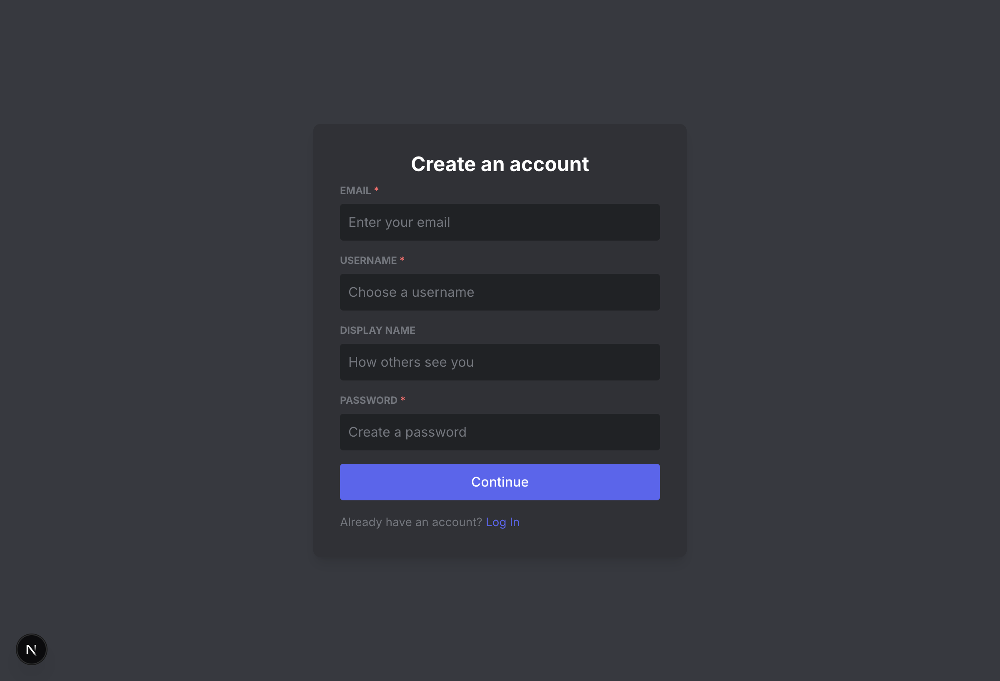

2. Type a valid email.
   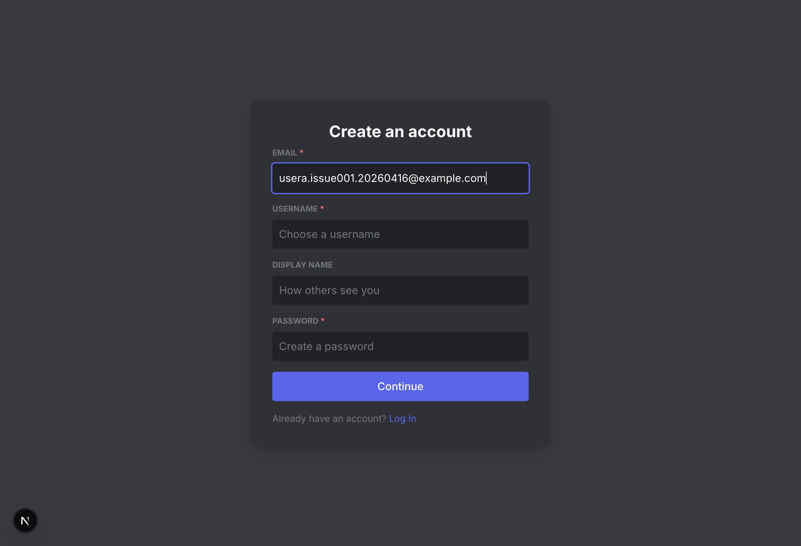

3. Type a valid username.
   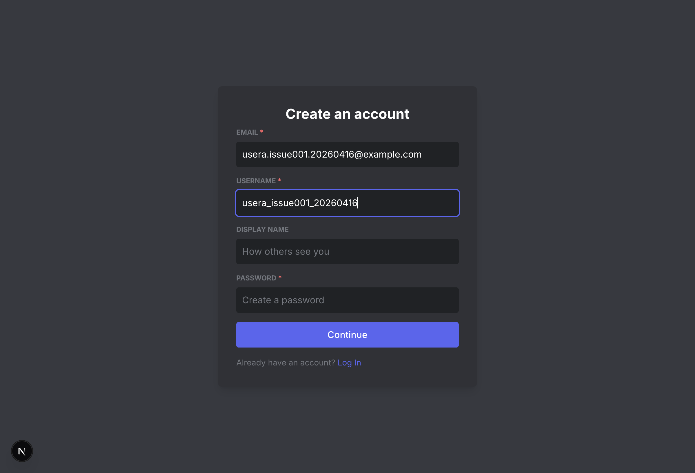

4. Type a valid password.
   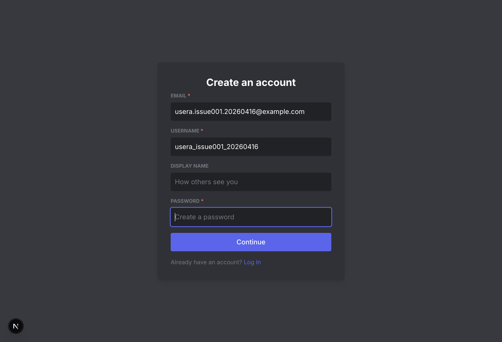

5. Click **Continue**.
   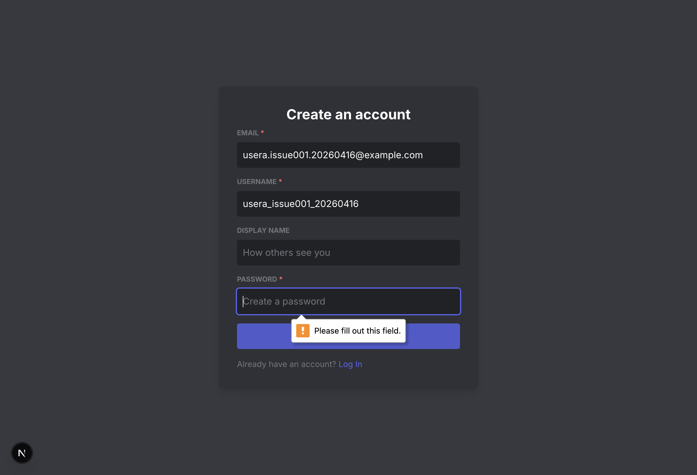

6. **Observe:** still on sign-up page; no auth request and no user feedback.
   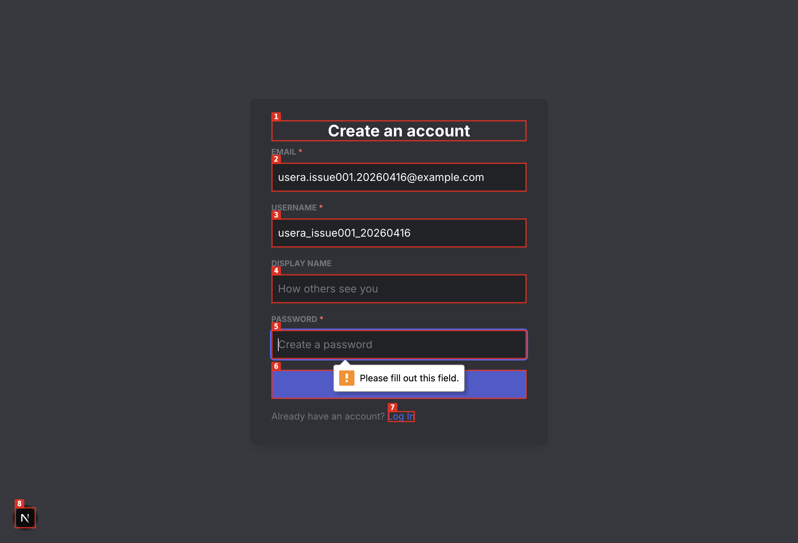

---

### ISSUE-002: Log-in form submit is a no-op (no auth attempt, no feedback)

| Field | Value |
|-------|-------|
| **Severity** | high |
| **Category** | functional |
| **URL** | http://localhost:3000/auth/login |
| **Repro Video** | videos/issue-002-repro.webm |

**Description**

Submitting the login form does nothing. The page remains on `/auth/login`, no success/error state appears, and no auth/login network request is made. Returning users cannot sign in.

**Repro Steps**

1. Open `http://localhost:3000/auth/login`.
   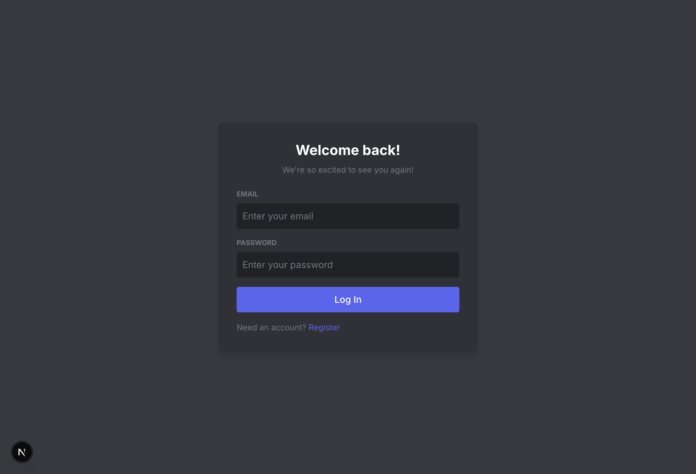

2. Type email.
   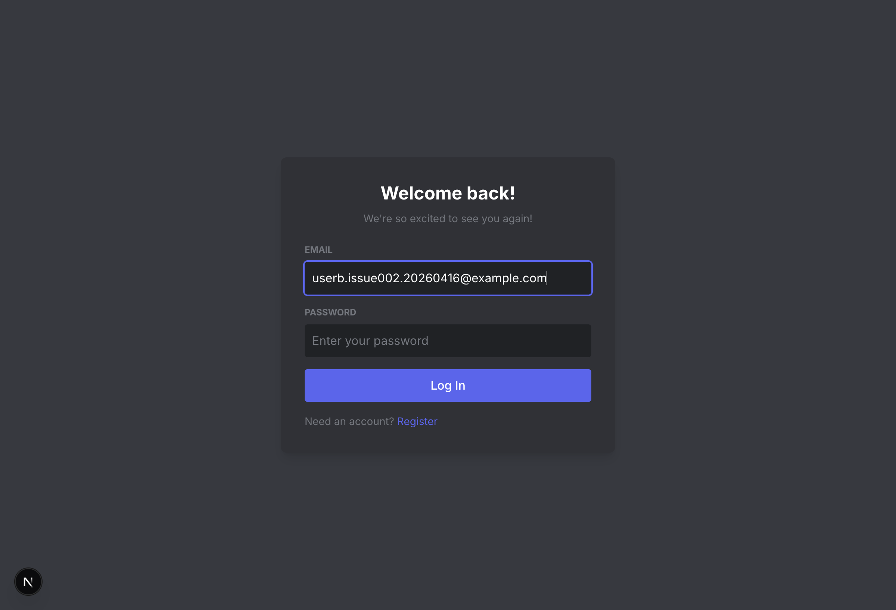

3. Type password.
   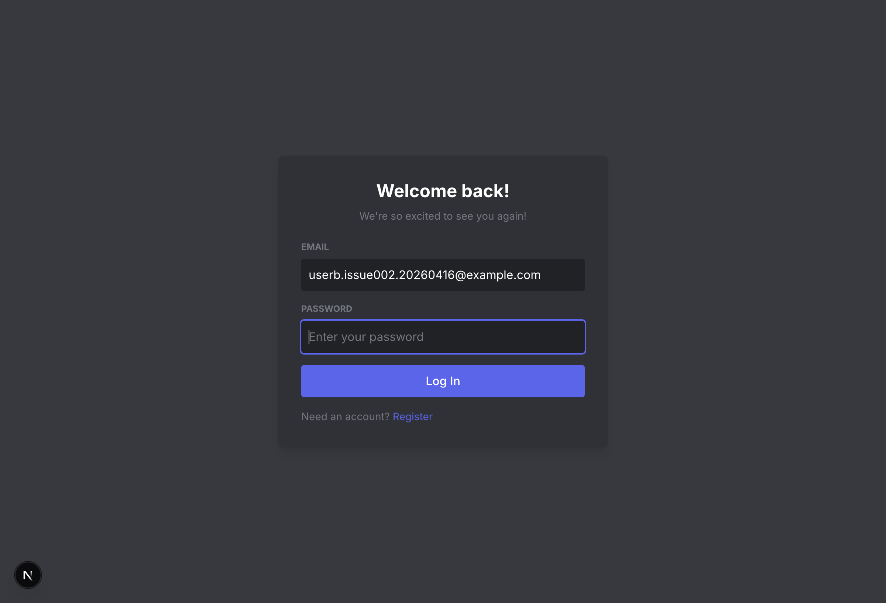

4. Click **Log In**.
   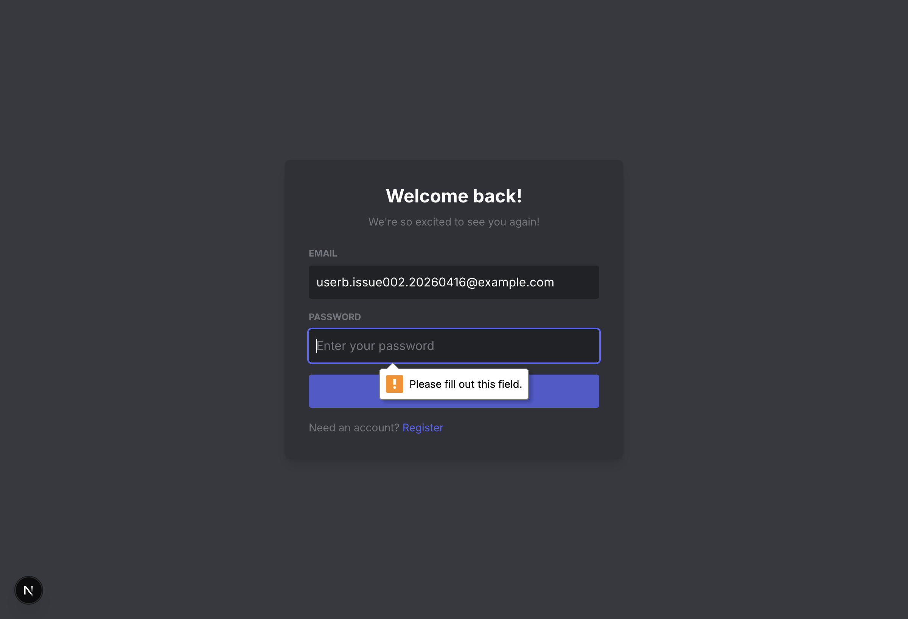

5. **Observe:** still on login page; no auth request and no user feedback.
   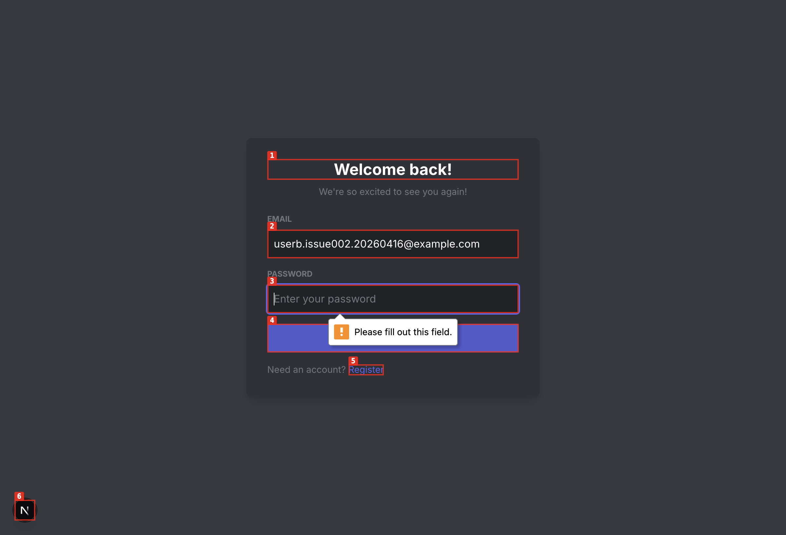

---

### ISSUE-003: Empty DB still renders hardcoded public channel shell while console reports tRPC query failure

| Field | Value |
|-------|-------|
| **Severity** | medium |
| **Category** | console |
| **URL** | http://localhost:3000/c/harmony-hq/general |
| **Repro Video** | N/A |

**Description**

With no seeded data, loading `/c/harmony-hq/general` still renders a “Harmony HQ / #general” shell while the console logs `tRPC query failed`. Expected behavior is a consistent empty/not-found experience without backend query-failure warnings.

**Repro Steps**

1. Open `http://localhost:3000/c/harmony-hq/general` in an empty database environment.
   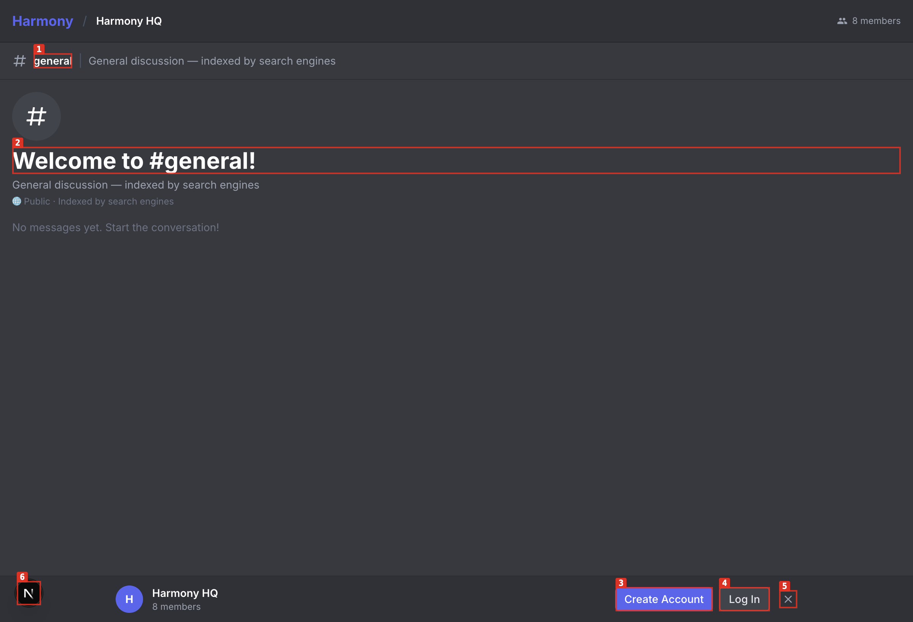

2. Check console output and observe warning: `tRPC query failed`.
   Artifact: `screenshots/issue-003-console.txt`

---
