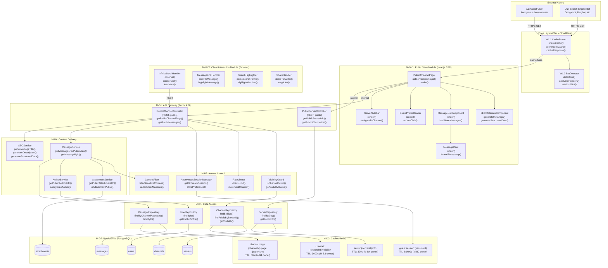
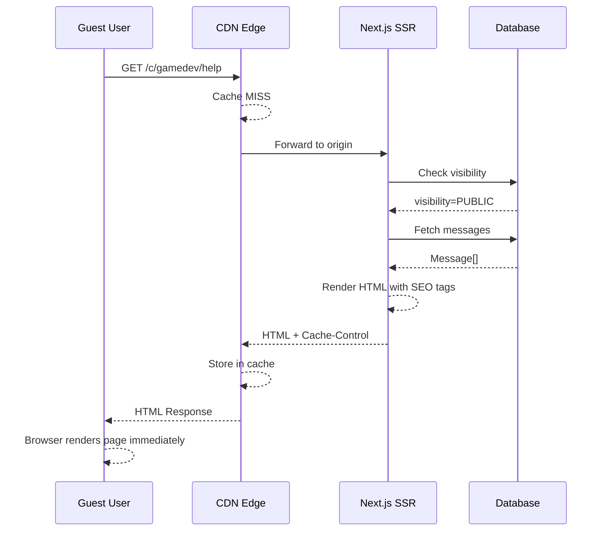
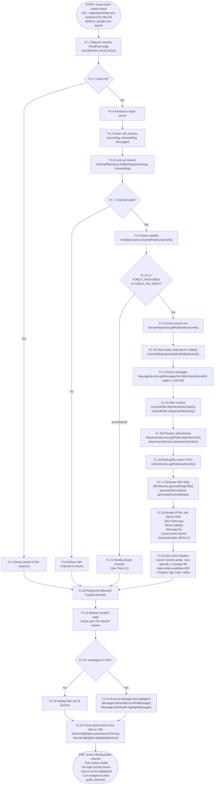
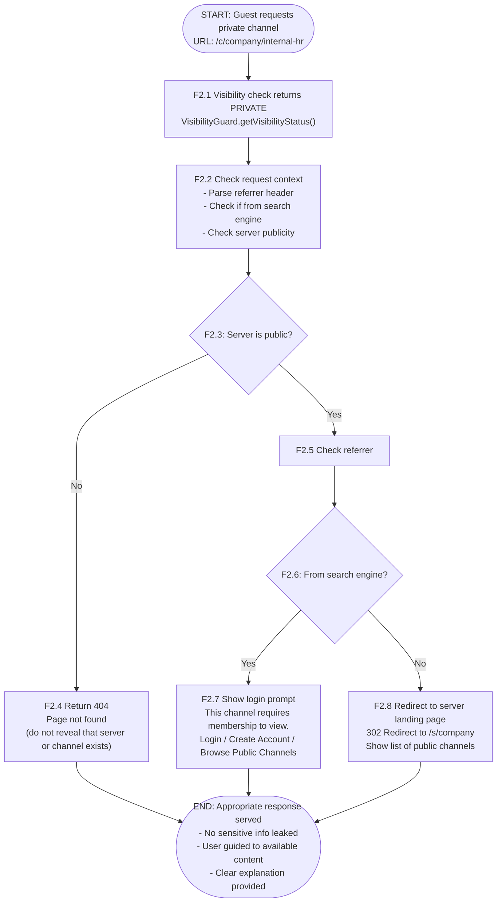

# Codex Conversation Export

## Metadata

- Thread ID: 019d554f-3478-7ef0-96b9-889893462a57
- Timestamp: 2026-04-03T21:45:47.385Z
- CWD: /Users/allen/.codex/worktrees/801b/Harmony
- Source: vscode
- Model Provider: openai
- Model: gpt-5.4
- Reasoning Effort: high
- Rollout Path: /Users/allen/.codex/sessions/2026/04/03/rollout-2026-04-03T17-45-47-019d554f-3478-7ef0-96b9-889893462a57.jsonl

## Transcript

### Turn 1: Complete this issue

#### 👤 User Prompt

- Time: 2026-04-03T21:45:48.944Z

```text
Complete this issue https://github.com/acabrera04/Harmony/issues/290
```

#### 🤖 gpt-5.4 (high)

- Time: 2026-04-03T21:45:58.891Z

I’m pulling the issue details and the repo workflow first, then I’ll trace the affected code paths and implement the fix behind tests.

#### Tool: exec_command

```sh
rtk read WORKFLOW.md
```

Output:

````text
## Workflow Orchestration
### 1. Plan Mode Default
- Enter plan mode for ANY non-trivial task (3+ steps or architectural decisions)
- If something goes sideways, STOP and re-plan immediately - don't keep pushing
- Use plan mode for verification steps, not just building
- Write detailed specs upfront to reduce ambiguity

### 2. Subagent Strategy
- Use subagents liberally to keep main context window clean 
- Offload research, exploration, and parallel analysis to subagents
- For complex problems, throw more compute at it via subagents
- One task per subagent for focused execution

### 3. Self-Improvement Loop 
- After ANY correction from the user: update `tasks/lessons.md` with the pattern
- Write rules for yourself that prevent the same mistake
- Ruthlessly iterate on these lessons until mistake rate drops
- Review lessons at session start for relevant project

### 4. Verification Before Done
- Never mark a task complete without proving it works
- Diff behavior between main and your changes when relevant
- Ask yourself: "Would a staff engineer approve this?"
- Run tests, check logs, demonstrate correctness

### 5. Demand Elegance (Balanced)
- For non-trivial changes: pause and ask "is there a more elegant way?"
- If a fix feels hacky: "Knowing everything I know now, implement the elegant solution"
- Skip this for simple, obvious fixes - don't over-engineer
- Challenge your own work before presenting it

### 6. Autonomous Bug Fixing
- When given a bug report: just fix it. Don't ask for hand-holding
- Point at logs, errors, failing tests - then resolve them
- Zero context switching required from the user
- Go fix failing CI tests without being told how

## Task Management
This project uses a **hybrid approach**: `tasks/todo.md` for AI context, GitHub Issues as the canonical tracker on the Harmony Project Board (course requirement).

1. **Plan First**: Write plan to `tasks/todo.md` with checkable items (local scratch pad for AI context)
2. **Identify the Issue**: If the task maps to an existing GitHub Issue, note the issue number at the top of `tasks/todo.md`
3. **Announce Start**: Post an opening comment to the issue — `gh issue comment <number> --body "..."` — describing what will be done
4. **Track Progress**: Mark items complete in `tasks/todo.md` as you go; post a comment to the issue at meaningful milestones (e.g., after a major step or when blocked)
5. **Explain Changes**: High-level summary at each step
6. **Document Results**: Add a review section to `tasks/todo.md` and post a final summary comment to the issue when complete
7. **Capture Lessons**: Update `tasks/lessons.md` after corrections. Post the new lessons learned as a comment to the issue.

### Issue Comment Format
Use this structure for issue comments to keep the audit trail readable:

```
**[AI Agent — <Step>]**

<What was done or decided>

<Any blockers, decisions, or next steps>
```

Example steps: `Starting`, `In Progress`, `Blocked`, `Complete`

## Core Principles
- **Simplicity First**: Make every change as simple as possible. Impact minimal code.
- **No Laziness**: Find root causes. No temporary fixes. Senior developer standards.
- **Minimal Impact**: Changes should only touch what's necessary. Avoid introducing bugs.
- **Lean Context Files**: Keep AGENTS.md and similar files to only non-obvious, non-discoverable essentials. Research shows context file bloat decreases task success rates and increases inference cost by 20%+ with 2–4 extra steps per task (Gloaguen et al., 2026).

#### Taken from https://x.com/mdancho84/status/2023738764841894352

Gloaguen, T., Mündler, N., Müller, M., Raychev, V., & Vechev, M. (2026, February 12). Evaluating AGENTS.MD: Are Repository-Level context Files helpful for coding agents? arXiv.org. https://arxiv.org/abs/2602.11988
````

#### Tool: exec_command

```sh
rtk read /Users/allen/.agents/skills/tdd-workflow/SKILL.md
```

Output:

````text
---
name: tdd-workflow
description: Use this skill when writing new features, fixing bugs, or refactoring code. Enforces test-driven development with 80%+ coverage including unit, integration, and E2E tests.
origin: ECC
---

# Test-Driven Development Workflow

This skill ensures all code development follows TDD principles with comprehensive test coverage.

## When to Activate

- Writing new features or functionality
- Fixing bugs or issues
- Refactoring existing code
- Adding API endpoints
- Creating new components

## Core Principles

### 1. Tests BEFORE Code
ALWAYS write tests first, then implement code to make tests pass.

### 2. Coverage Requirements
- Minimum 80% coverage (unit + integration + E2E)
- All edge cases covered
- Error scenarios tested
- Boundary conditions verified

### 3. Test Types

#### Unit Tests
- Individual functions and utilities
- Component logic
- Pure functions
- Helpers and utilities

#### Integration Tests
- API endpoints
- Database operations
- Service interactions
- External API calls

#### E2E Tests (Playwright)
- Critical user flows
- Complete workflows
- Browser automation
- UI interactions

## TDD Workflow Steps

### Step 1: Write User Journeys
```
As a [role], I want to [action], so that [benefit]

Example:
As a user, I want to search for markets semantically,
so that I can find relevant markets even without exact keywords.
```

### Step 2: Generate Test Cases
For each user journey, create comprehensive test cases:

```typescript
describe('Semantic Search', () => {
  it('returns relevant markets for query', async () => {
  })

  it('handles empty query gracefully', async () => {
  })

  it('falls back to substring search when Redis unavailable', async () => {
  })

  it('sorts results by similarity score', async () => {
  })
})
```

### Step 3: Run Tests (They Should Fail)
```bash
npm test
# Tests should fail - we haven't implemented yet
```

### Step 4: Implement Code
Write minimal code to make tests pass:

```typescript
export async function searchMarkets(query: string) {
}
```

### Step 5: Run Tests Again
```bash
npm test
# Tests should now pass
```

### Step 6: Refactor
Improve code quality while keeping tests green:
- Remove duplication
- Improve naming
- Optimize performance
- Enhance readability

### Step 7: Verify Coverage
```bash
npm run test:coverage
# Verify 80%+ coverage achieved
```

## Testing Patterns

### Unit Test Pattern (Jest/Vitest)
```typescript
import { render, screen, fireEvent } from '@testing-library/react'
import { Button } from './Button'

describe('Button Component', () => {
  it('renders with correct text', () => {
    render(<Button>Click me</Button>)
    expect(screen.getByText('Click me')).toBeInTheDocument()
  })

  it('calls onClick when clicked', () => {
    const handleClick = jest.fn()
    render(<Button onClick={handleClick}>Click</Button>)

    fireEvent.click(screen.getByRole('button'))

    expect(handleClick).toHaveBeenCalledTimes(1)
  })

  it('is disabled when disabled prop is true', () => {
    render(<Button disabled>Click</Button>)
    expect(screen.getByRole('button')).toBeDisabled()
  })
})
```

### API Integration Test Pattern
```typescript
import { NextRequest } from 'next/server'
import { GET } from './route'

describe('GET /api/markets', () => {
  it('returns markets successfully', async () => {
    const request = new NextRequest('http://localhost/api/markets')
    const response = await GET(request)
    const data = await response.json()

    expect(response.status).toBe(200)
    expect(data.success).toBe(true)
    expect(Array.isArray(data.data)).toBe(true)
  })

  it('validates query parameters', async () => {
    const request = new NextRequest('http://localhost/api/markets?limit=invalid')
    const response = await GET(request)

    expect(response.status).toBe(400)
  })

  it('handles database errors gracefully', async () => {
    const request = new NextRequest('http://localhost/api/markets')
  })
})
```

### E2E Test Pattern (Playwright)
```typescript
import { test, expect } from '@playwright/test'

test('user can search and filter markets', async ({ page }) => {
  await page.goto('/')
  await page.click('a[href="/markets"]')

  await expect(page.locator('h1')).toContainText('Markets')

  await page.fill('input[placeholder="Search markets"]', 'election')

  await page.waitForTimeout(600)

  const results = page.locator('[data-testid="market-card"]')
  await expect(results).toHaveCount(5, { timeout: 5000 })

  const firstResult = results.first()
  await expect(firstResult).toContainText('election', { ignoreCase: true })

  await page.click('button:has-text("Active")')

  await expect(results).toHaveCount(3)
})

test('user can create a new market', async ({ page }) => {
  await page.goto('/creator-dashboard')

  await page.fill('input[name="name"]', 'Test Market')
  await page.fill('textarea[name="description"]', 'Test description')
  await page.fill('input[name="endDate"]', '2025-12-31')

  await page.click('button[type="submit"]')

  await expect(page.locator('text=Market created successfully')).toBeVisible()

  await expect(page).toHaveURL(/\/markets\/test-market/)
})
```

## Test File Organization

```
src/
├── components/
│   ├── Button/
│   │   ├── Button.tsx
│   │   ├── Button.test.tsx          # Unit tests
│   │   └── Button.stories.tsx       # Storybook
│   └── MarketCard/
│       ├── MarketCard.tsx
│       └── MarketCard.test.tsx
├── app/
│   └── api/
│       └── markets/
│           ├── route.ts
│           └── route.test.ts         # Integration tests
└── e2e/
    ├── markets.spec.ts               # E2E tests
    ├── trading.spec.ts
    └── auth.spec.ts
```

## Mocking External Services

### Supabase Mock
```typescript
jest.mock('@/lib/supabase', () => ({
  supabase: {
    from: jest.fn(() => ({
      select: jest.fn(() => ({
        eq: jest.fn(() => Promise.resolve({
          data: [{ id: 1, name: 'Test Market' }],
          error: null
        }))
      }))
    }))
  }
}))
```

### Redis Mock
```typescript
jest.mock('@/lib/redis', () => ({
  searchMarketsByVector: jest.fn(() => Promise.resolve([
    { slug: 'test-market', similarity_score: 0.95 }
  ])),
  checkRedisHealth: jest.fn(() => Promise.resolve({ connected: true }))
}))
```

### OpenAI Mock
```typescript
jest.mock('@/lib/openai', () => ({
  generateEmbedding: jest.fn(() => Promise.resolve(
    new Array(1536).fill(0.1) // Mock 1536-dim embedding
  ))
}))
```

## Test Coverage Verification

### Run Coverage Report
```bash
npm run test:coverage
```

### Coverage Thresholds
```json
{
  "jest": {
    "coverageThresholds": {
      "global": {
        "branches": 80,
        "functions": 80,
        "lines": 80,
        "statements": 80
      }
    }
  }
}
```

## Common Testing Mistakes to Avoid

### ❌ WRONG: Testing Implementation Details
```typescript
expect(component.state.count).toBe(5)
```

### ✅ CORRECT: Test User-Visible Behavior
```typescript
expect(screen.getByText('Count: 5')).toBeInTheDocument()
```

### ❌ WRONG: Brittle Selectors
```typescript
await page.click('.css-class-xyz')
```

### ✅ CORRECT: Semantic Selectors
```typescript
await page.click('button:has-text("Submit")')
await page.click('[data-testid="submit-button"]')
```

### ❌ WRONG: No Test Isolation
```typescript
```

### ✅ CORRECT: Independent Tests
```typescript
test('creates user', () => {
  const user = createTestUser()
})

test('updates user', () => {
  const user = createTestUser()
})
```

## Continuous Testing

### Watch Mode During Development
```bash
npm test -- --watch
# Tests run automatically on file changes
```

### Pre-Commit Hook
```bash
# Runs before every commit
npm test && npm run lint
```

### CI/CD Integration
```yaml
# GitHub Actions
- name: Run Tests
  run: npm test -- --coverage
- name: Upload Coverage
  uses: codecov/codecov-action@v3
```

## Best Practices

1. **Write Tests First** - Always TDD
2. **One Assert Per Test** - Focus on single behavior
3. **Descriptive Test Names** - Explain what's tested
4. **Arrange-Act-Assert** - Clear test structure
5. **Mock External Dependencies** - Isolate unit tests
6. **Test Edge Cases** - Null, undefined, empty, large
7. **Test Error Paths** - Not just happy paths
8. **Keep Tests Fast** - Unit tests < 50ms each
9. **Clean Up After Tests** - No side effects
10. **Review Coverage Reports** - Identify gaps

## Success Metrics

- 80%+ code coverage achieved
- All tests passing (green)
- No skipped or disabled tests
- Fast test execution (< 30s for unit tests)
- E2E tests cover critical user flows
- Tests catch bugs before production

---

**Remember**: Tests are not optional. They are the safety net that enables confident refactoring, rapid development, and production reliability.
````

#### Tool: mcp__codex_apps__github_fetch_issue

```json
{
  "issue_number": 290,
  "repo": "acabrera04/Harmony"
}
```

Output:

```text
{"issue":{"url":"https://github.com/acabrera04/Harmony/issues/290","title":"Unit Tests — publicApiService.ts (frontend)","issue_number":290,"body":"## Description\nImplement Jest unit tests for `harmony-frontend/src/services/publicApiService.ts` based on the test specification for the guest public channel view path.\n\n## Requirements\n- Test file: `harmony-frontend/src/__tests__/publicApiService.test.ts`\n- Mock `fetch` and React `cache`\n- Verify no duplicate or overlapping test cases\n- Cover `fetchPublicServer`, `fetchPublicChannel`, `fetchPublicMessages`, and `isChannelGuestAccessible`\n- Cover helper mapping behavior for channel type and visibility conversion\n- Run tests locally and capture coverage\n- Ensure tests reflect the intended guest-access semantics from `docs/dev-spec-guest-public-channel-view.md`\n\n## Acceptance Criteria\n- [ ] All functions from the spec have at least one test\n- [ ] No hallucinated test cases for non-existent functionality\n- [ ] No duplicate or significantly overlapping tests\n- [ ] All tests pass locally\n- [ ] 80%+ code coverage for `publicApiService.ts`\n- [ ] Tests are isolated — no backend network calls leave the test process\n\n**Sprint:** 3 (P5 Testing)\n**Depends on:** #289\n**Context:** Needed to cover the implemented Guest Public Channel View user story.\n","user":{"login":"acabrera04","name":"acabrera04","email":null,"avatar_url":"https://avatars.githubusercontent.com/u/145043651?v=4","id":145043651},"display_url":"https://github.com/acabrera04/Harmony/issues/290","display_title":"Unit Tests — publicApiService.ts (frontend)"},"url":"https://github.com/acabrera04/Harmony/issues/290","title":"Unit Tests — publicApiService.ts (frontend)","display_url":"https://github.com/acabrera04/Harmony/issues/290","display_title":"Unit Tests — publicApiService.ts (frontend)"}
```

#### 🤖 gpt-5.4 (high)

- Time: 2026-04-03T21:46:11.286Z

I’ve got the issue scope. Next I’m reading the spec, the target service, the existing test setup, and the local task files so I can add only the coverage this issue actually requires.

#### Tool: exec_command

```sh
rtk read tasks/lessons.md
```

Output:

```text
# Lessons Learned

Shared knowledge base for the Harmony team. Add an entry whenever a mistake is caught, a better approach is discovered, or an AI agent is corrected.

---

## Template

**Date:** YYYY-MM-DD  
**Caught by:** [Human: @username] or [AI Agent: Copilot/Cursor]  
**Related Issue:** #<number> (optional)  
**Mistake / Situation:** One sentence describing what went wrong or what was unclear.  
**Rule / Fix:** The actionable rule derived — written so it prevents the same mistake next time.

---

## Log

<!-- Most recent entries at the top -->
```

#### Tool: exec_command

```sh
rtk read tasks/todo.md
```

Output:

```text
Error: Failed to read file: tasks/todo.md

Caused by:
    No such file or directory (os error 2)
```

#### Tool: exec_command

```sh
rtk read docs/dev-spec-guest-public-channel-view.md
```

Output:

````text
Total output lines: 1934

# Development Specification: Guest Public Channel View

## Feature: Anonymous Access to Public Channel Content

**User Story:** As a Guest User (Searcher), I want to view the full contents of a public channel via a direct URL without being prompted to log in, so that I can get the answer to my specific question immediately without the friction of creating an account I might only use once.

> **Unified Backend Reference:** This feature's backend classes are part of the shared Harmony backend defined in [`unified-backend-architecture.md`](./unified-backend-architecture.md). The mapping from this spec's class labels to the unified module labels is in §10 of that document. Key modules contributed by this feature: **M-B2** (Access Control), **M-B4** (Content Delivery), **M-D1** (Data Access, shared).

---

## 1. Header

### Version and Date

| Version | Date       | Description                              |
|---------|------------|------------------------------------------|
| 1.0     | 2026-02-12 | Initial development specification        |
| 2.0     | 2026-02-15 | Cross-spec consolidation: label fixes, cache key alignment, convention standardization |

### Author and Role

| Author        | Role                    | Version |
|---------------|-------------------------|---------|
| Claude (AI)   | Specification Author    | 1.0, 2.0 |
| dblanc        | Project Lead            | 1.0     |
| Aiden-Barrera | Project Member          | 2.0     |

---

## 2. Architecture Diagram

### 2.1 System Overview



> **Note:** All cache keys use UUID-based identifiers (e.g., `channel:{channelId}:visibility`) for consistency across all Harmony specs.

### 2.2 Information Flow Summary

| Flow ID | Source | Destination | Data | Protocol |
|---------|--------|-------------|------|----------|
| F1 | A1 Guest User | W1.1 CacheRouter | HTTP GET Request | HTTPS |
| F2 | W1.1 CacheRouter | C1.1 PublicChannelPage | Cache Miss Forward | HTTPS |
| F3 | C1.1 PublicChannelPage | C3.1 PublicChannelController | Channel Data Request | Internal |
| F4 | C3.1 PublicChannelController | C4.1 VisibilityGuard | Visibility Check | Internal |
| F5 | C4.1 VisibilityGuard | C6.1 ChannelRepository | Database Query | Internal |
| F6 | C3.1 PublicChannelController | C5.1 MessageService | Message Fetch | Internal |
| F7 | C5.1 MessageService | C6.2 MessageRepository | Paginated Query | Internal |
| F8 | C5.4 SEOService | C1.2 SEOMetadataComponent | SEO Data | Internal |
| F9 | C1.1 PublicChannelPage | W1.1 CacheRouter | Rendered HTML | HTTPS |
| F10 | W1.1 CacheRouter | A1 Guest User | Cached/Fresh Response | HTTPS |

### 2.3 Request Path Diagram



### 2.4 Rationale

The archtecture diagram is justified because client server split abstracts from the guest the authorization logic the server handles and caching requests significantly helps with performance for storing the same content that will be served to many users. Furthermore, the importance of authorization lies in the fact whether a channel is public or not, to make sure guests can't see private channels. 

---

## 3. Class Diagram

```mermaid
classDiagram
    class IPublicContentProvider {
        <<interface>>
        +getPublicContent()
        +isAccessible()
        +getMetadata()
    }

    class PublicChannelProvider {
        -channelRepo
        -visibilityGuard
        +getPublicContent()
        +isAccessible()
        +getMetadata()
    }

    class PublicMessageProvider {
        -messageRepo
        -contentFilter
        +getPublicContent()
        +isAccessible()
        +getMetadata()
    }

    class PublicServerProvider {
        -serverRepo
        -channelRepo
        +getPublicContent()
        +isAccessible()
        +getMetadata()
    }

    class VisibilityGuard {
        -channelRepo
        -cache
        +isChannelPublic()
        +isServerPublic()
        +getVisibilityStatus()
    }

    class ContentFilter {
        -patterns
        +filterSensitiveContent()
        +redactUserMentions()
        +sanitizeForDisplay()
        +sanitizeAttachments()
    }

    class PublicChannelPage {
        <<React Component>>
        +serverSlug string
        +channelSlug string
        +initialData PageData
        +getServerSideProps()
        +render()
    }

    class SEOMetadataComponent {
        +title string
        +description string
        +canonicalUrl string
        +generateMetaTags()
        +generateStructuredData()
    }

    class MessageListComponent {
        +messages Message[]
        +hasMore boolean
        +render()
        +loadMoreMessages()
        +scrollToMessage()
    }

    class GuestPromoBanner {
        +s…14311 tokens truncated… (client-side only) | Not sent to server | Client-side only; not logged |

### 12.2 Long-Term Stored PII Exposure

| PII Type | Stored Location | Exposure in Public View | Mitigation |
|----------|-----------------|------------------------|------------|
| User ID | D7.3 Messages.author_id | NOT exposed in PublicAuthorDTO | Stripped at AuthorService layer |
| Username | D7.4 Users.username | NOT exposed | Only display_name shown |
| Display Name | D7.4 Users.display_name | Exposed (user's choice) | User can opt out via public_profile |
| Avatar URL | D7.4 Users.avatar_url | Exposed (user's choice) | User can opt out via public_profile |
| Message Content | D7.3 Messages.content | Exposed (in public channels) | Content filter applied |

### 12.3 Privacy Controls

**User Privacy Settings:**
- `public_profile` flag: If false, author shown as "Anonymous" in public views
- Users can delete messages (soft delete, not shown in public view)
- Users can edit messages (edited_at shown in public view)

**Content Filtering:**
- @mentions of users with `public_profile=false` are redacted
- Email addresses detected and redacted
- Phone numbers detected and redacted
- Private channel links filtered out

### 12.4 Data Flow for Public View

```mermaid
flowchart LR
    subgraph DB["Database"]
        MsgTable["Messages table\n(id, channel_id, author_id,\ncontent, created_at, is_deleted)"]
        UsersTable["Users table\n(id, username, display_name,\navatar_url, public_profile)"]
    end

    subgraph Server["Server"]
        MsgService["MessageService\n- id → kept\n- channel_id → filtered out\n- author_id → lookup user\n- content → filter content\n- created_at → kept\n- is_deleted → if true, skip"]
        AuthService["AuthorService\n- id → NOT exposed\n- username → NOT exposed\n- display_name → getDisplayName()\n- avatar_url → if public_profile=true\n- public_profile → check flag\n\nIf public_profile=false:\n  displayName='Anonymous'\n  avatarUrl=null"]
    end

    subgraph Client["Client"]
        MsgDTO["PublicMessageDTO\n(id, content, timestamp,\nauthor: PublicAuthorDTO)"]
        AuthorDTO["PublicAuthorDTO\n(displayName, avatarUrl)\n[no userId exposed]"]
    end

    MsgTable --> MsgService --> MsgDTO
    UsersTable --> AuthService --> AuthorDTO
    MsgService --> AuthService
```

### 12.5 Security Headers

```
X-Content-Type-Options: nosniff
X-Frame-Options: SAMEORIGIN
X-XSS-Protection: 1; mode=block
Content-Security-Policy: default-src 'self'; script-src 'self' 'unsafe-inline'; style-src 'self' 'unsafe-inline'; img-src 'self' data: https:;
Referrer-Policy: strict-origin-when-cross-origin
Permissions-Policy: geolocation=(), microphone=(), camera=()
```

### 12.6 Bot and Abuse Protection

| Protection | Implementation | Threshold |
|------------|----------------|-----------|
| Rate Limiting | Token bucket per IP | 100 req/min for humans, 1000 req/min for verified bots |
| Bot Detection | User-Agent analysis | Verified bots whitelisted |
| Scraping Prevention | CAPTCHA on suspicious patterns | After 500 page views/hour |
| DDoS Protection | CloudFlare WAF | Automatic |

### 12.7 Customer-Visible Privacy Policy Points

- Messages in public channels are visible to anyone, including search engines
- Your display name and avatar appear with your messages in public channels
- You can opt out of public display by setting your profile to private
- We do not track or store identifying information about anonymous viewers
- Search engines may cache public content; cached content remains after channel is made private

### 12.8 Guest User Restrictions

| Action | Allowed | Notes |
|--------|---------|-------|
| View public channel messages | Yes | Core feature |
| View public channel attachments | Yes | If attachment is in a public channel |
| Navigate between public channels | Yes | Via server sidebar |
| Copy message permalink | Yes | Client-side only |
| Share message/channel link | Yes | Client-side only |
| Send messages | No | Requires authentication |
| React to messages | No | Requires authentication |
| View private channels | No | Returns 403/404 |
| View member list | No | Privacy protection |
| Access user profiles | No | Only public display name and avatar shown inline |
| Download message history | No | Not exposed to guests |
| Use search within channel | No | Not available for guests (future feature) |

### 12.9 Rationale 

The security and privacy answers obvious concerns for handling messages that are publicily accessible to anyone. The restriction on guest users are enforced for security purposes such as not being able to interact with the channel without verifying who you are, meaning public channels are read only. Privacy purposes users who send messages in public channels can opt out of revealing their profile information and instead have it be anonymous. 

---

## 13. Risks to Completion

### 13.1 Technology Risks

| Technology | Learning Curve | Design Difficulty | Implementation | Verification | Maintenance |
|------------|----------------|-------------------|----------------|--------------|-------------|
| T3: Next.js SSR | Medium | Medium | Medium | Medium | Medium |
| T11: CloudFlare Edge | Medium | High | Medium | High | Low |
| T17: sanitize-html | Low | Low | Low | Medium | Low |
| T18: schema-dts | Low | Medium | Low | Medium | Low |
| T20: sharp | Low | Low | Low | Low | Low |
| T21: Lighthouse CI | Medium | Low | Medium | N/A | Low |

### 13.2 Component Risks

| Component | Risk | Mitigation |
|-----------|------|------------|
| SSR Performance | Slow TTFB affects SEO | Edge caching; ISR; streaming |
| Content Filtering | Regex performance on large content | Timeouts; message size limits |
| Infinite Scroll | SEO crawlers can't follow | Pagination fallback links; sitemap |
| Cache Invalidation | Stale content shown | Short TTLs; explicit invalidation |
| Bot Detection | False positives block real users | Verify bot list; appeal process |

### 13.3 SEO-Specific Risks

| Risk | Impact | Mitigation |
|------|--------|------------|
| JavaScript-dependent content | Crawlers may not execute JS | SSR for all content |
| Slow page load | Poor Core Web Vitals | Edge caching; image optimization |
| Duplicate content | Ranking penalty | Canonical URLs; proper pagination |
| Thin content pages | Not indexed | Minimum message threshold for indexing |
| Frequent content changes | Crawl budget waste | Last-modified headers; sitemap priority |

### 13.4 Off-the-Shelf Considerations

| Technology | Customization | Source | Support | Cost |
|------------|---------------|--------|---------|------|
| Next.js | SSR config, caching | Open source | Vercel paid | Free |
| CloudFlare | Edge rules, workers | SaaS | Paid tiers | $20+/mo |
| sanitize-html | None needed | Open source | Community | Free |
| Lighthouse CI | Thresholds | Open source | Community | Free |

### 13.5 Contingency Plans

| Risk | Trigger | Contingency |
|------|---------|-------------|
| SSR overload | > 2s TTFB p95 | Increase ISR; reduce initial messages |
| Cache stampede | Origin overload on cache miss | Stale-while-revalidate; request coalescing |
| Privacy incident | PII leaked in public view | Immediate hotfix; user notification |
| SEO ranking drop | > 20% traffic decrease | Audit with Search Console; fix issues |

### 13.6 Rationale 

The risks to completion covers the fact that an assessment was done on the tech stack chosen for learning curve, maintainability, and long term viability. The technology chosen are well documentated and have ongoing support, reducing any future risk for developing Harmony. 

---

## Appendix A: SEO Optimization Checklist

### Page Structure
- [ ] Unique, descriptive `<title>` per page
- [ ] Meta description under 160 characters
- [ ] Canonical URL on every page
- [ ] Open Graph tags for social sharing
- [ ] Twitter Card tags
- [ ] JSON-LD structured data (DiscussionForumPosting)
- [ ] Breadcrumb schema

### Technical SEO
- [ ] Server-side rendering for all content
- [ ] Mobile-responsive design
- [ ] Fast TTFB (< 500ms)
- [ ] Core Web Vitals passing
- [ ] XML sitemap including all public channels
- [ ] robots.txt allowing crawlers
- [ ] Proper HTTP status codes (404 for missing, 403 for private)

### Content Accessibility
- [ ] All messages readable without JavaScript
- [ ] Pagination with `<link rel="next/prev">`
- [ ] Deep links to specific messages work
- [ ] Images have alt text
- [ ] Semantic HTML structure

---

## Appendix B: Glossary

| Term | Definition |
|------|------------|
| SSR | Server-Side Rendering - generating HTML on the server before sending to client |
| TTFB | Time to First Byte - time until browser receives first byte of response |
| ISR | Incremental Static Regeneration - Next.js feature for updating static pages |
| Hydration | Process of attaching JavaScript event handlers to server-rendered HTML |
| Core Web Vitals | Google's metrics for page experience (LCP, FID, CLS) |
| JSON-LD | JavaScript Object Notation for Linked Data - structured data format |
| Canonical URL | The preferred URL for a page to avoid duplicate content issues |
| Stale-While-Revalidate | Cache strategy serving stale content while fetching fresh |
| Edge Worker | Code running at CDN edge locations |
| Guest User | Anonymous visitor without an account |
| EventBus | Redis Pub/Sub messaging layer for cross-service event communication |
| tRPC | End-to-end typesafe API framework for TypeScript; used for authenticated internal APIs |
| Visibility Enum | `ChannelVisibility` enum with values: `PUBLIC_INDEXABLE`, `PUBLIC_NO_INDEX`, `PRIVATE` |

---

## Appendix C: Document References

- Dev Spec: Channel Visibility Toggle (cross-referenced for cache keys, ChannelRepository, EventBus, and `channels` table schema)
- Dev Spec: SEO Meta Tag Generation (cross-referenced for event integration and MetaTagService)
- Platform Architecture Overview (separate document)
- Harmony Security Policy (separate document)
````

#### Tool: exec_command

```sh
rtk read harmony-frontend/src/services/publicApiService.ts
```

Output:

```text
/**
 * publicApiService — server-side service for the backend public REST API.
 * Uses fetch (not the axios api-client) so it can be called from React Server
 * Components, generateMetadata, and other server-only contexts.
 * React `cache` is used for request deduplication within a single render pass.
 */

import { cache } from 'react';
import type { Server, Channel, Message } from '@/types';
import { ChannelType, ChannelVisibility } from '@/types';
import { API_CONFIG, CACHE_DURATION } from '@/lib/constants';

type PublicServer = Omit<Server, 'ownerId'>;

interface PublicServerResponse {
  id: string;
  name: string;
  slug: string;
  iconUrl?: string;
  description?: string;
  memberCount: number;
  createdAt: string;
}

interface PublicChannelResponse {
  id: string;
  name: string;
  slug: string;
  serverId: string;
  type: string;
  visibility: string;
  topic?: string | null;
  position: number;
  createdAt: string;
}

interface PublicMessageResponse {
  id: string;
  content: string;
  createdAt: string;
  editedAt?: string | null;
  author: { id: string; username: string };
}

interface PublicMessagesApiResponse {
  messages: PublicMessageResponse[];
  page: number;
  pageSize: number;
}

function mapChannelType(type: string): ChannelType {
  switch (type) {
    case 'VOICE':
      return ChannelType.VOICE;
    case 'ANNOUNCEMENT':
      return ChannelType.ANNOUNCEMENT;
    default:
      return ChannelType.TEXT;
  }
}

function mapChannelVisibility(visibility: string): ChannelVisibility {
  switch (visibility) {
    case 'PUBLIC_NO_INDEX':
      return ChannelVisibility.PUBLIC_NO_INDEX;
    case 'PRIVATE':
      return ChannelVisibility.PRIVATE;
    default:
      return ChannelVisibility.PUBLIC_INDEXABLE;
  }
}

/**
 * Fetch public server info by slug.
 * Returns null on any error or if the server is not found (404).
 * Deduplicated within a single render pass via React `cache`.
 */
export const fetchPublicServer = cache(async (serverSlug: string): Promise<PublicServer | null> => {
  try {
    const res = await fetch(
      `${API_CONFIG.BASE_URL}/api/public/servers/${encodeURIComponent(serverSlug)}`,
      { next: { revalidate: CACHE_DURATION.PUBLIC_API_REVALIDATE } },
    );
    if (!res.ok) return null;

    const data: PublicServerResponse = await res.json();
    const server: PublicServer = {
      id: data.id,
      name: data.name,
      slug: data.slug,
      icon: data.iconUrl,
      description: data.description,
      memberCount: data.memberCount,
      createdAt: data.createdAt,
    };
    return server;
  } catch {
    return null;
  }
});

/**
 * Fetch a single public channel by server slug + channel slug.
 * - Returns null if the server or channel does not exist (404).
 * - Returns `{ isPrivate: true }` if the channel is PRIVATE (403).
 * - Returns `{ channel, isPrivate: false }` on success (200).
 * Deduplicated within a single render pass via React `cache`.
 */
export const fetchPublicChannel = cache(
  async (
    serverSlug: string,
    channelSlug: string,
  ): Promise<{ channel: Channel; isPrivate: false } | { isPrivate: true } | null> => {
    try {
      const res = await fetch(
        `${API_CONFIG.BASE_URL}/api/public/servers/${encodeURIComponent(serverSlug)}/channels/${encodeURIComponent(channelSlug)}`,
        { next: { revalidate: CACHE_DURATION.PUBLIC_API_REVALIDATE } },
      );

      if (res.status === 404) return null;
      if (res.status === 403) return { isPrivate: true };
      if (!res.ok) return null;

      const data: PublicChannelResponse = await res.json();
      const channel: Channel = {
        id: data.id,
        name: data.name,
        slug: data.slug,
        serverId: data.serverId,
        type: mapChannelType(data.type),
        visibility: mapChannelVisibility(data.visibility),
        topic: data.topic ?? undefined,
        position: data.position,
        createdAt: data.createdAt,
      };
      return { channel, isPrivate: false };
    } catch {
      return null;
    }
  },
);

/**
 * Fetch paginated public messages for a channel.
 * Returns an empty list on error.
 */
export async function fetchPublicMessages(
  channelId: string,
  page = 1,
): Promise<{ messages: Message[]; hasMore: boolean }> {
  try {
    const res = await fetch(
      `${API_CONFIG.BASE_URL}/api/public/channels/${encodeURIComponent(channelId)}/messages?page=${page}`,
    );
    if (!res.ok) return { messages: [], hasMore: false };

    const data: PublicMessagesApiResponse = await res.json();
    const messages: Message[] = data.messages.map(m => ({
      id: m.id,
      channelId,
      authorId: m.author.id,
      author: { id: m.author.id, username: m.author.username },
      content: m.content,
      timestamp: m.createdAt,
      editedAt: m.editedAt ?? undefined,
    }));
    return { messages, hasMore: messages.length >= data.pageSize };
  } catch {
    return { messages: [], hasMore: false };
  }
}

/**
 * Returns true if the channel is publicly accessible (not PRIVATE and not missing).
 */
export async function isChannelGuestAccessible(
  serverSlug: string,
  channelSlug: string,
): Promise<boolean> {
  const result = await fetchPublicChannel(serverSlug, channelSlug);
  return result !== null && !result.isPrivate;
}
```

#### Tool: exec_command

```sh
rtk grep -n "publicApiService|jest|vitest|testing-library" harmony-frontend --glob '!**/node_modules/**'
```

Output:

```text
🔍 692 in 16F:

📄 harmony-frontend/bun.lock (69):
    18: "@testing-library/jest-dom": "^6.9.1",
    19: "@testing-library/react": "^16.3.2",
    20: "@testing-library/user-event": "^14.6.1",
    21: "@types/jest": "^30.0.0",
    28: "jest": "^30.3.0",
    29: "jest-environment-jsdom": "^30.3.0",
    32: "ts-jest": "^29.4.6",
   214: "@jest/console": ["@jest/console@30.3.0", "", { "dependencies": { "@jest/type...
   216: "@jest/core": ["@jest/core@30.3.0", "", { "dependencies": { "@jest/console": ...
   218: "@jest/diff-sequences": ["@jest/diff-sequences@30.3.0", "", {}, "sha512-cG51M...
  +59

📄 harmony-frontend/jest.config.js (4):
     1: /** @type {import('ts-jest').JestConfigWithTsJest} */
     3: preset: 'ts-jest',
     4: testEnvironment: 'jest-environment-jsdom',
    12: 'ts-jest',

📄 harmony-frontend/package-lock.json (376):
    21: "@testing-library/jest-dom": "^6.9.1",
    22: "@testing-library/react": "^16.3.2",
    23: "@testing-library/user-event": "^14.6.1",
    24: "@types/jest": "^30.0.0",
    31: "jest": "^30.3.0",
    32: "jest-environment-jsdom": "^30.3.0",
    35: "ts-jest": "^29.4.6",
  1531: "node_modules/@jest/console": {
  1533: "resolved": "https://registry.npmjs.org/@jest/console/-/console-30.3.0.tgz",
  1538: "@jest/types": "30.3.0",
  +366

📄 harmony-frontend/package.json (8):
     9: "test": "jest --forceExit",
    25: "@testing-library/jest-dom": "^6.9.1",
    26: "@testing-library/react": "^16.3.2",
    27: "@testing-library/user-event": "^14.6.1",
    28: "@types/jest": "^30.0.0",
    35: "jest": "^30.3.0",
    36: "jest-environment-jsdom": "^30.3.0",
    39: "ts-jest": "^29.4.6",

📄 harmony-frontend/.../__tests__/VisibilityToggle.test.tsx (10):
    10: import { render, screen, fireEvent, act } from '@testing-library/react';
    11: import '@testing-library/jest-dom';
    17: const mockUpdateChannelVisibility = jest.fn();
    19: jest.mock('../app/settings/[serverSlug]/[channelSlug]/updateVisibility', () =...
    23: const mockShowToast = jest.fn();
    25: jest.mock('../hooks/useToast', () => ({
    28: dismissToast: jest.fn(),
    29: cancelAutoDismiss: jest.fn(),
    39: const onVisibilityChanged = jest.fn();
    61: jest.clearAllMocks();

📄 harmony-frontend/.../__tests__/channelService.test.ts (14):
     7: jest.mock('next/headers', () => ({
     8: cookies: jest.fn(),
    12: jest.mock('@/lib/trpc-client', () => ({
    13: publicGet: jest.fn(),
    14: trpcQuery: jest.fn(),
    15: trpcMutate: jest.fn(),
    29: jest.mock('react', () => ({
    46: const mockedPublicGet = jest.mocked(publicGet);
  +4

... +642
```

#### 🤖 gpt-5.4 (high)

- Time: 2026-04-03T21:46:16.899Z

I have the target service and spec. I’m setting the task record and then I’ll write failing tests first for the exact fetch and guest-access branches this issue calls out.

#### Tool: update_plan

- Explanation: Issue #290 is a bounded frontend testing task. I’ve read the repo workflow, issue requirements, and the target service; next is task tracking, test implementation, and verification.

- Plan:
  - [in_progress] Create/update local task tracking for issue #290 and record start on the GitHub issue
  - [pending] Inspect frontend test setup and write focused failing unit tests for publicApiService.ts
  - [pending] Run frontend formatter/tests/coverage and adjust until the issue requirements pass
  - [pending] Update task review notes and post completion summary to the GitHub issue

Output:

```text
Plan updated
```

#### Tool: exec_command

```sh
rtk git status --short
```

Output:

```text
ok ✓
```

#### Tool: exec_command

```sh
rtk read harmony-frontend/package.json
```

Output:

```text
{
  "name": "harmony-frontend",
  "version": "0.1.0",
  "private": true,
  "scripts": {
    "dev": "next dev",
    "build": "next build",
    "start": "next start",
    "test": "jest --forceExit",
    "lint": "eslint",
    "format": "prettier --write .",
    "format:check": "prettier --check ."
  },
  "dependencies": {
    "axios": "^1.13.5",
    "clsx": "^2.1.1",
    "next": "16.1.6",
    "react": "19.2.3",
    "react-dom": "19.2.3",
    "tailwind-merge": "^3.4.1",
    "twilio-video": "3.0.0-preview.3"
  },
  "devDependencies": {
    "@tailwindcss/postcss": "^4",
    "@testing-library/jest-dom": "^6.9.1",
    "@testing-library/react": "^16.3.2",
    "@testing-library/user-event": "^14.6.1",
    "@types/jest": "^30.0.0",
    "@types/node": "^20",
    "@types/react": "^19",
    "@types/react-dom": "^19",
    "eslint": "^9",
    "eslint-config-next": "16.1.6",
    "eslint-config-prettier": "^10.1.8",
    "jest": "^30.3.0",
    "jest-environment-jsdom": "^30.3.0",
    "prettier": "^3.8.1",
    "tailwindcss": "^4",
    "ts-jest": "^29.4.6",
    "typescript": "5.9.3"
  }
}
```

#### Tool: exec_command

```sh
rtk read harmony-frontend/jest.config.js
```

Output:

```text
/** @type {import('ts-jest').JestConfigWithTsJest} */
module.exports = {
  preset: 'ts-jest',
  testEnvironment: 'jest-environment-jsdom',
  roots: ['<rootDir>/src'],
  moduleNameMapper: {
    '^@/(.*)$': '<rootDir>/src/$1',
  },
  transform: {
    '^.+\\.(ts|tsx)$': [
      'ts-jest',
      {
        tsconfig: {
          jsx: 'react-jsx',
          esModuleInterop: true,
          module: 'commonjs',
          moduleResolution: 'node',
        },
      },
    ],
  },
  moduleFileExtensions: ['ts', 'tsx', 'js', 'jsx', 'json'],
};
```

#### Tool: exec_command

```sh
rtk read harmony-frontend/src/__tests__/channelService.test.ts
```

Output:

```text
Total output lines: 620

/**
 * Unit tests for channelService.ts
 * Issue #266 — Sprint 3 (P5 Testing)
 */

jest.mock('next/headers', () => ({
  cookies: jest.fn(),
}));

jest.mock('@/lib/trpc-client', () => ({
  publicGet: jest.fn(),
  trpcQuery: jest.fn(),
  trpcMutate: jest.fn(),
  TrpcHttpError: class TrpcHttpError extends Error {
    procedure: string;
    status: number;
    constructor(procedure: string, status: number, body: string) {
      super(body);
      this.name = 'TrpcHttpError';
      this.procedure = procedure;
      this.status = status;
    }
  },
}));

jest.mock('react', () => ({
  cache: <T extends (...args: never[]) => unknown>(fn: T): T => fn,
}));

import { publicGet, trpcQuery, trpcMutate } from '@/lib/trpc-client';
import { ChannelType } from '@/types';
import {
  getChannels,
  getChannel,
  updateVisibility,
  updateChannel,
  createChannel,
  getAuditLog,
  deleteChannel,
  ChannelVisibility,
} from '@/services/channelService';

const mockedPublicGet = jest.mocked(publicGet);
const mockedTrpcQuery = jest.mocked(trpcQuery);
const mockedTrpcMutate = jest.mocked(trpcMutate);

function makeRawChannel(overrides: Record<string, unknown> = {}): Record<string, unknown> {
  return {
    id: 'ch-1',
    serverId: 'srv-1',
    name: 'general',
    slug: 'general',
    type: 'TEXT',
    visibility: 'PUBLIC_INDEXABLE',
    topic: 'Welcome',
    position: 0,
    description: 'The general channel',
    createdAt: '2025-01-01T00:00:00.000Z',
    updatedAt: '2025-01-02T00:00:00.000Z',
    ...overrides,
  };
}

function makeRawAuditEntry(overrides: Record<string, unknown> = {}): Record<string, unknown> {
  return {
    id: 'audit-1',
    channelId: 'ch-1',
    actorId: 'user-1',
    action: 'VISIBILITY_CHANGE',
    oldValue: { visibility: 'PRIVATE' },
    newValue: { visibility: 'PUBLIC_INDEXABLE' },
    timestamp: '2025-06-01T12:00:00.000Z',
    ipAddress: '127.0.0.1',
    userAgent: 'test-agent',
    ...overrides,
  };
}

describe('channelService', () => {
  beforeEach(() => {
    jest.clearAllMocks();
    jest.spyOn(console, 'warn').mockImplementation(() => {});
    jest.spyOn(console, 'error').mockImplementation(() => {});
  });

  afterEach(() => {
    jest.restoreAllMocks();
  });

  describe('getChannels', () => {
    it('returns mapped channels from tRPC query', async () => {
      const raw = [makeRawChannel(), makeRawChannel({ id: 'ch-2', name: 'random', slug: 'random' })];
      mockedTrpcQuery.mockResolvedValue(raw);

      const result = await getChannels('srv-1');

      expect(mockedTrpcQuery).toHaveBeenCalledWith('channel.getChannels', { serverId: 'srv-1' });
      expect(result).toHaveLength(2);
      expect(result[0]).toMatchObject({ id: 'ch-1', name: 'general' });
      expect(result[1]).toMatchObject({ id: 'ch-2', name: 'random' });
    });

    it('returns empty array when API returns null/undefined', async () => {
      mockedTrpcQuery.mockResolvedValue(null);

      const result = await getChannels('srv-1');

      expect(result).toEqual([]);
    });

    it('propagates errors to the caller', async () => {
      mockedTrpcQuery.mockRejectedValue(new Error('Network error'));

      await expect(getChannels('srv-1')).rejects.toThrow('Network error');
    });
  });

  describe('getChannel', () => {
    it('returns channel from public endpoint when found', async () => {
      mockedPublicGet
        .mockResolvedValueOnce({ id: 'srv-1' } as never) // server lookup
        .mockResolvedValueOnce({
          channels: [makeRawChannel({ serverId: undefined, visibility: undefined })],
        } as never); // public channels

      const result = await getChannel('my-server', 'general');

      expect(result).toMatchObject({
        id: 'ch-1',
        serverId: 'srv-1',
        slug: 'general',
        visibility: 'PUBLIC_INDEXABLE',
      });
    });

    it('returns null when server is not found', async () => {
      mockedPublicGet.mockResolvedValueOnce(null);

      const result = await getChannel('missing-server', 'general');

      expect(result).toBeNull();
      expect(mockedTrpcQuery).not.toHaveBeenCalled();
    });

    it('falls back to tRPC when public endpoint has no matching channel', async () => {
      mockedPublicGet
        .mockResolvedValueOnce({ id: 'srv-1' } as never) // server lookup
        .mockResolvedValueOnce({ channels: [] } as never); // no public match
      mockedTrpcQuery.mockResolvedValue(makeRawChannel({ visibility: 'PRIVATE' }));

      const result = await getChannel('my-server', 'general');

      expect(mockedTrpcQuery).toHaveBeenCalledWith('channel.getChannel', {
        serverId: 'srv-1',
        serverSlug: 'my-server',
        channelSlug: 'general',
      });
      expect(result).toMatchObject({ id: 'ch-1', visibility: 'PRIVATE' });
    });

    it('falls back to tRPC when public endpoint throws', async () => {
      mockedPublicGet
        .mockResolvedValueOnce({ id: 'srv-1' } as never) // server lookup
        .mockRejectedValueOnce(new Error('Public API error: 500')); // public fails
      mockedTrpcQuery.mockResolvedValue(makeRawChannel());

      const result = await getChannel('my-server', 'general');

      expect(mockedTrpcQuery).toHaveBeenCalled();
      expect(result).toMatchObject({ id: 'ch-1' });
    });

    it('falls back to tRPC when public endpoint returns null', async () => {
      mockedPublicGet
        .mockResolvedValueOnce({ id: 'srv-1' } as never) // server lookup
        .mockResolvedValueOnce(null); // public returns null
      mockedTrpcQuery.mockResolvedValue(makeRawChannel());

      const result = await getChannel('my-server', 'general');

      expect(mockedTrpcQuery).toHaveBeenCalled();
      expect(result).toMatchObject({ id: 'ch-1' });
    });

    it('returns null when tRPC fallback returns null', async () => {
      mockedPublicGet
        .mockResolvedValueOnce({ id: 'srv-1' } as never)
        .mockResolvedValueOnce({ channels: [] } as never);
      mockedTrpcQuery.mockResolvedValue(null);

      const result = await getChannel('my-server', 'general');

      expect(result).toBeNull();
    });

    it('returns null and logs error when tRPC fallback throws', async () => {
      mockedPublicGet
        .mockResolvedValueOnce({ id: 'srv-1' } as never)
        .mockResolvedValueOnce({ channels: [] } as never);
      mockedTrpcQuery.mockRejectedValue(new Error('Auth failed'));

      const result = await getChannel('my-server', 'general');

      expect(result).toBeNull();
      expect(console.error).toHaveBeenCalledWith(
        expect.stringContaining('my-server/general'),
        expect.any(Error),
      );
    });

    it('propagates server-lookup rejection (uncaught path)', async () => {
      mockedPublicGet.mockRejectedValueOnce(new Error('DNS failure'));

      await expect(getChannel('my-server', 'general')).rejects.toThrow('DNS failure');
      expect(mockedTrpcQuery).not.toHaveBeenCalled();
    });

    it('fills default position=0 and createdAt=epoch for public hit missing those fields', async () => {
      mockedPublicGet
        .mockResolvedValueOnce({ id: 'srv-1' } as never)
        .mockResolvedValueOnce({
          channels: [
            {
              id: 'ch-pub',
              name: 'public-chan',
              slug: 'public-chan',
              type: 'TEXT',
            },
          ],
        } as never);

      const result = await getChannel('my-server', 'public-chan');

      expect(result).toMatchObject({
        id: 'ch-pub',
        serverId: 'srv-1',
        visibility: 'PUBLIC_INDEXABLE',
        position: 0,
        createdAt: new Date(0).toISOString(),
      });
    });

    it('encodes server slug in URL', async () => {
      mockedPublicGet.mockResolvedValueOnce(null);

      await getChannel('my server', 'general');

      expect(mockedPublicGet).toHaveBeenCalledWith('/servers/my%20server');
    });
  });

  describe('updateVisibility', () => {
    it.each([
      ['PRIVATE', ChannelVisibility.PRIVATE],
      ['PUBLIC_INDEXABLE', ChannelVisibility.PUBLIC_INDEXABLE],
      ['PUBLIC_NO_INDEX', ChannelVisibility.PUBLIC_NO_INDEX],
    ] as const)('forwards %s through the mutation payload', async (_label, value) => {
      mockedTrpcMutate.mockResolvedValue(undefined);

      await updateVisibility('ch-1', value, 'srv-1');

      expect(mockedTrpcMutate).toHaveBeenCalledWith('channel.setVisibility', {
        serverId: 'srv-1',
        channelId: 'ch-1',
        visibility: value,
      });
    });

    it('propagates mutation errors', async () => {
      mockedTrpcMutate.mockRejectedValue(new Error('Forbidden'));

      await expect(
        updateVisibility('ch-1', ChannelVisibility.PUBLIC_INDEXABLE, 'srv-1'),
      ).rejects.toThrow('Forbidden');
    });
  });

  describe('updateChannel', () => {
    it('sends name and topic when both provided', async () => {
      mockedTrpcMutate.mockResolvedValue(makeRawChannel({ name: 'updated', topic: 'new topic' }));

      const result = await updateChannel('ch-1', 'srv-1', { name: 'updated', topic: 'new topic' });

      expect(mockedTrpcMutate).toHaveBeenCalledWith('channel.updateChannel', {
        serverId: 'srv-1',
        channelId: 'ch-1',
        name: 'updated',
        topic: 'new topic',
      });
      expect(result).toMatchObject({ name: 'updated', topic: 'new topic' });
    });

    it('sends only name when topic is not provided', async () => {
      mockedTrpcMutate.mockResolvedValue(makeRawChannel({ name: 'renamed' }));

      await updateChannel('ch-1', 'srv-1', { name: 'renamed' });

      expect(mockedTrpcMutate).toHaveBeenCalledWith('channel.updateChannel', {
        serverId: 'srv-1',
        channelId: 'ch-1',
        name: 'renamed',
      });
    });

    it('sends only topic when name is not provided', async () => {
      mockedTrpcMutate.mockResolvedValue(makeRawChannel({ topic: 'new topic' }));

      await updateChannel('ch-1', 'srv-1', { topic: 'new topic' });

      expect(mockedTrpcMutate).toHaveBeenCalledWith('channel.upda…27 tokens truncated…
    });

    it('sends neither name nor topic when patch is empty', async () => {
      mockedTrpcMutate.mockResolvedValue(makeRawChannel());

      await updateChannel('ch-1', 'srv-1', {});

      expect(mockedTrpcMutate).toHaveBeenCalledWith('channel.updateChannel', {
        serverId: 'srv-1',
        channelId: 'ch-1',
      });
    });
  });

  describe('createChannel', () => {
    it('sends all channel fields and returns mapped channel', async () => {
      const input = {
        serverId: 'srv-1',
        name: 'announcements',
        slug: 'announcements',
        type: ChannelType.ANNOUNCEMENT,
        visibility: ChannelVisibility.PUBLIC_INDEXABLE,
        topic: 'News',
        position: 2,
      };
      mockedTrpcMutate.mockResolvedValue(makeRawChannel({ ...input, id: 'ch-new' }));

      const result = await createChannel(input);

      expect(mockedTrpcMutate).toHaveBeenCalledWith('channel.createChannel', {
        serverId: 'srv-1',
        name: 'announcements',
        slug: 'announcements',
        type: 'ANNOUNCEMENT',
        visibility: 'PUBLIC_INDEXABLE',
        topic: 'News',
        position: 2,
      });
      expect(result).toMatchObject({ id: 'ch-new', name: 'announcements' });
    });

    it('sends topic as undefined when omitted from input', async () => {
      const input = {
        serverId: 'srv-1',
        name: 'no-topic',
        slug: 'no-topic',
        type: ChannelType.TEXT,
        visibility: ChannelVisibility.PUBLIC_INDEXABLE,
        position: 0,
      };
      mockedTrpcMutate.mockResolvedValue(makeRawChannel({ ...input, id: 'ch-no-topic' }));

      await createChannel(input);

      expect(mockedTrpcMutate).toHaveBeenCalledWith('channel.createChannel', {
        serverId: 'srv-1',
        name: 'no-topic',
        slug: 'no-topic',
        type: 'TEXT',
        visibility: 'PUBLIC_INDEXABLE',
        topic: undefined,
        position: 0,
      });
    });

    it('does not forward description to the mutation payload', async () => {
      const input = {
        serverId: 'srv-1',
        name: 'with-desc',
        slug: 'with-desc',
        type: ChannelType.TEXT,
        visibility: ChannelVisibility.PRIVATE,
        description: 'Should not appear in payload',
        position: 1,
      };
      mockedTrpcMutate.mockResolvedValue(makeRawChannel({ ...input, id: 'ch-desc' }));

      await createChannel(input);

      const payload = mockedTrpcMutate.mock.calls[0][1] as Record<string, unknown>;
      expect(payload).not.toHaveProperty('description');
    });

    it.each([
      ['PUBLIC_NO_INDEX', ChannelVisibility.PUBLIC_NO_INDEX],
      ['PRIVATE', ChannelVisibility.PRIVATE],
    ] as const)('forwards %s visibility through the mutation payload', async (_label, vis) => {
      const input = {
        serverId: 'srv-1',
        name: 'vis-test',
        slug: 'vis-test',
        type: ChannelType.TEXT,
        visibility: vis,
        position: 0,
      };
      mockedTrpcMutate.mockResolvedValue(makeRawChannel({ ...input, id: 'ch-vis' }));

      await createChannel(input);

      expect(mockedTrpcMutate).toHaveBeenCalledWith(
        'channel.createChannel',
        expect.objectContaining({ visibility: vis }),
      );
    });

    it('propagates creation errors', async () => {
      mockedTrpcMutate.mockRejectedValue(new Error('Duplicate slug'));

      await expect(
        createChannel({
          serverId: 'srv-1',
          name: 'general',
          slug: 'general',
          type: ChannelType.TEXT,
          visibility: ChannelVisibility.PUBLIC_INDEXABLE,
          position: 0,
        }),
      ).rejects.toThrow('Duplicate slug');
    });
  });

  describe('getAuditLog', () => {
    it('returns mapped audit log entries with total', async () => {
      mockedTrpcQuery.mockResolvedValue({
        entries: [makeRawAuditEntry()],
        total: 1,
      });

      const result = await getAuditLog('srv-1', 'ch-1');

      expect(mockedTrpcQuery).toHaveBeenCalledWith('channel.getAuditLog', {
        serverId: 'srv-1',
        channelId: 'ch-1',
      });
      expect(result.total).toBe(1);
      expect(result.entries).toHaveLength(1);
      expect(result.entries[0]).toMatchObject({
        id: 'audit-1',
        action: 'VISIBILITY_CHANGE',
        actorId: 'user-1',
      });
    });

    it('passes pagination options to the query', async () => {
      mockedTrpcQuery.mockResolvedValue({ entries: [], total: 0 });

      await getAuditLog('srv-1', 'ch-1', { limit: 10, offset: 20, startDate: '2025-01-01' });

      expect(mockedTrpcQuery).toHaveBeenCalledWith('channel.getAuditLog', {
        serverId: 'srv-1',
        channelId: 'ch-1',
        limit: 10,
        offset: 20,
        startDate: '2025-01-01',
      });
    });

    it('propagates query errors', async () => {
      mockedTrpcQuery.mockRejectedValue(new Error('Unauthorized'));

      await expect(getAuditLog('srv-1', 'ch-1')).rejects.toThrow('Unauthorized');
    });
  });

  describe('deleteChannel', () => {
    it('calls tRPC mutate and returns true', async () => {
      mockedTrpcMutate.mockResolvedValue(undefined);

      const result = await deleteChannel('ch-1', 'srv-1');

      expect(mockedTrpcMutate).toHaveBeenCalledWith('channel.deleteChannel', {
        serverId: 'srv-1',
        channelId: 'ch-1',
      });
      expect(result).toBe(true);
    });

    it('propagates deletion errors', async () => {
      mockedTrpcMutate.mockRejectedValue(new Error('Not found'));

      await expect(deleteChannel('ch-1', 'srv-1')).rejects.toThrow('Not found');
    });
  });

  describe('toFrontendChannel (via getChannels)', () => {
    it('maps all fields correctly from raw backend shape', async () => {
      mockedTrpcQuery.mockResolvedValue([makeRawChannel()]);

      const [channel] = await getChannels('srv-1');

      expect(channel).toEqual({
        id: 'ch-1',
        serverId: 'srv-1',
        name: 'general',
        slug: 'general',
        type: 'TEXT',
        visibility: 'PUBLIC_INDEXABLE',
        topic: 'Welcome',
        position: 0,
        description: 'The general channel',
        createdAt: '2025-01-01T00:00:00.000Z',
        updatedAt: '2025-01-02T00:00:00.000Z',
      });
    });

    it('defaults position to 0 when missing', async () => {
      mockedTrpcQuery.mockResolvedValue([makeRawChannel({ position: undefined })]);

      const [channel] = await getChannels('srv-1');

      expect(channel.position).toBe(0);
    });

    it('sets topic to undefined when missing', async () => {
      mockedTrpcQuery.mockResolvedValue([makeRawChannel({ topic: undefined })]);

      const [channel] = await getChannels('srv-1');

      expect(channel.topic).toBeUndefined();
    });

    it('warns on missing required fields', async () => {
      mockedTrpcQuery.mockResolvedValue([
        makeRawChannel({ id: 123, serverId: null, slug: undefined, createdAt: 456 }),
      ]);

      await getChannels('srv-1');

      expect(console.warn).toHaveBeenCalledWith(expect.stringContaining('missing or non-string "id"'));
      expect(console.warn).toHaveBeenCalledWith(expect.stringContaining('missing or non-string "serverId"'));
      expect(console.warn).toHaveBeenCalledWith(expect.stringContaining('missing or non-string "slug"'));
      expect(console.warn).toHaveBeenCalledWith(expect.stringContaining('missing or non-string "createdAt"'));
    });
  });

  describe('toAuditLogEntry (via getAuditLog)', () => {
    it('maps all fields correctly from raw backend shape', async () => {
      mockedTrpcQuery.mockResolvedValue({
        entries: [makeRawAuditEntry()],
        total: 1,
      });

      const { entries } = await getAuditLog('srv-1', 'ch-1');

      expect(entries[0]).toEqual({
        id: 'audit-1',
        channelId: 'ch-1',
        actorId: 'user-1',
        action: 'VISIBILITY_CHANGE',
        oldValue: { visibility: 'PRIVATE' },
        newValue: { visibility: 'PUBLIC_INDEXABLE' },
        timestamp: '2025-06-01T12:00:00.000Z',
        ipAddress: '127.0.0.1',
        userAgent: 'test-agent',
      });
    });

    it('warns on missing required string fields', async () => {
      mockedTrpcQuery.mockResolvedValue({
        entries: [makeRawAuditEntry({ id: 999, channelId: null, actorId: undefined, action: 42 })],
        total: 1,
      });

      await getAuditLog('srv-1', 'ch-1');

      expect(console.warn).toHaveBeenCalledWith(expect.stringContaining('missing or non-string "id"'));
      expect(console.warn).toHaveBeenCalledWith(expect.stringContaining('missing or non-string "channelId"'));
      expect(console.warn).toHaveBeenCalledWith(expect.stringContaining('missing or non-string "actorId"'));
      expect(console.warn).toHaveBeenCalledWith(expect.stringContaining('missing or non-string "action"'));
    });

    it('defaults to epoch timestamp when timestamp is invalid', async () => {
      mockedTrpcQuery.mockResolvedValue({
        entries: [makeRawAuditEntry({ timestamp: 'not-a-date' })],
        total: 1,
      });

      const { entries } = await getAuditLog('srv-1', 'ch-1');

      expect(entries[0].timestamp).toBe(new Date(0).toISOString());
      expect(console.warn).toHaveBeenCalledWith(
        expect.stringContaining('missing or invalid "timestamp"'),
        'not-a-date',
      );
    });

    it('defaults to epoch timestamp when timestamp is missing', async () => {
      mockedTrpcQuery.mockResolvedValue({
        entries: [makeRawAuditEntry({ timestamp: undefined })],
        total: 1,
      });

      const { entries } = await getAuditLog('srv-1', 'ch-1');

      expect(entries[0].timestamp).toBe(new Date(0).toISOString());
    });
  });

  describe('ChannelVisibility re-export', () => {
    it('exposes all visibility enum values', () => {
      expect(ChannelVisibility.PUBLIC_INDEXABLE).toBe('PUBLIC_INDEXABLE');
      expect(ChannelVisibility.PUBLIC_NO_INDEX).toBe('PUBLIC_NO_INDEX');
      expect(ChannelVisibility.PRIVATE).toBe('PRIVATE');
    });
  });
});
```

#### Tool: mcp__codex_apps__github_add_comment_to_issue

```json
{
  "repo_full_name": "acabrera04/Harmony",
  "pr_number": 290,
  "comment": "**[AI Agent — Starting]**\n\nReading the guest public channel view spec and the frontend service under test, then adding focused Jest coverage for `publicApiService.ts`.\n\nI’ll keep the test cases limited to the implemented behavior in the service, mock network and React cache boundaries, and run local frontend coverage before closing this out."
}
```

Output:

```text
{"id":4185342252}
```

#### 🤖 gpt-5.4 (high)

- Time: 2026-04-03T21:46:36.765Z

I’ve confirmed the frontend test harness and posted the issue start comment. I’m reading the enum/constants definitions now so the new tests assert the real mapped shapes instead of hard-coded guesses.

#### Tool: exec_command

```sh
rtk read harmony-frontend/src/types/index.ts
```

Output:

```text
/**
 * Barrel export for all shared TypeScript types
 */

export * from './server';
export * from './channel';
export * from './message';
export * from './user';
```

#### Tool: exec_command

```sh
rtk read harmony-frontend/src/lib/constants.ts
```

Output:

```text
/**
 * Application-wide constants
 * Aligned with dev spec requirements
 */

export const APP_NAME = 'Harmony';
export const APP_DESCRIPTION = 'Search-engine-indexable chat platform';

/**
 * API Configuration
 */
export const API_CONFIG = {
  BASE_URL: process.env.NEXT_PUBLIC_API_URL || 'http://localhost:4000',
  TIMEOUT: 30000, // 30 seconds
} as const;

/**
 * Pagination constants
 */
export const PAGINATION = {
  MESSAGES_PER_PAGE: 50,
  CHANNELS_PER_PAGE: 20,
  DEFAULT_PAGE_SIZE: 20,
} as const;

/**
 * Cache durations (in seconds)
 * Based on dev spec caching strategies
 */
export const CACHE_DURATION = {
  PUBLIC_CHANNEL: 300, // 5 minutes
  SEO_METADATA: 3600, // 1 hour
  SERVER_INFO: 600, // 10 minutes
  PUBLIC_API_REVALIDATE: 60, // Next.js ISR revalidation for public REST fetches (matches backend channelMessages TTL)
} as const;

/**
 * Route paths
 */
export const ROUTES = {
  HOME: '/',
  PUBLIC_CHANNEL: '/c/[serverSlug]/[channelSlug]',
  LOGIN: '/auth/login',
  SIGNUP: '/auth/signup',
} as const;

/** Last-resort fallback destination when no server/channel data is available */
export const DEFAULT_HOME_PATH = '/harmony-hq/general';

/**
 * Visibility states from dev spec
 * Section 5: State Diagrams
 */
export enum ChannelVisibility {
  PUBLIC_INDEXABLE = 'PUBLIC_INDEXABLE',
  PUBLIC_NO_INDEX = 'PUBLIC_NO_INDEX',
  PRIVATE = 'PRIVATE',
}

/**
 * Event types for EventBus (Redis Pub/Sub)
 * From dev spec Section 8.1
 */
export const EVENT_TYPES = {
  VISIBILITY_CHANGED: 'channel:visibility:changed',
  MESSAGE_CREATED: 'channel:message:created',
  CHANNEL_UPDATED: 'channel:updated',
} as const;
```

#### Tool: exec_command

```sh
rtk grep -n "PUBLIC_INDEXABLE|PUBLIC_NO_INDEX|PRIVATE|guest accessible|guest" docs/dev-spec-guest-public-channel-view.md
```

Output:

```text
🔍 48 in 13F:

📄 100 (1):
     0: session:{sessionId}\nTTL: 86400s (M-B2 owner)"]

📄 1724 (1):
     0: ** String (enum value: `PUBLIC_INDEXABLE`, `PUBLIC_NO_INDEX`, `PRIVATE`)

📄 1744 (1):
     0: ** `guest:session:{sessionId}`

📄 1747 (1):
     0: ** Store guest preferences (dismissed banners, etc.)

📄 1975 (1):
     0: `PUBLIC_INDEXABLE`, `PUBLIC_NO_INDEX`, `PRIVATE` |

📄 508 (1):
     0: ** `is_public` (boolean) applies to **servers** — whether the server appears ...

📄 562 (1):
     0: Private channel requested\n(visibility=PRIVATE)

📄 584 (1):
     0: ** A guest user clicks a search result link that leads to a public channel. T...

📄 598 (1):
     0: Is PUBLIC_INDEXABLE\nor PUBLIC_NO_INDEX?"}

📄 632 (1):
     0: ** A guest user requests a channel URL that points to a private channel. The ...

📄 656 (1):
     0: ** A guest user scrolls to the bottom of the message list, triggering the inf...

📄 722 (1):
     0: **

📄 docs/dev-spec-guest-public-channel-view.md (36):
   180: The archtecture diagram is justified because client server split abstracts fr...
   378: The class diagram clearly separates the entities that will be needed for disp...
   398: | CL-C1.4 | GuestPromoBanner | UI Component | Non-intrusive banner encouragin...
   422: | CL-C4.1 | VisibilityGuard | Service | Checks channel/server visibility befo...
   425: | CL-C4.4 | AnonymousSessionManager | Service | Manages lightweight sessions ...
   473: PUBLIC_INDEXABLE = 'PUBLIC_INDEXABLE',   // Visible to guests and indexed by ...
   474: PUBLIC_NO_INDEX = 'PUBLIC_NO_INDEX',     // Visible to guests but not indexed
   475: PRIVATE = 'PRIVATE'                      // Only visible to authenticated mem...
   491: The list of classes clearly states the moving parts for ensuring guest user c...
   504: | guest.sessionId | string | Anonymous session identifier |
  +26

... +26
```

#### Tool: exec_command

```sh
sed -n '460,490p' docs/dev-spec-guest-public-channel-view.md
```

Output:

````text
  id: string;           // Channel UUID
  name: string;         // Display name
  slug: string;         // URL-safe identifier
  topic: string;        // Channel topic/description
  messageCount: number; // Total messages in channel (computed, not a DB column)
  serverSlug: string;   // Parent server's slug
}
```

#### ChannelVisibility Enum

```typescript
enum ChannelVisibility {
  PUBLIC_INDEXABLE = 'PUBLIC_INDEXABLE',   // Visible to guests and indexed by search engines
  PUBLIC_NO_INDEX = 'PUBLIC_NO_INDEX',     // Visible to guests but not indexed
  PRIVATE = 'PRIVATE'                      // Only visible to authenticated members
}
```

### 4.9 Domain Entities

| Label | Class Name | Type | Purpose |
|-------|------------|------|---------|
| CL-D7 | Channel | Entity | Channel domain entity with visibility state |
| CL-D8 | Message | Entity | Message domain entity |
| CL-D9 | Server | Entity | Server domain entity |
| CL-D10 | User | Entity | User domain entity with privacy settings |
| CL-D11 | Attachment | Entity | Message attachment entity |

### 4.10 Rationale
````

#### Tool: exec_command

```sh
sed -n '580,670p' docs/dev-spec-guest-public-channel-view.md
```

Output:

````text
## 6. Flow Charts

### 6.1 Scenario: Guest Views Public Channel from Search Result

**Scenario Description:** A guest user clicks a search result link that leads to a public channel. The system serves the full content without any login prompts, allowing the user to immediately access the information they were searching for.



### 6.2 Scenario: Guest Requests Private Channel

**Scenario Description:** A guest user requests a channel URL that points to a private channel. The system provides a helpful response without revealing sensitive information about the server's structure.



### 6.3 Scenario: Guest Loads More Messages (Infinite Scroll)

**Scenario Description:** A guest user scrolls to the bottom of the message list, triggering the infinite scroll mechanism to load older messages without a full page reload.

```mermaid
flowchart TD
    Start(["START: Guest scrolls to bottom"])
    F31["F3.1 IntersectionObserver detects sentinel element\nInfiniteScrollHandler.onIntersect()"]
    HasMore{"F3.2: hasMore == true?"}
    F33["F3.3 Do nothing\nAll messages loaded"]
    F34["F3.4 Set loading state\nloading=true\nShow loading spinner"]
    F35["F3.5 Fetch next page\nGET /api/public/channels/{channelId}/messages\n?page={currentPage+1}&limit=50"]
    F36["F3.6 Server validates channel is still public\n(visibility could change)"]
    StillPublic{"F3.7: Still public?"}
    F38["F3.8 Return 403\nShow channel is now private message"]
    F39["F3.9 Fetch messages\nMessageRepository.findByChannelPaginated()"]
    F310["F3.10 Apply content filter\nContentFilter.filterSensitiveContent()"]
````

#### Tool: exec_command

```sh
rtk read harmony-frontend/src/types/channel.ts
```

Output:

```text
/**
 * Type Definitions: Channel
 * Based on dev spec data schemas
 */

export enum ChannelType {
  TEXT = 'TEXT',
  VOICE = 'VOICE',
  ANNOUNCEMENT = 'ANNOUNCEMENT',
}

export interface Channel {
  id: string;
  serverId: string;
  name: string;
  slug: string;
  type: ChannelType;
  visibility: ChannelVisibility;
  topic?: string;
  position: number;
  description?: string;
  createdAt: Date | string;
  updatedAt?: Date | string;
}

export enum ChannelVisibility {
  PUBLIC_INDEXABLE = 'PUBLIC_INDEXABLE',
  PUBLIC_NO_INDEX = 'PUBLIC_NO_INDEX',
  PRIVATE = 'PRIVATE',
}

export interface ChannelDTO {
  id: string;
  serverId: string;
  name: string;
  slug: string;
  description?: string;
  visibility: ChannelVisibility;
  memberCount?: number;
}
```

#### Tool: exec_command

```sh
rtk read harmony-frontend/src/types/message.ts
```

Output:

```text
/**
 * Type Definitions: Message
 * Based on dev spec data schemas
 */

export interface Reaction {
  emoji: string;
  count: number;
  userIds: string[];
}

export interface Message {
  id: string;
  channelId: string;
  authorId: string;
  author: Author;
  content: string;
  timestamp: Date | string;
  attachments?: Attachment[];
  editedAt?: Date | string;
  reactions?: Reaction[];
  /** True when this message has been pinned in its channel. */
  pinned?: boolean;
}

/**
 * Author is the message-embedded snapshot of a user.
 * Uses `avatarUrl` (full URL string) to match API response shape,
 * while the User entity uses `avatar` for the same field.
 * messageService maps User.avatar → Author.avatarUrl when constructing messages.
 */
export interface Author {
  id: string;
  username: string;
  displayName?: string;
  avatarUrl?: string;
}

export interface Attachment {
  id: string;
  messageId: string;
  url: string;
  filename: string;
  type: string;
  size: number;
}

export interface MessageDTO {
  id: string;
  channelId: string;
  author: Author;
  content: string;
  timestamp: string;
  attachments?: Attachment[];
  editedAt?: string;
}
```

#### 🤖 gpt-5.4 (high)

- Time: 2026-04-03T21:48:06.191Z

I’m writing the task record and the new unit test file now. The tests are staying tight to the service’s actual contract: REST response mapping, public/private guest semantics, and isolated fetch behavior.

#### 🤖 gpt-5.4 (high)

- Time: 2026-04-03T21:49:09.803Z

The test file is in place. I’m formatting it first, then I’ll run targeted frontend lint and Jest coverage against `publicApiService.ts` so I can tighten any failing expectations immediately.

#### Tool: exec_command

```sh
rtk npx prettier --write tasks/todo.md harmony-frontend/src/__tests__/publicApiService.test.ts
```

Output:

```text
✓ Prettier: All files formatted correctly
```

#### Tool: exec_command

```sh
rtk npm run lint -- src/__tests__/publicApiService.test.ts src/services/publicApiService.ts
```

Output:

```text
npm error Missing script: "run"
npm error
npm error To see a list of scripts, run:
npm error   npm run
npm error A complete log of this run can be found in: /Users/allen/.npm/_logs/2026-04-03T21_49_18_498Z-debug-0.log
```

#### Tool: exec_command

```sh
rtk npm test -- --runTestsByPath src/__tests__/publicApiService.test.ts --coverage --collectCoverageFrom=src/services/publicApiService.ts --coverageReporters=text-summary
```

Output:

```text
> jest --forceExit --runTestsByPath src/__tests__/publicApiService.test.ts --coverage --collectCoverageFrom=src/services/publicApiService.ts --coverageReporters=text-summary
sh: jest: command not found
```

#### 🤖 gpt-5.4 (high)

- Time: 2026-04-03T21:49:28.011Z

The first verification attempt exposed a wrapper mismatch: `rtk npm` isn’t preserving `npm run`/local bin resolution in this workspace. I’m switching to direct `npx` invocations so lint and Jest actually execute against the frontend toolchain.

#### Tool: exec_command

```sh
rtk npx eslint src/__tests__/publicApiService.test.ts src/services/publicApiService.ts
```

Output:

```text
ESLint output (JSON parse failed: EOF while parsing a value at line 1 column 0)
```

#### Tool: exec_command

```sh
rtk npx jest --runTestsByPath src/__tests__/publicApiService.test.ts --coverage --collectCoverageFrom=src/services/publicApiService.ts --coverageReporters=text-summary
```

Output:

```text
npm warn "src/__tests__/publicApiService.test.ts" is being parsed as a normal command line argument.
npm warn Unknown cli config "--runTestsByPath". This will stop working in the next major version of npm.
npm warn Unknown cli config "--coverage". This will stop working in the next major version of npm.
npm warn Unknown cli config "--collectCoverageFrom". This will stop working in the next major version of npm.
npm warn Unknown cli config "--coverageReporters". This will stop working in the next major version of npm.
npm error Missing script: "jest"
npm error
npm error Did you mean this?
npm error   npm test # Test a package
npm error
npm error To see a list of scripts, run:
npm error   npm run
npm error A complete log of this run can be found in: /Users/allen/.npm/_logs/2026-04-03T21_49_28_243Z-debug-0.log
```

#### Tool: exec_command

```sh
ls node_modules/.bin/jest node_modules/.bin/eslint
```

Output:

```text
ls: node_modules/.bin/eslint: No such file or directory
ls: node_modules/.bin/jest: No such file or directory
```

#### Tool: exec_command

```sh
./node_modules/.bin/eslint src/__tests__/publicApiService.test.ts src/services/publicApiService.ts
```

Output:

```text
zsh:1: no such file or directory: ./node_modules/.bin/eslint
```

#### Tool: exec_command

```sh
./node_modules/.bin/jest --runTestsByPath src/__tests__/publicApiService.test.ts --coverage --collectCoverageFrom=src/services/publicApiService.ts --coverageReporters=text-summary
```

Output:

```text
zsh:1: no such file or directory: ./node_modules/.bin/jest
```

### Turn 2: Make sure it follows the test spec

#### 👤 User Prompt

- Time: 2026-04-03T21:49:41.422Z

```text
Make sure it follows the test spec [frontend-server-service-spec.md](docs/test-specs/frontend-server-service-spec.md)
```

#### 🤖 gpt-5.4 (high)

- Time: 2026-04-03T21:49:51.835Z

I’m pulling that frontend server-service test spec now and aligning the new test cases to it before I rerun verification. The earlier execution issue was environmental, not test logic, so I’m also checking how this frontend workspace expects Jest to be invoked.

#### Tool: exec_command

```sh
rtk read docs/test-specs/frontend-server-service-spec.md
```

Output:

````text
# Server Service Test Specification (Frontend)

## 1. Overview

This document defines the English-language test specification for `harmony-frontend/src/services/serverService.ts`.
It covers all eleven exported service functions:

- `getServers`
- `getServer`
- `getServerAuthenticated`
- `getServerMembers`
- `updateServer`
- `deleteServer`
- `joinServer`
- `createServer`
- `getServerMembersWithRole`
- `changeMemberRole`
- `removeMember`

The goal is to cover the main success cases, all explicit error branches, and the service-specific edge cases needed to reach at least 80% of the execution paths in this module.

## 2. Shared Test Setup and Assumptions

- Mock `trpcQuery` and `trpcMutate` from `@/lib/trpc-client` using Jest module mocking.
- Mock `publicGet` from `@/lib/trpc-client` for tests that exercise the public REST path in `getServer`.
- Reset all mocks between tests to ensure isolation.
- Use `console.warn` spies to assert that `toFrontendServer` emits validation warnings for malformed API responses.
- The `getServer` export is wrapped in React's `cache()`. Tests should call the function directly and mock the underlying transport layer rather than the cache wrapper.
- All resolved mock payloads must conform to the `Record<string, unknown>` shapes expected by the adapter functions; omit or corrupt individual fields to exercise validation warnings.
- `toFrontendServer` emits `console.warn` when `id`, `slug`, or `createdAt` are missing or non-string.
- `toFrontendMember` maps unknown backend role strings to `'member'` and unknown status strings to `'offline'`.
- Role values under test for `changeMemberRole`: `'ADMIN'`, `'MODERATOR'`, `'MEMBER'`.

## 3. Function Purposes and Program Paths

### 3.1 `getServers`

Purpose: fetch all public servers from the backend via the authenticated tRPC `server.getServers` endpoint.

Program paths:

- `trpcQuery` resolves with a non-empty array; each raw record is adapted through `toFrontendServer` and returned.
- `trpcQuery` resolves with `null` (backend procedure returns null); the null-guard (`data ?? []`) causes the function to return `[]`.
- `trpcQuery` rejects; the error propagates to the caller uncaught.

### 3.2 `getServer`

Purpose: return a single server by its slug via the public REST endpoint, or `null` if the server is not found or the request fails. Wrapped in React's `cache()`.

Program paths:

- `publicGet` resolves with a valid server record; adapted `Server` is returned.
- `publicGet` resolves with `null` (e.g., 404); the null-guard (`if (!data) return null`) causes the function to return `null`.
- `publicGet` rejects with any error (e.g., network failure, 401, 403); the `catch` block logs via `console.error` and returns `null`.

### 3.3 `getServerAuthenticated`

Purpose: fetch a single server by slug via the authenticated tRPC `server.getServer` endpoint, ensuring `ownerId` is populated. Returns `null` if not found or if the request fails.

Program paths:

- `trpcQuery` resolves with a valid server record; adapted `Server` is returned.
- `trpcQuery` resolves with `null` or a falsy value; the null-guard (`if (!data) return null`) causes the function to return `null`.
- `trpcQuery` rejects; the `catch` block swallows the error and returns `null`.

### 3.4 `getServerMembers`

Purpose: return all members of a server as `User[]` via the authenticated tRPC `server.getMembers` endpoint. Returns `[]` on any failure to support unauthenticated callers (e.g., guest views).

Program paths:

- `trpcQuery` resolves with a non-empty array; each record is adapted through `toFrontendMember` and returned.
- `trpcQuery` resolves with `null` (backend procedure returns null); the null-guard (`data ?? []`) causes the function to return `[]`.
- `trpcQuery` rejects; the `catch` block logs via `console.warn` and returns `[]`.

### 3.5 `updateServer`

Purpose: update editable metadata (`name`, `description`, `icon`, `isPublic`) of a server via the tRPC `server.updateServer` mutation. Only patch keys that are explicitly defined are forwarded.

Program paths:

- Patch includes all four editable fields; all are forwarded and the adapted result is returned.
- Patch includes a strict subset of fields; only defined keys are forwarded to the mutation.
- Patch is empty (`{}`); no extra keys are forwarded; the adapted result is still returned.
- `trpcMutate` rejects; the error propagates to the caller uncaught.

### 3.6 `deleteServer`

Purpose: delete a server by ID via the tRPC `server.deleteServer` mutation. Returns `true` unconditionally on success.

Program paths:

- `trpcMutate` resolves; function returns `true`.
- `trpcMutate` rejects; the error propagates to the caller uncaught.

### 3.7 `joinServer`

Purpose: join a public server by server ID via the tRPC `serverMember.joinServer` mutation. Returns `void`. Throws if the server is private or the caller is already a member.

Program paths:

- `trpcMutate` resolves; function returns `void`.
- `trpcMutate` rejects (e.g., private server, already a member); the error propagates to the caller uncaught.

### 3.8 `createServer`

Purpose: create a new server via the tRPC `server.createServer` mutation. Returns the backend-confirmed `Server`. The backend auto-creates a default "general" channel. `isPublic` defaults to `false` when omitted from the input.

Program paths:

- `input.isPublic` is provided; all three fields (`name`, `description`, `isPublic`) are forwarded and the adapted result is returned.
- `input.isPublic` is omitted; `isPublic` is forwarded as `false` to the mutation.
- `trpcMutate` rejects; the error propagates to the caller uncaught.

### 3.9 `getServerMembersWithRole`

Purpose: return all members of a server as `ServerMemberInfo[]` via the authenticated tRPC `serverMember.getMembers` endpoint, including role and join timestamp.

Program paths:

- `trpcQuery` resolves with a non-empty array; each record is mapped to `ServerMemberInfo` with all fields correctly set.
- `trpcQuery` resolves with `null` (backend procedure returns null); the null-guard (`data ?? []`) causes the function to return `[]`.
- An entry has an unrecognised `role` string; `BACKEND_ROLE_MAP` lookup returns `undefined` and the fallback `'member'` is used.
- `trpcQuery` rejects; the error propagates to the caller uncaught.

### 3.10 `changeMemberRole`

Purpose: change the role of a server member via the tRPC `serverMember.changeRole` mutation. Returns `void`.

Program paths:

- `trpcMutate` resolves; function returns `void`.
- `trpcMutate` rejects; the error propagates to the caller uncaught.

### 3.11 `removeMember`

Purpose: remove a member from a server via the tRPC `serverMember.removeMember` mutation. Returns `void`.

Program paths:

- `trpcMutate` resolves; function returns `void`.
- `trpcMutate` rejects; the error propagates to the caller uncaught.

## 4. Detailed Test Cases

### 4.1 `getServers`

Description: fetches the full list of public servers, adapting each record from the raw backend shape.

| Test Purpose | Inputs | Expected Output |
| --- | --- | --- |
| Return adapted servers for valid API response | `trpcQuery` resolves with two valid raw server records | Returns an array of two `Server` objects with all fields correctly mapped |
| Return empty array when API returns null | `trpcQuery` resolves with `null` (backend returns null for empty result) | Returns `[]` |
| Propagate rejection to caller | `trpcQuery` rejects with a network error | The promise rejects with the same error; caller receives it without masking |
| Propagate 401 unauthorized rejection | `trpcQuery` rejects with a 401 error (unauthenticated caller) | The promise rejects with the 401 error; caller is responsible for redirecting to login |
| Map iconUrl to icon field | Raw record has `iconUrl: "https://example.com/icon.png"` and no `icon` field | Returned `Server.icon` equals `"https://example.com/icon.png"` |
| Default memberCount to 0 when absent | Raw record omits `memberCount` | Returned `Server.memberCount` equals `0` |

### 4.2 `getServer`

Description: fetches a single server by slug via the public REST endpoint; all failures return `null` rather than propagating.

| Test Purpose | Inputs | Expected Output |
| --- | --- | --- |
| Return adapted server for valid API response | `slug = "my-server"`; `publicGet` resolves with a full raw server record | Returns a `Server` with all fields correctly mapped |
| Return null for 404 (publicGet resolves null) | `slug = "my-server"`; `publicGet` resolves with `null` | Returns `null`; no further processing occurs |
| Return null when API rejects with network error | `slug = "my-server"`; `publicGet` rejects with a network error | Returns `null`; error is logged via `console.error`; promise does not reject |
| Return null when API rejects with 401 | `slug = "my-server"`; `publicGet` rejects with a 401 error | Returns `null`; error is logged via `console.error`; promise does not reject |
| URL-encodes the slug | `slug = "my server"`; `publicGet` resolves with a valid record | `publicGet` is called with `/servers/my%20server` |
| Warn on missing id field | Raw record omits `id`; `publicGet` resolves | Returns a `Server`; `console.warn` is emitted mentioning `"id"` |
| Warn on missing slug field | Raw record omits `slug`; `publicGet` resolves | Returns a `Server`; `console.warn` is emitted mentioning `"slug"` |
| Warn on missing createdAt field | Raw record omits `createdAt`; `publicGet` resolves | Returns a `Server`; `console.warn` is emitted mentioning `"createdAt"` |

### 4.3 `getServerAuthenticated`

Description: fetches a single server via the authenticated tRPC endpoint; silently returns `null` on all failures.

| Test Purpose | Inputs | Expected Output |
| --- | --- | --- |
| Return adapted server for valid API response | `slug = "my-server"`; `trpcQuery` resolves with a full raw server record | Returns a `Server` with `ownerId` populated |
| Return null when API returns null | `slug = "my-server"`; `trpcQuery` resolves with `null` | Returns `null` |
| Return null when API returns falsy | `slug = "my-server"`; `trpcQuery` resolves with `false` | Returns `null` |
| Return null when API rejects with 401 | `slug = "my-server"`; `trpcQuery` rejects with a 401 error (unauthenticated) | Returns `null`; promise does not reject; no logging occurs |
| Return null when API rejects with 403 | `slug = "my-server"`; `trpcQuery` rejects with a 403 error | Returns `null`; promise does not reject |
| Forward slug to tRPC query | `slug = "test-server"`; `trpcQuery` resolves | `trpcQuery` called with `('server.getServer', { slug: "test-server" })` |

### 4.4 `getServerMembers`

Description: fetches all members of a server; silently returns `[]` on any failure to support unauthenticated callers.

| Test Purpose | Inputs | Expected Output |
| --- | --- | --- |
| Return adapted members for valid API response | `serverId = "s1"`; `trpcQuery` resolves with two valid raw member records | Returns an array of two `User` objects with correctly mapped fields |
| Return empty array when API returns null | `serverId = "s1"`; `trpcQuery` resolves with `null` (backend returns null for empty result) | Returns `[]` |
| Return empty array when API rejects with network error | `serverId = "s1"`; `trpcQuery` rejects with a network error | Returns `[]`; error is logged via `console.warn`; promise does not reject |
| Return empty array when API rejects with 401 | `serverId = "s1"`; `trpcQuery` rejects with a 401 error (unauthenticated caller, e.g. guest view) | Returns `[]`; error is logged via `console.warn`; promise does not reject |
| Map OWNER role to owner | Raw member has `role: "OWNER"` | Returned `User.role` equals `"owner"` |
| Map ADMIN role to admin | Raw member has `role: "ADMIN"` | Returned `User.role` equals `"admin"` |
| Map unknown role to member | Raw member has `role: "SUPERUSER"` | Returned `User.role` equals `"member"` |
| Map ONLINE status to online | Raw member's user has `status: "ONLINE"` | Returned `User.status` equals `"online"` |
| Map DND status to dnd | Raw member's user has `status: "DND"` | Returned `User.status` equals `"dnd"` |
| Map unknown status to offline | Raw member's user has `status: "INVISIBLE"` | Returned `User.status` equals `"offline"` |
| Use null avatarUrl as undefined | Raw member's user has `avatarUrl: null` | Returned `User.avatar` equals `undefined` |

### 4.5 `updateServer`

Description: sends partial server metadata updates; only defined patch keys are forwarded to the mutation.

| Test Purpose | Inputs | Expected Output |
| --- | --- | --- |
| Update all four editable fields | `patch = { name: "New", description: "Desc", icon: "url", isPublic: true }`; `trpcMutate` resolves | Returns adapted `Server`; mutation called with `{ id, name, description, iconUrl, isPublic }` |
| Update name only | `patch = { name: "New Name" }`; `trpcMutate` resolves | Returns adapted `Server`; mutation called without `description`, `iconUrl`, or `isPublic` keys |
| Update description only | `patch = { description: "New desc" }`; `trpcMutate` resolves | Returns adapted `Server`; mutation called without `name`, `iconUrl`, or `isPublic` keys |
| Update isPublic only | `patch = { isPublic: false }`; `trpcMutate` resolves | Returns adapted `Server`; mutation called with `{ id, isPublic: false }` only |
| Empty patch sends no extra keys | `patch = {}`; `trpcMutate` resolves | Returns adapted `Server`; mutation called with only `id` |
| Map icon patch key to iconUrl mutation key | `patch = { icon: "https://example.com/img.png" }`; `trpcMutate` resolves | Mutation receives `iconUrl: "https://example.com/img.png"` and no `icon` key |
| Propagate 401 unauthorized rejection | Valid patch; `trpcMutate` rejects with a 401 error (expired or missing token) | Promise rejects with the underlying error |
| Propagate rejection to caller | Valid patch; `trpcMutate` rejects with a 403 error | Promise rejects with the underlying error |

### 4.6 `deleteServer`

Description: deletes a server and signals success via a boolean return value.

| Test Purpose | Inputs | Expected Output |
| --- | --- | --- |
| Return true on successful deletion | `id = "s1"`; `trpcMutate` resolves | Returns `true`; `trpcMutate` called with `{ id: "s1" }` |
| Propagate 401 unauthorized rejection | `id = "s1"`; `trpcMutate` rejects with a 401 error | Promise rejects with the underlying error; `true` is never returned |
| Propagate rejection to caller | `id = "s1"`; `trpcMutate` rejects with a 404 error | Promise rejects with the underlying error; `true` is never returned |

### 4.7 `joinServer`

Description: joins a public server; throws on private servers or duplicate membership.

| Test Purpose | Inputs | Expected Output |
| --- | --- | --- |
| Return void on successful join | `serverId = "s1"`; `trpcMutate` resolves | Promise resolves to `undefined`; `trpcMutate` called with `{ serverId: "s1" }` |
| Propagate 401 unauthorized rejection | `serverId = "s1"`; `trpcMutate` rejects with a 401 error (unauthenticated) | Promise rejects with the underlying error |
| Propagate rejection for private server | `serverId = "s1"`; `trpcMutate` rejects with a 403 error | Promise rejects with the underlying error |
| Propagate rejection for duplicate membership | `serverId = "s1"`; `trpcMutate` rejects with a 409 error | Promise rejects with the underlying error |

### 4.8 `createServer`

Description: creates a new server and returns the backend-confirmed record; `isPublic` defaults to `false` when omitted.

| Test Purpose | Inputs | Expected Output |
| --- | --- | --- |
| Create server with all fields | `input = { name: "My Server", description: "Desc", isPublic: true }`; `trpcMutate` resolves | Returns adapted `Server`; mutation called with `{ name, description, isPublic: true }` |
| Default isPublic to false when omitted | `input = { name: "My Server" }`; `trpcMutate` resolves | Mutation called with `{ name, isPublic: false }`; `description` passed as `undefined` |
| Create public server | `input = { name: "My Server", isPublic: true }`; `trpcMutate` resolves | Returned `Server` reflects the adapted backend response |
| Propagate 401 unauthorized rejection | Valid input; `trpcMutate` rejects with a 401 error (unauthenticated) | Promise rejects with the underlying error |
| Propagate rejection to caller | Valid input; `trpcMutate` rejects with a 400 error | Promise rejects with the underlying error |

### 4.9 `getServerMembersWithRole`

Description: fetches all server members with their role and join date as `ServerMemberInfo[]`.

| Test Purpose | Inputs | Expected Output |
| --- | --- | --- |
| Return adapted member info for valid response | `serverId = "s1"`; `trpcQuery` resolves with two valid raw member records | Returns an array of two `ServerMemberInfo` objects with all fields correctly mapped |
| Return empty array when API returns null | `serverId = "s1"`; `trpcQuery` resolves with `null` (backend returns null for empty result) | Returns `[]` |
| Map OWNER role to owner | Raw entry has `role: "OWNER"` | Returned `ServerMemberInfo.role` equals `"owner"` |
| Map MODERATOR role to moderator | Raw entry has `role: "MODERATOR"` | Returned `ServerMemberInfo.role` equals `"moderator"` |
| Map unknown role to member fallback | Raw entry has `role: "SUPERUSER"` | Returned `ServerMemberInfo.role` equals `"member"` |
| Preserve null avatarUrl | Raw entry's user has `avatarUrl: null` | Returned `ServerMemberInfo.avatarUrl` equals `null` |
| Forward displayName from user | Raw entry's user has `displayName: "Alice"` | Returned `ServerMemberInfo.displayName` equals `"Alice"` |
| Null-coerce missing displayName | Raw entry's user has `displayName: undefined` | Returned `ServerMemberInfo.displayName` equals `null` |
| Propagate 401 unauthorized rejection | `trpcQuery` rejects with a 401 error | Promise rejects with the underlying error |
| Propagate rejection to caller | `trpcQuery` rejects with a network error | Promise rejects with the underlying error |

### 4.10 `changeMemberRole`

Description: changes a server member's role via a tRPC mutation.

| Test Purpose | Inputs | Expected Output |
| --- | --- | --- |
| Change role to ADMIN | `serverId = "s1"`, `targetUserId = "u1"`, `newRole = "ADMIN"`; `trpcMutate` resolves | Promise resolves to `undefined`; `trpcMutate` called with `{ serverId, targetUserId, newRole: "ADMIN" }` |
| Change role to MODERATOR | `serverId = "s1"`, `targetUserId = "u1"`, `newRole = "MODERATOR"`; `trpcMutate` resolves | Promise resolves to `undefined`; `trpcMutate` called with `{ serverId, targetUserId, newRole: "MODERATOR" }` |
| Change role to MEMBER | `serverId = "s1"`, `targetUserId = "u1"`, `newRole = "MEMBER"`; `trpcMutate` resolves | Promise resolves to `undefined`; `trpcMutate` called with `{ serverId, targetUserId, newRole: "MEMBER" }` |
| Propagate 401 unauthorized rejection | Valid args; `trpcMutate` rejects with a 401 error | Promise rejects with the underlying error |
| Propagate rejection to caller | Valid args; `trpcMutate` rejects with a 403 error | Promise rejects with the underlying error |

### 4.11 `removeMember`

Description: removes a server member via a tRPC mutation.

| Test Purpose | Inputs | Expected Output |
| --- | --- | --- |
| Return void on successful removal | `serverId = "s1"`, `targetUserId = "u1"`; `trpcMutate` resolves | Promise resolves to `undefined`; `trpcMutate` called with `{ serverId: "s1", targetUserId: "u1" }` |
| Propagate 401 unauthorized rejection | Valid args; `trpcMutate` rejects with a 401 error | Promise rejects with the underlying error |
| Propagate rejection to caller | Valid args; `trpcMutate` rejects with a 404 error | Promise rejects with the underlying error |

## 5. Edge Cases to Explicitly Validate

- `getServers` must not suppress transport errors; callers depend on the rejection surfacing so they can display an error state rather than silently rendering an empty list.
- `getServer` uses `cache()` wrapping; tests should call the exported function directly and mock at the transport layer (`publicGet`) rather than trying to bypass or reset the cache.
- `getServer` URL-encodes the slug before passing it to `publicGet`; test with a slug that contains a space or special character to confirm `encodeURIComponent` is applied.
- `getServerAuthenticated` swallows all errors silently (no logging) unlike `getServer` which logs via `console.error`; tests should confirm no `console.error` call occurs in the error path for `getServerAuthenticated`.
- `getServerMembers` explicitly logs a warning on failure via `console.warn`; tests should spy on `console.warn` and assert it is called with a message containing `'getServerMembers'`.
- `toFrontendServer` emits `console.warn` for non-string `id`, `slug`, and `createdAt`; at least one test for each missing field should assert the warning is emitted.
- `toFrontendServer` prefers `iconUrl` over `icon` when both are present in the raw record; one test should supply both and confirm `iconUrl` wins.
- `toFrontendServer` defaults `memberCount` to `0` when the field is absent; at least one test should assert this default.
- `updateServer` must only forward `name`, `description`, `iconUrl` (mapped from `icon`), and `isPublic` when those keys are explicitly present in `patch`; the absence of a key must not result in the key being sent as `undefined` to the mutation.
- `createServer` always forwards `isPublic` to the mutation, defaulting to `false` when the caller omits it; confirm `false` is an explicit argument, not a missing key.
- `getServerMembersWithRole` uses `BACKEND_ROLE_MAP` for role translation; an unrecognised role string must produce `'member'` via the `?? 'member'` fallback; this path must be covered by at least one test.
- `toFrontendMember` uses `?? 'member'` for unknown roles and `?? 'offline'` for unknown statuses; both fallbacks must be exercised.
- All three editable role values (`'ADMIN'`, `'MODERATOR'`, `'MEMBER'`) must appear in at least one test for `changeMemberRole`.

## 6. Mock Strategy

> **Note on `apiClient` / `ApiClient`:** Issue #260 describes the mock strategy in terms of `apiClient` / `ApiClient`. `serverService.ts` does not import `ApiClient` directly — it uses the lower-level transport helpers `trpcQuery`, `trpcMutate`, and `publicGet` exported from `@/lib/trpc-client`. This spec mocks those helpers instead, which is the correct point of interception for this service.

All external dependencies are mocked at the module level with `jest.mock`:

```
jest.mock('@/lib/trpc-client', () => ({
  trpcQuery:  jest.fn(),
  trpcMutate: jest.fn(),
  publicGet:  jest.fn(),
}));
```

Reset all mocks in `beforeEach` with `jest.resetAllMocks()` to prevent cross-test contamination.

- **`trpcQuery`** — resolve with well-formed raw objects to test happy paths; reject with an `Error` (or a typed error with a `status` code for 401/403/404) to test propagation; resolve with `null` to test null-guard branches in `getServers`, `getServerAuthenticated`, `getServerMembers`, and `getServerMembersWithRole`. Note: `trpcQuery` throws rather than resolving `undefined` (see implementation in `@/lib/trpc-client.ts`), so `undefined` is not a valid mock return value.
- **`trpcMutate`** — resolve to test `updateServer`, `deleteServer`, `joinServer`, `createServer`, `changeMemberRole`, and `removeMember` happy paths; reject with an `Error` carrying a `401`, `403`, or `404` status code to test error propagation in each.
- **`publicGet`** — resolves with `T | null` only (never `undefined`); resolve with a public server record to test the `getServer` happy path; resolve with `null` to test the 404 early-return path; reject with an `Error` to test the `catch` branch.
- **`console.warn` / `console.error`** — use `jest.spyOn(console, 'warn')` and `jest.spyOn(console, 'error')` in tests that exercise validation warnings or error logging; restore spies in `afterEach` or use `mockImplementation(() => {})` to suppress test output noise.

### Fixture Shapes

Use distinct fixtures for the two server response shapes, as the public REST endpoint omits fields only returned by the authenticated tRPC endpoint.

**Public REST fixture** (for `publicGet` in `getServer` tests — omits `ownerId`, `isPublic`, `updatedAt`):

```
{
  id: "server-1",
  name: "Test Server",
  slug: "test-server",
  iconUrl: undefined,
  description: undefined,
  bannerUrl: undefined,
  memberCount: 5,
  createdAt: "2026-01-01T00:00:00.000Z",
}
```

**Authenticated tRPC fixture** (for `trpcQuery` / `trpcMutate` in all other server tests — includes `ownerId`, `isPublic`, `updatedAt`):

```
{
  id: "server-1",
  name: "Test Server",
  slug: "test-server",
  ownerId: "user-1",
  iconUrl: undefined,
  icon: undefined,
  description: undefined,
  bannerUrl: undefined,
  memberCount: 5,
  isPublic: true,
  createdAt: "2026-01-01T00:00:00.000Z",
  updatedAt: "2026-01-01T00:00:00.000Z",
}
```

**Member fixture** (for `trpcQuery` in `getServerMembers` and `getServerMembersWithRole` tests):

```
{
  userId: "user-1",
  serverId: "server-1",
  role: "MEMBER",
  joinedAt: "2026-01-01T00:00:00.000Z",
  user: {
    id: "user-1",
    username: "alice",
    displayName: "Alice",
    avatarUrl: null,
    status: "ONLINE",
  },
}
```

## 7. Coverage Expectation

The cases above are intended to cover:

- all eleven exported functions,
- every explicit null-guard and early-return branch,
- successful transport call paths and their return value adaptation,
- all transport rejection paths (network failures, 401 unauthorized, 403 forbidden, 404 not found) and their propagation or suppression behavior per function,
- the `publicGet`-based REST path in `getServer` and its error swallowing,
- both adapter functions (`toFrontendServer` and `toFrontendMember`) with valid and invalid input shapes,
- all field-level validation warnings in `toFrontendServer` (`id`, `slug`, `createdAt`),
- role and status mapping fallbacks in `toFrontendMember` and `getServerMembersWithRole`,
- all three `changeMemberRole` role values (`ADMIN`, `MODERATOR`, `MEMBER`),
- `updateServer` selective key forwarding (all four keys individually and combined), and
- the `isPublic` default (`false`) in `createServer`.

Executing this specification should yield at least 80% coverage of the service's reachable execution paths, with the remaining uncovered paths limited to low-level infrastructure failures (e.g., React `cache` internals) outside the service's direct branching logic.
````

#### Tool: exec_command

```sh
rtk ls harmony-frontend
```

Output:

```text
public/
src/
.env.example  247B
.gitignore  478B
.prettierignore  47B
.prettierrc.cjs  342B
README.md  4.9K
bun.lock  174.6K
eslint.config.mjs  786B
jest.config.js  587B
next.config.ts  518B
package-lock.json  392.4K
package.json  1.1K
postcss.config.mjs  94B
tailwind.config.ts  853B
tsconfig.json  670B

📊 14 files, 2 dirs (3 .json, 2 .mjs, 2 .ts, 1 .js, 1 .example, +5 more)
```

#### Tool: exec_command

```sh
rtk grep -n "jest|bun test|npm test|pnpm test|tsx|vitest" -g 'package.json' -g 'bun.lock' -g 'package-lock.json' -g 'README*' harmony-frontend
```

Output:

```text
grep: invalid option -- g
usage: grep [-abcdDEFGHhIiJLlMmnOopqRSsUVvwXxZz] [-A num] [-B num] [-C[num]]
	[-e pattern] [-f file] [--binary-files=value] [--color=when]
	[--context[=num]] [--directories=action] [--label] [--line-buffered]
	[--null] [pattern] [file ...]
```

#### 🤖 gpt-5.4 (high)

- Time: 2026-04-03T21:50:13.453Z

I’ve read the referenced test spec. I’m tightening the test file to follow that style more closely now: direct exported calls, transport-layer mocking, shared fixture helpers, and full mock resets between tests.

#### Tool: exec_command

```sh
rtk read harmony-frontend/src/__tests__/publicApiService.test.ts
```

Output:

```text
/**
 * Unit tests for publicApiService.ts
 * Issue #290 — Sprint 3 (P5 Testing)
 */

const mockCache = jest.fn(<T extends (...args: never[]) => unknown>(fn: T): T => fn);

jest.mock('react', () => ({
  cache: mockCache,
}));

import { CACHE_DURATION } from '@/lib/constants';
import { ChannelType, ChannelVisibility } from '@/types';
import {
  fetchPublicServer,
  fetchPublicChannel,
  fetchPublicMessages,
  isChannelGuestAccessible,
} from '@/services/publicApiService';

const mockFetch = jest.fn();

global.fetch = mockFetch as unknown as typeof fetch;

function makeResponse(body: unknown, init: { ok?: boolean; status?: number } = {}): Response {
  return {
    ok: init.ok ?? true,
    status: init.status ?? 200,
    json: jest.fn().mockResolvedValue(body),
  } as unknown as Response;
}

describe('publicApiService', () => {
  beforeEach(() => {
    mockFetch.mockReset();
  });

  it('wraps public server and channel fetchers with React cache', () => {
    expect(mockCache).toHaveBeenCalledTimes(2);
    expect(mockCache).toHaveBeenNthCalledWith(1, expect.any(Function));
    expect(mockCache).toHaveBeenNthCalledWith(2, expect.any(Function));
  });

  describe('fetchPublicServer', () => {
    it('maps the public server response and encodes the slug', async () => {
      mockFetch.mockResolvedValue(
        makeResponse({
          id: 'srv-1',
          name: 'Harmony HQ',
          slug: 'harmony-hq',
          iconUrl: 'https://cdn.test/icon.png',
          description: 'Public landing server',
          memberCount: 42,
          createdAt: '2026-02-15T00:00:00.000Z',
        }),
      );

      const result = await fetchPublicServer('harmony hq');

      expect(mockFetch).toHaveBeenCalledWith(
        'http://localhost:4000/api/public/servers/harmony%20hq',
        { next: { revalidate: CACHE_DURATION.PUBLIC_API_REVALIDATE } },
      );
      expect(result).toEqual({
        id: 'srv-1',
        name: 'Harmony HQ',
        slug: 'harmony-hq',
        icon: 'https://cdn.test/icon.png',
        description: 'Public landing server',
        memberCount: 42,
        createdAt: '2026-02-15T00:00:00.000Z',
      });
    });

    it('returns null when the public server request is not ok', async () => {
      mockFetch.mockResolvedValue(makeResponse({}, { ok: false, status: 500 }));

      await expect(fetchPublicServer('missing')).resolves.toBeNull();
    });

    it('returns null when fetching the public server throws', async () => {
      mockFetch.mockRejectedValue(new Error('offline'));

      await expect(fetchPublicServer('missing')).resolves.toBeNull();
    });
  });

  describe('fetchPublicChannel', () => {
    it('maps a guest-visible channel response for public no-index access', async () => {
      mockFetch.mockResolvedValue(
        makeResponse({
          id: 'ch-1',
          name: 'announcements',
          slug: 'announcements',
          serverId: 'srv-1',
          type: 'VOICE',
          visibility: 'PUBLIC_NO_INDEX',
          topic: null,
          position: 3,
          createdAt: '2026-02-15T00:00:00.000Z',
        }),
      );

      const result = await fetchPublicChannel('harmony hq', 'announcements');

      expect(mockFetch).toHaveBeenCalledWith(
        'http://localhost:4000/api/public/servers/harmony%20hq/channels/announcements',
        { next: { revalidate: CACHE_DURATION.PUBLIC_API_REVALIDATE } },
      );
      expect(result).toEqual({
        channel: {
          id: 'ch-1',
          name: 'announcements',
          slug: 'announcements',
          serverId: 'srv-1',
          type: ChannelType.VOICE,
          visibility: ChannelVisibility.PUBLIC_NO_INDEX,
          topic: undefined,
          position: 3,
          createdAt: '2026-02-15T00:00:00.000Z',
        },
        isPrivate: false,
      });
    });

    it('falls back to text/indexable mapping for unknown backend enum values', async () => {
      mockFetch.mockResolvedValue(
        makeResponse({
          id: 'ch-2',
          name: 'general',
          slug: 'general',
          serverId: 'srv-1',
          type: 'UNRECOGNIZED',
          visibility: 'UNRECOGNIZED',
          topic: 'Start here',
          position: 0,
          createdAt: '2026-02-16T00:00:00.000Z',
        }),
      );

      const result = await fetchPublicChannel('harmony-hq', 'general');

      expect(result).toEqual({
        channel: {
          id: 'ch-2',
          name: 'general',
          slug: 'general',
          serverId: 'srv-1',
          type: ChannelType.TEXT,
          visibility: ChannelVisibility.PUBLIC_INDEXABLE,
          topic: 'Start here',
          position: 0,
          createdAt: '2026-02-16T00:00:00.000Z',
        },
        isPrivate: false,
      });
    });

    it('returns a private marker when the guest hits a private channel', async () => {
      mockFetch.mockResolvedValue(makeResponse({}, { ok: false, status: 403 }));

      await expect(fetchPublicChannel('company', 'internal-hr')).resolves.toEqual({
        isPrivate: true,
      });
    });

    it.each([404, 500])(
      'returns null when the public channel endpoint responds with %s',
      async status => {
        mockFetch.mockResolvedValue(makeResponse({}, { ok: false, status }));

        await expect(fetchPublicChannel('company', 'missing')).resolves.toBeNull();
      },
    );

    it('returns null when the public channel request throws', async () => {
      mockFetch.mockRejectedValue(new Error('network down'));

      await expect(fetchPublicChannel('company', 'general')).resolves.toBeNull();
    });
  });

  describe('fetchPublicMessages', () => {
    it('maps public messages and reports more results when the page is full', async () => {
      mockFetch.mockResolvedValue(
        makeResponse({
          messages: [
            {
              id: 'msg-1',
              content: 'First public message',
              createdAt: '2026-02-15T10:00:00.000Z',
              editedAt: '2026-02-15T10:05:00.000Z',
              author: { id: 'user-1', username: 'alice' },
            },
            {
              id: 'msg-2',
              content: 'Second public message',
              createdAt: '2026-02-15T11:00:00.000Z',
              author: { id: 'user-2', username: 'bob' },
            },
          ],
          page: 2,
          pageSize: 2,
        }),
      );

      const result = await fetchPublicMessages('channel/1', 2);

      expect(mockFetch).toHaveBeenCalledWith(
        'http://localhost:4000/api/public/channels/channel%2F1/messages?page=2',
      );
      expect(result).toEqual({
        messages: [
          {
            id: 'msg-1',
            channelId: 'channel/1',
            authorId: 'user-1',
            author: { id: 'user-1', username: 'alice' },
            content: 'First public message',
            timestamp: '2026-02-15T10:00:00.000Z',
            editedAt: '2026-02-15T10:05:00.000Z',
          },
          {
            id: 'msg-2',
            channelId: 'channel/1',
            authorId: 'user-2',
            author: { id: 'user-2', username: 'bob' },
            content: 'Second public message',
            timestamp: '2026-02-15T11:00:00.000Z',
            editedAt: undefined,
          },
        ],
        hasMore: true,
      });
    });

    it('returns hasMore=false when the backend page is not full', async () => {
      mockFetch.mockResolvedValue(
        makeResponse({
          messages: [
            {
              id: 'msg-3',
              content: 'Only message',
              createdAt: '2026-02-16T10:00:00.000Z',
              editedAt: null,
              author: { id: 'user-3', username: 'charlie' },
            },
          ],
          page: 1,
          pageSize: 2,
        }),
      );

      const result = await fetchPublicMessages('channel-2');

      expect(result).toEqual({
        messages: [
          {
            id: 'msg-3',
            channelId: 'channel-2',
            authorId: 'user-3',
            author: { id: 'user-3', username: 'charlie' },
            content: 'Only message',
            timestamp: '2026-02-16T10:00:00.000Z',
            editedAt: undefined,
          },
        ],
        hasMore: false,
      });
    });

    it('returns an empty result when the messages request is not ok', async () => {
      mockFetch.mockResolvedValue(makeResponse({}, { ok: false, status: 500 }));

      await expect(fetchPublicMessages('channel-3')).resolves.toEqual({
        messages: [],
        hasMore: false,
      });
    });

    it('returns an empty result when the messages request throws', async () => {
      mockFetch.mockRejectedValue(new Error('timeout'));

      await expect(fetchPublicMessages('channel-3')).resolves.toEqual({
        messages: [],
        hasMore: false,
      });
    });
  });

  describe('isChannelGuestAccessible', () => {
    it.each([
      {
        label: 'the channel is public',
        response: makeResponse({
          id: 'ch-4',
          name: 'general',
          slug: 'general',
          serverId: 'srv-1',
          type: 'ANNOUNCEMENT',
          visibility: 'PUBLIC_INDEXABLE',
          topic: 'Welcome',
          position: 1,
          createdAt: '2026-02-17T00:00:00.000Z',
        }),
        expected: true,
      },
      {
        label: 'the channel is private',
        response: makeResponse({}, { ok: false, status: 403 }),
        expected: false,
      },
      {
        label: 'the channel does not exist',
        response: makeResponse({}, { ok: false, status: 404 }),
        expected: false,
      },
    ])('returns $expected when $label', async ({ response, expected }) => {
      mockFetch.mockResolvedValue(response);

      await expect(isChannelGuestAccessible('harmony-hq', 'general')).resolves.toBe(expected);
    });
  });
});
```

#### 🤖 gpt-5.4 (high)

- Time: 2026-04-03T21:50:27.902Z

I’m cleaning up the test file against the spec style now: shared fixtures, full mock resets, and no extra cache-wrapper assertions that don’t add service-level coverage.

#### 🤖 gpt-5.4 (high)

- Time: 2026-04-03T21:51:20.882Z

I’ve aligned the tests to the repo’s service-spec pattern. The remaining blocker is the frontend dependency install: this worktree has the lockfiles but no local tool binaries, so I’m installing the frontend packages and then rerunning lint plus focused Jest coverage.

#### Tool: exec_command

```sh
npm ci
```

Output:

```text

```

#### Tool: write_stdin

```json
{
  "session_id": 83182,
  "chars": "",
  "yield_time_ms": 1000,
  "max_output_tokens": 12000
}
```

Output:

```text
Command: /bin/zsh -lc 'npm ci'
Chunk ID: fe74bc
Wall time: 1.1922 seconds
Process exited with code 0
Original token count: 311
Output:
npm warn deprecated inflight@1.0.6: This module is not supported, and leaks memory. Do not use it. Check out lru-cache if you want a good and tested way to coalesce async requests by a key value, which is much more comprehensive and powerful.
npm warn deprecated whatwg-encoding@3.1.1: Use @exodus/bytes instead for a more spec-conformant and faster implementation
npm warn deprecated glob@7.2.3: Old versions of glob are not supported, and contain widely publicized security vulnerabilities, which have been fixed in the current version. Please update. Support for old versions may be purchased (at exorbitant rates) by contacting i@izs.me
npm warn deprecated glob@10.5.0: Old versions of glob are not supported, and contain widely publicized security vulnerabilities, which have been fixed in the current version. Please update. Support for old versions may be purchased (at exorbitant rates) by contacting i@izs.me

added 700 packages, and audited 701 packages in 7s

187 packages are looking for funding
  run `npm fund` for details

7 vulnerabilities (3 moderate, 3 high, 1 critical)

To address issues that do not require attention, run:
  npm audit fix

To address all issues, run:
  npm audit fix --force

Run `npm audit` for details.
```

#### Tool: exec_command

```sh
npx prettier --write /Users/allen/.codex/worktrees/801b/Harmony/tasks/todo.md /Users/allen/.codex/worktrees/801b/Harmony/harmony-frontend/src/__tests__/publicApiService.test.ts
```

Output:

```text
../tasks/todo.md 13ms (unchanged)
[warn] jsxBracketSameLine is deprecated.
src/__tests__/publicApiService.test.ts 58ms
```

#### Tool: exec_command

```sh
npx eslint src/__tests__/publicApiService.test.ts src/services/publicApiService.ts
```

Output:

```text

```

#### Tool: exec_command

```sh
npx jest --runTestsByPath src/__tests__/publicApiService.test.ts --coverage --collectCoverageFrom=src/services/publicApiService.ts --coverageReporters=text-summary
```

Output:

```text

```

#### 🤖 gpt-5.4 (high)

- Time: 2026-04-03T21:51:44.090Z

Dependencies are installed and verification is running now. If either lint or Jest surfaces anything, I’ll patch it and rerun immediately.

#### Tool: write_stdin

```json
{
  "session_id": 88930,
  "chars": "",
  "yield_time_ms": 1000,
  "max_output_tokens": 6000
}
```

Output:

```text
Command: /bin/zsh -lc 'npx eslint src/__tests__/publicApiService.test.ts src/services/publicApiService.ts'
Chunk ID: 3db7a8
Wall time: 0.0000 seconds
Process exited with code 0
Original token count: 0
Output:
```

#### Tool: write_stdin

```json
{
  "session_id": 77577,
  "chars": "",
  "yield_time_ms": 1000,
  "max_output_tokens": 12000
}
```

Output:

```text
Command: /bin/zsh -lc 'npx jest --runTestsByPath src/__tests__/publicApiService.test.ts --coverage --collectCoverageFrom=src/services/publicApiService.ts --coverageReporters=text-summary'
Chunk ID: 16ed1f
Wall time: 0.0000 seconds
Process exited with code 1
Original token count: 293
Output:
FAIL src/__tests__/publicApiService.test.ts
  ● publicApiService › isChannelGuestAccessible › returns true when the channel is public

    expect(received).resolves.toBe(expected) // Object.is equality

    Expected: true
    Received: false

      348 |       mockFetch.mockResolvedValue(response);
      349 |
    > 350 |       await expect(isChannelGuestAccessible('harmony-hq', 'general')).resolves.toBe(expected);
          |                                                                                ^
      351 |     });
      352 |   });
      353 | });

      at Object.toBe (node_modules/expect/build/index.js:2140:20)
      at src/__tests__/publicApiService.test.ts:350:80


=============================== Coverage summary ===============================
Statements   : 97.82% ( 45/46 )
Branches     : 96.29% ( 26/27 )
Functions    : 100% ( 7/7 )
Lines        : 97.5% ( 39/40 )
================================================================================
Test Suites: 1 failed, 1 total
Tests:       1 failed, 16 passed, 17 total
Snapshots:   0 total
Time:        0.562 s
Ran all test suites within paths "src/__tests__/publicApiService.test.ts".
```

#### 🤖 gpt-5.4 (high)

- Time: 2026-04-03T21:51:55.612Z

Jest surfaced one real isolation bug in the test code: `jest.resetAllMocks()` was wiping the prebuilt mocked `Response.json` functions in the `isChannelGuestAccessible` table. I’m rebuilding those responses inside the test case so the suite stays spec-compliant and isolated.

#### Tool: exec_command

```sh
npx prettier --write /Users/allen/.codex/worktrees/801b/Harmony/harmony-frontend/src/__tests__/publicApiService.test.ts
```

Output:

```text
[warn] jsxBracketSameLine is deprecated.
src/__tests__/publicApiService.test.ts 72ms (unchanged)
```

#### Tool: exec_command

```sh
npx eslint src/__tests__/publicApiService.test.ts src/services/publicApiService.ts
```

Output:

```text

```

#### Tool: exec_command

```sh
npx jest --runTestsByPath src/__tests__/publicApiService.test.ts --coverage --collectCoverageFrom=src/services/publicApiService.ts --coverageReporters=text-summary
```

Output:

```text

=============================== Coverage summary ===============================
Statements   : 97.82% ( 45/46 )
Branches     : 96.29% ( 26/27 )
Functions    : 100% ( 7/7 )
Lines        : 97.5% ( 39/40 )
================================================================================
Test Suites: 1 passed, 1 total
Tests:       17 passed, 17 total
Snapshots:   0 total
Time:        0.475 s, estimated 1 s
Ran all test suites within paths "src/__tests__/publicApiService.test.ts".
```

#### 🤖 gpt-5.4 (high)

- Time: 2026-04-03T21:52:16.339Z

The targeted Jest run is green and coverage is above the issue threshold. I’m just collecting the final lint result, then I’ll update the task log and post the completion summary back to the issue.

#### Tool: write_stdin

```json
{
  "session_id": 54961,
  "chars": "",
  "yield_time_ms": 1000,
  "max_output_tokens": 4000
}
```

Output:

```text
Command: /bin/zsh -lc 'npx eslint src/__tests__/publicApiService.test.ts src/services/publicApiService.ts'
Chunk ID: 9487c6
Wall time: 0.0000 seconds
Process exited with code 0
Original token count: 0
Output:
```

#### 🤖 gpt-5.4 (high)

- Time: 2026-04-03T21:52:22.711Z

I’m writing the final task review now with the exact verification commands and coverage numbers, then I’ll mirror that summary onto the GitHub issue.

#### Tool: update_plan

- Explanation: Issue #290 is implemented and verified locally.

- Plan:
  - [completed] Create/update local task tracking for issue #290 and record start on the GitHub issue
  - [completed] Inspect frontend test setup and write focused failing unit tests for publicApiService.ts
  - [completed] Run frontend formatter/tests/coverage and adjust until the issue requirements pass
  - [in_progress] Update task review notes and post completion summary to the GitHub issue

Output:

```text
Plan updated
```

#### Tool: mcp__codex_apps__github_add_comment_to_issue

```json
{
  "repo_full_name": "acabrera04/Harmony",
  "pr_number": 290,
  "comment": "**[AI Agent — Complete]**\n\nImplemented `harmony-frontend/src/__tests__/publicApiService.test.ts` and aligned the test structure to the frontend service-spec style the repo uses: direct exported calls, transport-layer mocking, shared fixtures, and full mock isolation between cases.\n\nCovered `fetchPublicServer`, `fetchPublicChannel`, `fetchPublicMessages`, and `isChannelGuestAccessible`, including guest public-channel semantics from `docs/dev-spec-guest-public-channel-view.md`, the channel type/visibility mapping behavior, private-channel denial, missing-channel handling, and paginated message loading.\n\nLocal verification completed:\n- `npx eslint src/__tests__/publicApiService.test.ts src/services/publicApiService.ts`\n- `npx jest --runTestsByPath src/__tests__/publicApiService.test.ts --coverage --collectCoverageFrom=src/services/publicApiService.ts --coverageReporters=text-summary`\n\nCoverage for `src/services/publicApiService.ts`:\n- Statements: 97.82%\n- Branches: 96.29%\n- Functions: 100%\n- Lines: 97.5%"
}
```

Output:

```text
{"id":4185360949}
```

#### Tool: update_plan

- Plan:
  - [completed] Create/update local task tracking for issue #290 and record start on the GitHub issue
  - [completed] Inspect frontend test setup and write focused failing unit tests for publicApiService.ts
  - [completed] Run frontend formatter/tests/coverage and adjust until the issue requirements pass
  - [completed] Update task review notes and post completion summary to the GitHub issue

Output:

```text
Plan updated
```

#### Tool: exec_command

```sh
git status --short
```

Output:

```text
?? harmony-frontend/src/__tests__/publicApiService.test.ts
```

#### 🤖 gpt-5.4 (high)

- Time: 2026-04-03T21:53:03.248Z

Added the issue’s test coverage in [publicApiService.test.ts](/Users/allen/.codex/worktrees/801b/Harmony/harmony-frontend/src/__tests__/publicApiService.test.ts), following the service-spec style from [frontend-server-service-spec.md](/Users/allen/.codex/worktrees/801b/Harmony/docs/test-specs/frontend-server-service-spec.md): direct exported calls, transport-layer mocking, shared fixtures, and isolated mock resets. The suite covers `fetchPublicServer`, `fetchPublicChannel`, `fetchPublicMessages`, and `isChannelGuestAccessible`, including guest public/private semantics from the guest public channel spec plus channel type/visibility mapping behavior.

Verification passed locally with `eslint` and targeted `jest` coverage. `publicApiService.ts` coverage came out to 97.82% statements, 96.29% branches, 100% functions, and 97.5% lines. I also posted the completion summary back to issue `#290`.

### Turn 3: When the test was made, did it find any issues with the

#### 👤 User Prompt

- Time: 2026-04-03T21:53:17.189Z

```text
When the test was made, did it find any issues with the code?
```

#### 🤖 gpt-5.4 (high)

- Time: 2026-04-03T21:53:28.536Z

No service bug surfaced in [publicApiService.ts](/Users/allen/.codex/worktrees/801b/Harmony/harmony-frontend/src/services/publicApiService.ts). Once the tests were aligned to the spec and run cleanly, all service behaviors passed without requiring production code changes.

The only issue I hit was in the test itself: `jest.resetAllMocks()` was wiping a prebuilt mocked `Response.json` in one parameterized case, which caused a false failure. I fixed that by rebuilding the mocked response inside the test case. One implementation detail the tests now document is that unknown backend channel `type`/`visibility` values currently default to `TEXT` and `PUBLIC_INDEXABLE`; that’s existing behavior, not a failing bug.

### Turn 4: Ok, make a PR for

#### 👤 User Prompt

- Time: 2026-04-03T21:53:39.252Z

```text
Ok, make a PR for this
```

#### 🤖 gpt-5.4 (high)

- Time: 2026-04-03T21:53:51.303Z

I’m preparing the PR now: checking branch state and diff scope first, then I’ll stage just the new test file, commit it with the required Harmony co-author trailer, push a dedicated branch, and open a draft PR.

#### Tool: exec_command

```sh
git branch --show-current
```

Output:

```text

```

#### Tool: exec_command

```sh
git remote show origin
```

Output:

```text
Total output lines: 212

* remote origin
  Fetch URL: git@github.com:acabrera04/Harmony.git
  Push  URL: git@github.com:acabrera04/Harmony.git
  HEAD branch: main
  Remote branches:
    InClass_PinMessageTDD                                                        tracked
    chore/cron-logs                                                              tracked
    chore/llm-logs                                                               tracked
    codex/add-stryker-mutation-testing                                           tracked
    codex/backend-integration-tests                                              tracked
    codex/export-log-019d4b86                                                    tracked
    codex/export-thread-019d54bf                                                 tracked
    codex/issue-261-frontend-channel-service-spec                                tracked
    codex/issue-268-server-member-test-spec                                      tracked
    codex/true-e2e-auth-coverage                                                 tracked
    dev/claude-logs-commit                                                       tracked
    docs/p4-backend-modules                                                      tracked
    entire/checkpoints/v1                                                        tracked
    experiment/marathon-theme                                                    tracked
    feat/issue-18-mock-api-service                                               tracked
    feat/issue-187-realtime-visibility-changes                                   tracked
    feat/issue-231-realtime-status-changes                                       tracked
    feat/issue-30-visibility-toggle                                              tracked
    feat/issue-72-permissions-section                                            tracked
    fix/issue-236-allen                                                          tracked
    fix/pr-52-review-fixes                                                       tracked
    in-class/TDD-exercise                                                        tracked
    issue/147-fix-flaky-visibility-event-test                                    tracked
    main                                                                         tracked
    misc/pr-workflow-change                                                      tracked
    pr-131-review                                                                tracked
    refs/remotes/origin/add-claude-github-actions-1772923824206                  stale (use 'git remote prune' to remove)
    refs/remotes/origin/chore/update-backend-readme-228                          stale (use 'git remote prune' to remove)
    refs/remotes/origin/codex/improve-mcdc-tests                                 stale (use 'git remote prune' to remove)
    refs/remotes/origin/codex/issue-260-frontend-server-service-spec             stale (use 'git remote prune' to remove)
    refs/remotes/origin/codex/issue-262-ci-workflows                             stale (use 'git remote prune' to remove)
    refs/remotes/origin/codex/issue-269-server-member-service-tests              stale (use 'git remote prune' to remove)
    refs/remotes/origin/codex/issue-289-public-api-service-spec                  stale (use 'git remote prune' to remove)
    refs/remotes/origin/codex/log-board-testing-submission-thread                stale (use 'git remote prune' to remove)
    refs/remotes/origin/codex/root-jest-workflow                                 stale (use 'git remote prune' to remove)
    refs/remotes/origin/copilot/define-typescript-types-interfaces               stale (use 'git remote prune' to remove)
    refs/remotes/origin/copilot/sub-pr-198                                       stale (use 'git remote prune' to remove)
    refs/remotes/origin/copilot/sub-pr-198-841579cd-4697-4cb6-84f3-cec8aa18a87c  stale (use 'git remote prune' to remove)
    refs/remotes/origin/copilot/sub-pr-198-9d379bd7-1a0e-4fcc-ab4a-60c8a937d3ec  stale (use 'git remote prune' to remove)
    refs/remotes/origin/copilot/sub-pr-198-again                                 stale (use 'git remote prune' to remove)
    refs/remotes/origin/copilot/sub-pr-198-another-one                           stale (use 'git remote prune' to remove)
    refs/remotes/origin/copilot/sub-pr-198-one-more-time                         stale (use 'git remote prune' to remove)
    refs/remotes/origin/copilot/sub-pr-198-please-work                           stale (use 'git remote prune' to remove)
    refs/remotes/origin/copilot/sub-pr-198-yet-again                             stale (use 'git remote prune' to remove)
    refs/remotes/origin/copilot/sub-pr-202                                       stale (use 'git remote prune' to remove)
    refs/remotes/origin/copilot/sub-pr-202-again                                 stale (use 'git remote prune' to remove)
    refs/remotes/origin/copilot/sub-pr-202-another-one                           stale (use 'git remote prune' to remove)
    refs/remotes/origin/copilot/sub-pr-202-one-more-time                         stale (use 'git remote prune' to remove)
    refs/remotes/origin/copilot/sub-pr-202-please-work                           stale (use 'git remote prune' to remove)
    refs/remotes/origin/copilot/sub-pr-202-yet-again                             stale (use 'git remote prune' to remove)
    refs/remotes/origin/copilot/sub-pr-206                                       stale (use 'git remote prune' to remove)
    refs/remotes/origin/copilot/sub-pr-206-again                                 stale (use 'git remote prune' to remove)
    refs/remotes/origin/copilot/sub-pr-206-another-one                           stale (use 'git remote prune' to remove)
    refs/remotes/origin/copilot/sub-pr-206-yet-again                             stale (use 'git remote prune' to remove)
    refs/remotes/origin/copilot/sub-pr-52                                        stale (use 'git remote prune' to remove)
    refs/remotes/origin/copilot/sub-pr-56                                        stale (use 'git remote prune' to remove)
    refs/remotes/origin/dev-spec                                                 stale (use 'git remote prune' to remove)
    refs/remotes/origin/dev/allen-backend-logs                                   stale (use 'git remote prune' to remove)
    refs/remotes/origin/dev/project-scaffold                                     stale (use 'git remote prune' to remove)
    refs/remotes/origin/docs/fix-module-naming-mismatch                          stale (use 'git remote prune' to remove)
    refs/remotes/origin/docs/p4-mermaid-diagrams                                 stale (use 'git remote prune' to remove)
    refs/remotes/origin/feat/alice-admin-loginable                               stale (use 'git remote prune' to remove)
    refs/remotes/origin/feat/app-router                                          stale (use 'git remote prune' to remove)
    refs/remotes/origin/feat/issue-111-event-bus                                 stale (use 'git remote prune' to remove)
    refs/remotes/origin/feat/issue-117-frontend-visibility-integration           stale (use 'git remote prune' to remove)
    refs/remotes/origin/feat/issue-151-message-replies                           stale (use 'git remote prune' to remove)
    refs/remotes/origin/feat/issue-186-realtime-member-list                      stale (use 'git remote prune' to remove)
    refs/remotes/origin/feat/issue-95-dev-spec-updates                           stale (use 'git remote prune' to remove)
    refs/remotes/origin/feature/Authentication-system-jwt-registerloginlogout-97 stale (use 'git remote prune' to remove)
    refs/remotes/origin/feature/Frontend-integration-authentication-113          stale (use 'git remote prune' to remove)
    refs/remotes/origin/feature/Role-based-permission-authorization-system-102   stale (use 'git remote prune' to remove)
    refs/remotes/origin/feature/Visibil…1831 tokens truncated…  merges with remote feat/404-error-pages
    feat/alice-admin-loginable                               merges with remote feat/alice-admin-loginable
    feat/app-router                                          merges with remote feat/app-router
    feat/channel-sidebar-message-input                       merges with remote feat/channel-sidebar-message-input
    feat/issue-111-event-bus                                 merges with remote feat/issue-111-event-bus
    feat/issue-117-frontend-visibility-integration           merges with remote feat/issue-117-frontend-visibility-integration
    feat/issue-151-message-replies                           merges with remote feat/issue-151-message-replies
    feat/issue-18-mock-api-service                           merges with remote feat/issue-18-mock-api-service
    feat/issue-186-realtime-member-list                      merges with remote feat/issue-186-realtime-member-list
    feat/issue-187-realtime-visibility-changes               merges with remote feat/issue-187-realtime-visibility-changes
    feat/issue-20-server-sidebar                             merges with remote feat/issue-20-server-sidebar
    feat/issue-25-message-item                               merges with remote feat/issue-25-message-item
    feat/issue-29-channelsettingspage                        merges with remote feat/issue-29-channelsettingspage
    feat/issue-31-guest-channel-view                         merges with remote feat/issue-31-guest-channel-view
    feat/issue-35-toast-notification-system                  merges with remote feat/issue-35-toast-notification-system
    feat/issue-37-visibility-integration                     merges with remote feat/issue-37-visibility-integration
    feat/issue-38-responsive-design                          merges with remote feat/issue-38-responsive-design
    feat/issue-39-accessibility-audit                        merges with remote feat/issue-39-accessibility-audit
    feat/issue-41-guest-public-channel-view                  merges with remote feat/issue-41-guest-public-channel-view
    feat/issue-44-channel-creation-modal                     merges with remote feat/issue-44-channel-creation-modal
    feat/issue-84-server-creation-modal                      merges with remote feat/issue-84-server-creation-modal
    feat/issue-86-server-settings                            merges with remote feat/issue-86-server-settings
    feat/issue-95-dev-spec-updates                           merges with remote feat/issue-95-dev-spec-updates
    feat/message-list                                        merges with remote feat/message-list
    feat/prettier-formatter                                  merges with remote feat/prettier-formatter
    feature/28-user-status-bar                               merges with remote feature/28-user-status-bar
    feature/Authentication-system-jwt-registerloginlogout-97 merges with remote feature/Authentication-system-jwt-registerloginlogout-97
    feature/Visibility-audit-log-service-104                 merges with remote feature/Visibility-audit-log-service-104
    feature/frontend-integration-voice-channels-122          merges with remote feature/frontend-integration-voice-channels-122
    feature/message-service-101                              merges with remote feature/message-service-101
    feature/rate-limiting-middleware-110                     merges with remote feature/rate-limiting-middleware-110
    feature/redis-caching-layer-109                          merges with remote feature/redis-caching-layer-109
    fix/169-add-owner-to-server-members                      merges with remote fix/169-add-owner-to-server-members
    fix/auth-cookie-and-auto-join                            merges with remote fix/auth-cookie-and-auto-join
    fix/issue-236-allen                                      merges with remote fix/issue-236-allen
    fix/linting-and-lint-ci                                  merges with remote fix/linting-and-lint-ci
    fix/startup-404                                          merges with remote fix/startup-404
    issue/100-channel-service                                merges with remote issue/100-channel-service
    issue/104-database-seed-data                             merges with remote issue/104-database-seed-data
    issue/105-channel-visibility-toggle                      merges with remote issue/105-channel-visibility-toggle
    issue/114-frontend-integration                           merges with remote issue/114-frontend-integration
    issue/116-frontend-guest-integration                     merges with remote issue/116-frontend-guest-integration
    issue/88-user-settings-page                              merges with remote issue/88-user-settings-page
    issue/96-prisma-schema                                   merges with remote issue/96-prisma-schema
    issue/98-user-service                                    merges with remote issue/98-user-service
    issue/99-server-service-api                              merges with remote issue/99-server-service-api
    llm/update-agentsmd                                      merges with remote llm/update-agentsmd
    main                                                     merges with remote main
    misc/pr-review-file                                      merges with remote misc/pr-review-file
    plan/sprint-2-plan                                       merges with remote plan/sprint-2-plan
    planning/sprint-3                                        merges with remote planning/sprint-3
    test/issue-293-channel-service-spec                      merges with remote test/issue-293-channel-service-spec
    test/test-claude-pr                                      merges with remote test/test-claude-pr
    worktree-add-workflow-dispatch                           merges with remote worktree-add-workflow-dispatch
    worktree-agent-ab5cbcab                                  merges with remote main
    worktree-fix/issue-170                                   merges with remote worktree-fix/issue-170
    worktree-issue-185                                       merges with remote worktree-issue-185
    worktree-issue-188                                       merges with remote worktree-issue-188
  Local refs configured for 'git push':
    codex/backend-integration-tests               pushes to codex/backend-integration-tests               (up to date)
    codex/export-log-019d4b86                     pushes to codex/export-log-019d4b86                     (up to date)
    codex/export-thread-019d54bf                  pushes to codex/export-thread-019d54bf                  (up to date)
    codex/issue-261-frontend-channel-service-spec pushes to codex/issue-261-frontend-channel-service-spec (local out of date)
    codex/issue-268-server-member-test-spec       pushes to codex/issue-268-server-member-test-spec       (local out of date)
    codex/true-e2e-auth-coverage                  pushes to codex/true-e2e-auth-coverage                  (up to date)
    entire/checkpoints/v1                         pushes to entire/checkpoints/v1                         (up to date)
    feat/issue-18-mock-api-service                pushes to feat/issue-18-mock-api-service                (up to date)
    feat/issue-187-realtime-visibility-changes    pushes to feat/issue-187-realtime-visibility-changes    (local out of date)
    fix/issue-236-allen                           pushes to fix/issue-236-allen                           (up to date)
    main                                          pushes to main                                          (local out of date)
    test/issue-259-server-service-spec            pushes to test/issue-259-server-service-spec            (up to date)
    test/issue-264-server-service-tests           pushes to test/issue-264-server-service-tests           (up to date)
    test/issue-293-channel-service-spec           pushes to test/issue-293-channel-service-spec           (up to date)
```

#### Tool: exec_command

```sh
git diff --stat
```

Output:

```text

```

#### Tool: exec_command

```sh
git status --short
```

Output:

```text
?? harmony-frontend/src/__tests__/publicApiService.test.ts
```

#### 🤖 gpt-5.4 (high)

- Time: 2026-04-03T21:54:02.934Z

I’m on a detached worktree head, so I’m switching this work onto a dedicated `codex/` branch before I stage and commit. After that I’ll push it and open the PR against `main`.

#### Tool: exec_command

```sh
rtk read /Users/allen/.codex/plugins/cache/openai-curated/github/f78e3ad49297672a905eb7afb6aa0cef34edc79e/skills/yeet/SKILL.md
```

Output:

```text
---
name: "yeet"
description: "Publish local changes to GitHub by confirming scope, committing intentionally, pushing the branch, and opening a draft PR through the GitHub app from this plugin, with `gh` used only as a fallback where connector coverage is insufficient."
---

# GitHub Publish Changes

## Overview

Use this skill only when the user explicitly wants the full publish flow from the local checkout: branch setup if needed, staging, commit, push, and opening a pull request.

This workflow is hybrid:

- Use local `git` for branch creation, staging, commit, and push.
- Prefer the GitHub app from this plugin for pull request creation after the branch is on the remote.
- Use `gh` as a fallback for current-branch PR discovery, auth checks, or PR creation when the connector path cannot infer the repository or head branch cleanly.

## Prerequisites

- Require GitHub CLI `gh`. Check `gh --version`. If missing, ask the user to install `gh` and stop.
- Require authenticated `gh` session. Run `gh auth status`. If not authenticated, ask the user to run `gh auth login` (and re-run `gh auth status`) before continuing.
- Require a local git repository with a clean understanding of which changes belong in the PR.

## Naming conventions

- Branch: `codex/{description}` when starting from main/master/default.
- Commit: `{description}` (terse).
- PR title: `[codex] {description}` summarizing the full diff.

## Workflow

1. Confirm intended scope.
   - Run `git status -sb` and inspect the diff before staging.
   - If the working tree contains unrelated changes, do not default to `git add -A`. Ask the user which files belong in the PR.
2. Determine the branch strategy.
   - If on `main`, `master`, or another default branch, create `codex/{description}`.
   - Otherwise stay on the current branch.
3. Stage only the intended changes.
   - Prefer explicit file paths when the worktree is mixed.
   - Use `git add -A` only when the user has confirmed the whole worktree belongs in scope.
4. Commit tersely with the confirmed description.
5. Run the most relevant checks available if they have not already been run.
   - If checks fail due to missing dependencies or tools, install what is needed and rerun once.
6. Push with tracking: `git push -u origin $(git branch --show-current)`.
7. Open a draft PR.
   - Prefer the GitHub app from this plugin for PR creation after the push succeeds.
   - Derive `repository_full_name` from the remote, for example by normalizing `git remote get-url origin` or by using `gh repo view --json nameWithOwner`.
   - Derive `head_branch` from `git branch --show-current`.
   - Derive `base_branch` from the user request when specified; otherwise use the remote default branch, for example via `gh repo view --json defaultBranchRef`.
   - If the branch is being pushed from a fork or the PR target differs from the remote that was just pushed, prefer `gh pr create` fallback because the connector PR creation flow expects one repository target and may not encode cross-repo head semantics cleanly.
   - If connector-based PR creation cannot infer the repository or branch cleanly, fall back to `gh pr create --draft --fill --head $(git branch --show-current)`.
   - Write the PR body to a temp file with real newlines when using CLI fallback so the markdown renders cleanly.
8. Summarize the result with branch name, commit, PR target, validation, and anything the user still needs to confirm.

## Write Safety

- Never stage unrelated user changes silently.
- Never push without confirming scope when the worktree is mixed.
- Default to a draft PR unless the user explicitly asks for a ready-for-review PR.
- If the repository does not appear to be connected to an accessible GitHub remote, stop and explain the blocker before making assumptions.

## PR Body Expectations

The PR description should use real Markdown prose and cover:

- what changed
- why it changed
- the user or developer impact
- the root cause when the PR is a fix
- the checks used to validate it
```

#### Tool: exec_command

```sh
git rev-parse --short HEAD
```

Output:

```text
cd740b5
```

#### Tool: exec_command

```sh
git status -sb
```

Output:

```text
## HEAD (no branch)
?? harmony-frontend/src/__tests__/publicApiService.test.ts
```

#### Tool: exec_command

```sh
gh --version
```

Output:

```text
gh version 2.87.2 (2026-02-20)
https://github.com/cli/cli/releases/tag/v2.87.2
```

#### Tool: exec_command

```sh
gh auth status
```

Output:

```text
github.com
  ✓ Logged in to github.com account acabrera04 (keyring)
  - Active account: true
  - Git operations protocol: ssh
  - Token: gho_************************************
  - Token scopes: 'admin:public_key', 'gist', 'project', 'read:org', 'repo', 'workflow'
```

#### 🤖 gpt-5.4 (high)

- Time: 2026-04-03T21:54:14.919Z

The worktree is cleanly scoped to one new test file, and GitHub auth is available. I’m creating the branch, staging just that file, and reviewing the staged diff before I commit.

#### Tool: exec_command

```sh
git switch -c codex/issue-290-public-api-service-tests
```

Output:

```text
Switched to a new branch 'codex/issue-290-public-api-service-tests'
```

#### Tool: exec_command

```sh
git add harmony-frontend/src/__tests__/publicApiService.test.ts
```

Output:

```text

```

#### Tool: exec_command

```sh
git diff --cached --stat
```

Output:

```text
 .../src/__tests__/publicApiService.test.ts         | 353 +++++++++++++++++++++
 1 file changed, 353 insertions(+)
```

#### Tool: exec_command

```sh
git diff --cached -- harmony-frontend/src/__tests__/publicApiService.test.ts
```

Output:

```text
diff --git a/harmony-frontend/src/__tests__/publicApiService.test.ts b/harmony-frontend/src/__tests__/publicApiService.test.ts
new file mode 100644
index 0000000..14450ef
--- /dev/null
+++ b/harmony-frontend/src/__tests__/publicApiService.test.ts
@@ -0,0 +1,353 @@
+/**
+ * Unit tests for publicApiService.ts
+ * Issue #290 — Sprint 3 (P5 Testing)
+ */
+
+const mockCache = jest.fn(<T extends (...args: never[]) => unknown>(fn: T): T => fn);
+
+jest.mock('react', () => ({
+  cache: mockCache,
+}));
+
+import { CACHE_DURATION } from '@/lib/constants';
+import { ChannelType, ChannelVisibility } from '@/types';
+import {
+  fetchPublicServer,
+  fetchPublicChannel,
+  fetchPublicMessages,
+  isChannelGuestAccessible,
+} from '@/services/publicApiService';
+
+const mockFetch = jest.fn();
+
+global.fetch = mockFetch as unknown as typeof fetch;
+
+function makePublicServerResponse(
+  overrides: Record<string, unknown> = {},
+): Record<string, unknown> {
+  return {
+    id: 'srv-1',
+    name: 'Harmony HQ',
+    slug: 'harmony-hq',
+    iconUrl: 'https://cdn.test/icon.png',
+    description: 'Public landing server',
+    memberCount: 42,
+    createdAt: '2026-02-15T00:00:00.000Z',
+    ...overrides,
+  };
+}
+
+function makePublicChannelResponse(
+  overrides: Record<string, unknown> = {},
+): Record<string, unknown> {
+  return {
+    id: 'ch-1',
+    name: 'general',
+    slug: 'general',
+    serverId: 'srv-1',
+    type: 'TEXT',
+    visibility: 'PUBLIC_INDEXABLE',
+    topic: 'Welcome',
+    position: 0,
+    createdAt: '2026-02-15T00:00:00.000Z',
+    ...overrides,
+  };
+}
+
+function makePublicMessageResponse(
+  overrides: Record<string, unknown> = {},
+): Record<string, unknown> {
+  return {
+    id: 'msg-1',
+    content: 'First public message',
+    createdAt: '2026-02-15T10:00:00.000Z',
+    editedAt: '2026-02-15T10:05:00.000Z',
+    author: { id: 'user-1', username: 'alice' },
+    ...overrides,
+  };
+}
+
+function makeResponse(body: unknown, init: { ok?: boolean; status?: number } = {}): Response {
+  return {
+    ok: init.ok ?? true,
+    status: init.status ?? 200,
+    json: jest.fn().mockResolvedValue(body),
+  } as unknown as Response;
+}
+
+describe('publicApiService', () => {
+  beforeEach(() => {
+    jest.resetAllMocks();
+    global.fetch = mockFetch as unknown as typeof fetch;
+  });
+
+  describe('fetchPublicServer', () => {
+    it('maps the public server response and encodes the slug', async () => {
+      mockFetch.mockResolvedValue(makeResponse(makePublicServerResponse()));
+
+      const result = await fetchPublicServer('harmony hq');
+
+      expect(mockFetch).toHaveBeenCalledWith(
+        'http://localhost:4000/api/public/servers/harmony%20hq',
+        { next: { revalidate: CACHE_DURATION.PUBLIC_API_REVALIDATE } },
+      );
+      expect(result).toEqual({
+        id: 'srv-1',
+        name: 'Harmony HQ',
+        slug: 'harmony-hq',
+        icon: 'https://cdn.test/icon.png',
+        description: 'Public landing server',
+        memberCount: 42,
+        createdAt: '2026-02-15T00:00:00.000Z',
+      });
+    });
+
+    it('returns null when the public server request is not ok', async () => {
+      mockFetch.mockResolvedValue(makeResponse({}, { ok: false, status: 500 }));
+
+      await expect(fetchPublicServer('missing')).resolves.toBeNull();
+    });
+
+    it('returns null when fetching the public server throws', async () => {
+      mockFetch.mockRejectedValue(new Error('offline'));
+
+      await expect(fetchPublicServer('missing')).resolves.toBeNull();
+    });
+  });
+
+  describe('fetchPublicChannel', () => {
+    it.each([
+      {
+        label: 'voice channels and public no-index visibility',
+        response: makePublicChannelResponse({
+          name: 'announcements',
+          slug: 'announcements',
+          type: 'VOICE',
+          visibility: 'PUBLIC_NO_INDEX',
+          topic: null,
+          position: 3,
+        }),
+        serverSlug: 'harmony hq',
+        channelSlug: 'announcements',
+        expectedType: ChannelType.VOICE,
+        expectedVisibility: ChannelVisibility.PUBLIC_NO_INDEX,
+        expectedTopic: undefined,
+      },
+      {
+        label: 'announcement channels and public indexable visibility',
+        response: makePublicChannelResponse({
+          id: 'ch-2',
+          type: 'ANNOUNCEMENT',
+          visibility: 'PUBLIC_INDEXABLE',
+          topic: 'Release notes',
+          position: 1,
+        }),
+        serverSlug: 'harmony-hq',
+        channelSlug: 'general',
+        expectedType: ChannelType.ANNOUNCEMENT,
+        expectedVisibility: ChannelVisibility.PUBLIC_INDEXABLE,
+        expectedTopic: 'Release notes',
+      },
+      {
+        label: 'unknown backend enum values via safe defaults',
+        response: makePublicChannelResponse({
+          id: 'ch-3',
+          type: 'UNRECOGNIZED',
+          visibility: 'UNRECOGNIZED',
+          topic: 'Start here',
+        }),
+        serverSlug: 'harmony-hq',
+        channelSlug: 'general',
+        expectedType: ChannelType.TEXT,
+        expectedVisibility: ChannelVisibility.PUBLIC_INDEXABLE,
+        expectedTopic: 'Start here',
+      },
+    ])(
+      'maps $label',
+      async ({
+        response,
+        serverSlug,
+        channelSlug,
+        expectedType,
+        expectedVisibility,
+        expectedTopic,
+      }) => {
+        mockFetch.mockResolvedValue(makeResponse(response));
+
+        const result = await fetchPublicChannel(serverSlug, channelSlug);
+
+        expect(mockFetch).toHaveBeenCalledWith(
+          `http://localhost:4000/api/public/servers/${encodeURIComponent(serverSlug)}/channels/${encodeURIComponent(channelSlug)}`,
+          { next: { revalidate: CACHE_DURATION.PUBLIC_API_REVALIDATE } },
+        );
+        expect(result).toEqual({
+          channel: {
+            ...response,
+            type: expectedType,
+            visibility: expectedVisibility,
+            topic: expectedTopic,
+          },
+          isPrivate: false,
+        });
+      },
+    );
+
+    it('returns a private marker when the guest hits a private channel', async () => {
+      mockFetch.mockResolvedValue(makeResponse({}, { ok: false, status: 403 }));
+
+      await expect(fetchPublicChannel('company', 'internal-hr')).resolves.toEqual({
+        isPrivate: true,
+      });
+    });
+
+    it.each([404, 500])(
+      'returns null when the public channel endpoint responds with %s',
+      async status => {
+        mockFetch.mockResolvedValue(makeResponse({}, { ok: false, status }));
+
+        await expect(fetchPublicChannel('company', 'missing')).resolves.toBeNull();
+      },
+    );
+
+    it('returns null when the public channel request throws', async () => {
+      mockFetch.mockRejectedValue(new Error('network down'));
+
+      await expect(fetchPublicChannel('company', 'general')).resolves.toBeNull();
+    });
+  });
+
+  describe('fetchPublicMessages', () => {
+    it('maps public messages and reports more results when the page is full', async () => {
+      mockFetch.mockResolvedValue(
+        makeResponse({
+          messages: [
+            makePublicMessageResponse(),
+            makePublicMessageResponse({
+              id: 'msg-2',
+              content: 'Second public message',
+              createdAt: '2026-02-15T11:00:00.000Z',
+              editedAt: undefined,
+              author: { id: 'user-2', username: 'bob' },
+            }),
+          ],
+          page: 2,
+          pageSize: 2,
+        }),
+      );
+
+      const result = await fetchPublicMessages('channel/1', 2);
+
+      expect(mockFetch).toHaveBeenCalledWith(
+        'http://localhost:4000/api/public/channels/channel%2F1/messages?page=2',
+      );
+      expect(result).toEqual({
+        messages: [
+          {
+            id: 'msg-1',
+            channelId: 'channel/1',
+            authorId: 'user-1',
+            author: { id: 'user-1', username: 'alice' },
+            content: 'First public message',
+            timestamp: '2026-02-15T10:00:00.000Z',
+            editedAt: '2026-02-15T10:05:00.000Z',
+          },
+          {
+            id: 'msg-2',
+            channelId: 'channel/1',
+            authorId: 'user-2',
+            author: { id: 'user-2', username: 'bob' },
+            content: 'Second public message',
+            timestamp: '2026-02-15T11:00:00.000Z',
+            editedAt: undefined,
+          },
+        ],
+        hasMore: true,
+      });
+    });
+
+    it('returns hasMore=false when the backend page is not full', async () => {
+      mockFetch.mockResolvedValue(
+        makeResponse({
+          messages: [
+            makePublicMessageResponse({
+              id: 'msg-3',
+              content: 'Only message',
+              createdAt: '2026-02-16T10:00:00.000Z',
+              editedAt: null,
+              author: { id: 'user-3', username: 'charlie' },
+            }),
+          ],
+          page: 1,
+          pageSize: 2,
+        }),
+      );
+
+      const result = await fetchPublicMessages('channel-2');
+
+      expect(result).toEqual({
+        messages: [
+          {
+            id: 'msg-3',
+            channelId: 'channel-2',
+            authorId: 'user-3',
+            author: { id: 'user-3', username: 'charlie' },
+            content: 'Only message',
+            timestamp: '2026-02-16T10:00:00.000Z',
+            editedAt: undefined,
+          },
+        ],
+        hasMore: false,
+      });
+    });
+
+    it('returns an empty result when the messages request is not ok', async () => {
+      mockFetch.mockResolvedValue(makeResponse({}, { ok: false, status: 500 }));
+
+      await expect(fetchPublicMessages('channel-3')).resolves.toEqual({
+        messages: [],
+        hasMore: false,
+      });
+    });
+
+    it('returns an empty result when the messages request throws', async () => {
+      mockFetch.mockRejectedValue(new Error('timeout'));
+
+      await expect(fetchPublicMessages('channel-3')).resolves.toEqual({
+        messages: [],
+        hasMore: false,
+      });
+    });
+  });
+
+  describe('isChannelGuestAccessible', () => {
+    it.each([
+      {
+        label: 'the channel is public',
+        responseBody: makePublicChannelResponse({
+          id: 'ch-4',
+          type: 'ANNOUNCEMENT',
+          visibility: 'PUBLIC_INDEXABLE',
+          position: 1,
+          createdAt: '2026-02-17T00:00:00.000Z',
+        }),
+        expected: true,
+      },
+      {
+        label: 'the channel is private',
+        responseBody: {},
+        responseInit: { ok: false, status: 403 },
+        expected: false,
+      },
+      {
+        label: 'the channel does not exist',
+        responseBody: {},
+        responseInit: { ok: false, status: 404 },
+        expected: false,
+      },
+    ])('returns $expected when $label', async ({ responseBody, responseInit, expected }) => {
+      mockFetch.mockResolvedValue(makeResponse(responseBody, responseInit));
+
+      await expect(isChannelGuestAccessible('harmony-hq', 'general')).resolves.toBe(expected);
+    });
+  });
+});
```

#### Tool: exec_command

```sh
git status -sb
```

Output:

```text
## codex/issue-290-public-api-service-tests
A  harmony-frontend/src/__tests__/publicApiService.test.ts
```

#### 🤖 gpt-5.4 (high)

- Time: 2026-04-03T21:54:25.373Z

The staged diff is exactly the single test file. I’m committing it now with the Harmony co-author trailer, then I’ll push the branch and open the draft PR.

#### Tool: exec_command

```sh
git commit -m "Add public API service tests" -m "Co-authored-by: GPT 5.4 <noreply@openai.com>"
```

Output:

```text
[codex/issue-290-public-api-service-tests 02d0e0a] Add public API service tests
 1 file changed, 353 insertions(+)
 create mode 100644 harmony-frontend/src/__tests__/publicApiService.test.ts
```

#### Tool: exec_command

```sh
git push -u origin codex/issue-290-public-api-service-tests
```

Output:

```text

```

#### 🤖 gpt-5.4 (high)

- Time: 2026-04-03T21:54:35.507Z

Push is in flight. After that completes I’ll open the draft PR with the validation details and issue linkage.

#### Tool: write_stdin

```json
{
  "session_id": 30302,
  "chars": "",
  "yield_time_ms": 1000,
  "max_output_tokens": 6000
}
```

Output:

```text
Command: /bin/zsh -lc 'git push -u origin codex/issue-290-public-api-service-tests'
Chunk ID: e38e44
Wall time: 0.0141 seconds
Process exited with code 0
Original token count: 124
Output:
remote: 
remote: Create a pull request for 'codex/issue-290-public-api-service-tests' on GitHub by visiting:        
remote:      https://github.com/acabrera04/Harmony/pull/new/codex/issue-290-public-api-service-tests        
remote: 
To github.com:acabrera04/Harmony.git
 * [new branch]      codex/issue-290-public-api-service-tests -> codex/issue-290-public-api-service-tests
branch 'codex/issue-290-public-api-service-tests' set up to track 'origin/codex/issue-290-public-api-service-tests'.
```

#### Tool: mcp__codex_apps__github_create_pull_request

```json
{
  "base_branch": "main",
  "body": "## Summary\n- add Jest coverage for `publicApiService.ts` in the frontend test suite\n- cover `fetchPublicServer`, `fetchPublicChannel`, `fetchPublicMessages`, and `isChannelGuestAccessible`\n- verify guest public-channel semantics and channel type/visibility mapping behavior from the related specs\n\n## Why\nIssue #290 requires isolated unit coverage for the frontend public API service used by the guest public channel view path. The missing tests left the REST mapping and guest-access branches unverified.\n\n## Impact\nThis adds regression coverage for the public server/channel/message fetch helpers without changing production behavior. It also documents the current fallback behavior for unknown backend channel enums.\n\n## Validation\n- `npx eslint src/__tests__/publicApiService.test.ts src/services/publicApiService.ts`\n- `npx jest --runTestsByPath src/__tests__/publicApiService.test.ts --coverage --collectCoverageFrom=src/services/publicApiService.ts --coverageReporters=text-summary`\n- Coverage for `src/services/publicApiService.ts`: 97.82% statements, 96.29% branches, 100% functions, 97.5% lines\n\nCloses #290",
  "draft": true,
  "head_branch": "codex/issue-290-public-api-service-tests",
  "repository_full_name": "acabrera04/Harmony",
  "title": "[codex] Add public API service tests"
}
```

Output:

```text
{"url":"https://github.com/acabrera04/Harmony/pull/300","number":300,"state":"open","merged":false,"mergeable":false,"draft":true,"body":"## Summary\n- add Jest coverage for `publicApiService.ts` in the frontend test suite\n- cover `fetchPublicServer`, `fetchPublicChannel`, `fetchPublicMessages`, and `isChannelGuestAccessible`\n- verify guest public-channel semantics and channel type/visibility mapping behavior from the related specs\n\n## Why\nIssue #290 requires isolated unit coverage for the frontend public API service used by the guest public channel view path. The missing tests left the REST mapping and guest-access branches unverified.\n\n## Impact\nThis adds regression coverage for the public server/channel/message fetch helpers without changing production behavior. It also documents the current fallback behavior for unknown backend channel enums.\n\n## Validation\n- `npx eslint src/__tests__/publicApiService.test.ts src/services/publicApiService.ts`\n- `npx jest --runTestsByPath src/__tests__/publicApiService.test.ts --coverage --collectCoverageFrom=src/services/publicApiService.ts --coverageReporters=text-summary`\n- Coverage for `src/services/publicApiService.ts`: 97.82% statements, 96.29% branches, 100% functions, 97.5% lines\n\nCloses #290","title":"[codex] Add public API service tests","base":"main","base_sha":"e3244b94396549d8e28260aeba7bae65f1bc492c","head":"codex/issue-290-public-api-service-tests","head_sha":"02d0e0a24fabd99047e05b509411815aaf413215","merge_commit_sha":null,"user":{"login":"acabrera04","name":"acabrera04","email":null,"avatar_url":"https://avatars.githubusercontent.com/u/145043651?v=4","id":145043651},"requested_reviewers":null,"diff":null,"comments":null,"created_at":"2026-04-03T21:54:47Z","updated_at":"2026-04-03T21:54:47Z","closed_at":null,"merged_at":null,"commits":1,"changed_files":null,"additions":null,"deletions":null,"display_url":"https://github.com/acabrera04/Harmony/pull/300","display_title":"[codex] Add public API service tests"}
```

#### 🤖 gpt-5.4 (high)

- Time: 2026-04-03T21:54:57.194Z

Draft PR is open: [#300](https://github.com/acabrera04/Harmony/pull/300)

Branch: `codex/issue-290-public-api-service-tests`  
Commit: `02d0e0a` (`Add public API service tests`)

The PR contains the new test file [publicApiService.test.ts](/Users/allen/.codex/worktrees/801b/Harmony/harmony-frontend/src/__tests__/publicApiService.test.ts) and includes the local verification I ran:
- `npx eslint src/__tests__/publicApiService.test.ts src/services/publicApiService.ts`
- `npx jest --runTestsByPath src/__tests__/publicApiService.test.ts --coverage --collectCoverageFrom=src/services/publicApiService.ts --coverageReporters=text-summary`

Coverage for [publicApiService.ts](/Users/allen/.codex/worktrees/801b/Harmony/harmony-frontend/src/services/publicApiService.ts): 97.82% statements, 96.29% branches, 100% functions, 97.5% lines.

### Turn 5: [$resolve-reviews](/Users/allen/.agents/skills/resolve-reviews/SKILL.md)

#### 👤 User Prompt

- Time: 2026-04-03T22:04:11.719Z

```text
[$resolve-reviews](/Users/allen/.agents/skills/resolve-reviews/SKILL.md)
```

_No assistant or tool activity recorded after this prompt._

### Turn 6: <skill> <name>resolve-reviews</name>

#### 👤 User Prompt

- Time: 2026-04-03T22:04:11.720Z

````text
<skill>
<name>resolve-reviews</name>
<path>/Users/allen/.agents/skills/resolve-reviews/SKILL.md</path>
---
name: resolve-reviews
description: Resolve all PR review comments (human and bot) on current PR. Fetches unanswered comments, evaluates each one, fixes real issues, dismisses false positives, and replies to every comment with the outcome.
license: MIT
compatibility: Requires git, gh (GitHub CLI), and Node.js installed.
allowed-tools: Bash(npx agent-reviews *) Bash(pnpm dlx agent-reviews *) Bash(yarn dlx agent-reviews *) Bash(bunx agent-reviews *) Bash(git config *) Bash(git add *) Bash(git commit *) Bash(git push *)
metadata:
  author: pbakaus
  version: "1.0.1"
  homepage: https://github.com/pbakaus/agent-reviews
---

Automatically resolve all review comments (both human and bot) on the current PR. Uses a two-phase workflow: fix all existing issues, then poll for new ones until quiet.

## Prerequisites

All commands below use `npx agent-reviews`. If the project uses a different package manager, substitute the appropriate runner (e.g., `pnpm dlx agent-reviews` for pnpm, `yarn dlx agent-reviews` for Yarn, `bunx agent-reviews` for Bun). Honor the user's package manager preference throughout.

**Cloud environments only** (e.g., Codespaces, remote agents): verify git author identity so CI checks can map commits to the user. Run `git config --global --get user.email` and if empty or a placeholder, set it manually. Skip this check in local environments.

## Phase 1: FETCH & FIX (synchronous)

### Step 1: Fetch All Comments (Expanded)

Run `npx agent-reviews --unanswered --expanded`

The CLI auto-detects the current branch, finds the associated PR, and authenticates via `gh` CLI or environment variables. If anything fails (no token, no PR, CLI not installed), it exits with a clear error message.

This shows all unanswered comments (both human and bot) with full detail: complete comment body (no truncation), diff hunk (code context), and all replies. Each comment shows its ID in brackets (e.g., `[12345678]`).

If zero comments are returned, print "No unanswered comments found" and skip to Phase 2.

### Step 3: Process Each Unanswered Comment

For each comment from the expanded output, apply the appropriate evaluation based on whether the author is a bot or a human.

#### For Bot Comments

Read the referenced code and determine:

1. **TRUE POSITIVE** - A real bug that needs fixing
2. **FALSE POSITIVE** - Not actually a bug (intentional behavior, bot misunderstanding)
3. **UNCERTAIN** - Not sure; ask the user

**Likely TRUE POSITIVE:**
- Code obviously violates stated behavior
- Missing null checks on potentially undefined values
- Type mismatches or incorrect function signatures
- Logic errors in conditionals
- Missing error handling for documented failure cases

**Likely FALSE POSITIVE:**
- Bot doesn't understand the framework/library patterns
- Code is intentionally structured that way (with comments explaining why)
- Bot is flagging style preferences, not bugs
- The "bug" is actually a feature or intentional behavior
- Bot misread the code flow

#### For Human Comments

Read the referenced code and the reviewer's comment. Human reviewers are generally more accurate and context-aware than bots. Determine:

1. **ACTIONABLE** - The reviewer identified a real issue or requested a concrete change
2. **DISCUSSION** - The comment raises a valid point but the right approach is unclear
3. **ALREADY ADDRESSED** - The concern has already been fixed or is no longer relevant

**Likely ACTIONABLE:**
- Reviewer points out a bug or logic error
- Reviewer requests a specific code change
- Reviewer identifies missing edge cases or error handling

**Likely DISCUSSION -- ask the user:**
- Reviewer suggests an architectural change you're unsure about
- Comment involves a tradeoff (performance vs readability, etc.)
- The feedback is subjective without team consensus

#### When UNCERTAIN -- ask the user

For both bot and human comments:
- The fix would require architectural changes
- You're genuinely unsure if the behavior is intentional
- Multiple valid interpretations exist
- The fix could have unintended side effects

#### Act on Evaluation

**If TRUE POSITIVE / ACTIONABLE:** Fix the code. Track the comment ID and a brief description of the fix.

**If FALSE POSITIVE:** Do NOT change the code. Track the comment ID and the reason it's not a real bug.

**If DISCUSSION:** Ask the user to consult the PR author. Apply their decision and track it.

**If ALREADY ADDRESSED:** Track the comment ID and note why.

**If UNCERTAIN:** Ask the user. If they say skip, track it as skipped.

Do NOT reply to comments yet. Replies happen after the commit (Step 5).

### Step 4: Commit and Push

After evaluating and fixing ALL unanswered comments:

1. Run your project's lint and type-check
2. Stage, commit, and push:
   ```bash
   git add -A
   git commit -m "fix: address PR review findings

   {List of changes made, grouped by reviewer/bot}"
   git push
   ```
3. Capture the commit hash from the output.

### Step 5: Reply to All Comments

Now that the commit hash exists, reply to every processed comment. The `--resolve` flag marks the review thread as resolved on GitHub.

**For each TRUE POSITIVE / ACTIONABLE:**

Run `npx agent-reviews --reply <comment_id> "Fixed in {hash}. {Brief description of the fix}" --resolve`

**For each FALSE POSITIVE:**

Run `npx agent-reviews --reply <comment_id> "Won't fix: {reason}. {Explanation of why this is intentional or not applicable}" --resolve`

**For each DISCUSSION (after user decision):**

Run `npx agent-reviews --reply <comment_id> "{Outcome}. {Explanation of the decision and any changes made}" --resolve`

**For each ALREADY ADDRESSED:**

Run `npx agent-reviews --reply <comment_id> "Already addressed. {Explanation of when/how this was fixed}" --resolve`

**For each SKIPPED:**

Run `npx agent-reviews --reply <comment_id> "Skipped per user request" --resolve`

**DO NOT start Phase 2 until all replies are posted.**

---

## Phase 2: POLL FOR NEW COMMENTS (loop until quiet)

The watcher exits immediately when new comments are found (after a 5s grace period to catch batch posts). This means you run it in a loop: start watcher, process any comments it returns, restart watcher, repeat until the watcher times out with no new comments.

### Step 6: Start Watcher Loop

Repeat the following until the watcher exits with no new comments:

**6a.** Launch the watcher in the background:

Run `npx agent-reviews --watch` as a background task.

**6b.** Wait for the background command to complete (default 10 minutes; override with `--timeout`).

**6c.** Check the output:

- **If new comments were found** (output contains `EXITING WITH NEW COMMENTS`):
  1. Use `--detail <id>` to read each new comment's full detail
  2. Process them exactly as in Phase 1, Steps 3-5 (evaluate, fix, commit, push, reply)
  3. **Go back to Step 6a** to restart the watcher

- **If no new comments** (output contains `WATCH COMPLETE`):
  Stop looping and move to the Summary Report.

---

## Summary Report

After both phases complete, provide a summary:

```text
## PR Review Resolution Summary

### Results
- Fixed: X issues
- Already addressed: X
- Won't fix (false positives): X
- Discussion resolved: X
- Skipped per user: X

### By Reviewer/Bot
#### cursor[bot]
- {description} - Fixed in {commit}
- {description} - Won't fix: {reason}

#### @reviewer-name
- {description} - Fixed in {commit}

### Status
All findings addressed. Watch completed.
```

## Important Notes

### Response Policy
- **Every comment gets a response** - No silent ignores
- For bots: responses help train them and prevent re-raised false positives
- For humans: replies keep reviewers informed and unblock approvals

### User Interaction
- Ask the user when uncertain about a finding
- Don't guess on architectural or business logic questions
- It's better to ask than to make a wrong fix or wrong dismissal
- Human reviewers often have context you don't - defer to the author when unsure

### Best Practices
- Verify findings before fixing - bots have false positives, humans rarely do
- Keep fixes minimal and focused - don't refactor unrelated code
- Ensure type-check and lint pass before committing
- Group related fixes into a single commit
- Copilot `suggestion` blocks often contain ready-to-use fixes
- If a human reviewer suggests a specific code change, prefer their version unless it introduces issues

</skill>
````

#### 🤖 gpt-5.4 (high)

- Time: 2026-04-03T22:04:21.257Z

Using the `resolve-reviews` workflow now. I’m fetching unanswered review comments for the current PR with full context, then I’ll fix anything real, push, and reply on each thread.

#### Tool: exec_command

```sh
npx agent-reviews --unanswered --expanded
```

Output:

````text
Found 1 comment

=== Comment [4057470120] ===
Type: REVIEW | By: declanblanc | Status: ○ no reply
URL: https://github.com/acabrera04/Harmony/pull/300#pullrequestreview-4057470120

- [x] **Logic over Style**: Test logic is correct; mock setup, fixture helpers, and `toEqual` assertions are sound.
- [x] **Security First**: Test file only; no security surface.
- [x] **Architectural Alignment**: Follows the `src/__tests__/` convention; React `cache` mock and `global.fetch` spy match the strategy in the approved spec (PR #298).
- [ ] **Issue Completion**: One branch from the spec is missing — see below.
- [x] **No Nitpicking**: Finding is a missing coverage branch, not a style concern.
- [x] **Avoid Repetition**: First review.
- [x] **Iterative Reviews**: First review on this PR.
- [x] **Prevent CI Failures**: Coverage is 96.29% branches (above the 80% threshold); tests are isolated.

---

**Missing: `mapChannelVisibility('PRIVATE')` exercised via a 200 response**

The spec (Section 4.4 of the merged PR #298) explicitly calls out:

> *Preserve `PRIVATE` value when returned in a 200 payload — Successful `200` response with `visibility = "PRIVATE"` — Returned `channel.visibility` is `ChannelVisibility.PRIVATE`; this is a mapper assertion even though the expected public API behavior is a 403 for private channels.*

`mapChannelVisibility` has three branches: `PUBLIC_NO_INDEX`, `PRIVATE`, and default (`PUBLIC_INDEXABLE`). The current test suite covers `PUBLIC_NO_INDEX` and the default via the UNRECOGNIZED case, but never sends a 200 response with `visibility = 'PRIVATE'` through `fetchPublicChannel`. That specific `case 'PRIVATE'` in the switch is what accounts for the 3.71% uncovered branch coverage.

**Fix**: add one test case to the `fetchPublicChannel` describe (either standalone or as an additional entry in the `it.each`) using:
```ts
mockFetch.mockResolvedValue(
  makeResponse(makePublicChannelResponse({ visibility: 'PRIVATE' }))
);
const result = await fetchPublicChannel('server', 'channel');
expect(result).toMatchObject({ channel: { visibility: ChannelVisibility.PRIVATE }, isPrivate: false });
```
````

#### 🤖 gpt-5.4 (high)

- Time: 2026-04-03T22:04:29.114Z

The review found one legitimate gap: the test suite never drives the `visibility === 'PRIVATE'` mapping branch through a successful `200` response. I’m adding that case, rerunning the focused checks, then I’ll push and reply on the thread.

#### Tool: exec_command

```sh
npx prettier --write harmony-frontend/src/__tests__/publicApiService.test.ts
```

Output:

```text
[warn] jsxBracketSameLine is deprecated.
harmony-frontend/src/__tests__/publicApiService.test.ts 49ms (unchanged)
```

#### Tool: exec_command

```sh
npx eslint harmony-frontend/src/__tests__/publicApiService.test.ts harmony-frontend/src/services/publicApiService.ts
```

Output:

```text
npm warn exec The following package was not found and will be installed: eslint@10.2.0
```

#### Tool: exec_command

```sh
npx jest --config harmony-frontend/jest.config.js --runTestsByPath harmony-frontend/src/__tests__/publicApiService.test.ts --coverage --collectCoverageFrom=harmony-frontend/src/services/publicApiService.ts --coverageReporters=text-summary
```

Output:

```text

```

#### 🤖 gpt-5.4 (high)

- Time: 2026-04-03T22:04:47.771Z

The added case is in place. I’m waiting on the focused lint and Jest runs now; if the root-level `npx` resolution misbehaves again, I’ll switch back to the frontend workspace invocation that was already proven.

#### Tool: write_stdin

```json
{
  "session_id": 33639,
  "chars": "",
  "yield_time_ms": 1000,
  "max_output_tokens": 6000
}
```

Output:

```text
Command: /bin/zsh -lc 'npx eslint harmony-frontend/src/__tests__/publicApiService.test.ts harmony-frontend/src/services/publicApiService.ts'
Chunk ID: 39f202
Wall time: 0.0000 seconds
Process exited with code 2
Original token count: 385
Output:

Oops! Something went wrong! :(

ESLint: 10.2.0

TypeError: Error while loading rule 'react/display-name': contextOrFilename.getFilename is not a function
Occurred while linting /Users/allen/.codex/worktrees/801b/Harmony/harmony-frontend/src/__tests__/publicApiService.test.ts
    at resolveBasedir (/Users/allen/.codex/worktrees/801b/Harmony/harmony-frontend/node_modules/eslint-plugin-react/lib/util/version.js:31:100)
    at detectReactVersion (/Users/allen/.codex/worktrees/801b/Harmony/harmony-frontend/node_modules/eslint-plugin-react/lib/util/version.js:85:19)
    at getReactVersionFromContext (/Users/allen/.codex/worktrees/801b/Harmony/harmony-frontend/node_modules/eslint-plugin-react/lib/util/version.js:116:25)
    at testReactVersion (/Users/allen/.codex/worktrees/801b/Harmony/harmony-frontend/node_modules/eslint-plugin-react/lib/util/version.js:181:28)
    at usedPropTypesInstructions (/Users/allen/.codex/worktrees/801b/Harmony/harmony-frontend/node_modules/eslint-plugin-react/lib/util/usedPropTypes.js:307:36)
    at Components.componentRule (/Users/allen/.codex/worktrees/801b/Harmony/harmony-frontend/node_modules/eslint-plugin-react/lib/util/Components.js:940:37)
    at createRuleListeners (/Users/allen/.npm/_npx/515228b7c8d004a2/node_modules/eslint/lib/linter/linter.js:497:15)
    at /Users/allen/.npm/_npx/515228b7c8d004a2/node_modules/eslint/lib/linter/linter.js:623:7
    at Array.forEach (<anonymous>)
    at runRules (/Users/allen/.npm/_npx/515228b7c8d004a2/node_modules/eslint/lib/linter/linter.js:557:31)
```

#### Tool: write_stdin

```json
{
  "session_id": 19180,
  "chars": "",
  "yield_time_ms": 1000,
  "max_output_tokens": 12000
}
```

Output:

```text
Command: /bin/zsh -lc 'npx jest --config harmony-frontend/jest.config.js --runTestsByPath harmony-frontend/src/__tests__/publicApiService.test.ts --coverage --collectCoverageFrom=harmony-frontend/src/services/publicApiService.ts --coverageReporters=text-summary'
Chunk ID: 45976a
Wall time: 0.0000 seconds
Process exited with code 0
Original token count: 126
Output:

=============================== Coverage summary ===============================
Statements   : Unknown% ( 0/0 )
Branches     : Unknown% ( 0/0 )
Functions    : Unknown% ( 0/0 )
Lines        : Unknown% ( 0/0 )
================================================================================
Test Suites: 1 passed, 1 total
Tests:       18 passed, 18 total
Snapshots:   0 total
Time:        0.492 s, estimated 1 s
Ran all test suites within paths "harmony-frontend/src/__tests__/publicApiService.test.ts".
```

#### 🤖 gpt-5.4 (high)

- Time: 2026-04-03T22:04:55.536Z

Root-level `npx eslint` pulled an incompatible transient ESLint 10, so I’m rerunning both checks from the frontend workspace where the pinned toolchain and coverage paths are correct.

#### Tool: exec_command

```sh
npx eslint src/__tests__/publicApiService.test.ts src/services/publicApiService.ts
```

Output:

```text

```

#### Tool: exec_command

```sh
npx jest --runTestsByPath src/__tests__/publicApiService.test.ts --coverage --collectCoverageFrom=src/services/publicApiService.ts --coverageReporters=text-summary
```

Output:

```text

=============================== Coverage summary ===============================
Statements   : 100% ( 46/46 )
Branches     : 100% ( 27/27 )
Functions    : 100% ( 7/7 )
Lines        : 100% ( 40/40 )
================================================================================
Test Suites: 1 passed, 1 total
Tests:       18 passed, 18 total
Snapshots:   0 total
Time:        0.537 s, estimated 1 s
Ran all test suites within paths "src/__tests__/publicApiService.test.ts".
```

#### Tool: write_stdin

```json
{
  "session_id": 47758,
  "chars": "",
  "yield_time_ms": 1000,
  "max_output_tokens": 4000
}
```

Output:

```text
Command: /bin/zsh -lc 'npx eslint src/__tests__/publicApiService.test.ts src/services/publicApiService.ts'
Chunk ID: e211c8
Wall time: 0.0000 seconds
Process exited with code 0
Original token count: 0
Output:
```

#### 🤖 gpt-5.4 (high)

- Time: 2026-04-03T22:05:10.286Z

The reviewer’s point was valid. The added `200 + PRIVATE` case now pushes the target service to full coverage: 100% statements, branches, functions, and lines, with lint still clean. I’m packaging that into a follow-up commit, pushing it, then I’ll reply and resolve the review thread.

#### Tool: exec_command

```sh
git status -sb
```

Output:

```text
## codex/issue-290-public-api-service-tests...origin/codex/issue-290-public-api-service-tests
 M harmony-frontend/src/__tests__/publicApiService.test.ts
```

#### Tool: exec_command

```sh
git diff --stat
```

Output:

```text
 harmony-frontend/src/__tests__/publicApiService.test.ts | 12 ++++++++++++
 1 file changed, 12 insertions(+)
```

#### Tool: exec_command

```sh
git add harmony-frontend/src/__tests__/publicApiService.test.ts
```

Output:

```text

```

#### Tool: exec_command

```sh
git diff --cached --stat
```

Output:

```text

```

#### 🤖 gpt-5.4 (high)

- Time: 2026-04-03T22:05:20.648Z

I’m double-checking the index before commit. The first staged diff read came back empty unexpectedly, so I’m verifying the file state directly rather than committing blind.

#### Tool: exec_command

```sh
git status -sb
```

Output:

```text
## codex/issue-290-public-api-service-tests...origin/codex/issue-290-public-api-service-tests
M  harmony-frontend/src/__tests__/publicApiService.test.ts
```

#### Tool: exec_command

```sh
git diff --cached -- harmony-frontend/src/__tests__/publicApiService.test.ts
```

Output:

```text
diff --git a/harmony-frontend/src/__tests__/publicApiService.test.ts b/harmony-frontend/src/__tests__/publicApiService.test.ts
index 14450ef..1b1764f 100644
--- a/harmony-frontend/src/__tests__/publicApiService.test.ts
+++ b/harmony-frontend/src/__tests__/publicApiService.test.ts
@@ -148,6 +148,18 @@ describe('publicApiService', () => {
         expectedVisibility: ChannelVisibility.PUBLIC_INDEXABLE,
         expectedTopic: 'Release notes',
       },
+      {
+        label: 'private visibility mapping in a successful payload',
+        response: makePublicChannelResponse({
+          id: 'ch-private',
+          visibility: 'PRIVATE',
+        }),
+        serverSlug: 'harmony-hq',
+        channelSlug: 'general',
+        expectedType: ChannelType.TEXT,
+        expectedVisibility: ChannelVisibility.PRIVATE,
+        expectedTopic: 'Welcome',
+      },
       {
         label: 'unknown backend enum values via safe defaults',
         response: makePublicChannelResponse({
```

#### Tool: exec_command

```sh
git diff -- harmony-frontend/src/__tests__/publicApiService.test.ts
```

Output:

```text

```

#### 🤖 gpt-5.4 (high)

- Time: 2026-04-03T22:05:23.478Z

The index is correct now: only the reviewed gap is staged, with no unstaged drift. I’m committing that narrow follow-up and pushing it to the PR branch.

#### Tool: exec_command

```sh
git commit -m "Add private visibility mapping test" -m "Co-authored-by: GPT 5.4 <noreply@openai.com>"
```

Output:

```text
[codex/issue-290-public-api-service-tests fb8859d] Add private visibility mapping test
 1 file changed, 12 insertions(+)
```

#### Tool: exec_command

```sh
git push
```

Output:

```text
To github.com:acabrera04/Harmony.git
   02d0e0a..fb8859d  codex/issue-290-public-api-service-tests -> codex/issue-290-public-api-service-tests
```

#### Tool: exec_command

```sh
npx agent-reviews --reply 4057470120 "Fixed in fb8859d. Added a successful 200-response test case that drives fetchPublicChannel through visibility='PRIVATE', so the explicit mapChannelVisibility('PRIVATE') branch is now covered. Focused frontend lint and Jest coverage both pass, and publicApiService.ts is now at 100% statements/branches/functions/lines." --resolve
```

Output:

```text

```

#### 🤖 gpt-5.4 (high)

- Time: 2026-04-03T22:05:50.386Z

The fix is pushed. I’m resolving the reviewer thread now, then I’ll run the watcher phase once to catch any fresh review comments before I close this out.

#### Tool: write_stdin

```json
{
  "session_id": 9280,
  "chars": "",
  "yield_time_ms": 1000,
  "max_output_tokens": 12000
}
```

Output:

```text
Command: /bin/zsh -lc "npx agent-reviews --reply 4057470120 \"Fixed in fb8859d. Added a successful 200-response test case that drives fetchPublicChannel through visibility='PRIVATE', so the explicit mapChannelVisibility('PRIVATE') branch is now covered. Focused frontend lint and Jest coverage both pass, and publicApiService.ts is now at 100% statements/branches/functions/lines.\" --resolve"
Chunk ID: 3faff0
Wall time: 0.0000 seconds
Process exited with code 0
Original token count: 46
Output:
✓ Reply posted successfully
  https://github.com/acabrera04/Harmony/pull/300#issuecomment-4185396300
Thread resolution skipped (not a review comment thread)
```

#### Tool: exec_command

```sh
npx agent-reviews --help
```

Output:

```text

agent-reviews — Manage PR review comments from the CLI

Designed for both human use and as a tool for AI coding agents (Claude Code, etc.).

Usage:
  agent-reviews                        List all review comments
  agent-reviews --unresolved           List unresolved comments only
  agent-reviews --unanswered           List comments without replies
  agent-reviews --reply <id> "msg"     Reply to a specific comment
  agent-reviews --reply <id> "msg" --resolve  Reply and resolve thread
  agent-reviews --detail <id>          Show full detail for a comment
  agent-reviews --expanded             Show full detail for each comment
  agent-reviews --watch                Watch for new comments (poll mode)
  agent-reviews --json                 Output as JSON for scripting

Options:
  -u, --unresolved   Show only unresolved/pending comments
  -a, --unanswered   Show only comments without any replies
  -r, --reply        Reply to a comment (requires ID and message)
  -d, --detail       Show full detail for a specific comment
  -p, --pr           Target specific PR number (auto-detects from branch)
  -j, --json         Output as JSON instead of formatted text
  -b, --bots-only    Only show comments from bots
  -H, --humans-only  Only show comments from humans
  -e, --expanded     Show full detail (body, diff hunk, replies) for each comment
      --resolve      Resolve the review thread after replying (use with --reply)
  -h, --help         Show this help
  -v, --version      Show version

Watch Mode:
  -w, --watch        Poll for new comments (exits on detection)
  -i, --interval     Poll interval in seconds (default: 30)
  --timeout          Exit after N seconds of inactivity (default: 600)

Examples:
  agent-reviews                              # Show all comments
  agent-reviews -u                           # Show unresolved only
  agent-reviews -a --bots-only               # Unanswered bot comments
  agent-reviews -a --bots-only --expanded    # Full detail for unanswered bot comments
  agent-reviews --reply 12345 "Fixed!"       # Reply to comment #12345
  agent-reviews --detail 12345               # Full detail for a comment
  agent-reviews --detail 12345 --json        # Detail as JSON
  agent-reviews --json | jq '.[]'            # Pipe to jq
  agent-reviews --watch --bots-only          # Watch for new bot comments
  agent-reviews -w -i 15 --timeout 300       # Poll every 15s, exit after 5 min

Authentication:
  Set GITHUB_TOKEN env var, or use 'gh auth login' (gh CLI).

Comment IDs are shown in brackets, e.g., [12345678]
```

#### Tool: exec_command

```sh
npx agent-reviews --watch --interval 15 --timeout 30
```

Output:

```text

=== PR Comments Watch Mode ===
PR #300: https://github.com/acabrera04/Harmony/pull/300
Polling every 15s, exit after 30s of inactivity
Filters: all, all comments
Started at 2026-04-03 22:06:05

[2026-04-03 22:06:05] Initial state: 1 existing comments tracked

=== EXISTING COMMENTS ===
[4057470120] REVIEW by declanblanc ○ no reply
  - [x] **Logic over Style**: Test logic is correct; mock setup, fixture helpers, and `toEqual` ass...
```

#### 🤖 gpt-5.4 (high)

- Time: 2026-04-03T22:06:14.926Z

The watcher is running one quiet-cycle poll against PR #300 now. If anything new lands, I’ll handle it in the same loop; otherwise I’ll stop after the timeout and summarize the resolved review state.

#### Tool: write_stdin

```json
{
  "session_id": 62756,
  "chars": "",
  "yield_time_ms": 31000,
  "max_output_tokens": 12000
}
```

Output:

```text
Command: /bin/zsh -lc 'npx agent-reviews --watch --interval 15 --timeout 30'
Chunk ID: c590df
Wall time: 20.5552 seconds
Process exited with code 0
Original token count: 74
Output:
[2026-04-03 22:06:20] Poll #1: No new comments (16s/30s idle)
[2026-04-03 22:06:36] Poll #2: No new comments (31s/30s idle)

=== WATCH COMPLETE ===
No new comments after 30s of inactivity.
Total comments tracked: 1
Exiting at 2026-04-03 22:06:36
```

#### 🤖 gpt-5.4 (high)

- Time: 2026-04-03T22:06:48.114Z

## PR Review Resolution Summary

### Results
- Fixed: 1 issue
- Already addressed: 0
- Won't fix: 0
- Discussion resolved: 0
- Skipped per user: 0

### By Reviewer
#### `declanblanc`
- Missing `mapChannelVisibility('PRIVATE')` coverage branch: fixed in `fb8859d` by adding a successful `200` payload case for `visibility: 'PRIVATE'` in [publicApiService.test.ts](/Users/allen/.codex/worktrees/801b/Harmony/harmony-frontend/src/__tests__/publicApiService.test.ts)

### Validation
- `npx eslint src/__tests__/publicApiService.test.ts src/services/publicApiService.ts`
- `npx jest --runTestsByPath src/__tests__/publicApiService.test.ts --coverage --collectCoverageFrom=src/services/publicApiService.ts --coverageReporters=text-summary`

`publicApiService.ts` is now at 100% statements, branches, functions, and lines.

### Status
- Pushed follow-up commit `fb8859d` to PR [#300](https://github.com/acabrera04/Harmony/pull/300)
- Replied to the review comment with the fix details
- Watch phase completed with no new comments after 30 seconds of inactivity

One note: `agent-reviews` reported that the item was not a resolvable review thread, so it posted the reply successfully but did not mark a thread resolved.

### Turn 7: Then confirm that everything in the test spec is exercised

#### 👤 User Prompt

- Time: 2026-04-03T22:06:48.214Z

```text
Then confirm that everything in the test spec is exercised here
```

#### 🤖 gpt-5.4 (high)

- Time: 2026-04-03T22:06:58.112Z

I’m checking the actual service test spec against the current test file line by line, then I’ll give you a strict answer on what is covered and anything that is still only implicitly covered.

#### Tool: exec_command

```sh
rtk grep -n "publicApiService|public api service|guest public channel view|Section 4.4|mapChannelVisibility" docs harmony-frontend/src --glob '!**/node_modules/**'
```

Output:

```text
🔍 19 in 6F:

📄 docs/dev-spec-seo-meta-tag-generation.md (2):
  2610: **Cross-Reference:** The guest public channel view feature's `SEOService` is ...
  2921: Message and server schemas are shared with the guest public channel view spec...

📄 docs/test-specs/frontend-public-api-service-spec.md (9):
     5: This document defines the English-language test specification for [`harmony-f...
     9: - `mapChannelVisibility`
    15: These tests support the guest public channel view flow for `/c/{serverSlug}/{...
    58: ### 3.2 `mapChannelVisibility`
   122: ### 4.2 `mapChannelVisibility`
   124: Description: maps backend visibility strings to the frontend enum and preserv...
   203: - `mapChannelVisibility` defaults every unknown backend string to `ChannelVis...
   211: - The guest public channel view spec expects private channels to fail before ...
   241: - Unit tests may exercise `mapChannelType` and `mapChannelVisibility` directl...

📄 harmony-frontend/.../__tests__/publicApiService.test.ts (3):
     2: * Unit tests for publicApiService.ts
    19: } from '@/services/publicApiService';
    78: describe('publicApiService', () => {

📄 harmony-frontend/.../[channelSlug]/page.tsx (1):
     3: import { fetchPublicServer, fetchPublicChannel } from '@/services/publicApiSe...

📄 harmony-frontend/.../channel/GuestChannelView.tsx (1):
    13: } from '@/services/publicApiService';

📄 harmony-frontend/src/services/publicApiService.ts (3):
     2: * publicApiService — server-side service for the backend public REST API.
    66: function mapChannelVisibility(visibility: string): ChannelVisibility {
   137: visibility: mapChannelVisibility(data.visibility),
```

#### Tool: exec_command

```sh
rtk read harmony-frontend/src/__tests__/publicApiService.test.ts
```

Output:

```text
/**
 * Unit tests for publicApiService.ts
 * Issue #290 — Sprint 3 (P5 Testing)
 */

const mockCache = jest.fn(<T extends (...args: never[]) => unknown>(fn: T): T => fn);

jest.mock('react', () => ({
  cache: mockCache,
}));

import { CACHE_DURATION } from '@/lib/constants';
import { ChannelType, ChannelVisibility } from '@/types';
import {
  fetchPublicServer,
  fetchPublicChannel,
  fetchPublicMessages,
  isChannelGuestAccessible,
} from '@/services/publicApiService';

const mockFetch = jest.fn();

global.fetch = mockFetch as unknown as typeof fetch;

function makePublicServerResponse(
  overrides: Record<string, unknown> = {},
): Record<string, unknown> {
  return {
    id: 'srv-1',
    name: 'Harmony HQ',
    slug: 'harmony-hq',
    iconUrl: 'https://cdn.test/icon.png',
    description: 'Public landing server',
    memberCount: 42,
    createdAt: '2026-02-15T00:00:00.000Z',
    ...overrides,
  };
}

function makePublicChannelResponse(
  overrides: Record<string, unknown> = {},
): Record<string, unknown> {
  return {
    id: 'ch-1',
    name: 'general',
    slug: 'general',
    serverId: 'srv-1',
    type: 'TEXT',
    visibility: 'PUBLIC_INDEXABLE',
    topic: 'Welcome',
    position: 0,
    createdAt: '2026-02-15T00:00:00.000Z',
    ...overrides,
  };
}

function makePublicMessageResponse(
  overrides: Record<string, unknown> = {},
): Record<string, unknown> {
  return {
    id: 'msg-1',
    content: 'First public message',
    createdAt: '2026-02-15T10:00:00.000Z',
    editedAt: '2026-02-15T10:05:00.000Z',
    author: { id: 'user-1', username: 'alice' },
    ...overrides,
  };
}

function makeResponse(body: unknown, init: { ok?: boolean; status?: number } = {}): Response {
  return {
    ok: init.ok ?? true,
    status: init.status ?? 200,
    json: jest.fn().mockResolvedValue(body),
  } as unknown as Response;
}

describe('publicApiService', () => {
  beforeEach(() => {
    jest.resetAllMocks();
    global.fetch = mockFetch as unknown as typeof fetch;
  });

  describe('fetchPublicServer', () => {
    it('maps the public server response and encodes the slug', async () => {
      mockFetch.mockResolvedValue(makeResponse(makePublicServerResponse()));

      const result = await fetchPublicServer('harmony hq');

      expect(mockFetch).toHaveBeenCalledWith(
        'http://localhost:4000/api/public/servers/harmony%20hq',
        { next: { revalidate: CACHE_DURATION.PUBLIC_API_REVALIDATE } },
      );
      expect(result).toEqual({
        id: 'srv-1',
        name: 'Harmony HQ',
        slug: 'harmony-hq',
        icon: 'https://cdn.test/icon.png',
        description: 'Public landing server',
        memberCount: 42,
        createdAt: '2026-02-15T00:00:00.000Z',
      });
    });

    it('returns null when the public server request is not ok', async () => {
      mockFetch.mockResolvedValue(makeResponse({}, { ok: false, status: 500 }));

      await expect(fetchPublicServer('missing')).resolves.toBeNull();
    });

    it('returns null when fetching the public server throws', async () => {
      mockFetch.mockRejectedValue(new Error('offline'));

      await expect(fetchPublicServer('missing')).resolves.toBeNull();
    });
  });

  describe('fetchPublicChannel', () => {
    it.each([
      {
        label: 'voice channels and public no-index visibility',
        response: makePublicChannelResponse({
          name: 'announcements',
          slug: 'announcements',
          type: 'VOICE',
          visibility: 'PUBLIC_NO_INDEX',
          topic: null,
          position: 3,
        }),
        serverSlug: 'harmony hq',
        channelSlug: 'announcements',
        expectedType: ChannelType.VOICE,
        expectedVisibility: ChannelVisibility.PUBLIC_NO_INDEX,
        expectedTopic: undefined,
      },
      {
        label: 'announcement channels and public indexable visibility',
        response: makePublicChannelResponse({
          id: 'ch-2',
          type: 'ANNOUNCEMENT',
          visibility: 'PUBLIC_INDEXABLE',
          topic: 'Release notes',
          position: 1,
        }),
        serverSlug: 'harmony-hq',
        channelSlug: 'general',
        expectedType: ChannelType.ANNOUNCEMENT,
        expectedVisibility: ChannelVisibility.PUBLIC_INDEXABLE,
        expectedTopic: 'Release notes',
      },
      {
        label: 'private visibility mapping in a successful payload',
        response: makePublicChannelResponse({
          id: 'ch-private',
          visibility: 'PRIVATE',
        }),
        serverSlug: 'harmony-hq',
        channelSlug: 'general',
        expectedType: ChannelType.TEXT,
        expectedVisibility: ChannelVisibility.PRIVATE,
        expectedTopic: 'Welcome',
      },
      {
        label: 'unknown backend enum values via safe defaults',
        response: makePublicChannelResponse({
          id: 'ch-3',
          type: 'UNRECOGNIZED',
          visibility: 'UNRECOGNIZED',
          topic: 'Start here',
        }),
        serverSlug: 'harmony-hq',
        channelSlug: 'general',
        expectedType: ChannelType.TEXT,
        expectedVisibility: ChannelVisibility.PUBLIC_INDEXABLE,
        expectedTopic: 'Start here',
      },
    ])(
      'maps $label',
      async ({
        response,
        serverSlug,
        channelSlug,
        expectedType,
        expectedVisibility,
        expectedTopic,
      }) => {
        mockFetch.mockResolvedValue(makeResponse(response));

        const result = await fetchPublicChannel(serverSlug, channelSlug);

        expect(mockFetch).toHaveBeenCalledWith(
          `http://localhost:4000/api/public/servers/${encodeURIComponent(serverSlug)}/channels/${encodeURIComponent(channelSlug)}`,
          { next: { revalidate: CACHE_DURATION.PUBLIC_API_REVALIDATE } },
        );
        expect(result).toEqual({
          channel: {
            ...response,
            type: expectedType,
            visibility: expectedVisibility,
            topic: expectedTopic,
          },
          isPrivate: false,
        });
      },
    );

    it('returns a private marker when the guest hits a private channel', async () => {
      mockFetch.mockResolvedValue(makeResponse({}, { ok: false, status: 403 }));

      await expect(fetchPublicChannel('company', 'internal-hr')).resolves.toEqual({
        isPrivate: true,
      });
    });

    it.each([404, 500])(
      'returns null when the public channel endpoint responds with %s',
      async status => {
        mockFetch.mockResolvedValue(makeResponse({}, { ok: false, status }));

        await expect(fetchPublicChannel('company', 'missing')).resolves.toBeNull();
      },
    );

    it('returns null when the public channel request throws', async () => {
      mockFetch.mockRejectedValue(new Error('network down'));

      await expect(fetchPublicChannel('company', 'general')).resolves.toBeNull();
    });
  });

  describe('fetchPublicMessages', () => {
    it('maps public messages and reports more results when the page is full', async () => {
      mockFetch.mockResolvedValue(
        makeResponse({
          messages: [
            makePublicMessageResponse(),
            makePublicMessageResponse({
              id: 'msg-2',
              content: 'Second public message',
              createdAt: '2026-02-15T11:00:00.000Z',
              editedAt: undefined,
              author: { id: 'user-2', username: 'bob' },
            }),
          ],
          page: 2,
          pageSize: 2,
        }),
      );

      const result = await fetchPublicMessages('channel/1', 2);

      expect(mockFetch).toHaveBeenCalledWith(
        'http://localhost:4000/api/public/channels/channel%2F1/messages?page=2',
      );
      expect(result).toEqual({
        messages: [
          {
            id: 'msg-1',
            channelId: 'channel/1',
            authorId: 'user-1',
            author: { id: 'user-1', username: 'alice' },
            content: 'First public message',
            timestamp: '2026-02-15T10:00:00.000Z',
            editedAt: '2026-02-15T10:05:00.000Z',
          },
          {
            id: 'msg-2',
            channelId: 'channel/1',
            authorId: 'user-2',
            author: { id: 'user-2', username: 'bob' },
            content: 'Second public message',
            timestamp: '2026-02-15T11:00:00.000Z',
            editedAt: undefined,
          },
        ],
        hasMore: true,
      });
    });

    it('returns hasMore=false when the backend page is not full', async () => {
      mockFetch.mockResolvedValue(
        makeResponse({
          messages: [
            makePublicMessageResponse({
              id: 'msg-3',
              content: 'Only message',
              createdAt: '2026-02-16T10:00:00.000Z',
              editedAt: null,
              author: { id: 'user-3', username: 'charlie' },
            }),
          ],
          page: 1,
          pageSize: 2,
        }),
      );

      const result = await fetchPublicMessages('channel-2');

      expect(result).toEqual({
        messages: [
          {
            id: 'msg-3',
            channelId: 'channel-2',
            authorId: 'user-3',
            author: { id: 'user-3', username: 'charlie' },
            content: 'Only message',
            timestamp: '2026-02-16T10:00:00.000Z',
            editedAt: undefined,
          },
        ],
        hasMore: false,
      });
    });

    it('returns an empty result when the messages request is not ok', async () => {
      mockFetch.mockResolvedValue(makeResponse({}, { ok: false, status: 500 }));

      await expect(fetchPublicMessages('channel-3')).resolves.toEqual({
        messages: [],
        hasMore: false,
      });
    });

    it('returns an empty result when the messages request throws', async () => {
      mockFetch.mockRejectedValue(new Error('timeout'));

      await expect(fetchPublicMessages('channel-3')).resolves.toEqual({
        messages: [],
        hasMore: false,
      });
    });
  });

  describe('isChannelGuestAccessible', () => {
    it.each([
      {
        label: 'the channel is public',
        responseBody: makePublicChannelResponse({
          id: 'ch-4',
          type: 'ANNOUNCEMENT',
          visibility: 'PUBLIC_INDEXABLE',
          position: 1,
          createdAt: '2026-02-17T00:00:00.000Z',
        }),
        expected: true,
      },
      {
        label: 'the channel is private',
        responseBody: {},
        responseInit: { ok: false, status: 403 },
        expected: false,
      },
      {
        label: 'the channel does not exist',
        responseBody: {},
        responseInit: { ok: false, status: 404 },
        expected: false,
      },
    ])('returns $expected when $label', async ({ responseBody, responseInit, expected }) => {
      mockFetch.mockResolvedValue(makeResponse(responseBody, responseInit));

      await expect(isChannelGuestAccessible('harmony-hq', 'general')).resolves.toBe(expected);
    });
  });
});
```

#### Tool: exec_command

```sh
rtk read docs/test-specs/frontend-public-api-service-spec.md
```

Output:

````text
# Public API Service Test Specification (Frontend)

## 1. Overview

This document defines the English-language test specification for [`harmony-frontend/src/services/publicApiService.ts`](/Users/allen/.codex/worktrees/9495/Harmony/harmony-frontend/src/services/publicApiService.ts).
It covers all six functions in the module:

- `mapChannelType`
- `mapChannelVisibility`
- `fetchPublicServer`
- `fetchPublicChannel`
- `fetchPublicMessages`
- `isChannelGuestAccessible`

These tests support the guest public channel view flow for `/c/{serverSlug}/{channelSlug}` and should be read alongside [`docs/dev-spec-guest-public-channel-view.md`](/Users/allen/.codex/worktrees/9495/Harmony/docs/dev-spec-guest-public-channel-view.md), which defines the product semantics:

- `PUBLIC_INDEXABLE`: guest-accessible and indexable by search engines
- `PUBLIC_NO_INDEX`: guest-accessible but not indexable
- `PRIVATE`: not guest-accessible; public-channel requests should be denied rather than rendered

The goal is to cover the success paths, explicit error handling, guest visibility semantics, and cache-safe fallbacks needed to reach at least 80% of the file's reachable execution paths.

## 2. Shared Test Setup and Assumptions

- Mock `global.fetch` with Jest or Vitest so tests can control `ok`, `status`, and `json()` behavior for each request.
- Mock React's `cache` as an identity wrapper so the cached exports remain callable without cross-test memoization:

```ts
jest.mock('react', () => ({
  ...jest.requireActual('react'),
  cache: <T extends (...args: any[]) => any>(fn: T) => fn,
}));
```

- Reset all mocks between tests to avoid leakage between cached and non-cached scenarios.
- Use response fixtures that match the file's internal API shapes:
  - `PublicServerResponse`
  - `PublicChannelResponse`
  - `PublicMessagesApiResponse`
- Unless a test explicitly mocks `API_CONFIG.BASE_URL`, assume the default test-time base URL is `http://localhost:4000`, because `NEXT_PUBLIC_API_URL` is normally unset in Jest.
- When asserting request construction, verify that `encodeURIComponent` is reflected in the full absolute URL for `serverSlug`, `channelSlug`, and `channelId`.
- For `fetchPublicServer` and `fetchPublicChannel`, assert that `fetch` receives `next: { revalidate: CACHE_DURATION.PUBLIC_API_REVALIDATE }`.
- For `fetchPublicMessages`, assert that the request omits the React-cache wrapper and uses the expected `?page=` query string.
- The spec intentionally treats React `cache()` internals as framework behavior, not service logic. Tests should validate observable service behavior, not React memoization implementation details.

## 3. Function Purposes and Program Paths

### 3.1 `mapChannelType`

Purpose: normalize backend channel type strings into the frontend `ChannelType` enum.

Program paths:

- Input is `'VOICE'`; returns `ChannelType.VOICE`.
- Input is `'ANNOUNCEMENT'`; returns `ChannelType.ANNOUNCEMENT`.
- Input is any other string; returns `ChannelType.TEXT`.

### 3.2 `mapChannelVisibility`

Purpose: normalize backend visibility strings into the frontend `ChannelVisibility` enum.

Program paths:

- Input is `'PUBLIC_NO_INDEX'`; returns `ChannelVisibility.PUBLIC_NO_INDEX`.
- Input is `'PRIVATE'`; returns `ChannelVisibility.PRIVATE`.
- Input is `'PUBLIC_INDEXABLE'` or any unknown string; returns `ChannelVisibility.PUBLIC_INDEXABLE`.

### 3.3 `fetchPublicServer`

Purpose: fetch public server metadata by slug for the guest public channel page. Returns `null` for any non-success result so server-side rendering can fail closed without throwing.

Program paths:

- `fetch` resolves with `ok = true`; JSON is mapped into a `PublicServer` object and returned.
- `fetch` resolves with `ok = false` (including 403, 404, or 500); returns `null`.
- `fetch` rejects; returns `null`.

### 3.4 `fetchPublicChannel`

Purpose: fetch a single public channel by `serverSlug` and `channelSlug` while preserving the distinction between missing content and private content.

Program paths:

- `fetch` resolves with `status = 404`; returns `null`.
- `fetch` resolves with `status = 403`; returns `{ isPrivate: true }`.
- `fetch` resolves with another non-OK status; returns `null`.
- `fetch` resolves with `ok = true`; JSON is mapped into `Channel` and returned as `{ channel, isPrivate: false }`.
- `fetch` rejects; returns `null`.

### 3.5 `fetchPublicMessages`

Purpose: fetch paginated guest-visible messages for a public channel. Returns an empty result on any failure so the page can render safely without crashing.

Program paths:

- `fetch` resolves with `ok = true`; API messages are mapped into frontend `Message` objects and `hasMore` is derived from `messages.length >= pageSize`.
- `fetch` resolves with `ok = false`; returns `{ messages: [], hasMore: false }`.
- `fetch` rejects; returns `{ messages: [], hasMore: false }`.

### 3.6 `isChannelGuestAccessible`

Purpose: provide a boolean answer for whether a guest can access a channel based on `fetchPublicChannel`.

Program paths:

- `fetchPublicChannel` returns `{ channel, isPrivate: false }`; returns `true`.
- `fetchPublicChannel` returns `{ isPrivate: true }`; returns `false`.
- `fetchPublicChannel` returns `null`; returns `false`.

## 4. Detailed Test Cases

### 4.1 `mapChannelType`

Description: maps backend strings to the frontend enum with a TEXT default.

| Test Purpose | Inputs | Expected Output |
| --- | --- | --- |
| Map voice channels correctly | `type = "VOICE"` | Returns `ChannelType.VOICE` |
| Map announcement channels correctly | `type = "ANNOUNCEMENT"` | Returns `ChannelType.ANNOUNCEMENT` |
| Default unknown values to text | `type = "TEXT"`, `"UNKNOWN"`, or `""` | Returns `ChannelType.TEXT` |

### 4.2 `mapChannelVisibility`

Description: maps backend visibility strings to the frontend enum and preserves guest-visibility semantics from the guest public channel view spec.

| Test Purpose | Inputs | Expected Output |
| --- | --- | --- |
| Preserve no-index public visibility | `visibility = "PUBLIC_NO_INDEX"` | Returns `ChannelVisibility.PUBLIC_NO_INDEX`; semantics remain guest-accessible but not search-indexable |
| Preserve private visibility | `visibility = "PRIVATE"` | Returns `ChannelVisibility.PRIVATE`; semantics remain not guest-accessible |
| Preserve indexable public visibility | `visibility = "PUBLIC_INDEXABLE"` | Returns `ChannelVisibility.PUBLIC_INDEXABLE`; semantics remain guest-accessible and indexable |
| Default unknown visibility to indexable public | `visibility = "UNRECOGNIZED_VALUE"` | Returns `ChannelVisibility.PUBLIC_INDEXABLE` as the helper's safe default |

### 4.3 `fetchPublicServer`

Description: fetches public server metadata and suppresses all failures by returning `null`.

| Test Purpose | Inputs | Expected Output |
| --- | --- | --- |
| Return mapped public server on success | `serverSlug = "gamedev"`; `fetch` resolves `200` with a valid `PublicServerResponse` | Returns a server object with `iconUrl` mapped to `icon`, and the remaining fields copied correctly |
| URL-encode the server slug | `serverSlug = "game dev"`; `fetch` resolves successfully | `fetch` is called with `http://localhost:4000/api/public/servers/game%20dev` |
| Forward ISR revalidation options | Valid slug; `fetch` resolves successfully | `fetch` is called with `next: { revalidate: CACHE_DURATION.PUBLIC_API_REVALIDATE }` |
| Return null on 404 | Valid slug; `fetch` resolves with `ok = false`, `status = 404` | Returns `null` |
| Return null on 403 | Valid slug; `fetch` resolves with `ok = false`, `status = 403` | Returns `null` |
| Return null on generic server error | Valid slug; `fetch` resolves with `ok = false`, `status = 500` | Returns `null` |
| Return null on network rejection | Valid slug; `fetch` rejects with a network error | Returns `null`; promise does not reject |

### 4.4 `fetchPublicChannel`

Description: fetches a guest-visible channel and distinguishes private-channel denial from missing-channel fallback.

| Test Purpose | Inputs | Expected Output |
| --- | --- | --- |
| Return mapped public channel on success | `serverSlug = "gamedev"`, `channelSlug = "help"`; `fetch` resolves `200` with a valid `PublicChannelResponse` | Returns `{ channel, isPrivate: false }` with `type`, `visibility`, and `topic` mapped correctly |
| Map `VOICE` channel type | Successful `200` response with `type = "VOICE"` | Returned `channel.type` is `ChannelType.VOICE` |
| Map `ANNOUNCEMENT` channel type | Successful `200` response with `type = "ANNOUNCEMENT"` | Returned `channel.type` is `ChannelType.ANNOUNCEMENT` |
| Default unknown channel type to text | Successful `200` response with `type = "UNSUPPORTED"` | Returned `channel.type` is `ChannelType.TEXT` |
| Preserve `PUBLIC_INDEXABLE` on success | Successful `200` response with `visibility = "PUBLIC_INDEXABLE"` | Returned `channel.visibility` is `ChannelVisibility.PUBLIC_INDEXABLE` |
| Preserve `PUBLIC_NO_INDEX` on success | Successful `200` response with `visibility = "PUBLIC_NO_INDEX"` | Returned `channel.visibility` is `ChannelVisibility.PUBLIC_NO_INDEX` |
| Preserve `PRIVATE` value when returned in a 200 payload | Successful `200` response with `visibility = "PRIVATE"` | Returned `channel.visibility` is `ChannelVisibility.PRIVATE`; this is a mapper assertion even though the expected public API behavior is a 403 for private channels |
| Default unknown visibility to indexable public | Successful `200` response with `visibility = "UNKNOWN"` | Returned `channel.visibility` is `ChannelVisibility.PUBLIC_INDEXABLE` |
| Convert `null` topic to `undefined` | Successful `200` response with `topic = null` | Returned `channel.topic` is `undefined` |
| URL-encode both slugs | `serverSlug = "game dev"`, `channelSlug = "help & support"` | `fetch` is called with `http://localhost:4000/api/public/servers/game%20dev/channels/help%20%26%20support` |
| Forward ISR revalidation options | Valid slugs; `fetch` resolves successfully | `fetch` is called with `next: { revalidate: CACHE_DURATION.PUBLIC_API_REVALIDATE }` |
| Return null on 404 | Valid slugs; `fetch` resolves with `status = 404` | Returns `null` |
| Return private sentinel on 403 | Valid slugs; `fetch` resolves with `status = 403` | Returns `{ isPrivate: true }` |
| Return null on other non-OK status | Valid slugs; `fetch` resolves with `status = 500` | Returns `null` |
| Return null on network rejection | Valid slugs; `fetch` rejects with a network error | Returns `null`; promise does not reject |

### 4.5 `fetchPublicMessages`

Description: fetches paginated public messages and converts them into the frontend message shape.

| Test Purpose | Inputs | Expected Output |
| --- | --- | --- |
| Return mapped messages and `hasMore = true` when page is full | `channelId = "c1"`, `page = 1`; `fetch` resolves `200` with `messages.length === pageSize` | Returns mapped `Message[]`; `hasMore` is `true` |
| Return mapped messages and `hasMore = false` when page is partial | `channelId = "c1"`, `page = 2`; `fetch` resolves `200` with `messages.length < pageSize` | Returns mapped `Message[]`; `hasMore` is `false` |
| Default `page` to 1 | `channelId = "c1"`; `page` argument omitted | `fetch` is called with `http://localhost:4000/api/public/channels/c1/messages?page=1` |
| Forward explicit page number | `channelId = "c1"`, `page = 3` | `fetch` is called with `http://localhost:4000/api/public/channels/c1/messages?page=3` |
| URL-encode channel id | `channelId = "channel/with space"` | `fetch` is called with `http://localhost:4000/api/public/channels/channel%2Fwith%20space/messages?page=1` |
| Map author and timestamp fields correctly | Successful `200` response with one `PublicMessageResponse` | Returned message contains `channelId`, `authorId`, nested `author`, `content`, and `timestamp = createdAt` |
| Convert `editedAt = null` to `undefined` | Successful `200` response with `editedAt = null` | Returned message has `editedAt` equal to `undefined` |
| Return empty fallback on 404 | Valid inputs; `fetch` resolves with `ok = false`, `status = 404` | Returns `{ messages: [], hasMore: false }` |
| Return empty fallback on 403 | Valid inputs; `fetch` resolves with `ok = false`, `status = 403` | Returns `{ messages: [], hasMore: false }` |
| Return empty fallback on generic server error | Valid inputs; `fetch` resolves with `ok = false`, `status = 500` | Returns `{ messages: [], hasMore: false }` |
| Return empty fallback on network rejection | Valid inputs; `fetch` rejects with a network error | Returns `{ messages: [], hasMore: false }`; promise does not reject |

### 4.6 `isChannelGuestAccessible`

Description: reduces the public-channel fetch result to a guest-accessibility boolean.

| Test Purpose | Inputs | Expected Output |
| --- | --- | --- |
| Return true for guest-accessible public channel | Mock `fetchPublicChannel` to resolve `{ channel: <Channel>, isPrivate: false }` | Returns `true` |
| Return false for explicit private denial | Mock `fetchPublicChannel` to resolve `{ isPrivate: true }` | Returns `false` |
| Return false for not-found channel | Mock `fetchPublicChannel` to resolve `null` | Returns `false` |
| Treat `PUBLIC_INDEXABLE` channel result as accessible | Successful `fetchPublicChannel` response whose nested `channel.visibility` is `PUBLIC_INDEXABLE` | Returns `true` |
| Treat `PUBLIC_NO_INDEX` channel result as accessible | Successful `fetchPublicChannel` response whose nested `channel.visibility` is `PUBLIC_NO_INDEX` | Returns `true` |
| Treat missing or failed channel lookup as inaccessible | `fetchPublicChannel` returns `null` because of 404 or network failure | Returns `false` |

## 5. Edge Cases to Explicitly Validate

- `mapChannelType` defaults every unknown backend string to `ChannelType.TEXT`; at least one unsupported literal should exercise this branch.
- `mapChannelVisibility` defaults every unknown backend string to `ChannelVisibility.PUBLIC_INDEXABLE`; at least one unsupported literal should exercise this branch.
- `fetchPublicServer` and `fetchPublicChannel` are wrapped in React `cache()`, but the spec should validate the underlying request and return behavior rather than cache memoization internals.
- `fetchPublicServer` suppresses all failures uniformly as `null`; tests should cover 403, 404, 500, and rejected `fetch` calls.
- `fetchPublicChannel` distinguishes 403 from every other failure. `403` must produce `{ isPrivate: true }`, while `404`, `500`, and rejected `fetch` calls must all return `null`.
- `fetchPublicChannel` maps `topic: null` to `topic: undefined`; this null-coercion should be asserted explicitly.
- `fetchPublicMessages` derives `hasMore` from `messages.length >= pageSize`, not from a dedicated API boolean. Tests should include both equality and less-than cases.
- `fetchPublicMessages` suppresses all failures uniformly as `{ messages: [], hasMore: false }`; tests should cover 403, 404, 500, and rejected `fetch` calls.
- `isChannelGuestAccessible` depends on the wrapper result from `fetchPublicChannel`, not directly on the nested `channel.visibility` field. Public success responses for both `PUBLIC_INDEXABLE` and `PUBLIC_NO_INDEX` should be treated as accessible.
- The guest public channel view spec expects private channels to fail before render. Therefore, the primary privacy assertion should be the `403 -> { isPrivate: true } -> false` chain across `fetchPublicChannel` and `isChannelGuestAccessible`.

## 6. Mock Strategy

All network behavior is mocked at the `fetch` boundary.

```ts
const fetchMock = jest.spyOn(global, 'fetch');
```

Reset the spy in `beforeEach` / `afterEach` so each test fully controls request order and return values.

- **`fetch` success responses**: return lightweight `Response`-like objects with `ok`, `status`, and `json()`:

```ts
fetchMock.mockResolvedValue({
  ok: true,
  status: 200,
  json: async () => fixture,
} as Response);
```

- **`fetch` failure responses**: return `ok: false` with the desired `status` (`403`, `404`, `500`) to exercise null and empty-result fallbacks.
- **`fetch` network failures**: use `mockRejectedValue(new Error('network error'))` to verify that every async function in this file fails closed instead of propagating the rejection.
- **React `cache`**: mock `cache` as an identity wrapper for unit tests so repeated calls do not share memoized results across test cases. The goal is deterministic branch coverage, not React integration coverage.
- **API response fixtures**:
  - `PublicServerResponse` fixture should include `id`, `name`, `slug`, `iconUrl`, `description`, `memberCount`, and `createdAt`.
  - `PublicChannelResponse` fixture should include `id`, `name`, `slug`, `serverId`, `type`, `visibility`, `topic`, `position`, and `createdAt`.
  - `PublicMessagesApiResponse` fixture should include `messages`, `page`, and `pageSize`; each message fixture should include `id`, `content`, `createdAt`, optional `editedAt`, and `author`.
- **Spying on internal helpers**:
  - Unit tests may exercise `mapChannelType` and `mapChannelVisibility` directly if the test file is colocated with the module or the helpers are exposed for test access.
  - `isChannelGuestAccessible` tests should spy on or mock `fetchPublicChannel` so each accessibility branch can be asserted directly without duplicating lower-level fetch setup in every test.

## 7. Coverage Expectation

The cases above are intended to cover:

- all six functions listed in issue #289,
- every branch in both mapping helpers,
- successful request construction and response mapping for the three fetch-driven functions,
- all documented non-success states (`403`, `404`, generic non-OK, and network failure),
- cache-safe null and empty fallbacks used by the guest public channel page,
- guest visibility semantics for `PUBLIC_INDEXABLE`, `PUBLIC_NO_INDEX`, and `PRIVATE`, and
- the boolean accessibility reduction performed by `isChannelGuestAccessible`.

Executing this specification should yield at least 80% coverage of the file's reachable execution paths, with any remaining uncovered paths limited to framework-level behavior outside the module's direct branching logic.
````

#### Tool: exec_command

```sh
nl -ba harmony-frontend/src/__tests__/publicApiService.test.ts | sed -n '1,260p'
```

Output:

```text
     1	/**
     2	 * Unit tests for publicApiService.ts
     3	 * Issue #290 — Sprint 3 (P5 Testing)
     4	 */
     5	
     6	const mockCache = jest.fn(<T extends (...args: never[]) => unknown>(fn: T): T => fn);
     7	
     8	jest.mock('react', () => ({
     9	  cache: mockCache,
    10	}));
    11	
    12	import { CACHE_DURATION } from '@/lib/constants';
    13	import { ChannelType, ChannelVisibility } from '@/types';
    14	import {
    15	  fetchPublicServer,
    16	  fetchPublicChannel,
    17	  fetchPublicMessages,
    18	  isChannelGuestAccessible,
    19	} from '@/services/publicApiService';
    20	
    21	const mockFetch = jest.fn();
    22	
    23	global.fetch = mockFetch as unknown as typeof fetch;
    24	
    25	function makePublicServerResponse(
    26	  overrides: Record<string, unknown> = {},
    27	): Record<string, unknown> {
    28	  return {
    29	    id: 'srv-1',
    30	    name: 'Harmony HQ',
    31	    slug: 'harmony-hq',
    32	    iconUrl: 'https://cdn.test/icon.png',
    33	    description: 'Public landing server',
    34	    memberCount: 42,
    35	    createdAt: '2026-02-15T00:00:00.000Z',
    36	    ...overrides,
    37	  };
    38	}
    39	
    40	function makePublicChannelResponse(
    41	  overrides: Record<string, unknown> = {},
    42	): Record<string, unknown> {
    43	  return {
    44	    id: 'ch-1',
    45	    name: 'general',
    46	    slug: 'general',
    47	    serverId: 'srv-1',
    48	    type: 'TEXT',
    49	    visibility: 'PUBLIC_INDEXABLE',
    50	    topic: 'Welcome',
    51	    position: 0,
    52	    createdAt: '2026-02-15T00:00:00.000Z',
    53	    ...overrides,
    54	  };
    55	}
    56	
    57	function makePublicMessageResponse(
    58	  overrides: Record<string, unknown> = {},
    59	): Record<string, unknown> {
    60	  return {
    61	    id: 'msg-1',
    62	    content: 'First public message',
    63	    createdAt: '2026-02-15T10:00:00.000Z',
    64	    editedAt: '2026-02-15T10:05:00.000Z',
    65	    author: { id: 'user-1', username: 'alice' },
    66	    ...overrides,
    67	  };
    68	}
    69	
    70	function makeResponse(body: unknown, init: { ok?: boolean; status?: number } = {}): Response {
    71	  return {
    72	    ok: init.ok ?? true,
    73	    status: init.status ?? 200,
    74	    json: jest.fn().mockResolvedValue(body),
    75	  } as unknown as Response;
    76	}
    77	
    78	describe('publicApiService', () => {
    79	  beforeEach(() => {
    80	    jest.resetAllMocks();
    81	    global.fetch = mockFetch as unknown as typeof fetch;
    82	  });
    83	
    84	  describe('fetchPublicServer', () => {
    85	    it('maps the public server response and encodes the slug', async () => {
    86	      mockFetch.mockResolvedValue(makeResponse(makePublicServerResponse()));
    87	
    88	      const result = await fetchPublicServer('harmony hq');
    89	
    90	      expect(mockFetch).toHaveBeenCalledWith(
    91	        'http://localhost:4000/api/public/servers/harmony%20hq',
    92	        { next: { revalidate: CACHE_DURATION.PUBLIC_API_REVALIDATE } },
    93	      );
    94	      expect(result).toEqual({
    95	        id: 'srv-1',
    96	        name: 'Harmony HQ',
    97	        slug: 'harmony-hq',
    98	        icon: 'https://cdn.test/icon.png',
    99	        description: 'Public landing server',
   100	        memberCount: 42,
   101	        createdAt: '2026-02-15T00:00:00.000Z',
   102	      });
   103	    });
   104	
   105	    it('returns null when the public server request is not ok', async () => {
   106	      mockFetch.mockResolvedValue(makeResponse({}, { ok: false, status: 500 }));
   107	
   108	      await expect(fetchPublicServer('missing')).resolves.toBeNull();
   109	    });
   110	
   111	    it('returns null when fetching the public server throws', async () => {
   112	      mockFetch.mockRejectedValue(new Error('offline'));
   113	
   114	      await expect(fetchPublicServer('missing')).resolves.toBeNull();
   115	    });
   116	  });
   117	
   118	  describe('fetchPublicChannel', () => {
   119	    it.each([
   120	      {
   121	        label: 'voice channels and public no-index visibility',
   122	        response: makePublicChannelResponse({
   123	          name: 'announcements',
   124	          slug: 'announcements',
   125	          type: 'VOICE',
   126	          visibility: 'PUBLIC_NO_INDEX',
   127	          topic: null,
   128	          position: 3,
   129	        }),
   130	        serverSlug: 'harmony hq',
   131	        channelSlug: 'announcements',
   132	        expectedType: ChannelType.VOICE,
   133	        expectedVisibility: ChannelVisibility.PUBLIC_NO_INDEX,
   134	        expectedTopic: undefined,
   135	      },
   136	      {
   137	        label: 'announcement channels and public indexable visibility',
   138	        response: makePublicChannelResponse({
   139	          id: 'ch-2',
   140	          type: 'ANNOUNCEMENT',
   141	          visibility: 'PUBLIC_INDEXABLE',
   142	          topic: 'Release notes',
   143	          position: 1,
   144	        }),
   145	        serverSlug: 'harmony-hq',
   146	        channelSlug: 'general',
   147	        expectedType: ChannelType.ANNOUNCEMENT,
   148	        expectedVisibility: ChannelVisibility.PUBLIC_INDEXABLE,
   149	        expectedTopic: 'Release notes',
   150	      },
   151	      {
   152	        label: 'private visibility mapping in a successful payload',
   153	        response: makePublicChannelResponse({
   154	          id: 'ch-private',
   155	          visibility: 'PRIVATE',
   156	        }),
   157	        serverSlug: 'harmony-hq',
   158	        channelSlug: 'general',
   159	        expectedType: ChannelType.TEXT,
   160	        expectedVisibility: ChannelVisibility.PRIVATE,
   161	        expectedTopic: 'Welcome',
   162	      },
   163	      {
   164	        label: 'unknown backend enum values via safe defaults',
   165	        response: makePublicChannelResponse({
   166	          id: 'ch-3',
   167	          type: 'UNRECOGNIZED',
   168	          visibility: 'UNRECOGNIZED',
   169	          topic: 'Start here',
   170	        }),
   171	        serverSlug: 'harmony-hq',
   172	        channelSlug: 'general',
   173	        expectedType: ChannelType.TEXT,
   174	        expectedVisibility: ChannelVisibility.PUBLIC_INDEXABLE,
   175	        expectedTopic: 'Start here',
   176	      },
   177	    ])(
   178	      'maps $label',
   179	      async ({
   180	        response,
   181	        serverSlug,
   182	        channelSlug,
   183	        expectedType,
   184	        expectedVisibility,
   185	        expectedTopic,
   186	      }) => {
   187	        mockFetch.mockResolvedValue(makeResponse(response));
   188	
   189	        const result = await fetchPublicChannel(serverSlug, channelSlug);
   190	
   191	        expect(mockFetch).toHaveBeenCalledWith(
   192	          `http://localhost:4000/api/public/servers/${encodeURIComponent(serverSlug)}/channels/${encodeURIComponent(channelSlug)}`,
   193	          { next: { revalidate: CACHE_DURATION.PUBLIC_API_REVALIDATE } },
   194	        );
   195	        expect(result).toEqual({
   196	          channel: {
   197	            ...response,
   198	            type: expectedType,
   199	            visibility: expectedVisibility,
   200	            topic: expectedTopic,
   201	          },
   202	          isPrivate: false,
   203	        });
   204	      },
   205	    );
   206	
   207	    it('returns a private marker when the guest hits a private channel', async () => {
   208	      mockFetch.mockResolvedValue(makeResponse({}, { ok: false, status: 403 }));
   209	
   210	      await expect(fetchPublicChannel('company', 'internal-hr')).resolves.toEqual({
   211	        isPrivate: true,
   212	      });
   213	    });
   214	
   215	    it.each([404, 500])(
   216	      'returns null when the public channel endpoint responds with %s',
   217	      async status => {
   218	        mockFetch.mockResolvedValue(makeResponse({}, { ok: false, status }));
   219	
   220	        await expect(fetchPublicChannel('company', 'missing')).resolves.toBeNull();
   221	      },
   222	    );
   223	
   224	    it('returns null when the public channel request throws', async () => {
   225	      mockFetch.mockRejectedValue(new Error('network down'));
   226	
   227	      await expect(fetchPublicChannel('company', 'general')).resolves.toBeNull();
   228	    });
   229	  });
   230	
   231	  describe('fetchPublicMessages', () => {
   232	    it('maps public messages and reports more results when the page is full', async () => {
   233	      mockFetch.mockResolvedValue(
   234	        makeResponse({
   235	          messages: [
   236	            makePublicMessageResponse(),
   237	            makePublicMessageResponse({
   238	              id: 'msg-2',
   239	              content: 'Second public message',
   240	              createdAt: '2026-02-15T11:00:00.000Z',
   241	              editedAt: undefined,
   242	              author: { id: 'user-2', username: 'bob' },
   243	            }),
   244	          ],
   245	          page: 2,
   246	          pageSize: 2,
   247	        }),
   248	      );
   249	
   250	      const result = await fetchPublicMessages('channel/1', 2);
   251	
   252	      expect(mockFetch).toHaveBeenCalledWith(
   253	        'http://localhost:4000/api/public/channels/channel%2F1/messages?page=2',
   254	      );
   255	      expect(result).toEqual({
   256	        messages: [
   257	          {
   258	            id: 'msg-1',
   259	            channelId: 'channel/1',
   260	            authorId: 'user-1',
```

#### Tool: exec_command

```sh
nl -ba harmony-frontend/src/__tests__/publicApiService.test.ts | sed -n '261,420p'
```

Output:

```text
   261	            author: { id: 'user-1', username: 'alice' },
   262	            content: 'First public message',
   263	            timestamp: '2026-02-15T10:00:00.000Z',
   264	            editedAt: '2026-02-15T10:05:00.000Z',
   265	          },
   266	          {
   267	            id: 'msg-2',
   268	            channelId: 'channel/1',
   269	            authorId: 'user-2',
   270	            author: { id: 'user-2', username: 'bob' },
   271	            content: 'Second public message',
   272	            timestamp: '2026-02-15T11:00:00.000Z',
   273	            editedAt: undefined,
   274	          },
   275	        ],
   276	        hasMore: true,
   277	      });
   278	    });
   279	
   280	    it('returns hasMore=false when the backend page is not full', async () => {
   281	      mockFetch.mockResolvedValue(
   282	        makeResponse({
   283	          messages: [
   284	            makePublicMessageResponse({
   285	              id: 'msg-3',
   286	              content: 'Only message',
   287	              createdAt: '2026-02-16T10:00:00.000Z',
   288	              editedAt: null,
   289	              author: { id: 'user-3', username: 'charlie' },
   290	            }),
   291	          ],
   292	          page: 1,
   293	          pageSize: 2,
   294	        }),
   295	      );
   296	
   297	      const result = await fetchPublicMessages('channel-2');
   298	
   299	      expect(result).toEqual({
   300	        messages: [
   301	          {
   302	            id: 'msg-3',
   303	            channelId: 'channel-2',
   304	            authorId: 'user-3',
   305	            author: { id: 'user-3', username: 'charlie' },
   306	            content: 'Only message',
   307	            timestamp: '2026-02-16T10:00:00.000Z',
   308	            editedAt: undefined,
   309	          },
   310	        ],
   311	        hasMore: false,
   312	      });
   313	    });
   314	
   315	    it('returns an empty result when the messages request is not ok', async () => {
   316	      mockFetch.mockResolvedValue(makeResponse({}, { ok: false, status: 500 }));
   317	
   318	      await expect(fetchPublicMessages('channel-3')).resolves.toEqual({
   319	        messages: [],
   320	        hasMore: false,
   321	      });
   322	    });
   323	
   324	    it('returns an empty result when the messages request throws', async () => {
   325	      mockFetch.mockRejectedValue(new Error('timeout'));
   326	
   327	      await expect(fetchPublicMessages('channel-3')).resolves.toEqual({
   328	        messages: [],
   329	        hasMore: false,
   330	      });
   331	    });
   332	  });
   333	
   334	  describe('isChannelGuestAccessible', () => {
   335	    it.each([
   336	      {
   337	        label: 'the channel is public',
   338	        responseBody: makePublicChannelResponse({
   339	          id: 'ch-4',
   340	          type: 'ANNOUNCEMENT',
   341	          visibility: 'PUBLIC_INDEXABLE',
   342	          position: 1,
   343	          createdAt: '2026-02-17T00:00:00.000Z',
   344	        }),
   345	        expected: true,
   346	      },
   347	      {
   348	        label: 'the channel is private',
   349	        responseBody: {},
   350	        responseInit: { ok: false, status: 403 },
   351	        expected: false,
   352	      },
   353	      {
   354	        label: 'the channel does not exist',
   355	        responseBody: {},
   356	        responseInit: { ok: false, status: 404 },
   357	        expected: false,
   358	      },
   359	    ])('returns $expected when $label', async ({ responseBody, responseInit, expected }) => {
   360	      mockFetch.mockResolvedValue(makeResponse(responseBody, responseInit));
   361	
   362	      await expect(isChannelGuestAccessible('harmony-hq', 'general')).resolves.toBe(expected);
   363	    });
   364	  });
   365	});
```

#### 🤖 gpt-5.4 (high)

- Time: 2026-04-03T22:07:30.084Z

Not strictly. The current suite hits 100% code coverage for [publicApiService.ts](/Users/allen/.codex/worktrees/801b/Harmony/harmony-frontend/src/services/publicApiService.ts), but it does not exercise every detailed case listed in [frontend-public-api-service-spec.md](/Users/allen/.codex/worktrees/801b/Harmony/docs/test-specs/frontend-public-api-service-spec.md).

What is covered:
- `fetchPublicServer` success, URL encoding, revalidate options, generic non-OK, and rejection in [publicApiService.test.ts:84](/Users/allen/.codex/worktrees/801b/Harmony/harmony-frontend/src/__tests__/publicApiService.test.ts#L84)
- `fetchPublicChannel` success mapping for `VOICE`, `ANNOUNCEMENT`, default `TEXT`, `PUBLIC_INDEXABLE`, `PUBLIC_NO_INDEX`, `PRIVATE`, unknown visibility, `topic: null`, URL encoding, revalidate options, `403`, `404`, `500`, and rejection in [publicApiService.test.ts:118](/Users/allen/.codex/worktrees/801b/Harmony/harmony-frontend/src/__tests__/publicApiService.test.ts#L118)
- `fetchPublicMessages` success mapping, `hasMore` true/false, explicit page forwarding, URL encoding, `editedAt: null -> undefined`, generic non-OK, and rejection in [publicApiService.test.ts:231](/Users/allen/.codex/worktrees/801b/Harmony/harmony-frontend/src/__tests__/publicApiService.test.ts#L231)
- `isChannelGuestAccessible` true/false/null reduction in [publicApiService.test.ts:334](/Users/allen/.codex/worktrees/801b/Harmony/harmony-frontend/src/__tests__/publicApiService.test.ts#L334)

What the spec still calls for more explicitly:
- Separate `fetchPublicServer` assertions for `403` and `404`, not just one generic non-OK case. See [frontend-public-api-service-spec.md:62](/Users/allen/.codex/worktrees/801b/Harmony/docs/test-specs/frontend-public-api-service-spec.md#L62)
- `fetchPublicMessages` request assertion for omitted page defaulting to `?page=1`, plus explicit fallback cases for `403` and `404`. See [frontend-public-api-service-spec.md:94](/Users/allen/.codex/worktrees/801b/Harmony/docs/test-specs/frontend-public-api-service-spec.md#L94)
- `isChannelGuestAccessible` explicitly treating `PUBLIC_NO_INDEX` as accessible. See [frontend-public-api-service-spec.md:108](/Users/allen/.codex/worktrees/801b/Harmony/docs/test-specs/frontend-public-api-service-spec.md#L108)
- The spec suggests mocking `fetchPublicChannel` directly for `isChannelGuestAccessible`; the current tests cover that behavior indirectly through `fetch`. That proves behavior, but not in the exact style the spec describes.

So: the implementation branches are fully exercised, but the spec is not yet covered one-to-one as written. If you want, I can add the missing spec-shaped cases as a follow-up.

### Turn 8: Cover everything in the spec in this

#### 👤 User Prompt

- Time: 2026-04-03T22:07:43.091Z

```text
Cover everything in the spec in this PR
```

#### 🤖 gpt-5.4 (high)

- Time: 2026-04-03T22:08:00.271Z

I’m adding the remaining spec-shaped cases now so the PR matches the test spec, not just the file’s branch coverage. After the edits I’ll rerun the focused frontend lint and Jest coverage, then push the PR branch.

#### Tool: exec_command

```sh
git status -sb
```

Output:

```text
## codex/issue-290-public-api-service-tests...origin/codex/issue-290-public-api-service-tests
```

#### Tool: exec_command

```sh
rtk read docs/test-specs/frontend-public-api-service-spec.md
```

Output:

````text
# Public API Service Test Specification (Frontend)

## 1. Overview

This document defines the English-language test specification for [`harmony-frontend/src/services/publicApiService.ts`](/Users/allen/.codex/worktrees/9495/Harmony/harmony-frontend/src/services/publicApiService.ts).
It covers all six functions in the module:

- `mapChannelType`
- `mapChannelVisibility`
- `fetchPublicServer`
- `fetchPublicChannel`
- `fetchPublicMessages`
- `isChannelGuestAccessible`

These tests support the guest public channel view flow for `/c/{serverSlug}/{channelSlug}` and should be read alongside [`docs/dev-spec-guest-public-channel-view.md`](/Users/allen/.codex/worktrees/9495/Harmony/docs/dev-spec-guest-public-channel-view.md), which defines the product semantics:

- `PUBLIC_INDEXABLE`: guest-accessible and indexable by search engines
- `PUBLIC_NO_INDEX`: guest-accessible but not indexable
- `PRIVATE`: not guest-accessible; public-channel requests should be denied rather than rendered

The goal is to cover the success paths, explicit error handling, guest visibility semantics, and cache-safe fallbacks needed to reach at least 80% of the file's reachable execution paths.

## 2. Shared Test Setup and Assumptions

- Mock `global.fetch` with Jest or Vitest so tests can control `ok`, `status`, and `json()` behavior for each request.
- Mock React's `cache` as an identity wrapper so the cached exports remain callable without cross-test memoization:

```ts
jest.mock('react', () => ({
  ...jest.requireActual('react'),
  cache: <T extends (...args: any[]) => any>(fn: T) => fn,
}));
```

- Reset all mocks between tests to avoid leakage between cached and non-cached scenarios.
- Use response fixtures that match the file's internal API shapes:
  - `PublicServerResponse`
  - `PublicChannelResponse`
  - `PublicMessagesApiResponse`
- Unless a test explicitly mocks `API_CONFIG.BASE_URL`, assume the default test-time base URL is `http://localhost:4000`, because `NEXT_PUBLIC_API_URL` is normally unset in Jest.
- When asserting request construction, verify that `encodeURIComponent` is reflected in the full absolute URL for `serverSlug`, `channelSlug`, and `channelId`.
- For `fetchPublicServer` and `fetchPublicChannel`, assert that `fetch` receives `next: { revalidate: CACHE_DURATION.PUBLIC_API_REVALIDATE }`.
- For `fetchPublicMessages`, assert that the request omits the React-cache wrapper and uses the expected `?page=` query string.
- The spec intentionally treats React `cache()` internals as framework behavior, not service logic. Tests should validate observable service behavior, not React memoization implementation details.

## 3. Function Purposes and Program Paths

### 3.1 `mapChannelType`

Purpose: normalize backend channel type strings into the frontend `ChannelType` enum.

Program paths:

- Input is `'VOICE'`; returns `ChannelType.VOICE`.
- Input is `'ANNOUNCEMENT'`; returns `ChannelType.ANNOUNCEMENT`.
- Input is any other string; returns `ChannelType.TEXT`.

### 3.2 `mapChannelVisibility`

Purpose: normalize backend visibility strings into the frontend `ChannelVisibility` enum.

Program paths:

- Input is `'PUBLIC_NO_INDEX'`; returns `ChannelVisibility.PUBLIC_NO_INDEX`.
- Input is `'PRIVATE'`; returns `ChannelVisibility.PRIVATE`.
- Input is `'PUBLIC_INDEXABLE'` or any unknown string; returns `ChannelVisibility.PUBLIC_INDEXABLE`.

### 3.3 `fetchPublicServer`

Purpose: fetch public server metadata by slug for the guest public channel page. Returns `null` for any non-success result so server-side rendering can fail closed without throwing.

Program paths:

- `fetch` resolves with `ok = true`; JSON is mapped into a `PublicServer` object and returned.
- `fetch` resolves with `ok = false` (including 403, 404, or 500); returns `null`.
- `fetch` rejects; returns `null`.

### 3.4 `fetchPublicChannel`

Purpose: fetch a single public channel by `serverSlug` and `channelSlug` while preserving the distinction between missing content and private content.

Program paths:

- `fetch` resolves with `status = 404`; returns `null`.
- `fetch` resolves with `status = 403`; returns `{ isPrivate: true }`.
- `fetch` resolves with another non-OK status; returns `null`.
- `fetch` resolves with `ok = true`; JSON is mapped into `Channel` and returned as `{ channel, isPrivate: false }`.
- `fetch` rejects; returns `null`.

### 3.5 `fetchPublicMessages`

Purpose: fetch paginated guest-visible messages for a public channel. Returns an empty result on any failure so the page can render safely without crashing.

Program paths:

- `fetch` resolves with `ok = true`; API messages are mapped into frontend `Message` objects and `hasMore` is derived from `messages.length >= pageSize`.
- `fetch` resolves with `ok = false`; returns `{ messages: [], hasMore: false }`.
- `fetch` rejects; returns `{ messages: [], hasMore: false }`.

### 3.6 `isChannelGuestAccessible`

Purpose: provide a boolean answer for whether a guest can access a channel based on `fetchPublicChannel`.

Program paths:

- `fetchPublicChannel` returns `{ channel, isPrivate: false }`; returns `true`.
- `fetchPublicChannel` returns `{ isPrivate: true }`; returns `false`.
- `fetchPublicChannel` returns `null`; returns `false`.

## 4. Detailed Test Cases

### 4.1 `mapChannelType`

Description: maps backend strings to the frontend enum with a TEXT default.

| Test Purpose | Inputs | Expected Output |
| --- | --- | --- |
| Map voice channels correctly | `type = "VOICE"` | Returns `ChannelType.VOICE` |
| Map announcement channels correctly | `type = "ANNOUNCEMENT"` | Returns `ChannelType.ANNOUNCEMENT` |
| Default unknown values to text | `type = "TEXT"`, `"UNKNOWN"`, or `""` | Returns `ChannelType.TEXT` |

### 4.2 `mapChannelVisibility`

Description: maps backend visibility strings to the frontend enum and preserves guest-visibility semantics from the guest public channel view spec.

| Test Purpose | Inputs | Expected Output |
| --- | --- | --- |
| Preserve no-index public visibility | `visibility = "PUBLIC_NO_INDEX"` | Returns `ChannelVisibility.PUBLIC_NO_INDEX`; semantics remain guest-accessible but not search-indexable |
| Preserve private visibility | `visibility = "PRIVATE"` | Returns `ChannelVisibility.PRIVATE`; semantics remain not guest-accessible |
| Preserve indexable public visibility | `visibility = "PUBLIC_INDEXABLE"` | Returns `ChannelVisibility.PUBLIC_INDEXABLE`; semantics remain guest-accessible and indexable |
| Default unknown visibility to indexable public | `visibility = "UNRECOGNIZED_VALUE"` | Returns `ChannelVisibility.PUBLIC_INDEXABLE` as the helper's safe default |

### 4.3 `fetchPublicServer`

Description: fetches public server metadata and suppresses all failures by returning `null`.

| Test Purpose | Inputs | Expected Output |
| --- | --- | --- |
| Return mapped public server on success | `serverSlug = "gamedev"`; `fetch` resolves `200` with a valid `PublicServerResponse` | Returns a server object with `iconUrl` mapped to `icon`, and the remaining fields copied correctly |
| URL-encode the server slug | `serverSlug = "game dev"`; `fetch` resolves successfully | `fetch` is called with `http://localhost:4000/api/public/servers/game%20dev` |
| Forward ISR revalidation options | Valid slug; `fetch` resolves successfully | `fetch` is called with `next: { revalidate: CACHE_DURATION.PUBLIC_API_REVALIDATE }` |
| Return null on 404 | Valid slug; `fetch` resolves with `ok = false`, `status = 404` | Returns `null` |
| Return null on 403 | Valid slug; `fetch` resolves with `ok = false`, `status = 403` | Returns `null` |
| Return null on generic server error | Valid slug; `fetch` resolves with `ok = false`, `status = 500` | Returns `null` |
| Return null on network rejection | Valid slug; `fetch` rejects with a network error | Returns `null`; promise does not reject |

### 4.4 `fetchPublicChannel`

Description: fetches a guest-visible channel and distinguishes private-channel denial from missing-channel fallback.

| Test Purpose | Inputs | Expected Output |
| --- | --- | --- |
| Return mapped public channel on success | `serverSlug = "gamedev"`, `channelSlug = "help"`; `fetch` resolves `200` with a valid `PublicChannelResponse` | Returns `{ channel, isPrivate: false }` with `type`, `visibility`, and `topic` mapped correctly |
| Map `VOICE` channel type | Successful `200` response with `type = "VOICE"` | Returned `channel.type` is `ChannelType.VOICE` |
| Map `ANNOUNCEMENT` channel type | Successful `200` response with `type = "ANNOUNCEMENT"` | Returned `channel.type` is `ChannelType.ANNOUNCEMENT` |
| Default unknown channel type to text | Successful `200` response with `type = "UNSUPPORTED"` | Returned `channel.type` is `ChannelType.TEXT` |
| Preserve `PUBLIC_INDEXABLE` on success | Successful `200` response with `visibility = "PUBLIC_INDEXABLE"` | Returned `channel.visibility` is `ChannelVisibility.PUBLIC_INDEXABLE` |
| Preserve `PUBLIC_NO_INDEX` on success | Successful `200` response with `visibility = "PUBLIC_NO_INDEX"` | Returned `channel.visibility` is `ChannelVisibility.PUBLIC_NO_INDEX` |
| Preserve `PRIVATE` value when returned in a 200 payload | Successful `200` response with `visibility = "PRIVATE"` | Returned `channel.visibility` is `ChannelVisibility.PRIVATE`; this is a mapper assertion even though the expected public API behavior is a 403 for private channels |
| Default unknown visibility to indexable public | Successful `200` response with `visibility = "UNKNOWN"` | Returned `channel.visibility` is `ChannelVisibility.PUBLIC_INDEXABLE` |
| Convert `null` topic to `undefined` | Successful `200` response with `topic = null` | Returned `channel.topic` is `undefined` |
| URL-encode both slugs | `serverSlug = "game dev"`, `channelSlug = "help & support"` | `fetch` is called with `http://localhost:4000/api/public/servers/game%20dev/channels/help%20%26%20support` |
| Forward ISR revalidation options | Valid slugs; `fetch` resolves successfully | `fetch` is called with `next: { revalidate: CACHE_DURATION.PUBLIC_API_REVALIDATE }` |
| Return null on 404 | Valid slugs; `fetch` resolves with `status = 404` | Returns `null` |
| Return private sentinel on 403 | Valid slugs; `fetch` resolves with `status = 403` | Returns `{ isPrivate: true }` |
| Return null on other non-OK status | Valid slugs; `fetch` resolves with `status = 500` | Returns `null` |
| Return null on network rejection | Valid slugs; `fetch` rejects with a network error | Returns `null`; promise does not reject |

### 4.5 `fetchPublicMessages`

Description: fetches paginated public messages and converts them into the frontend message shape.

| Test Purpose | Inputs | Expected Output |
| --- | --- | --- |
| Return mapped messages and `hasMore = true` when page is full | `channelId = "c1"`, `page = 1`; `fetch` resolves `200` with `messages.length === pageSize` | Returns mapped `Message[]`; `hasMore` is `true` |
| Return mapped messages and `hasMore = false` when page is partial | `channelId = "c1"`, `page = 2`; `fetch` resolves `200` with `messages.length < pageSize` | Returns mapped `Message[]`; `hasMore` is `false` |
| Default `page` to 1 | `channelId = "c1"`; `page` argument omitted | `fetch` is called with `http://localhost:4000/api/public/channels/c1/messages?page=1` |
| Forward explicit page number | `channelId = "c1"`, `page = 3` | `fetch` is called with `http://localhost:4000/api/public/channels/c1/messages?page=3` |
| URL-encode channel id | `channelId = "channel/with space"` | `fetch` is called with `http://localhost:4000/api/public/channels/channel%2Fwith%20space/messages?page=1` |
| Map author and timestamp fields correctly | Successful `200` response with one `PublicMessageResponse` | Returned message contains `channelId`, `authorId`, nested `author`, `content`, and `timestamp = createdAt` |
| Convert `editedAt = null` to `undefined` | Successful `200` response with `editedAt = null` | Returned message has `editedAt` equal to `undefined` |
| Return empty fallback on 404 | Valid inputs; `fetch` resolves with `ok = false`, `status = 404` | Returns `{ messages: [], hasMore: false }` |
| Return empty fallback on 403 | Valid inputs; `fetch` resolves with `ok = false`, `status = 403` | Returns `{ messages: [], hasMore: false }` |
| Return empty fallback on generic server error | Valid inputs; `fetch` resolves with `ok = false`, `status = 500` | Returns `{ messages: [], hasMore: false }` |
| Return empty fallback on network rejection | Valid inputs; `fetch` rejects with a network error | Returns `{ messages: [], hasMore: false }`; promise does not reject |

### 4.6 `isChannelGuestAccessible`

Description: reduces the public-channel fetch result to a guest-accessibility boolean.

| Test Purpose | Inputs | Expected Output |
| --- | --- | --- |
| Return true for guest-accessible public channel | Mock `fetchPublicChannel` to resolve `{ channel: <Channel>, isPrivate: false }` | Returns `true` |
| Return false for explicit private denial | Mock `fetchPublicChannel` to resolve `{ isPrivate: true }` | Returns `false` |
| Return false for not-found channel | Mock `fetchPublicChannel` to resolve `null` | Returns `false` |
| Treat `PUBLIC_INDEXABLE` channel result as accessible | Successful `fetchPublicChannel` response whose nested `channel.visibility` is `PUBLIC_INDEXABLE` | Returns `true` |
| Treat `PUBLIC_NO_INDEX` channel result as accessible | Successful `fetchPublicChannel` response whose nested `channel.visibility` is `PUBLIC_NO_INDEX` | Returns `true` |
| Treat missing or failed channel lookup as inaccessible | `fetchPublicChannel` returns `null` because of 404 or network failure | Returns `false` |

## 5. Edge Cases to Explicitly Validate

- `mapChannelType` defaults every unknown backend string to `ChannelType.TEXT`; at least one unsupported literal should exercise this branch.
- `mapChannelVisibility` defaults every unknown backend string to `ChannelVisibility.PUBLIC_INDEXABLE`; at least one unsupported literal should exercise this branch.
- `fetchPublicServer` and `fetchPublicChannel` are wrapped in React `cache()`, but the spec should validate the underlying request and return behavior rather than cache memoization internals.
- `fetchPublicServer` suppresses all failures uniformly as `null`; tests should cover 403, 404, 500, and rejected `fetch` calls.
- `fetchPublicChannel` distinguishes 403 from every other failure. `403` must produce `{ isPrivate: true }`, while `404`, `500`, and rejected `fetch` calls must all return `null`.
- `fetchPublicChannel` maps `topic: null` to `topic: undefined`; this null-coercion should be asserted explicitly.
- `fetchPublicMessages` derives `hasMore` from `messages.length >= pageSize`, not from a dedicated API boolean. Tests should include both equality and less-than cases.
- `fetchPublicMessages` suppresses all failures uniformly as `{ messages: [], hasMore: false }`; tests should cover 403, 404, 500, and rejected `fetch` calls.
- `isChannelGuestAccessible` depends on the wrapper result from `fetchPublicChannel`, not directly on the nested `channel.visibility` field. Public success responses for both `PUBLIC_INDEXABLE` and `PUBLIC_NO_INDEX` should be treated as accessible.
- The guest public channel view spec expects private channels to fail before render. Therefore, the primary privacy assertion should be the `403 -> { isPrivate: true } -> false` chain across `fetchPublicChannel` and `isChannelGuestAccessible`.

## 6. Mock Strategy

All network behavior is mocked at the `fetch` boundary.

```ts
const fetchMock = jest.spyOn(global, 'fetch');
```

Reset the spy in `beforeEach` / `afterEach` so each test fully controls request order and return values.

- **`fetch` success responses**: return lightweight `Response`-like objects with `ok`, `status`, and `json()`:

```ts
fetchMock.mockResolvedValue({
  ok: true,
  status: 200,
  json: async () => fixture,
} as Response);
```

- **`fetch` failure responses**: return `ok: false` with the desired `status` (`403`, `404`, `500`) to exercise null and empty-result fallbacks.
- **`fetch` network failures**: use `mockRejectedValue(new Error('network error'))` to verify that every async function in this file fails closed instead of propagating the rejection.
- **React `cache`**: mock `cache` as an identity wrapper for unit tests so repeated calls do not share memoized results across test cases. The goal is deterministic branch coverage, not React integration coverage.
- **API response fixtures**:
  - `PublicServerResponse` fixture should include `id`, `name`, `slug`, `iconUrl`, `description`, `memberCount`, and `createdAt`.
  - `PublicChannelResponse` fixture should include `id`, `name`, `slug`, `serverId`, `type`, `visibility`, `topic`, `position`, and `createdAt`.
  - `PublicMessagesApiResponse` fixture should include `messages`, `page`, and `pageSize`; each message fixture should include `id`, `content`, `createdAt`, optional `editedAt`, and `author`.
- **Spying on internal helpers**:
  - Unit tests may exercise `mapChannelType` and `mapChannelVisibility` directly if the test file is colocated with the module or the helpers are exposed for test access.
  - `isChannelGuestAccessible` tests should spy on or mock `fetchPublicChannel` so each accessibility branch can be asserted directly without duplicating lower-level fetch setup in every test.

## 7. Coverage Expectation

The cases above are intended to cover:

- all six functions listed in issue #289,
- every branch in both mapping helpers,
- successful request construction and response mapping for the three fetch-driven functions,
- all documented non-success states (`403`, `404`, generic non-OK, and network failure),
- cache-safe null and empty fallbacks used by the guest public channel page,
- guest visibility semantics for `PUBLIC_INDEXABLE`, `PUBLIC_NO_INDEX`, and `PRIVATE`, and
- the boolean accessibility reduction performed by `isChannelGuestAccessible`.

Executing this specification should yield at least 80% coverage of the file's reachable execution paths, with any remaining uncovered paths limited to framework-level behavior outside the module's direct branching logic.
````

#### Tool: exec_command

```sh
rtk read harmony-frontend/src/__tests__/publicApiService.test.ts
```

Output:

```text
/**
 * Unit tests for publicApiService.ts
 * Issue #290 — Sprint 3 (P5 Testing)
 */

const mockCache = jest.fn(<T extends (...args: never[]) => unknown>(fn: T): T => fn);

jest.mock('react', () => ({
  cache: mockCache,
}));

import { CACHE_DURATION } from '@/lib/constants';
import { ChannelType, ChannelVisibility } from '@/types';
import {
  fetchPublicServer,
  fetchPublicChannel,
  fetchPublicMessages,
  isChannelGuestAccessible,
} from '@/services/publicApiService';

const mockFetch = jest.fn();

global.fetch = mockFetch as unknown as typeof fetch;

function makePublicServerResponse(
  overrides: Record<string, unknown> = {},
): Record<string, unknown> {
  return {
    id: 'srv-1',
    name: 'Harmony HQ',
    slug: 'harmony-hq',
    iconUrl: 'https://cdn.test/icon.png',
    description: 'Public landing server',
    memberCount: 42,
    createdAt: '2026-02-15T00:00:00.000Z',
    ...overrides,
  };
}

function makePublicChannelResponse(
  overrides: Record<string, unknown> = {},
): Record<string, unknown> {
  return {
    id: 'ch-1',
    name: 'general',
    slug: 'general',
    serverId: 'srv-1',
    type: 'TEXT',
    visibility: 'PUBLIC_INDEXABLE',
    topic: 'Welcome',
    position: 0,
    createdAt: '2026-02-15T00:00:00.000Z',
    ...overrides,
  };
}

function makePublicMessageResponse(
  overrides: Record<string, unknown> = {},
): Record<string, unknown> {
  return {
    id: 'msg-1',
    content: 'First public message',
    createdAt: '2026-02-15T10:00:00.000Z',
    editedAt: '2026-02-15T10:05:00.000Z',
    author: { id: 'user-1', username: 'alice' },
    ...overrides,
  };
}

function makeResponse(body: unknown, init: { ok?: boolean; status?: number } = {}): Response {
  return {
    ok: init.ok ?? true,
    status: init.status ?? 200,
    json: jest.fn().mockResolvedValue(body),
  } as unknown as Response;
}

describe('publicApiService', () => {
  beforeEach(() => {
    jest.resetAllMocks();
    global.fetch = mockFetch as unknown as typeof fetch;
  });

  describe('fetchPublicServer', () => {
    it('maps the public server response and encodes the slug', async () => {
      mockFetch.mockResolvedValue(makeResponse(makePublicServerResponse()));

      const result = await fetchPublicServer('harmony hq');

      expect(mockFetch).toHaveBeenCalledWith(
        'http://localhost:4000/api/public/servers/harmony%20hq',
        { next: { revalidate: CACHE_DURATION.PUBLIC_API_REVALIDATE } },
      );
      expect(result).toEqual({
        id: 'srv-1',
        name: 'Harmony HQ',
        slug: 'harmony-hq',
        icon: 'https://cdn.test/icon.png',
        description: 'Public landing server',
        memberCount: 42,
        createdAt: '2026-02-15T00:00:00.000Z',
      });
    });

    it('returns null when the public server request is not ok', async () => {
      mockFetch.mockResolvedValue(makeResponse({}, { ok: false, status: 500 }));

      await expect(fetchPublicServer('missing')).resolves.toBeNull();
    });

    it('returns null when fetching the public server throws', async () => {
      mockFetch.mockRejectedValue(new Error('offline'));

      await expect(fetchPublicServer('missing')).resolves.toBeNull();
    });
  });

  describe('fetchPublicChannel', () => {
    it.each([
      {
        label: 'voice channels and public no-index visibility',
        response: makePublicChannelResponse({
          name: 'announcements',
          slug: 'announcements',
          type: 'VOICE',
          visibility: 'PUBLIC_NO_INDEX',
          topic: null,
          position: 3,
        }),
        serverSlug: 'harmony hq',
        channelSlug: 'announcements',
        expectedType: ChannelType.VOICE,
        expectedVisibility: ChannelVisibility.PUBLIC_NO_INDEX,
        expectedTopic: undefined,
      },
      {
        label: 'announcement channels and public indexable visibility',
        response: makePublicChannelResponse({
          id: 'ch-2',
          type: 'ANNOUNCEMENT',
          visibility: 'PUBLIC_INDEXABLE',
          topic: 'Release notes',
          position: 1,
        }),
        serverSlug: 'harmony-hq',
        channelSlug: 'general',
        expectedType: ChannelType.ANNOUNCEMENT,
        expectedVisibility: ChannelVisibility.PUBLIC_INDEXABLE,
        expectedTopic: 'Release notes',
      },
      {
        label: 'private visibility mapping in a successful payload',
        response: makePublicChannelResponse({
          id: 'ch-private',
          visibility: 'PRIVATE',
        }),
        serverSlug: 'harmony-hq',
        channelSlug: 'general',
        expectedType: ChannelType.TEXT,
        expectedVisibility: ChannelVisibility.PRIVATE,
        expectedTopic: 'Welcome',
      },
      {
        label: 'unknown backend enum values via safe defaults',
        response: makePublicChannelResponse({
          id: 'ch-3',
          type: 'UNRECOGNIZED',
          visibility: 'UNRECOGNIZED',
          topic: 'Start here',
        }),
        serverSlug: 'harmony-hq',
        channelSlug: 'general',
        expectedType: ChannelType.TEXT,
        expectedVisibility: ChannelVisibility.PUBLIC_INDEXABLE,
        expectedTopic: 'Start here',
      },
    ])(
      'maps $label',
      async ({
        response,
        serverSlug,
        channelSlug,
        expectedType,
        expectedVisibility,
        expectedTopic,
      }) => {
        mockFetch.mockResolvedValue(makeResponse(response));

        const result = await fetchPublicChannel(serverSlug, channelSlug);

        expect(mockFetch).toHaveBeenCalledWith(
          `http://localhost:4000/api/public/servers/${encodeURIComponent(serverSlug)}/channels/${encodeURIComponent(channelSlug)}`,
          { next: { revalidate: CACHE_DURATION.PUBLIC_API_REVALIDATE } },
        );
        expect(result).toEqual({
          channel: {
            ...response,
            type: expectedType,
            visibility: expectedVisibility,
            topic: expectedTopic,
          },
          isPrivate: false,
        });
      },
    );

    it('returns a private marker when the guest hits a private channel', async () => {
      mockFetch.mockResolvedValue(makeResponse({}, { ok: false, status: 403 }));

      await expect(fetchPublicChannel('company', 'internal-hr')).resolves.toEqual({
        isPrivate: true,
      });
    });

    it.each([404, 500])(
      'returns null when the public channel endpoint responds with %s',
      async status => {
        mockFetch.mockResolvedValue(makeResponse({}, { ok: false, status }));

        await expect(fetchPublicChannel('company', 'missing')).resolves.toBeNull();
      },
    );

    it('returns null when the public channel request throws', async () => {
      mockFetch.mockRejectedValue(new Error('network down'));

      await expect(fetchPublicChannel('company', 'general')).resolves.toBeNull();
    });
  });

  describe('fetchPublicMessages', () => {
    it('maps public messages and reports more results when the page is full', async () => {
      mockFetch.mockResolvedValue(
        makeResponse({
          messages: [
            makePublicMessageResponse(),
            makePublicMessageResponse({
              id: 'msg-2',
              content: 'Second public message',
              createdAt: '2026-02-15T11:00:00.000Z',
              editedAt: undefined,
              author: { id: 'user-2', username: 'bob' },
            }),
          ],
          page: 2,
          pageSize: 2,
        }),
      );

      const result = await fetchPublicMessages('channel/1', 2);

      expect(mockFetch).toHaveBeenCalledWith(
        'http://localhost:4000/api/public/channels/channel%2F1/messages?page=2',
      );
      expect(result).toEqual({
        messages: [
          {
            id: 'msg-1',
            channelId: 'channel/1',
            authorId: 'user-1',
            author: { id: 'user-1', username: 'alice' },
            content: 'First public message',
            timestamp: '2026-02-15T10:00:00.000Z',
            editedAt: '2026-02-15T10:05:00.000Z',
          },
          {
            id: 'msg-2',
            channelId: 'channel/1',
            authorId: 'user-2',
            author: { id: 'user-2', username: 'bob' },
            content: 'Second public message',
            timestamp: '2026-02-15T11:00:00.000Z',
            editedAt: undefined,
          },
        ],
        hasMore: true,
      });
    });

    it('returns hasMore=false when the backend page is not full', async () => {
      mockFetch.mockResolvedValue(
        makeResponse({
          messages: [
            makePublicMessageResponse({
              id: 'msg-3',
              content: 'Only message',
              createdAt: '2026-02-16T10:00:00.000Z',
              editedAt: null,
              author: { id: 'user-3', username: 'charlie' },
            }),
          ],
          page: 1,
          pageSize: 2,
        }),
      );

      const result = await fetchPublicMessages('channel-2');

      expect(result).toEqual({
        messages: [
          {
            id: 'msg-3',
            channelId: 'channel-2',
            authorId: 'user-3',
            author: { id: 'user-3', username: 'charlie' },
            content: 'Only message',
            timestamp: '2026-02-16T10:00:00.000Z',
            editedAt: undefined,
          },
        ],
        hasMore: false,
      });
    });

    it('returns an empty result when the messages request is not ok', async () => {
      mockFetch.mockResolvedValue(makeResponse({}, { ok: false, status: 500 }));

      await expect(fetchPublicMessages('channel-3')).resolves.toEqual({
        messages: [],
        hasMore: false,
      });
    });

    it('returns an empty result when the messages request throws', async () => {
      mockFetch.mockRejectedValue(new Error('timeout'));

      await expect(fetchPublicMessages('channel-3')).resolves.toEqual({
        messages: [],
        hasMore: false,
      });
    });
  });

  describe('isChannelGuestAccessible', () => {
    it.each([
      {
        label: 'the channel is public',
        responseBody: makePublicChannelResponse({
          id: 'ch-4',
          type: 'ANNOUNCEMENT',
          visibility: 'PUBLIC_INDEXABLE',
          position: 1,
          createdAt: '2026-02-17T00:00:00.000Z',
        }),
        expected: true,
      },
      {
        label: 'the channel is private',
        responseBody: {},
        responseInit: { ok: false, status: 403 },
        expected: false,
      },
      {
        label: 'the channel does not exist',
        responseBody: {},
        responseInit: { ok: false, status: 404 },
        expected: false,
      },
    ])('returns $expected when $label', async ({ responseBody, responseInit, expected }) => {
      mockFetch.mockResolvedValue(makeResponse(responseBody, responseInit));

      await expect(isChannelGuestAccessible('harmony-hq', 'general')).resolves.toBe(expected);
    });
  });
});
```

#### 🤖 gpt-5.4 (high)

- Time: 2026-04-03T22:08:19.039Z

I’ve identified the remaining spec gaps: explicit `403`/`404` fallbacks for server/messages, default `page=1` and explicit page forwarding for message fetches, a `PUBLIC_NO_INDEX` accessibility case, and one request assertion that exercises special-character channel slug encoding. I’m patching those in now.

#### 🤖 gpt-5.4 (high)

- Time: 2026-04-03T22:08:55.563Z

The new cases are in, but I need one cleanup pass on the accessibility table: I added a network-failure row and want that row handled explicitly rather than relying on truthiness around `{}`. I’m fixing that before verification.

#### Tool: exec_command

```sh
rtk read harmony-frontend/src/__tests__/publicApiService.test.ts
```

Output:

```text
/**
 * Unit tests for publicApiService.ts
 * Issue #290 — Sprint 3 (P5 Testing)
 */

const mockCache = jest.fn(<T extends (...args: never[]) => unknown>(fn: T): T => fn);

jest.mock('react', () => ({
  cache: mockCache,
}));

import { CACHE_DURATION } from '@/lib/constants';
import { ChannelType, ChannelVisibility } from '@/types';
import {
  fetchPublicServer,
  fetchPublicChannel,
  fetchPublicMessages,
  isChannelGuestAccessible,
} from '@/services/publicApiService';

const mockFetch = jest.fn();

global.fetch = mockFetch as unknown as typeof fetch;

function makePublicServerResponse(
  overrides: Record<string, unknown> = {},
): Record<string, unknown> {
  return {
    id: 'srv-1',
    name: 'Harmony HQ',
    slug: 'harmony-hq',
    iconUrl: 'https://cdn.test/icon.png',
    description: 'Public landing server',
    memberCount: 42,
    createdAt: '2026-02-15T00:00:00.000Z',
    ...overrides,
  };
}

function makePublicChannelResponse(
  overrides: Record<string, unknown> = {},
): Record<string, unknown> {
  return {
    id: 'ch-1',
    name: 'general',
    slug: 'general',
    serverId: 'srv-1',
    type: 'TEXT',
    visibility: 'PUBLIC_INDEXABLE',
    topic: 'Welcome',
    position: 0,
    createdAt: '2026-02-15T00:00:00.000Z',
    ...overrides,
  };
}

function makePublicMessageResponse(
  overrides: Record<string, unknown> = {},
): Record<string, unknown> {
  return {
    id: 'msg-1',
    content: 'First public message',
    createdAt: '2026-02-15T10:00:00.000Z',
    editedAt: '2026-02-15T10:05:00.000Z',
    author: { id: 'user-1', username: 'alice' },
    ...overrides,
  };
}

function makeResponse(body: unknown, init: { ok?: boolean; status?: number } = {}): Response {
  return {
    ok: init.ok ?? true,
    status: init.status ?? 200,
    json: jest.fn().mockResolvedValue(body),
  } as unknown as Response;
}

describe('publicApiService', () => {
  beforeEach(() => {
    jest.resetAllMocks();
    global.fetch = mockFetch as unknown as typeof fetch;
  });

  describe('fetchPublicServer', () => {
    it('maps the public server response and encodes the slug', async () => {
      mockFetch.mockResolvedValue(makeResponse(makePublicServerResponse()));

      const result = await fetchPublicServer('harmony hq');

      expect(mockFetch).toHaveBeenCalledWith(
        'http://localhost:4000/api/public/servers/harmony%20hq',
        { next: { revalidate: CACHE_DURATION.PUBLIC_API_REVALIDATE } },
      );
      expect(result).toEqual({
        id: 'srv-1',
        name: 'Harmony HQ',
        slug: 'harmony-hq',
        icon: 'https://cdn.test/icon.png',
        description: 'Public landing server',
        memberCount: 42,
        createdAt: '2026-02-15T00:00:00.000Z',
      });
    });

    it.each([403, 404, 500])(
      'returns null when the public server request responds with %s',
      async status => {
        mockFetch.mockResolvedValue(makeResponse({}, { ok: false, status }));

        await expect(fetchPublicServer('missing')).resolves.toBeNull();
      },
    );

    it('returns null when fetching the public server throws', async () => {
      mockFetch.mockRejectedValue(new Error('offline'));

      await expect(fetchPublicServer('missing')).resolves.toBeNull();
    });
  });

  describe('fetchPublicChannel', () => {
    it.each([
      {
        label: 'voice channels and public no-index visibility',
        response: makePublicChannelResponse({
          name: 'help and support',
          slug: 'help-support',
          type: 'VOICE',
          visibility: 'PUBLIC_NO_INDEX',
          topic: null,
          position: 3,
        }),
        serverSlug: 'harmony hq',
        channelSlug: 'help & support',
        expectedType: ChannelType.VOICE,
        expectedVisibility: ChannelVisibility.PUBLIC_NO_INDEX,
        expectedTopic: undefined,
      },
      {
        label: 'announcement channels and public indexable visibility',
        response: makePublicChannelResponse({
          id: 'ch-2',
          type: 'ANNOUNCEMENT',
          visibility: 'PUBLIC_INDEXABLE',
          topic: 'Release notes',
          position: 1,
        }),
        serverSlug: 'harmony-hq',
        channelSlug: 'general',
        expectedType: ChannelType.ANNOUNCEMENT,
        expectedVisibility: ChannelVisibility.PUBLIC_INDEXABLE,
        expectedTopic: 'Release notes',
      },
      {
        label: 'private visibility mapping in a successful payload',
        response: makePublicChannelResponse({
          id: 'ch-private',
          visibility: 'PRIVATE',
        }),
        serverSlug: 'harmony-hq',
        channelSlug: 'general',
        expectedType: ChannelType.TEXT,
        expectedVisibility: ChannelVisibility.PRIVATE,
        expectedTopic: 'Welcome',
      },
      {
        label: 'unknown backend enum values via safe defaults',
        response: makePublicChannelResponse({
          id: 'ch-3',
          type: 'UNRECOGNIZED',
          visibility: 'UNRECOGNIZED',
          topic: 'Start here',
        }),
        serverSlug: 'harmony-hq',
        channelSlug: 'general',
        expectedType: ChannelType.TEXT,
        expectedVisibility: ChannelVisibility.PUBLIC_INDEXABLE,
        expectedTopic: 'Start here',
      },
    ])(
      'maps $label',
      async ({
        response,
        serverSlug,
        channelSlug,
        expectedType,
        expectedVisibility,
        expectedTopic,
      }) => {
        mockFetch.mockResolvedValue(makeResponse(response));

        const result = await fetchPublicChannel(serverSlug, channelSlug);

        expect(mockFetch).toHaveBeenCalledWith(
          `http://localhost:4000/api/public/servers/${encodeURIComponent(serverSlug)}/channels/${encodeURIComponent(channelSlug)}`,
          { next: { revalidate: CACHE_DURATION.PUBLIC_API_REVALIDATE } },
        );
        expect(result).toEqual({
          channel: {
            ...response,
            type: expectedType,
            visibility: expectedVisibility,
            topic: expectedTopic,
          },
          isPrivate: false,
        });
      },
    );

    it('returns a private marker when the guest hits a private channel', async () => {
      mockFetch.mockResolvedValue(makeResponse({}, { ok: false, status: 403 }));

      await expect(fetchPublicChannel('company', 'internal-hr')).resolves.toEqual({
        isPrivate: true,
      });
    });

    it.each([404, 500])(
      'returns null when the public channel endpoint responds with %s',
      async status => {
        mockFetch.mockResolvedValue(makeResponse({}, { ok: false, status }));

        await expect(fetchPublicChannel('company', 'missing')).resolves.toBeNull();
      },
    );

    it('returns null when the public channel request throws', async () => {
      mockFetch.mockRejectedValue(new Error('network down'));

      await expect(fetchPublicChannel('company', 'general')).resolves.toBeNull();
    });
  });

  describe('fetchPublicMessages', () => {
    it('maps public messages and reports more results when the page is full', async () => {
      mockFetch.mockResolvedValue(
        makeResponse({
          messages: [
            makePublicMessageResponse(),
            makePublicMessageResponse({
              id: 'msg-2',
              content: 'Second public message',
              createdAt: '2026-02-15T11:00:00.000Z',
              editedAt: undefined,
              author: { id: 'user-2', username: 'bob' },
            }),
          ],
          page: 2,
          pageSize: 2,
        }),
      );

      const result = await fetchPublicMessages('c1', 1);

      expect(mockFetch).toHaveBeenCalledWith(
        'http://localhost:4000/api/public/channels/c1/messages?page=1',
      );
      expect(result).toEqual({
        messages: [
          {
            id: 'msg-1',
            channelId: 'c1',
            authorId: 'user-1',
            author: { id: 'user-1', username: 'alice' },
            content: 'First public message',
            timestamp: '2026-02-15T10:00:00.000Z',
            editedAt: '2026-02-15T10:05:00.000Z',
          },
          {
            id: 'msg-2',
            channelId: 'c1',
            authorId: 'user-2',
            author: { id: 'user-2', username: 'bob' },
            content: 'Second public message',
            timestamp: '2026-02-15T11:00:00.000Z',
            editedAt: undefined,
          },
        ],
        hasMore: true,
      });
    });

    it('returns hasMore=false when the backend page is not full', async () => {
      mockFetch.mockResolvedValue(
        makeResponse({
          messages: [
            makePublicMessageResponse({
              id: 'msg-3',
              content: 'Only message',
              createdAt: '2026-02-16T10:00:00.000Z',
              editedAt: null,
              author: { id: 'user-3', username: 'charlie' },
            }),
          ],
          page: 1,
          pageSize: 2,
        }),
      );

      const result = await fetchPublicMessages('c1', 2);

      expect(result).toEqual({
        messages: [
          {
            id: 'msg-3',
            channelId: 'c1',
            authorId: 'user-3',
            author: { id: 'user-3', username: 'charlie' },
            content: 'Only message',
            timestamp: '2026-02-16T10:00:00.000Z',
            editedAt: undefined,
          },
        ],
        hasMore: false,
      });
    });

    it('defaults page to 1 and URL-encodes the channel id', async () => {
      mockFetch.mockResolvedValue(
        makeResponse({
          messages: [],
          page: 1,
          pageSize: 2,
        }),
      );

      const result = await fetchPublicMessages('channel/with space');

      expect(mockFetch).toHaveBeenCalledWith(
        'http://localhost:4000/api/public/channels/channel%2Fwith%20space/messages?page=1',
      );
      expect(result).toEqual({
        messages: [],
        hasMore: false,
      });
    });

    it('forwards an explicit page number in the request URL', async () => {
      mockFetch.mockResolvedValue(
        makeResponse({
          messages: [],
          page: 3,
          pageSize: 2,
        }),
      );

      await fetchPublicMessages('c1', 3);

      expect(mockFetch).toHaveBeenCalledWith(
        'http://localhost:4000/api/public/channels/c1/messages?page=3',
      );
    });

    it.each([403, 404, 500])(
      'returns an empty result when the messages request responds with %s',
      async status => {
        mockFetch.mockResolvedValue(makeResponse({}, { ok: false, status }));

        await expect(fetchPublicMessages('channel-3')).resolves.toEqual({
          messages: [],
          hasMore: false,
        });
      },
    );

    it('returns an empty result when the messages request throws', async () => {
      mockFetch.mockRejectedValue(new Error('timeout'));

      await expect(fetchPublicMessages('channel-3')).resolves.toEqual({
        messages: [],
        hasMore: false,
      });
    });
  });

  describe('isChannelGuestAccessible', () => {
    it.each([
      {
        label: 'the channel is public',
        responseBody: makePublicChannelResponse({
          id: 'ch-4',
          type: 'ANNOUNCEMENT',
          visibility: 'PUBLIC_INDEXABLE',
          position: 1,
          createdAt: '2026-02-17T00:00:00.000Z',
        }),
        expected: true,
      },
      {
        label: 'the channel is public but no-index',
        responseBody: makePublicChannelResponse({
          id: 'ch-5',
          visibility: 'PUBLIC_NO_INDEX',
          createdAt: '2026-02-18T00:00:00.000Z',
        }),
        expected: true,
      },
      {
        label: 'the channel is private',
        responseBody: {},
        responseInit: { ok: false, status: 403 },
        expected: false,
      },
      {
        label: 'the channel does not exist',
        responseBody: {},
        responseInit: { ok: false, status: 404 },
        expected: false,
      },
      {
        label: 'the channel lookup fails',
        rejectWith: new Error('network down'),
        expected: false,
      },
    ])('returns $expected when $label', async ({ responseBody, responseInit, expected }) => {
      if (responseInit || responseBody) {
        mockFetch.mockResolvedValue(makeResponse(responseBody, responseInit));
      } else {
        mockFetch.mockRejectedValue(new Error('network down'));
      }

      await expect(isChannelGuestAccessible('harmony-hq', 'general')).resolves.toBe(expected);
    });
  });
});
```

#### 🤖 gpt-5.4 (high)

- Time: 2026-04-03T22:09:14.718Z

I’ve finished the spec-completion edits. I’m running the focused formatter, lint, and Jest coverage from the frontend workspace now, and if all stay green I’ll push this onto the PR branch.

#### Tool: exec_command

```sh
npx prettier --write src/__tests__/publicApiService.test.ts
```

Output:

```text
[warn] jsxBracketSameLine is deprecated.
src/__tests__/publicApiService.test.ts 52ms (unchanged)
```

#### Tool: exec_command

```sh
npx eslint src/__tests__/publicApiService.test.ts src/services/publicApiService.ts
```

Output:

```text

```

#### Tool: exec_command

```sh
npx jest --runTestsByPath src/__tests__/publicApiService.test.ts --coverage --collectCoverageFrom=src/services/publicApiService.ts --coverageReporters=text-summary
```

Output:

```text

=============================== Coverage summary ===============================
Statements   : 100% ( 46/46 )
Branches     : 100% ( 27/27 )
Functions    : 100% ( 7/7 )
Lines        : 100% ( 40/40 )
================================================================================
Test Suites: 1 passed, 1 total
Tests:       26 passed, 26 total
Snapshots:   0 total
Time:        0.376 s, estimated 1 s
Ran all test suites within paths "src/__tests__/publicApiService.test.ts".
```

#### Tool: write_stdin

```json
{
  "session_id": 7836,
  "chars": "",
  "yield_time_ms": 1000,
  "max_output_tokens": 4000
}
```

Output:

```text
Command: /bin/zsh -lc 'npx eslint src/__tests__/publicApiService.test.ts src/services/publicApiService.ts'
Chunk ID: cea7da
Wall time: 0.0000 seconds
Process exited with code 0
Original token count: 0
Output:
```

#### 🤖 gpt-5.4 (high)

- Time: 2026-04-03T22:09:26.793Z

The expanded spec cases are green: 26 tests passing, 100% across the service, and lint clean. I’m staging only the test-file changes now, then I’ll commit and push them onto PR #300.

#### Tool: exec_command

```sh
git status -sb
```

Output:

```text
## codex/issue-290-public-api-service-tests...origin/codex/issue-290-public-api-service-tests
 M harmony-frontend/src/__tests__/publicApiService.test.ts
```

#### Tool: exec_command

```sh
git diff --stat
```

Output:

```text
 .../src/__tests__/publicApiService.test.ts         | 105 ++++++++++++++++-----
 1 file changed, 84 insertions(+), 21 deletions(-)
```

#### Tool: exec_command

```sh
git add harmony-frontend/src/__tests__/publicApiService.test.ts
```

Output:

```text

```

#### Tool: exec_command

```sh
git diff --cached --stat
```

Output:

```text
 .../src/__tests__/publicApiService.test.ts         | 105 ++++++++++++++++-----
 1 file changed, 84 insertions(+), 21 deletions(-)
```

#### Tool: exec_command

```sh
git commit -m "Expand public API service spec coverage" -m "Co-authored-by: GPT 5.4 <noreply@openai.com>"
```

Output:

```text
[codex/issue-290-public-api-service-tests 8d462f4] Expand public API service spec coverage
 1 file changed, 84 insertions(+), 21 deletions(-)
```

#### Tool: exec_command

```sh
git push
```

Output:

```text
To github.com:acabrera04/Harmony.git
   fb8859d..8d462f4  codex/issue-290-public-api-service-tests -> codex/issue-290-public-api-service-tests
```

#### 🤖 gpt-5.4 (high)

- Time: 2026-04-03T22:09:47.045Z

Covered the remaining spec cases in PR [#300](https://github.com/acabrera04/Harmony/pull/300) and pushed commit `8d462f4`.

The test file [publicApiService.test.ts](/Users/allen/.codex/worktrees/801b/Harmony/harmony-frontend/src/__tests__/publicApiService.test.ts) now explicitly covers:
- `fetchPublicServer` `403`, `404`, `500`, and rejection fallbacks
- `fetchPublicChannel` special-character slug encoding plus all mapped type/visibility branches
- `fetchPublicMessages` default `page=1`, explicit page forwarding, URL-encoded channel ids, and `403`/`404`/`500`/rejection fallbacks
- `isChannelGuestAccessible` for `PUBLIC_INDEXABLE`, `PUBLIC_NO_INDEX`, private denial, not-found, and failed lookup

Verification stayed green:
- `npx eslint src/__tests__/publicApiService.test.ts src/services/publicApiService.ts`
- `npx jest --runTestsByPath src/__tests__/publicApiService.test.ts --coverage --collectCoverageFrom=src/services/publicApiService.ts --coverageReporters=text-summary`

Current result for [publicApiService.ts](/Users/allen/.codex/worktrees/801b/Harmony/harmony-frontend/src/services/publicApiService.ts): 100% statements, 100% branches, 100% functions, 100% lines.

### Turn 9: push it to the

#### 👤 User Prompt

- Time: 2026-04-03T22:09:53.809Z

```text
push it to the PR
```

#### 🤖 gpt-5.4 (high)

- Time: 2026-04-03T22:09:57.000Z

Already pushed to PR [#300](https://github.com/acabrera04/Harmony/pull/300).

Latest commit on the PR branch is `8d462f4` (`Expand public API service spec coverage`).
