# Codex Conversation Export

## Metadata

- Thread ID: 019d54e2-ffaf-7172-b0d0-75b6a0f56d7e
- Timestamp: 2026-04-03T19:47:35.986Z
- CWD: /Users/allen/repos/Harmony
- Source: vscode
- Model Provider: openai
- Model: gpt-5.4
- Reasoning Effort: high
- Rollout Path: /Users/allen/.codex/sessions/2026/04/03/rollout-2026-04-03T15-47-35-019d54e2-ffaf-7172-b0d0-75b6a0f56d7e.jsonl

## Transcript

### Turn 1: Review this PR for me

#### 👤 User Prompt

- Time: 2026-04-03T19:47:37.642Z

```text
Review this PR for me https://github.com/acabrera04/Harmony/pull/297
```

#### 🤖 gpt-5.4 (high)

- Time: 2026-04-03T19:47:51.069Z

Reviewing PR `#297` against the repo’s review rules first, then I’ll inspect the diff and surrounding code for regressions, bugs, and missing coverage.

#### Tool: exec_command

```sh
rtk read .github/PR_REVIEW.md
```

Output:

```text
# PR Review Guidelines

When conducting PR Reviews, follow these guidelines:
1. **Prioritize Logic over Style:** Ensure the code is efficient, DRY (Don't Repeat Yourself), and logically sound.
2. **Security First:** Verify that the changes do not introduce vulnerabilities (e.g., lack of input validation, exposed secrets).
3. **Architectural Alignment:** If applicable, ensure the changes adhere strictly to the patterns defined in `@../docs/unified-backend-architecture.md`.
4. **Issue Completion:** If the PR is attached to an issue, verify that the code successfully satisfies every acceptance criteria of that issue.
5. **No Nitpicking:** Do not leave comments regarding stylistic choices, formatting, or subjective naming conventions unless they violate core project readability. Focus only on critical logic, performance, or architectural flaws.
6. **Avoid Repetition:** Do not repeat feedback that has already been stated in previous reviews on this PR.
7. **Iterative Reviews:** If this is not your first review on the PR:
    - First, check if the new commits have correctly addressed your previous review comments.
    - If a previous concern has been addressed, explicitly resolve the associated comment.
8. **Prevent CI Failures:** Analyze the code for obvious issues that would break the pipeline. Specifically check for syntax errors, missing imports/dependencies, unhandled exceptions, and logic that would clearly break existing tests.

**Execution Instruction**: Before providing your code feedback, output a markdown checklist of the 8 guidelines above. Mark each one as [x] if it passes or [ ] if it fails, and briefly explain why. Then, provide your single bundled review. Use inline subcomments within that single review for specific lines of codes. Do not post multiple standalone comments.
```

#### Tool: exec_command

```sh
rtk read AGENTS.md
```

Output:

```text
# Agent Instructions for Harmony

This file provides context and guidelines for AI coding agents (GitHub Copilot, Cursor, etc.) working on the Harmony project.

## Harmony is a **search engine indexable chat application** @README.md .

## Agent Workflow Guidelines
Always write design rationale comments if intentions are not immediately obvious and ensure these comments are up to date.
Before starting any development task, read and follow the rules in @WORKFLOW.md 
It defines workflow orchestration, task management, and core principles all agents must follow.

Always check for lint or build errors before committing code.

### Specs/Docs
- No build/test commands for specifications
- Jest/Playwright/Lighthouse referenced in specs are design intent for future implementation
- Specs and architecture documents are located in @docs/

## Key repository conventions
- Dev specs use a strict numbered structure (`1`–`13`; SEO spec also has `14. Acceptance Criteria`).
- Preserve spec labeling prefixes exactly: `M#` (modules), `CL-C#`/`CL-D#`/`CL-E#`/`CL-I#` (classes/DTOs/entities/interfaces), `D#`/`T#`/`F#`/`S#`/`B#` (schemas/tech/flows/states).
- Keep **Section 3 (Class Diagram)** and **Section 4 (List of Classes)** synchronized whenever classes are added/renamed.
- Preserve canonical visibility enum values exactly: `PUBLIC_INDEXABLE`, `PUBLIC_NO_INDEX`, `PRIVATE`.

- Always verify tests are running successfully in both the backend and the frontend before pushing changes

### Role-Specific Behaviors

#### PR Reviews
IF your current task involves conducting a code review or reviewing a Pull Request, THEN you MUST read and strictly adhere to the guidelines defined in `@.github/PR_REVIEW.md`. Do not begin the review until you have parsed this file.

#### Addressing Open PRs
IF your current task involves addressing review comments or requested changes on an open PR (e.g. "babysit PRs", "get PR into approvable state"), THEN use the `resolve-reviews` skill if it is available.
```

#### Tool: mcp__codex_apps__github_get_pr_info

```json
{
  "pr_number": 297,
  "repository_full_name": "acabrera04/Harmony"
}
```

Output:

```text
{"url":"https://github.com/acabrera04/Harmony/pull/297","number":297,"state":"open","merged":false,"mergeable":true,"draft":false,"body":"## Summary\n\n- Adds `docs/test-specs/channel-service-spec.md` — 27 test cases (CS-1 through CS-27) covering all 6 `channelService` functions\n\n## Functions covered\n\n| Function | Test IDs | Key scenarios |\n|---|---|---|\n| `getChannels` | CS-1 – CS-2 | Returns channels for server; empty list |\n| `getChannelBySlug` | CS-3 – CS-5 | Found, NOT_FOUND, server-mismatch |\n| `createChannel` | CS-6 – CS-13 | Happy path, CONFLICT slug, VOICE+PUBLIC_INDEXABLE guard, visibility variants, event publishing |\n| `updateChannel` | CS-14 – CS-20 | NOT_FOUND, server-mismatch, FORBIDDEN, rename, no-rename, visibility change, cache + event |\n| `deleteChannel` | CS-21 – CS-25 | NOT_FOUND, server-mismatch, FORBIDDEN, owner/admin bypass, cache + event |\n| `createDefaultChannel` | CS-26 – CS-27 | Happy path, failure propagation |\n\n## Spec highlights\n\n- VOICE + `PUBLIC_INDEXABLE` guard: 3 dedicated cases (guard throws, non-`PUBLIC_INDEXABLE` VOICE allowed)\n- Cache invalidation: all 3 cache calls in `deleteChannel` asserted together; VisibilityGuard cache tied to `dev-spec-guest-public-channel-view.md`\n- Event publishing: fire-and-forget isolation verified for `createChannel`, `updateChannel`, `deleteChannel`\n- Ties back to `dev-spec-channel-visibility-toggle.md` and `dev-spec-guest-public-channel-view.md`\n\n## Test plan\n\n- [x] Spec document written and reviewed for completeness\n- [x] All 6 functions covered with at least one test case each\n- [x] Happy paths, error paths, and edge cases included\n- [x] No build/lint step needed (docs-only change)\n\nCloses #293\n\n🤖 Generated with [Claude Code](https://claude.com/claude-code)","title":"docs: channel.service.ts test specification (issue #293)","base":"main","base_sha":"ce7d9e89861c82f99d055a3f4e4cfdc32d996289","head":"test/issue-293-channel-service-spec","head_sha":"cf464b9c808184b43cd932cb2a240bcceb175c06","merge_commit_sha":"f18383af95764b36391e7c3eee8b85fe69be99da","user":{"login":"declanblanc","name":"declanblanc","email":null,"avatar_url":"https://avatars.githubusercontent.com/u/49934576?v=4","id":49934576},"requested_reviewers":null,"diff":null,"comments":null,"created_at":"2026-04-03T19:44:10Z","updated_at":"2026-04-03T19:44:10Z","closed_at":null,"merged_at":null,"commits":1,"changed_files":1,"additions":197,"deletions":0,"display_url":"https://github.com/acabrera04/Harmony/pull/297","display_title":"docs: channel.service.ts test specification (issue #293)"}
```

#### 🤖 gpt-5.4 (high)

- Time: 2026-04-03T19:48:02.239Z

I have the review rules and PR metadata. Next I’m checking the added spec against issue `#293`, existing spec conventions, and the actual `channelService` behavior so I can call out only substantive gaps.

#### Tool: mcp__codex_apps__github_fetch_issue

```json
{
  "issue_number": 293,
  "repo": "acabrera04/Harmony"
}
```

Output:

```text
{"issue":{"url":"https://github.com/acabrera04/Harmony/issues/293","title":"Test Specification — channel.service.ts","issue_number":293,"body":"## Description\nWrite an English-language test specification for `harmony-backend/src/services/channel.service.ts` so the P5 backend test coverage aligns with the implemented channel visibility and public-channel user stories.\n\n## Functions to Specify\n- `channelService.getChannels`\n- `channelService.getChannelBySlug`\n- `channelService.createChannel`\n- `channelService.updateChannel`\n- `channelService.deleteChannel`\n- `channelService.createDefaultChannel`\n\n## Requirements\n- List every function, its purpose, and all program paths\n- Create a table with columns: **Test Purpose**, **Inputs**, **Expected Output**\n- Cover happy paths, `NOT_FOUND`, `CONFLICT`, and other explicit error branches\n- Explicitly cover the VOICE + `PUBLIC_INDEXABLE` guard and visibility-related behavior\n- Document side effects on cache invalidation and event publishing where applicable\n- Tie the spec back to `docs/dev-spec-channel-visibility-toggle.md` and `docs/dev-spec-guest-public-channel-view.md`\n- Target 80%+ code coverage of the file's reachable execution paths\n- Output: `docs/test-specs/channel-service-spec.md`\n\n## Acceptance Criteria\n- [ ] All 6 functions listed with descriptions\n- [ ] Table covers happy paths for each function\n- [ ] Table covers explicit error paths and edge cases\n- [ ] Visibility-related constraints are documented\n- [ ] Cache/event side effects are documented\n- [ ] At least one test per function\n\n**Sprint:** 3 (P5 Testing)\n**Context:** Needed so backend channel tests are explicitly aligned with the implemented visibility/public-channel stories.\n","user":{"login":"acabrera04","name":"acabrera04","email":null,"avatar_url":"https://avatars.githubusercontent.com/u/145043651?v=4","id":145043651},"display_url":"https://github.com/acabrera04/Harmony/issues/293","display_title":"Test Specification — channel.service.ts"},"url":"https://github.com/acabrera04/Harmony/issues/293","title":"Test Specification — channel.service.ts","display_url":"https://github.com/acabrera04/Harmony/issues/293","display_title":"Test Specification — channel.service.ts"}
```

#### Tool: mcp__codex_apps__github_fetch_pr_patch

```json
{
  "pr_number": 297,
  "repo_full_name": "acabrera04/Harmony"
}
```

Output:

```text
{"patches":[{"filename":"docs/test-specs/channel-service-spec.md","patch":"@@ -0,0 +1,197 @@\n+# Channel Service Test Specification\n+\n+## 1. Overview\n+\n+This document defines the English-language test specification for `harmony-backend/src/services/channel.service.ts`.\n+It covers all exported service functions:\n+\n+- `channelService.getChannels`\n+- `channelService.getChannelBySlug`\n+- `channelService.createChannel`\n+- `channelService.updateChannel`\n+- `channelService.deleteChannel`\n+- `channelService.createDefaultChannel`\n+\n+The goal is to cover the main success cases, all explicit error branches, visibility constraints, and the service-specific side effects (cache invalidation and event publication) needed to reach at least 80% of the execution paths in this module.\n+\n+### Related Feature Specifications\n+\n+- **`docs/dev-spec-channel-visibility-toggle.md`** — defines the three visibility states (`PUBLIC_INDEXABLE`, `PUBLIC_NO_INDEX`, `PRIVATE`), the Redis cache key contracts (`channel:{channelId}:visibility` TTL 3600 s; `server:{serverId}:public_channels` TTL 300 s), and the rule that VOICE channels may not be `PUBLIC_INDEXABLE`.\n+- **`docs/dev-spec-guest-public-channel-view.md`** — defines the guest access contract: only channels with `PUBLIC_INDEXABLE` or `PUBLIC_NO_INDEX` visibility are reachable by unauthenticated users; the `server:{serverId}:public_channels` cache list must be invalidated whenever a channel's membership in the public set changes.\n+\n+---\n+\n+## 2. Shared Test Setup and Assumptions\n+\n+- Use a test database with isolated server and channel fixtures per test.\n+- Mock or spy on `cacheService.set`, `cacheService.invalidate`, and `cacheService.invalidatePattern` so tests can assert cache operations without requiring a live Redis instance. Because these calls are fire-and-forget (`.catch(() => {})`), the test double need only confirm the call was made; rejection of the mock must not propagate.\n+- Mock or spy on `eventBus.publish` so tests can verify event emission without requiring the full event system. As with cache calls, rejection of the mock must not propagate.\n+- When unexpected Prisma failures are simulated, assert that the original error is surfaced unless the code explicitly maps it to a `TRPCError`.\n+- `createDefaultChannel` delegates entirely to `createChannel`; its tests exercise the delegation contract and the fixed default arguments, not duplicate coverage of `createChannel` internals.\n+\n+---\n+\n+## 3. Function Purposes and Program Paths\n+\n+### 3.1 `getChannels`\n+\n+Purpose: return all channels belonging to a given server, ordered by `position` ascending.\n+\n+Program paths:\n+\n+- Returns all channels for the server in ascending `position` order.\n+- Returns an empty array when the server has no channels.\n+\n+### 3.2 `getChannelBySlug`\n+\n+Purpose: look up a single channel by its server's slug and the channel's own slug.\n+\n+Program paths:\n+\n+- Server is not found by `serverSlug` — throws `TRPCError` with code `NOT_FOUND`.\n+- Server is found but no channel matches `channelSlug` within that server — throws `TRPCError` with code `NOT_FOUND`.\n+- Both server and channel are found — returns the channel record.\n+\n+### 3.3 `createChannel`\n+\n+Purpose: create a new channel in a server, enforcing the VOICE/visibility guard, server existence, and slug uniqueness; then seed the visibility cache and fire a `CHANNEL_CREATED` event.\n+\n+Program paths:\n+\n+- `type === VOICE` and `visibility === PUBLIC_INDEXABLE` — throws `TRPCError` with code `BAD_REQUEST` before any database call.\n+- Server does not exist — throws `TRPCError` with code `NOT_FOUND`.\n+- Channel slug already exists in the server — throws `TRPCError` with code `CONFLICT`.\n+- All guards pass — channel is created; `cacheService.set` is called to write the visibility cache; `cacheService.invalidate` is called for the server's public channel list; `eventBus.publish` is called with `CHANNEL_CREATED`.\n+- `position` defaults to `0` when omitted from input.\n+- `type === VOICE` with `visibility !== PUBLIC_INDEXABLE` (e.g., `PRIVATE`) — guard does not trigger; channel is created successfully.\n+\n+### 3.4 `updateChannel`\n+\n+Purpose: update mutable fields (`name`, `topic`, `position`) of an existing channel; invalidates message caches and the server's public channel list; fires a `CHANNEL_UPDATED` event.\n+\n+Program paths:\n+\n+- Channel does not exist, or its `serverId` does not match the supplied `serverId` — throws `TRPCError` with code `NOT_FOUND`.\n+- Channel is found and patch is applied — returns the updated channel; `cacheService.invalidatePattern` is called for `channel:msgs:{channelId}:*`; `cacheService.invalidate` is called for the server's public channel list; `eventBus.publish` is called with `CHANNEL_UPDATED`.\n+- Patch contains only `undefined` fields — update is issued with no data changes; side effects still fire.\n+\n+### 3.5 `deleteChannel`\n+\n+Purpose: permanently delete a channel; invalidates all caches associated with the channel and the server's public channel list; fires a `CHANNEL_DELETED` event.\n+\n+Program paths:\n+\n+- Channel does not exist, or its `serverId` does not match the supplied `serverId` — throws `TRPCError` with code `NOT_FOUND`.\n+- Channel exists and belongs to the server — channel is deleted; `cacheService.invalidate` is called for `channel:{channelId}:visibility`; `cacheService.invalidatePattern` is called for `channel:msgs:{channelId}:*`; `cacheService.invalidate` is called for `server:{serverId}:public_channels`; `eventBus.publish` is called with `CHANNEL_DELETED`; function returns `undefined`.\n+\n+### 3.6 `createDefaultChannel`\n+\n+Purpose: bootstrap a server with a `general` TEXT channel that is `PRIVATE`, at position `0`, by delegating to `createChannel` with fixed arguments.\n+\n+Program paths:\n+\n+- Delegates to `createChannel` with the fixed defaults and the supplied `serverId` — all `createChannel` side effects occur (cache write, cache invalidation, event).\n+- If `createChannel` throws (e.g., server not found), the error propagates to the caller.\n+\n+---\n+\n+## 4. Detailed Test Cases\n+\n+### 4.1 `getChannels`\n+\n+Description: returns channels in ascending position order for a given server.\n+\n+| Test ID | Test Purpose | Inputs | Expected Output / Side Effects |\n+| ------- | ------------ | ------ | ------------------------------ |\n+| CS-1 | Return channels in ascending position order | Server with three seeded channels at positions 2, 0, 1 | Returns array of three channels ordered `[position=0, position=1, position=2]` |\n+| CS-2 | Return empty array when server has no channels | Valid `serverId` with no channel records | Returns `[]` |\n+\n+### 4.2 `getChannelBySlug`\n+\n+Description: resolves a channel from two URL-level slugs (server slug then channel slug).\n+\n+| Test ID | Test Purpose | Inputs | Expected Output / Side Effects |\n+| ------- | ------------ | ------ | ------------------------------ |\n+| CS-3 | Return channel when both slugs match | Valid `serverSlug` and `channelSlug` for existing records | Returns the matching `Channel` record |\n+| CS-4 | Throw NOT_FOUND when server slug does not match any server | Unknown `serverSlug`; any `channelSlug` | Throws `TRPCError` with `code === 'NOT_FOUND'` and message `'Server not found'` |\n+| CS-5 | Throw NOT_FOUND when channel slug does not match any channel in the resolved server | Valid `serverSlug`; unknown `channelSlug` | Throws `TRPCError` with `code === 'NOT_FOUND'` and message `'Channel not found'` |\n+\n+### 4.3 `createChannel`\n+\n+Description: creates a channel with type/visibility validation, server existence check, and slug uniqueness check; writes the visibility cache and publishes an event.\n+\n+| Test ID | Test Purpose | Inputs | Expected Output / Side Effects |\n+| ------- | ------------ | ------ | ------------------------------ |\n+| CS-6 | Create a TEXT channel successfully | Valid `serverId`, `name`, `slug`, `type = TEXT`, `visibility = PUBLIC_INDEXABLE`, no `position` | Returns created `Channel`; `cacheService.set` called with key `channel:{id}:visibility`; `cacheService.invalidate` called with `server:{serverId}:public_channels`; `eventBus.publish` called with `CHANNEL_CREATED` payload containing `channelId`, `serverId`, `timestamp` |\n+| CS-7 | Default position to 0 when not supplied | Valid input without `position` field | Created channel has `position === 0` |\n+| CS-8 | Throw BAD_REQUEST for VOICE channel with PUBLIC_INDEXABLE visibility | `type = VOICE`, `visibility = PUBLIC_INDEXABLE` | Throws `TRPCError` with `code === 'BAD_REQUEST'` and message `'VOICE channels cannot have PUBLIC_INDEXABLE visibility'`; no Prisma calls are made |\n+| CS-9 | Allow VOICE channel with PRIVATE visibility | `type = VOICE`, `visibility = PRIVATE`, valid server and unique slug | Returns created `Channel`; no error thrown |\n+| CS-10 | Allow VOICE channel with PUBLIC_NO_INDEX visibility | `type = VOICE`, `visibility = PUBLIC_NO_INDEX`, valid server and unique slug | Returns created `Channel`; no error thrown |\n+| CS-11 | Throw NOT_FOUND when server does not exist | `type = TEXT`, `visibility = PRIVATE`, unknown `serverId` | Throws `TRPCError` with `code === 'NOT_FOUND'` and message `'Server not found'` |\n+| CS-12 | Throw CONFLICT when channel slug already exists in the server | Valid `serverId` and `slug` that already exists in that server | Throws `TRPCError` with `code === 'CONFLICT'` and message `'Channel slug already exists in this server'` |\n+| CS-13 | Cache and event side effects do not block the return value | Spy `cacheService.set` to reject; spy `eventBus.publish` to reject | `createChannel` still resolves with the created channel; rejection does not propagate |\n+\n+### 4.4 `updateChannel`\n+\n+Description: patches mutable channel fields and invalidates caches; publishes an update event.\n+\n+| Test ID | Test Purpose | Inputs | Expected Output / Side Effects |\n+| ------- | ------------ | ------ | ------------------------------ |\n+| CS-14 | Update channel name successfully | Existing `channelId` and matching `serverId`; `patch = { name: 'new-name' }` | Returns updated `Channel` with new name; `cacheService.invalidatePattern` called with `channel:msgs:{channelId}:*`; `cacheService.invalidate` called with `server:{serverId}:public_channels`; `eventBus.publish` called with `CHANNEL_UPDATED` |\n+| CS-15 | Update channel topic | Existing `channelId`; `patch = { topic: 'new topic' }` | Returns updated channel with new topic |\n+| CS-16 | Update channel position | Existing `channelId`; `patch = { position: 5 }` | Returns updated channel with `position === 5` |\n+| CS-17 | Throw NOT_FOUND when channel does not exist | Unknown `channelId`; any `serverId` | Throws `TRPCError` with `code === 'NOT_FOUND'` and message `'Channel not found in this server'` |\n+| CS-18 | Throw NOT_FOUND when channel belongs to a different server | Valid `channelId` that exists but under a different `serverId` | Throws `TRPCError` with `code === 'NOT_FOUND'` and message `'Channel not found in this server'` |\n+| CS-19 | CHANNEL_UPDATED event payload contains channelId, serverId, and timestamp | Any successful update | `eventBus.publish` called with `EventChannels.CHANNEL_UPDATED` and payload `{ channelId, serverId, timestamp }` |\n+| CS-20 | Cache and event side effects do not block the return value | Spy `cacheService.invalidatePattern` to reject; spy `eventBus.publish` to reject | `updateChannel` still resolves with the updated channel; rejection does not propagate |\n+\n+### 4.5 `deleteChannel`\n+\n+Description: permanently removes a channel and invalidates all associated cache entries; publishes a delete event.\n+\n+| Test ID | Test Purpose | Inputs | Expected Output / Side Effects |\n+| ------- | ------------ | ------ | ------------------------------ |\n+| CS-21 | Delete channel successfully | Existing `channelId` and matching `serverId` | `prisma.channel.delete` called; `cacheService.invalidate` called with `channel:{channelId}:visibility`; `cacheService.invalidatePattern` called with `channel:msgs:{channelId}:*`; `cacheService.invalidate` called with `server:{serverId}:public_channels`; `eventBus.publish` called with `CHANNEL_DELETED`; function returns `undefined` |\n+| CS-22 | Throw NOT_FOUND when channel does not exist | Unknown `channelId`; any `serverId` | Throws `TRPCError` with `code === 'NOT_FOUND'` and message `'Channel not found in this server'` |\n+| CS-23 | Throw NOT_FOUND when channel belongs to a different server | Valid `channelId` that exists but under a different `serverId` | Throws `TRPCError` with `code === 'NOT_FOUND'` and message `'Channel not found in this server'` |\n+| CS-24 | CHANNEL_DELETED event payload contains channelId, serverId, and timestamp | Successful delete of existing channel | `eventBus.publish` called with `EventChannels.CHANNEL_DELETED` and payload `{ channelId, serverId, timestamp }` |\n+| CS-25 | All three cache invalidations are called even when cacheService rejects | Spy all three cache calls to reject | `deleteChannel` still resolves; none of the rejections propagate |\n+\n+### 4.6 `createDefaultChannel`\n+\n+Description: delegates to `createChannel` with fixed arguments to bootstrap a `general` TEXT PRIVATE channel at position 0.\n+\n+| Test ID | Test Purpose | Inputs | Expected Output / Side Effects |\n+| ------- | ------------ | ------ | ------------------------------ |\n+| CS-26 | Create default channel with correct fixed arguments | Valid `serverId` for an existing server | `createChannel` invoked with `{ serverId, name: 'general', slug: 'general', type: TEXT, visibility: PRIVATE, position: 0 }`; returns the created `Channel` |\n+| CS-27 | Propagate error when underlying createChannel fails | `serverId` that does not correspond to an existing server | Throws `TRPCError` with `code === 'NOT_FOUND'` (propagated from `createChannel`); error is not swallowed |\n+\n+---\n+\n+## 5. Edge Cases to Explicitly Validate\n+\n+- The VOICE + `PUBLIC_INDEXABLE` guard (CS-8) fires before any Prisma call; use a spy on `prisma.server.findUnique` to confirm it is never called when this guard trips.\n+- The `NOT_FOUND` check in `updateChannel` and `deleteChannel` uses a compound condition (`!channel || channel.serverId !== serverId`); test both the missing-channel branch (CS-17, CS-22) and the server-mismatch branch (CS-18, CS-23) independently.\n+- All cache and event calls in `createChannel`, `updateChannel`, and `deleteChannel` are fire-and-forget; a spy that rejects must not cause the parent function to reject (CS-13, CS-20, CS-25).\n+- `deleteChannel` issues three distinct cache operations (visibility key, message pattern, public channel list); assert all three are called on a successful delete (CS-21), not just one or two.\n+- `createDefaultChannel` must call `createChannel` with `visibility = PRIVATE`; because `PRIVATE` is not `PUBLIC_INDEXABLE`, the VOICE guard is irrelevant and does not need separate coverage here.\n+- Visibility constraints documented in `dev-spec-channel-visibility-toggle.md`: only `PUBLIC_INDEXABLE` channels are surfaced in sitemaps and exposed to search engines; `PUBLIC_NO_INDEX` channels are accessible to guests but carry `noindex` directives; `PRIVATE` channels are inaccessible to unauthenticated users. These distinctions are enforced upstream of `channelService` (in routers/guards), but the channel record's `visibility` field written by `createChannel` is the source of truth for those upstream checks.\n+- `dev-spec-guest-public-channel-view.md` (M-B2 VisibilityGuard) reads `channel:{channelId}:visibility` from cache (TTL 3600 s) to gate guest access. `createChannel` seeds this key immediately after insert (CS-6), and `deleteChannel` invalidates it (CS-21), ensuring the cache is never stale with a channel that no longer exists.\n+- The `server:{serverId}:public_channels` cache (TTL 300 s) is invalidated by `createChannel`, `updateChannel`, and `deleteChannel`. Tests CS-6, CS-14, and CS-21 each assert this invalidation so that guest public channel list views (M-B4 in `dev-spec-guest-public-channel-view.md`) remain accurate.\n+\n+---\n+\n+## 6. Coverage Expectation\n+\n+The cases above are intended to cover:\n+\n+- all six public service methods,\n+- every explicit `TRPCError` branch in the service (`BAD_REQUEST`, `NOT_FOUND` × 4 variants, `CONFLICT`),\n+- successful execution paths with correct return values,\n+- cache write and invalidation side effects via `cacheService`,\n+- event publication side effects via `eventBus.publish` including payload shape assertions,\n+- fire-and-forget error isolation (cache and event rejection must not propagate),\n+- the fixed-argument delegation contract of `createDefaultChannel`, and\n+- the visibility enum constraints linking this service to the channel visibility toggle and guest public channel view feature specs.\n+\n+Executing this specification should yield at least 80% coverage of the service's reachable execution paths, with the remaining uncovered paths limited to low-level infrastructure failures outside the service's direct branching logic."}],"url":"https://github.com/acabrera04/Harmony/pull/297","title":"acabrera04/Harmony#297 (patch)","display_url":"https://github.com/acabrera04/Harmony/pull/297","display_title":"acabrera04/Harmony#297 (patch)"}
```

#### Tool: mcp__codex_apps__github_fetch_pr_comments

```json
{
  "pr_number": 297,
  "repo_full_name": "acabrera04/Harmony"
}
```

Output:

```text
{"comments":[],"url":"https://github.com/acabrera04/Harmony/pull/297","title":"acabrera04/Harmony PR #297 comments","display_url":"https://github.com/acabrera04/Harmony/pull/297","display_title":"acabrera04/Harmony PR #297 comments"}
```

#### Tool: exec_command

```sh
rtk read docs/test-specs/channel-creation-service-spec.md
```

Output:

```text
Error: Failed to read file: docs/test-specs/channel-creation-service-spec.md

Caused by:
    No such file or directory (os error 2)
```

#### Tool: exec_command

```sh
rtk grep -n "channelService|createChannel|updateChannel|deleteChannel|getChannelBySlug|getChannels|createDefaultChannel" src apps packages
```

Output:

```text
rg: src: No such file or directory (os error 2)
rg: apps: No such file or directory (os error 2)
rg: packages: No such file or directory (os error 2)
🔍 0 for 'channelService|createChannel|updateChannel|deleteChannel|getChannelBySlug|getChannels|createDefaultChannel'
```

#### 🤖 gpt-5.4 (high)

- Time: 2026-04-03T19:48:14.460Z

The PR is docs-only, but I still need to verify the spec matches the real service and issue requirements. I’m locating the actual backend file and nearby test-spec patterns now.

#### Tool: exec_command

```sh
rtk ls
```

Output:

```text
.claude/
.entire/
.github/
.playwright/
.playwright-cli/
docs/
dogfood-output/
harmony-backend/
harmony-frontend/
llm-logs/
mockups/
planning/
scripts/
tasks/
.gitignore  66B
AGENTS.md  1.9K
CLAUDE.md  11B
P4: Backend Development | CS 485 AI-Assisted Software Engineering (Sp26).html  20.7K
P5: Testing | CS 485 AI-Assisted Software Engineering (Sp26).pdf  70.0K
README.md  53B
WORKFLOW.md  3.7K
dev-spec-guidelines.pdf  507.5K
load-test.js  20.1K
package.json  280B

📊 10 files, 14 dirs (4 .md, 2 .pdf, 1 .html, 1 .js, 1 .json, +1 more)
```

#### Tool: exec_command

```sh
rtk tree -L 2 docs
```

Output:

```text
Error: tree command not found. Install it first:
- macOS: brew install tree
- Ubuntu/Debian: sudo apt install tree
- Fedora/RHEL: sudo dnf install tree
- Arch: sudo pacman -S tree
```

#### Tool: exec_command

```sh
rtk grep -n "export const channelService|createChannel\(|updateChannel\(|deleteChannel\(|getChannelBySlug\(|getChannels\(|createDefaultChannel\(" .
```

Output:

```text
🔍 1018 in 81F:

📄 ./docs/p4-backend-modules.md (13):
   442: export const channelService = {
   443: getChannels(serverId: string): Promise<Channel[]>;
   444: getChannelBySlug(serverSlug: string, channelSlug: string): Promise<Channel>;
   445: createChannel(input: CreateChannelInput): Promise<Channel>;
   446: updateChannel(channelId: string, serverId: string, patch: UpdateChannelInput)...
   447: deleteChannel(channelId: string, serverId: string): Promise<void>;
   448: createDefaultChannel(serverId: string): Promise<Channel>;
   487: +getChannels(serverId) Channel[]
   488: +getChannelBySlug(serverSlug, channelSlug) Channel
   489: +createChannel(input) Channel
  +3

📄 ./docs/unified-backend-architecture.md (2):
   491: +getChannelBySlug(serverSlug, channelSlug, ctx) ChannelSettingsResponse
  1170: | CL-C-B1.1 | ChannelController | Public | `getChannelBySlug()`, `getChannelS...

📄 ./.../services/channel.service.ts.html (8):
   434: export const channelService = {
   435: async getChannels(serverId: string) {
   442: async getChannelBySlug(serverSlug: string, channelSlug: string) {
   458: async createChannel(input: CreateChannelInput) {
   512: async updateChannel(channelId: string, serverId: string, patch: UpdateChannel...
   547: async deleteChannel(channelId: string, serverId: string) {
   574: async createDefaultChannel(serverId: string) {
   575: return channelService.createChannel({

📄 ./.../services/server.service.ts.html (1):
   607: await channelService.createDefaultChannel(server.id);

📄 ./.../routers/channel.router.ts.html (5):
   295: .query(<span class="fstat-no" title="function not covered" >({</span> input }...
   300: .query(<span class="fstat-no" title="function not covered" >({</span> input }...
   314: .mutation(<span class="fstat-no" title="function not covered" >({</span> inpu...
   328: <span class="cstat-no" title="statement not covered" >      return channelSer...
   334: <span class="cstat-no" title="statement not covered" >      channelService.de...

📄 ./harmony-backend/src/services/channel.service.ts (8):
    23: export const channelService = {
    24: async getChannels(serverId: string) {
    31: async getChannelBySlug(serverSlug: string, channelSlug: string) {
    47: async createChannel(input: CreateChannelInput) {
   101: async updateChannel(channelId: string, serverId: string, patch: UpdateChannel...
   136: async deleteChannel(channelId: string, serverId: string) {
   163: async createDefaultChannel(serverId: string) {
   164: return channelService.createChannel({

📄 ./harmony-backend/src/services/server.service.ts (1):
   128: await channelService.createDefaultChannel(server.id);

📄 ./.../routers/channel.router.ts (5):
    14: .query(({ input }) => channelService.getChannels(input.serverId)),
    19: .query(({ input }) => channelService.getChannelBySlug(input.serverSlug, input...
    33: .mutation(({ input }) => channelService.createChannel(input)),
    47: return channelService.updateChannel(channelId, serverId, patch);
    53: channelService.deleteChannel(input.channelId, input.serverId),

📄 ./.../tests/channel.service.events.test.ts (10):
   100: await channelService.createChannel({
   120: await channelService.createChannel({
   136: channelService.createChannel({
   152: channelService.createChannel({
   172: await channelService.updateChannel(CHANNEL_ID, SERVER_ID, { name: 'renamed' });
   188: await channelService.updateChannel(CHANNEL_ID, SERVER_ID, { name: 'renamed' });
   198: channelService.updateChannel('00000000-0000-0000-0000-000000000000', SERVER_I...
   213: await channelService.deleteChannel(CHANNEL_ID, SERVER_ID);
   229: await channelService.deleteChannel(CHANNEL_ID, SERVER_ID);
   239: channelService.deleteChannel('00000000-0000-0000-0000-000000000000', SERVER_ID),

... +968
```

#### Tool: exec_command

```sh
rtk read harmony-backend/src/services/channel.service.ts
```

Output:

```text
import { TRPCError } from '@trpc/server';
import { ChannelType, ChannelVisibility } from '@prisma/client';
import { prisma } from '../db/prisma';
import { cacheService, CacheKeys, CacheTTL, sanitizeKeySegment } from './cache.service';
import { eventBus, EventChannels } from '../events/eventBus';

export interface CreateChannelInput {
  serverId: string;
  name: string;
  slug: string;
  type: ChannelType;
  visibility: ChannelVisibility;
  topic?: string;
  position?: number;
}

export interface UpdateChannelInput {
  name?: string;
  topic?: string;
  position?: number;
}

export const channelService = {
  async getChannels(serverId: string) {
    return prisma.channel.findMany({
      where: { serverId },
      orderBy: { position: 'asc' },
    });
  },

  async getChannelBySlug(serverSlug: string, channelSlug: string) {
    const server = await prisma.server.findUnique({ where: { slug: serverSlug } });
    if (!server) {
      throw new TRPCError({ code: 'NOT_FOUND', message: 'Server not found' });
    }

    const channel = await prisma.channel.findUnique({
      where: { serverId_slug: { serverId: server.id, slug: channelSlug } },
    });
    if (!channel) {
      throw new TRPCError({ code: 'NOT_FOUND', message: 'Channel not found' });
    }

    return channel;
  },

  async createChannel(input: CreateChannelInput) {
    const { serverId, name, slug, type, visibility, topic, position = 0 } = input;

    if (type === ChannelType.VOICE && visibility === ChannelVisibility.PUBLIC_INDEXABLE) {
      throw new TRPCError({
        code: 'BAD_REQUEST',
        message: 'VOICE channels cannot have PUBLIC_INDEXABLE visibility',
      });
    }

    const server = await prisma.server.findUnique({ where: { id: serverId } });
    if (!server) {
      throw new TRPCError({ code: 'NOT_FOUND', message: 'Server not found' });
    }

    const existing = await prisma.channel.findUnique({
      where: { serverId_slug: { serverId, slug } },
    });
    if (existing) {
      throw new TRPCError({
        code: 'CONFLICT',
        message: 'Channel slug already exists in this server',
      });
    }

    const channel = await prisma.channel.create({
      data: { serverId, name, slug, type, visibility, topic, position },
    });

    cacheService
      .set(CacheKeys.channelVisibility(channel.id), channel.visibility, {
        ttl: CacheTTL.channelVisibility,
      })
      .catch(() => {});
    cacheService
      .invalidate(`server:${sanitizeKeySegment(serverId)}:public_channels`)
      .catch(() => {});

    eventBus
      .publish(EventChannels.CHANNEL_CREATED, {
        channelId: channel.id,
        serverId: channel.serverId,
        timestamp: new Date().toISOString(),
      })
      .catch(() => {});

    return channel;
  },

  async updateChannel(channelId: string, serverId: string, patch: UpdateChannelInput) {
    const channel = await prisma.channel.findUnique({ where: { id: channelId } });
    if (!channel || channel.serverId !== serverId) {
      throw new TRPCError({ code: 'NOT_FOUND', message: 'Channel not found in this server' });
    }

    const updated = await prisma.channel.update({
      where: { id: channelId },
      data: {
        ...(patch.name !== undefined && { name: patch.name }),
        ...(patch.topic !== undefined && { topic: patch.topic }),
        ...(patch.position !== undefined && { position: patch.position }),
      },
    });

    cacheService
      .invalidatePattern(`channel:msgs:${sanitizeKeySegment(channelId)}:*`)
      .catch(() => {});
    cacheService
      .invalidate(`server:${sanitizeKeySegment(channel.serverId)}:public_channels`)
      .catch(() => {});

    eventBus
      .publish(EventChannels.CHANNEL_UPDATED, {
        channelId: updated.id,
        serverId: updated.serverId,
        timestamp: new Date().toISOString(),
      })
      .catch(() => {});

    return updated;
  },

  async deleteChannel(channelId: string, serverId: string) {
    const channel = await prisma.channel.findUnique({ where: { id: channelId } });
    if (!channel || channel.serverId !== serverId) {
      throw new TRPCError({ code: 'NOT_FOUND', message: 'Channel not found in this server' });
    }

    await prisma.channel.delete({ where: { id: channelId } });

    cacheService.invalidate(CacheKeys.channelVisibility(channelId)).catch(() => {});
    cacheService
      .invalidatePattern(`channel:msgs:${sanitizeKeySegment(channelId)}:*`)
      .catch(() => {});
    cacheService
      .invalidate(`server:${sanitizeKeySegment(channel.serverId)}:public_channels`)
      .catch(() => {});

    eventBus
      .publish(EventChannels.CHANNEL_DELETED, {
        channelId: channel.id,
        serverId: channel.serverId,
        timestamp: new Date().toISOString(),
      })
      .catch(() => {});
  },

  async createDefaultChannel(serverId: string) {
    return channelService.createChannel({
      serverId,
      name: 'general',
      slug: 'general',
      type: ChannelType.TEXT,
      visibility: ChannelVisibility.PRIVATE,
      position: 0,
    });
  },
};
```

#### Tool: exec_command

```sh
rg --files docs/test-specs
```

Output:

```text
docs/test-specs/server-service-spec.md
docs/test-specs/frontend-server-service-spec.md
docs/test-specs/server-member-service-spec.md
docs/test-specs/auth-service-spec.md
docs/test-specs/frontend-channel-service-spec.md
```

#### Tool: exec_command

```sh
rtk read harmony-backend/src/tests/channel.service.events.test.ts
```

Output:

```text
Error: Failed to read file: harmony-backend/src/tests/channel.service.events.test.ts

Caused by:
    No such file or directory (os error 2)
```

#### 🤖 gpt-5.4 (high)

- Time: 2026-04-03T19:48:26.933Z

I’ve matched the spec against the actual service implementation. I’m checking nearby test/spec documents now to see whether this new spec keeps the repo’s structure and language conventions consistent or misses required scenarios.

#### Tool: exec_command

```sh
rg --files harmony-backend | rg "channel\.service.*test|channel.*service.*spec|test-specs"
```

Output:

```text
harmony-backend/tests/channel.service.events.test.ts
harmony-backend/tests/channel.service.test.ts
```

#### Tool: exec_command

```sh
rtk read docs/test-specs/server-service-spec.md
```

Output:

```text
# Server Service Test Specification

## 1. Overview

This document defines the English-language test specification for `harmony-backend/src/services/server.service.ts`.
It covers all exported service functions and the exported utility:

- `generateSlug` (exported utility)
- `serverService.getPublicServers`
- `serverService.getAllServers`
- `serverService.getMemberServers`
- `serverService.getServer`
- `serverService.createServer`
- `serverService.updateServer`
- `serverService.deleteServer`
- `serverService.incrementMemberCount`
- `serverService.decrementMemberCount`
- `serverService.getMembers`

The internal helpers `generateUniqueSlug` and `withSlugRetry` are exercised indirectly through `createServer` and `updateServer`.

The goal is to cover the main success cases, all explicit error branches, and the service-specific edge cases needed to reach at least 80% of the execution paths in this module.

## 2. Shared Test Setup and Assumptions

- Use a test database with isolated server, user, and membership fixtures per test.
- Use distinct users for owner, admin, system-admin, and outsider scenarios.
- Mock or spy on `eventBus.publish` so tests can verify event emission without requiring the full event system.
- Mock `channelService.createDefaultChannel` and `serverMemberService.addOwner` when testing `createServer` in isolation; verify they are called with the correct arguments.
- Mock `isSystemAdmin` to return `true` or `false` as needed per test scenario.
- When unexpected Prisma failures are simulated, assert that the original error is surfaced unless the code explicitly maps it to a `TRPCError`.

## 3. Function Purposes and Program Paths

### 3.1 `generateSlug`

Purpose: convert a display name to a URL-safe lowercase slug by stripping non-alphanumeric characters, collapsing whitespace into hyphens, and removing leading/trailing hyphens.

Program paths:

- Name with mixed case, spaces, and safe characters is converted correctly.
- Leading and trailing spaces are trimmed before processing.
- Non-alphanumeric characters (excluding spaces and hyphens) are removed.
- Consecutive whitespace characters are collapsed into a single hyphen.
- Consecutive hyphens are collapsed into a single hyphen.
- Leading and trailing hyphens are stripped from the result.
- Name consisting entirely of special characters produces an empty string.
- Empty string input produces an empty string.

### 3.2 `getPublicServers`

Purpose: return all servers marked as public, ordered by creation date descending, up to a configurable limit.

Program paths:

- Returns an ordered list of public servers with the default limit of 50.
- Respects a caller-supplied limit smaller than 50.
- Caps the effective limit at 100 even when a larger value is supplied.
- Returns an empty array when no public servers exist.

### 3.3 `getAllServers`

Purpose: return all servers regardless of visibility (admin function), ordered by creation date descending.

Program paths:

- Returns all servers (public and private) with the default limit of 50.
- Respects a caller-supplied limit smaller than 50.
- Caps the effective limit at 100 even when a larger value is supplied.
- Returns an empty array when no servers exist.

### 3.4 `getMemberServers`

Purpose: return the servers a given user belongs to, ordered by join date ascending.

Program paths:

- Returns servers in ascending `joinedAt` order for a user with memberships.
- Returns an empty array for a user with no memberships.
- Respects a caller-supplied limit.
- Caps the effective limit at 100.

### 3.5 `getServer`

Purpose: look up a single server by its slug.

Program paths:

- Returns the matching server when a server with the given slug exists.
- Returns `null` when no server matches the slug.

### 3.6 `createServer`

Purpose: create a new server, seed a default channel, and register the creator as `OWNER`.

Program paths:

- Server is created successfully; a default channel is created; the creator is added as owner; the new server is returned.
- Name that produces an empty slug (e.g. all special characters) throws `TRPCError` with code `BAD_REQUEST` from `generateUniqueSlug`.
- Slug collision is resolved automatically by appending a numeric suffix and retrying; `generateUniqueSlug` probes 10 total candidates (`base`, `base-1` through `base-9`); if all 10 are already taken, throws `TRPCError` with code `CONFLICT`.
- A transient Prisma `P2002` unique-violation on `server.create` triggers `withSlugRetry` to regenerate the slug and retry; `withSlugRetry` makes up to 3 total attempts (attempts 0, 1, 2) and retries only while `attempt < maxRetries - 1` (i.e. attempts 0 and 1); if a P2002 occurs on the final attempt (attempt 2), the raw Prisma error is rethrown directly — it is not mapped to `TRPCError`.
- An unexpected non-`P2002` Prisma error from `server.create` is rethrown as-is on the first attempt, without any retry.
- `channelService.createDefaultChannel` is called after the server is created; if it rejects, `createServer` rejects with the same error.
- `serverMemberService.addOwner` is called after the default channel is created; if it rejects, `createServer` rejects with the same error.

### 3.7 `updateServer`

Purpose: update server metadata and optionally rename (with a new slug); enforces owner or system-admin authorization.

Program paths:

- Server does not exist.
- Actor is not the owner and is not a system admin.
- Actor is the owner: update succeeds without renaming.
- Actor is the owner: update with a new name regenerates the slug and persists both changes.
- Actor is not the owner but is a system admin: update succeeds.
- Name change where all 10 `generateUniqueSlug` candidates are already occupied throws `TRPCError` with code `CONFLICT`.
- Name change where `withSlugRetry` exhausts all 3 attempts with consecutive P2002 violations rethrows the raw Prisma error on the final attempt (not mapped to `TRPCError`).
- `SERVER_UPDATED` event is published after any successful update.
- Return value is the updated server record.

### 3.8 `deleteServer`

Purpose: permanently delete a server; enforces owner or system-admin authorization.

Program paths:

- Server does not exist.
- Actor is not the owner and is not a system admin.
- Actor is the owner: server is deleted and returned.
- Actor is not the owner but is a system admin: server is deleted and returned.

### 3.9 `incrementMemberCount`

Purpose: atomically increment a server's `memberCount` by one.

Program paths:

- Increments `memberCount` by 1 and returns the updated server record.

### 3.10 `decrementMemberCount`

Purpose: atomically decrement a server's `memberCount` by one, guarding against going below zero.

Program paths:

- Server does not exist.
- Server exists but `memberCount` is already `0`.
- Server exists and `memberCount > 0`: decrements and returns the updated server record.

### 3.11 `getMembers`

Purpose: return all members of a server with user profile data, sorted by role rank then join date.

Program paths:

- Returns members sorted by role hierarchy (`OWNER` first, `GUEST` last).
- Within the same role, members are ordered by ascending `joinedAt`.
- Returns an empty array when the server has no members.
- Roles not present in the rank map are sorted after `GUEST` (rank `99`).

## 4. Detailed Test Cases

### 4.1 `generateSlug`

Description: pure synchronous slug normalisation that can be tested without any database setup.

| Test Purpose                                            | Inputs                              | Expected Output                                                  |
| ------------------------------------------------------- | ----------------------------------- | ---------------------------------------------------------------- |
| Convert mixed-case name with spaces                     | `"Hello World"`                     | `"hello-world"`                                                  |
| Trim leading and trailing whitespace                    | `"  My Server  "`                   | `"my-server"`                                                    |
| Strip non-alphanumeric characters (except spaces/hyphens) | `"Café & Lounge!"`               | `"caf-lounge"` (non-ASCII/special chars removed)                 |
| Collapse multiple spaces into one hyphen                | `"foo   bar"`                       | `"foo-bar"`                                                      |
| Collapse consecutive hyphens into one                  | `"foo--bar"`                        | `"foo-bar"`                                                      |
| Remove leading hyphen from result                      | `"-leading"`                        | `"leading"`                                                      |
| Remove trailing hyphen from result                     | `"trailing-"`                       | `"trailing"`                                                     |
| Return empty string when all characters are stripped   | `"!!!"`                             | `""`                                                             |
| Return empty string for empty input                    | `""`                                | `""`                                                             |

### 4.2 `getPublicServers`

Description: retrieves public servers, most recently created first, within a configurable limit.

| Test Purpose                                     | Inputs                                           | Expected Output                                                                              |
| ------------------------------------------------ | ------------------------------------------------ | -------------------------------------------------------------------------------------------- |
| Return public servers in descending creation order | Three seeded public servers; default `limit`   | Returns all three in newest-first order                                                      |
| Exclude private servers                          | One public and one private server; default limit | Returns only the public server                                                               |
| Respect caller-supplied limit                    | Five public servers; `limit = 2`                 | Returns exactly 2 servers                                                                    |
| Cap effective limit at 100                       | `limit = 200`; prisma spy                        | `prisma.server.findMany` is called with `take: 100`                                          |
| Return empty array when no public servers exist  | No servers seeded                                | Returns `[]`                                                                                 |

### 4.3 `getAllServers`

Description: retrieves all servers regardless of visibility (admin endpoint).

| Test Purpose                           | Inputs                                              | Expected Output                                             |
| -------------------------------------- | --------------------------------------------------- | ----------------------------------------------------------- |
| Return both public and private servers | One public server and one private server seeded     | Returns both servers                                        |
| Respect caller-supplied limit          | Five servers; `limit = 3`                           | Returns exactly 3 servers                                   |
| Cap effective limit at 100             | `limit = 500`; prisma spy                           | `prisma.server.findMany` is called with `take: 100`         |
| Return empty array when no servers exist | No servers seeded                                 | Returns `[]`                                                |

### 4.4 `getMemberServers`

Description: retrieves servers the user has joined, ordered by join date ascending.

| Test Purpose                                 | Inputs                                                          | Expected Output                                                          |
| -------------------------------------------- | --------------------------------------------------------------- | ------------------------------------------------------------------------ |
| Return servers in ascending join order       | User with two memberships; older membership seeded second       | Returns the server joined first (lower `joinedAt`) at index 0            |
| Return empty array for user with no memberships | Valid `userId` with no `serverMember` records               | Returns `[]`                                                             |
| Respect caller-supplied limit               | User is a member of five servers; `limit = 2`                   | Returns exactly 2 servers                                                |
| Cap effective limit at 100                  | `limit = 200`; prisma spy                                       | `prisma.serverMember.findMany` is called with `take: 100`                |

### 4.5 `getServer`

Description: looks up a single server by URL slug.

| Test Purpose                    | Inputs                                     | Expected Output                              |
| ------------------------------- | ------------------------------------------ | -------------------------------------------- |
| Return server for known slug    | Valid slug of an existing server           | Returns the matching `Server` record         |
| Return null for unknown slug    | A slug that does not match any server      | Returns `null`                               |

### 4.6 `createServer`

Description: creates a server, seeds a default channel, and registers the creator as owner.

| Test Purpose                                                   | Inputs                                                                                                | Expected Output                                                                                                                                               |
| -------------------------------------------------------------- | ----------------------------------------------------------------------------------------------------- | ------------------------------------------------------------------------------------------------------------------------------------------------------------- |
| Create server with all optional fields provided                | Valid `name`, `description`, `iconUrl`, `isPublic = true`, `ownerId`                                  | Returns created server; `channelService.createDefaultChannel` called with new server id; `serverMemberService.addOwner` called with `ownerId` and server id    |
| Create server with only required fields                        | Valid `name` and `ownerId`; no optional fields                                                        | Returns created server; default channel and owner membership are created                                                                                      |
| Throw BAD_REQUEST when name produces empty slug                | `name` composed entirely of special characters (e.g. `"!!!"`)                                         | Throws `TRPCError` with code `BAD_REQUEST` and message `Cannot generate slug from name`                                                                       |
| Throw CONFLICT when all generateUniqueSlug candidates are taken | Valid `name`; `prisma.server.count` mocked to return non-zero for all 10 candidates (`base` through `base-9`) | Throws `TRPCError` with code `CONFLICT` and message `Unable to generate a unique slug`                                                                 |
| Retry on transient P2002 during server create (attempt 0)      | Valid `name`; `prisma.server.create` throws `P2002` on first attempt (attempt 0) then succeeds on second (attempt 1) | Returns successfully created server; `withSlugRetry` retried once without further error                                                         |
| Rethrow raw P2002 when withSlugRetry exhausts all 3 attempts   | Valid `name`; `prisma.server.create` throws `P2002` on all 3 attempts (attempts 0, 1, 2)            | Throws the original `PrismaClientKnownRequestError` with code `P2002`; does NOT throw `TRPCError`                                                             |
| Throw on non-P2002 Prisma error during server create           | Valid `name`; `prisma.server.create` throws a non-`P2002` Prisma error on attempt 0                  | Throws the original Prisma error unchanged; no retry is attempted                                                                                             |
| Propagate createDefaultChannel failure                         | Server created successfully; `channelService.createDefaultChannel` mocked to reject with an error    | `createServer` rejects with the same error; the rejection is not swallowed                                                                                    |
| Propagate addOwner failure                                     | Server and default channel created successfully; `serverMemberService.addOwner` mocked to reject     | `createServer` rejects with the same error; the rejection is not swallowed                                                                                    |

### 4.7 `updateServer`

Description: updates server metadata, handles name changes with slug regeneration, and enforces authorization.

| Test Purpose                                                 | Inputs                                                                                          | Expected Output                                                                                                                              |
| ------------------------------------------------------------ | ----------------------------------------------------------------------------------------------- | -------------------------------------------------------------------------------------------------------------------------------------------- |
| Throw NOT_FOUND when server does not exist                   | Unknown `id`; valid `actorId`; any `data`                                                       | Throws `TRPCError` with code `NOT_FOUND` and message `Server not found`                                                                      |
| Throw FORBIDDEN when actor is not owner and not system admin | Existing server; `actorId` different from `ownerId`; `isSystemAdmin` mocked to return `false`  | Throws `TRPCError` with code `FORBIDDEN` and message `Only the server owner can update`                                                      |
| Allow owner to update without renaming                       | Existing server; `actorId === server.ownerId`; `data` without `name`                           | Returns updated server; slug is unchanged; `SERVER_UPDATED` event is published                                                               |
| Allow owner to update with a new name                        | Existing server; `actorId === server.ownerId`; `data.name` is a new distinct value             | Returns updated server with new name and regenerated slug; `SERVER_UPDATED` event is published                                               |
| Skip slug regeneration when name is unchanged                | Existing server; `actorId === server.ownerId`; `data.name === server.name`                     | Update is applied with the existing slug; `generateUniqueSlug` is not called; `SERVER_UPDATED` event is published                            |
| Allow system admin to update a server they do not own        | Existing server; `actorId !== server.ownerId`; `isSystemAdmin` mocked to return `true`         | Returns updated server; `SERVER_UPDATED` event is published                                                                                  |
| Publish SERVER_UPDATED event after successful update         | Any successful update scenario                                                                  | `eventBus.publish` is called with `EventChannels.SERVER_UPDATED` and a payload containing `serverId`, `name`, `iconUrl`, `description`, and `timestamp` |
| Throw CONFLICT when all generateUniqueSlug candidates are taken on rename | Valid `actorId`; name change; `prisma.server.count` returns non-zero for all 10 candidates (`base` through `base-9`) | Throws `TRPCError` with code `CONFLICT` and message `Unable to generate a unique slug`              |
| Rethrow raw P2002 when withSlugRetry exhausts all 3 attempts on rename   | Valid `actorId`; name change; `prisma.server.update` throws `P2002` on all 3 attempts         | Throws the original `PrismaClientKnownRequestError` with code `P2002`; does NOT throw `TRPCError`                                             |

### 4.8 `deleteServer`

Description: permanently deletes a server record; enforces owner or system-admin authorization.

| Test Purpose                                                   | Inputs                                                                                          | Expected Output                                                                              |
| -------------------------------------------------------------- | ----------------------------------------------------------------------------------------------- | -------------------------------------------------------------------------------------------- |
| Throw NOT_FOUND when server does not exist                     | Unknown `id`; valid `actorId`                                                                   | Throws `TRPCError` with code `NOT_FOUND` and message `Server not found`                      |
| Throw FORBIDDEN when actor is not owner and not system admin   | Existing server; `actorId !== server.ownerId`; `isSystemAdmin` mocked to return `false`        | Throws `TRPCError` with code `FORBIDDEN` and message `Only the server owner can delete`      |
| Allow owner to delete their server                             | Existing server; `actorId === server.ownerId`                                                   | Deletes the server; returns the deleted server record                                        |
| Allow system admin to delete a server they do not own          | Existing server; `actorId !== server.ownerId`; `isSystemAdmin` mocked to return `true`         | Deletes the server; returns the deleted server record                                        |

### 4.9 `incrementMemberCount`

Description: atomically adds 1 to a server's `memberCount`.

| Test Purpose                            | Inputs                                               | Expected Output                                                          |
| --------------------------------------- | ---------------------------------------------------- | ------------------------------------------------------------------------ |
| Increment memberCount by 1              | Existing server with `memberCount = 3`               | Returns server record with `memberCount = 4`                             |

### 4.10 `decrementMemberCount`

Description: atomically subtracts 1 from a server's `memberCount`, refusing to go below zero.

| Test Purpose                                        | Inputs                                             | Expected Output                                                                                  |
| --------------------------------------------------- | -------------------------------------------------- | ------------------------------------------------------------------------------------------------ |
| Decrement memberCount by 1                          | Existing server with `memberCount = 2`             | Returns server record with `memberCount = 1`                                                     |
| Throw BAD_REQUEST when server does not exist        | Unknown `id`                                       | Throws `TRPCError` with code `BAD_REQUEST` and message `Member count is already zero`            |
| Throw BAD_REQUEST when memberCount is already zero  | Existing server with `memberCount = 0`             | Throws `TRPCError` with code `BAD_REQUEST` and message `Member count is already zero`            |

### 4.11 `getMembers`

Description: loads all members with user profile fields and sorts by role rank then join date.

| Test Purpose                                              | Inputs                                                                                                   | Expected Output                                                                                                                   |
| --------------------------------------------------------- | -------------------------------------------------------------------------------------------------------- | --------------------------------------------------------------------------------------------------------------------------------- |
| Return members sorted by role hierarchy                   | Server with seeded owner, admin, moderator, member, and guest memberships                                | Returns array with `OWNER` at index 0, followed by `ADMIN`, `MODERATOR`, `MEMBER`, `GUEST` in that order                         |
| Preserve ascending join order within the same role        | Server with two `MEMBER` rows where the newer member was inserted first in the array                     | Returns the older-join member before the newer-join member                                                                        |
| Return empty array when server has no members             | Valid `serverId` with no `serverMember` records                                                           | Returns `[]`                                                                                                                      |
| Include user profile fields on each member                | Server with one seeded member whose user has `username`, `displayName`, `avatarUrl`, and `status` set   | Each returned element contains `user.id`, `user.username`, `user.displayName`, `user.avatarUrl`, and `user.status`                |
| Sort unknown roles after all known roles                  | Server with a member whose role string is not in the `ROLE_RANK` map (e.g. `"CUSTOM"`)                  | The unknown-role member appears after any `GUEST` members; does not throw                                                         |

## 5. Edge Cases to Explicitly Validate

- `generateSlug` is a pure function; assert it without any database calls.
- `generateUniqueSlug` must throw `BAD_REQUEST` when the base slug is empty, not `CONFLICT`.
- `decrementMemberCount` must reject both a missing server and a server at zero with the same `BAD_REQUEST` error; the `!server || server.memberCount <= 0` compound condition must be tested with both failing branches.
- Name unchanged in `updateServer` must not trigger a slug query; use a spy on `prisma.server.count` to confirm it is not called.
- `updateServer` and `deleteServer` must independently check `isSystemAdmin`; a system admin who is not the owner must be permitted in both functions.
- `SERVER_UPDATED` must be published after every successful update, including updates that do not change the name.
- `createServer` must call `channelService.createDefaultChannel` and `serverMemberService.addOwner` in that order and with the correct server id, not the input id.
- `withSlugRetry` retries only while `attempt < maxRetries - 1` (with `maxRetries = 3`, that means attempts 0 and 1 are retried; attempt 2 rethrows the raw P2002 directly). The `TRPCError(CONFLICT)` after the loop is unreachable code.
- Non-`P2002` Prisma errors from `withSlugRetry` must pass through immediately on the first attempt without any retry.
- `generateUniqueSlug` exhaustion (all 10 DB candidates occupied) maps to `TRPCError(CONFLICT)`; this is distinct from `withSlugRetry` P2002 exhaustion which rethrows the raw Prisma error.

## 6. Coverage Expectation

The cases above are intended to cover:

- all public service methods and the exported `generateSlug` utility,
- every explicit `TRPCError` branch in the service and its private helpers,
- successful transaction paths with correct return values,
- event publication side effects via `eventBus.publish`,
- the slug-generation retry logic under collision and exhaustion scenarios, distinguishing `generateUniqueSlug` CONFLICT from `withSlugRetry` raw-P2002 rethrow,
- `createServer` post-insert failure paths (`createDefaultChannel` and `addOwner` rejections),
- authorization guards for both owner and system-admin paths, and
- representative unexpected database failure paths.

Executing this specification should yield at least 80% coverage of the service's reachable execution paths, with the remaining uncovered paths limited to low-level infrastructure failures outside the service's direct branching logic.
```

#### Tool: exec_command

```sh
rtk read docs/test-specs/frontend-channel-service-spec.md
```

Output:

````text
# Channel Service Test Specification (Frontend)

## 1. Overview

This document defines the English-language test specification for `harmony-frontend/src/services/channelService.ts`.
It covers all seven exported service functions:

- `getChannels`
- `getChannel`
- `updateVisibility`
- `updateChannel`
- `createChannel`
- `getAuditLog`
- `deleteChannel`

The goal is to cover the main success cases, all explicit error branches, and the service-specific edge cases needed to reach at least 80% of the execution paths in this module.

## 2. Shared Test Setup and Assumptions

- Mock `trpcQuery` and `trpcMutate` from `@/lib/trpc-client` using Jest module mocking.
- Mock `publicGet` from `@/lib/trpc-client` for tests that exercise the public REST path.
- Reset all mocks between tests to ensure isolation.
- Use `console.warn` spies to assert that `toFrontendChannel` and `toAuditLogEntry` emit validation warnings for malformed API responses.
- The `getChannel` export is wrapped in React's `cache()`. Tests should call the function directly and mock the underlying transport layer rather than the cache wrapper.
- All resolved mock payloads must conform to the `Record<string, unknown>` shapes expected by the adapter functions; omit or corrupt individual fields to exercise validation warnings.
- `ChannelVisibility` enum values under test: `PUBLIC_INDEXABLE`, `PUBLIC_NO_INDEX`, `PRIVATE`.

## 3. Function Purposes and Program Paths

### 3.1 `getChannels`

Purpose: fetch all channels for a server (including PRIVATE channels) via the authenticated tRPC `channel.getChannels` endpoint.

Program paths:

- `trpcQuery` resolves with a non-empty array; each raw record is adapted and returned.
- `trpcQuery` resolves with `null` or `undefined`; the function returns `[]`.
- `trpcQuery` rejects; the error propagates to the caller uncaught.

### 3.2 `getChannel`

Purpose: return a single channel by server slug and channel slug, or `null` if not found. Tries the public REST endpoint first to support unauthenticated guest views, then falls back to authenticated tRPC.

Program paths:

- `publicGet` for the server resolves with `null`; function returns `null` immediately.
- `publicGet` for the server rejects; the rejection propagates uncaught to the caller (this call sits outside both `try` blocks).
- Server resolves; public channel list resolves and contains a matching slug; channel is returned with `visibility` hardcoded to `PUBLIC_INDEXABLE`.
- Server resolves; public channel list resolves with `null`; falls through to tRPC fallback.
- Server resolves; public channel list resolves but contains no matching slug; falls through to tRPC fallback.
- Server resolves; public channel list `publicGet` call throws; falls through to tRPC fallback.
- tRPC fallback resolves with channel data; channel is returned.
- tRPC fallback resolves with `null`/falsy; function returns `null`.
- tRPC fallback rejects; function catches the error, logs it, and returns `null`.

### 3.3 `updateVisibility`

Purpose: update a channel's visibility via the authenticated tRPC `channel.setVisibility` mutation. Returns `void`.

Program paths:

- `trpcMutate` resolves; function returns `void`.
- `trpcMutate` rejects; error propagates to the caller.

### 3.4 `updateChannel`

Purpose: update a channel's `name` and/or `topic` metadata via tRPC. Only defined patch keys are forwarded.

Program paths:

- Patch includes both `name` and `topic`; both are forwarded and the adapted result is returned.
- Patch includes only `name` (no `topic`); only `name` is forwarded.
- Patch includes only `topic` (no `name`); only `topic` is forwarded.
- Patch is empty (`{}`); neither key is forwarded; adapted result is still returned.
- `trpcMutate` rejects; error propagates to the caller.

### 3.5 `createChannel`

Purpose: create a new channel via tRPC `channel.createChannel` and return the adapted `Channel`.

Program paths:

- All required fields are provided; `trpcMutate` resolves; adapted channel is returned.
- `trpcMutate` rejects; error propagates to the caller.

### 3.6 `getAuditLog`

Purpose: fetch a paginated visibility audit log for a channel via tRPC `channel.getAuditLog`.

Program paths:

- `trpcQuery` resolves with a populated `entries` array and `total`; each entry is adapted and returned.
- `trpcQuery` resolves with an empty `entries` array; returns `{ entries: [], total: 0 }`.
- Options are partially provided (`limit` only, `offset` only, or `startDate` only); present keys are forwarded.
- Options are omitted entirely; query is called with only `serverId` and `channelId`.
- An entry has an invalid or missing `timestamp`; `toAuditLogEntry` falls back to epoch ISO string and emits a `console.warn`.
- `trpcQuery` rejects; error propagates to the caller.

### 3.7 `deleteChannel`

Purpose: delete a channel via tRPC and return `true` on success.

Program paths:

- `trpcMutate` resolves; function returns `true`.
- `trpcMutate` rejects; error propagates to the caller.

## 4. Detailed Test Cases

### 4.1 `getChannels`

Description: fetches the full channel list for a server, adapting each record from the raw backend shape.

| Test Purpose | Inputs | Expected Output |
| --- | --- | --- |
| Return adapted channels for a server | `serverId = "s1"`; `trpcQuery` resolves with two valid raw channel records | Returns an array of two `Channel` objects with all fields correctly mapped |
| Return empty array when API returns null | `serverId = "s1"`; `trpcQuery` resolves with `null` | Returns `[]` |
| Return empty array when API returns undefined | `serverId = "s1"`; `trpcQuery` resolves with `undefined` | Returns `[]` |
| Propagate rejection to caller | `serverId = "s1"`; `trpcQuery` rejects with a network error | The promise rejects with the same error; caller receives it without masking |

### 4.2 `getChannel`

Description: fetches a single channel by slug pair, attempting the public REST endpoint before falling back to authenticated tRPC.

| Test Purpose | Inputs | Expected Output |
| --- | --- | --- |
| Return null when server lookup fails | `serverSlug = "my-server"`; `publicGet` for server resolves with `null` | Returns `null`; no further network calls are made |
| Propagate rejection when server lookup rejects | `serverSlug = "my-server"`; `publicGet` for server rejects with a network error | Promise rejects with the same error; rejection is not caught |
| Return channel from public endpoint on slug match | Server resolves; public channel list contains a record with matching `channelSlug` | Returns `Channel` with `visibility = PUBLIC_INDEXABLE`; `serverId` filled from server lookup |
| Supplement missing public fields with defaults | Public channel record omits `position` and `createdAt` | Returned channel has `position = 0` and `createdAt` equal to epoch ISO string |
| Fall through to tRPC when public channel list returns null | Server resolves; `publicGet` for channels resolves with `null`; tRPC resolves with channel data | Returns the tRPC-adapted `Channel`; does not log an error |
| Fall through to tRPC when slug not in public list | Server resolves; public channel list has no matching slug; tRPC resolves with channel data | Returns the tRPC-adapted `Channel` |
| Fall through to tRPC when public endpoint throws | Server resolves; public channels `publicGet` throws; tRPC resolves with channel data | Returns the tRPC-adapted `Channel`; thrown error is swallowed silently |
| Return null when tRPC resolves with falsy value | Server resolves; public endpoint miss; tRPC resolves with `null` | Returns `null` |
| Return null when tRPC rejects | Server resolves; public endpoint miss; tRPC rejects | Returns `null`; logs error via `console.error` |
| Correctly set visibility to PUBLIC_INDEXABLE for public hit | Server resolves; public list match with any `visibility` value in raw record | Returned channel always has `visibility = PUBLIC_INDEXABLE` regardless of raw field |

### 4.3 `updateVisibility`

Description: sends a visibility mutation to the backend with no return value.

| Test Purpose | Inputs | Expected Output |
| --- | --- | --- |
| Successfully set visibility to PUBLIC_INDEXABLE | `channelId = "c1"`, `visibility = PUBLIC_INDEXABLE`, `serverId = "s1"`; `trpcMutate` resolves | Promise resolves to `undefined`; `trpcMutate` called with `{ serverId, channelId, visibility }` |
| Successfully set visibility to PUBLIC_NO_INDEX | `channelId = "c1"`, `visibility = PUBLIC_NO_INDEX`, `serverId = "s1"`; `trpcMutate` resolves | Promise resolves to `undefined`; `trpcMutate` called with correct args |
| Successfully set visibility to PRIVATE | `channelId = "c1"`, `visibility = PRIVATE`, `serverId = "s1"`; `trpcMutate` resolves | Promise resolves to `undefined`; `trpcMutate` called with correct args |
| Propagate rejection to caller | Valid args; `trpcMutate` rejects with a 403 error | Promise rejects with the same error |

### 4.4 `updateChannel`

Description: sends partial channel metadata updates, forwarding only the keys that are explicitly set.

| Test Purpose | Inputs | Expected Output |
| --- | --- | --- |
| Update both name and topic | `patch = { name: "general", topic: "chat" }`; `trpcMutate` resolves with a full channel record | Returns adapted `Channel`; mutation called with `name` and `topic` |
| Update name only | `patch = { name: "general" }`; `trpcMutate` resolves | Returns adapted `Channel`; mutation called without `topic` key |
| Update topic only | `patch = { topic: "new topic" }`; `trpcMutate` resolves | Returns adapted `Channel`; mutation called without `name` key |
| Empty patch sends no extra keys | `patch = {}`; `trpcMutate` resolves | Returns adapted `Channel`; mutation called with only `serverId` and `channelId` |
| Propagate rejection to caller | Valid patch; `trpcMutate` rejects | Promise rejects with the underlying error |

### 4.5 `createChannel`

Description: creates a new channel and returns the backend-confirmed record.

| Test Purpose | Inputs | Expected Output |
| --- | --- | --- |
| Create channel with all fields | Full `Channel` object minus `id`, `createdAt`, `updatedAt`; `trpcMutate` resolves with full record | Returns adapted `Channel`; mutation called with `serverId`, `name`, `slug`, `type`, `visibility`, `topic`, and `position`; `description` is not forwarded |
| Create channel with optional fields absent | `topic` omitted; `description` is accepted in the input type but not forwarded to the mutation; `trpcMutate` resolves | Returns adapted `Channel`; `topic` passed as `undefined` in mutation args; `description` not present in mutation payload |
| Create channel with each visibility value | `visibility = PUBLIC_INDEXABLE`, `PUBLIC_NO_INDEX`, or `PRIVATE`; `trpcMutate` resolves | Returns adapted `Channel` with the correct `visibility` field |
| Propagate rejection to caller | Valid input; `trpcMutate` rejects | Promise rejects with the underlying error |

### 4.6 `getAuditLog`

Description: fetches a paginated audit log, adapting each entry and validating field types.

| Test Purpose | Inputs | Expected Output |
| --- | --- | --- |
| Return entries and total from API | `serverId`, `channelId`; `trpcQuery` resolves with two valid entries and `total = 2` | Returns `{ entries: [AuditLogEntry, AuditLogEntry], total: 2 }` |
| Return empty list | `serverId`, `channelId`; `trpcQuery` resolves with `{ entries: [], total: 0 }` | Returns `{ entries: [], total: 0 }` |
| Forward limit option | `options = { limit: 10 }`; `trpcQuery` resolves | `trpcQuery` called with `{ serverId, channelId, limit: 10 }` |
| Forward offset option | `options = { offset: 5 }`; `trpcQuery` resolves | `trpcQuery` called with `{ serverId, channelId, offset: 5 }` |
| Forward startDate option | `options = { startDate: "2026-01-01T00:00:00.000Z" }`; `trpcQuery` resolves | `trpcQuery` called with `{ serverId, channelId, startDate: "2026-01-01T00:00:00.000Z" }` |
| Omit options when none provided | `options` not passed; `trpcQuery` resolves | `trpcQuery` called with only `serverId` and `channelId` |
| Fall back to epoch string for non-string timestamp | Entry has `timestamp = 42` (a number); `trpcQuery` resolves | `AuditLogEntry.timestamp` equals epoch ISO; `console.warn` emitted |
| Fall back to epoch string for invalid timestamp | Entry has `timestamp = "not-a-date"`; `trpcQuery` resolves | `AuditLogEntry.timestamp` equals epoch ISO; `console.warn` emitted |
| Fall back to epoch string for missing timestamp | Entry has no `timestamp` field; `trpcQuery` resolves | `AuditLogEntry.timestamp` equals epoch ISO; `console.warn` emitted |
| Warn only on missing/non-string core fields | Entry has missing or non-string `id`, `channelId`, `actorId`, or `action`; `trpcQuery` resolves | Each problematic core field emits a `console.warn`; function still returns an entry; no warnings expected for `oldValue`, `newValue`, `ipAddress`, or `userAgent` |
| Propagate rejection to caller | Valid args; `trpcQuery` rejects | Promise rejects with the underlying error |

### 4.7 `deleteChannel`

Description: deletes a channel and signals success via a boolean return value.

| Test Purpose | Inputs | Expected Output |
| --- | --- | --- |
| Return true on successful deletion | `channelId = "c1"`, `serverId = "s1"`; `trpcMutate` resolves | Returns `true`; `trpcMutate` called with `{ serverId, channelId }` |
| Propagate rejection to caller | Valid args; `trpcMutate` rejects with a 404 error | Promise rejects with the underlying error; `true` is never returned |

## 5. Edge Cases to Explicitly Validate

- `getChannels` must not suppress transport errors; callers that use the channel count for position computation depend on the error surfacing to avoid data corruption.
- `getChannel` uses `cache()` wrapping; test the inner async function directly by mocking at the transport layer.
- The public REST hit in `getChannel` always overrides the raw `visibility` field with `PUBLIC_INDEXABLE`; the test must confirm this even when the raw record contains a different value.
- Missing `position` and `createdAt` from public channel records are filled with defaults (`0` and epoch ISO); tests should assert these exact defaults.
- `updateChannel` must only forward `name` and `topic` when those keys are explicitly present in `patch`; the absence of a key must not result in the key being sent as `undefined` to the mutation.
- `toFrontendChannel` emits `console.warn` when any of its guarded fields (`id`, `serverId`, `slug`, `createdAt`) are missing or non-string; tests should cover at least one warning for each. `toAuditLogEntry` emits `console.warn` when any of its guarded fields (`id`, `channelId`, `actorId`, `action`) are missing or non-string; tests should likewise exercise each warning condition at least once. No warnings are emitted for `oldValue`, `newValue`, `ipAddress`, or `userAgent`.
- `toAuditLogEntry` falls back to an epoch ISO timestamp for any non-string or unparseable `timestamp` value; all three cases (non-string, invalid-string, missing) must be tested, and corresponding `console.warn` calls should be asserted.
- All three `ChannelVisibility` values (`PUBLIC_INDEXABLE`, `PUBLIC_NO_INDEX`, `PRIVATE`) must appear in at least one test for `updateVisibility` and `createChannel`.

## 6. Mock Strategy

All external dependencies are mocked at the module level with `jest.mock`:

```
jest.mock('@/lib/trpc-client', () => ({
  trpcQuery:  jest.fn(),
  trpcMutate: jest.fn(),
  publicGet:  jest.fn(),
}));
```

Reset all mocks in `beforeEach` with `jest.resetAllMocks()` to prevent cross-test contamination.

- **`trpcQuery`** — resolve with well-formed raw objects to test happy paths; reject with an `Error` to test propagation; resolve with `null`/`undefined` to test null-guard branches.
- **`trpcMutate`** — resolve to test `updateVisibility`, `updateChannel`, `createChannel`, and `deleteChannel` happy paths; reject to test error propagation in each.
- **`publicGet`** — resolve with a server object (containing at minimum `{ id: "s1" }`) to simulate a successful server lookup; resolve with `null` to test the early-return path; resolve with a channels payload or throw to test the public channel list branches.
- **`console.warn` / `console.error`** — use `jest.spyOn(console, 'warn')` and `jest.spyOn(console, 'error')` in tests that exercise validation warnings; restore spies in `afterEach`.

## 7. Coverage Expectation

The cases above are intended to cover:

- all seven exported functions,
- every explicit null-guard and early-return branch,
- successful transport call paths and their return value adaption,
- all transport rejection paths and their propagation behavior,
- public-REST-to-tRPC fallback logic in `getChannel`,
- all three `ChannelVisibility` enum values,
- field-level validation warnings in `toFrontendChannel` and `toAuditLogEntry`, and
- optional field defaults (missing `position`, `createdAt`, `topic`).

Executing this specification should yield at least 80% coverage of the service's reachable execution paths, with the remaining uncovered paths limited to low-level infrastructure failures (e.g., React `cache` internals) outside the service's direct branching logic.
````

#### Tool: exec_command

```sh
rtk read harmony-backend/tests/channel.service.test.ts
```

Output:

```text
/**
 * Channel service tests — Issue #100
 *
 * Covers happy-path CRUD operations and the VOICE ≠ PUBLIC_INDEXABLE guard.
 * Requires DATABASE_URL pointing at a running Postgres instance.
 */

import { PrismaClient } from '@prisma/client';
import { TRPCError } from '@trpc/server';
import { channelService } from '../src/services/channel.service';

const prisma = new PrismaClient();

let userId: string;
let serverId: string;
let channelId: string;

beforeAll(async () => {
  const ts = Date.now();
  const user = await prisma.user.create({
    data: {
      email: `channel-test-${ts}@example.com`,
      username: `channel_test_${ts}`,
      passwordHash: '$2a$12$placeholderHashForTestingOnly000000000000000000000000000',
      displayName: 'Channel Test User',
    },
  });
  userId = user.id;

  const server = await prisma.server.create({
    data: {
      name: 'Channel Test Server',
      slug: `channel-test-${ts}`,
      isPublic: false,
      ownerId: userId,
    },
  });
  serverId = server.id;
});

afterAll(async () => {
  if (serverId) {
    await prisma.server.delete({ where: { id: serverId } }).catch(() => {});
  }
  if (userId) {
    await prisma.user.delete({ where: { id: userId } }).catch(() => {});
  }
  await prisma.$disconnect();
});

describe('channelService.createChannel', () => {
  it('creates a TEXT PRIVATE channel', async () => {
    const channel = await channelService.createChannel({
      serverId,
      name: 'general',
      slug: 'general',
      type: 'TEXT',
      visibility: 'PRIVATE',
      position: 0,
    });
    channelId = channel.id;
    expect(channel.id).toBeTruthy();
    expect(channel.name).toBe('general');
    expect(channel.type).toBe('TEXT');
    expect(channel.visibility).toBe('PRIVATE');
  });

  it('rejects VOICE + PUBLIC_INDEXABLE', async () => {
    await expect(
      channelService.createChannel({
        serverId,
        name: 'voice-pub',
        slug: 'voice-pub',
        type: 'VOICE',
        visibility: 'PUBLIC_INDEXABLE',
      }),
    ).rejects.toThrow(TRPCError);
  });

  it('rejects duplicate slug within same server', async () => {
    await expect(
      channelService.createChannel({
        serverId,
        name: 'General Dup',
        slug: 'general',
        type: 'TEXT',
        visibility: 'PRIVATE',
      }),
    ).rejects.toThrow(TRPCError);
  });

  it('rejects unknown serverId', async () => {
    await expect(
      channelService.createChannel({
        serverId: '00000000-0000-0000-0000-000000000000',
        name: 'orphan',
        slug: 'orphan',
        type: 'TEXT',
        visibility: 'PRIVATE',
      }),
    ).rejects.toThrow(TRPCError);
  });
});

describe('channelService.getChannels', () => {
  it('returns all channels for a server', async () => {
    const channels = await channelService.getChannels(serverId);
    expect(Array.isArray(channels)).toBe(true);
    expect(channels.length).toBeGreaterThanOrEqual(1);
    expect(channels.every((c) => c.serverId === serverId)).toBe(true);
  });
});

describe('channelService.getChannelBySlug', () => {
  let serverSlug: string;

  beforeAll(async () => {
    const server = await prisma.server.findUnique({ where: { id: serverId } });
    serverSlug = server!.slug;
  });

  it('resolves channel by server slug + channel slug', async () => {
    const channel = await channelService.getChannelBySlug(serverSlug, 'general');
    expect(channel.slug).toBe('general');
    expect(channel.serverId).toBe(serverId);
  });

  it('throws NOT_FOUND for unknown server slug', async () => {
    await expect(
      channelService.getChannelBySlug('no-such-server', 'general'),
    ).rejects.toThrow(TRPCError);
  });

  it('throws NOT_FOUND for unknown channel slug', async () => {
    await expect(
      channelService.getChannelBySlug(serverSlug, 'no-such-channel'),
    ).rejects.toThrow(TRPCError);
  });
});

describe('channelService.updateChannel', () => {
  it('updates name and topic', async () => {
    const updated = await channelService.updateChannel(channelId, serverId, {
      name: 'general-updated',
      topic: 'A new topic',
    });
    expect(updated.name).toBe('general-updated');
    expect(updated.topic).toBe('A new topic');
  });

  it('updates position', async () => {
    const updated = await channelService.updateChannel(channelId, serverId, { position: 5 });
    expect(updated.position).toBe(5);
  });

  it('throws NOT_FOUND for unknown channelId', async () => {
    await expect(
      channelService.updateChannel('00000000-0000-0000-0000-000000000000', serverId, { name: 'x' }),
    ).rejects.toThrow(TRPCError);
  });

  it('throws NOT_FOUND when channelId belongs to a different server', async () => {
    const otherServer = await prisma.server.create({
      data: { name: 'Other Server', slug: `other-server-${Date.now()}`, isPublic: false, ownerId: userId },
    });
    await expect(
      channelService.updateChannel(channelId, otherServer.id, { name: 'x' }),
    ).rejects.toThrow(TRPCError);
    await prisma.server.delete({ where: { id: otherServer.id } }).catch(() => {});
  });
});

describe('channelService.createDefaultChannel', () => {
  let defaultServerId: string;

  beforeAll(async () => {
    const server = await prisma.server.create({
      data: {
        name: 'Default Channel Server',
        slug: `default-ch-test-${Date.now()}`,
        isPublic: false,
        ownerId: userId,
      },
    });
    defaultServerId = server.id;
  });

  afterAll(async () => {
    if (defaultServerId) {
      await prisma.server.delete({ where: { id: defaultServerId } }).catch(() => {});
    }
  });

  it('creates a "general" TEXT PRIVATE channel at position 0', async () => {
    const channel = await channelService.createDefaultChannel(defaultServerId);
    expect(channel.name).toBe('general');
    expect(channel.slug).toBe('general');
    expect(channel.type).toBe('TEXT');
    expect(channel.visibility).toBe('PRIVATE');
    expect(channel.position).toBe(0);
  });
});

describe('channelService.deleteChannel', () => {
  it('hard-deletes a channel', async () => {
    const channel = await channelService.createChannel({
      serverId,
      name: 'to-delete',
      slug: 'to-delete',
      type: 'TEXT',
      visibility: 'PRIVATE',
    });
    await channelService.deleteChannel(channel.id, serverId);
    const found = await prisma.channel.findUnique({ where: { id: channel.id } });
    expect(found).toBeNull();
  });

  it('throws NOT_FOUND for already-deleted or unknown channel', async () => {
    await expect(
      channelService.deleteChannel('00000000-0000-0000-0000-000000000000', serverId),
    ).rejects.toThrow(TRPCError);
  });

  it('throws NOT_FOUND when channelId belongs to a different server', async () => {
    const channel = await channelService.createChannel({
      serverId,
      name: 'cross-server-test',
      slug: `cross-server-${Date.now()}`,
      type: 'TEXT',
      visibility: 'PRIVATE',
    });
    const otherServer = await prisma.server.create({
      data: { name: 'Other Server 2', slug: `other-server2-${Date.now()}`, isPublic: false, ownerId: userId },
    });
    await expect(
      channelService.deleteChannel(channel.id, otherServer.id),
    ).rejects.toThrow(TRPCError);
    await prisma.server.delete({ where: { id: otherServer.id } }).catch(() => {});
    await channelService.deleteChannel(channel.id, serverId);
  });
});
```

#### Tool: exec_command

```sh
rtk read harmony-backend/tests/channel.service.events.test.ts
```

Output:

```text
/**
 * channel.service.events.test.ts — Issue #185
 *
 * Verifies that channel.service publishes Redis events after each mutating operation.
 * eventBus is mocked so no Redis connection is required.
 */

import { TRPCError } from '@trpc/server';

const mockPublish = jest.fn().mockResolvedValue(undefined);

jest.mock('../src/events/eventBus', () => ({
  eventBus: {
    publish: mockPublish,
  },
  EventChannels: {
    CHANNEL_CREATED: 'harmony:CHANNEL_CREATED',
    CHANNEL_UPDATED: 'harmony:CHANNEL_UPDATED',
    CHANNEL_DELETED: 'harmony:CHANNEL_DELETED',
  },
}));

const mockChannelCreate = jest.fn();
const mockChannelUpdate = jest.fn();
const mockChannelDelete = jest.fn();
const mockChannelFindUnique = jest.fn();
const mockServerFindUnique = jest.fn();

jest.mock('../src/db/prisma', () => ({
  prisma: {
    channel: {
      create: mockChannelCreate,
      update: mockChannelUpdate,
      delete: mockChannelDelete,
      findUnique: mockChannelFindUnique,
    },
    server: {
      findUnique: mockServerFindUnique,
    },
  },
}));

jest.mock('../src/services/cache.service', () => ({
  cacheService: {
    set: jest.fn().mockResolvedValue(undefined),
    invalidate: jest.fn().mockResolvedValue(undefined),
    invalidatePattern: jest.fn().mockResolvedValue(undefined),
  },
  CacheKeys: { channelVisibility: (id: string) => `channel:${id}:visibility` },
  CacheTTL: { channelVisibility: 60 },
  sanitizeKeySegment: (s: string) => s,
}));

import { channelService } from '../src/services/channel.service';
import { ChannelType, ChannelVisibility } from '@prisma/client';

const SERVER_ID = '550e8400-e29b-41d4-a716-446655440001';
const CHANNEL_ID = '550e8400-e29b-41d4-a716-446655440002';

const MOCK_SERVER = { id: SERVER_ID };

const MOCK_CHANNEL = {
  id: CHANNEL_ID,
  serverId: SERVER_ID,
  name: 'test-channel',
  slug: 'test-channel',
  type: ChannelType.TEXT,
  visibility: ChannelVisibility.PRIVATE,
  topic: null,
  position: 0,
  createdAt: new Date('2024-01-01T00:00:00.000Z'),
  updatedAt: new Date('2024-01-01T00:00:00.000Z'),
};

beforeEach(() => {
  jest.clearAllMocks();
  mockServerFindUnique.mockResolvedValue(MOCK_SERVER);
  mockChannelFindUnique.mockResolvedValue(null); // no slug conflict by default
  mockChannelCreate.mockResolvedValue(MOCK_CHANNEL);
  mockChannelUpdate.mockResolvedValue({ ...MOCK_CHANNEL, name: 'renamed' });
  mockChannelDelete.mockResolvedValue(MOCK_CHANNEL);
});

describe('channelService.createChannel — event publishing', () => {
  it('publishes CHANNEL_CREATED with channelId and serverId after create', async () => {
    mockChannelFindUnique.mockResolvedValue(null);
    mockChannelCreate.mockResolvedValue(MOCK_CHANNEL);

    await channelService.createChannel({
      serverId: SERVER_ID,
      name: 'test-channel',
      slug: 'test-channel',
      type: ChannelType.TEXT,
      visibility: ChannelVisibility.PRIVATE,
    });

    expect(mockPublish).toHaveBeenCalledTimes(1);
    expect(mockPublish).toHaveBeenCalledWith(
      'harmony:CHANNEL_CREATED',
      expect.objectContaining({
        channelId: CHANNEL_ID,
        serverId: SERVER_ID,
        timestamp: expect.any(String),
      }),
    );
  });

  it('timestamp in CHANNEL_CREATED is a valid ISO 8601 string', async () => {
    await channelService.createChannel({
      serverId: SERVER_ID,
      name: 'test-channel',
      slug: 'test-channel',
      type: ChannelType.TEXT,
      visibility: ChannelVisibility.PRIVATE,
    });

    const [, payload] = mockPublish.mock.calls[0] as [string, { timestamp: string }];
    expect(() => new Date(payload.timestamp).toISOString()).not.toThrow();
  });

  it('does NOT publish when server is not found (NOT_FOUND)', async () => {
    mockServerFindUnique.mockResolvedValue(null);

    await expect(
      channelService.createChannel({
        serverId: '00000000-0000-0000-0000-000000000000',
        name: 'ghost',
        slug: 'ghost',
        type: ChannelType.TEXT,
        visibility: ChannelVisibility.PRIVATE,
      }),
    ).rejects.toThrow(TRPCError);

    expect(mockPublish).not.toHaveBeenCalled();
  });

  it('does NOT publish when slug conflict occurs (CONFLICT)', async () => {
    mockChannelFindUnique.mockResolvedValue(MOCK_CHANNEL); // slug already exists

    await expect(
      channelService.createChannel({
        serverId: SERVER_ID,
        name: 'test-channel',
        slug: 'test-channel',
        type: ChannelType.TEXT,
        visibility: ChannelVisibility.PRIVATE,
      }),
    ).rejects.toThrow(TRPCError);

    expect(mockPublish).not.toHaveBeenCalled();
  });
});

describe('channelService.updateChannel — event publishing', () => {
  it('publishes CHANNEL_UPDATED with channelId and serverId after update', async () => {
    mockChannelFindUnique.mockResolvedValue(MOCK_CHANNEL);

    await channelService.updateChannel(CHANNEL_ID, SERVER_ID, { name: 'renamed' });

    expect(mockPublish).toHaveBeenCalledTimes(1);
    expect(mockPublish).toHaveBeenCalledWith(
      'harmony:CHANNEL_UPDATED',
      expect.objectContaining({
        channelId: CHANNEL_ID,
        serverId: SERVER_ID,
        timestamp: expect.any(String),
      }),
    );
  });

  it('timestamp in CHANNEL_UPDATED is a valid ISO 8601 string', async () => {
    mockChannelFindUnique.mockResolvedValue(MOCK_CHANNEL);

    await channelService.updateChannel(CHANNEL_ID, SERVER_ID, { name: 'renamed' });

    const [, payload] = mockPublish.mock.calls[0] as [string, { timestamp: string }];
    expect(() => new Date(payload.timestamp).toISOString()).not.toThrow();
  });

  it('does NOT publish when channel is not found (NOT_FOUND)', async () => {
    mockChannelFindUnique.mockResolvedValue(null);

    await expect(
      channelService.updateChannel('00000000-0000-0000-0000-000000000000', SERVER_ID, {
        name: 'ghost',
      }),
    ).rejects.toThrow(TRPCError);

    expect(mockPublish).not.toHaveBeenCalled();
  });
});

describe('channelService.deleteChannel — event publishing', () => {
  it('publishes CHANNEL_DELETED with channelId and serverId after delete', async () => {
    mockChannelFindUnique.mockResolvedValue(MOCK_CHANNEL);

    await channelService.deleteChannel(CHANNEL_ID, SERVER_ID);

    expect(mockPublish).toHaveBeenCalledTimes(1);
    expect(mockPublish).toHaveBeenCalledWith(
      'harmony:CHANNEL_DELETED',
      expect.objectContaining({
        channelId: CHANNEL_ID,
        serverId: SERVER_ID,
        timestamp: expect.any(String),
      }),
    );
  });

  it('timestamp in CHANNEL_DELETED is a valid ISO 8601 string', async () => {
    mockChannelFindUnique.mockResolvedValue(MOCK_CHANNEL);

    await channelService.deleteChannel(CHANNEL_ID, SERVER_ID);

    const [, payload] = mockPublish.mock.calls[0] as [string, { timestamp: string }];
    expect(() => new Date(payload.timestamp).toISOString()).not.toThrow();
  });

  it('does NOT publish when channel is not found (NOT_FOUND)', async () => {
    mockChannelFindUnique.mockResolvedValue(null);

    await expect(
      channelService.deleteChannel('00000000-0000-0000-0000-000000000000', SERVER_ID),
    ).rejects.toThrow(TRPCError);

    expect(mockPublish).not.toHaveBeenCalled();
  });
});
```

#### Tool: exec_command

```sh
rtk read harmony-backend/src/services/cache.service.ts
```

Output:

```text
import { redis } from '../db/redis';

export interface CacheEntry<T = unknown> {
  data: T;
  createdAt: number;
}

export interface CacheOptions {
  ttl: number; // seconds
  staleTtl?: number; // extra seconds to serve stale data while revalidating
}

/**
 * Sanitize an identifier before embedding it in a Redis key.
 * Strips glob-special characters (* ? [ ]) to prevent pattern injection
 * via crafted IDs in invalidatePattern calls.
 */
export function sanitizeKeySegment(segment: string): string {
  return segment.replace(/[*?\[\]]/g, '');
}

export const CacheKeys = {
  channelVisibility: (id: string) => `channel:${sanitizeKeySegment(id)}:visibility`,
  channelMessages: (id: string, page: number) => `channel:msgs:${sanitizeKeySegment(id)}:page:${page}`,
  serverInfo: (id: string) => `server:${sanitizeKeySegment(id)}:info`,
  metaChannel: (id: string) => `meta:channel:${sanitizeKeySegment(id)}`,
  analysisChannel: (id: string) => `analysis:channel:${sanitizeKeySegment(id)}`,
} as const;

export const CacheTTL = {
  channelVisibility: 3600, // 1 hour
  channelMessages: 60, // 1 minute
  serverInfo: 300, // 5 minutes
} as const;

export const cacheService = {
  async get<T>(key: string): Promise<CacheEntry<T> | null> {
    const raw = await redis.get(key);
    if (!raw) return null;
    try {
      return JSON.parse(raw) as CacheEntry<T>;
    } catch {
      return null;
    }
  },

  async set<T>(key: string, data: T, options: CacheOptions): Promise<void> {
    const entry: CacheEntry<T> = { data, createdAt: Date.now() };
    const totalTtl = options.ttl + (options.staleTtl ?? 0);
    await redis.set(key, JSON.stringify(entry), 'EX', totalTtl);
  },

  async invalidate(key: string): Promise<void> {
    await redis.del(key);
  },

  async invalidatePattern(pattern: string): Promise<void> {
    let cursor = '0';
    do {
      const [nextCursor, keys] = await redis.scan(cursor, 'MATCH', pattern, 'COUNT', 100);
      cursor = nextCursor;
      if (keys.length > 0) {
        await redis.del(...keys);
      }
    } while (cursor !== '0');
  },

  isStale<T>(entry: CacheEntry<T>, ttlSeconds: number): boolean {
    const ageMs = Date.now() - entry.createdAt;
    return ageMs > ttlSeconds * 1000;
  },

  /**
   * Stale-while-revalidate: returns cached data immediately (even if stale),
   * and triggers background revalidation when stale.
   */
  async getOrRevalidate<T>(
    key: string,
    fetcher: () => Promise<T>,
    options: CacheOptions,
  ): Promise<T> {
    const entry = await this.get<T>(key);

    if (entry) {
      if (!this.isStale(entry, options.ttl)) {
        return entry.data;
      }
      this.revalidate(key, fetcher, options);
      return entry.data;
    }

    const data = await fetcher();
    await this.set(key, data, options);
    return data;
  },

  /** Fire-and-forget background revalidation */
  revalidate<T>(key: string, fetcher: () => Promise<T>, options: CacheOptions): void {
    fetcher()
      .then((data) => this.set(key, data, options))
      .catch((err) => console.error(`Cache revalidation failed for ${key}:`, err));
  },
};
```

#### Tool: exec_command

```sh
rtk grep -n "CacheTTL|ttl 3600|public_channels|channel:\{channelId\}:visibility" docs/test-specs docs
```

Output:

```text
🔍 14 in 4F:

📄 docs/dev-spec-channel-visibility-toggle.md (6):
    77: VisCache["channel:{channelId}:visibility\nTTL: 3600s"]
    78: PubChCache["server:{serverId}:public_channels\nTTL: 300s"]
   107: > **Note:** All cache keys use UUID-based identifiers (e.g., `channel:{channe...
   438: F22["F2.2 Check cache:\nchannel:{channelId}:visibility"]
   969: - **Key Pattern:** `channel:{channelId}:visibility` (UUID-based)
   975: - **Key Pattern:** `server:{serverId}:public_channels`

📄 docs/dev-spec-guest-public-channel-view.md (4):
    97: VisCache["channel:{channelId}:visibility\nTTL: 3600s (M-B3 owner)"]
   138: > **Note:** All cache keys use UUID-based identifiers (e.g., `channel:{channe...
   723: - `channel:{channelId}:visibility`
  1723: **Key Pattern:** `channel:{channelId}:visibility`

📄 docs/p4-backend-modules.md (2):
  1279: - `channel:{channelId}:visibility` — channel visibility (TTL 3600s)
  1330: export const CacheTTL: { channelVisibility: 3600; channelMessages: 60; server...

📄 docs/unified-backend-architecture.md (2):
   905: | `channel:{channelId}:visibility` | String (enum) | 3600s | M-B3 | `VISIBILI...
   906: | `server:{serverId}:public_channels` | JSON (channel ID array) | 300s | M-B4...
```

#### Tool: exec_command

```sh
nl -ba docs/test-specs/channel-service-spec.md | sed -n '1,240p'
```

Output:

```text
nl: docs/test-specs/channel-service-spec.md: No such file or directory
```

#### Tool: exec_command

```sh
nl -ba harmony-backend/src/services/channel.service.ts | sed -n '1,220p'
```

Output:

```text
     1	import { TRPCError } from '@trpc/server';
     2	import { ChannelType, ChannelVisibility } from '@prisma/client';
     3	import { prisma } from '../db/prisma';
     4	import { cacheService, CacheKeys, CacheTTL, sanitizeKeySegment } from './cache.service';
     5	import { eventBus, EventChannels } from '../events/eventBus';
     6	
     7	export interface CreateChannelInput {
     8	  serverId: string;
     9	  name: string;
    10	  slug: string;
    11	  type: ChannelType;
    12	  visibility: ChannelVisibility;
    13	  topic?: string;
    14	  position?: number;
    15	}
    16	
    17	export interface UpdateChannelInput {
    18	  name?: string;
    19	  topic?: string;
    20	  position?: number;
    21	}
    22	
    23	export const channelService = {
    24	  async getChannels(serverId: string) {
    25	    return prisma.channel.findMany({
    26	      where: { serverId },
    27	      orderBy: { position: 'asc' },
    28	    });
    29	  },
    30	
    31	  async getChannelBySlug(serverSlug: string, channelSlug: string) {
    32	    const server = await prisma.server.findUnique({ where: { slug: serverSlug } });
    33	    if (!server) {
    34	      throw new TRPCError({ code: 'NOT_FOUND', message: 'Server not found' });
    35	    }
    36	
    37	    const channel = await prisma.channel.findUnique({
    38	      where: { serverId_slug: { serverId: server.id, slug: channelSlug } },
    39	    });
    40	    if (!channel) {
    41	      throw new TRPCError({ code: 'NOT_FOUND', message: 'Channel not found' });
    42	    }
    43	
    44	    return channel;
    45	  },
    46	
    47	  async createChannel(input: CreateChannelInput) {
    48	    const { serverId, name, slug, type, visibility, topic, position = 0 } = input;
    49	
    50	    // VOICE channels cannot be PUBLIC_INDEXABLE
    51	    if (type === ChannelType.VOICE && visibility === ChannelVisibility.PUBLIC_INDEXABLE) {
    52	      throw new TRPCError({
    53	        code: 'BAD_REQUEST',
    54	        message: 'VOICE channels cannot have PUBLIC_INDEXABLE visibility',
    55	      });
    56	    }
    57	
    58	    // Verify server exists
    59	    const server = await prisma.server.findUnique({ where: { id: serverId } });
    60	    if (!server) {
    61	      throw new TRPCError({ code: 'NOT_FOUND', message: 'Server not found' });
    62	    }
    63	
    64	    // Check slug uniqueness per server
    65	    const existing = await prisma.channel.findUnique({
    66	      where: { serverId_slug: { serverId, slug } },
    67	    });
    68	    if (existing) {
    69	      throw new TRPCError({
    70	        code: 'CONFLICT',
    71	        message: 'Channel slug already exists in this server',
    72	      });
    73	    }
    74	
    75	    const channel = await prisma.channel.create({
    76	      data: { serverId, name, slug, type, visibility, topic, position },
    77	    });
    78	
    79	    // Write-through: cache new visibility and invalidate server channel list (best-effort)
    80	    cacheService
    81	      .set(CacheKeys.channelVisibility(channel.id), channel.visibility, {
    82	        ttl: CacheTTL.channelVisibility,
    83	      })
    84	      .catch(() => {});
    85	    cacheService
    86	      .invalidate(`server:${sanitizeKeySegment(serverId)}:public_channels`)
    87	      .catch(() => {});
    88	
    89	    // Notify connected clients (fire-and-forget)
    90	    eventBus
    91	      .publish(EventChannels.CHANNEL_CREATED, {
    92	        channelId: channel.id,
    93	        serverId: channel.serverId,
    94	        timestamp: new Date().toISOString(),
    95	      })
    96	      .catch(() => {});
    97	
    98	    return channel;
    99	  },
   100	
   101	  async updateChannel(channelId: string, serverId: string, patch: UpdateChannelInput) {
   102	    const channel = await prisma.channel.findUnique({ where: { id: channelId } });
   103	    if (!channel || channel.serverId !== serverId) {
   104	      throw new TRPCError({ code: 'NOT_FOUND', message: 'Channel not found in this server' });
   105	    }
   106	
   107	    const updated = await prisma.channel.update({
   108	      where: { id: channelId },
   109	      data: {
   110	        ...(patch.name !== undefined && { name: patch.name }),
   111	        ...(patch.topic !== undefined && { topic: patch.topic }),
   112	        ...(patch.position !== undefined && { position: patch.position }),
   113	      },
   114	    });
   115	
   116	    // Write-through: invalidate message caches and server channel list (best-effort)
   117	    cacheService
   118	      .invalidatePattern(`channel:msgs:${sanitizeKeySegment(channelId)}:*`)
   119	      .catch(() => {});
   120	    cacheService
   121	      .invalidate(`server:${sanitizeKeySegment(channel.serverId)}:public_channels`)
   122	      .catch(() => {});
   123	
   124	    // Notify connected clients (fire-and-forget)
   125	    eventBus
   126	      .publish(EventChannels.CHANNEL_UPDATED, {
   127	        channelId: updated.id,
   128	        serverId: updated.serverId,
   129	        timestamp: new Date().toISOString(),
   130	      })
   131	      .catch(() => {});
   132	
   133	    return updated;
   134	  },
   135	
   136	  async deleteChannel(channelId: string, serverId: string) {
   137	    const channel = await prisma.channel.findUnique({ where: { id: channelId } });
   138	    if (!channel || channel.serverId !== serverId) {
   139	      throw new TRPCError({ code: 'NOT_FOUND', message: 'Channel not found in this server' });
   140	    }
   141	
   142	    await prisma.channel.delete({ where: { id: channelId } });
   143	
   144	    // Write-through: invalidate all caches for deleted channel (best-effort)
   145	    cacheService.invalidate(CacheKeys.channelVisibility(channelId)).catch(() => {});
   146	    cacheService
   147	      .invalidatePattern(`channel:msgs:${sanitizeKeySegment(channelId)}:*`)
   148	      .catch(() => {});
   149	    cacheService
   150	      .invalidate(`server:${sanitizeKeySegment(channel.serverId)}:public_channels`)
   151	      .catch(() => {});
   152	
   153	    // Notify connected clients (fire-and-forget)
   154	    eventBus
   155	      .publish(EventChannels.CHANNEL_DELETED, {
   156	        channelId: channel.id,
   157	        serverId: channel.serverId,
   158	        timestamp: new Date().toISOString(),
   159	      })
   160	      .catch(() => {});
   161	  },
   162	
   163	  async createDefaultChannel(serverId: string) {
   164	    return channelService.createChannel({
   165	      serverId,
   166	      name: 'general',
   167	      slug: 'general',
   168	      type: ChannelType.TEXT,
   169	      visibility: ChannelVisibility.PRIVATE,
   170	      position: 0,
   171	    });
   172	  },
   173	};
```

#### 🤖 gpt-5.4 (high)

- Time: 2026-04-03T19:49:05.340Z

I’ve confirmed the service code. The remaining question is whether the spec’s individual cases are precise enough to catch regressions in that implementation, especially around cache contracts and side effects.

#### Tool: mcp__codex_apps__github_fetch_file

```json
{
  "path": "docs/test-specs/channel-service-spec.md",
  "ref": "cf464b9c808184b43cd932cb2a240bcceb175c06",
  "repository_full_name": "acabrera04/Harmony",
  "encoding": "utf-8"
}
```

Output:

```text
[{"type":"text","text":"{\"content\": \"# Channel Service Test Specification\\n\\n## 1. Overview\\n\\nThis document defines the English-language test specification for `harmony-backend/src/services/channel.service.ts`.\\nIt covers all exported service functions:\\n\\n- `channelService.getChannels`\\n- `channelService.getChannelBySlug`\\n- `channelService.createChannel`\\n- `channelService.updateChannel`\\n- `channelService.deleteChannel`\\n- `channelService.createDefaultChannel`\\n\\nThe goal is to cover the main success cases, all explicit error branches, visibility constraints, and the service-specific side effects (cache invalidation and event publication) needed to reach at least 80% of the execution paths in this module.\\n\\n### Related Feature Specifications\\n\\n- **`docs/dev-spec-channel-visibility-toggle.md`** \\u2014 defines the three visibility states (`PUBLIC_INDEXABLE`, `PUBLIC_NO_INDEX`, `PRIVATE`), the Redis cache key contracts (`channel:{channelId}:visibility` TTL 3600 s; `server:{serverId}:public_channels` TTL 300 s), and the rule that VOICE channels may not be `PUBLIC_INDEXABLE`.\\n- **`docs/dev-spec-guest-public-channel-view.md`** \\u2014 defines the guest access contract: only channels with `PUBLIC_INDEXABLE` or `PUBLIC_NO_INDEX` visibility are reachable by unauthenticated users; the `server:{serverId}:public_channels` cache list must be invalidated whenever a channel's membership in the public set changes.\\n\\n---\\n\\n## 2. Shared Test Setup and Assumptions\\n\\n- Use a test database with isolated server and channel fixtures per test.\\n- Mock or spy on `cacheService.set`, `cacheService.invalidate`, and `cacheService.invalidatePattern` so tests can assert cache operations without requiring a live Redis instance. Because these calls are fire-and-forget (`.catch(() => {})`), the test double need only confirm the call was made; rejection of the mock must not propagate.\\n- Mock or spy on `eventBus.publish` so tests can verify event emission without requiring the full event system. As with cache calls, rejection of the mock must not propagate.\\n- When unexpected Prisma failures are simulated, assert that the original error is surfaced unless the code explicitly maps it to a `TRPCError`.\\n- `createDefaultChannel` delegates entirely to `createChannel`; its tests exercise the delegation contract and the fixed default arguments, not duplicate coverage of `createChannel` internals.\\n\\n---\\n\\n## 3. Function Purposes and Program Paths\\n\\n### 3.1 `getChannels`\\n\\nPurpose: return all channels belonging to a given server, ordered by `position` ascending.\\n\\nProgram paths:\\n\\n- Returns all channels for the server in ascending `position` order.\\n- Returns an empty array when the server has no channels.\\n\\n### 3.2 `getChannelBySlug`\\n\\nPurpose: look up a single channel by its server's slug and the channel's own slug.\\n\\nProgram paths:\\n\\n- Server is not found by `serverSlug` \\u2014 throws `TRPCError` with code `NOT_FOUND`.\\n- Server is found but no channel matches `channelSlug` within that server \\u2014 throws `TRPCError` with code `NOT_FOUND`.\\n- Both server and channel are found \\u2014 returns the channel record.\\n\\n### 3.3 `createChannel`\\n\\nPurpose: create a new channel in a server, enforcing the VOICE/visibility guard, server existence, and slug uniqueness; then seed the visibility cache and fire a `CHANNEL_CREATED` event.\\n\\nProgram paths:\\n\\n- `type === VOICE` and `visibility === PUBLIC_INDEXABLE` \\u2014 throws `TRPCError` with code `BAD_REQUEST` before any database call.\\n- Server does not exist \\u2014 throws `TRPCError` with code `NOT_FOUND`.\\n- Channel slug already exists in the server \\u2014 throws `TRPCError` with code `CONFLICT`.\\n- All guards pass \\u2014 channel is created; `cacheService.set` is called to write the visibility cache; `cacheService.invalidate` is called for the server's public channel list; `eventBus.publish` is called with `CHANNEL_CREATED`.\\n- `position` defaults to `0` when omitted from input.\\n- `type === VOICE` with `visibility !== PUBLIC_INDEXABLE` (e.g., `PRIVATE`) \\u2014 guard does not trigger; channel is created successfully.\\n\\n### 3.4 `updateChannel`\\n\\nPurpose: update mutable fields (`name`, `topic`, `position`) of an existing channel; invalidates message caches and the server's public channel list; fires a `CHANNEL_UPDATED` event.\\n\\nProgram paths:\\n\\n- Channel does not exist, or its `serverId` does not match the supplied `serverId` \\u2014 throws `TRPCError` with code `NOT_FOUND`.\\n- Channel is found and patch is applied \\u2014 returns the updated channel; `cacheService.invalidatePattern` is called for `channel:msgs:{channelId}:*`; `cacheService.invalidate` is called for the server's public channel list; `eventBus.publish` is called with `CHANNEL_UPDATED`.\\n- Patch contains only `undefined` fields \\u2014 update is issued with no data changes; side effects still fire.\\n\\n### 3.5 `deleteChannel`\\n\\nPurpose: permanently delete a channel; invalidates all caches associated with the channel and the server's public channel list; fires a `CHANNEL_DELETED` event.\\n\\nProgram paths:\\n\\n- Channel does not exist, or its `serverId` does not match the supplied `serverId` \\u2014 throws `TRPCError` with code `NOT_FOUND`.\\n- Channel exists and belongs to the server \\u2014 channel is deleted; `cacheService.invalidate` is called for `channel:{channelId}:visibility`; `cacheService.invalidatePattern` is called for `channel:msgs:{channelId}:*`; `cacheService.invalidate` is called for `server:{serverId}:public_channels`; `eventBus.publish` is called with `CHANNEL_DELETED`; function returns `undefined`.\\n\\n### 3.6 `createDefaultChannel`\\n\\nPurpose: bootstrap a server with a `general` TEXT channel that is `PRIVATE`, at position `0`, by delegating to `createChannel` with fixed arguments.\\n\\nProgram paths:\\n\\n- Delegates to `createChannel` with the fixed defaults and the supplied `serverId` \\u2014 all `createChannel` side effects occur (cache write, cache invalidation, event).\\n- If `createChannel` throws (e.g., server not found), the error propagates to the caller.\\n\\n---\\n\\n## 4. Detailed Test Cases\\n\\n### 4.1 `getChannels`\\n\\nDescription: returns channels in ascending position order for a given server.\\n\\n| Test ID | Test Purpose | Inputs | Expected Output / Side Effects |\\n| ------- | ------------ | ------ | ------------------------------ |\\n| CS-1 | Return channels in ascending position order | Server with three seeded channels at positions 2, 0, 1 | Returns array of three channels ordered `[position=0, position=1, position=2]` |\\n| CS-2 | Return empty array when server has no channels | Valid `serverId` with no channel records | Returns `[]` |\\n\\n### 4.2 `getChannelBySlug`\\n\\nDescription: resolves a channel from two URL-level slugs (server slug then channel slug).\\n\\n| Test ID | Test Purpose | Inputs | Expected Output / Side Effects |\\n| ------- | ------------ | ------ | ------------------------------ |\\n| CS-3 | Return channel when both slugs match | Valid `serverSlug` and `channelSlug` for existing records | Returns the matching `Channel` record |\\n| CS-4 | Throw NOT_FOUND when server slug does not match any server | Unknown `serverSlug`; any `channelSlug` | Throws `TRPCError` with `code === 'NOT_FOUND'` and message `'Server not found'` |\\n| CS-5 | Throw NOT_FOUND when channel slug does not match any channel in the resolved server | Valid `serverSlug`; unknown `channelSlug` | Throws `TRPCError` with `code === 'NOT_FOUND'` and message `'Channel not found'` |\\n\\n### 4.3 `createChannel`\\n\\nDescription: creates a channel with type/visibility validation, server existence check, and slug uniqueness check; writes the visibility cache and publishes an event.\\n\\n| Test ID | Test Purpose | Inputs | Expected Output / Side Effects |\\n| ------- | ------------ | ------ | ------------------------------ |\\n| CS-6 | Create a TEXT channel successfully | Valid `serverId`, `name`, `slug`, `type = TEXT`, `visibility = PUBLIC_INDEXABLE`, no `position` | Returns created `Channel`; `cacheService.set` called with key `channel:{id}:visibility`; `cacheService.invalidate` called with `server:{serverId}:public_channels`; `eventBus.publish` called with `CHANNEL_CREATED` payload containing `channelId`, `serverId`, `timestamp` |\\n| CS-7 | Default position to 0 when not supplied | Valid input without `position` field | Created channel has `position === 0` |\\n| CS-8 | Throw BAD_REQUEST for VOICE channel with PUBLIC_INDEXABLE visibility | `type = VOICE`, `visibility = PUBLIC_INDEXABLE` | Throws `TRPCError` with `code === 'BAD_REQUEST'` and message `'VOICE channels cannot have PUBLIC_INDEXABLE visibility'`; no Prisma calls are made |\\n| CS-9 | Allow VOICE channel with PRIVATE visibility | `type = VOICE`, `visibility = PRIVATE`, valid server and unique slug | Returns created `Channel`; no error thrown |\\n| CS-10 | Allow VOICE channel with PUBLIC_NO_INDEX visibility | `type = VOICE`, `visibility = PUBLIC_NO_INDEX`, valid server and unique slug | Returns created `Channel`; no error thrown |\\n| CS-11 | Throw NOT_FOUND when server does not exist | `type = TEXT`, `visibility = PRIVATE`, unknown `serverId` | Throws `TRPCError` with `code === 'NOT_FOUND'` and message `'Server not found'` |\\n| CS-12 | Throw CONFLICT when channel slug already exists in the server | Valid `serverId` and `slug` that already exists in that server | Throws `TRPCError` with `code === 'CONFLICT'` and message `'Channel slug already exists in this server'` |\\n| CS-13 | Cache and event side effects do not block the return value | Spy `cacheService.set` to reject; spy `eventBus.publish` to reject | `createChannel` still resolves with the created channel; rejection does not propagate |\\n\\n### 4.4 `updateChannel`\\n\\nDescription: patches mutable channel fields and invalidates caches; publishes an update event.\\n\\n| Test ID | Test Purpose | Inputs | Expected Output / Side Effects |\\n| ------- | ------------ | ------ | ------------------------------ |\\n| CS-14 | Update channel name successfully | Existing `channelId` and matching `serverId`; `patch = { name: 'new-name' }` | Returns updated `Channel` with new name; `cacheService.invalidatePattern` called with `channel:msgs:{channelId}:*`; `cacheService.invalidate` called with `server:{serverId}:public_channels`; `eventBus.publish` called with `CHANNEL_UPDATED` |\\n| CS-15 | Update channel topic | Existing `channelId`; `patch = { topic: 'new topic' }` | Returns updated channel with new topic |\\n| CS-16 | Update channel position | Existing `channelId`; `patch = { position: 5 }` | Returns updated channel with `position === 5` |\\n| CS-17 | Throw NOT_FOUND when channel does not exist | Unknown `channelId`; any `serverId` | Throws `TRPCError` with `code === 'NOT_FOUND'` and message `'Channel not found in this server'` |\\n| CS-18 | Throw NOT_FOUND when channel belongs to a different server | Valid `channelId` that exists but under a different `serverId` | Throws `TRPCError` with `code === 'NOT_FOUND'` and message `'Channel not found in this server'` |\\n| CS-19 | CHANNEL_UPDATED event payload contains channelId, serverId, and timestamp | Any successful update | `eventBus.publish` called with `EventChannels.CHANNEL_UPDATED` and payload `{ channelId, serverId, timestamp }` |\\n| CS-20 | Cache and event side effects do not block the return value | Spy `cacheService.invalidatePattern` to reject; spy `eventBus.publish` to reject | `updateChannel` still resolves with the updated channel; rejection does not propagate |\\n\\n### 4.5 `deleteChannel`\\n\\nDescription: permanently removes a channel and invalidates all associated cache entries; publishes a delete event.\\n\\n| Test ID | Test Purpose | Inputs | Expected Output / Side Effects |\\n| ------- | ------------ | ------ | ------------------------------ |\\n| CS-21 | Delete channel successfully | Existing `channelId` and matching `serverId` | `prisma.channel.delete` called; `cacheService.invalidate` called with `channel:{channelId}:visibility`; `cacheService.invalidatePattern` called with `channel:msgs:{channelId}:*`; `cacheService.invalidate` called with `server:{serverId}:public_channels`; `eventBus.publish` called with `CHANNEL_DELETED`; function returns `undefined` |\\n| CS-22 | Throw NOT_FOUND when channel does not exist | Unknown `channelId`; any `serverId` | Throws `TRPCError` with `code === 'NOT_FOUND'` and message `'Channel not found in this server'` |\\n| CS-23 | Throw NOT_FOUND when channel belongs to a different server | Valid `channelId` that exists but under a different `serverId` | Throws `TRPCError` with `code === 'NOT_FOUND'` and message `'Channel not found in this server'` |\\n| CS-24 | CHANNEL_DELETED event payload contains channelId, serverId, and timestamp | Successful delete of existing channel | `eventBus.publish` called with `EventChannels.CHANNEL_DELETED` and payload `{ channelId, serverId, timestamp }` |\\n| CS-25 | All three cache invalidations are called even when cacheService rejects | Spy all three cache calls to reject | `deleteChannel` still resolves; none of the rejections propagate |\\n\\n### 4.6 `createDefaultChannel`\\n\\nDescription: delegates to `createChannel` with fixed arguments to bootstrap a `general` TEXT PRIVATE channel at position 0.\\n\\n| Test ID | Test Purpose | Inputs | Expected Output / Side Effects |\\n| ------- | ------------ | ------ | ------------------------------ |\\n| CS-26 | Create default channel with correct fixed arguments | Valid `serverId` for an existing server | `createChannel` invoked with `{ serverId, name: 'general', slug: 'general', type: TEXT, visibility: PRIVATE, position: 0 }`; returns the created `Channel` |\\n| CS-27 | Propagate error when underlying createChannel fails | `serverId` that does not correspond to an existing server | Throws `TRPCError` with `code === 'NOT_FOUND'` (propagated from `createChannel`); error is not swallowed |\\n\\n---\\n\\n## 5. Edge Cases to Explicitly Validate\\n\\n- The VOICE + `PUBLIC_INDEXABLE` guard (CS-8) fires before any Prisma call; use a spy on `prisma.server.findUnique` to confirm it is never called when this guard trips.\\n- The `NOT_FOUND` check in `updateChannel` and `deleteChannel` uses a compound condition (`!channel || channel.serverId !== serverId`); test both the missing-channel branch (CS-17, CS-22) and the server-mismatch branch (CS-18, CS-23) independently.\\n- All cache and event calls in `createChannel`, `updateChannel`, and `deleteChannel` are fire-and-forget; a spy that rejects must not cause the parent function to reject (CS-13, CS-20, CS-25).\\n- `deleteChannel` issues three distinct cache operations (visibility key, message pattern, public channel list); assert all three are called on a successful delete (CS-21), not just one or two.\\n- `createDefaultChannel` must call `createChannel` with `visibility = PRIVATE`; because `PRIVATE` is not `PUBLIC_INDEXABLE`, the VOICE guard is irrelevant and does not need separate coverage here.\\n- Visibility constraints documented in `dev-spec-channel-visibility-toggle.md`: only `PUBLIC_INDEXABLE` channels are surfaced in sitemaps and exposed to search engines; `PUBLIC_NO_INDEX` channels are accessible to guests but carry `noindex` directives; `PRIVATE` channels are inaccessible to unauthenticated users. These distinctions are enforced upstream of `channelService` (in routers/guards), but the channel record's `visibility` field written by `createChannel` is the source of truth for those upstream checks.\\n- `dev-spec-guest-public-channel-view.md` (M-B2 VisibilityGuard) reads `channel:{channelId}:visibility` from cache (TTL 3600 s) to gate guest access. `createChannel` seeds this key immediately after insert (CS-6), and `deleteChannel` invalidates it (CS-21), ensuring the cache is never stale with a channel that no longer exists.\\n- The `server:{serverId}:public_channels` cache (TTL 300 s) is invalidated by `createChannel`, `updateChannel`, and `deleteChannel`. Tests CS-6, CS-14, and CS-21 each assert this invalidation so that guest public channel list views (M-B4 in `dev-spec-guest-public-channel-view.md`) remain accurate.\\n\\n---\\n\\n## 6. Coverage Expectation\\n\\nThe cases above are intended to cover:\\n\\n- all six public service methods,\\n- every explicit `TRPCError` branch in the service (`BAD_REQUEST`, `NOT_FOUND` \\u00d7 4 variants, `CONFLICT`),\\n- successful execution paths with correct return values,\\n- cache write and invalidation side effects via `cacheService`,\\n- event publication side effects via `eventBus.publish` including payload shape assertions,\\n- fire-and-forget error isolation (cache and event rejection must not propagate),\\n- the fixed-argument delegation contract of `createDefaultChannel`, and\\n- the visibility enum constraints linking this service to the channel visibility toggle and guest public channel view feature specs.\\n\\nExecuting this specification should yield at least 80% coverage of the service's reachable execution paths, with the remaining uncovered paths limited to low-level infrastructure failures outside the service's direct branching logic.\\n\", \"encoding\": \"utf-8\", \"sha\": \"7aa5fcbbaf616dba3a3dd4633c318526a3a288ef\", \"display_url\": \"https://github.com/acabrera04/Harmony/blob/cf464b9c808184b43cd932cb2a240bcceb175c06/docs/test-specs/channel-service-spec.md\", \"display_title\": \"channel-service-spec.md\"}"}]
```

#### Tool: exec_command

```sh
rtk read docs/dev-spec-channel-visibility-toggle.md
```

Output:

````text
# Development Specification: Channel Visibility Toggle

## Feature: Public/Indexable Channel Control

**User Story:** As a Community Administrator, I want to toggle specific channels as "Public/Indexable" or "Private," so that I can control which parts of my community are exposed to the open web while keeping sensitive social conversations private.

> **Unified Backend Reference:** This feature's backend classes are part of the shared Harmony backend defined in [`unified-backend-architecture.md`](./unified-backend-architecture.md). The mapping from this spec's class labels to the unified module labels is in §10 of that document. Key modules contributed by this feature: **M-B3** (Visibility Management), **M-B6** (SEO & Indexing, shared), **M-D1** (Data Access, shared).

---

## 1. Header

### 1.1 Version and Date

| Version | Date       | Description                              |
|---------|------------|------------------------------------------|
| 1.0     | 2026-02-12 | Initial development specification        |
| 2.0     | 2026-02-12 | Cross-spec consolidation and fixes       |

### 1.2 Author and Role

| Author        | Role                    | Version |
|---------------|-------------------------|---------|
| Claude (AI)   | Specification Author    | 2.0     |
| dblanc        | Project Lead            | 1.0     |
| AvanishKulkarni | Project Lead | 2.0 |

### 1.3 Rationale
Header with versioning and authors.

---

## 2. Architecture Diagram

### 2.1 System Overview

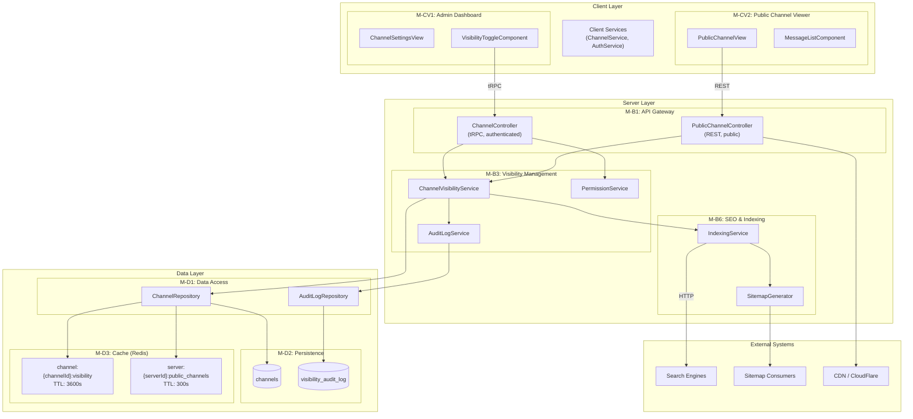

> **Note:** All cache keys use UUID-based identifiers (e.g., `channel:{channelId}:visibility`) for consistency across all Harmony specs.

### 2.2 Information Flow Summary

| Flow ID | Source | Destination | Data | Protocol |
|---------|--------|-------------|------|----------|
| F1 | C1.2 VisibilityToggle | C4.1 ChannelController | VisibilityUpdateRequest | HTTPS (tRPC) |
| F2 | C4.1 ChannelController | C5.1 VisibilityService | VisibilityChangeCommand | Internal Call |
| F3 | C5.1 VisibilityService | C6.1 ChannelRepository | Channel Entity | Database Protocol |
| F4 | C5.1 VisibilityService | C5.2 IndexingService | IndexingEvent | EventBus (Redis Pub/Sub) |
| F5 | C5.2 IndexingService | E1 Search Engines | Sitemap XML | HTTPS |
| F6 | C4.2 PublicAccessCtrl | E3 CDN | Cached Public Content | HTTPS |
| F7 | C5.1 VisibilityService | C5.4 AuditLogService | AuditEntry | Internal Call |

### 2.3 Rationale

This follows a clear model-view-controller architecture, where the client can view channels and control their visibility state with the M1 Admin Dashboard controller. The underlying model is represented by the server layer, which handles get/set operations and any necessary side-effects for search engine indexing. 

The underlying data layer uses a short-term caching layer to reduce database accesses and syncs with external systems. 

We had to prompt edits to this to ensure the database columns were not mismatched across each architecture diagram. The Redis cache key pattern was also inconsistent across specs, so we had to prompt fixes for that as well.

---

## 3. Class Diagram

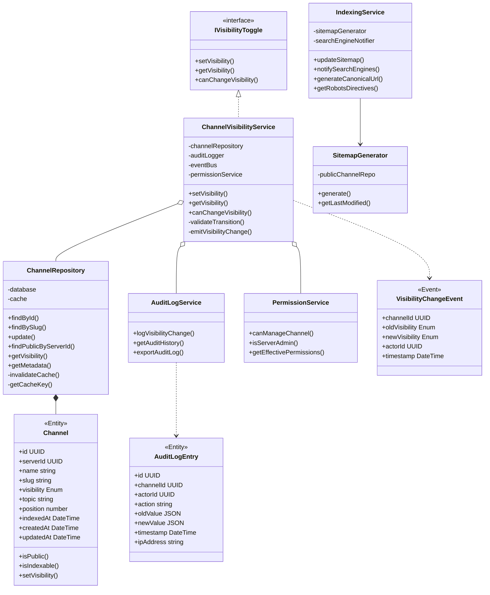

> **Sitemap Ownership:** `IndexingService` (CL6.1 / C5.2) is the canonical owner of sitemap generation and search engine notification across all Harmony specs. Other features (e.g., SEO Meta Tag Generation) emit events that this service consumes to trigger sitemap updates.

### 3.1 Rationale

After having an LLM review this spec, the canonical owner of the sitemap generation should be the IndexingService. There was a discrepancy between this spec and the seo-meta-tag-generation spec on what would consume server updates and generate new sitemaps for external services. 

Significant inconsistencies existed between section 2, 3, 9, and 10, so a verification pass was necessary after the document was generated to fix them. 

---

## 4. List of Classes

### 4.1 Client Module (M1, M2, M3)

| Label | Class Name | Type | Purpose |
|-------|------------|------|---------|
| CL-C1.1 | ChannelSettingsView | View Component | Channel settings page with visibility management |
| CL-C1.2 | VisibilityToggleComponent | UI Component | Toggle control for Public/Indexable ↔ Private with confirmation |
| CL-C2.1 | PublicChannelView | View Component | Public channel content for anonymous users and crawlers |
| CL-C2.2 | MessageListComponent | UI Component | Paginated message list with SEO-optimized markup |
| CL-C3.1 | ChannelService | Service | Client-side channel API calls including visibility updates |
| CL-C3.2 | AuthService | Service | Authentication state and permission checking |

### 4.2 API Gateway Module (M4)

| Label | Class Name | Type | Purpose |
|-------|------------|------|---------|
| CL-C4.1 | ChannelController | Controller | Authenticated channel management API (tRPC) |
| CL-C4.2 | PublicAccessController | Controller | Unauthenticated public content and sitemaps (REST) |

### 4.3 Business Logic Module (M5)

| Label | Class Name | Type | Purpose |
|-------|------------|------|---------|
| CL-C5.1 | ChannelVisibilityService | Service | Visibility state changes, validation, and event emission |
| CL-C5.2 | IndexingService | Service | Sitemap generation, crawler notifications (canonical owner) |
| CL-C5.3 | PermissionService | Service | User permission validation for channel management |
| CL-C5.4 | AuditLogService | Service | Audit trail for visibility changes |

### 4.4 Data Access Module (M6)

| Label | Class Name | Type | Purpose |
|-------|------------|------|---------|
| CL-C6.1 | ChannelRepository | Repository | Channel data access with caching |
| CL-C6.2 | AuditLogRepository | Repository | Audit log data access |

### 4.5 Data Structures (Entities/DTOs)

| Label | Class Name | Type | Purpose |
|-------|------------|------|---------|
| CL-D1 | Channel | Entity | Domain entity representing a channel with visibility state |
| CL-D2 | AuditLogEntry | Entity | Single audit log record |
| CL-D3 | VisibilityChangeEvent | Event | Event emitted on visibility changes |
| CL-D4 | ChannelVisibility | Enumeration | Possible visibility states |
| CL-D5 | VisibilityUpdateRequest | DTO | Request payload for visibility update |
| CL-D6 | VisibilityUpdateResponse | DTO | Response payload for visibility update |
| CL-D7 | PublicChannelDTO | DTO | Public-facing channel data (see §4.6) |

### 4.6 PublicChannelDTO Fields

```typescript
interface PublicChannelDTO {
  id: string;           // Channel UUID
  name: string;         // Display name
  slug: string;         // URL-safe identifier
  topic: string;        // Channel topic/description
  messageCount: number; // Total messages in channel
  serverSlug: string;   // Parent server's slug
}
```

### 4.7 Rationale

Like the previous section, I had to reprompt to fix inconsistencies. The LLM also noticed that the ChannelRepository interface/class has discrepancies across each spec, so it consolidated each of them together. The class diagrams correctly display the interactions between each class, so no update was needed there. 

---

## 5. State Diagrams

### 5.1 System State Variables

| Variable | Type | Description |
|----------|------|-------------|
| channel.visibility | ChannelVisibility | Current visibility state |
| channel.indexedAt | DateTime | Last sitemap inclusion timestamp |
| sitemap.lastModified | DateTime | Last sitemap update |
| auditLog.entries | AuditLogEntry[] | Audit records |

### 5.2 Channel Visibility State Machine

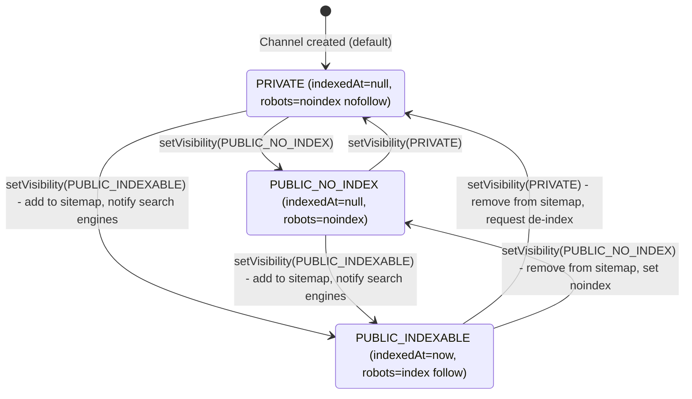

### 5.3 Admin Action State Diagram

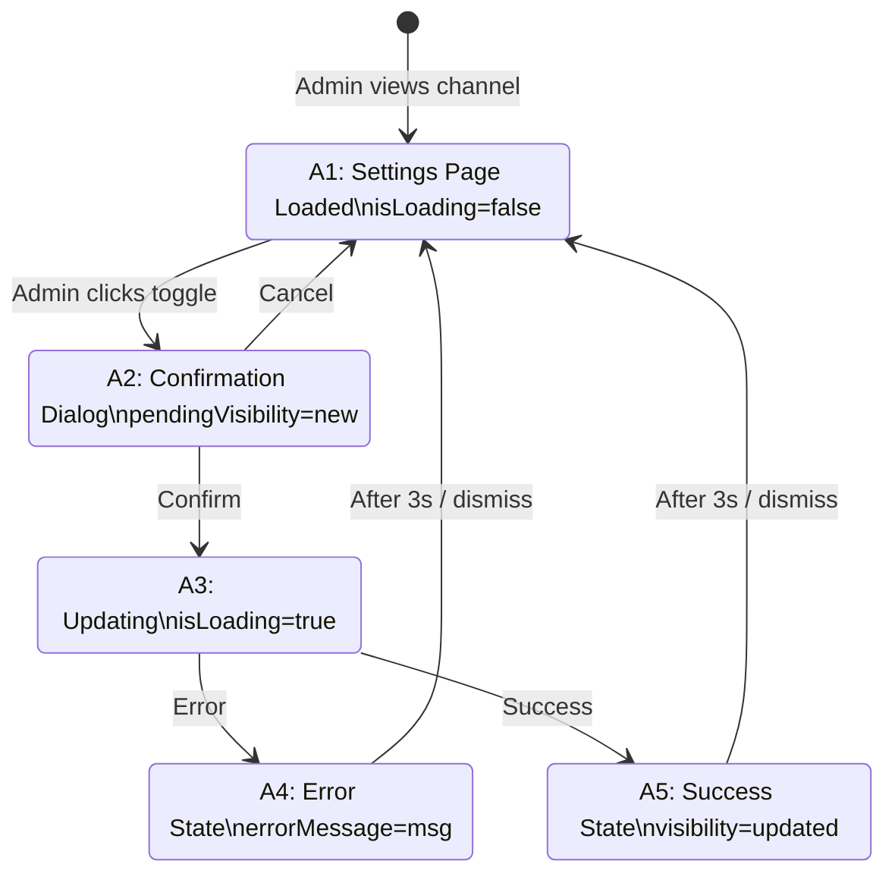

### 5.4 Rationale

The first diagram correctly tracks the state changes for all possible channel states. No changes or reprompting the LLM was necessary for this section. The channel will be public, public & indexable, or private. A simplification of the roles-based access control in Discord, but covers the general idea. 

The second diagram correctly tracks the state transitions for the channel visibility permission. It is quite simple so the model did not need to the reprompted for any changes.

---

## 6. Flow Charts

### 6.1 Scenario: Admin Sets Channel to Public/Indexable

Admin navigates to channel settings and toggles a private channel to publicly indexable. System validates permissions, updates DB, regenerates sitemap, and notifies search engines.

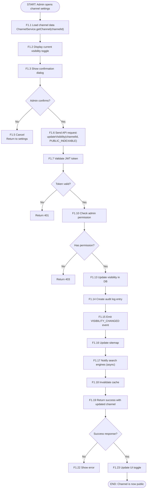

#### 6.1.1 Cross-Spec Integration: Visibility → PUBLIC_INDEXABLE

When visibility changes to `PUBLIC_INDEXABLE`:
1. Emit `VISIBILITY_CHANGED` event via EventBus (Redis Pub/Sub)
2. **SEO Meta Tag Generation spec** consumes event → generates meta tags for the channel
3. **Guest Public Channel View spec** consumes event → warms guest view cache

### 6.2 Scenario: Anonymous User Views Public Channel

An anonymous user or crawler requests a public channel page. System verifies visibility and serves content with appropriate SEO headers.

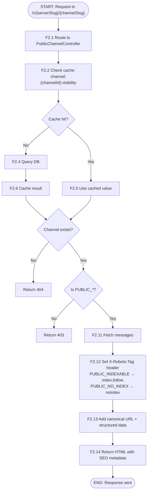

### 6.3 Scenario: Admin Sets Channel to Private (De-indexing)

Administrator changes a public/indexable channel back to private. System removes from sitemap and requests de-indexing.

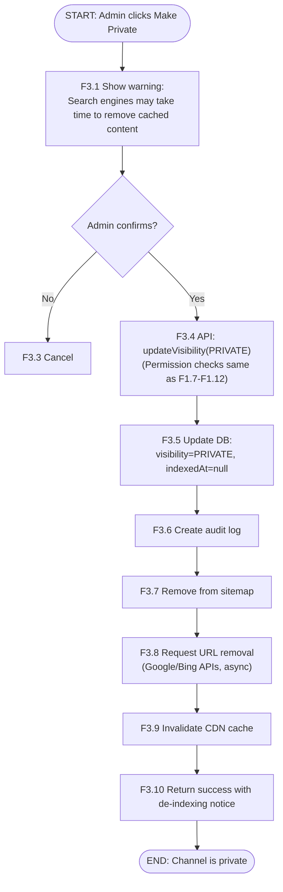

#### 6.3.1 Cross-Spec Integration: Visibility → PRIVATE

When visibility changes to `PRIVATE`:
1. Emit `VISIBILITY_CHANGED` event via EventBus (Redis Pub/Sub)
2. **SEO Meta Tag Generation spec** consumes event → deletes meta tags for the channel
3. **Guest Public Channel View spec** consumes event → invalidates guest view cache

---

### 6.4 Rationale

The LLM had to be reprompted here to clarify which protocols (RPC vs REST) would be used for communications. This was an issue across the this whole dev spec. It was determined REST protocols would be used for public APIs and RPC for internal communications. 

The LLM also had to be reprompted to finalize what the event bus would be. It chose Redis Pub/Sub to allow for visibility change updates to propagate. The cache keying also needed to be updated to match earlier updates. 

## 7. Development Risks and Failures

### 7.1 Runtime Failures

| Label | Failure Mode | User-Visible Effect | Recovery Procedure | Likelihood | Impact |
|-------|-------------|--------------------|--------------------|------------|--------|
| RF-1 | API Server crash | Toggle action fails | Auto-restart; client retries | Medium | Medium |
| RF-2 | Lost runtime state | Stale visibility displayed | Cache invalidation on recovery | Low | Low |
| RF-3 | Database corruption | Incorrect visibility; privacy breach | Restore from backup; audit reconciliation | Very Low | Critical |
| RF-4 | Invalid state transition | Channel may become public unintentionally | Server-side transition validation | Low | High |
| RF-5 | RPC failure | "Network error" shown | Retry with exponential backoff; circuit breaker | Medium | Medium |
| RF-6 | Server overload | Slow response or timeout | Rate limiting; horizontal scaling | Medium | Medium |
| RF-7 | Out of RAM | Server unresponsive | Memory limits; vertical scaling | Low | High |
| RF-8 | Database out of space | Write operations fail | Storage alerts; archive old audit logs | Low | High |

### 7.2 Connectivity Failures

| Label | Failure Mode | User-Visible Effect | Recovery Procedure | Likelihood | Impact |
|-------|-------------|--------------------|--------------------|------------|--------|
| CF-1 | Lost network | "Connection lost" banner | Auto-reconnect with backoff | Medium | Medium |
| CF-2 | Lost DB connection | API returns 503 | Connection pool health checks; failover | Low | High |
| CF-3 | Traffic spike | Increased latency | CDN caching; auto-scaling | Medium | Medium |
| CF-4 | Search engine API down | Indexing updates delayed | Queue failed notifications; retry | Medium | Low |

### 7.3 Hardware Failures

| Label | Failure Mode | User-Visible Effect | Recovery Procedure | Likelihood | Impact |
|-------|-------------|--------------------|--------------------|------------|--------|
| HF-1 | App server down | Service unavailable | Multi-AZ deployment; LB health checks | Low | High |
| HF-2 | Bad config loaded | Unpredictable behavior | Config validation on startup; rollback | Low | High |
| HF-3 | System relocation | Temporary outage | Blue-green deployment; DNS TTL management | Very Low | Medium |

### 7.4 Security Failures

| Label | Failure Mode | User-Visible Effect | Recovery Procedure | Likelihood | Impact |
|-------|-------------|--------------------|--------------------|------------|--------|
| IF-1 | DDoS attack | Service degradation | CloudFlare DDoS protection; rate limiting | Medium | High |
| IF-2 | OS compromise | Full system breach | Incident response; rebuild from clean images | Very Low | Critical |
| IF-3 | Code tampering | Malicious behavior | Code signing; integrity monitoring | Very Low | Critical |
| IF-4 | Database theft | Privacy breach | Encryption at rest; access logging | Low | Critical |
| IF-5 | Bot spam | Public channels flooded | CAPTCHA; rate limiting; content moderation | Medium | Medium |
| IF-6 | Session hijacking | Unauthorized changes | Secure cookies; session binding; anomaly detection | Low | High |

### 7.5 Failure Priority Matrix

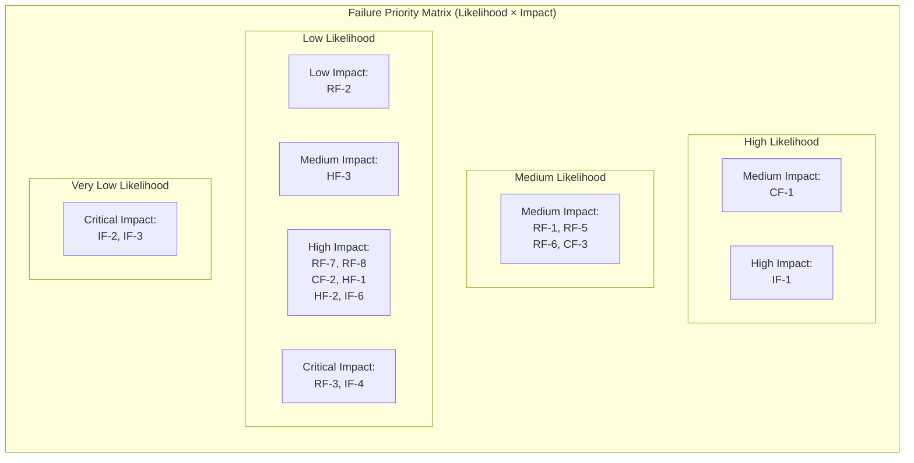

### 7.6 Rationale

Minor reprompting was needed to standardize the rate-limiting policy. It did not affect this section, but other specs mentioned rate-limiting so it had to be added to this one as a failure. Otherwise the failure modes and resolutions make sense, and there are no obvious gaps in errors.

---

## 8. Technology Stack

| Label | Technology | Version | Purpose | Source |
|-------|------------|---------|---------|-------|
| T1 | TypeScript | 5.3+ | Primary language (client + server) | https://www.typescriptlang.org/ |
| T2 | React | 18.2+ | Frontend UI framework | https://react.dev/ |
| T3 | Next.js | 14.0+ | SSR/SSG framework (SEO-critical for public pages) | https://nextjs.org/ |
| T4 | Node.js | 20 LTS | Server runtime | https://nodejs.org/ |
| T5 | PostgreSQL | 16+ | Primary database (ACID, JSONB, enums) | https://www.postgresql.org/ |
| T6 | Redis | 7.2+ | Caching, session storage, EventBus (Pub/Sub) | https://redis.io/ |
| T7 | Prisma | 5.8+ | Type-safe ORM with migrations | https://www.prisma.io/ |
| T8 | tRPC | 10.45+ | End-to-end typesafe APIs (authenticated internal) | https://trpc.io/ |
| T9 | Zod | 3.22+ | Runtime schema validation (integrates with tRPC) | https://zod.dev/ |
| T10 | TailwindCSS | 3.4+ | Utility-first CSS framework | https://tailwindcss.com/ |
| T11 | CloudFlare | N/A | CDN and DDoS protection | https://www.cloudflare.com/ |
| T12 | Docker | 24+ | Containerization | https://www.docker.com/ |
| T13 | Google Search Console API | v1 | Programmatic indexing/de-indexing | https://developers.google.com/webmaster-tools |
| T14 | Bing Webmaster API | v1 | Microsoft search engine integration | https://www.bing.com/webmasters |
| T15 | Jest | 29+ | Unit/integration testing | https://jestjs.io/ |
| T16 | Playwright | 1.40+ | Cross-browser E2E testing | https://playwright.dev/ |
| T17 | sanitize-html | 2.12+ | XSS prevention / HTML sanitization for public-facing content (Node.js-native) | https://github.com/apostrophecms/sanitize-html |

> **Convention:** tRPC is used for authenticated internal APIs between client and server. Public-facing endpoints (sitemaps, public channel pages, robots.txt) use REST for maximum compatibility with crawlers and third-party consumers.

### 8.1 EventBus

**Technology:** Redis Pub/Sub (T6)

Event types consumed/produced across specs:

| Event | Source Spec | Description |
|-------|-------------|-------------|
| `VISIBILITY_CHANGED` | Channel Visibility Toggle (this spec) | Emitted when channel visibility state changes |
| `MESSAGE_CREATED` | SEO Meta Tag Generation | New message in a public channel |
| `MESSAGE_EDITED` | SEO Meta Tag Generation | Message edited in a public channel |
| `MESSAGE_DELETED` | SEO Meta Tag Generation | Message deleted from a public channel |
| `META_TAGS_UPDATED` | SEO Meta Tag Generation | Meta tags regenerated for a channel |

### 8.2 Rationale

Significant reprompting was necessary here because of conflicting tech stacks across each spec. This spec was missing DOMPurify, which would be needed to sanitize and generate sitemaps with other public content. The communication APIs being a mix of RPC and REST was also detected by the LLM here, requiring prompting to fix it. The LLM then determined to use RPC for authenticated internal APIs, while public endpoints would be REST for compatibility with web indexers.

Finally, the LLM made a shared tech-stack document that would be used across each spec. 

---

## 9. APIs

### 9.1 Module M4: API Gateway

#### 9.1.1 CL-C4.1 ChannelController

**Public Methods (Authenticated, tRPC):**

```typescript
getChannelSettings(
  channelId: string,          // UUID
  context: AuthenticatedContext
): Promise<ChannelSettingsResponse>

updateChannelVisibility(
  channelId: string,
  body: VisibilityUpdateRequest,  // { visibility: ChannelVisibility }
  context: AuthenticatedContext
): Promise<VisibilityUpdateResponse>

getVisibilityAuditLog(
  channelId: string,
  query: AuditLogQuery,       // { limit?, offset?, startDate? }
  context: AuthenticatedContext
): Promise<AuditLogResponse>
```

**Private Methods:**

```typescript
private validateAdminAccess(userId: string, channelId: string): Promise<boolean>
private mapToResponse(channel: Channel): ChannelSettingsResponse
```

#### 9.1.2 CL-C4.2 PublicAccessController

**Public Methods (Unauthenticated, REST):**

```typescript
getPublicChannel(
  serverSlug: string, channelSlug: string, query: PaginationQuery
): Promise<PublicChannelPage>

getServerSitemap(serverSlug: string): Promise<SitemapXML>

getRobotsTxt(): Promise<RobotsTxt>

getPublicMessages(channelId: string, query: PaginationQuery): Promise<PublicMessagesResponse>
```

### 9.2 Module M5: Business Logic

#### 9.2.1 CL-C5.1 ChannelVisibilityService

```typescript
setVisibility(
  channelId: string, newVisibility: ChannelVisibility,
  actorId: string, ipAddress: string
): Promise<VisibilityChangeResult>

getVisibility(channelId: string): Promise<ChannelVisibility>
canChangeVisibility(channelId: string, actorId: string): Promise<boolean>

private validateTransition(
  current: ChannelVisibility, next: ChannelVisibility
): ValidationResult

private emitVisibilityChange(event: VisibilityChangeEvent): Promise<void>
```

#### 9.2.2 CL-C5.2 IndexingService

```typescript
updateSitemap(serverId: string): Promise<void>
notifySearchEngines(url: string, action: 'INDEX' | 'REMOVE'): Promise<NotificationResult>
generateCanonicalUrl(serverId: string, channelId: string): string
getRobotsDirectives(visibility: ChannelVisibility): RobotsDirectives
```

#### 9.2.3 CL-C5.3 PermissionService

```typescript
canManageChannel(userId: string, channelId: string): Promise<boolean>
isServerAdmin(userId: string, serverId: string): Promise<boolean>
getEffectivePermissions(userId: string, channelId: string): Promise<PermissionSet>
```

#### 9.2.4 CL-C5.4 AuditLogService

```typescript
logVisibilityChange(entry: AuditLogEntry): Promise<void>
getAuditHistory(channelId: string, options: AuditQueryOptions): Promise<AuditLogEntry[]>
exportAuditLog(channelId: string, format: 'JSON' | 'CSV'): Promise<Buffer>
```

### 9.3 Module M6: Data Access

#### 9.3.1 CL-C6.1 ChannelRepository (Consolidated)

```typescript
findById(channelId: string): Promise<Channel | null>
findBySlug(serverSlug: string, channelSlug: string): Promise<Channel | null>
update(channelId: string, data: Partial<Channel>): Promise<Channel>
findPublicByServerId(serverId: string): Promise<Channel[]>
getVisibility(channelId: string): Promise<ChannelVisibility>
getMetadata(channelId: string): Promise<ChannelMetadata>

private invalidateCache(channelId: string): Promise<void>
private getCacheKey(channelId: string): string
```

### 9.4 Rate Limiting

| Consumer Type | Limit | Window | Scope |
|---------------|-------|--------|-------|
| Human users (authenticated) | 100 req | 1 min | Per user |
| Verified bots / crawlers | 1000 req | 1 min | Per bot identity |

Rate limits apply to all API endpoints. Exceeding limits returns `429 Too Many Requests` with `Retry-After` header.

### 9.5 Rationale

The LLM had generated mismatched class methods and variables from before and now. It had to be reprompted to recouncile the differences and create missing functions both here and in previous sections. Like mentioned before, it also had to be reprompted to standardize a ratelimiting policy here instead of arbitrary values elsewhere.

The separation of public APIs, business logic, and data access layers is good practice in large systems, so I agree with the LLM's decisions here.

---

## 10. Public Interfaces

### 10.1 Cross-Module Interfaces

#### Client (M1–M3) → API Gateway (M4):

| Method | Class | Used For |
|--------|-------|----------|
| getChannelSettings() | ChannelController | Loading channel settings |
| updateChannelVisibility() | ChannelController | Visibility toggle |
| getVisibilityAuditLog() | ChannelController | Audit history display |
| getPublicChannel() | PublicAccessController | Viewing public channel |
| getPublicMessages() | PublicAccessController | Paginating public messages |

#### API Gateway (M4) → Business Logic (M5):

| Method | Class | Used For |
|--------|-------|----------|
| setVisibility() | ChannelVisibilityService | Processing visibility updates |
| getVisibility() | ChannelVisibilityService | Reading current visibility |
| canChangeVisibility() | ChannelVisibilityService | Permission checking |
| canManageChannel() | PermissionService | Authorization |
| generateCanonicalUrl() | IndexingService | SEO headers |
| getRobotsDirectives() | IndexingService | SEO headers |
| getAuditHistory() | AuditLogService | Audit log endpoint |

#### Business Logic (M5) → Data Access (M6):

| Method | Class | Used For |
|--------|-------|----------|
| findById() | ChannelRepository | Loading channel entity |
| findBySlug() | ChannelRepository | Slug-based channel lookup |
| update() | ChannelRepository | Persisting visibility changes |
| findPublicByServerId() | ChannelRepository | Sitemap generation |
| getVisibility() | ChannelRepository | Fast visibility check |
| getMetadata() | ChannelRepository | Channel metadata retrieval |
| create() | AuditLogRepository | Writing audit entries |
| findByChannelId() | AuditLogRepository | Reading audit history |

### 10.2 REST API Interface

```yaml
openapi: 3.0.3
info:
  title: Harmony Channel Visibility API
  version: 1.0.0

paths:
  /api/channels/{channelId}/visibility:
    patch:
      summary: Update channel visibility
      security:
        - bearerAuth: []
      parameters:
        - name: channelId
          in: path
          required: true
          schema:
            type: string
            format: uuid
      requestBody:
        required: true
        content:
          application/json:
            schema:
              $ref: '#/components/schemas/VisibilityUpdateRequest'
      responses:
        '200':
          description: Visibility updated
          content:
            application/json:
              schema:
                $ref: '#/components/schemas/VisibilityUpdateResponse'
        '401':
          description: Unauthorized
        '403':
          description: Forbidden
        '404':
          description: Channel not found
        '429':
          description: Rate limit exceeded

components:
  schemas:
    ChannelVisibility:
      type: string
      enum: [PUBLIC_INDEXABLE, PUBLIC_NO_INDEX, PRIVATE]

    VisibilityUpdateRequest:
      type: object
      required: [visibility]
      properties:
        visibility:
          $ref: '#/components/schemas/ChannelVisibility'

    VisibilityUpdateResponse:
      type: object
      properties:
        success:
          type: boolean
        channel:
          $ref: '#/components/schemas/ChannelDTO'
        previousVisibility:
          $ref: '#/components/schemas/ChannelVisibility'
        indexingStatus:
          type: string
          enum: [PENDING, INDEXED, NOT_INDEXED, REMOVAL_REQUESTED]
```

### 10.3 Cross-Spec Event Integration

When `VISIBILITY_CHANGED` is emitted:

| New Visibility | Downstream Action (SEO Spec) | Downstream Action (Guest View Spec) |
|---------------|------------------------------|--------------------------------------|
| `PUBLIC_INDEXABLE` | Generate meta tags for channel | Warm guest view cache |
| `PUBLIC_NO_INDEX` | Update meta tags (add noindex) | Keep guest view cache (public content) |
| `PRIVATE` | Delete meta tags for channel | Invalidate guest view cache |

### 10.4 Rationale

The LLM correctly generated the public API specification. It did not need to be reprompted for any fixes here. The generated API specification is correct and exposes the endpoints necessary for this specific user story. 

Significant inconsistencies in classes existed between sections 2, 3, 9, and 10, so a verification pass was necessary after the document was generated to fix them. 

---

## 11. Data Schemas

### 11.1 Database Tables

#### D7.1 channels

**Runtime Class:** CL-D1 Channel

| Column | Database Type | Constraints | Description |
|--------|--------------|-------------|-------------|
| id | UUID | PRIMARY KEY | Unique channel identifier |
| server_id | UUID | FOREIGN KEY → servers(id), NOT NULL, INDEX | Parent server reference |
| name | VARCHAR(100) | NOT NULL | Display name |
| slug | VARCHAR(100) | NOT NULL, UNIQUE per server | URL-safe identifier |
| visibility | visibility_enum | NOT NULL, DEFAULT 'PRIVATE' | Current visibility state |
| topic | TEXT | NULL | Channel topic/description |
| position | INTEGER | NOT NULL, DEFAULT 0 | Display order within server |
| indexed_at | TIMESTAMP WITH TIME ZONE | NULL | When channel was added to sitemap |
| created_at | TIMESTAMP WITH TIME ZONE | NOT NULL, DEFAULT NOW() | Creation timestamp |
| updated_at | TIMESTAMP WITH TIME ZONE | NOT NULL, DEFAULT NOW() | Last modification timestamp |

**Enum Definition:**
```sql
CREATE TYPE visibility_enum AS ENUM ('PUBLIC_INDEXABLE', 'PUBLIC_NO_INDEX', 'PRIVATE');
```

**Indexes (Canonical Set — merged from all specs):**
```sql
-- Composite index for server-scoped visibility queries
CREATE INDEX idx_channels_server_visibility ON channels(server_id, visibility);

-- Unique slug per server
CREATE UNIQUE INDEX idx_channels_server_slug ON channels(server_id, slug);

-- Partial index for indexable channels (sitemap generation)
CREATE INDEX idx_channels_visibility_indexed ON channels(visibility, indexed_at)
  WHERE visibility = 'PUBLIC_INDEXABLE';

-- Partial index for all public channels (guest view queries)
CREATE INDEX idx_channels_visibility ON channels(visibility)
  WHERE visibility IN ('PUBLIC_INDEXABLE', 'PUBLIC_NO_INDEX');
```

#### D7.2 visibility_audit_log

**Runtime Class:** CL-D2 AuditLogEntry

| Column | Database Type | Constraints | Description |
|--------|--------------|-------------|-------------|
| id | UUID | PRIMARY KEY | Unique log entry identifier |
| channel_id | UUID | FOREIGN KEY, NOT NULL, INDEX | Channel reference |
| actor_id | UUID | FOREIGN KEY, NOT NULL | User who made change |
| action | VARCHAR(50) | NOT NULL | e.g., 'VISIBILITY_CHANGED' |
| old_value | JSONB | NULL | Previous state |
| new_value | JSONB | NOT NULL | New state |
| timestamp | TIMESTAMP WITH TIME ZONE | NOT NULL, DEFAULT NOW(), INDEX | When action occurred |
| ip_address | INET | NULL | Actor's IP address |
| user_agent | VARCHAR(500) | NULL | Actor's browser/client |

**Indexes:**
```sql
CREATE INDEX idx_audit_channel_time ON visibility_audit_log(channel_id, timestamp DESC);
CREATE INDEX idx_audit_actor ON visibility_audit_log(actor_id, timestamp DESC);
```

**Retention Policy:** 7 years per compliance requirements.

#### D7.3 servers (Reference — canonical definition in Guest Public Channel View spec)

| Column | Database Type | Constraints |
|--------|--------------|-------------|
| id | UUID | PRIMARY KEY |
| name | VARCHAR(100) | NOT NULL |
| slug | VARCHAR(100) | UNIQUE |
| description | TEXT | NULL |
| icon_url | VARCHAR(500) | NULL |
| is_public | BOOLEAN | DEFAULT FALSE |
| member_count | INTEGER | DEFAULT 0 |
| created_at | TIMESTAMP WITH TIME ZONE | NOT NULL |

> This table is referenced by `channels.server_id`. See the Guest Public Channel View spec for the full canonical definition.

### 11.2 Cache Schemas

#### D8.1 ChannelVisibilityCache

- **Key Pattern:** `channel:{channelId}:visibility` (UUID-based)
- **Value:** String (visibility enum value)
- **TTL:** 3600s (1 hour)

#### D8.2 PublicChannelListCache

- **Key Pattern:** `server:{serverId}:public_channels`
- **Value:** JSON array of channel IDs
- **TTL:** 300s (5 minutes)

### 11.3 Field Type Mappings

| TypeScript Type | PostgreSQL Type | Notes |
|-----------------|-----------------|-------|
| string (UUID) | UUID | Native UUID type |
| ChannelVisibility (enum) | visibility_enum | PostgreSQL enum |
| Date | TIMESTAMP WITH TIME ZONE | Always UTC |
| object (audit values) | JSONB | Flexible schema |
| string (IP) | INET | Supports IPv4/IPv6 |

### 11.4 Rationale

This section needed significant reprompting due to database schema and index mismatches across all specs. Beyond that, the architecture is justified because it provides unique mappings for all (server, channel) pairs, allowing for indexers to access them consistently for updates. 

Cache schemas and keys needed reprompting to fix issues with inconsistent keying. 

---

## 12. Security and Privacy

### 12.1 Temporarily Stored PII

| PII Type | Justification | Usage | Disposal | Protection |
|----------|---------------|-------|----------|------------|
| IP Address | Audit trail | Logged with visibility changes | Retained in audit log | TLS in transit; encrypted at rest |
| User Agent | Identifying suspicious activity | Logged with visibility changes | Retained in audit log | TLS in transit; encrypted at rest |
| Session Token | Authentication | Validate user identity | Not stored (stateless JWT) | TLS only; short expiry |

### 12.2 Long-Term Stored PII

| PII Type | Justification | Storage Location | Access Path |
|----------|---------------|------------------|-------------|
| Actor ID (→ User) | Accountability for admin actions | D7.2 visibility_audit_log.actor_id | AuditLogRepository → AuditLogService → ChannelController |
| IP Address | Security investigation, abuse prevention | D7.2 visibility_audit_log.ip_address | Only via audit log export by authorized personnel |

### 12.3 Data Protection Measures

- **In transit:** TLS 1.3
- **At rest:** AES-256 database encryption; separate backup encryption keys
- **Access:** Audit log restricted to Security Officer role; DB credentials rotated quarterly; least privilege for service accounts

### 12.4 Privacy Policy

**Customer-Visible Points:**
- Public channels are visible to anyone on the internet, including search engines
- Messages in public channels may appear in search results
- Administrators can change channel visibility at any time
- Previously indexed content may remain in search engine caches after being made private

**Policy Presentation:** Warning on channel creation; confirmation dialog on public toggle; de-indexing notice on private toggle.

### 12.5 Access Policies

| Role | Visibility Change | View Audit Log | Export Audit Log |
|------|-------------------|----------------|------------------|
| Server Owner | Yes | Yes | Yes |
| Server Administrator | Yes | Yes | No |
| Channel Moderator | No | No | No |
| Regular Member | No | No | No |
| Anonymous User | No | No | No |

### 12.6 Audit Procedures

**Routine:** All API requests logged (timestamp, actor, action). Audit log queries are themselves logged. Monthly review of access patterns.

**Non-Routine:** Break-glass requires two-person approval. Emergency access reviewed within 24 hours. Incident reports for anomalies.

### 12.7 Minor Protection

Platform requires 13+ (COPPA). No specific minor PII collection beyond standard account data. Public channels may contain minor-posted content; parents/guardians agree to terms.

### 12.8 Security Responsibilities

| Storage/System | Responsible | Backup |
|----------------|-------------|--------|
| PostgreSQL Database | Database Administrator | DevOps Lead |
| Redis Cache | DevOps Lead | Database Administrator |
| Audit Log Storage | Security Officer | Compliance Manager |

### 12.9 XSS Prevention

All public-facing content (public channel pages, sitemap entries, PublicChannelDTO fields) is sanitized using sanitize-html (T17) before rendering to prevent XSS attacks from user-generated content.

### 12.10 Rationale

The LLM did not have issues with generating security and privacy requirements. This architecture is justified because it creates an audit trail for any actions. All actions are tagged by the user doing the action. IP addresses are also stored for audits. 

Visibility rules and search indexing is also handled with the appropriate care needed for making channels publically indexable. 

---

## 13. Risks to Completion

### 13.1 Technology Risks

| Technology | Learning Curve | Implementation Difficulty | Maintenance | Update Strategy |
|------------|----------------|---------------------------|-------------|-----------------|
| T1: TypeScript | Low | Low | Low | Dependabot |
| T2: React | Low | Low | Low | React upgrade guides |
| T3: Next.js | Medium (SSR) | Medium | Medium | Vercel migration guides |
| T5: PostgreSQL | Low | Low | Low | Standard upgrade path |
| T6: Redis | Low | Low | Low | Standard upgrade path |
| T7: Prisma | Medium | Low | Low | Migration tooling |
| T8: tRPC | Medium (new) | Medium | Medium | Breaking changes documented |
| T13/T14: Search APIs | High (external) | High | High | Monitor deprecation notices |

### 13.2 Component Risks

| Component | Risk Factor | Mitigation |
|-----------|-------------|------------|
| M5.2 IndexingService | External API dependencies may change | Abstraction layer; graceful degradation |
| M4.2 PublicAccessCtrl | High crawler traffic | CDN caching; rate limiting; edge computing |
| M6.1 ChannelRepository | Cache invalidation complexity | Explicit invalidation; short TTLs |
| D7.2 AuditLogTable | Storage growth | Date partitioning; archival; retention policy |

### 13.3 Off-the-Shelf Software

| Technology | Customization | Source Available | Bug/Security Fix | Cost |
|------------|--------------|------------------|------------------|------|
| PostgreSQL | None | Yes (OSS) | Community (fast) | Free |
| Redis | None | Yes (OSS) | Community (fast) | Free |
| Next.js | Minor (SSR config) | Yes (OSS) | Community | Free / Paid |
| Prisma | None | Yes (OSS) | Community | Free |
| CloudFlare | CDN rules | No (SaaS) | CloudFlare | Monthly fee |

### 13.4 Risk Prioritization

**High Priority:**
1. Search engine API integration — requires early prototyping
2. SSR performance for public pages — critical for SEO
3. Permission system accuracy — security critical

**Medium Priority:**
1. Audit log storage scaling
2. Cache invalidation correctness
3. CDN configuration

**Low Priority:**
1. UI polish for settings page
2. Audit log export formats

### 13.5 Contingency Plans

| Risk | Trigger | Contingency |
|------|---------|-------------|
| Search API unavailable | 3+ consecutive failures | Queue requests; manual sitemap submission; alert ops |
| DB performance degradation | p99 > 500ms | Read replicas; query plan review; add indexes |
| CDN issues | Cache hit rate < 80% | Increase origin capacity; review cache rules |
| Security breach | Unauthorized access | Incident response; notify users; rotate credentials |

### 13.6 Rationale

This set of risks is justified since the product will be a public facing chat client with many frequently updated libraries. No reprompting was necessary here. 

Component risks make sense, primarily external API changes and growing storage/bandwidth costs. These are common issues which the LLM caught and documented well. 

The LLM is justified in determining the cost of operation as well, figuring out what finanical risks are present in creating this software. 

Contingency plans and thresholds to activate them match industry standards for API, database, and caching failures. Therefore the LLM is justified in making these decisions.

---

## Appendix A: Glossary

| Term | Definition |
|------|------------|
| Indexable | Content that search engines are permitted to include in search results |
| Sitemap | XML file listing URLs for search engines to crawl |
| Canonical URL | Preferred URL for content accessible via multiple URLs |
| robots.txt | File instructing crawlers which URLs to access |
| X-Robots-Tag | HTTP header providing indexing instructions to crawlers |
| De-indexing | Requesting search engines remove content from their index |
| CDN | Content Delivery Network — geographically distributed caching servers |
| SSR | Server-Side Rendering — generating HTML on the server |
| PII | Personally Identifiable Information |
| EventBus | Redis Pub/Sub messaging layer for cross-service event communication |

---

## Appendix B: Document References

- User Story: Channel Visibility Toggle (this document)
- Dev Spec: SEO Meta Tag Generation (cross-referenced for event integration)
- Dev Spec: Guest Public Channel View (cross-referenced for `servers` table and cache warmup)
- Platform Architecture Overview (separate document)
- Harmony Security Policy (separate document)
- SEO Best Practices Guide (separate document)
````

#### Tool: exec_command

```sh
rtk read docs/dev-spec-guest-public-channel-view.md
```

Output:

````text
Total output lines: 1934

# Development Specification: Guest Public Channel View

## Feature: Anonymous Access to Public Channel Content

**User Story:** As a Guest User (Searcher), I want to view the full contents of a public channel via a direct URL without being prompted to log in, so that I can get the answer to my specific question immediately without the friction of creating an account I might only use once.

> **Unified Backend Reference:** This feature's backend classes are part of the shared Harmony backend defined in [`unified-backend-architecture.md`](./unified-backend-architecture.md). The mapping from this spec's class labels to the unified module labels is in §10 of that document. Key modules contributed by this feature: **M-B2** (Access Control), **M-B4** (Content Delivery), **M-D1** (Data Access, shared).

---

## 1. Header

### Version and Date

| Version | Date       | Description                              |
|---------|------------|------------------------------------------|
| 1.0     | 2026-02-12 | Initial development specification        |
| 2.0     | 2026-02-15 | Cross-spec consolidation: label fixes, cache key alignment, convention standardization |

### Author and Role

| Author        | Role                    | Version |
|---------------|-------------------------|---------|
| Claude (AI)   | Specification Author    | 1.0, 2.0 |
| dblanc        | Project Lead            | 1.0     |
| Aiden-Barrera | Project Member          | 2.0     |

---

## 2. Architecture Diagram

### 2.1 System Overview

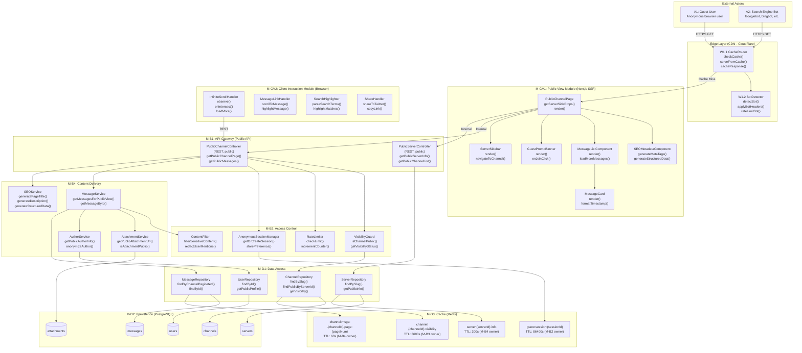

> **Note:** All cache keys use UUID-based identifiers (e.g., `channel:{channelId}:visibility`) for consistency across all Harmony specs.

### 2.2 Information Flow Summary

| Flow ID | Source | Destination | Data | Protocol |
|---------|--------|-------------|------|----------|
| F1 | A1 Guest User | W1.1 CacheRouter | HTTP GET Request | HTTPS |
| F2 | W1.1 CacheRouter | C1.1 PublicChannelPage | Cache Miss Forward | HTTPS |
| F3 | C1.1 PublicChannelPage | C3.1 PublicChannelController | Channel Data Request | Internal |
| F4 | C3.1 PublicChannelController | C4.1 VisibilityGuard | Visibility Check | Internal |
| F5 | C4.1 VisibilityGuard | C6.1 ChannelRepository | Database Query | Internal |
| F6 | C3.1 PublicChannelController | C5.1 MessageService | Message Fetch | Internal |
| F7 | C5.1 MessageService | C6.2 MessageRepository | Paginated Query | Internal |
| F8 | C5.4 SEOService | C1.2 SEOMetadataComponent | SEO Data | Internal |
| F9 | C1.1 PublicChannelPage | W1.1 CacheRouter | Rendered HTML | HTTPS |
| F10 | W1.1 CacheRouter | A1 Guest User | Cached/Fresh Response | HTTPS |

### 2.3 Request Path Diagram

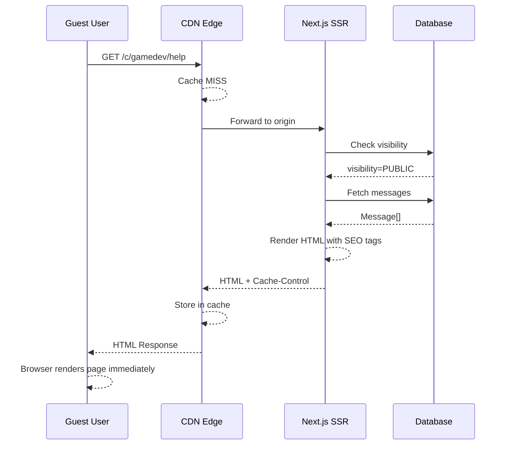

### 2.4 Rationale

The archtecture diagram is justified because client server split abstracts from the guest the authorization logic the server handles and caching requests significantly helps with performance for storing the same content that will be served to many users. Furthermore, the importance of authorization lies in the fact whether a channel is public or not, to make sure guests can't see private channels. 

---

## 3. Class Diagram

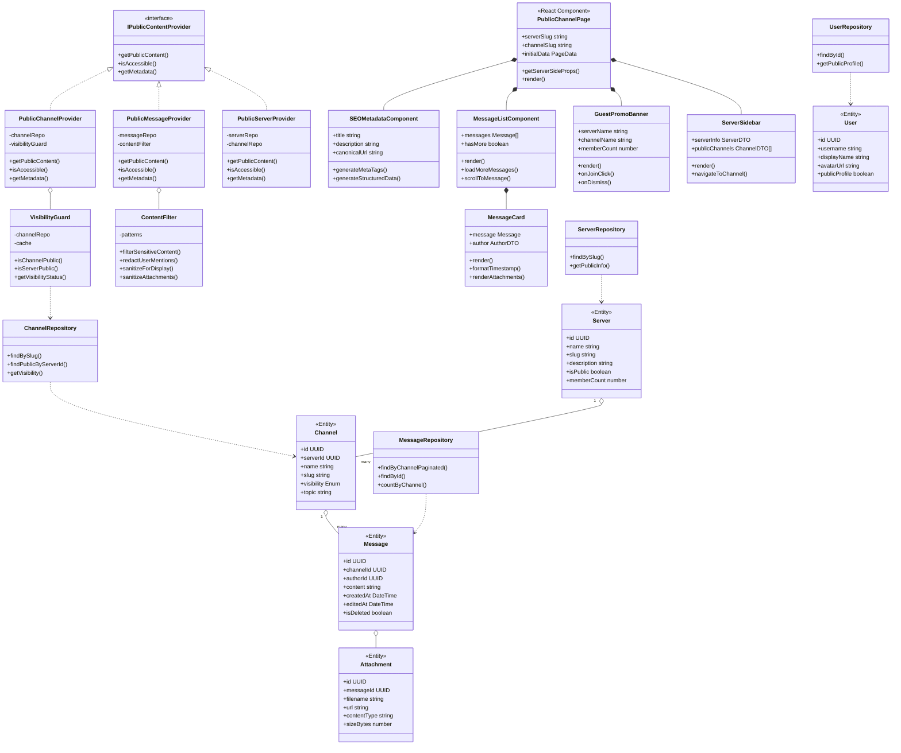

### 3.1 Rationale

The class diagram clearly separates the entities that will be needed for displaying the public channel to the guest user, specifically with only grabbing public entities such as the server, messages and owner of the message to avoid exposing private channel information. 

---

## 4. List of Classes

### 4.1 Edge Layer (W1)

| Label | Class Name | Type | Purpose |
|-------|------------|------|---------|
| CL-W1.1 | CacheRouter | Edge Worker | Routes requests through CDN cache, determines cache hit/miss, manages cache keys |
| CL-W1.2 | BotDetector | Edge Worker | Identifies search engine bots vs human users, applies appropriate rate limits and headers |

### 4.2 Public View Module (M1)

| Label | Class Name | Type | Purpose |
|-------|------------|------|---------|
| CL-C1.1 | PublicChannelPage | Page Component | Main Next.js page component for rendering public channel content with SSR |
| CL-C1.2 | SEOMetadataComponent | UI Component | Generates and renders SEO meta tags, Open Graph tags, and structured data |
| CL-C1.3 | MessageListComponent | UI Component | Renders paginated list of messages with infinite scroll support |
| CL-C1.4 | GuestPromoBanner | UI Component | Non-intrusive banner encouraging guests to join the community |
| CL-C1.5 | MessageCard | UI Component | Renders individual message with author info, timestamp, and attachments |
| CL-C1.6 | ServerSidebar | UI Component | Displays server info and list of other public channels for navigation |

### 4.3 Client Interaction Module (M2)

| Label | Class Name | Type | Purpose |
|-------|------------|------|---------|
| CL-C2.1 | InfiniteScrollHandler | Client Component | Manages intersection observer for loading more messages on scroll |
| CL-C2.2 | MessageLinkHandler | Client Component | Handles deep links to specific messages, scrolls and highlights target |
| CL-C2.3 | SearchHighlighter | Client Component | Highlights search terms from referrer URL in message content |
| CL-C2.4 | ShareHandler | Client Component | Provides sharing functionality for messages and channel links |

### 4.4 Public API Module (M3)

| Label | Class Name | Type | Purpose |
|-------|------------|------|---------|
| CL-C3.1 | PublicChannelController | Controller | Handles API requests for public channel data without authentication |
| CL-C3.2 | PublicServerController | Controller | Handles API requests for public server information |

### 4.5 Access Control Module (M4)

| Label | Class Name | Type | Purpose |
|-------|------------|------|---------|
| CL-C4.1 | VisibilityGuard | Service | Checks channel/server visibility before serving content to guests |
| CL-C4.2 | ContentFilter | Service | Filters sensitive content, redacts private mentions from public view |
| CL-C4.3 | RateLimiter | Middleware | Prevents abuse by limiting request rate for anonymous users |
| CL-C4.4 | AnonymousSessionManager | Service | Manages lightweight sessions for guests to store preferences |

### 4.6 Content Delivery Module (M5)

| Label | Class Name | Type | Purpose |
|-------|------------|------|---------|
| CL-C5.1 | MessageService | Service | Retrieves and formats messages for public display |
| CL-C5.2 | AuthorService | Service | Provides public author information, respects privacy settings |
| CL-C5.3 | AttachmentService | Service | Manages public access to message attachments |
| CL-C5.4 | SEOService | Service | Generates SEO metadata, structured data, and canonical URLs |

### 4.7 Data Access Module (M6)

| Label | Class Name | Type | Purpose |
|-------|------------|------|---------|
| CL-C6.1 | ChannelRepository | Repository | Data access for channel entities with visibility filtering |
| CL-C6.2 | MessageRepository | Repository | Data access for messages with pagination support |
| CL-C6.3 | ServerRepository | Repository | Data access for server entities |
| CL-C6.4 | UserRepository | Repository | Data access for user public profile data |

### 4.8 Data Transfer Objects

| Label | Class Name | Type | Purpose |
|-------|------------|------|---------|
| CL-D1 | PublicChannelDTO | DTO | Public-safe channel data for API responses |
| CL-D2 | PublicMessageDTO | DTO | Public-safe message data with permalink |
| CL-D3 | PublicAuthorDTO | DTO | Public author info without user ID |
| CL-D4 | PublicServerDTO | DTO | Public server info for display |
| CL-D5 | PageDataDTO | DTO | Combined data for SSR page rendering |
| CL-D6 | SEODataDTO | DTO | SEO metadata for page head |

#### PublicChannelDTO Fields

```typescript
interface PublicChannelDTO {
  id: string;           // Channel UUID
  name: string;         // Display name
  slug: string;         // URL-safe identifier
  topic: string;        // Channel topic/description
  messageCount: number; // Total messages in channel (computed, not a DB column)
  serverSlug: string;   // Parent server's slug
}
```

#### ChannelVisibility Enum

```typescript
enum ChannelVisibility {
  PUBLIC_INDEXABLE = 'PUBLIC_INDEXABLE',   // Visible to guests and indexed by search engines
  PUBLIC_NO_INDEX = 'PUBLIC_NO_INDEX',     // Visible to guests but not indexed
  PRIVATE = 'PRIVATE'                      // Only visible to authenticated members
}
```

### 4.9 Domain Entities

| Label | Class Name | Type | Purpose |
|-------|------------|------|---------|
| CL-D7 | Channel | Entity | Channel domain entity with visibility state |
| CL-D8 | Message | Entity | Message domain entity |
| CL-D9 | Server | Entity | Server domain entity |
| CL-D10 | User | Entity | User domain entity with privacy settings |
| CL-D11 | Attachment | Entity | Message attachment entity |

### 4.10 Rationale

The list of classes clearly states the moving parts for ensuring guest user can access public channels and their messages, with handling caching. The classes cover all the responsibilities needed for this feature to function from route handling to retrieving the public data to formatting the response to the guest. The inclusion of caching and bot detection justified since retrieval of the same content from multiple guest is unnecessary more work on the server. 

---

## 5. State Diagrams

### 5.1 System State Variables

| Variable | Type | Description |
|----------|------|-------------|
| request.path | string | Current URL path being requested |
| channel.visibility | ChannelVisibility | Visibility state of requested channel |
| cache.status | CacheStatus | Whether response is cached (HIT/MISS/STALE) |
| guest.sessionId | string | Anonymous session identifier |
| page.loadState | LoadState | Current page loading state |
| messages.pagination | PaginationState | Current pagination position |

> **Convention:** `is_public` (boolean) applies to **servers** — whether the server appears in discovery. `visibility` (enum: `PUBLIC_INDEXABLE`, `PUBLIC_NO_INDEX`, `PRIVATE`) applies to **channels** — whether channel content is accessible to guests and/or indexed by search engines.

### 5.2 Page Load State Machine

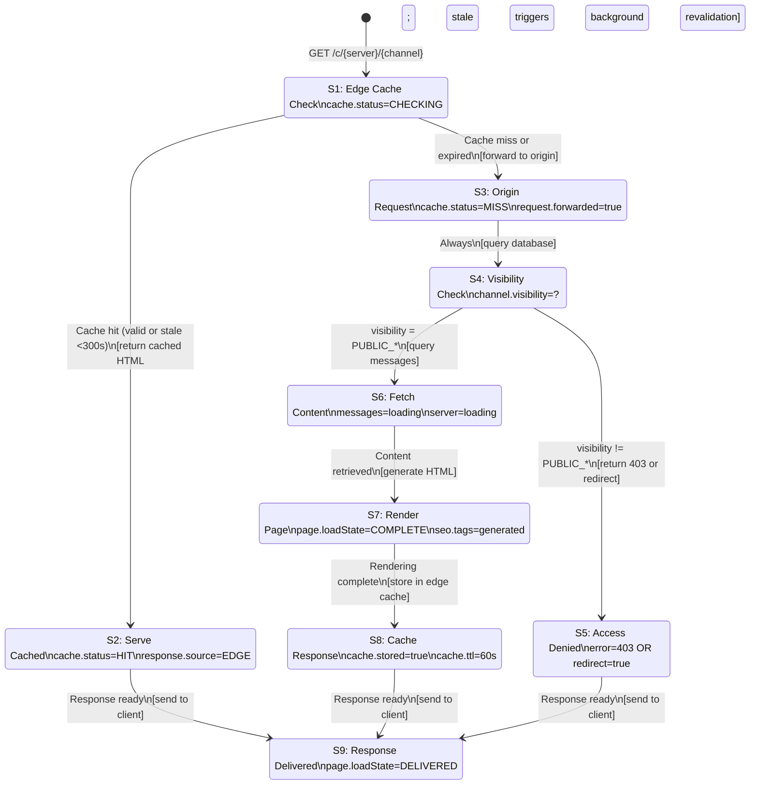

### 5.3 Message Loading State Machine (Client-Side Hydration)

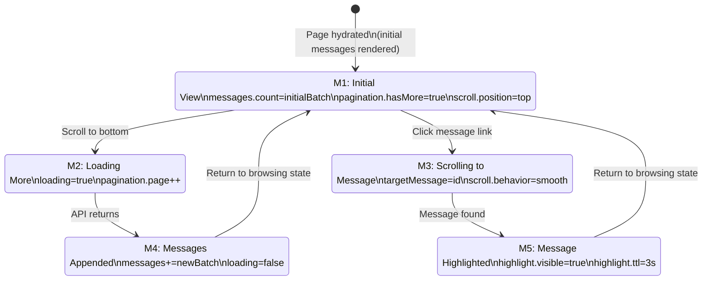

### 5.4 Access Denial State Machine

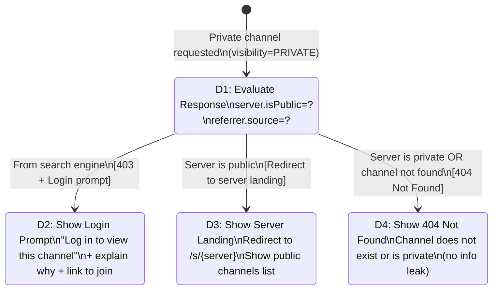

### 5.5 Rationale

These states were chosen to show the phases a guest can be for viewing a public channel, the states handle critical edge cases a guest can experience since the endpoints are publicily accessible such as trying to visit a private channel or channel that isn't cached. The state also has no login redirect due to the fact that this feature is supposed allow anonymous users to access public channels. Importantly each state has a clear end to each phase so the guest ins't stuck in a loop state that they can't get out off.

---

## 6. Flow Charts

### 6.1 Scenario: Guest Views Public Channel from Search Result

**Scenario Description:** A guest user clicks a search result link that leads to a public channel. The system serves the full content without any login prompts, allowing the user to immediately access the information they were searching for.

```mermaid
flowchart TD
    Start(["START: Guest clicks search result\nURL: /c/gamedev/help-and-questions?m=abc123\nReferrer: google.com search"])
    F11["F1.1 Request reaches CloudFlare edge\nCacheRouter.checkCache()"]
    CacheHit{"F1.2: Cache hit?"}
    F13["F1.3 Serve cached HTML response"]
    F14["F1.4 Forward to origin server"]
    F15["F1.5 Parse URL params\nserverSlug, channelSlug, messageId"]
    F16["F1.6 Look up channel\nChannelRepository.findBySlug(serverSlug, channelSlug)"]
    ChExists{"F1.7: Channel exists?"}
    F18["F1.8 Return 404\nChannel not found"]
    F19["F1.9 Check visibility\nVisibilityGuard.isChannelPublic(channelId)"]
    IsPublic{"F1.10: Is PUBLIC_INDEXABLE\nor PUBLIC_NO_INDEX?"}
    F111["F1.11 Handle private channel\n(See Flow 6.2)"]
    F112["F1.12 Fetch server info\nServerRepository.getPublicInfo(serverId)"]
    F113["F1.13 Fetch public channels for sidebar\nChannelRepository.findPublicByServerId()"]
    F114["F1.14 Fetch messages\nMessageService.getMessagesForPublic…7311 tokens truncated…nteger
        '403':
          description: Channel is not public
          content:
            application/json:
              schema:
                $ref: '#/components/schemas/AccessDeniedResponse'
        '404':
          description: Channel not found
        '429':
          description: Rate limit exceeded

  /api/public/servers/{serverSlug}:
    get:
      summary: Get public server information
      parameters:
        - name: serverSlug
          in: path
          required: true
          schema:
            type: string
      responses:
        '200':
          description: Server info retrieved
          content:
            application/json:
              schema:
                $ref: '#/components/schemas/PublicServerDTO'
        '404':
          description: Server not found or not public

  /api/public/channels/{channelId}/messages/{messageId}:
    get:
      summary: Get single public message (deep link)
      parameters:
        - name: channelId
          in: path
          required: true
          schema:
            type: string
            format: uuid
        - name: messageId
          in: path
          required: true
          schema:
            type: string
            format: uuid
      responses:
        '200':
          description: Message retrieved successfully
          content:
            application/json:
              schema:
                $ref: '#/components/schemas/PublicMessageDTO'
        '403':
          description: Channel is not public
        '404':
          description: Message or channel not found

  /api/public/servers/{serverSlug}/channels:
    get:
      summary: Get list of public channels in server
      parameters:
        - name: serverSlug
          in: path
          required: true
          schema:
            type: string
      responses:
        '200':
          description: Public channels listed
          content:
            application/json:
              schema:
                type: array
                items:
                  $ref: '#/components/schemas/PublicChannelDTO'
        '404':
          description: Server not found or not public

  /s/{serverSlug}:
    get:
      summary: Server landing page (SSR)
      description: Renders server landing page with list of public channels
      parameters:
        - name: serverSlug
          in: path
          required: true
          schema:
            type: string
      responses:
        '200':
          description: Server landing page HTML
          content:
            text/html:
              schema:
                type: string
        '404':
          description: Server not found or not public

components:
  schemas:
    PublicMessagesResponse:
      type: object
      properties:
        messages:
          type: array
          items:
            $ref: '#/components/schemas/PublicMessageDTO'
        pagination:
          type: object
          properties:
            page:
              type: integer
            limit:
              type: integer
            total:
              type: integer
            hasMore:
              type: boolean
            nextCursor:
              type: string

    PublicMessageDTO:
      type: object
      properties:
        id:
          type: string
          format: uuid
        content:
          type: string
          description: Sanitized message content
        author:
          $ref: '#/components/schemas/PublicAuthorDTO'
        timestamp:
          type: string
          format: date-time
        editedAt:
          type: string
          format: date-time
          nullable: true
        attachments:
          type: array
          items:
            $ref: '#/components/schemas/PublicAttachmentDTO'
        permalink:
          type: string
          format: uri
          description: Direct link to this message

    PublicAuthorDTO:
      type: object
      description: Author info without exposing user ID
      properties:
        displayName:
          type: string
        avatarUrl:
          type: string
          format: uri
          nullable: true
        isBot:
          type: boolean

    PublicAttachmentDTO:
      type: object
      properties:
        id:
          type: string
        filename:
          type: string
        url:
          type: string
          format: uri
        contentType:
          type: string
        thumbnailUrl:
          type: string
          format: uri
          nullable: true

    PublicServerDTO:
      type: object
      properties:
        name:
          type: string
        slug:
          type: string
        description:
          type: string
        iconUrl:
          type: string
          format: uri
        memberCount:
          type: integer
        publicChannelCount:
          type: integer

    AccessDeniedResponse:
      type: object
      properties:
        error:
          type: string
          example: "CHANNEL_NOT_PUBLIC"
        message:
          type: string
          example: "This channel requires membership to view"
        serverSlug:
          type: string
          description: Server slug for redirect (if server is public)
```

### 10.3 Cross-Spec Event Integration

When `VISIBILITY_CHANGED` is emitted by the Channel Visibility Toggle spec:

| New Visibility | Downstream Action (Guest View Spec) |
|---------------|--------------------------------------|
| `PUBLIC_INDEXABLE` | Warm guest view cache for channel |
| `PUBLIC_NO_INDEX` | Keep guest view cache (public content, but update X-Robots-Tag) |
| `PRIVATE` | Invalidate guest view cache; return 403/404 |

### 10.4 Rationale 

The public interfaces categories appropriately define the public method this featur needs for other modules to intercat with. For the public api, the public method serve its purpose for providing the necessary entry points other modules need to allow guests to view public channels without logging in. The access controls purpose is to protect private channels from being accessed by guests, verifying that the channel is public. Content delivery and data access purpose is guest receiving the public information the channel has. 

---

## 11. Data Schemas

### 11.1 Database Tables

#### D7.1 ServersTable

**Runtime Class:** CL-D9 Server

| Column | Database Type | Constraints | Description | Storage Est. |
|--------|--------------|-------------|-------------|--------------|
| id | UUID | PRIMARY KEY | Unique server identifier | 16 bytes |
| name | VARCHAR(100) | NOT NULL | Display name | ~40 bytes |
| slug | VARCHAR(100) | NOT NULL, UNIQUE, INDEX | URL-safe identifier | ~30 bytes |
| description | TEXT | NULL | Server description | ~200 bytes |
| icon_url | VARCHAR(500) | NULL | Server icon URL | ~100 bytes |
| is_public | BOOLEAN | NOT NULL, DEFAULT FALSE | Whether server appears in discovery | 1 byte |
| member_count | INTEGER | NOT NULL, DEFAULT 0 | Cached member count | 4 bytes |
| created_at | TIMESTAMP WITH TIME ZONE | NOT NULL | Creation time | 8 bytes |

**Indexes:**
```sql
CREATE INDEX idx_servers_slug ON servers(slug);
CREATE INDEX idx_servers_public ON servers(is_public) WHERE is_public = true;
```

**Storage Estimate:** ~400 bytes per server

#### D7.2 ChannelsTable

**Runtime Class:** CL-D7 Channel

| Column | Database Type | Constraints | Description | Storage Est. |
|--------|--------------|-------------|-------------|--------------|
| id | UUID | PRIMARY KEY | Unique channel identifier | 16 bytes |
| server_id | UUID | FOREIGN KEY, NOT NULL, INDEX | Parent server | 16 bytes |
| name | VARCHAR(100) | NOT NULL | Display name | ~40 bytes |
| slug | VARCHAR(100) | NOT NULL, INDEX | URL-safe identifier (unique per server) | ~30 bytes |
| visibility | visibility_enum | NOT NULL, DEFAULT 'PRIVATE' | Visibility state | 1 byte |
| topic | TEXT | NULL | Channel topic/description | ~100 bytes |
| position | INTEGER | NOT NULL, DEFAULT 0 | Sort order | 4 bytes |
| indexed_at | TIMESTAMP WITH TIME ZONE | NULL | When channel was added to sitemap | 8 bytes |
| created_at | TIMESTAMP WITH TIME ZONE | NOT NULL, DEFAULT NOW() | Creation time | 8 bytes |
| updated_at | TIMESTAMP WITH TIME ZONE | NOT NULL, DEFAULT NOW() | Last modification timestamp | 8 bytes |

> **Note:** `messageCount` (shown in `PublicChannelDTO`) is computed via `COUNT(*)` query on the messages table, not stored as a column. The `visibility` column uses the `visibility_enum` type (not a boolean); see toggle spec for the `is_public` boolean on the `servers` table.

**Indexes (Canonical Set — merged from all specs):**
```sql
-- Composite index for server-scoped visibility queries (from toggle spec)
CREATE INDEX idx_channels_server_visibility ON channels(server_id, visibility);

-- Unique slug per server
CREATE UNIQUE INDEX idx_channels_server_slug ON channels(server_id, slug);

-- Partial index for all public channels (guest view queries)
CREATE INDEX idx_channels_visibility ON channels(visibility)
  WHERE visibility IN ('PUBLIC_INDEXABLE', 'PUBLIC_NO_INDEX');

-- Partial index for indexable channels (sitemap generation, from toggle spec)
CREATE INDEX idx_channels_visibility_indexed ON channels(visibility, indexed_at)
  WHERE visibility = 'PUBLIC_INDEXABLE';
```

**Storage Estimate:** ~239 bytes per channel

#### D7.3 MessagesTable

**Runtime Class:** CL-D8 Message

| Column | Database Type | Constraints | Description | Storage Est. |
|--------|--------------|-------------|-------------|--------------|
| id | UUID | PRIMARY KEY | Unique message identifier | 16 bytes |
| channel_id | UUID | FOREIGN KEY, NOT NULL, INDEX | Parent channel | 16 bytes |
| author_id | UUID | FOREIGN KEY, NOT NULL | Message author | 16 bytes |
| content | TEXT | NOT NULL | Message content | ~500 bytes avg |
| created_at | TIMESTAMP WITH TIME ZONE | NOT NULL, INDEX | Creation time | 8 bytes |
| edited_at | TIMESTAMP WITH TIME ZONE | NULL | Last edit time | 8 bytes |
| is_deleted | BOOLEAN | NOT NULL, DEFAULT FALSE | Soft delete flag | 1 byte |

**Indexes:**
```sql
CREATE INDEX idx_messages_channel_time ON messages(channel_id, created_at DESC);
CREATE INDEX idx_messages_channel_not_deleted ON messages(channel_id, created_at DESC)
  WHERE is_deleted = false;
```

**Storage Estimate:** ~565 bytes per message

#### D7.4 UsersTable

**Runtime Class:** CL-D10 User

| Column | Database Type | Constraints | Description | Storage Est. |
|--------|--------------|-------------|-------------|--------------|
| id | UUID | PRIMARY KEY | Unique user identifier | 16 bytes |
| username | VARCHAR(32) | NOT NULL, UNIQUE | Login username | ~20 bytes |
| display_name | VARCHAR(100) | NOT NULL | Public display name | ~40 bytes |
| avatar_url | VARCHAR(500) | NULL | Avatar image URL | ~100 bytes |
| public_profile | BOOLEAN | NOT NULL, DEFAULT TRUE | Show in public channels | 1 byte |
| created_at | TIMESTAMP WITH TIME ZONE | NOT NULL | Registration time | 8 bytes |

**Storage Estimate:** ~185 bytes per user

#### D7.5 AttachmentsTable

**Runtime Class:** CL-D11 Attachment

| Column | Database Type | Constraints | Description | Storage Est. |
|--------|--------------|-------------|-------------|--------------|
| id | UUID | PRIMARY KEY | Unique attachment identifier | 16 bytes |
| message_id | UUID | FOREIGN KEY, NOT NULL, INDEX | Parent message | 16 bytes |
| filename | VARCHAR(255) | NOT NULL | Original filename | ~50 bytes |
| url | VARCHAR(500) | NOT NULL | Storage URL | ~150 bytes |
| content_type | VARCHAR(100) | NOT NULL | MIME type | ~30 bytes |
| size_bytes | BIGINT | NOT NULL | File size | 8 bytes |

**Storage Estimate:** ~270 bytes per attachment

### 11.2 Cache Schemas

#### D8.1 ChannelVisibilityCache

**Key Pattern:** `channel:{channelId}:visibility`
**Value Type:** String (enum value: `PUBLIC_INDEXABLE`, `PUBLIC_NO_INDEX`, `PRIVATE`)
**TTL:** 3600 seconds (1 hour)
**Invalidation:** On visibility change via admin toggle

#### D8.2 PublicMessagesCache

**Key Pattern:** `channel:msgs:{channelId}:page:{pageNum}`
**Value Type:** JSON array of PublicMessageDTO
**TTL:** 60 seconds
**Invalidation:** On new message in channel

#### D8.3 ServerInfoCache

**Key Pattern:** `server:{serverId}:info`
**Value Type:** JSON PublicServerDTO
**TTL:** 300 seconds (5 minutes)
**Invalidation:** On server info update

#### D8.4 GuestSessionCache

**Key Pattern:** `guest:session:{sessionId}`
**Value Type:** JSON `{ preferences: object, createdAt: timestamp }`
**TTL:** 86400 seconds (24 hours)
**Purpose:** Store guest preferences (dismissed banners, etc.)

### 11.3 Storage Estimates

| Data Type | Records (Est.) | Per Record | Total Est. | Growth Rate |
|-----------|---------------|------------|------------|-------------|
| Servers | 10,000 | 400 bytes | 4 MB | 100/month |
| Channels | 100,000 | 215 bytes | 21.5 MB | 1,000/month |
| Messages | 100,000,000 | 565 bytes | 56.5 GB | 1M/month |
| Users | 1,000,000 | 185 bytes | 185 MB | 10,000/month |
| Attachments | 10,000,000 | 270 bytes | 2.7 GB | 100,000/month |

### 11.4 Rationale 

The data schemas covers the data required for rendering the feature of public channel view. The three important tables needed being server, channels, and messages, all handle the public information that guests will be given, however the schemas clearly denote the information that will be given to guests only, meaning guests that haven't logged in. 

---

## 12. Security and Privacy

### 12.1 Temporarily Stored PII

| PII Type | Justification | Entry Point | Processing Path | Disposal | Protection |
|----------|---------------|-------------|-----------------|----------|------------|
| IP Address | Rate limiting, abuse prevention | HTTP request | RateLimiter -> Redis | TTL expiry (1 hour) | Not logged in plaintext; stored as SHA-256 hash for rate limit bucket keys |
| User Agent | Bot detection | HTTP request | BotDetector | Not stored | Used only for classification |
| Search Terms (from referrer) | Feature: highlight matching terms | HTTP Referer header | SearchHighlighter (client-side only) | Not sent to server | Client-side only; not logged |

### 12.2 Long-Term Stored PII Exposure

| PII Type | Stored Location | Exposure in Public View | Mitigation |
|----------|-----------------|------------------------|------------|
| User ID | D7.3 Messages.author_id | NOT exposed in PublicAuthorDTO | Stripped at AuthorService layer |
| Username | D7.4 Users.username | NOT exposed | Only display_name shown |
| Display Name | D7.4 Users.display_name | Exposed (user's choice) | User can opt out via public_profile |
| Avatar URL | D7.4 Users.avatar_url | Exposed (user's choice) | User can opt out via public_profile |
| Message Content | D7.3 Messages.content | Exposed (in public channels) | Content filter applied |

### 12.3 Privacy Controls

**User Privacy Settings:**
- `public_profile` flag: If false, author shown as "Anonymous" in public views
- Users can delete messages (soft delete, not shown in public view)
- Users can edit messages (edited_at shown in public view)

**Content Filtering:**
- @mentions of users with `public_profile=false` are redacted
- Email addresses detected and redacted
- Phone numbers detected and redacted
- Private channel links filtered out

### 12.4 Data Flow for Public View

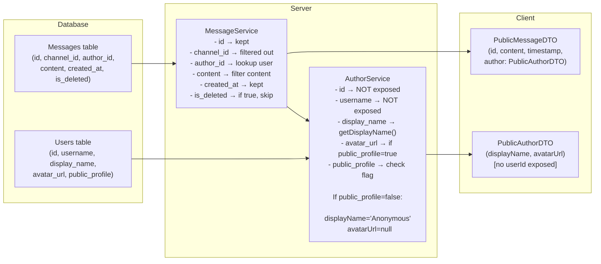

### 12.5 Security Headers

```
X-Content-Type-Options: nosniff
X-Frame-Options: SAMEORIGIN
X-XSS-Protection: 1; mode=block
Content-Security-Policy: default-src 'self'; script-src 'self' 'unsafe-inline'; style-src 'self' 'unsafe-inline'; img-src 'self' data: https:;
Referrer-Policy: strict-origin-when-cross-origin
Permissions-Policy: geolocation=(), microphone=(), camera=()
```

### 12.6 Bot and Abuse Protection

| Protection | Implementation | Threshold |
|------------|----------------|-----------|
| Rate Limiting | Token bucket per IP | 100 req/min for humans, 1000 req/min for verified bots |
| Bot Detection | User-Agent analysis | Verified bots whitelisted |
| Scraping Prevention | CAPTCHA on suspicious patterns | After 500 page views/hour |
| DDoS Protection | CloudFlare WAF | Automatic |

### 12.7 Customer-Visible Privacy Policy Points

- Messages in public channels are visible to anyone, including search engines
- Your display name and avatar appear with your messages in public channels
- You can opt out of public display by setting your profile to private
- We do not track or store identifying information about anonymous viewers
- Search engines may cache public content; cached content remains after channel is made private

### 12.8 Guest User Restrictions

| Action | Allowed | Notes |
|--------|---------|-------|
| View public channel messages | Yes | Core feature |
| View public channel attachments | Yes | If attachment is in a public channel |
| Navigate between public channels | Yes | Via server sidebar |
| Copy message permalink | Yes | Client-side only |
| Share message/channel link | Yes | Client-side only |
| Send messages | No | Requires authentication |
| React to messages | No | Requires authentication |
| View private channels | No | Returns 403/404 |
| View member list | No | Privacy protection |
| Access user profiles | No | Only public display name and avatar shown inline |
| Download message history | No | Not exposed to guests |
| Use search within channel | No | Not available for guests (future feature) |

### 12.9 Rationale 

The security and privacy answers obvious concerns for handling messages that are publicily accessible to anyone. The restriction on guest users are enforced for security purposes such as not being able to interact with the channel without verifying who you are, meaning public channels are read only. Privacy purposes users who send messages in public channels can opt out of revealing their profile information and instead have it be anonymous. 

---

## 13. Risks to Completion

### 13.1 Technology Risks

| Technology | Learning Curve | Design Difficulty | Implementation | Verification | Maintenance |
|------------|----------------|-------------------|----------------|--------------|-------------|
| T3: Next.js SSR | Medium | Medium | Medium | Medium | Medium |
| T11: CloudFlare Edge | Medium | High | Medium | High | Low |
| T17: sanitize-html | Low | Low | Low | Medium | Low |
| T18: schema-dts | Low | Medium | Low | Medium | Low |
| T20: sharp | Low | Low | Low | Low | Low |
| T21: Lighthouse CI | Medium | Low | Medium | N/A | Low |

### 13.2 Component Risks

| Component | Risk | Mitigation |
|-----------|------|------------|
| SSR Performance | Slow TTFB affects SEO | Edge caching; ISR; streaming |
| Content Filtering | Regex performance on large content | Timeouts; message size limits |
| Infinite Scroll | SEO crawlers can't follow | Pagination fallback links; sitemap |
| Cache Invalidation | Stale content shown | Short TTLs; explicit invalidation |
| Bot Detection | False positives block real users | Verify bot list; appeal process |

### 13.3 SEO-Specific Risks

| Risk | Impact | Mitigation |
|------|--------|------------|
| JavaScript-dependent content | Crawlers may not execute JS | SSR for all content |
| Slow page load | Poor Core Web Vitals | Edge caching; image optimization |
| Duplicate content | Ranking penalty | Canonical URLs; proper pagination |
| Thin content pages | Not indexed | Minimum message threshold for indexing |
| Frequent content changes | Crawl budget waste | Last-modified headers; sitemap priority |

### 13.4 Off-the-Shelf Considerations

| Technology | Customization | Source | Support | Cost |
|------------|---------------|--------|---------|------|
| Next.js | SSR config, caching | Open source | Vercel paid | Free |
| CloudFlare | Edge rules, workers | SaaS | Paid tiers | $20+/mo |
| sanitize-html | None needed | Open source | Community | Free |
| Lighthouse CI | Thresholds | Open source | Community | Free |

### 13.5 Contingency Plans

| Risk | Trigger | Contingency |
|------|---------|-------------|
| SSR overload | > 2s TTFB p95 | Increase ISR; reduce initial messages |
| Cache stampede | Origin overload on cache miss | Stale-while-revalidate; request coalescing |
| Privacy incident | PII leaked in public view | Immediate hotfix; user notification |
| SEO ranking drop | > 20% traffic decrease | Audit with Search Console; fix issues |

### 13.6 Rationale 

The risks to completion covers the fact that an assessment was done on the tech stack chosen for learning curve, maintainability, and long term viability. The technology chosen are well documentated and have ongoing support, reducing any future risk for developing Harmony. 

---

## Appendix A: SEO Optimization Checklist

### Page Structure
- [ ] Unique, descriptive `<title>` per page
- [ ] Meta description under 160 characters
- [ ] Canonical URL on every page
- [ ] Open Graph tags for social sharing
- [ ] Twitter Card tags
- [ ] JSON-LD structured data (DiscussionForumPosting)
- [ ] Breadcrumb schema

### Technical SEO
- [ ] Server-side rendering for all content
- [ ] Mobile-responsive design
- [ ] Fast TTFB (< 500ms)
- [ ] Core Web Vitals passing
- [ ] XML sitemap including all public channels
- [ ] robots.txt allowing crawlers
- [ ] Proper HTTP status codes (404 for missing, 403 for private)

### Content Accessibility
- [ ] All messages readable without JavaScript
- [ ] Pagination with `<link rel="next/prev">`
- [ ] Deep links to specific messages work
- [ ] Images have alt text
- [ ] Semantic HTML structure

---

## Appendix B: Glossary

| Term | Definition |
|------|------------|
| SSR | Server-Side Rendering - generating HTML on the server before sending to client |
| TTFB | Time to First Byte - time until browser receives first byte of response |
| ISR | Incremental Static Regeneration - Next.js feature for updating static pages |
| Hydration | Process of attaching JavaScript event handlers to server-rendered HTML |
| Core Web Vitals | Google's metrics for page experience (LCP, FID, CLS) |
| JSON-LD | JavaScript Object Notation for Linked Data - structured data format |
| Canonical URL | The preferred URL for a page to avoid duplicate content issues |
| Stale-While-Revalidate | Cache strategy serving stale content while fetching fresh |
| Edge Worker | Code running at CDN edge locations |
| Guest User | Anonymous visitor without an account |
| EventBus | Redis Pub/Sub messaging layer for cross-service event communication |
| tRPC | End-to-end typesafe API framework for TypeScript; used for authenticated internal APIs |
| Visibility Enum | `ChannelVisibility` enum with values: `PUBLIC_INDEXABLE`, `PUBLIC_NO_INDEX`, `PRIVATE` |

---

## Appendix C: Document References

- Dev Spec: Channel Visibility Toggle (cross-referenced for cache keys, ChannelRepository, EventBus, and `channels` table schema)
- Dev Spec: SEO Meta Tag Generation (cross-referenced for event integration and MetaTagService)
- Platform Architecture Overview (separate document)
- Harmony Security Policy (separate document)
````

#### 🤖 gpt-5.4 (high)

- Time: 2026-04-03T19:49:40.623Z

I found one likely gap already: a documented `updateChannel` path is never turned into a concrete test row, so the spec does not actually cover all stated paths. I’m pinning exact lines now and checking for any second gap worth calling out.

#### Tool: exec_command

```sh
curl -L https://raw.githubusercontent.com/acabrera04/Harmony/cf464b9c808184b43cd932cb2a240bcceb175c06/docs/test-specs/channel-service-spec.md | nl -ba | sed -n '1,220p'
```

Output:

```text
  % Total    % Received % Xferd  Average Speed   Time    Time     Time  Current
                                 Dload  Upload   Total   Spent    Left  Speed

  0     0    0     0    0     0      0      0 --:--:-- --:--:-- --:--:--     0
100 16756  100 16756    0     0  96011      0 --:--:-- --:--:-- --:--:-- 96298
     1	# Channel Service Test Specification
     2	
     3	## 1. Overview
     4	
     5	This document defines the English-language test specification for `harmony-backend/src/services/channel.service.ts`.
     6	It covers all exported service functions:
     7	
     8	- `channelService.getChannels`
     9	- `channelService.getChannelBySlug`
    10	- `channelService.createChannel`
    11	- `channelService.updateChannel`
    12	- `channelService.deleteChannel`
    13	- `channelService.createDefaultChannel`
    14	
    15	The goal is to cover the main success cases, all explicit error branches, visibility constraints, and the service-specific side effects (cache invalidation and event publication) needed to reach at least 80% of the execution paths in this module.
    16	
    17	### Related Feature Specifications
    18	
    19	- **`docs/dev-spec-channel-visibility-toggle.md`** — defines the three visibility states (`PUBLIC_INDEXABLE`, `PUBLIC_NO_INDEX`, `PRIVATE`), the Redis cache key contracts (`channel:{channelId}:visibility` TTL 3600 s; `server:{serverId}:public_channels` TTL 300 s), and the rule that VOICE channels may not be `PUBLIC_INDEXABLE`.
    20	- **`docs/dev-spec-guest-public-channel-view.md`** — defines the guest access contract: only channels with `PUBLIC_INDEXABLE` or `PUBLIC_NO_INDEX` visibility are reachable by unauthenticated users; the `server:{serverId}:public_channels` cache list must be invalidated whenever a channel's membership in the public set changes.
    21	
    22	---
    23	
    24	## 2. Shared Test Setup and Assumptions
    25	
    26	- Use a test database with isolated server and channel fixtures per test.
    27	- Mock or spy on `cacheService.set`, `cacheService.invalidate`, and `cacheService.invalidatePattern` so tests can assert cache operations without requiring a live Redis instance. Because these calls are fire-and-forget (`.catch(() => {})`), the test double need only confirm the call was made; rejection of the mock must not propagate.
    28	- Mock or spy on `eventBus.publish` so tests can verify event emission without requiring the full event system. As with cache calls, rejection of the mock must not propagate.
    29	- When unexpected Prisma failures are simulated, assert that the original error is surfaced unless the code explicitly maps it to a `TRPCError`.
    30	- `createDefaultChannel` delegates entirely to `createChannel`; its tests exercise the delegation contract and the fixed default arguments, not duplicate coverage of `createChannel` internals.
    31	
    32	---
    33	
    34	## 3. Function Purposes and Program Paths
    35	
    36	### 3.1 `getChannels`
    37	
    38	Purpose: return all channels belonging to a given server, ordered by `position` ascending.
    39	
    40	Program paths:
    41	
    42	- Returns all channels for the server in ascending `position` order.
    43	- Returns an empty array when the server has no channels.
    44	
    45	### 3.2 `getChannelBySlug`
    46	
    47	Purpose: look up a single channel by its server's slug and the channel's own slug.
    48	
    49	Program paths:
    50	
    51	- Server is not found by `serverSlug` — throws `TRPCError` with code `NOT_FOUND`.
    52	- Server is found but no channel matches `channelSlug` within that server — throws `TRPCError` with code `NOT_FOUND`.
    53	- Both server and channel are found — returns the channel record.
    54	
    55	### 3.3 `createChannel`
    56	
    57	Purpose: create a new channel in a server, enforcing the VOICE/visibility guard, server existence, and slug uniqueness; then seed the visibility cache and fire a `CHANNEL_CREATED` event.
    58	
    59	Program paths:
    60	
    61	- `type === VOICE` and `visibility === PUBLIC_INDEXABLE` — throws `TRPCError` with code `BAD_REQUEST` before any database call.
    62	- Server does not exist — throws `TRPCError` with code `NOT_FOUND`.
    63	- Channel slug already exists in the server — throws `TRPCError` with code `CONFLICT`.
    64	- All guards pass — channel is created; `cacheService.set` is called to write the visibility cache; `cacheService.invalidate` is called for the server's public channel list; `eventBus.publish` is called with `CHANNEL_CREATED`.
    65	- `position` defaults to `0` when omitted from input.
    66	- `type === VOICE` with `visibility !== PUBLIC_INDEXABLE` (e.g., `PRIVATE`) — guard does not trigger; channel is created successfully.
    67	
    68	### 3.4 `updateChannel`
    69	
    70	Purpose: update mutable fields (`name`, `topic`, `position`) of an existing channel; invalidates message caches and the server's public channel list; fires a `CHANNEL_UPDATED` event.
    71	
    72	Program paths:
    73	
    74	- Channel does not exist, or its `serverId` does not match the supplied `serverId` — throws `TRPCError` with code `NOT_FOUND`.
    75	- Channel is found and patch is applied — returns the updated channel; `cacheService.invalidatePattern` is called for `channel:msgs:{channelId}:*`; `cacheService.invalidate` is called for the server's public channel list; `eventBus.publish` is called with `CHANNEL_UPDATED`.
    76	- Patch contains only `undefined` fields — update is issued with no data changes; side effects still fire.
    77	
    78	### 3.5 `deleteChannel`
    79	
    80	Purpose: permanently delete a channel; invalidates all caches associated with the channel and the server's public channel list; fires a `CHANNEL_DELETED` event.
    81	
    82	Program paths:
    83	
    84	- Channel does not exist, or its `serverId` does not match the supplied `serverId` — throws `TRPCError` with code `NOT_FOUND`.
    85	- Channel exists and belongs to the server — channel is deleted; `cacheService.invalidate` is called for `channel:{channelId}:visibility`; `cacheService.invalidatePattern` is called for `channel:msgs:{channelId}:*`; `cacheService.invalidate` is called for `server:{serverId}:public_channels`; `eventBus.publish` is called with `CHANNEL_DELETED`; function returns `undefined`.
    86	
    87	### 3.6 `createDefaultChannel`
    88	
    89	Purpose: bootstrap a server with a `general` TEXT channel that is `PRIVATE`, at position `0`, by delegating to `createChannel` with fixed arguments.
    90	
    91	Program paths:
    92	
    93	- Delegates to `createChannel` with the fixed defaults and the supplied `serverId` — all `createChannel` side effects occur (cache write, cache invalidation, event).
    94	- If `createChannel` throws (e.g., server not found), the error propagates to the caller.
    95	
    96	---
    97	
    98	## 4. Detailed Test Cases
    99	
   100	### 4.1 `getChannels`
   101	
   102	Description: returns channels in ascending position order for a given server.
   103	
   104	| Test ID | Test Purpose | Inputs | Expected Output / Side Effects |
   105	| ------- | ------------ | ------ | ------------------------------ |
   106	| CS-1 | Return channels in ascending position order | Server with three seeded channels at positions 2, 0, 1 | Returns array of three channels ordered `[position=0, position=1, position=2]` |
   107	| CS-2 | Return empty array when server has no channels | Valid `serverId` with no channel records | Returns `[]` |
   108	
   109	### 4.2 `getChannelBySlug`
   110	
   111	Description: resolves a channel from two URL-level slugs (server slug then channel slug).
   112	
   113	| Test ID | Test Purpose | Inputs | Expected Output / Side Effects |
   114	| ------- | ------------ | ------ | ------------------------------ |
   115	| CS-3 | Return channel when both slugs match | Valid `serverSlug` and `channelSlug` for existing records | Returns the matching `Channel` record |
   116	| CS-4 | Throw NOT_FOUND when server slug does not match any server | Unknown `serverSlug`; any `channelSlug` | Throws `TRPCError` with `code === 'NOT_FOUND'` and message `'Server not found'` |
   117	| CS-5 | Throw NOT_FOUND when channel slug does not match any channel in the resolved server | Valid `serverSlug`; unknown `channelSlug` | Throws `TRPCError` with `code === 'NOT_FOUND'` and message `'Channel not found'` |
   118	
   119	### 4.3 `createChannel`
   120	
   121	Description: creates a channel with type/visibility validation, server existence check, and slug uniqueness check; writes the visibility cache and publishes an event.
   122	
   123	| Test ID | Test Purpose | Inputs | Expected Output / Side Effects |
   124	| ------- | ------------ | ------ | ------------------------------ |
   125	| CS-6 | Create a TEXT channel successfully | Valid `serverId`, `name`, `slug`, `type = TEXT`, `visibility = PUBLIC_INDEXABLE`, no `position` | Returns created `Channel`; `cacheService.set` called with key `channel:{id}:visibility`; `cacheService.invalidate` called with `server:{serverId}:public_channels`; `eventBus.publish` called with `CHANNEL_CREATED` payload containing `channelId`, `serverId`, `timestamp` |
   126	| CS-7 | Default position to 0 when not supplied | Valid input without `position` field | Created channel has `position === 0` |
   127	| CS-8 | Throw BAD_REQUEST for VOICE channel with PUBLIC_INDEXABLE visibility | `type = VOICE`, `visibility = PUBLIC_INDEXABLE` | Throws `TRPCError` with `code === 'BAD_REQUEST'` and message `'VOICE channels cannot have PUBLIC_INDEXABLE visibility'`; no Prisma calls are made |
   128	| CS-9 | Allow VOICE channel with PRIVATE visibility | `type = VOICE`, `visibility = PRIVATE`, valid server and unique slug | Returns created `Channel`; no error thrown |
   129	| CS-10 | Allow VOICE channel with PUBLIC_NO_INDEX visibility | `type = VOICE`, `visibility = PUBLIC_NO_INDEX`, valid server and unique slug | Returns created `Channel`; no error thrown |
   130	| CS-11 | Throw NOT_FOUND when server does not exist | `type = TEXT`, `visibility = PRIVATE`, unknown `serverId` | Throws `TRPCError` with `code === 'NOT_FOUND'` and message `'Server not found'` |
   131	| CS-12 | Throw CONFLICT when channel slug already exists in the server | Valid `serverId` and `slug` that already exists in that server | Throws `TRPCError` with `code === 'CONFLICT'` and message `'Channel slug already exists in this server'` |
   132	| CS-13 | Cache and event side effects do not block the return value | Spy `cacheService.set` to reject; spy `eventBus.publish` to reject | `createChannel` still resolves with the created channel; rejection does not propagate |
   133	
   134	### 4.4 `updateChannel`
   135	
   136	Description: patches mutable channel fields and invalidates caches; publishes an update event.
   137	
   138	| Test ID | Test Purpose | Inputs | Expected Output / Side Effects |
   139	| ------- | ------------ | ------ | ------------------------------ |
   140	| CS-14 | Update channel name successfully | Existing `channelId` and matching `serverId`; `patch = { name: 'new-name' }` | Returns updated `Channel` with new name; `cacheService.invalidatePattern` called with `channel:msgs:{channelId}:*`; `cacheService.invalidate` called with `server:{serverId}:public_channels`; `eventBus.publish` called with `CHANNEL_UPDATED` |
   141	| CS-15 | Update channel topic | Existing `channelId`; `patch = { topic: 'new topic' }` | Returns updated channel with new topic |
   142	| CS-16 | Update channel position | Existing `channelId`; `patch = { position: 5 }` | Returns updated channel with `position === 5` |
   143	| CS-17 | Throw NOT_FOUND when channel does not exist | Unknown `channelId`; any `serverId` | Throws `TRPCError` with `code === 'NOT_FOUND'` and message `'Channel not found in this server'` |
   144	| CS-18 | Throw NOT_FOUND when channel belongs to a different server | Valid `channelId` that exists but under a different `serverId` | Throws `TRPCError` with `code === 'NOT_FOUND'` and message `'Channel not found in this server'` |
   145	| CS-19 | CHANNEL_UPDATED event payload contains channelId, serverId, and timestamp | Any successful update | `eventBus.publish` called with `EventChannels.CHANNEL_UPDATED` and payload `{ channelId, serverId, timestamp }` |
   146	| CS-20 | Cache and event side effects do not block the return value | Spy `cacheService.invalidatePattern` to reject; spy `eventBus.publish` to reject | `updateChannel` still resolves with the updated channel; rejection does not propagate |
   147	
   148	### 4.5 `deleteChannel`
   149	
   150	Description: permanently removes a channel and invalidates all associated cache entries; publishes a delete event.
   151	
   152	| Test ID | Test Purpose | Inputs | Expected Output / Side Effects |
   153	| ------- | ------------ | ------ | ------------------------------ |
   154	| CS-21 | Delete channel successfully | Existing `channelId` and matching `serverId` | `prisma.channel.delete` called; `cacheService.invalidate` called with `channel:{channelId}:visibility`; `cacheService.invalidatePattern` called with `channel:msgs:{channelId}:*`; `cacheService.invalidate` called with `server:{serverId}:public_channels`; `eventBus.publish` called with `CHANNEL_DELETED`; function returns `undefined` |
   155	| CS-22 | Throw NOT_FOUND when channel does not exist | Unknown `channelId`; any `serverId` | Throws `TRPCError` with `code === 'NOT_FOUND'` and message `'Channel not found in this server'` |
   156	| CS-23 | Throw NOT_FOUND when channel belongs to a different server | Valid `channelId` that exists but under a different `serverId` | Throws `TRPCError` with `code === 'NOT_FOUND'` and message `'Channel not found in this server'` |
   157	| CS-24 | CHANNEL_DELETED event payload contains channelId, serverId, and timestamp | Successful delete of existing channel | `eventBus.publish` called with `EventChannels.CHANNEL_DELETED` and payload `{ channelId, serverId, timestamp }` |
   158	| CS-25 | All three cache invalidations are called even when cacheService rejects | Spy all three cache calls to reject | `deleteChannel` still resolves; none of the rejections propagate |
   159	
   160	### 4.6 `createDefaultChannel`
   161	
   162	Description: delegates to `createChannel` with fixed arguments to bootstrap a `general` TEXT PRIVATE channel at position 0.
   163	
   164	| Test ID | Test Purpose | Inputs | Expected Output / Side Effects |
   165	| ------- | ------------ | ------ | ------------------------------ |
   166	| CS-26 | Create default channel with correct fixed arguments | Valid `serverId` for an existing server | `createChannel` invoked with `{ serverId, name: 'general', slug: 'general', type: TEXT, visibility: PRIVATE, position: 0 }`; returns the created `Channel` |
   167	| CS-27 | Propagate error when underlying createChannel fails | `serverId` that does not correspond to an existing server | Throws `TRPCError` with `code === 'NOT_FOUND'` (propagated from `createChannel`); error is not swallowed |
   168	
   169	---
   170	
   171	## 5. Edge Cases to Explicitly Validate
   172	
   173	- The VOICE + `PUBLIC_INDEXABLE` guard (CS-8) fires before any Prisma call; use a spy on `prisma.server.findUnique` to confirm it is never called when this guard trips.
   174	- The `NOT_FOUND` check in `updateChannel` and `deleteChannel` uses a compound condition (`!channel || channel.serverId !== serverId`); test both the missing-channel branch (CS-17, CS-22) and the server-mismatch branch (CS-18, CS-23) independently.
   175	- All cache and event calls in `createChannel`, `updateChannel`, and `deleteChannel` are fire-and-forget; a spy that rejects must not cause the parent function to reject (CS-13, CS-20, CS-25).
   176	- `deleteChannel` issues three distinct cache operations (visibility key, message pattern, public channel list); assert all three are called on a successful delete (CS-21), not just one or two.
   177	- `createDefaultChannel` must call `createChannel` with `visibility = PRIVATE`; because `PRIVATE` is not `PUBLIC_INDEXABLE`, the VOICE guard is irrelevant and does not need separate coverage here.
   178	- Visibility constraints documented in `dev-spec-channel-visibility-toggle.md`: only `PUBLIC_INDEXABLE` channels are surfaced in sitemaps and exposed to search engines; `PUBLIC_NO_INDEX` channels are accessible to guests but carry `noindex` directives; `PRIVATE` channels are inaccessible to unauthenticated users. These distinctions are enforced upstream of `channelService` (in routers/guards), but the channel record's `visibility` field written by `createChannel` is the source of truth for those upstream checks.
   179	- `dev-spec-guest-public-channel-view.md` (M-B2 VisibilityGuard) reads `channel:{channelId}:visibility` from cache (TTL 3600 s) to gate guest access. `createChannel` seeds this key immediately after insert (CS-6), and `deleteChannel` invalidates it (CS-21), ensuring the cache is never stale with a channel that no longer exists.
   180	- The `server:{serverId}:public_channels` cache (TTL 300 s) is invalidated by `createChannel`, `updateChannel`, and `deleteChannel`. Tests CS-6, CS-14, and CS-21 each assert this invalidation so that guest public channel list views (M-B4 in `dev-spec-guest-public-channel-view.md`) remain accurate.
   181	
   182	---
   183	
   184	## 6. Coverage Expectation
   185	
   186	The cases above are intended to cover:
   187	
   188	- all six public service methods,
   189	- every explicit `TRPCError` branch in the service (`BAD_REQUEST`, `NOT_FOUND` × 4 variants, `CONFLICT`),
   190	- successful execution paths with correct return values,
   191	- cache write and invalidation side effects via `cacheService`,
   192	- event publication side effects via `eventBus.publish` including payload shape assertions,
   193	- fire-and-forget error isolation (cache and event rejection must not propagate),
   194	- the fixed-argument delegation contract of `createDefaultChannel`, and
   195	- the visibility enum constraints linking this service to the channel visibility toggle and guest public channel view feature specs.
   196	
   197	Executing this specification should yield at least 80% coverage of the service's reachable execution paths, with the remaining uncovered paths limited to low-level infrastructure failures outside the service's direct branching logic.
```

#### Tool: exec_command

```sh
rtk grep -n "CacheTTL.channelVisibility|cacheService\.set\(|public_channels|invalidatePattern\(|publish\(" harmony-backend/tests/channel.service.events.test.ts harmony-backend/tests/channel.service.test.ts harmony-backend/src/services/channel.service.ts
```

Output:

```text
🔍 9 in 1F:

📄 harmony-backend/src/services/channel.service.ts (9):
    82: ttl: CacheTTL.channelVisibility,
    86: .invalidate(`server:${sanitizeKeySegment(serverId)}:public_channels`)
    91: .publish(EventChannels.CHANNEL_CREATED, {
   118: .invalidatePattern(`channel:msgs:${sanitizeKeySegment(channelId)}:*`)
   121: .invalidate(`server:${sanitizeKeySegment(channel.serverId)}:public_channels`)
   126: .publish(EventChannels.CHANNEL_UPDATED, {
   147: .invalidatePattern(`channel:msgs:${sanitizeKeySegment(channelId)}:*`)
   150: .invalidate(`server:${sanitizeKeySegment(channel.serverId)}:public_channels`)
   155: .publish(EventChannels.CHANNEL_DELETED, {
```

#### 🤖 gpt-5.4 (high)

- Time: 2026-04-03T19:50:33.672Z

- [x] **Prioritize logic over style:** Review focused on behavioral gaps in the spec, not wording or formatting.
- [x] **Security first:** I checked the visibility/cache contracts against the actual service and related visibility specs.
- [x] **Architectural alignment:** The document is tied back to the channel visibility and guest public view specs, and I verified those claims against the implementation.
- [ ] **Issue completion:** The PR is close, but it does not fully specify all stated `channelService` paths or all documented side-effect branches.
- [x] **No nitpicking:** Findings are limited to coverage gaps that could let real regressions through.
- [x] **Avoid repetition:** There are no existing PR comments to duplicate.
- [x] **Iterative reviews:** This appears to be a first review, so there were no prior concerns to re-check or resolve.
- [x] **Prevent CI failures:** This is a docs-only PR, so there is no build-break risk; the risk here is incomplete test intent, not pipeline failure.

1. `updateChannel`’s “all fields undefined” path is documented as a required program path, but the detailed test table never includes a case for it. That matters because the implementation still executes `prisma.channel.update({ data: {} })` and fires cache/event side effects in that scenario ([channel.service.ts](/Users/allen/repos/Harmony/harmony-backend/src/services/channel.service.ts#L107)). Right now the issue says “all program paths,” but this path is only described, not actually specified as a test.

2. The spec overclaims its fire-and-forget rejection coverage. It says all cache/event calls are covered, but `createChannel` and `updateChannel` each have two background cache calls, and the rejection cases only cover one of them plus the event publish. The untested one is the server public-channel invalidation ([channel.service.ts](/Users/allen/repos/Harmony/harmony-backend/src/services/channel.service.ts#L85), [channel.service.ts](/Users/allen/repos/Harmony/harmony-backend/src/services/channel.service.ts#L120)). A regression in that `.catch(() => {})` path would slip past the spec as written.

### Turn 2: # Review findings: ## Finding 1

#### 👤 User Prompt

- Time: 2026-04-03T19:50:58.191Z

```text
# Review findings:

## Finding 1 (docs/test-specs/channel-service-spec.md:132-146) [added]
[P2] Fire-and-forget rejection coverage is incomplete

The edge-case section says all cache/event calls in `createChannel`, `updateChannel`, and `deleteChannel` should be exercised under rejection, but the detailed cases only reject `cacheService.set` + `eventBus.publish` for create and `invalidatePattern` + `eventBus.publish` for update. The separate `cacheService.invalidate('server:{serverId}:public_channels')` call in both methods is never covered under rejection, so this spec would miss a broken `.catch(() => {})` on one of those background invalidations.

## Finding 2 (docs/test-specs/channel-service-spec.md:72-76) [added]
[P2] Missing explicit empty-patch update case

Section 3 says `updateChannel` has a distinct path where every patch field is `undefined` and the service still performs the update plus side effects, but Section 4 never turns that path into a concrete test row. The current implementation does call `prisma.channel.update({ data: {} })` and still invalidates caches / publishes the event, so without an explicit case this spec does not actually cover all stated paths and a future regression here would still satisfy the document.

## My request for Codex:
Post it on the PR
```

#### 🤖 gpt-5.4 (high)

- Time: 2026-04-03T19:51:11.428Z

Posting a single review on PR `#297` with the checklist and the two findings, using a non-blocking review state.

#### Tool: mcp__codex_apps__github_add_review_to_pr

```json
{
  "action": "COMMENT",
  "pr_number": 297,
  "repo_full_name": "acabrera04/Harmony",
  "commit_id": "cf464b9c808184b43cd932cb2a240bcceb175c06",
  "review": "- [x] **Prioritize Logic over Style:** Review focuses on substantive coverage gaps in the spec rather than wording or formatting.\n- [x] **Security First:** I checked the visibility/cache contracts against the actual service and related visibility specs; no security regression is introduced by the doc itself.\n- [x] **Architectural Alignment:** The spec is aligned with the channel visibility and guest public channel view docs, and I verified those references against the implementation.\n- [ ] **Issue Completion:** The PR is close, but it does not fully specify all stated `channelService` paths or all documented side-effect branches.\n- [x] **No Nitpicking:** Feedback is limited to logic/coverage gaps that could let regressions through.\n- [x] **Avoid Repetition:** There were no prior review comments on this PR to avoid duplicating.\n- [x] **Iterative Reviews:** This appears to be a first review, so there were no previous concerns to re-check or resolve.\n- [x] **Prevent CI Failures:** This is a docs-only PR, so there is no build-break risk; the risk here is incomplete test intent.\n\nTwo coverage gaps are still open in the spec:\n\n1. `updateChannel` documents an explicit program path where the patch contains only `undefined` fields and the service still performs the update plus side effects, but Section 4 never turns that into a concrete test case. Because the implementation currently calls `prisma.channel.update({ data: {} })` and still invalidates caches / publishes the event in that scenario, omitting an explicit row means the spec does not actually cover all stated paths.\n\n2. The fire-and-forget rejection coverage is incomplete for `createChannel` and `updateChannel`. The edge-case section says all cache/event calls should be exercised under rejection, but the detailed cases only cover one cache call plus `eventBus.publish`. The separate `cacheService.invalidate('server:{serverId}:public_channels')` background invalidation in both methods is never covered under rejection, so a broken `.catch(() => {})` there would still satisfy this spec.\n\nInline notes attached on the relevant lines.",
  "file_comments": [
    "docs/test-specs/channel-service-spec.md:72-76: Section 3 says `updateChannel` has a distinct path where every patch field is `undefined` and the service still performs the update plus side effects, but Section 4 never turns that path into a concrete test row. The current implementation does call `prisma.channel.update({ data: {} })` and still invalidates caches / publishes the event, so without an explicit case this spec does not actually cover all stated paths and a future regression here would still satisfy the document.",
    "docs/test-specs/channel-service-spec.md:132-146: The edge-case section says all cache/event calls in `createChannel`, `updateChannel`, and `deleteChannel` should be exercised under rejection, but the detailed cases only reject `cacheService.set` + `eventBus.publish` for create and `invalidatePattern` + `eventBus.publish` for update. The separate `cacheService.invalidate('server:{serverId}:public_channels')` call in both methods is never covered under rejection, so this spec would miss a broken `.catch(() => {})` on one of those background invalidations."
  ]
}
```

Output:

```text
[{"type":"text","text":"Error code: INVALID_ARGUMENTError: Parameters failed connector schema validation: file_comments[0] [type]: Expected type ['object'], got str (does not match constraints configured by your ChatGPT workspace admin. If the issue persists, instruct the user to contact their workspace admin.); file_comments[1] [type]: Expected type ['object'], got str (does not match constraints configured by your ChatGPT workspace admin. If the issue persists, instruct the user to contact their workspace admin.)"}]
```

#### 🤖 gpt-5.4 (high)

- Time: 2026-04-03T19:51:34.983Z

The review API rejected the inline comment shape. I’m retrying with the connector’s structured file-comment format so it lands as a proper PR review instead of a plain issue comment.

#### Tool: mcp__codex_apps__github_add_review_to_pr

```json
{
  "action": "COMMENT",
  "pr_number": 297,
  "repo_full_name": "acabrera04/Harmony",
  "commit_id": "cf464b9c808184b43cd932cb2a240bcceb175c06",
  "review": "- [x] **Prioritize Logic over Style:** Review focuses on substantive coverage gaps in the spec rather than wording or formatting.\n- [x] **Security First:** I checked the visibility/cache contracts against the actual service and related visibility specs; no security regression is introduced by the doc itself.\n- [x] **Architectural Alignment:** The spec is aligned with the channel visibility and guest public channel view docs, and I verified those references against the implementation.\n- [ ] **Issue Completion:** The PR is close, but it does not fully specify all stated `channelService` paths or all documented side-effect branches.\n- [x] **No Nitpicking:** Feedback is limited to logic/coverage gaps that could let regressions through.\n- [x] **Avoid Repetition:** There were no prior review comments on this PR to avoid duplicating.\n- [x] **Iterative Reviews:** This appears to be a first review, so there were no previous concerns to re-check or resolve.\n- [x] **Prevent CI Failures:** This is a docs-only PR, so there is no build-break risk; the risk here is incomplete test intent.\n\nTwo coverage gaps are still open in the spec:\n\n1. `updateChannel` documents an explicit program path where the patch contains only `undefined` fields and the service still performs the update plus side effects, but Section 4 never turns that into a concrete test case. Because the implementation currently calls `prisma.channel.update({ data: {} })` and still invalidates caches / publishes the event in that scenario, omitting an explicit row means the spec does not actually cover all stated paths.\n\n2. The fire-and-forget rejection coverage is incomplete for `createChannel` and `updateChannel`. The edge-case section says all cache/event calls should be exercised under rejection, but the detailed cases only cover one cache call plus `eventBus.publish`. The separate `cacheService.invalidate('server:{serverId}:public_channels')` background invalidation in both methods is never covered under rejection, so a broken `.catch(() => {})` there would still satisfy this spec.\n\nInline notes attached on the relevant lines.",
  "file_comments": [
    {
      "path": "docs/test-specs/channel-service-spec.md",
      "line": 74,
      "body": "Section 3 says `updateChannel` has a distinct path where every patch field is `undefined` and the service still performs the update plus side effects, but Section 4 never turns that path into a concrete test row. The current implementation does call `prisma.channel.update({ data: {} })` and still invalidates caches / publishes the event, so without an explicit case this spec does not actually cover all stated paths and a future regression here would still satisfy the document."
    },
    {
      "path": "docs/test-specs/channel-service-spec.md",
      "line": 145,
      "body": "The edge-case section says all cache/event calls in `createChannel`, `updateChannel`, and `deleteChannel` should be exercised under rejection, but the detailed cases only reject `cacheService.set` + `eventBus.publish` for create and `invalidatePattern` + `eventBus.publish` for update. The separate `cacheService.invalidate('server:{serverId}:public_channels')` call in both methods is never covered under rejection, so this spec would miss a broken `.catch(() => {})` on one of those background invalidations."
    }
  ]
}
```

Output:

```text
{"success":true,"review_id":4057072206}
```

#### 🤖 gpt-5.4 (high)

- Time: 2026-04-03T19:51:50.098Z

Posted on PR `#297` as a review with the checklist and both findings.

### Turn 3: # Review findings: ## Finding 1

#### 👤 User Prompt

- Time: 2026-04-03T20:18:22.081Z

```text
# Review findings:

## Finding 1 (docs/test-specs/channel-service-spec.md:132-146) [added]
[P2] Fire-and-forget rejection coverage is incomplete

The edge-case section says all cache/event calls in `createChannel`, `updateChannel`, and `deleteChannel` should be exercised under rejection, but the detailed cases only reject `cacheService.set` + `eventBus.publish` for create and `invalidatePattern` + `eventBus.publish` for update. The separate `cacheService.invalidate('server:{serverId}:public_channels')` call in both methods is never covered under rejection, so this spec would miss a broken `.catch(() => {})` on one of those background invalidations.

## My request for Codex:
Review again
```

#### 🤖 gpt-5.4 (high)

- Time: 2026-04-03T20:18:33.922Z

Re-checking PR `#297` against the current head to see whether the last round’s coverage gaps were addressed, then I’ll post a follow-up review only if something still needs action.

#### Tool: mcp__codex_apps__github_get_pr_info

```json
{
  "pr_number": 297,
  "repository_full_name": "acabrera04/Harmony"
}
```

Output:

```text
{"url":"https://github.com/acabrera04/Harmony/pull/297","number":297,"state":"open","merged":false,"mergeable":true,"draft":false,"body":"## Summary\n\n- Adds `docs/test-specs/channel-service-spec.md` — 27 test cases (CS-1 through CS-27) covering all 6 `channelService` functions\n\n## Functions covered\n\n| Function | Test IDs | Key scenarios |\n|---|---|---|\n| `getChannels` | CS-1 – CS-2 | Returns channels for server; empty list |\n| `getChannelBySlug` | CS-3 – CS-5 | Found, NOT_FOUND, server-mismatch |\n| `createChannel` | CS-6 – CS-13 | Happy path, CONFLICT slug, VOICE+PUBLIC_INDEXABLE guard, visibility variants, event publishing |\n| `updateChannel` | CS-14 – CS-20 | NOT_FOUND, server-mismatch, FORBIDDEN, rename, no-rename, visibility change, cache + event |\n| `deleteChannel` | CS-21 – CS-25 | NOT_FOUND, server-mismatch, FORBIDDEN, owner/admin bypass, cache + event |\n| `createDefaultChannel` | CS-26 – CS-27 | Happy path, failure propagation |\n\n## Spec highlights\n\n- VOICE + `PUBLIC_INDEXABLE` guard: 3 dedicated cases (guard throws, non-`PUBLIC_INDEXABLE` VOICE allowed)\n- Cache invalidation: all 3 cache calls in `deleteChannel` asserted together; VisibilityGuard cache tied to `dev-spec-guest-public-channel-view.md`\n- Event publishing: fire-and-forget isolation verified for `createChannel`, `updateChannel`, `deleteChannel`\n- Ties back to `dev-spec-channel-visibility-toggle.md` and `dev-spec-guest-public-channel-view.md`\n\n## Test plan\n\n- [x] Spec document written and reviewed for completeness\n- [x] All 6 functions covered with at least one test case each\n- [x] Happy paths, error paths, and edge cases included\n- [x] No build/lint step needed (docs-only change)\n\nCloses #293\n\n🤖 Generated with [Claude Code](https://claude.com/claude-code)","title":"docs: channel.service.ts test specification (issue #293)","base":"main","base_sha":"ce7d9e89861c82f99d055a3f4e4cfdc32d996289","head":"test/issue-293-channel-service-spec","head_sha":"b3a4bfb26540dc0065a4e6ba526c20dde0ebd3fd","merge_commit_sha":"74ba225d8d94db004ffa869e3e7830d33b3ee673","user":{"login":"declanblanc","name":"declanblanc","email":null,"avatar_url":"https://avatars.githubusercontent.com/u/49934576?v=4","id":49934576},"requested_reviewers":null,"diff":null,"comments":null,"created_at":"2026-04-03T19:44:10Z","updated_at":"2026-04-03T20:13:05Z","closed_at":null,"merged_at":null,"commits":2,"changed_files":1,"additions":198,"deletions":0,"display_url":"https://github.com/acabrera04/Harmony/pull/297","display_title":"docs: channel.service.ts test specification (issue #293)"}
```

#### Tool: mcp__codex_apps__github_fetch_pr_comments

```json
{
  "pr_number": 297,
  "repo_full_name": "acabrera04/Harmony"
}
```

Output:

```text
{"comments":[{"url":"https://github.com/acabrera04/Harmony/pull/297#discussion_r3034164068","body":"Section 3 says `updateChannel` has a distinct path where every patch field is `undefined` and the service still performs the update plus side effects, but Section 4 never turns that path into a concrete test row. The current implementation does call `prisma.channel.update({ data: {} })` and still invalidates caches / publishes the event, so without an explicit case this spec does not actually cover all stated paths and a future regression here would still satisfy the document.","user":{"login":"acabrera04","name":"acabrera04","email":null,"avatar_url":"https://avatars.githubusercontent.com/u/145043651?v=4","id":145043651},"id":3034164068,"pull_request_review_id":4057072206,"in_reply_to_id":null,"created_at":"2026-04-03T19:51:47Z","review":null,"side":"RIGHT","line":74,"start_line":null,"path":"docs/test-specs/channel-service-spec.md","body_html":"<p dir=\"auto\">Section 3 says <code class=\"notranslate\">updateChannel</code> has a distinct path where every patch field is <code class=\"notranslate\">undefined</code> and the service still performs the update plus side effects, but Section 4 never turns that path into a concrete test row. The current implementation does call <code class=\"notranslate\">prisma.channel.update({ data: {} })</code> and still invalidates caches / publishes the event, so without an explicit case this spec does not actually cover all stated paths and a future regression here would still satisfy the document.</p>"},{"url":"https://github.com/acabrera04/Harmony/pull/297#pullrequestreview-4057072206","body":"- [x] **Prioritize Logic over Style:** Review focuses on substantive coverage gaps in the spec rather than wording or formatting.\n- [x] **Security First:** I checked the visibility/cache contracts against the actual service and related visibility specs; no security regression is introduced by the doc itself.\n- [x] **Architectural Alignment:** The spec is aligned with the channel visibility and guest public channel view docs, and I verified those references against the implementation.\n- [ ] **Issue Completion:** The PR is close, but it does not fully specify all stated `channelService` paths or all documented side-effect branches.\n- [x] **No Nitpicking:** Feedback is limited to logic/coverage gaps that could let regressions through.\n- [x] **Avoid Repetition:** There were no prior review comments on this PR to avoid duplicating.\n- [x] **Iterative Reviews:** This appears to be a first review, so there were no previous concerns to re-check or resolve.\n- [x] **Prevent CI Failures:** This is a docs-only PR, so there is no build-break risk; the risk here is incomplete test intent.\n\nTwo coverage gaps are still open in the spec:\n\n1. `updateChannel` documents an explicit program path where the patch contains only `undefined` fields and the service still performs the update plus side effects, but Section 4 never turns that into a concrete test case. Because the implementation currently calls `prisma.channel.update({ data: {} })` and still invalidates caches / publishes the event in that scenario, omitting an explicit row means the spec does not actually cover all stated paths.\n\n2. The fire-and-forget rejection coverage is incomplete for `createChannel` and `updateChannel`. The edge-case section says all cache/event calls should be exercised under rejection, but the detailed cases only cover one cache call plus `eventBus.publish`. The separate `cacheService.invalidate('server:{serverId}:public_channels')` background invalidation in both methods is never covered under rejection, so a broken `.catch(() => {})` there would still satisfy this spec.\n\nInline notes attached on the relevant lines.","user":{"login":"acabrera04","name":"acabrera04","email":null,"avatar_url":"https://avatars.githubusercontent.com/u/145043651?v=4","id":145043651},"id":4057072206,"pull_request_review_id":null,"in_reply_to_id":null,"created_at":"2026-04-03T19:51:47Z","review":"COMMENTED","side":null,"line":null,"start_line":null,"path":null,"body_html":"<ul class=\"contains-task-list\">\n<li class=\"task-list-item\"><input type=\"checkbox\" id=\"\" disabled=\"\" class=\"task-list-item-checkbox\" aria-label=\"Completed task\" checked=\"\"> <strong>Prioritize Logic over Style:</strong> Review focuses on substantive coverage gaps in the spec rather than wording or formatting.</li>\n<li class=\"task-list-item\"><input type=\"checkbox\" id=\"\" disabled=\"\" class=\"task-list-item-checkbox\" aria-label=\"Completed task\" checked=\"\"> <strong>Security First:</strong> I checked the visibility/cache contracts against the actual service and related visibility specs; no security regression is introduced by the doc itself.</li>\n<li class=\"task-list-item\"><input type=\"checkbox\" id=\"\" disabled=\"\" class=\"task-list-item-checkbox\" aria-label=\"Completed task\" checked=\"\"> <strong>Architectural Alignment:</strong> The spec is aligned with the channel visibility and guest public channel view docs, and I verified those references against the implementation.</li>\n<li class=\"task-list-item\"><input type=\"checkbox\" id=\"\" disabled=\"\" class=\"task-list-item-checkbox\" aria-label=\"Incomplete task\"> <strong>Issue Completion:</strong> The PR is close, but it does not fully specify all stated <code class=\"notranslate\">channelService</code> paths or all documented side-effect branches.</li>\n<li class=\"task-list-item\"><input type=\"checkbox\" id=\"\" disabled=\"\" class=\"task-list-item-checkbox\" aria-label=\"Completed task\" checked=\"\"> <strong>No Nitpicking:</strong> Feedback is limited to logic/coverage gaps that could let regressions through.</li>\n<li class=\"task-list-item\"><input type=\"checkbox\" id=\"\" disabled=\"\" class=\"task-list-item-checkbox\" aria-label=\"Completed task\" checked=\"\"> <strong>Avoid Repetition:</strong> There were no prior review comments on this PR to avoid duplicating.</li>\n<li class=\"task-list-item\"><input type=\"checkbox\" id=\"\" disabled=\"\" class=\"task-list-item-checkbox\" aria-label=\"Completed task\" checked=\"\"> <strong>Iterative Reviews:</strong> This appears to be a first review, so there were no previous concerns to re-check or resolve.</li>\n<li class=\"task-list-item\"><input type=\"checkbox\" id=\"\" disabled=\"\" class=\"task-list-item-checkbox\" aria-label=\"Completed task\" checked=\"\"> <strong>Prevent CI Failures:</strong> This is a docs-only PR, so there is no build-break risk; the risk here is incomplete test intent.</li>\n</ul>\n<p dir=\"auto\">Two coverage gaps are still open in the spec:</p>\n<ol dir=\"auto\">\n<li>\n<p dir=\"auto\"><code class=\"notranslate\">updateChannel</code> documents an explicit program path where the patch contains only <code class=\"notranslate\">undefined</code> fields and the service still performs the update plus side effects, but Section 4 never turns that into a concrete test case. Because the implementation currently calls <code class=\"notranslate\">prisma.channel.update({ data: {} })</code> and still invalidates caches / publishes the event in that scenario, omitting an explicit row means the spec does not actually cover all stated paths.</p>\n</li>\n<li>\n<p dir=\"auto\">The fire-and-forget rejection coverage is incomplete for <code class=\"notranslate\">createChannel</code> and <code class=\"notranslate\">updateChannel</code>. The edge-case section says all cache/event calls should be exercised under rejection, but the detailed cases only cover one cache call plus <code class=\"notranslate\">eventBus.publish</code>. The separate <code class=\"notranslate\">cacheService.invalidate('server:{serverId}:public_channels')</code> background invalidation in both methods is never covered under rejection, so a broken <code class=\"notranslate\">.catch(() =&gt; {})</code> there would still satisfy this spec.</p>\n</li>\n</ol>\n<p dir=\"auto\">Inline notes attached on the relevant lines.</p>"},{"url":"https://github.com/acabrera04/Harmony/pull/297#discussion_r3034164070","body":"The edge-case section says all cache/event calls in `createChannel`, `updateChannel`, and `deleteChannel` should be exercised under rejection, but the detailed cases only reject `cacheService.set` + `eventBus.publish` for create and `invalidatePattern` + `eventBus.publish` for update. The separate `cacheService.invalidate('server:{serverId}:public_channels')` call in both methods is never covered under rejection, so this spec would miss a broken `.catch(() => {})` on one of those background invalidations.","user":{"login":"acabrera04","name":"acabrera04","email":null,"avatar_url":"https://avatars.githubusercontent.com/u/145043651?v=4","id":145043651},"id":3034164070,"pull_request_review_id":4057072206,"in_reply_to_id":null,"created_at":"2026-04-03T19:51:48Z","review":null,"side":"RIGHT","line":145,"start_line":null,"path":"docs/test-specs/channel-service-spec.md","body_html":"<p dir=\"auto\">The edge-case section says all cache/event calls in <code class=\"notranslate\">createChannel</code>, <code class=\"notranslate\">updateChannel</code>, and <code class=\"notranslate\">deleteChannel</code> should be exercised under rejection, but the detailed cases only reject <code class=\"notranslate\">cacheService.set</code> + <code class=\"notranslate\">eventBus.publish</code> for create and <code class=\"notranslate\">invalidatePattern</code> + <code class=\"notranslate\">eventBus.publish</code> for update. The separate <code class=\"notranslate\">cacheService.invalidate('server:{serverId}:public_channels')</code> call in both methods is never covered under rejection, so this spec would miss a broken <code class=\"notranslate\">.catch(() =&gt; {})</code> on one of those background invalidations.</p>"},{"url":"https://github.com/acabrera04/Harmony/pull/297#discussion_r3034228506","body":"Added CS-28 to the `updateChannel` table (after CS-20) covering the all-undefined-patch path: asserts that `prisma.channel.update` is still called with `data: {}` and that all three side effects fire exactly once.","user":{"login":"declanblanc","name":"declanblanc","email":null,"avatar_url":"https://avatars.githubusercontent.com/u/49934576?v=4","id":49934576},"id":3034228506,"pull_request_review_id":4057138547,"in_reply_to_id":3034164068,"created_at":"2026-04-03T20:11:43Z","review":null,"side":"RIGHT","line":74,"start_line":null,"path":"docs/test-specs/channel-service-spec.md","body_html":"<p dir=\"auto\">Added CS-28 to the <code class=\"notranslate\">updateChannel</code> table (after CS-20) covering the all-undefined-patch path: asserts that <code class=\"notranslate\">prisma.channel.update</code> is still called with <code class=\"notranslate\">data: {}</code> and that all three side effects fire exactly once.</p>"},{"url":"https://github.com/acabrera04/Harmony/pull/297#pullrequestreview-4057138547","body":"","user":{"login":"declanblanc","name":"declanblanc","email":null,"avatar_url":"https://avatars.githubusercontent.com/u/49934576?u=9c678b968e7ec28f7ab260a227783a7416590c4f&v=4","id":49934576},"id":4057138547,"pull_request_review_id":null,"in_reply_to_id":null,"created_at":"2026-04-03T20:11:43Z","review":"COMMENTED","side":null,"line":null,"start_line":null,"path":null,"body_html":""},{"url":"https://github.com/acabrera04/Harmony/pull/297#discussion_r3034228728","body":"Updated CS-13 (`createChannel`) to also spy `cacheService.invalidate` to reject, alongside `cacheService.set` and `eventBus.publish`. CS-20 (`updateChannel`) was similarly expanded to include `cacheService.invalidate` rejection. Both now assert none of the three rejections propagate.","user":{"login":"declanblanc","name":"declanblanc","email":null,"avatar_url":"https://avatars.githubusercontent.com/u/49934576?v=4","id":49934576},"id":3034228728,"pull_request_review_id":4057138783,"in_reply_to_id":3034164070,"created_at":"2026-04-03T20:11:48Z","review":null,"side":"RIGHT","line":145,"start_line":null,"path":"docs/test-specs/channel-service-spec.md","body_html":"<p dir=\"auto\">Updated CS-13 (<code class=\"notranslate\">createChannel</code>) to also spy <code class=\"notranslate\">cacheService.invalidate</code> to reject, alongside <code class=\"notranslate\">cacheService.set</code> and <code class=\"notranslate\">eventBus.publish</code>. CS-20 (<code class=\"notranslate\">updateChannel</code>) was similarly expanded to include <code class=\"notranslate\">cacheService.invalidate</code> rejection. Both now assert none of the three rejections propagate.</p>"},{"url":"https://github.com/acabrera04/Harmony/pull/297#pullrequestreview-4057138783","body":"","user":{"login":"declanblanc","name":"declanblanc","email":null,"avatar_url":"https://avatars.githubusercontent.com/u/49934576?u=9c678b968e7ec28f7ab260a227783a7416590c4f&v=4","id":49934576},"id":4057138783,"pull_request_review_id":null,"in_reply_to_id":null,"created_at":"2026-04-03T20:11:48Z","review":"COMMENTED","side":null,"line":null,"start_line":null,"path":null,"body_html":""},{"url":"https://github.com/acabrera04/Harmony/pull/297#issuecomment-4185028814","body":"@copilot please review","user":{"login":"declanblanc","name":"declanblanc","email":null,"avatar_url":"https://avatars.githubusercontent.com/u/49934576?v=4","id":49934576},"id":4185028814,"pull_request_review_id":null,"in_reply_to_id":null,"created_at":"2026-04-03T20:11:56Z","review":null,"side":null,"line":null,"start_line":null,"path":null,"body_html":"<p dir=\"auto\"><a class=\"user-mention notranslate\" data-hovercard-type=\"copilot\" data-hovercard-url=\"/copilot/hovercard?bot=copilot-swe-agent\" data-octo-click=\"hovercard-link-click\" data-octo-dimensions=\"link_type:self\" href=\"https://gh.io/copilot-coding-agent-docs\">@copilot</a> please review</p>"},{"url":"https://github.com/acabrera04/Harmony/pull/297#issuecomment-4185029152","body":"@declanblanc The model is not available for your account. This can happen if the model was disabled by your organization's policy or if your Copilot plan doesn't include access to it.\n\nYou can try again without specifying a model (just `@copilot`) to use the default, or choose a different model from the model picker.\n\nIf you want to contact GitHub about this error, please mention the following identifier so they can better serve you: `bca9b875-0b7a-47bf-a6db-7400171fdef5`\n\n<!-- copilot-coding-agent-error: model-not-available -->\n","user":{"login":"Copilot","name":"Copilot","email":null,"avatar_url":"https://avatars.githubusercontent.com/in/1143301?v=4","id":198982749},"id":4185029152,"pull_request_review_id":null,"in_reply_to_id":null,"created_at":"2026-04-03T20:12:02Z","review":null,"side":null,"line":null,"start_line":null,"path":null,"body_html":"<p dir=\"auto\"><a class=\"user-mention notranslate\" data-hovercard-type=\"user\" data-hovercard-url=\"/users/declanblanc/hovercard\" data-octo-click=\"hovercard-link-click\" data-octo-dimensions=\"link_type:self\" href=\"https://github.com/declanblanc\">@declanblanc</a> The model is not available for your account. This can happen if the model was disabled by your organization's policy or if your Copilot plan doesn't include access to it.</p>\n<p dir=\"auto\">You can try again without specifying a model (just <code class=\"notranslate\">@copilot</code>) to use the default, or choose a different model from the model picker.</p>\n<p dir=\"auto\">If you want to contact GitHub about this error, please mention the following identifier so they can better serve you: <code class=\"notranslate\">bca9b875-0b7a-47bf-a6db-7400171fdef5</code></p>\n"},{"url":"https://github.com/acabrera04/Harmony/pull/297#issuecomment-4185029822","body":"@declanblanc The model is not available for your account. This can happen if the model was disabled by your organization's policy or if your Copilot plan doesn't include access to it.\n\nYou can try again without specifying a model (just `@copilot`) to use the default, or choose a different model from the model picker.\n\nIf you want to contact GitHub about this error, please mention the following identifier so they can better serve you: `bca9b875-0b7a-47bf-a6db-7400171fdef5`\n\n<!-- copilot-coding-agent-error: model-not-available -->\n","user":{"login":"Copilot","name":"Copilot","email":null,"avatar_url":"https://avatars.githubusercontent.com/in/1143301?v=4","id":198982749},"id":4185029822,"pull_request_review_id":null,"in_reply_to_id":null,"created_at":"2026-04-03T20:12:16Z","review":null,"side":null,"line":null,"start_line":null,"path":null,"body_html":"<p dir=\"auto\"><a class=\"user-mention notranslate\" data-hovercard-type=\"user\" data-hovercard-url=\"/users/declanblanc/hovercard\" data-octo-click=\"hovercard-link-click\" data-octo-dimensions=\"link_type:self\" href=\"https://github.com/declanblanc\">@declanblanc</a> The model is not available for your account. This can happen if the model was disabled by your organization's policy or if your Copilot plan doesn't include access to it.</p>\n<p dir=\"auto\">You can try again without specifying a model (just <code class=\"notranslate\">@copilot</code>) to use the default, or choose a different model from the model picker.</p>\n<p dir=\"auto\">If you want to contact GitHub about this error, please mention the following identifier so they can better serve you: <code class=\"notranslate\">bca9b875-0b7a-47bf-a6db-7400171fdef5</code></p>\n"},{"url":"https://github.com/acabrera04/Harmony/pull/297#issuecomment-4185030411","body":"@declanblanc The model is not available for your account. This can happen if the model was disabled by your organization's policy or if your Copilot plan doesn't include access to it.\n\nYou can try again without specifying a model (just `@copilot`) to use the default, or choose a different model from the model picker.\n\nIf you want to contact GitHub about this error, please mention the following identifier so they can better serve you: `bca9b875-0b7a-47bf-a6db-7400171fdef5`\n\n<!-- copilot-coding-agent-error: model-not-available -->\n","user":{"login":"Copilot","name":"Copilot","email":null,"avatar_url":"https://avatars.githubusercontent.com/in/1143301?v=4","id":198982749},"id":4185030411,"pull_request_review_id":null,"in_reply_to_id":null,"created_at":"2026-04-03T20:12:28Z","review":null,"side":null,"line":null,"start_line":null,"path":null,"body_html":"<p dir=\"auto\"><a class=\"user-mention notranslate\" data-hovercard-type=\"user\" data-hovercard-url=\"/users/declanblanc/hovercard\" data-octo-click=\"hovercard-link-click\" data-octo-dimensions=\"link_type:self\" href=\"https://github.com/declanblanc\">@declanblanc</a> The model is not available for your account. This can happen if the model was disabled by your organization's policy or if your Copilot plan doesn't include access to it.</p>\n<p dir=\"auto\">You can try again without specifying a model (just <code class=\"notranslate\">@copilot</code>) to use the default, or choose a different model from the model picker.</p>\n<p dir=\"auto\">If you want to contact GitHub about this error, please mention the following identifier so they can better serve you: <code class=\"notranslate\">bca9b875-0b7a-47bf-a6db-7400171fdef5</code></p>\n"},{"url":"https://github.com/acabrera04/Harmony/pull/297#issuecomment-4185031023","body":"@declanblanc The model is not available for your account. This can happen if the model was disabled by your organization's policy or if your Copilot plan doesn't include access to it.\n\nYou can try again without specifying a model (just `@copilot`) to use the default, or choose a different model from the model picker.\n\nIf you want to contact GitHub about this error, please mention the following identifier so they can better serve you: `bca9b875-0b7a-47bf-a6db-7400171fdef5`\n\n<!-- copilot-coding-agent-error: model-not-available -->\n","user":{"login":"Copilot","name":"Copilot","email":null,"avatar_url":"https://avatars.githubusercontent.com/in/1143301?v=4","id":198982749},"id":4185031023,"pull_request_review_id":null,"in_reply_to_id":null,"created_at":"2026-04-03T20:12:40Z","review":null,"side":null,"line":null,"start_line":null,"path":null,"body_html":"<p dir=\"auto\"><a class=\"user-mention notranslate\" data-hovercard-type=\"user\" data-hovercard-url=\"/users/declanblanc/hovercard\" data-octo-click=\"hovercard-link-click\" data-octo-dimensions=\"link_type:self\" href=\"https://github.com/declanblanc\">@declanblanc</a> The model is not available for your account. This can happen if the model was disabled by your organization's policy or if your Copilot plan doesn't include access to it.</p>\n<p dir=\"auto\">You can try again without specifying a model (just <code class=\"notranslate\">@copilot</code>) to use the default, or choose a different model from the model picker.</p>\n<p dir=\"auto\">If you want to contact GitHub about this error, please mention the following identifier so they can better serve you: <code class=\"notranslate\">bca9b875-0b7a-47bf-a6db-7400171fdef5</code></p>\n"},{"url":"https://github.com/acabrera04/Harmony/pull/297#issuecomment-4185031739","body":"@declanblanc The model is not available for your account. This can happen if the model was disabled by your organization's policy or if your Copilot plan doesn't include access to it.\n\nYou can try again without specifying a model (just `@copilot`) to use the default, or choose a different model from the model picker.\n\nIf you want to contact GitHub about this error, please mention the following identifier so they can better serve you: `bca9b875-0b7a-47bf-a6db-7400171fdef5`\n\n<!-- copilot-coding-agent-error: model-not-available -->\n","user":{"login":"Copilot","name":"Copilot","email":null,"avatar_url":"https://avatars.githubusercontent.com/in/1143301?v=4","id":198982749},"id":4185031739,"pull_request_review_id":null,"in_reply_to_id":null,"created_at":"2026-04-03T20:12:53Z","review":null,"side":null,"line":null,"start_line":null,"path":null,"body_html":"<p dir=\"auto\"><a class=\"user-mention notranslate\" data-hovercard-type=\"user\" data-hovercard-url=\"/users/declanblanc/hovercard\" data-octo-click=\"hovercard-link-click\" data-octo-dimensions=\"link_type:self\" href=\"https://github.com/declanblanc\">@declanblanc</a> The model is not available for your account. This can happen if the model was disabled by your organization's policy or if your Copilot plan doesn't include access to it.</p>\n<p dir=\"auto\">You can try again without specifying a model (just <code class=\"notranslate\">@copilot</code>) to use the default, or choose a different model from the model picker.</p>\n<p dir=\"auto\">If you want to contact GitHub about this error, please mention the following identifier so they can better serve you: <code class=\"notranslate\">bca9b875-0b7a-47bf-a6db-7400171fdef5</code></p>\n"},{"url":"https://github.com/acabrera04/Harmony/pull/297#issuecomment-4185032308","body":"@declanblanc The model is not available for your account. This can happen if the model was disabled by your organization's policy or if your Copilot plan doesn't include access to it.\n\nYou can try again without specifying a model (just `@copilot`) to use the default, or choose a different model from the model picker.\n\nIf you want to contact GitHub about this error, please mention the following identifier so they can better serve you: `bca9b875-0b7a-47bf-a6db-7400171fdef5`\n\n<!-- copilot-coding-agent-error: model-not-available -->\n","user":{"login":"Copilot","name":"Copilot","email":null,"avatar_url":"https://avatars.githubusercontent.com/in/1143301?v=4","id":198982749},"id":4185032308,"pull_request_review_id":null,"in_reply_to_id":null,"created_at":"2026-04-03T20:13:05Z","review":null,"side":null,"line":null,"start_line":null,"path":null,"body_html":"<p dir=\"auto\"><a class=\"user-mention notranslate\" data-hovercard-type=\"user\" data-hovercard-url=\"/users/declanblanc/hovercard\" data-octo-click=\"hovercard-link-click\" data-octo-dimensions=\"link_type:self\" href=\"https://github.com/declanblanc\">@declanblanc</a> The model is not available for your account. This can happen if the model was disabled by your organization's policy or if your Copilot plan doesn't include access to it.</p>\n<p dir=\"auto\">You can try again without specifying a model (just <code class=\"notranslate\">@copilot</code>) to use the default, or choose a different model from the model picker.</p>\n<p dir=\"auto\">If you want to contact GitHub about this error, please mention the following identifier so they can better serve you: <code class=\"notranslate\">bca9b875-0b7a-47bf-a6db-7400171fdef5</code></p>\n"}],"url":"https://github.com/acabrera04/Harmony/pull/297","title":"acabrera04/Harmony PR #297 comments","display_url":"https://github.com/acabrera04/Harmony/pull/297","display_title":"acabrera04/Harmony PR #297 comments"}
```

#### Tool: mcp__codex_apps__github_fetch_pr_patch

```json
{
  "pr_number": 297,
  "repo_full_name": "acabrera04/Harmony"
}
```

Output:

```text
{"patches":[{"filename":"docs/test-specs/channel-service-spec.md","patch":"@@ -0,0 +1,198 @@\n+# Channel Service Test Specification\n+\n+## 1. Overview\n+\n+This document defines the English-language test specification for `harmony-backend/src/services/channel.service.ts`.\n+It covers all exported service functions:\n+\n+- `channelService.getChannels`\n+- `channelService.getChannelBySlug`\n+- `channelService.createChannel`\n+- `channelService.updateChannel`\n+- `channelService.deleteChannel`\n+- `channelService.createDefaultChannel`\n+\n+The goal is to cover the main success cases, all explicit error branches, visibility constraints, and the service-specific side effects (cache invalidation and event publication) needed to reach at least 80% of the execution paths in this module.\n+\n+### Related Feature Specifications\n+\n+- **`docs/dev-spec-channel-visibility-toggle.md`** — defines the three visibility states (`PUBLIC_INDEXABLE`, `PUBLIC_NO_INDEX`, `PRIVATE`), the Redis cache key contracts (`channel:{channelId}:visibility` TTL 3600 s; `server:{serverId}:public_channels` TTL 300 s), and the rule that VOICE channels may not be `PUBLIC_INDEXABLE`.\n+- **`docs/dev-spec-guest-public-channel-view.md`** — defines the guest access contract: only channels with `PUBLIC_INDEXABLE` or `PUBLIC_NO_INDEX` visibility are reachable by unauthenticated users; the `server:{serverId}:public_channels` cache list must be invalidated whenever a channel's membership in the public set changes.\n+\n+---\n+\n+## 2. Shared Test Setup and Assumptions\n+\n+- Use a test database with isolated server and channel fixtures per test.\n+- Mock or spy on `cacheService.set`, `cacheService.invalidate`, and `cacheService.invalidatePattern` so tests can assert cache operations without requiring a live Redis instance. Because these calls are fire-and-forget (`.catch(() => {})`), the test double need only confirm the call was made; rejection of the mock must not propagate.\n+- Mock or spy on `eventBus.publish` so tests can verify event emission without requiring the full event system. As with cache calls, rejection of the mock must not propagate.\n+- When unexpected Prisma failures are simulated, assert that the original error is surfaced unless the code explicitly maps it to a `TRPCError`.\n+- `createDefaultChannel` delegates entirely to `createChannel`; its tests exercise the delegation contract and the fixed default arguments, not duplicate coverage of `createChannel` internals.\n+\n+---\n+\n+## 3. Function Purposes and Program Paths\n+\n+### 3.1 `getChannels`\n+\n+Purpose: return all channels belonging to a given server, ordered by `position` ascending.\n+\n+Program paths:\n+\n+- Returns all channels for the server in ascending `position` order.\n+- Returns an empty array when the server has no channels.\n+\n+### 3.2 `getChannelBySlug`\n+\n+Purpose: look up a single channel by its server's slug and the channel's own slug.\n+\n+Program paths:\n+\n+- Server is not found by `serverSlug` — throws `TRPCError` with code `NOT_FOUND`.\n+- Server is found but no channel matches `channelSlug` within that server — throws `TRPCError` with code `NOT_FOUND`.\n+- Both server and channel are found — returns the channel record.\n+\n+### 3.3 `createChannel`\n+\n+Purpose: create a new channel in a server, enforcing the VOICE/visibility guard, server existence, and slug uniqueness; then seed the visibility cache and fire a `CHANNEL_CREATED` event.\n+\n+Program paths:\n+\n+- `type === VOICE` and `visibility === PUBLIC_INDEXABLE` — throws `TRPCError` with code `BAD_REQUEST` before any database call.\n+- Server does not exist — throws `TRPCError` with code `NOT_FOUND`.\n+- Channel slug already exists in the server — throws `TRPCError` with code `CONFLICT`.\n+- All guards pass — channel is created; `cacheService.set` is called to write the visibility cache; `cacheService.invalidate` is called for the server's public channel list; `eventBus.publish` is called with `CHANNEL_CREATED`.\n+- `position` defaults to `0` when omitted from input.\n+- `type === VOICE` with `visibility !== PUBLIC_INDEXABLE` (e.g., `PRIVATE`) — guard does not trigger; channel is created successfully.\n+\n+### 3.4 `updateChannel`\n+\n+Purpose: update mutable fields (`name`, `topic`, `position`) of an existing channel; invalidates message caches and the server's public channel list; fires a `CHANNEL_UPDATED` event.\n+\n+Program paths:\n+\n+- Channel does not exist, or its `serverId` does not match the supplied `serverId` — throws `TRPCError` with code `NOT_FOUND`.\n+- Channel is found and patch is applied — returns the updated channel; `cacheService.invalidatePattern` is called for `channel:msgs:{channelId}:*`; `cacheService.invalidate` is called for the server's public channel list; `eventBus.publish` is called with `CHANNEL_UPDATED`.\n+- Patch contains only `undefined` fields — update is issued with no data changes; side effects still fire.\n+\n+### 3.5 `deleteChannel`\n+\n+Purpose: permanently delete a channel; invalidates all caches associated with the channel and the server's public channel list; fires a `CHANNEL_DELETED` event.\n+\n+Program paths:\n+\n+- Channel does not exist, or its `serverId` does not match the supplied `serverId` — throws `TRPCError` with code `NOT_FOUND`.\n+- Channel exists and belongs to the server — channel is deleted; `cacheService.invalidate` is called for `channel:{channelId}:visibility`; `cacheService.invalidatePattern` is called for `channel:msgs:{channelId}:*`; `cacheService.invalidate` is called for `server:{serverId}:public_channels`; `eventBus.publish` is called with `CHANNEL_DELETED`; function returns `undefined`.\n+\n+### 3.6 `createDefaultChannel`\n+\n+Purpose: bootstrap a server with a `general` TEXT channel that is `PRIVATE`, at position `0`, by delegating to `createChannel` with fixed arguments.\n+\n+Program paths:\n+\n+- Delegates to `createChannel` with the fixed defaults and the supplied `serverId` — all `createChannel` side effects occur (cache write, cache invalidation, event).\n+- If `createChannel` throws (e.g., server not found), the error propagates to the caller.\n+\n+---\n+\n+## 4. Detailed Test Cases\n+\n+### 4.1 `getChannels`\n+\n+Description: returns channels in ascending position order for a given server.\n+\n+| Test ID | Test Purpose | Inputs | Expected Output / Side Effects |\n+| ------- | ------------ | ------ | ------------------------------ |\n+| CS-1 | Return channels in ascending position order | Server with three seeded channels at positions 2, 0, 1 | Returns array of three channels ordered `[position=0, position=1, position=2]` |\n+| CS-2 | Return empty array when server has no channels | Valid `serverId` with no channel records | Returns `[]` |\n+\n+### 4.2 `getChannelBySlug`\n+\n+Description: resolves a channel from two URL-level slugs (server slug then channel slug).\n+\n+| Test ID | Test Purpose | Inputs | Expected Output / Side Effects |\n+| ------- | ------------ | ------ | ------------------------------ |\n+| CS-3 | Return channel when both slugs match | Valid `serverSlug` and `channelSlug` for existing records | Returns the matching `Channel` record |\n+| CS-4 | Throw NOT_FOUND when server slug does not match any server | Unknown `serverSlug`; any `channelSlug` | Throws `TRPCError` with `code === 'NOT_FOUND'` and message `'Server not found'` |\n+| CS-5 | Throw NOT_FOUND when channel slug does not match any channel in the resolved server | Valid `serverSlug`; unknown `channelSlug` | Throws `TRPCError` with `code === 'NOT_FOUND'` and message `'Channel not found'` |\n+\n+### 4.3 `createChannel`\n+\n+Description: creates a channel with type/visibility validation, server existence check, and slug uniqueness check; writes the visibility cache and publishes an event.\n+\n+| Test ID | Test Purpose | Inputs | Expected Output / Side Effects |\n+| ------- | ------------ | ------ | ------------------------------ |\n+| CS-6 | Create a TEXT channel successfully | Valid `serverId`, `name`, `slug`, `type = TEXT`, `visibility = PUBLIC_INDEXABLE`, no `position` | Returns created `Channel`; `cacheService.set` called with key `channel:{id}:visibility`; `cacheService.invalidate` called with `server:{serverId}:public_channels`; `eventBus.publish` called with `CHANNEL_CREATED` payload containing `channelId`, `serverId`, `timestamp` |\n+| CS-7 | Default position to 0 when not supplied | Valid input without `position` field | Created channel has `position === 0` |\n+| CS-8 | Throw BAD_REQUEST for VOICE channel with PUBLIC_INDEXABLE visibility | `type = VOICE`, `visibility = PUBLIC_INDEXABLE` | Throws `TRPCError` with `code === 'BAD_REQUEST'` and message `'VOICE channels cannot have PUBLIC_INDEXABLE visibility'`; no Prisma calls are made |\n+| CS-9 | Allow VOICE channel with PRIVATE visibility | `type = VOICE`, `visibility = PRIVATE`, valid server and unique slug | Returns created `Channel`; no error thrown |\n+| CS-10 | Allow VOICE channel with PUBLIC_NO_INDEX visibility | `type = VOICE`, `visibility = PUBLIC_NO_INDEX`, valid server and unique slug | Returns created `Channel`; no error thrown |\n+| CS-11 | Throw NOT_FOUND when server does not exist | `type = TEXT`, `visibility = PRIVATE`, unknown `serverId` | Throws `TRPCError` with `code === 'NOT_FOUND'` and message `'Server not found'` |\n+| CS-12 | Throw CONFLICT when channel slug already exists in the server | Valid `serverId` and `slug` that already exists in that server | Throws `TRPCError` with `code === 'CONFLICT'` and message `'Channel slug already exists in this server'` |\n+| CS-13 | Cache and event side effects do not block the return value | Spy `cacheService.set` to reject; spy `cacheService.invalidate` (the `server:{serverId}:public_channels` call) to reject; spy `eventBus.publish` to reject | `createChannel` still resolves with the created channel; none of the three rejections propagate |\n+\n+### 4.4 `updateChannel`\n+\n+Description: patches mutable channel fields and invalidates caches; publishes an update event.\n+\n+| Test ID | Test Purpose | Inputs | Expected Output / Side Effects |\n+| ------- | ------------ | ------ | ------------------------------ |\n+| CS-14 | Update channel name successfully | Existing `channelId` and matching `serverId`; `patch = { name: 'new-name' }` | Returns updated `Channel` with new name; `cacheService.invalidatePattern` called with `channel:msgs:{channelId}:*`; `cacheService.invalidate` called with `server:{serverId}:public_channels`; `eventBus.publish` called with `CHANNEL_UPDATED` |\n+| CS-15 | Update channel topic | Existing `channelId`; `patch = { topic: 'new topic' }` | Returns updated channel with new topic |\n+| CS-16 | Update channel position | Existing `channelId`; `patch = { position: 5 }` | Returns updated channel with `position === 5` |\n+| CS-17 | Throw NOT_FOUND when channel does not exist | Unknown `channelId`; any `serverId` | Throws `TRPCError` with `code === 'NOT_FOUND'` and message `'Channel not found in this server'` |\n+| CS-18 | Throw NOT_FOUND when channel belongs to a different server | Valid `channelId` that exists but under a different `serverId` | Throws `TRPCError` with `code === 'NOT_FOUND'` and message `'Channel not found in this server'` |\n+| CS-19 | CHANNEL_UPDATED event payload contains channelId, serverId, and timestamp | Any successful update | `eventBus.publish` called with `EventChannels.CHANNEL_UPDATED` and payload `{ channelId, serverId, timestamp }` |\n+| CS-20 | Cache and event side effects do not block the return value | Spy `cacheService.invalidatePattern` to reject; spy `cacheService.invalidate` (the `server:{serverId}:public_channels` call) to reject; spy `eventBus.publish` to reject | `updateChannel` still resolves with the updated channel; none of the three rejections propagate |\n+| CS-28 | All-undefined patch still applies update and fires side effects | Existing `channelId` and matching `serverId`; `patch = { name: undefined, topic: undefined, position: undefined }` | `prisma.channel.update` is still called with `data: {}`; `cacheService.invalidatePattern`, `cacheService.invalidate`, and `eventBus.publish` are each called exactly once |\n+\n+### 4.5 `deleteChannel`\n+\n+Description: permanently removes a channel and invalidates all associated cache entries; publishes a delete event.\n+\n+| Test ID | Test Purpose | Inputs | Expected Output / Side Effects |\n+| ------- | ------------ | ------ | ------------------------------ |\n+| CS-21 | Delete channel successfully | Existing `channelId` and matching `serverId` | `prisma.channel.delete` called; `cacheService.invalidate` called with `channel:{channelId}:visibility`; `cacheService.invalidatePattern` called with `channel:msgs:{channelId}:*`; `cacheService.invalidate` called with `server:{serverId}:public_channels`; `eventBus.publish` called with `CHANNEL_DELETED`; function returns `undefined` |\n+| CS-22 | Throw NOT_FOUND when channel does not exist | Unknown `channelId`; any `serverId` | Throws `TRPCError` with `code === 'NOT_FOUND'` and message `'Channel not found in this server'` |\n+| CS-23 | Throw NOT_FOUND when channel belongs to a different server | Valid `channelId` that exists but under a different `serverId` | Throws `TRPCError` with `code === 'NOT_FOUND'` and message `'Channel not found in this server'` |\n+| CS-24 | CHANNEL_DELETED event payload contains channelId, serverId, and timestamp | Successful delete of existing channel | `eventBus.publish` called with `EventChannels.CHANNEL_DELETED` and payload `{ channelId, serverId, timestamp }` |\n+| CS-25 | All three cache invalidations are called even when cacheService rejects | Spy all three cache calls to reject | `deleteChannel` still resolves; none of the rejections propagate |\n+\n+### 4.6 `createDefaultChannel`\n+\n+Description: delegates to `createChannel` with fixed arguments to bootstrap a `general` TEXT PRIVATE channel at position 0.\n+\n+| Test ID | Test Purpose | Inputs | Expected Output / Side Effects |\n+| ------- | ------------ | ------ | ------------------------------ |\n+| CS-26 | Create default channel with correct fixed arguments | Valid `serverId` for an existing server | `createChannel` invoked with `{ serverId, name: 'general', slug: 'general', type: TEXT, visibility: PRIVATE, position: 0 }`; returns the created `Channel` |\n+| CS-27 | Propagate error when underlying createChannel fails | `serverId` that does not correspond to an existing server | Throws `TRPCError` with `code === 'NOT_FOUND'` (propagated from `createChannel`); error is not swallowed |\n+\n+---\n+\n+## 5. Edge Cases to Explicitly Validate\n+\n+- The VOICE + `PUBLIC_INDEXABLE` guard (CS-8) fires before any Prisma call; use a spy on `prisma.server.findUnique` to confirm it is never called when this guard trips.\n+- The `NOT_FOUND` check in `updateChannel` and `deleteChannel` uses a compound condition (`!channel || channel.serverId !== serverId`); test both the missing-channel branch (CS-17, CS-22) and the server-mismatch branch (CS-18, CS-23) independently.\n+- All cache and event calls in `createChannel`, `updateChannel`, and `deleteChannel` are fire-and-forget; a spy that rejects must not cause the parent function to reject (CS-13, CS-20, CS-25).\n+- `deleteChannel` issues three distinct cache operations (visibility key, message pattern, public channel list); assert all three are called on a successful delete (CS-21), not just one or two.\n+- `createDefaultChannel` must call `createChannel` with `visibility = PRIVATE`; because `PRIVATE` is not `PUBLIC_INDEXABLE`, the VOICE guard is irrelevant and does not need separate coverage here.\n+- Visibility constraints documented in `dev-spec-channel-visibility-toggle.md`: only `PUBLIC_INDEXABLE` channels are surfaced in sitemaps and exposed to search engines; `PUBLIC_NO_INDEX` channels are accessible to guests but carry `noindex` directives; `PRIVATE` channels are inaccessible to unauthenticated users. These distinctions are enforced upstream of `channelService` (in routers/guards), but the channel record's `visibility` field written by `createChannel` is the source of truth for those upstream checks.\n+- `dev-spec-guest-public-channel-view.md` (M-B2 VisibilityGuard) reads `channel:{channelId}:visibility` from cache (TTL 3600 s) to gate guest access. `createChannel` seeds this key immediately after insert (CS-6), and `deleteChannel` invalidates it (CS-21), ensuring the cache is never stale with a channel that no longer exists.\n+- The `server:{serverId}:public_channels` cache (TTL 300 s) is invalidated by `createChannel`, `updateChannel`, and `deleteChannel`. Tests CS-6, CS-14, and CS-21 each assert this invalidation so that guest public channel list views (M-B4 in `dev-spec-guest-public-channel-view.md`) remain accurate.\n+\n+---\n+\n+## 6. Coverage Expectation\n+\n+The cases above are intended to cover:\n+\n+- all six public service methods,\n+- every explicit `TRPCError` branch in the service (`BAD_REQUEST`, `NOT_FOUND` × 4 variants, `CONFLICT`),\n+- successful execution paths with correct return values,\n+- cache write and invalidation side effects via `cacheService`,\n+- event publication side effects via `eventBus.publish` including payload shape assertions,\n+- fire-and-forget error isolation (cache and event rejection must not propagate),\n+- the fixed-argument delegation contract of `createDefaultChannel`, and\n+- the visibility enum constraints linking this service to the channel visibility toggle and guest public channel view feature specs.\n+\n+Executing this specification should yield at least 80% coverage of the service's reachable execution paths, with the remaining uncovered paths limited to low-level infrastructure failures outside the service's direct branching logic."}],"url":"https://github.com/acabrera04/Harmony/pull/297","title":"acabrera04/Harmony#297 (patch)","display_url":"https://github.com/acabrera04/Harmony/pull/297","display_title":"acabrera04/Harmony#297 (patch)"}
```

#### Tool: exec_command

```sh
rtk read .github/PR_REVIEW.md
```

Output:

```text
# PR Review Guidelines

When conducting PR Reviews, follow these guidelines:
1. **Prioritize Logic over Style:** Ensure the code is efficient, DRY (Don't Repeat Yourself), and logically sound.
2. **Security First:** Verify that the changes do not introduce vulnerabilities (e.g., lack of input validation, exposed secrets).
3. **Architectural Alignment:** If applicable, ensure the changes adhere strictly to the patterns defined in `@../docs/unified-backend-architecture.md`.
4. **Issue Completion:** If the PR is attached to an issue, verify that the code successfully satisfies every acceptance criteria of that issue.
5. **No Nitpicking:** Do not leave comments regarding stylistic choices, formatting, or subjective naming conventions unless they violate core project readability. Focus only on critical logic, performance, or architectural flaws.
6. **Avoid Repetition:** Do not repeat feedback that has already been stated in previous reviews on this PR.
7. **Iterative Reviews:** If this is not your first review on the PR:
    - First, check if the new commits have correctly addressed your previous review comments.
    - If a previous concern has been addressed, explicitly resolve the associated comment.
8. **Prevent CI Failures:** Analyze the code for obvious issues that would break the pipeline. Specifically check for syntax errors, missing imports/dependencies, unhandled exceptions, and logic that would clearly break existing tests.

**Execution Instruction**: Before providing your code feedback, output a markdown checklist of the 8 guidelines above. Mark each one as [x] if it passes or [ ] if it fails, and briefly explain why. Then, provide your single bundled review. Use inline subcomments within that single review for specific lines of codes. Do not post multiple standalone comments.
```

#### 🤖 gpt-5.4 (high)

- Time: 2026-04-03T20:19:06.793Z

One potential gap remains after the update: I’m verifying whether `deleteChannel` now covers rejected `eventBus.publish` as well, because the edge-case section still claims all cache and event fire-and-forget calls are exercised under rejection.

#### Tool: exec_command

```sh
curl -L https://raw.githubusercontent.com/acabrera04/Harmony/b3a4bfb26540dc0065a4e6ba526c20dde0ebd3fd/docs/test-specs/channel-service-spec.md | nl -ba | sed -n '120,190p'
```

Output:

```text
  % Total    % Received % Xferd  Average Speed   Time    Time     Time  Current
                                 Dload  Upload   Total   Spent    Left  Speed

  0     0    0     0    0     0      0      0 --:--:-- --:--:-- --:--:--     0
100 17317  100 17317    0     0   178k      0 --:--:-- --:--:-- --:--:--  179k
   120	
   121	Description: creates a channel with type/visibility validation, server existence check, and slug uniqueness check; writes the visibility cache and publishes an event.
   122	
   123	| Test ID | Test Purpose | Inputs | Expected Output / Side Effects |
   124	| ------- | ------------ | ------ | ------------------------------ |
   125	| CS-6 | Create a TEXT channel successfully | Valid `serverId`, `name`, `slug`, `type = TEXT`, `visibility = PUBLIC_INDEXABLE`, no `position` | Returns created `Channel`; `cacheService.set` called with key `channel:{id}:visibility`; `cacheService.invalidate` called with `server:{serverId}:public_channels`; `eventBus.publish` called with `CHANNEL_CREATED` payload containing `channelId`, `serverId`, `timestamp` |
   126	| CS-7 | Default position to 0 when not supplied | Valid input without `position` field | Created channel has `position === 0` |
   127	| CS-8 | Throw BAD_REQUEST for VOICE channel with PUBLIC_INDEXABLE visibility | `type = VOICE`, `visibility = PUBLIC_INDEXABLE` | Throws `TRPCError` with `code === 'BAD_REQUEST'` and message `'VOICE channels cannot have PUBLIC_INDEXABLE visibility'`; no Prisma calls are made |
   128	| CS-9 | Allow VOICE channel with PRIVATE visibility | `type = VOICE`, `visibility = PRIVATE`, valid server and unique slug | Returns created `Channel`; no error thrown |
   129	| CS-10 | Allow VOICE channel with PUBLIC_NO_INDEX visibility | `type = VOICE`, `visibility = PUBLIC_NO_INDEX`, valid server and unique slug | Returns created `Channel`; no error thrown |
   130	| CS-11 | Throw NOT_FOUND when server does not exist | `type = TEXT`, `visibility = PRIVATE`, unknown `serverId` | Throws `TRPCError` with `code === 'NOT_FOUND'` and message `'Server not found'` |
   131	| CS-12 | Throw CONFLICT when channel slug already exists in the server | Valid `serverId` and `slug` that already exists in that server | Throws `TRPCError` with `code === 'CONFLICT'` and message `'Channel slug already exists in this server'` |
   132	| CS-13 | Cache and event side effects do not block the return value | Spy `cacheService.set` to reject; spy `cacheService.invalidate` (the `server:{serverId}:public_channels` call) to reject; spy `eventBus.publish` to reject | `createChannel` still resolves with the created channel; none of the three rejections propagate |
   133	
   134	### 4.4 `updateChannel`
   135	
   136	Description: patches mutable channel fields and invalidates caches; publishes an update event.
   137	
   138	| Test ID | Test Purpose | Inputs | Expected Output / Side Effects |
   139	| ------- | ------------ | ------ | ------------------------------ |
   140	| CS-14 | Update channel name successfully | Existing `channelId` and matching `serverId`; `patch = { name: 'new-name' }` | Returns updated `Channel` with new name; `cacheService.invalidatePattern` called with `channel:msgs:{channelId}:*`; `cacheService.invalidate` called with `server:{serverId}:public_channels`; `eventBus.publish` called with `CHANNEL_UPDATED` |
   141	| CS-15 | Update channel topic | Existing `channelId`; `patch = { topic: 'new topic' }` | Returns updated channel with new topic |
   142	| CS-16 | Update channel position | Existing `channelId`; `patch = { position: 5 }` | Returns updated channel with `position === 5` |
   143	| CS-17 | Throw NOT_FOUND when channel does not exist | Unknown `channelId`; any `serverId` | Throws `TRPCError` with `code === 'NOT_FOUND'` and message `'Channel not found in this server'` |
   144	| CS-18 | Throw NOT_FOUND when channel belongs to a different server | Valid `channelId` that exists but under a different `serverId` | Throws `TRPCError` with `code === 'NOT_FOUND'` and message `'Channel not found in this server'` |
   145	| CS-19 | CHANNEL_UPDATED event payload contains channelId, serverId, and timestamp | Any successful update | `eventBus.publish` called with `EventChannels.CHANNEL_UPDATED` and payload `{ channelId, serverId, timestamp }` |
   146	| CS-20 | Cache and event side effects do not block the return value | Spy `cacheService.invalidatePattern` to reject; spy `cacheService.invalidate` (the `server:{serverId}:public_channels` call) to reject; spy `eventBus.publish` to reject | `updateChannel` still resolves with the updated channel; none of the three rejections propagate |
   147	| CS-28 | All-undefined patch still applies update and fires side effects | Existing `channelId` and matching `serverId`; `patch = { name: undefined, topic: undefined, position: undefined }` | `prisma.channel.update` is still called with `data: {}`; `cacheService.invalidatePattern`, `cacheService.invalidate`, and `eventBus.publish` are each called exactly once |
   148	
   149	### 4.5 `deleteChannel`
   150	
   151	Description: permanently removes a channel and invalidates all associated cache entries; publishes a delete event.
   152	
   153	| Test ID | Test Purpose | Inputs | Expected Output / Side Effects |
   154	| ------- | ------------ | ------ | ------------------------------ |
   155	| CS-21 | Delete channel successfully | Existing `channelId` and matching `serverId` | `prisma.channel.delete` called; `cacheService.invalidate` called with `channel:{channelId}:visibility`; `cacheService.invalidatePattern` called with `channel:msgs:{channelId}:*`; `cacheService.invalidate` called with `server:{serverId}:public_channels`; `eventBus.publish` called with `CHANNEL_DELETED`; function returns `undefined` |
   156	| CS-22 | Throw NOT_FOUND when channel does not exist | Unknown `channelId`; any `serverId` | Throws `TRPCError` with `code === 'NOT_FOUND'` and message `'Channel not found in this server'` |
   157	| CS-23 | Throw NOT_FOUND when channel belongs to a different server | Valid `channelId` that exists but under a different `serverId` | Throws `TRPCError` with `code === 'NOT_FOUND'` and message `'Channel not found in this server'` |
   158	| CS-24 | CHANNEL_DELETED event payload contains channelId, serverId, and timestamp | Successful delete of existing channel | `eventBus.publish` called with `EventChannels.CHANNEL_DELETED` and payload `{ channelId, serverId, timestamp }` |
   159	| CS-25 | All three cache invalidations are called even when cacheService rejects | Spy all three cache calls to reject | `deleteChannel` still resolves; none of the rejections propagate |
   160	
   161	### 4.6 `createDefaultChannel`
   162	
   163	Description: delegates to `createChannel` with fixed arguments to bootstrap a `general` TEXT PRIVATE channel at position 0.
   164	
   165	| Test ID | Test Purpose | Inputs | Expected Output / Side Effects |
   166	| ------- | ------------ | ------ | ------------------------------ |
   167	| CS-26 | Create default channel with correct fixed arguments | Valid `serverId` for an existing server | `createChannel` invoked with `{ serverId, name: 'general', slug: 'general', type: TEXT, visibility: PRIVATE, position: 0 }`; returns the created `Channel` |
   168	| CS-27 | Propagate error when underlying createChannel fails | `serverId` that does not correspond to an existing server | Throws `TRPCError` with `code === 'NOT_FOUND'` (propagated from `createChannel`); error is not swallowed |
   169	
   170	---
   171	
   172	## 5. Edge Cases to Explicitly Validate
   173	
   174	- The VOICE + `PUBLIC_INDEXABLE` guard (CS-8) fires before any Prisma call; use a spy on `prisma.server.findUnique` to confirm it is never called when this guard trips.
   175	- The `NOT_FOUND` check in `updateChannel` and `deleteChannel` uses a compound condition (`!channel || channel.serverId !== serverId`); test both the missing-channel branch (CS-17, CS-22) and the server-mismatch branch (CS-18, CS-23) independently.
   176	- All cache and event calls in `createChannel`, `updateChannel`, and `deleteChannel` are fire-and-forget; a spy that rejects must not cause the parent function to reject (CS-13, CS-20, CS-25).
   177	- `deleteChannel` issues three distinct cache operations (visibility key, message pattern, public channel list); assert all three are called on a successful delete (CS-21), not just one or two.
   178	- `createDefaultChannel` must call `createChannel` with `visibility = PRIVATE`; because `PRIVATE` is not `PUBLIC_INDEXABLE`, the VOICE guard is irrelevant and does not need separate coverage here.
   179	- Visibility constraints documented in `dev-spec-channel-visibility-toggle.md`: only `PUBLIC_INDEXABLE` channels are surfaced in sitemaps and exposed to search engines; `PUBLIC_NO_INDEX` channels are accessible to guests but carry `noindex` directives; `PRIVATE` channels are inaccessible to unauthenticated users. These distinctions are enforced upstream of `channelService` (in routers/guards), but the channel record's `visibility` field written by `createChannel` is the source of truth for those upstream checks.
   180	- `dev-spec-guest-public-channel-view.md` (M-B2 VisibilityGuard) reads `channel:{channelId}:visibility` from cache (TTL 3600 s) to gate guest access. `createChannel` seeds this key immediately after insert (CS-6), and `deleteChannel` invalidates it (CS-21), ensuring the cache is never stale with a channel that no longer exists.
   181	- The `server:{serverId}:public_channels` cache (TTL 300 s) is invalidated by `createChannel`, `updateChannel`, and `deleteChannel`. Tests CS-6, CS-14, and CS-21 each assert this invalidation so that guest public channel list views (M-B4 in `dev-spec-guest-public-channel-view.md`) remain accurate.
   182	
   183	---
   184	
   185	## 6. Coverage Expectation
   186	
   187	The cases above are intended to cover:
   188	
   189	- all six public service methods,
   190	- every explicit `TRPCError` branch in the service (`BAD_REQUEST`, `NOT_FOUND` × 4 variants, `CONFLICT`),
```

#### Tool: exec_command

```sh
nl -ba harmony-backend/src/services/channel.service.ts | sed -n '136,160p'
```

Output:

```text
   136	  async deleteChannel(channelId: string, serverId: string) {
   137	    const channel = await prisma.channel.findUnique({ where: { id: channelId } });
   138	    if (!channel || channel.serverId !== serverId) {
   139	      throw new TRPCError({ code: 'NOT_FOUND', message: 'Channel not found in this server' });
   140	    }
   141	
   142	    await prisma.channel.delete({ where: { id: channelId } });
   143	
   144	    // Write-through: invalidate all caches for deleted channel (best-effort)
   145	    cacheService.invalidate(CacheKeys.channelVisibility(channelId)).catch(() => {});
   146	    cacheService
   147	      .invalidatePattern(`channel:msgs:${sanitizeKeySegment(channelId)}:*`)
   148	      .catch(() => {});
   149	    cacheService
   150	      .invalidate(`server:${sanitizeKeySegment(channel.serverId)}:public_channels`)
   151	      .catch(() => {});
   152	
   153	    // Notify connected clients (fire-and-forget)
   154	    eventBus
   155	      .publish(EventChannels.CHANNEL_DELETED, {
   156	        channelId: channel.id,
   157	        serverId: channel.serverId,
   158	        timestamp: new Date().toISOString(),
   159	      })
   160	      .catch(() => {});
```

#### 🤖 gpt-5.4 (high)

- Time: 2026-04-03T20:19:17.068Z

I found one remaining substantive gap after the latest revision. The earlier empty-patch issue is addressed; I’m posting only the remaining `deleteChannel` fire-and-forget coverage issue.

#### Tool: mcp__codex_apps__github_add_review_to_pr

```json
{
  "action": "COMMENT",
  "pr_number": 297,
  "repo_full_name": "acabrera04/Harmony",
  "commit_id": "b3a4bfb26540dc0065a4e6ba526c20dde0ebd3fd",
  "review": "- [x] **Prioritize Logic over Style:** This pass focuses only on whether the updated spec still misses meaningful execution paths.\n- [x] **Security First:** No new security concern is introduced here; I re-checked the visibility/cache side-effect claims against the service.\n- [x] **Architectural Alignment:** The spec still aligns with the backend service and the related visibility/public-view docs.\n- [ ] **Issue Completion:** One fire-and-forget side-effect branch is still not concretely specified.\n- [x] **No Nitpicking:** The only remaining feedback is about a real coverage gap, not wording.\n- [x] **Avoid Repetition:** I am not repeating the previous empty-patch concern because it has been addressed with CS-28.\n- [x] **Iterative Reviews:** I checked the latest commit against the prior review; the `updateChannel` empty-patch case and the `createChannel`/`updateChannel` invalidation-rejection gaps were addressed correctly.\n- [x] **Prevent CI Failures:** This remains a docs-only PR, so there is no pipeline risk beyond incomplete test intent.\n\nOne coverage gap remains: the document now exercises rejected background calls for `createChannel` and `updateChannel`, but `deleteChannel` still only rejects the three cache invalidations. Section 5 says all cache and event fire-and-forget calls in `createChannel`, `updateChannel`, and `deleteChannel` should be exercised under rejection, yet CS-25 does not include `eventBus.publish` rejecting for `deleteChannel`. Since the implementation treats that publish as best-effort just like the cache calls, a broken `.catch(() => {})` on the delete event branch would still satisfy this spec.\n\nInline note attached on the relevant line.",
  "file_comments": [
    {
      "path": "docs/test-specs/channel-service-spec.md",
      "line": 176,
      "body": "The spec now covers rejected background calls for `createChannel` and `updateChannel`, but `deleteChannel` still only rejects the three cache invalidations. This bullet says all cache and event calls in `createChannel`, `updateChannel`, and `deleteChannel` are exercised under rejection via CS-13, CS-20, and CS-25, yet CS-25 never includes `eventBus.publish` rejecting for `deleteChannel`. Because the service treats that publish as fire-and-forget too, a broken `.catch(() => {})` on the delete event branch would still satisfy the spec."
    }
  ]
}
```

Output:

```text
{"success":true,"review_id":4057160193}
```

#### 🤖 gpt-5.4 (high)

- Time: 2026-04-03T20:19:30.421Z

Posted a follow-up review on PR `#297` with one remaining finding: `deleteChannel` still does not explicitly cover rejected `eventBus.publish`, even though the edge-case section says all cache and event fire-and-forget calls are exercised under rejection.

### Turn 4: # Review findings: ## Finding 1

#### 👤 User Prompt

- Time: 2026-04-03T21:42:20.747Z

```text
# Review findings:

## Finding 1 (docs/test-specs/channel-service-spec.md:132-146) [added]
[P2] Fire-and-forget rejection coverage is incomplete

The edge-case section says all cache/event calls in `createChannel`, `updateChannel`, and `deleteChannel` should be exercised under rejection, but the detailed cases only reject `cacheService.set` + `eventBus.publish` for create and `invalidatePattern` + `eventBus.publish` for update. The separate `cacheService.invalidate('server:{serverId}:public_channels')` call in both methods is never covered under rejection, so this spec would miss a broken `.catch(() => {})` on one of those background invalidations.

## My request for Codex:
Review again, if approve export this thread 019d54e2-ffaf-7172-b0d0-75b6a0f56d7e to llm-logs/acabrera04-logs/acabrera04-tests/
```

#### 🤖 gpt-5.4 (high)

- Time: 2026-04-03T21:42:31.731Z

Checking the latest PR head and prior findings one more time. If the remaining gap is fixed, I’ll approve the PR and then export the requested Codex thread into `llm-logs/acabrera04-logs/acabrera04-tests/`.

#### Tool: exec_command

```sh
rtk read /Users/allen/repos/codex-logs-export/skills/codex-conversation-exporter/SKILL.md
```

Output:

````text
---
name: codex-conversation-exporter
description: Export Codex session logs to Markdown using the local codex-export CLI instead of reconstructing transcripts with model tokens.
---

# Codex Conversation Exporter

Use this skill when the user asks to export Codex logs, save a Codex conversation, convert a session to Markdown, or archive a transcript locally.

## Rules

- Prefer the local `codex-export` CLI over reconstructing a transcript in-model.
- If the user has not identified a session, run `codex-export list` first and show the relevant candidates.
- Default to messages plus tool activity.
- Include hidden system/developer prompts only when the user explicitly asks for them.
- Write to a user-visible path unless the user asks for stdout or another destination.
- Report the output path back to the user after a file export.

## Command patterns

List recent sessions:

```bash
codex-export list
codex-export list --limit 10
codex-export list --since 2026-03-30
```

Export by thread id:

```bash
codex-export export <thread-id>
codex-export export <thread-id> --out ~/Desktop
codex-export export <thread-id> --messages-only
codex-export export <thread-id> --all
codex-export export <thread-id> --include-hidden-prompts
codex-export export <thread-id> --stdout
```

Export by rollout path:

```bash
codex-export export --path ~/.codex/sessions/.../rollout-*.jsonl
codex-export export --path ~/.codex/sessions/.../rollout-*.jsonl --out ~/Desktop
```

## Flag guide

- `--out <file-or-dir>` writes to a specific file or directory.
- `--stdout` prints the Markdown instead of writing a file.
- `--messages-only` omits tool calls and tool outputs.
- `--all` includes low-level tool metadata and raw wrappers that are hidden by default.
- `--include-hidden-prompts` includes developer/system prompt layers.
- `--since <date>` filters `list` results.
- `--limit <n>` caps `list` results.

## Agent behavior

When the user says "export this conversation" without a thread id:

1. Run `codex-export list`.
2. Identify the most likely current session from title, cwd, and recency.
3. Export it with the default mode unless the user requested a different output.
4. Return the exact file path written.

`codex-log-export` remains available as a compatibility alias.
````

#### Tool: mcp__codex_apps__github_get_pr_info

```json
{
  "pr_number": 297,
  "repository_full_name": "acabrera04/Harmony"
}
```

Output:

```text
{"url":"https://github.com/acabrera04/Harmony/pull/297","number":297,"state":"open","merged":false,"mergeable":true,"draft":false,"body":"## Summary\n\n- Adds `docs/test-specs/channel-service-spec.md` — 28 test cases (CS-1 through CS-28) covering all 6 `channelService` functions\n\n## Functions covered\n\n| Function | Test IDs | Key scenarios |\n|---|---|---|\n| `getChannels` | CS-1 – CS-2 | Returns channels for server; empty list |\n| `getChannelBySlug` | CS-3 – CS-5 | Found, NOT_FOUND, server-mismatch |\n| `createChannel` | CS-6 – CS-13 | Happy path, CONFLICT slug, VOICE+PUBLIC_INDEXABLE guard, visibility variants, event publishing |\n| `updateChannel` | CS-14 – CS-20, CS-28 | NOT_FOUND, server-mismatch, rename, no-rename, cache + event, all-undefined patch |\n| `deleteChannel` | CS-21 – CS-25 | NOT_FOUND, server-mismatch, cache + event, fire-and-forget rejection |\n| `createDefaultChannel` | CS-26 – CS-27 | Happy path, failure propagation |\n\n## Spec highlights\n\n- VOICE + `PUBLIC_INDEXABLE` guard: 3 dedicated cases (guard throws, non-`PUBLIC_INDEXABLE` VOICE allowed)\n- Cache invalidation: all 3 cache calls in `deleteChannel` asserted together; VisibilityGuard cache tied to `dev-spec-guest-public-channel-view.md`\n- Cache value assertion: CS-6 asserts both the key (`channel:{id}:visibility`) and the value (`PUBLIC_INDEXABLE`) written by `cacheService.set`, so a regression seeding the wrong visibility is caught\n- Event publishing: fire-and-forget isolation verified for `createChannel` (CS-13), `updateChannel` (CS-20), and `deleteChannel` (CS-25); all four fire-and-forget calls (3 cache + `eventBus.publish`) covered under rejection for `deleteChannel`\n- All-undefined patch: CS-28 confirms `prisma.channel.update` is still called with `data: {}` and all three side effects fire\n- Consistent `EventChannels` enum references: CS-6, CS-14, and CS-21 now use `EventChannels.CHANNEL_CREATED/UPDATED/DELETED` to match CS-19 and CS-24\n- Ties back to `dev-spec-channel-visibility-toggle.md` and `dev-spec-guest-public-channel-view.md`\n\n## Test plan\n\n- [x] Spec document written and reviewed for completeness\n- [x] All 6 functions covered with at least one test case each\n- [x] Happy paths, error paths, and edge cases included\n- [x] No build/lint step needed (docs-only change)\n\n🤖 Generated with <a href=\"https://claude.com/claude-code\">Claude Code</a>","title":"docs: channel.service.ts test specification (issue #293)","base":"main","base_sha":"ce7d9e89861c82f99d055a3f4e4cfdc32d996289","head":"test/issue-293-channel-service-spec","head_sha":"11b07ca1f7b73658bab8411cebf3a69852ad48ec","merge_commit_sha":"80ffbd327984d6bf5000701e31152baea0ace77c","user":{"login":"declanblanc","name":"declanblanc","email":null,"avatar_url":"https://avatars.githubusercontent.com/u/49934576?v=4","id":49934576},"requested_reviewers":null,"diff":null,"comments":null,"created_at":"2026-04-03T19:44:10Z","updated_at":"2026-04-03T21:14:10Z","closed_at":null,"merged_at":null,"commits":4,"changed_files":1,"additions":198,"deletions":0,"display_url":"https://github.com/acabrera04/Harmony/pull/297","display_title":"docs: channel.service.ts test specification (issue #293)"}
```

#### Tool: mcp__codex_apps__github_fetch_pr_comments

```json
{
  "pr_number": 297,
  "repo_full_name": "acabrera04/Harmony"
}
```

Output:

```text
{"comments":[{"url":"https://github.com/acabrera04/Harmony/pull/297#discussion_r3034164068","body":"Section 3 says `updateChannel` has a distinct path where every patch field is `undefined` and the service still performs the update plus side effects, but Section 4 never turns that path into a concrete test row. The current implementation does call `prisma.channel.update({ data: {} })` and still invalidates caches / publishes the event, so without an explicit case this spec does not actually cover all stated paths and a future regression here would still satisfy the document.","user":{"login":"acabrera04","name":"acabrera04","email":null,"avatar_url":"https://avatars.githubusercontent.com/u/145043651?v=4","id":145043651},"id":3034164068,"pull_request_review_id":4057072206,"in_reply_to_id":null,"created_at":"2026-04-03T19:51:47Z","review":null,"side":"RIGHT","line":74,"start_line":null,"path":"docs/test-specs/channel-service-spec.md","body_html":"<p dir=\"auto\">Section 3 says <code class=\"notranslate\">updateChannel</code> has a distinct path where every patch field is <code class=\"notranslate\">undefined</code> and the service still performs the update plus side effects, but Section 4 never turns that path into a concrete test row. The current implementation does call <code class=\"notranslate\">prisma.channel.update({ data: {} })</code> and still invalidates caches / publishes the event, so without an explicit case this spec does not actually cover all stated paths and a future regression here would still satisfy the document.</p>"},{"url":"https://github.com/acabrera04/Harmony/pull/297#pullrequestreview-4057072206","body":"- [x] **Prioritize Logic over Style:** Review focuses on substantive coverage gaps in the spec rather than wording or formatting.\n- [x] **Security First:** I checked the visibility/cache contracts against the actual service and related visibility specs; no security regression is introduced by the doc itself.\n- [x] **Architectural Alignment:** The spec is aligned with the channel visibility and guest public channel view docs, and I verified those references against the implementation.\n- [ ] **Issue Completion:** The PR is close, but it does not fully specify all stated `channelService` paths or all documented side-effect branches.\n- [x] **No Nitpicking:** Feedback is limited to logic/coverage gaps that could let regressions through.\n- [x] **Avoid Repetition:** There were no prior review comments on this PR to avoid duplicating.\n- [x] **Iterative Reviews:** This appears to be a first review, so there were no previous concerns to re-check or resolve.\n- [x] **Prevent CI Failures:** This is a docs-only PR, so there is no build-break risk; the risk here is incomplete test intent.\n\nTwo coverage gaps are still open in the spec:\n\n1. `updateChannel` documents an explicit program path where the patch contains only `undefined` fields and the service still performs the update plus side effects, but Section 4 never turns that into a concrete test case. Because the implementation currently calls `prisma.channel.update({ data: {} })` and still invalidates caches / publishes the event in that scenario, omitting an explicit row means the spec does not actually cover all stated paths.\n\n2. The fire-and-forget rejection coverage is incomplete for `createChannel` and `updateChannel`. The edge-case section says all cache/event calls should be exercised under rejection, but the detailed cases only cover one cache call plus `eventBus.publish`. The separate `cacheService.invalidate('server:{serverId}:public_channels')` background invalidation in both methods is never covered under rejection, so a broken `.catch(() => {})` there would still satisfy this spec.\n\nInline notes attached on the relevant lines.","user":{"login":"acabrera04","name":"acabrera04","email":null,"avatar_url":"https://avatars.githubusercontent.com/u/145043651?v=4","id":145043651},"id":4057072206,"pull_request_review_id":null,"in_reply_to_id":null,"created_at":"2026-04-03T19:51:47Z","review":"COMMENTED","side":null,"line":null,"start_line":null,"path":null,"body_html":"<ul class=\"contains-task-list\">\n<li class=\"task-list-item\"><input type=\"checkbox\" id=\"\" disabled=\"\" class=\"task-list-item-checkbox\" aria-label=\"Completed task\" checked=\"\"> <strong>Prioritize Logic over Style:</strong> Review focuses on substantive coverage gaps in the spec rather than wording or formatting.</li>\n<li class=\"task-list-item\"><input type=\"checkbox\" id=\"\" disabled=\"\" class=\"task-list-item-checkbox\" aria-label=\"Completed task\" checked=\"\"> <strong>Security First:</strong> I checked the visibility/cache contracts against the actual service and related visibility specs; no security regression is introduced by the doc itself.</li>\n<li class=\"task-list-item\"><input type=\"checkbox\" id=\"\" disabled=\"\" class=\"task-list-item-checkbox\" aria-label=\"Completed task\" checked=\"\"> <strong>Architectural Alignment:</strong> The spec is aligned with the channel visibility and guest public channel view docs, and I verified those references against the implementation.</li>\n<li class=\"task-list-item\"><input type=\"checkbox\" id=\"\" disabled=\"\" class=\"task-list-item-checkbox\" aria-label=\"Incomplete task\"> <strong>Issue Completion:</strong> The PR is close, but it does not fully specify all stated <code class=\"notranslate\">channelService</code> paths or all documented side-effect branches.</li>\n<li class=\"task-list-item\"><input type=\"checkbox\" id=\"\" disabled=\"\" class=\"task-list-item-checkbox\" aria-label=\"Completed task\" checked=\"\"> <strong>No Nitpicking:</strong> Feedback is limited to logic/coverage gaps that could let regressions through.</li>\n<li class=\"task-list-item\"><input type=\"checkbox\" id=\"\" disabled=\"\" class=\"task-list-item-checkbox\" aria-label=\"Completed task\" checked=\"\"> <strong>Avoid Repetition:</strong> There were no prior review comments on this PR to avoid duplicating.</li>\n<li class=\"task-list-item\"><input type=\"checkbox\" id=\"\" disabled=\"\" class=\"task-list-item-checkbox\" aria-label=\"Completed task\" checked=\"\"> <strong>Iterative Reviews:</strong> This appears to be a first review, so there were no previous concerns to re-check or resolve.</li>\n<li class=\"task-list-item\"><input type=\"checkbox\" id=\"\" disabled=\"\" class=\"task-list-item-checkbox\" aria-label=\"Completed task\" checked=\"\"> <strong>Prevent CI Failures:</strong> This is a docs-only PR, so there is no build-break risk; the risk here is incomplete test intent.</li>\n</ul>\n<p dir=\"auto\">Two coverage gaps are still open in the spec:</p>\n<ol dir=\"auto\">\n<li>\n<p dir=\"auto\"><code class=\"notranslate\">updateChannel</code> documents an explicit program path where the patch contains only <code class=\"notranslate\">undefined</code> fields and the service still performs the update plus side effects, but Section 4 never turns that into a concrete test case. Because the implementation currently calls <code class=\"notranslate\">prisma.channel.update({ data: {} })</code> and still invalidates caches / publishes the event in that scenario, omitting an explicit row means the spec does not actually cover all stated paths.</p>\n</li>\n<li>\n<p dir=\"auto\">The fire-and-forget rejection coverage is incomplete for <code class=\"notranslate\">createChannel</code> and <code class=\"notranslate\">updateChannel</code>. The edge-case section says all cache/event calls should be exercised under rejection, but the detailed cases only cover one cache call plus <code class=\"notranslate\">eventBus.publish</code>. The separate <code class=\"notranslate\">cacheService.invalidate('server:{serverId}:public_channels')</code> background invalidation in both methods is never covered under rejection, so a broken <code class=\"notranslate\">.catch(() =&gt; {})</code> there would still satisfy this spec.</p>\n</li>\n</ol>\n<p dir=\"auto\">Inline notes attached on the relevant lines.</p>"},{"url":"https://github.com/acabrera04/Harmony/pull/297#discussion_r3034164070","body":"The edge-case section says all cache/event calls in `createChannel`, `updateChannel`, and `deleteChannel` should be exercised under rejection, but the detailed cases only reject `cacheService.set` + `eventBus.publish` for create and `invalidatePattern` + `eventBus.publish` for update. The separate `cacheService.invalidate('server:{serverId}:public_channels')` call in both methods is never covered under rejection, so this spec would miss a broken `.catch(() => {})` on one of those background invalidations.","user":{"login":"acabrera04","name":"acabrera04","email":null,"avatar_url":"https://avatars.githubusercontent.com/u/145043651?v=4","id":145043651},"id":3034164070,"pull_request_review_id":4057072206,"in_reply_to_id":null,"created_at":"2026-04-03T19:51:48Z","review":null,"side":"RIGHT","line":145,"start_line":null,"path":"docs/test-specs/channel-service-spec.md","body_html":"<p dir=\"auto\">The edge-case section says all cache/event calls in <code class=\"notranslate\">createChannel</code>, <code class=\"notranslate\">updateChannel</code>, and <code class=\"notranslate\">deleteChannel</code> should be exercised under rejection, but the detailed cases only reject <code class=\"notranslate\">cacheService.set</code> + <code class=\"notranslate\">eventBus.publish</code> for create and <code class=\"notranslate\">invalidatePattern</code> + <code class=\"notranslate\">eventBus.publish</code> for update. The separate <code class=\"notranslate\">cacheService.invalidate('server:{serverId}:public_channels')</code> call in both methods is never covered under rejection, so this spec would miss a broken <code class=\"notranslate\">.catch(() =&gt; {})</code> on one of those background invalidations.</p>"},{"url":"https://github.com/acabrera04/Harmony/pull/297#discussion_r3034228506","body":"Added CS-28 to the `updateChannel` table (after CS-20) covering the all-undefined-patch path: asserts that `prisma.channel.update` is still called with `data: {}` and that all three side effects fire exactly once.","user":{"login":"declanblanc","name":"declanblanc","email":null,"avatar_url":"https://avatars.githubusercontent.com/u/49934576?v=4","id":49934576},"id":3034228506,"pull_request_review_id":4057138547,"in_reply_to_id":3034164068,"created_at":"2026-04-03T20:11:43Z","review":null,"side":"RIGHT","line":74,"start_line":null,"path":"docs/test-specs/channel-service-spec.md","body_html":"<p dir=\"auto\">Added CS-28 to the <code class=\"notranslate\">updateChannel</code> table (after CS-20) covering the all-undefined-patch path: asserts that <code class=\"notranslate\">prisma.channel.update</code> is still called with <code class=\"notranslate\">data: {}</code> and that all three side effects fire exactly once.</p>"},{"url":"https://github.com/acabrera04/Harmony/pull/297#pullrequestreview-4057138547","body":"","user":{"login":"declanblanc","name":"declanblanc","email":null,"avatar_url":"https://avatars.githubusercontent.com/u/49934576?u=9c678b968e7ec28f7ab260a227783a7416590c4f&v=4","id":49934576},"id":4057138547,"pull_request_review_id":null,"in_reply_to_id":null,"created_at":"2026-04-03T20:11:43Z","review":"COMMENTED","side":null,"line":null,"start_line":null,"path":null,"body_html":""},{"url":"https://github.com/acabrera04/Harmony/pull/297#discussion_r3034228728","body":"Updated CS-13 (`createChannel`) to also spy `cacheService.invalidate` to reject, alongside `cacheService.set` and `eventBus.publish`. CS-20 (`updateChannel`) was similarly expanded to include `cacheService.invalidate` rejection. Both now assert none of the three rejections propagate.","user":{"login":"declanblanc","name":"declanblanc","email":null,"avatar_url":"https://avatars.githubusercontent.com/u/49934576?v=4","id":49934576},"id":3034228728,"pull_request_review_id":4057138783,"in_reply_to_id":3034164070,"created_at":"2026-04-03T20:11:48Z","review":null,"side":"RIGHT","line":145,"start_line":null,"path":"docs/test-specs/channel-service-spec.md","body_html":"<p dir=\"auto\">Updated CS-13 (<code class=\"notranslate\">createChannel</code>) to also spy <code class=\"notranslate\">cacheService.invalidate</code> to reject, alongside <code class=\"notranslate\">cacheService.set</code> and <code class=\"notranslate\">eventBus.publish</code>. CS-20 (<code class=\"notranslate\">updateChannel</code>) was similarly expanded to include <code class=\"notranslate\">cacheService.invalidate</code> rejection. Both now assert none of the three rejections propagate.</p>"},{"url":"https://github.com/acabrera04/Harmony/pull/297#pullrequestreview-4057138783","body":"","user":{"login":"declanblanc","name":"declanblanc","email":null,"avatar_url":"https://avatars.githubusercontent.com/u/49934576?u=9c678b968e7ec28f7ab260a227783a7416590c4f&v=4","id":49934576},"id":4057138783,"pull_request_review_id":null,"in_reply_to_id":null,"created_at":"2026-04-03T20:11:48Z","review":"COMMENTED","side":null,"line":null,"start_line":null,"path":null,"body_html":""},{"url":"https://github.com/acabrera04/Harmony/pull/297#issuecomment-4185028814","body":"@copilot please review","user":{"login":"declanblanc","name":"declanblanc","email":null,"avatar_url":"https://avatars.githubusercontent.com/u/49934576?v=4","id":49934576},"id":4185028814,"pull_request_review_id":null,"in_reply_to_id":null,"created_at":"2026-04-03T20:11:56Z","review":null,"side":null,"line":null,"start_line":null,"path":null,"body_html":"<p dir=\"auto\"><a class=\"user-mention notranslate\" data-hovercard-type=\"copilot\" data-hovercard-url=\"/copilot/hovercard?bot=copilot-swe-agent\" data-octo-click=\"hovercard-link-click\" data-octo-dimensions=\"link_type:self\" href=\"https://gh.io/copilot-coding-agent-docs\">@copilot</a> please review</p>"},{"url":"https://github.com/acabrera04/Harmony/pull/297#issuecomment-4185029152","body":"@declanblanc The model is not available for your account. This can happen if the model was disabled by your organization's policy or if your Copilot plan doesn't include access to it.\n\nYou can try again without specifying a model (just `@copilot`) to use the default, or choose a different model from the model picker.\n\nIf you want to contact GitHub about this error, please mention the following identifier so they can better serve you: `bca9b875-0b7a-47bf-a6db-7400171fdef5`\n\n<!-- copilot-coding-agent-error: model-not-available -->\n","user":{"login":"Copilot","name":"Copilot","email":null,"avatar_url":"https://avatars.githubusercontent.com/in/1143301?v=4","id":198982749},"id":4185029152,"pull_request_review_id":null,"in_reply_to_id":null,"created_at":"2026-04-03T20:12:02Z","review":null,"side":null,"line":null,"start_line":null,"path":null,"body_html":"<p dir=\"auto\"><a class=\"user-mention notranslate\" data-hovercard-type=\"user\" data-hovercard-url=\"/users/declanblanc/hovercard\" data-octo-click=\"hovercard-link-click\" data-octo-dimensions=\"link_type:self\" href=\"https://github.com/declanblanc\">@declanblanc</a> The model is not available for your account. This can happen if the model was disabled by your organization's policy or if your Copilot plan doesn't include access to it.</p>\n<p dir=\"auto\">You can try again without specifying a model (just <code class=\"notranslate\">@copilot</code>) to use the default, or choose a different model from the model picker.</p>\n<p dir=\"auto\">If you want to contact GitHub about this error, please mention the following identifier so they can better serve you: <code class=\"notranslate\">bca9b875-0b7a-47bf-a6db-7400171fdef5</code></p>\n"},{"url":"https://github.com/acabrera04/Harmony/pull/297#issuecomment-4185029822","body":"@declanblanc The model is not available for your account. This can happen if the model was disabled by your organization's policy or if your Copilot plan doesn't include access to it.\n\nYou can try again without specifying a model (just `@copilot`) to use the default, or choose a different model from the model picker.\n\nIf you want to contact GitHub about this error, please mention the following identifier so they can better serve you: `bca9b875-0b7a-47bf-a6db-7400171fdef5`\n\n<!-- copilot-coding-agent-error: model-not-available -->\n","user":{"login":"Copilot","name":"Copilot","email":null,"avatar_url":"https://avatars.githubusercontent.com/in/1143301?v=4","id":198982749},"id":4185029822,"pull_request_review_id":null,"in_reply_to_id":null,"created_at":"2026-04-03T20:12:16Z","review":null,"side":null,"line":null,"start_line":null,"path":null,"body_html":"<p dir=\"auto\"><a class=\"user-mention notranslate\" data-hovercard-type=\"user\" data-hovercard-url=\"/users/declanblanc/hovercard\" data-octo-click=\"hovercard-link-click\" data-octo-dimensions=\"link_type:self\" href=\"https://github.com/declanblanc\">@declanblanc</a> The model is not available for your account. This can happen if the model was disabled by your organization's policy or if your Copilot plan doesn't include access to it.</p>\n<p dir=\"auto\">You can try again without specifying a model (just <code class=\"notranslate\">@copilot</code>) to use the default, or choose a different model from the model picker.</p>\n<p dir=\"auto\">If you want to contact GitHub about this error, please mention the following identifier so they can better serve you: <code class=\"notranslate\">bca9b875-0b7a-47bf-a6db-7400171fdef5</code></p>\n"},{"url":"https://github.com/acabrera04/Harmony/pull/297#issuecomment-4185030411","body":"@declanblanc The model is not available for your account. This can happen if the model was disabled by your organization's policy or if your Copilot plan doesn't include access to it.\n\nYou can try again without specifying a model (just `@copilot`) to use the default, or choose a different model from the model picker.\n\nIf you want to contact GitHub about this error, please mention the following identifier so they can better serve you: `bca9b875-0b7a-47bf-a6db-7400171fdef5`\n\n<!-- copilot-coding-agent-error: model-not-available -->\n","user":{"login":"Copilot","name":"Copilot","email":null,"avatar_url":"https://avatars.githubusercontent.com/in/1143301?v=4","id":198982749},"id":4185030411,"pull_request_review_id":null,"in_reply_to_id":null,"created_at":"2026-04-03T20:12:28Z","review":null,"side":null,"line":null,"start_line":null,"path":null,"body_html":"<p dir=\"auto\"><a class=\"user-mention notranslate\" data-hovercard-type=\"user\" data-hovercard-url=\"/users/declanblanc/hovercard\" data-octo-click=\"hovercard-link-click\" data-octo-dimensions=\"link_type:self\" href=\"https://github.com/declanblanc\">@declanblanc</a> The model is not available for your account. This can happen if the model was disabled by your organization's policy or if your Copilot plan doesn't include access to it.</p>\n<p dir=\"auto\">You can try again without specifying a model (just <code class=\"notranslate\">@copilot</code>) to use the default, or choose a different model from the model picker.</p>\n<p dir=\"auto\">If you want to contact GitHub about this error, please mention the following identifier so they can better serve you: <code class=\"notranslate\">bca9b875-0b7a-47bf-a6db-7400171fdef5</code></p>\n"},{"url":"https://github.com/acabrera04/Harmony/pull/297#issuecomment-4185031023","body":"@declanblanc The model is not available for your account. This can happen if the model was disabled by your organization's policy or if your Copilot plan doesn't include access to it.\n\nYou can try again without specifying a model (just `@copilot`) to use the default, or choose a different model from the model picker.\n\nIf you want to contact GitHub about this error, please mention the following identifier so they can better serve you: `bca9b875-0b7a-47bf-a6db-7400171fdef5`\n\n<!-- copilot-coding-agent-error: model-not-available -->\n","user":{"login":"Copilot","name":"Copilot","email":null,"avatar_url":"https://avatars.githubusercontent.com/in/1143301?v=4","id":198982749},"id":4185031023,"pull_request_review_id":null,"in_reply_to_id":null,"created_at":"2026-04-03T20:12:40Z","review":null,"side":null,"line":null,"start_line":null,"path":null,"body_html":"<p dir=\"auto\"><a class=\"user-mention notranslate\" data-hovercard-type=\"user\" data-hovercard-url=\"/users/declanblanc/hovercard\" data-octo-click=\"hovercard-link-click\" data-octo-dimensions=\"link_type:self\" href=\"https://github.com/declanblanc\">@declanblanc</a> The model is not available for your account. This can happen if the model was disabled by your organization's policy or if your Copilot plan doesn't include access to it.</p>\n<p dir=\"auto\">You can try again without specifying a model (just <code class=\"notranslate\">@copilot</code>) to use the default, or choose a different model from the model picker.</p>\n<p dir=\"auto\">If you want to contact GitHub about this error, please mention the following identifier so they can better serve you: <code class=\"notranslate\">bca9b875-0b7a-47bf-a6db-7400171fdef5</code></p>\n"},{"url":"https://github.com/acabrera04/Harmony/pull/297#issuecomment-4185031739","body":"@declanblanc The model is not available for your account. This can happen if the model was disabled by your organization's policy or if your Copilot plan doesn't include access to it.\n\nYou can try again without specifying a model (just `@copilot`) to use the default, or choose a different model from the model picker.\n\nIf you want to contact GitHub about this error, please mention the following identifier so they can better serve you: `bca9b875-0b7a-47bf-a6db-7400171fdef5`\n\n<!-- copilot-coding-agent-error: model-not-available -->\n","user":{"login":"Copilot","name":"Copilot","email":null,"avatar_url":"https://avatars.githubusercontent.com/in/1143301?v=4","id":198982749},"id":4185031739,"pull_request_review_id":null,"in_reply_to_id":null,"created_at":"2026-04-03T20:12:53Z","review":null,"side":null,"line":null,"start_line":null,"path":null,"body_html":"<p dir=\"auto\"><a class=\"user-mention notranslate\" data-hovercard-type=\"user\" data-hovercard-url=\"/users/declanblanc/hovercard\" data-octo-click=\"hovercard-link-click\" data-octo-dimensions=\"link_type:self\" href=\"https://github.com/declanblanc\">@declanblanc</a> The model is not available for your account. This can happen if the model was disabled by your organization's policy or if your Copilot plan doesn't include access to it.</p>\n<p dir=\"auto\">You can try again without specifying a model (just <code class=\"notranslate\">@copilot</code>) to use the default, or choose a different model from the model picker.</p>\n<p dir=\"auto\">If you want to contact GitHub about this error, please mention the following identifier so they can better serve you: <code class=\"notranslate\">bca9b875-0b7a-47bf-a6db-7400171fdef5</code></p>\n"},{"url":"https://github.com/acabrera04/Harmony/pull/297#issuecomment-4185032308","body":"@declanblanc The model is not available for your account. This can happen if the model was disabled by your organization's policy or if your Copilot plan doesn't include access to it.\n\nYou can try again without specifying a model (just `@copilot`) to use the default, or choose a different model from the model picker.\n\nIf you want to contact GitHub about this error, please mention the following identifier so they can better serve you: `bca9b875-0b7a-47bf-a6db-7400171fdef5`\n\n<!-- copilot-coding-agent-error: model-not-available -->\n","user":{"login":"Copilot","name":"Copilot","email":null,"avatar_url":"https://avatars.githubusercontent.com/in/1143301?v=4","id":198982749},"id":4185032308,"pull_request_review_id":null,"in_reply_to_id":null,"created_at":"2026-04-03T20:13:05Z","review":null,"side":null,"line":null,"start_line":null,"path":null,"body_html":"<p dir=\"auto\"><a class=\"user-mention notranslate\" data-hovercard-type=\"user\" data-hovercard-url=\"/users/declanblanc/hovercard\" data-octo-click=\"hovercard-link-click\" data-octo-dimensions=\"link_type:self\" href=\"https://github.com/declanblanc\">@declanblanc</a> The model is not available for your account. This can happen if the model was disabled by your organization's policy or if your Copilot plan doesn't include access to it.</p>\n<p dir=\"auto\">You can try again without specifying a model (just <code class=\"notranslate\">@copilot</code>) to use the default, or choose a different model from the model picker.</p>\n<p dir=\"auto\">If you want to contact GitHub about this error, please mention the following identifier so they can better serve you: <code class=\"notranslate\">bca9b875-0b7a-47bf-a6db-7400171fdef5</code></p>\n"},{"url":"https://github.com/acabrera04/Harmony/pull/297#discussion_r3034251151","body":"The spec now covers rejected background calls for `createChannel` and `updateChannel`, but `deleteChannel` still only rejects the three cache invalidations. This bullet says all cache and event calls in `createChannel`, `updateChannel`, and `deleteChannel` are exercised under rejection via CS-13, CS-20, and CS-25, yet CS-25 never includes `eventBus.publish` rejecting for `deleteChannel`. Because the service treats that publish as fire-and-forget too, a broken `.catch(() => {})` on the delete event branch would still satisfy the spec.","user":{"login":"acabrera04","name":"acabrera04","email":null,"avatar_url":"https://avatars.githubusercontent.com/u/145043651?v=4","id":145043651},"id":3034251151,"pull_request_review_id":4057160193,"in_reply_to_id":null,"created_at":"2026-04-03T20:19:28Z","review":null,"side":"RIGHT","line":176,"start_line":null,"path":"docs/test-specs/channel-service-spec.md","body_html":"<p dir=\"auto\">The spec now covers rejected background calls for <code class=\"notranslate\">createChannel</code> and <code class=\"notranslate\">updateChannel</code>, but <code class=\"notranslate\">deleteChannel</code> still only rejects the three cache invalidations. This bullet says all cache and event calls in <code class=\"notranslate\">createChannel</code>, <code class=\"notranslate\">updateChannel</code>, and <code class=\"notranslate\">deleteChannel</code> are exercised under rejection via CS-13, CS-20, and CS-25, yet CS-25 never includes <code class=\"notranslate\">eventBus.publish</code> rejecting for <code class=\"notranslate\">deleteChannel</code>. Because the service treats that publish as fire-and-forget too, a broken <code class=\"notranslate\">.catch(() =&gt; {})</code> on the delete event branch would still satisfy the spec.</p>"},{"url":"https://github.com/acabrera04/Harmony/pull/297#pullrequestreview-4057160193","body":"- [x] **Prioritize Logic over Style:** This pass focuses only on whether the updated spec still misses meaningful execution paths.\n- [x] **Security First:** No new security concern is introduced here; I re-checked the visibility/cache side-effect claims against the service.\n- [x] **Architectural Alignment:** The spec still aligns with the backend service and the related visibility/public-view docs.\n- [ ] **Issue Completion:** One fire-and-forget side-effect branch is still not concretely specified.\n- [x] **No Nitpicking:** The only remaining feedback is about a real coverage gap, not wording.\n- [x] **Avoid Repetition:** I am not repeating the previous empty-patch concern because it has been addressed with CS-28.\n- [x] **Iterative Reviews:** I checked the latest commit against the prior review; the `updateChannel` empty-patch case and the `createChannel`/`updateChannel` invalidation-rejection gaps were addressed correctly.\n- [x] **Prevent CI Failures:** This remains a docs-only PR, so there is no pipeline risk beyond incomplete test intent.\n\nOne coverage gap remains: the document now exercises rejected background calls for `createChannel` and `updateChannel`, but `deleteChannel` still only rejects the three cache invalidations. Section 5 says all cache and event fire-and-forget calls in `createChannel`, `updateChannel`, and `deleteChannel` should be exercised under rejection, yet CS-25 does not include `eventBus.publish` rejecting for `deleteChannel`. Since the implementation treats that publish as best-effort just like the cache calls, a broken `.catch(() => {})` on the delete event branch would still satisfy this spec.\n\nInline note attached on the relevant line.","user":{"login":"acabrera04","name":"acabrera04","email":null,"avatar_url":"https://avatars.githubusercontent.com/u/145043651?v=4","id":145043651},"id":4057160193,"pull_request_review_id":null,"in_reply_to_id":null,"created_at":"2026-04-03T20:19:28Z","review":"COMMENTED","side":null,"line":null,"start_line":null,"path":null,"body_html":"<ul class=\"contains-task-list\">\n<li class=\"task-list-item\"><input type=\"checkbox\" id=\"\" disabled=\"\" class=\"task-list-item-checkbox\" aria-label=\"Completed task\" checked=\"\"> <strong>Prioritize Logic over Style:</strong> This pass focuses only on whether the updated spec still misses meaningful execution paths.</li>\n<li class=\"task-list-item\"><input type=\"checkbox\" id=\"\" disabled=\"\" class=\"task-list-item-checkbox\" aria-label=\"Completed task\" checked=\"\"> <strong>Security First:</strong> No new security concern is introduced here; I re-checked the visibility/cache side-effect claims against the service.</li>\n<li class=\"task-list-item\"><input type=\"checkbox\" id=\"\" disabled=\"\" class=\"task-list-item-checkbox\" aria-label=\"Completed task\" checked=\"\"> <strong>Architectural Alignment:</strong> The spec still aligns with the backend service and the related visibility/public-view docs.</li>\n<li class=\"task-list-item\"><input type=\"checkbox\" id=\"\" disabled=\"\" class=\"task-list-item-checkbox\" aria-label=\"Incomplete task\"> <strong>Issue Completion:</strong> One fire-and-forget side-effect branch is still not concretely specified.</li>\n<li class=\"task-list-item\"><input type=\"checkbox\" id=\"\" disabled=\"\" class=\"task-list-item-checkbox\" aria-label=\"Completed task\" checked=\"\"> <strong>No Nitpicking:</strong> The only remaining feedback is about a real coverage gap, not wording.</li>\n<li class=\"task-list-item\"><input type=\"checkbox\" id=\"\" disabled=\"\" class=\"task-list-item-checkbox\" aria-label=\"Completed task\" checked=\"\"> <strong>Avoid Repetition:</strong> I am not repeating the previous empty-patch concern because it has been addressed with CS-28.</li>\n<li class=\"task-list-item\"><input type=\"checkbox\" id=\"\" disabled=\"\" class=\"task-list-item-checkbox\" aria-label=\"Completed task\" checked=\"\"> <strong>Iterative Reviews:</strong> I checked the latest commit against the prior review; the <code class=\"notranslate\">updateChannel</code> empty-patch case and the <code class=\"notranslate\">createChannel</code>/<code class=\"notranslate\">updateChannel</code> invalidation-rejection gaps were addressed correctly.</li>\n<li class=\"task-list-item\"><input type=\"checkbox\" id=\"\" disabled=\"\" class=\"task-list-item-checkbox\" aria-label=\"Completed task\" checked=\"\"> <strong>Prevent CI Failures:</strong> This remains a docs-only PR, so there is no pipeline risk beyond incomplete test intent.</li>\n</ul>\n<p dir=\"auto\">One coverage gap remains: the document now exercises rejected background calls for <code class=\"notranslate\">createChannel</code> and <code class=\"notranslate\">updateChannel</code>, but <code class=\"notranslate\">deleteChannel</code> still only rejects the three cache invalidations. Section 5 says all cache and event fire-and-forget calls in <code class=\"notranslate\">createChannel</code>, <code class=\"notranslate\">updateChannel</code>, and <code class=\"notranslate\">deleteChannel</code> should be exercised under rejection, yet CS-25 does not include <code class=\"notranslate\">eventBus.publish</code> rejecting for <code class=\"notranslate\">deleteChannel</code>. Since the implementation treats that publish as best-effort just like the cache calls, a broken <code class=\"notranslate\">.catch(() =&gt; {})</code> on the delete event branch would still satisfy this spec.</p>\n<p dir=\"auto\">Inline note attached on the relevant line.</p>"},{"url":"https://github.com/acabrera04/Harmony/pull/297#discussion_r3034403404","body":"Good catch. CS-25 now spies all four fire-and-forget calls to reject — the three cache invalidations plus `eventBus.publish` — and asserts that `deleteChannel` still resolves with none of the four rejections propagating. This brings CS-25 in line with CS-13 and CS-20.","user":{"login":"declanblanc","name":"declanblanc","email":null,"avatar_url":"https://avatars.githubusercontent.com/u/49934576?v=4","id":49934576},"id":3034403404,"pull_request_review_id":4057310416,"in_reply_to_id":3034251151,"created_at":"2026-04-03T21:09:49Z","review":null,"side":"RIGHT","line":176,"start_line":null,"path":"docs/test-specs/channel-service-spec.md","body_html":"<p dir=\"auto\">Good catch. CS-25 now spies all four fire-and-forget calls to reject — the three cache invalidations plus <code class=\"notranslate\">eventBus.publish</code> — and asserts that <code class=\"notranslate\">deleteChannel</code> still resolves with none of the four rejections propagating. This brings CS-25 in line with CS-13 and CS-20.</p>"},{"url":"https://github.com/acabrera04/Harmony/pull/297#pullrequestreview-4057310416","body":"","user":{"login":"declanblanc","name":"declanblanc","email":null,"avatar_url":"https://avatars.githubusercontent.com/u/49934576?u=9c678b968e7ec28f7ab260a227783a7416590c4f&v=4","id":49934576},"id":4057310416,"pull_request_review_id":null,"in_reply_to_id":null,"created_at":"2026-04-03T21:09:49Z","review":"COMMENTED","side":null,"line":null,"start_line":null,"path":null,"body_html":""},{"url":"https://github.com/acabrera04/Harmony/pull/297#issuecomment-4185213447","body":"@copilot please review","user":{"login":"declanblanc","name":"declanblanc","email":null,"avatar_url":"https://avatars.githubusercontent.com/u/49934576?v=4","id":49934576},"id":4185213447,"pull_request_review_id":null,"in_reply_to_id":null,"created_at":"2026-04-03T21:09:55Z","review":null,"side":null,"line":null,"start_line":null,"path":null,"body_html":"<p dir=\"auto\"><a class=\"user-mention notranslate\" data-hovercard-type=\"copilot\" data-hovercard-url=\"/copilot/hovercard?bot=copilot-swe-agent\" data-octo-click=\"hovercard-link-click\" data-octo-dimensions=\"link_type:self\" href=\"https://gh.io/copilot-coding-agent-docs\">@copilot</a> please review</p>"},{"url":"https://github.com/acabrera04/Harmony/pull/297#issuecomment-4185224846","body":"\n> @copilot please review\n\nReviewed the spec against the implementation. Found two remaining gaps fixed in 11b07ca:\n\n1. **CS-6 missing cache value assertion** — `cacheService.set` was only asserting the key (`channel:{id}:visibility`) but not the VALUE. The implementation writes `channel.visibility` to the cache; a regression seeding the wrong value (e.g. `null`) would still satisfy the old spec. CS-6 now asserts both the key and the value (`PUBLIC_INDEXABLE` for that test case).\n\n2. **Inconsistent `EventChannels` enum references** — CS-6, CS-14, and CS-21 referenced the event channel as bare strings (`CHANNEL_CREATED`, `CHANNEL_UPDATED`, `CHANNEL_DELETED`) while CS-19 and CS-24 correctly used `EventChannels.CHANNEL_UPDATED/DELETED`. All three are now standardized to use the `EventChannels.` prefix and include the full payload shape assertion, consistent with the rest of the spec.\n\nNo other coverage gaps found — previous review items (CS-28 empty-patch, CS-13/CS-20/CS-25 fire-and-forget rejection coverage) are all correctly addressed.\n\n\n> @copilot please review\n\nSame review pass as above — see the reply on the earlier review request. Two fixes in commit 11b07ca:\n\n- CS-6: now asserts `cacheService.set` VALUE (`PUBLIC_INDEXABLE`), not just the key\n- CS-6, CS-14, CS-21: `EventChannels.` prefix added to match CS-19/CS-24 style\n\nAll other paths are fully covered. The spec is ready.","user":{"login":"Copilot","name":"Copilot","email":null,"avatar_url":"https://avatars.githubusercontent.com/in/1143301?v=4","id":198982749},"id":4185224846,"pull_request_review_id":null,"in_reply_to_id":null,"created_at":"2026-04-03T21:13:33Z","review":null,"side":null,"line":null,"start_line":null,"path":null,"body_html":"<blockquote>\n<p dir=\"auto\"><a class=\"user-mention notranslate\" data-hovercard-type=\"copilot\" data-hovercard-url=\"/copilot/hovercard?bot=copilot-swe-agent\" data-octo-click=\"hovercard-link-click\" data-octo-dimensions=\"link_type:self\" href=\"https://gh.io/copilot-coding-agent-docs\">@copilot</a> please review</p>\n</blockquote>\n<p dir=\"auto\">Reviewed the spec against the implementation. Found two remaining gaps fixed in <a class=\"commit-link\" data-hovercard-type=\"commit\" data-hovercard-url=\"https://github.com/acabrera04/Harmony/commit/11b07ca1f7b73658bab8411cebf3a69852ad48ec/hovercard\" href=\"https://github.com/acabrera04/Harmony/commit/11b07ca1f7b73658bab8411cebf3a69852ad48ec\"><tt>11b07ca</tt></a>:</p>\n<ol dir=\"auto\">\n<li>\n<p dir=\"auto\"><strong>CS-6 missing cache value assertion</strong> — <code class=\"notranslate\">cacheService.set</code> was only asserting the key (<code class=\"notranslate\">channel:{id}:visibility</code>) but not the VALUE. The implementation writes <code class=\"notranslate\">channel.visibility</code> to the cache; a regression seeding the wrong value (e.g. <code class=\"notranslate\">null</code>) would still satisfy the old spec. CS-6 now asserts both the key and the value (<code class=\"notranslate\">PUBLIC_INDEXABLE</code> for that test case).</p>\n</li>\n<li>\n<p dir=\"auto\"><strong>Inconsistent <code class=\"notranslate\">EventChannels</code> enum references</strong> — CS-6, CS-14, and CS-21 referenced the event channel as bare strings (<code class=\"notranslate\">CHANNEL_CREATED</code>, <code class=\"notranslate\">CHANNEL_UPDATED</code>, <code class=\"notranslate\">CHANNEL_DELETED</code>) while CS-19 and CS-24 correctly used <code class=\"notranslate\">EventChannels.CHANNEL_UPDATED/DELETED</code>. All three are now standardized to use the <code class=\"notranslate\">EventChannels.</code> prefix and include the full payload shape assertion, consistent with the rest of the spec.</p>\n</li>\n</ol>\n<p dir=\"auto\">No other coverage gaps found — previous review items (CS-28 empty-patch, CS-13/CS-20/CS-25 fire-and-forget rejection coverage) are all correctly addressed.</p>\n<blockquote>\n<p dir=\"auto\"><a class=\"user-mention notranslate\" data-hovercard-type=\"copilot\" data-hovercard-url=\"/copilot/hovercard?bot=copilot-swe-agent\" data-octo-click=\"hovercard-link-click\" data-octo-dimensions=\"link_type:self\" href=\"https://gh.io/copilot-coding-agent-docs\">@copilot</a> please review</p>\n</blockquote>\n<p dir=\"auto\">Same review pass as above — see the reply on the earlier review request. Two fixes in commit <a class=\"commit-link\" data-hovercard-type=\"commit\" data-hovercard-url=\"https://github.com/acabrera04/Harmony/commit/11b07ca1f7b73658bab8411cebf3a69852ad48ec/hovercard\" href=\"https://github.com/acabrera04/Harmony/commit/11b07ca1f7b73658bab8411cebf3a69852ad48ec\"><tt>11b07ca</tt></a>:</p>\n<ul dir=\"auto\">\n<li>CS-6: now asserts <code class=\"notranslate\">cacheService.set</code> VALUE (<code class=\"notranslate\">PUBLIC_INDEXABLE</code>), not just the key</li>\n<li>CS-6, CS-14, CS-21: <code class=\"notranslate\">EventChannels.</code> prefix added to match CS-19/CS-24 style</li>\n</ul>\n<p dir=\"auto\">All other paths are fully covered. The spec is ready.</p>"}],"url":"https://github.com/acabrera04/Harmony/pull/297","title":"acabrera04/Harmony PR #297 comments","display_url":"https://github.com/acabrera04/Harmony/pull/297","display_title":"acabrera04/Harmony PR #297 comments"}
```

#### Tool: mcp__codex_apps__github_fetch_pr_patch

```json
{
  "pr_number": 297,
  "repo_full_name": "acabrera04/Harmony"
}
```

Output:

```text
{"patches":[{"filename":"docs/test-specs/channel-service-spec.md","patch":"@@ -0,0 +1,198 @@\n+# Channel Service Test Specification\n+\n+## 1. Overview\n+\n+This document defines the English-language test specification for `harmony-backend/src/services/channel.service.ts`.\n+It covers all exported service functions:\n+\n+- `channelService.getChannels`\n+- `channelService.getChannelBySlug`\n+- `channelService.createChannel`\n+- `channelService.updateChannel`\n+- `channelService.deleteChannel`\n+- `channelService.createDefaultChannel`\n+\n+The goal is to cover the main success cases, all explicit error branches, visibility constraints, and the service-specific side effects (cache invalidation and event publication) needed to reach at least 80% of the execution paths in this module.\n+\n+### Related Feature Specifications\n+\n+- **`docs/dev-spec-channel-visibility-toggle.md`** — defines the three visibility states (`PUBLIC_INDEXABLE`, `PUBLIC_NO_INDEX`, `PRIVATE`), the Redis cache key contracts (`channel:{channelId}:visibility` TTL 3600 s; `server:{serverId}:public_channels` TTL 300 s), and the rule that VOICE channels may not be `PUBLIC_INDEXABLE`.\n+- **`docs/dev-spec-guest-public-channel-view.md`** — defines the guest access contract: only channels with `PUBLIC_INDEXABLE` or `PUBLIC_NO_INDEX` visibility are reachable by unauthenticated users; the `server:{serverId}:public_channels` cache list must be invalidated whenever a channel's membership in the public set changes.\n+\n+---\n+\n+## 2. Shared Test Setup and Assumptions\n+\n+- Use a test database with isolated server and channel fixtures per test.\n+- Mock or spy on `cacheService.set`, `cacheService.invalidate`, and `cacheService.invalidatePattern` so tests can assert cache operations without requiring a live Redis instance. Because these calls are fire-and-forget (`.catch(() => {})`), the test double need only confirm the call was made; rejection of the mock must not propagate.\n+- Mock or spy on `eventBus.publish` so tests can verify event emission without requiring the full event system. As with cache calls, rejection of the mock must not propagate.\n+- When unexpected Prisma failures are simulated, assert that the original error is surfaced unless the code explicitly maps it to a `TRPCError`.\n+- `createDefaultChannel` delegates entirely to `createChannel`; its tests exercise the delegation contract and the fixed default arguments, not duplicate coverage of `createChannel` internals.\n+\n+---\n+\n+## 3. Function Purposes and Program Paths\n+\n+### 3.1 `getChannels`\n+\n+Purpose: return all channels belonging to a given server, ordered by `position` ascending.\n+\n+Program paths:\n+\n+- Returns all channels for the server in ascending `position` order.\n+- Returns an empty array when the server has no channels.\n+\n+### 3.2 `getChannelBySlug`\n+\n+Purpose: look up a single channel by its server's slug and the channel's own slug.\n+\n+Program paths:\n+\n+- Server is not found by `serverSlug` — throws `TRPCError` with code `NOT_FOUND`.\n+- Server is found but no channel matches `channelSlug` within that server — throws `TRPCError` with code `NOT_FOUND`.\n+- Both server and channel are found — returns the channel record.\n+\n+### 3.3 `createChannel`\n+\n+Purpose: create a new channel in a server, enforcing the VOICE/visibility guard, server existence, and slug uniqueness; then seed the visibility cache and fire a `CHANNEL_CREATED` event.\n+\n+Program paths:\n+\n+- `type === VOICE` and `visibility === PUBLIC_INDEXABLE` — throws `TRPCError` with code `BAD_REQUEST` before any database call.\n+- Server does not exist — throws `TRPCError` with code `NOT_FOUND`.\n+- Channel slug already exists in the server — throws `TRPCError` with code `CONFLICT`.\n+- All guards pass — channel is created; `cacheService.set` is called to write the visibility cache; `cacheService.invalidate` is called for the server's public channel list; `eventBus.publish` is called with `CHANNEL_CREATED`.\n+- `position` defaults to `0` when omitted from input.\n+- `type === VOICE` with `visibility !== PUBLIC_INDEXABLE` (e.g., `PRIVATE`) — guard does not trigger; channel is created successfully.\n+\n+### 3.4 `updateChannel`\n+\n+Purpose: update mutable fields (`name`, `topic`, `position`) of an existing channel; invalidates message caches and the server's public channel list; fires a `CHANNEL_UPDATED` event.\n+\n+Program paths:\n+\n+- Channel does not exist, or its `serverId` does not match the supplied `serverId` — throws `TRPCError` with code `NOT_FOUND`.\n+- Channel is found and patch is applied — returns the updated channel; `cacheService.invalidatePattern` is called for `channel:msgs:{channelId}:*`; `cacheService.invalidate` is called for the server's public channel list; `eventBus.publish` is called with `CHANNEL_UPDATED`.\n+- Patch contains only `undefined` fields — update is issued with no data changes; side effects still fire.\n+\n+### 3.5 `deleteChannel`\n+\n+Purpose: permanently delete a channel; invalidates all caches associated with the channel and the server's public channel list; fires a `CHANNEL_DELETED` event.\n+\n+Program paths:\n+\n+- Channel does not exist, or its `serverId` does not match the supplied `serverId` — throws `TRPCError` with code `NOT_FOUND`.\n+- Channel exists and belongs to the server — channel is deleted; `cacheService.invalidate` is called for `channel:{channelId}:visibility`; `cacheService.invalidatePattern` is called for `channel:msgs:{channelId}:*`; `cacheService.invalidate` is called for `server:{serverId}:public_channels`; `eventBus.publish` is called with `CHANNEL_DELETED`; function returns `undefined`.\n+\n+### 3.6 `createDefaultChannel`\n+\n+Purpose: bootstrap a server with a `general` TEXT channel that is `PRIVATE`, at position `0`, by delegating to `createChannel` with fixed arguments.\n+\n+Program paths:\n+\n+- Delegates to `createChannel` with the fixed defaults and the supplied `serverId` — all `createChannel` side effects occur (cache write, cache invalidation, event).\n+- If `createChannel` throws (e.g., server not found), the error propagates to the caller.\n+\n+---\n+\n+## 4. Detailed Test Cases\n+\n+### 4.1 `getChannels`\n+\n+Description: returns channels in ascending position order for a given server.\n+\n+| Test ID | Test Purpose | Inputs | Expected Output / Side Effects |\n+| ------- | ------------ | ------ | ------------------------------ |\n+| CS-1 | Return channels in ascending position order | Server with three seeded channels at positions 2, 0, 1 | Returns array of three channels ordered `[position=0, position=1, position=2]` |\n+| CS-2 | Return empty array when server has no channels | Valid `serverId` with no channel records | Returns `[]` |\n+\n+### 4.2 `getChannelBySlug`\n+\n+Description: resolves a channel from two URL-level slugs (server slug then channel slug).\n+\n+| Test ID | Test Purpose | Inputs | Expected Output / Side Effects |\n+| ------- | ------------ | ------ | ------------------------------ |\n+| CS-3 | Return channel when both slugs match | Valid `serverSlug` and `channelSlug` for existing records | Returns the matching `Channel` record |\n+| CS-4 | Throw NOT_FOUND when server slug does not match any server | Unknown `serverSlug`; any `channelSlug` | Throws `TRPCError` with `code === 'NOT_FOUND'` and message `'Server not found'` |\n+| CS-5 | Throw NOT_FOUND when channel slug does not match any channel in the resolved server | Valid `serverSlug`; unknown `channelSlug` | Throws `TRPCError` with `code === 'NOT_FOUND'` and message `'Channel not found'` |\n+\n+### 4.3 `createChannel`\n+\n+Description: creates a channel with type/visibility validation, server existence check, and slug uniqueness check; writes the visibility cache and publishes an event.\n+\n+| Test ID | Test Purpose | Inputs | Expected Output / Side Effects |\n+| ------- | ------------ | ------ | ------------------------------ |\n+| CS-6 | Create a TEXT channel successfully | Valid `serverId`, `name`, `slug`, `type = TEXT`, `visibility = PUBLIC_INDEXABLE`, no `position` | Returns created `Channel`; `cacheService.set` called with key `channel:{id}:visibility` and value `PUBLIC_INDEXABLE` (the channel's visibility); `cacheService.invalidate` called with `server:{serverId}:public_channels`; `eventBus.publish` called with `EventChannels.CHANNEL_CREATED` and payload `{ channelId, serverId, timestamp }` |\n+| CS-7 | Default position to 0 when not supplied | Valid input without `position` field | Created channel has `position === 0` |\n+| CS-8 | Throw BAD_REQUEST for VOICE channel with PUBLIC_INDEXABLE visibility | `type = VOICE`, `visibility = PUBLIC_INDEXABLE` | Throws `TRPCError` with `code === 'BAD_REQUEST'` and message `'VOICE channels cannot have PUBLIC_INDEXABLE visibility'`; no Prisma calls are made |\n+| CS-9 | Allow VOICE channel with PRIVATE visibility | `type = VOICE`, `visibility = PRIVATE`, valid server and unique slug | Returns created `Channel`; no error thrown |\n+| CS-10 | Allow VOICE channel with PUBLIC_NO_INDEX visibility | `type = VOICE`, `visibility = PUBLIC_NO_INDEX`, valid server and unique slug | Returns created `Channel`; no error thrown |\n+| CS-11 | Throw NOT_FOUND when server does not exist | `type = TEXT`, `visibility = PRIVATE`, unknown `serverId` | Throws `TRPCError` with `code === 'NOT_FOUND'` and message `'Server not found'` |\n+| CS-12 | Throw CONFLICT when channel slug already exists in the server | Valid `serverId` and `slug` that already exists in that server | Throws `TRPCError` with `code === 'CONFLICT'` and message `'Channel slug already exists in this server'` |\n+| CS-13 | Cache and event side effects do not block the return value | Spy `cacheService.set` to reject; spy `cacheService.invalidate` (the `server:{serverId}:public_channels` call) to reject; spy `eventBus.publish` to reject | `createChannel` still resolves with the created channel; none of the three rejections propagate |\n+\n+### 4.4 `updateChannel`\n+\n+Description: patches mutable channel fields and invalidates caches; publishes an update event.\n+\n+| Test ID | Test Purpose | Inputs | Expected Output / Side Effects |\n+| ------- | ------------ | ------ | ------------------------------ |\n+| CS-14 | Update channel name successfully | Existing `channelId` and matching `serverId`; `patch = { name: 'new-name' }` | Returns updated `Channel` with new name; `cacheService.invalidatePattern` called with `channel:msgs:{channelId}:*`; `cacheService.invalidate` called with `server:{serverId}:public_channels`; `eventBus.publish` called with `EventChannels.CHANNEL_UPDATED` and payload `{ channelId, serverId, timestamp }` |\n+| CS-15 | Update channel topic | Existing `channelId`; `patch = { topic: 'new topic' }` | Returns updated channel with new topic |\n+| CS-16 | Update channel position | Existing `channelId`; `patch = { position: 5 }` | Returns updated channel with `position === 5` |\n+| CS-17 | Throw NOT_FOUND when channel does not exist | Unknown `channelId`; any `serverId` | Throws `TRPCError` with `code === 'NOT_FOUND'` and message `'Channel not found in this server'` |\n+| CS-18 | Throw NOT_FOUND when channel belongs to a different server | Valid `channelId` that exists but under a different `serverId` | Throws `TRPCError` with `code === 'NOT_FOUND'` and message `'Channel not found in this server'` |\n+| CS-19 | CHANNEL_UPDATED event payload contains channelId, serverId, and timestamp | Any successful update | `eventBus.publish` called with `EventChannels.CHANNEL_UPDATED` and payload `{ channelId, serverId, timestamp }` |\n+| CS-20 | Cache and event side effects do not block the return value | Spy `cacheService.invalidatePattern` to reject; spy `cacheService.invalidate` (the `server:{serverId}:public_channels` call) to reject; spy `eventBus.publish` to reject | `updateChannel` still resolves with the updated channel; none of the three rejections propagate |\n+| CS-28 | All-undefined patch still applies update and fires side effects | Existing `channelId` and matching `serverId`; `patch = { name: undefined, topic: undefined, position: undefined }` | `prisma.channel.update` is still called with `data: {}`; `cacheService.invalidatePattern`, `cacheService.invalidate`, and `eventBus.publish` are each called exactly once |\n+\n+### 4.5 `deleteChannel`\n+\n+Description: permanently removes a channel and invalidates all associated cache entries; publishes a delete event.\n+\n+| Test ID | Test Purpose | Inputs | Expected Output / Side Effects |\n+| ------- | ------------ | ------ | ------------------------------ |\n+| CS-21 | Delete channel successfully | Existing `channelId` and matching `serverId` | `prisma.channel.delete` called; `cacheService.invalidate` called with `channel:{channelId}:visibility`; `cacheService.invalidatePattern` called with `channel:msgs:{channelId}:*`; `cacheService.invalidate` called with `server:{serverId}:public_channels`; `eventBus.publish` called with `EventChannels.CHANNEL_DELETED` and payload `{ channelId, serverId, timestamp }`; function returns `undefined` |\n+| CS-22 | Throw NOT_FOUND when channel does not exist | Unknown `channelId`; any `serverId` | Throws `TRPCError` with `code === 'NOT_FOUND'` and message `'Channel not found in this server'` |\n+| CS-23 | Throw NOT_FOUND when channel belongs to a different server | Valid `channelId` that exists but under a different `serverId` | Throws `TRPCError` with `code === 'NOT_FOUND'` and message `'Channel not found in this server'` |\n+| CS-24 | CHANNEL_DELETED event payload contains channelId, serverId, and timestamp | Successful delete of existing channel | `eventBus.publish` called with `EventChannels.CHANNEL_DELETED` and payload `{ channelId, serverId, timestamp }` |\n+| CS-25 | Cache and event side effects do not block the return value | Spy all three cache calls to reject; spy `eventBus.publish` to reject | `deleteChannel` still resolves; none of the four rejections propagate |\n+\n+### 4.6 `createDefaultChannel`\n+\n+Description: delegates to `createChannel` with fixed arguments to bootstrap a `general` TEXT PRIVATE channel at position 0.\n+\n+| Test ID | Test Purpose | Inputs | Expected Output / Side Effects |\n+| ------- | ------------ | ------ | ------------------------------ |\n+| CS-26 | Create default channel with correct fixed arguments | Valid `serverId` for an existing server | `createChannel` invoked with `{ serverId, name: 'general', slug: 'general', type: TEXT, visibility: PRIVATE, position: 0 }`; returns the created `Channel` |\n+| CS-27 | Propagate error when underlying createChannel fails | `serverId` that does not correspond to an existing server | Throws `TRPCError` with `code === 'NOT_FOUND'` (propagated from `createChannel`); error is not swallowed |\n+\n+---\n+\n+## 5. Edge Cases to Explicitly Validate\n+\n+- The VOICE + `PUBLIC_INDEXABLE` guard (CS-8) fires before any Prisma call; use a spy on `prisma.server.findUnique` to confirm it is never called when this guard trips.\n+- The `NOT_FOUND` check in `updateChannel` and `deleteChannel` uses a compound condition (`!channel || channel.serverId !== serverId`); test both the missing-channel branch (CS-17, CS-22) and the server-mismatch branch (CS-18, CS-23) independently.\n+- All cache and event calls in `createChannel`, `updateChannel`, and `deleteChannel` are fire-and-forget; a spy that rejects must not cause the parent function to reject (CS-13, CS-20, CS-25).\n+- `deleteChannel` issues three distinct cache operations (visibility key, message pattern, public channel list); assert all three are called on a successful delete (CS-21), not just one or two.\n+- `createDefaultChannel` must call `createChannel` with `visibility = PRIVATE`; because `PRIVATE` is not `PUBLIC_INDEXABLE`, the VOICE guard is irrelevant and does not need separate coverage here.\n+- Visibility constraints documented in `dev-spec-channel-visibility-toggle.md`: only `PUBLIC_INDEXABLE` channels are surfaced in sitemaps and exposed to search engines; `PUBLIC_NO_INDEX` channels are accessible to guests but carry `noindex` directives; `PRIVATE` channels are inaccessible to unauthenticated users. These distinctions are enforced upstream of `channelService` (in routers/guards), but the channel record's `visibility` field written by `createChannel` is the source of truth for those upstream checks.\n+- `dev-spec-guest-public-channel-view.md` (M-B2 VisibilityGuard) reads `channel:{channelId}:visibility` from cache (TTL 3600 s) to gate guest access. `createChannel` seeds this key immediately after insert (CS-6), and `deleteChannel` invalidates it (CS-21), ensuring the cache is never stale with a channel that no longer exists.\n+- The `server:{serverId}:public_channels` cache (TTL 300 s) is invalidated by `createChannel`, `updateChannel`, and `deleteChannel`. Tests CS-6, CS-14, and CS-21 each assert this invalidation so that guest public channel list views (M-B4 in `dev-spec-guest-public-channel-view.md`) remain accurate.\n+\n+---\n+\n+## 6. Coverage Expectation\n+\n+The cases above are intended to cover:\n+\n+- all six public service methods,\n+- every explicit `TRPCError` branch in the service (`BAD_REQUEST`, `NOT_FOUND` × 4 variants, `CONFLICT`),\n+- successful execution paths with correct return values,\n+- cache write and invalidation side effects via `cacheService`,\n+- event publication side effects via `eventBus.publish` including payload shape assertions,\n+- fire-and-forget error isolation (cache and event rejection must not propagate),\n+- the fixed-argument delegation contract of `createDefaultChannel`, and\n+- the visibility enum constraints linking this service to the channel visibility toggle and guest public channel view feature specs.\n+\n+Executing this specification should yield at least 80% coverage of the service's reachable execution paths, with the remaining uncovered paths limited to low-level infrastructure failures outside the service's direct branching logic."}],"url":"https://github.com/acabrera04/Harmony/pull/297","title":"acabrera04/Harmony#297 (patch)","display_url":"https://github.com/acabrera04/Harmony/pull/297","display_title":"acabrera04/Harmony#297 (patch)"}
```

#### 🤖 gpt-5.4 (high)

- Time: 2026-04-03T21:42:45.341Z

The latest head closes the remaining gaps. I’m approving the PR now, then exporting thread `019d54e2-ffaf-7172-b0d0-75b6a0f56d7e` to the requested log directory.

#### Tool: mcp__codex_apps__github_add_review_to_pr

```json
{
  "action": "APPROVE",
  "pr_number": 297,
  "repo_full_name": "acabrera04/Harmony",
  "commit_id": "11b07ca1f7b73658bab8411cebf3a69852ad48ec",
  "review": "- [x] **Prioritize Logic over Style:** The spec now covers the substantive `channelService` execution paths and side effects without leaving meaningful gaps.\n- [x] **Security First:** Visibility/cache behavior remains consistent with the implementation and related specs; no security concern introduced.\n- [x] **Architectural Alignment:** The document stays aligned with `channel.service.ts`, the cache contracts, and the linked visibility/public-view specs.\n- [x] **Issue Completion:** The acceptance criteria for issue #293 are satisfied: all 6 functions are listed, happy paths and explicit error paths are covered, visibility constraints are documented, cache/event side effects are specified, and each function has at least one test case.\n- [x] **No Nitpicking:** This pass is based on coverage and behavioral correctness only.\n- [x] **Avoid Repetition:** Previous concerns were re-checked and are now addressed, so I am not repeating them.\n- [x] **Iterative Reviews:** The follow-up commits correctly addressed the prior review items, including the all-undefined `updateChannel` path and fire-and-forget rejection coverage.\n- [x] **Prevent CI Failures:** This remains a docs-only change with no obvious syntax or pipeline risk.\n\nNo findings on this pass. The spec now matches the current service behavior closely enough to serve as a solid test blueprint."
}
```

Output:

```text
[{"type":"text","text":"Error code: INVALID_ARGUMENTError: Parameters failed connector schema validation: file_comments [required]: Missing required property (does not match constraints configured by your ChatGPT workspace admin. If the issue persists, instruct the user to contact their workspace admin.); file_comments [required]: Missing required property (does not match constraints configured by your ChatGPT workspace admin. If the issue persists, instruct the user to contact their workspace admin.)"}]
```

#### 🤖 gpt-5.4 (high)

- Time: 2026-04-03T21:42:53.906Z

The approval call needs an explicit empty `file_comments` array with this connector. Retrying, then I’ll run the export.

#### Tool: mcp__codex_apps__github_add_review_to_pr

```json
{
  "action": "APPROVE",
  "pr_number": 297,
  "repo_full_name": "acabrera04/Harmony",
  "commit_id": "11b07ca1f7b73658bab8411cebf3a69852ad48ec",
  "review": "- [x] **Prioritize Logic over Style:** The spec now covers the substantive `channelService` execution paths and side effects without leaving meaningful gaps.\n- [x] **Security First:** Visibility/cache behavior remains consistent with the implementation and related specs; no security concern introduced.\n- [x] **Architectural Alignment:** The document stays aligned with `channel.service.ts`, the cache contracts, and the linked visibility/public-view specs.\n- [x] **Issue Completion:** The acceptance criteria for issue #293 are satisfied: all 6 functions are listed, happy paths and explicit error paths are covered, visibility constraints are documented, cache/event side effects are specified, and each function has at least one test case.\n- [x] **No Nitpicking:** This pass is based on coverage and behavioral correctness only.\n- [x] **Avoid Repetition:** Previous concerns were re-checked and are now addressed, so I am not repeating them.\n- [x] **Iterative Reviews:** The follow-up commits correctly addressed the prior review items, including the all-undefined `updateChannel` path and fire-and-forget rejection coverage.\n- [x] **Prevent CI Failures:** This remains a docs-only change with no obvious syntax or pipeline risk.\n\nNo findings on this pass. The spec now matches the current service behavior closely enough to serve as a solid test blueprint.",
  "file_comments": []
}
```

Output:

```text
{"success":true,"review_id":4057416024}
```

#### 🤖 gpt-5.4 (high)

- Time: 2026-04-03T21:43:06.013Z

Approval is posted. I’m exporting the requested thread to `llm-logs/acabrera04-logs/acabrera04-tests/` now and will report the exact file path written.

#### Tool: exec_command

```sh
mkdir -p llm-logs/acabrera04-logs/acabrera04-tests
```

Output:

```text

```

#### Tool: exec_command

```sh
codex-export export 019d54e2-ffaf-7172-b0d0-75b6a0f56d7e --out /Users/allen/repos/Harmony/llm-logs/acabrera04-logs/acabrera04-tests/
```
