# Codex Conversation Export

## Metadata

- Thread ID: 019d5af8-e78c-7700-ae1f-cbab297f1e1c
- Timestamp: 2026-04-05T00:09:14.900Z
- CWD: /Users/allen/repos/Harmony
- Source: vscode
- Model Provider: openai
- Model: gpt-5.4
- Reasoning Effort: high
- Rollout Path: /Users/allen/.codex/sessions/2026/04/04/rollout-2026-04-04T20-09-14-019d5af8-e78c-7700-ae1f-cbab297f1e1c.jsonl

## Transcript

### Turn 1: Review

#### 👤 User Prompt

- Time: 2026-04-05T00:09:20.199Z

```text
Review https://github.com/acabrera04/Harmony/pull/302
```

#### 🤖 gpt-5.4 (high)

- Time: 2026-04-05T00:09:29.900Z

Reviewing PR #302 against the repo’s review guidance first, then I’ll inspect the patch and local context to identify concrete bugs or regression risks.

#### Tool: exec_command

```sh
rtk read .github/PR_REVIEW.md
```

Output:

```text
# PR Review Guidelines

When conducting PR Reviews, follow these guidelines:
1. **Prioritize Logic over Style:** Ensure the code is efficient, DRY (Don't Repeat Yourself), and logically sound.
2. **Security First:** Verify that the changes do not introduce vulnerabilities (e.g., lack of input validation, exposed secrets).
3. **Architectural Alignment:** If applicable, ensure the changes adhere strictly to the patterns defined in `@../docs/unified-backend-architecture.md`.
4. **Issue Completion:** If the PR is attached to an issue, verify that the code successfully satisfies every acceptance criteria of that issue.
5. **No Nitpicking:** Do not leave comments regarding stylistic choices, formatting, or subjective naming conventions unless they violate core project readability. Focus only on critical logic, performance, or architectural flaws.
6. **Avoid Repetition:** Do not repeat feedback that has already been stated in previous reviews on this PR.
7. **Iterative Reviews:** If this is not your first review on the PR:
    - First, check if the new commits have correctly addressed your previous review comments.
    - If a previous concern has been addressed, explicitly resolve the associated comment.
8. **Prevent CI Failures:** Analyze the code for obvious issues that would break the pipeline. Specifically check for syntax errors, missing imports/dependencies, unhandled exceptions, and logic that would clearly break existing tests.

**Execution Instruction**: Before providing your code feedback, output a markdown checklist of the 8 guidelines above. Mark each one as [x] if it passes or [ ] if it fails, and briefly explain why. Then, provide your single bundled review. Use inline subcomments within that single review for specific lines of codes. Do not post multiple standalone comments.
```

#### Tool: exec_command

```sh
rtk read WORKFLOW.md
```

Output:

````text
## Workflow Orchestration
### 1. Plan Mode Default
- Enter plan mode for ANY non-trivial task (3+ steps or architectural decisions)
- If something goes sideways, STOP and re-plan immediately - don't keep pushing
- Use plan mode for verification steps, not just building
- Write detailed specs upfront to reduce ambiguity

### 2. Subagent Strategy
- Use subagents liberally to keep main context window clean 
- Offload research, exploration, and parallel analysis to subagents
- For complex problems, throw more compute at it via subagents
- One task per subagent for focused execution

### 3. Self-Improvement Loop 
- After ANY correction from the user: update `tasks/lessons.md` with the pattern
- Write rules for yourself that prevent the same mistake
- Ruthlessly iterate on these lessons until mistake rate drops
- Review lessons at session start for relevant project

### 4. Verification Before Done
- Never mark a task complete without proving it works
- Diff behavior between main and your changes when relevant
- Ask yourself: "Would a staff engineer approve this?"
- Run tests, check logs, demonstrate correctness

### 5. Demand Elegance (Balanced)
- For non-trivial changes: pause and ask "is there a more elegant way?"
- If a fix feels hacky: "Knowing everything I know now, implement the elegant solution"
- Skip this for simple, obvious fixes - don't over-engineer
- Challenge your own work before presenting it

### 6. Autonomous Bug Fixing
- When given a bug report: just fix it. Don't ask for hand-holding
- Point at logs, errors, failing tests - then resolve them
- Zero context switching required from the user
- Go fix failing CI tests without being told how

## Task Management
This project uses a **hybrid approach**: `tasks/todo.md` for AI context, GitHub Issues as the canonical tracker on the Harmony Project Board (course requirement).

1. **Plan First**: Write plan to `tasks/todo.md` with checkable items (local scratch pad for AI context)
2. **Identify the Issue**: If the task maps to an existing GitHub Issue, note the issue number at the top of `tasks/todo.md`
3. **Announce Start**: Post an opening comment to the issue — `gh issue comment <number> --body "..."` — describing what will be done
4. **Track Progress**: Mark items complete in `tasks/todo.md` as you go; post a comment to the issue at meaningful milestones (e.g., after a major step or when blocked)
5. **Explain Changes**: High-level summary at each step
6. **Document Results**: Add a review section to `tasks/todo.md` and post a final summary comment to the issue when complete
7. **Capture Lessons**: Update `tasks/lessons.md` after corrections. Post the new lessons learned as a comment to the issue.

### Issue Comment Format
Use this structure for issue comments to keep the audit trail readable:

```
**[AI Agent — <Step>]**

<What was done or decided>

<Any blockers, decisions, or next steps>
```

Example steps: `Starting`, `In Progress`, `Blocked`, `Complete`

## Core Principles
- **Simplicity First**: Make every change as simple as possible. Impact minimal code.
- **No Laziness**: Find root causes. No temporary fixes. Senior developer standards.
- **Minimal Impact**: Changes should only touch what's necessary. Avoid introducing bugs.
- **Lean Context Files**: Keep AGENTS.md and similar files to only non-obvious, non-discoverable essentials. Research shows context file bloat decreases task success rates and increases inference cost by 20%+ with 2–4 extra steps per task (Gloaguen et al., 2026).

#### Taken from https://x.com/mdancho84/status/2023738764841894352

Gloaguen, T., Mündler, N., Müller, M., Raychev, V., & Vechev, M. (2026, February 12). Evaluating AGENTS.MD: Are Repository-Level context Files helpful for coding agents? arXiv.org. https://arxiv.org/abs/2602.11988
````

#### Tool: exec_command

```sh
rtk git status --short --branch
```

Output:

```text
## main...origin/main [behind 7]
?? "P4: Backend Development | CS 485 AI-Assisted Software Engineering (Sp26).html"
?? "P5: Testing | CS 485 AI-Assisted Software Engineering (Sp26).pdf"
?? harmony-backend/coverage/
?? load-test.js
```

#### Tool: exec_command

```sh
rtk git remote -v
```

Output:

```text
origin	git@github.com:acabrera04/Harmony.git (fetch)
origin	git@github.com:acabrera04/Harmony.git (push)
```

#### 🤖 gpt-5.4 (high)

- Time: 2026-04-05T00:09:39.116Z

I’ve loaded the repo’s review rules. Next I’m pulling the PR metadata, changed files, and existing review threads so I can avoid duplicating already-raised feedback.

#### Tool: update_plan

- Explanation: Reviewing a non-trivial PR requires context, prior feedback, and targeted code inspection before findings.

- Plan:
  - [in_progress] Fetch PR metadata, diff, and existing review comments
  - [pending] Inspect changed files against local code context and identify bugs/risks
  - [pending] Deliver findings with the required guideline checklist

Output:

```text
Plan updated
```

#### Tool: mcp__codex_apps__github_get_pr_info

```json
{
  "pr_number": 302,
  "repository_full_name": "acabrera04/Harmony"
}
```

Output:

```text
{"url":"https://github.com/acabrera04/Harmony/pull/302","number":302,"state":"open","merged":false,"mergeable":true,"draft":false,"body":"## Summary\n\n- Adds `docs/test-specs/public-router-spec.md` covering all 6 route handlers in `harmony-backend/src/routes/public.router.ts`\n- Documents program paths, mock strategy (Prisma, cacheService, cacheMiddleware, tokenBucketRateLimiter), and 46 test cases across 8 sections\n- Calls out 3 spec/code mismatches found during analysis\n\n## Mismatches flagged\n\n1. **PUBLIC_NO_INDEX blocked on message endpoints** — routes 1 & 2 return 404 for `PUBLIC_NO_INDEX` channels; the guest-view spec says they should be guest-accessible (consistent with route 6 which returns 200)\n2. **GET /servers has no cache layer** — unlike every other route, this one hits Postgres on every request with no `cacheMiddleware` or `getOrRevalidate`\n3. **PRIVATE channels return 404, not 403, on message routes** — inconsistent with route 6 which correctly returns 403\n\n## Test plan\n\n- [ ] Review Section 4 tables for completeness against `public.router.ts`\n- [ ] Confirm mock strategy in Section 2 is compatible with project's Jest setup\n- [ ] Verify mismatch descriptions in Section 6 against dev specs before acting on them\n- [ ] Implement the Jest tests following this spec (separate issue/PR)\n\nCloses #291","title":"test: public router test specification (#291)","base":"main","base_sha":"63ace35e47be4b3c3c47cfbceff7a7ab364b2156","head":"test/issue-291-public-router-spec","head_sha":"1a954ac4968c87db4af653df454fc7c67d2d7954","merge_commit_sha":"b1fe0beec6a3c11951b3874f60f080674be7c1c0","user":{"login":"FardeenI","name":"FardeenI","email":null,"avatar_url":"https://avatars.githubusercontent.com/u/144937568?v=4","id":144937568},"requested_reviewers":null,"diff":null,"comments":null,"created_at":"2026-04-04T20:07:38Z","updated_at":"2026-04-04T21:37:36Z","closed_at":null,"merged_at":null,"commits":3,"changed_files":1,"additions":421,"deletions":0,"display_url":"https://github.com/acabrera04/Harmony/pull/302","display_title":"test: public router test specification (#291)"}
```

#### Tool: mcp__codex_apps__github_list_pr_changed_filenames

```json
{
  "pr_number": 302,
  "repo_full_name": "acabrera04/Harmony"
}
```

Output:

```text
{"filenames":["docs/test-specs/public-router-spec.md"]}
```

#### Tool: mcp__codex_apps__github_fetch_pr_comments

```json
{
  "pr_number": 302,
  "repo_full_name": "acabrera04/Harmony"
}
```

Output:

````text
{"comments":[{"url":"https://github.com/acabrera04/Harmony/pull/302#discussion_r3036007979","body":"The Jest mock module paths in the shared setup section don’t match the repository’s existing test layout. In `harmony-backend/tests/*.test.ts` the convention is `jest.mock('../src/db/prisma')` / `jest.mock('../src/services/cache.service')` etc. (see `harmony-backend/tests/public.router.test.ts:20-65`). As written (`jest.mock('../db/prisma')`, `../services/cache.service`), these imports would resolve incorrectly from the tests directory and will fail to mock the modules used by `public.router.ts`.\n\nSuggestion: update the spec to use the same module specifiers used in existing tests (or explicitly state the specifier should be relative to the test file’s location).\n```suggestion\n- **Prisma** — replace `prisma` with a jest mock\n  (`jest.mock('../src/db/prisma')` when the test file lives under\n  `harmony-backend/tests`). Provide per-test return values for\n  `prisma.channel.findUnique`, `prisma.channel.findFirst`,\n  `prisma.message.findMany`, `prisma.message.findFirst`,\n  `prisma.server.findMany`, and `prisma.server.findUnique`. Prisma is not\n  wired to a real database.\n- **cacheService** — mock `cacheService.get`, `cacheService.set`,\n  `cacheService.isStale`, and `cacheService.getOrRevalidate` (from\n  `../src/services/cache.service` when the test file lives under\n  `harmony-backend/tests`). For route-handler tests that are not specifically\n  testing cache behavior, configure `cacheService.get` to return `null`\n  (cache miss) so the route handler always executes.\n```","user":{"login":"Copilot","name":"Copilot","email":null,"avatar_url":"https://avatars.githubusercontent.com/in/946600?v=4","id":175728472},"id":3036007979,"pull_request_review_id":4058820031,"in_reply_to_id":null,"created_at":"2026-04-04T20:23:09Z","review":null,"side":"RIGHT","line":null,"start_line":null,"path":"docs/test-specs/public-router-spec.md","body_html":"<p dir=\"auto\">The Jest mock module paths in the shared setup section don’t match the repository’s existing test layout. In <code class=\"notranslate\">harmony-backend/tests/*.test.ts</code> the convention is <code class=\"notranslate\">jest.mock('../src/db/prisma')</code> / <code class=\"notranslate\">jest.mock('../src/services/cache.service')</code> etc. (see <code class=\"notranslate\">harmony-backend/tests/public.router.test.ts:20-65</code>). As written (<code class=\"notranslate\">jest.mock('../db/prisma')</code>, <code class=\"notranslate\">../services/cache.service</code>), these imports would resolve incorrectly from the tests directory and will fail to mock the modules used by <code class=\"notranslate\">public.router.ts</code>.</p>\n<p dir=\"auto\">Suggestion: update the spec to use the same module specifiers used in existing tests (or explicitly state the specifier should be relative to the test file’s location).</p>\n  <div class=\"my-2 border rounded-2 js-suggested-changes-blob diff-view js-check-hidden-unicode\" id=\"\">\n    <div class=\"f6 p-2 lh-condensed border-bottom d-flex\">\n      <div class=\"flex-auto flex-items-center color-fg-muted\">\n        Suggested change\n      </div>\n    </div>\n    <div itemprop=\"text\" class=\"blob-wrapper data file rounded-0\" style=\"margin: 0; border: none; overflow-y: visible; overflow-x: auto;\">\n      <table class=\"d-table tab-size mb-0 width-full\" data-paste-markdown-skip=\"\">\n          <tbody><tr class=\"border-0\">\n            <td class=\"blob-num blob-num-deletion text-right border-0 px-2 py-1 lh-default\" data-line-number=\"51\"></td>\n            <td class=\"border-0 px-2 py-1 blob-code-inner blob-code-deletion js-blob-code-deletion blob-code-marker-deletion\"><span class=\"pl-v\">-</span> <span class=\"pl-s\">**</span>Prisma<span class=\"pl-s\">**</span> — replace <span class=\"pl-s\">`</span><span class=\"pl-c1\">prisma</span><span class=\"pl-s\">`</span> with a jest mock (<span class=\"pl-s\">`</span><span class=\"pl-c1\">jest.mock('../db/prisma')</span><span class=\"pl-s\">`</span>).</td>\n          </tr>\n          <tr class=\"border-0\">\n            <td class=\"blob-num blob-num-deletion text-right border-0 px-2 py-1 lh-default\" data-line-number=\"52\"></td>\n            <td class=\"border-0 px-2 py-1 blob-code-inner blob-code-deletion js-blob-code-deletion blob-code-marker-deletion\">  Provide per-test return values for <span class=\"pl-s\">`</span><span class=\"pl-c1\">prisma.channel.findUnique</span><span class=\"pl-s\">`</span>,</td>\n          </tr>\n          <tr class=\"border-0\">\n            <td class=\"blob-num blob-num-deletion text-right border-0 px-2 py-1 lh-default\" data-line-number=\"53\"></td>\n            <td class=\"border-0 px-2 py-1 blob-code-inner blob-code-deletion js-blob-code-deletion blob-code-marker-deletion\">  <span class=\"pl-s\">`</span><span class=\"pl-c1\">prisma.channel.findFirst</span><span class=\"pl-s\">`</span>, <span class=\"pl-s\">`</span><span class=\"pl-c1\">prisma.message.findMany</span><span class=\"pl-s\">`</span>,</td>\n          </tr>\n          <tr class=\"border-0\">\n            <td class=\"blob-num blob-num-deletion text-right border-0 px-2 py-1 lh-default\" data-line-number=\"54\"></td>\n            <td class=\"border-0 px-2 py-1 blob-code-inner blob-code-deletion js-blob-code-deletion blob-code-marker-deletion\">  <span class=\"pl-s\">`</span><span class=\"pl-c1\">prisma.message.findFirst</span><span class=\"pl-s\">`</span>, <span class=\"pl-s\">`</span><span class=\"pl-c1\">prisma.server.findMany</span><span class=\"pl-s\">`</span>, and</td>\n          </tr>\n          <tr class=\"border-0\">\n            <td class=\"blob-num blob-num-deletion text-right border-0 px-2 py-1 lh-default\" data-line-number=\"55\"></td>\n            <td class=\"border-0 px-2 py-1 blob-code-inner blob-code-deletion js-blob-code-deletion blob-code-marker-deletion\">  <span class=\"pl-s\">`</span><span class=\"pl-c1\">prisma.server.findUnique</span><span class=\"pl-s\">`</span>. Prisma is not wired to a real database.</td>\n          </tr>\n          <tr class=\"border-0\">\n            <td class=\"blob-num blob-num-deletion text-right border-0 px-2 py-1 lh-default\" data-line-number=\"56\"></td>\n            <td class=\"border-0 px-2 py-1 blob-code-inner blob-code-deletion js-blob-code-deletion blob-code-marker-deletion\"><span class=\"pl-v\">-</span> <span class=\"pl-s\">**</span>cacheService<span class=\"pl-s\">**</span> — mock <span class=\"pl-s\">`</span><span class=\"pl-c1\">cacheService.get</span><span class=\"pl-s\">`</span>, <span class=\"pl-s\">`</span><span class=\"pl-c1\">cacheService.set</span><span class=\"pl-s\">`</span>,</td>\n          </tr>\n          <tr class=\"border-0\">\n            <td class=\"blob-num blob-num-deletion text-right border-0 px-2 py-1 lh-default\" data-line-number=\"57\"></td>\n            <td class=\"border-0 px-2 py-1 blob-code-inner blob-code-deletion js-blob-code-deletion blob-code-marker-deletion\">  <span class=\"pl-s\">`</span><span class=\"pl-c1\">cacheService.isStale</span><span class=\"pl-s\">`</span>, and <span class=\"pl-s\">`</span><span class=\"pl-c1\">cacheService.getOrRevalidate</span><span class=\"pl-s\">`</span> (from</td>\n          </tr>\n          <tr class=\"border-0\">\n            <td class=\"blob-num blob-num-deletion text-right border-0 px-2 py-1 lh-default\" data-line-number=\"58\"></td>\n            <td class=\"border-0 px-2 py-1 blob-code-inner blob-code-deletion js-blob-code-deletion blob-code-marker-deletion\">  <span class=\"pl-s\">`</span><span class=\"pl-c1\">../services/cache.service</span><span class=\"pl-s\">`</span>). For route-handler tests that are not</td>\n          </tr>\n          <tr class=\"border-0\">\n            <td class=\"blob-num blob-num-deletion text-right border-0 px-2 py-1 lh-default\" data-line-number=\"59\"></td>\n            <td class=\"border-0 px-2 py-1 blob-code-inner blob-code-deletion js-blob-code-deletion blob-code-marker-deletion\">  specifically testing cache behavior, configure <span class=\"pl-s\">`</span><span class=\"pl-c1\">cacheService.get</span><span class=\"pl-s\">`</span> to return</td>\n          </tr>\n          <tr class=\"border-0\">\n            <td class=\"blob-num blob-num-deletion text-right border-0 px-2 py-1 lh-default\" data-line-number=\"60\"></td>\n            <td class=\"border-0 px-2 py-1 blob-code-inner blob-code-deletion js-blob-code-deletion blob-code-marker-deletion\">  <span class=\"pl-s\">`</span><span class=\"pl-c1\">null</span><span class=\"pl-s\">`</span> (cache miss) so the route handler always executes.</td>\n          </tr>\n          <tr class=\"border-0\">\n            <td class=\"blob-num blob-num-addition text-right border-0 px-2 py-1 lh-default\" data-line-number=\"51\"></td>\n            <td class=\"border-0 px-2 py-1 blob-code-inner blob-code-addition js-blob-code-addition blob-code-marker-addition\"><span class=\"pl-v\">-</span> <span class=\"pl-s\">**</span>Prisma<span class=\"pl-s\">**</span> — replace <span class=\"pl-s\">`</span><span class=\"pl-c1\">prisma</span><span class=\"pl-s\">`</span> with a jest mock</td>\n          </tr>\n          <tr class=\"border-0\">\n            <td class=\"blob-num blob-num-addition text-right border-0 px-2 py-1 lh-default\" data-line-number=\"52\"></td>\n            <td class=\"border-0 px-2 py-1 blob-code-inner blob-code-addition js-blob-code-addition blob-code-marker-addition\">  (<span class=\"pl-s\">`</span><span class=\"pl-c1\">jest.mock('../src/db/prisma')</span><span class=\"pl-s\">`</span> when the test file lives under</td>\n          </tr>\n          <tr class=\"border-0\">\n            <td class=\"blob-num blob-num-addition text-right border-0 px-2 py-1 lh-default\" data-line-number=\"53\"></td>\n            <td class=\"border-0 px-2 py-1 blob-code-inner blob-code-addition js-blob-code-addition blob-code-marker-addition\">  <span class=\"pl-s\">`</span><span class=\"pl-c1\">harmony-backend/tests</span><span class=\"pl-s\">`</span>). Provide per-test return values for</td>\n          </tr>\n          <tr class=\"border-0\">\n            <td class=\"blob-num blob-num-addition text-right border-0 px-2 py-1 lh-default\" data-line-number=\"54\"></td>\n            <td class=\"border-0 px-2 py-1 blob-code-inner blob-code-addition js-blob-code-addition blob-code-marker-addition\">  <span class=\"pl-s\">`</span><span class=\"pl-c1\">prisma.channel.findUnique</span><span class=\"pl-s\">`</span>, <span class=\"pl-s\">`</span><span class=\"pl-c1\">prisma.channel.findFirst</span><span class=\"pl-s\">`</span>,</td>\n          </tr>\n          <tr class=\"border-0\">\n            <td class=\"blob-num blob-num-addition text-right border-0 px-2 py-1 lh-default\" data-line-number=\"55\"></td>\n            <td class=\"border-0 px-2 py-1 blob-code-inner blob-code-addition js-blob-code-addition blob-code-marker-addition\">  <span class=\"pl-s\">`</span><span class=\"pl-c1\">prisma.message.findMany</span><span class=\"pl-s\">`</span>, <span class=\"pl-s\">`</span><span class=\"pl-c1\">prisma.message.findFirst</span><span class=\"pl-s\">`</span>,</td>\n          </tr>\n          <tr class=\"border-0\">\n            <td class=\"blob-num blob-num-addition text-right border-0 px-2 py-1 lh-default\" data-line-number=\"56\"></td>\n            <td class=\"border-0 px-2 py-1 blob-code-inner blob-code-addition js-blob-code-addition blob-code-marker-addition\">  <span class=\"pl-s\">`</span><span class=\"pl-c1\">prisma.server.findMany</span><span class=\"pl-s\">`</span>, and <span class=\"pl-s\">`</span><span class=\"pl-c1\">prisma.server.findUnique</span><span class=\"pl-s\">`</span>. Prisma is not</td>\n          </tr>\n          <tr class=\"border-0\">\n            <td class=\"blob-num blob-num-addition text-right border-0 px-2 py-1 lh-default\" data-line-number=\"57\"></td>\n            <td class=\"border-0 px-2 py-1 blob-code-inner blob-code-addition js-blob-code-addition blob-code-marker-addition\">  wired to a real database.</td>\n          </tr>\n          <tr class=\"border-0\">\n            <td class=\"blob-num blob-num-addition text-right border-0 px-2 py-1 lh-default\" data-line-number=\"58\"></td>\n            <td class=\"border-0 px-2 py-1 blob-code-inner blob-code-addition js-blob-code-addition blob-code-marker-addition\"><span class=\"pl-v\">-</span> <span class=\"pl-s\">**</span>cacheService<span class=\"pl-s\">**</span> — mock <span class=\"pl-s\">`</span><span class=\"pl-c1\">cacheService.get</span><span class=\"pl-s\">`</span>, <span class=\"pl-s\">`</span><span class=\"pl-c1\">cacheService.set</span><span class=\"pl-s\">`</span>,</td>\n          </tr>\n          <tr class=\"border-0\">\n            <td class=\"blob-num blob-num-addition text-right border-0 px-2 py-1 lh-default\" data-line-number=\"59\"></td>\n            <td class=\"border-0 px-2 py-1 blob-code-inner blob-code-addition js-blob-code-addition blob-code-marker-addition\">  <span class=\"pl-s\">`</span><span class=\"pl-c1\">cacheService.isStale</span><span class=\"pl-s\">`</span>, and <span class=\"pl-s\">`</span><span class=\"pl-c1\">cacheService.getOrRevalidate</span><span class=\"pl-s\">`</span> (from</td>\n          </tr>\n          <tr class=\"border-0\">\n            <td class=\"blob-num blob-num-addition text-right border-0 px-2 py-1 lh-default\" data-line-number=\"60\"></td>\n            <td class=\"border-0 px-2 py-1 blob-code-inner blob-code-addition js-blob-code-addition blob-code-marker-addition\">  <span class=\"pl-s\">`</span><span class=\"pl-c1\">../src/services/cache.service</span><span class=\"pl-s\">`</span> when the test file lives under</td>\n          </tr>\n          <tr class=\"border-0\">\n            <td class=\"blob-num blob-num-addition text-right border-0 px-2 py-1 lh-default\" data-line-number=\"61\"></td>\n            <td class=\"border-0 px-2 py-1 blob-code-inner blob-code-addition js-blob-code-addition blob-code-marker-addition\">  <span class=\"pl-s\">`</span><span class=\"pl-c1\">harmony-backend/tests</span><span class=\"pl-s\">`</span>). For route-handler tests that are not specifically</td>\n          </tr>\n          <tr class=\"border-0\">\n            <td class=\"blob-num blob-num-addition text-right border-0 px-2 py-1 lh-default\" data-line-number=\"62\"></td>\n            <td class=\"border-0 px-2 py-1 blob-code-inner blob-code-addition js-blob-code-addition blob-code-marker-addition\">  testing cache behavior, configure <span class=\"pl-s\">`</span><span class=\"pl-c1\">cacheService.get</span><span class=\"pl-s\">`</span> to return <span class=\"pl-s\">`</span><span class=\"pl-c1\">null</span><span class=\"pl-s\">`</span></td>\n          </tr>\n          <tr class=\"border-0\">\n            <td class=\"blob-num blob-num-addition text-right border-0 px-2 py-1 lh-default\" data-line-number=\"63\"></td>\n            <td class=\"border-0 px-2 py-1 blob-code-inner blob-code-addition js-blob-code-addition blob-code-marker-addition\">  (cache miss) so the route handler always executes.</td>\n          </tr>\n      </tbody></table>\n    </div>\n    <div class=\"js-apply-changes\"></div>\n  </div>\n"},{"url":"https://github.com/acabrera04/Harmony/pull/302#discussion_r3036007984","body":"In the Prisma mock strategy list, `prisma.channel.findMany` is missing, but route 5 (`GET /servers/:serverSlug/channels`) uses `prisma.channel.findMany` (see `harmony-backend/src/routes/public.router.ts:226-230`). As written, following the setup section would leave that call unmocked.\n\nSuggestion: add `prisma.channel.findMany` to the list of mocked Prisma methods in §2.\n```suggestion\n  `prisma.channel.findFirst`, `prisma.channel.findMany`,\n  `prisma.message.findMany`, `prisma.message.findFirst`,\n  `prisma.server.findMany`, and `prisma.server.findUnique`. Prisma is not\n  wired to a real database.\n```","user":{"login":"Copilot","name":"Copilot","email":null,"avatar_url":"https://avatars.githubusercontent.com/in/946600?v=4","id":175728472},"id":3036007984,"pull_request_review_id":4058820031,"in_reply_to_id":null,"created_at":"2026-04-04T20:23:10Z","review":null,"side":"RIGHT","line":null,"start_line":null,"path":"docs/test-specs/public-router-spec.md","body_html":"<p dir=\"auto\">In the Prisma mock strategy list, <code class=\"notranslate\">prisma.channel.findMany</code> is missing, but route 5 (<code class=\"notranslate\">GET /servers/:serverSlug/channels</code>) uses <code class=\"notranslate\">prisma.channel.findMany</code> (see <code class=\"notranslate\">harmony-backend/src/routes/public.router.ts:226-230</code>). As written, following the setup section would leave that call unmocked.</p>\n<p dir=\"auto\">Suggestion: add <code class=\"notranslate\">prisma.channel.findMany</code> to the list of mocked Prisma methods in §2.</p>\n  <div class=\"my-2 border rounded-2 js-suggested-changes-blob diff-view js-check-hidden-unicode\" id=\"\">\n    <div class=\"f6 p-2 lh-condensed border-bottom d-flex\">\n      <div class=\"flex-auto flex-items-center color-fg-muted\">\n        Suggested change\n      </div>\n    </div>\n    <div itemprop=\"text\" class=\"blob-wrapper data file rounded-0\" style=\"margin: 0; border: none; overflow-y: visible; overflow-x: auto;\">\n      <table class=\"d-table tab-size mb-0 width-full\" data-paste-markdown-skip=\"\">\n          <tbody><tr class=\"border-0\">\n            <td class=\"blob-num blob-num-deletion text-right border-0 px-2 py-1 lh-default\" data-line-number=\"45\"></td>\n            <td class=\"border-0 px-2 py-1 blob-code-inner blob-code-deletion js-blob-code-deletion blob-code-marker-deletion\">  <span class=\"pl-s\">`</span><span class=\"pl-c1\">prisma.channel.findFirst</span><span class=\"pl-s\">`</span>, <span class=\"pl-s\">`</span><span class=\"pl-c1\">prisma.message.findMany</span><span class=\"pl-s\">`</span>,</td>\n          </tr>\n          <tr class=\"border-0\">\n            <td class=\"blob-num blob-num-deletion text-right border-0 px-2 py-1 lh-default\" data-line-number=\"46\"></td>\n            <td class=\"border-0 px-2 py-1 blob-code-inner blob-code-deletion js-blob-code-deletion blob-code-marker-deletion\">  <span class=\"pl-s\">`</span><span class=\"pl-c1\">prisma.message.findFirst</span><span class=\"pl-s\">`</span>, <span class=\"pl-s\">`</span><span class=\"pl-c1\">prisma.server.findMany</span><span class=\"pl-s\">`</span>, and</td>\n          </tr>\n          <tr class=\"border-0\">\n            <td class=\"blob-num blob-num-deletion text-right border-0 px-2 py-1 lh-default\" data-line-number=\"47\"></td>\n            <td class=\"border-0 px-2 py-1 blob-code-inner blob-code-deletion js-blob-code-deletion blob-code-marker-deletion\">  <span class=\"pl-s\">`</span><span class=\"pl-c1\">prisma.server.findUnique</span><span class=\"pl-s\">`</span>. Prisma is not wired to a real database.</td>\n          </tr>\n          <tr class=\"border-0\">\n            <td class=\"blob-num blob-num-addition text-right border-0 px-2 py-1 lh-default\" data-line-number=\"45\"></td>\n            <td class=\"border-0 px-2 py-1 blob-code-inner blob-code-addition js-blob-code-addition blob-code-marker-addition\">  <span class=\"pl-s\">`</span><span class=\"pl-c1\">prisma.channel.findFirst</span><span class=\"pl-s\">`</span>, <span class=\"pl-s\">`</span><span class=\"pl-c1\">prisma.channel.findMany</span><span class=\"pl-s\">`</span>,</td>\n          </tr>\n          <tr class=\"border-0\">\n            <td class=\"blob-num blob-num-addition text-right border-0 px-2 py-1 lh-default\" data-line-number=\"46\"></td>\n            <td class=\"border-0 px-2 py-1 blob-code-inner blob-code-addition js-blob-code-addition blob-code-marker-addition\">  <span class=\"pl-s\">`</span><span class=\"pl-c1\">prisma.message.findMany</span><span class=\"pl-s\">`</span>, <span class=\"pl-s\">`</span><span class=\"pl-c1\">prisma.message.findFirst</span><span class=\"pl-s\">`</span>,</td>\n          </tr>\n          <tr class=\"border-0\">\n            <td class=\"blob-num blob-num-addition text-right border-0 px-2 py-1 lh-default\" data-line-number=\"47\"></td>\n            <td class=\"border-0 px-2 py-1 blob-code-inner blob-code-addition js-blob-code-addition blob-code-marker-addition\">  <span class=\"pl-s\">`</span><span class=\"pl-c1\">prisma.server.findMany</span><span class=\"pl-s\">`</span>, and <span class=\"pl-s\">`</span><span class=\"pl-c1\">prisma.server.findUnique</span><span class=\"pl-s\">`</span>. Prisma is not</td>\n          </tr>\n          <tr class=\"border-0\">\n            <td class=\"blob-num blob-num-addition text-right border-0 px-2 py-1 lh-default\" data-line-number=\"48\"></td>\n            <td class=\"border-0 px-2 py-1 blob-code-inner blob-code-addition js-blob-code-addition blob-code-marker-addition\">  wired to a real database.</td>\n          </tr>\n      </tbody></table>\n    </div>\n    <div class=\"js-apply-changes\"></div>\n  </div>\n"},{"url":"https://github.com/acabrera04/Harmony/pull/302#discussion_r3036007990","body":"All of the tables in §4 appear to start rows with `||` (double pipe). In GitHub-flavored Markdown this produces an extra empty first column and renders the tables incorrectly (contrast with other test specs, e.g. `docs/test-specs/auth-service-spec.md:131-133`, which uses a single leading `|`).\n\nSuggestion: change the table rows to use a single leading `|` (and a single trailing `|`) consistently.","user":{"login":"Copilot","name":"Copilot","email":null,"avatar_url":"https://avatars.githubusercontent.com/in/946600?v=4","id":175728472},"id":3036007990,"pull_request_review_id":4058820031,"in_reply_to_id":null,"created_at":"2026-04-04T20:23:10Z","review":null,"side":"RIGHT","line":198,"start_line":194,"path":"docs/test-specs/public-router-spec.md","body_html":"<p dir=\"auto\">All of the tables in §4 appear to start rows with <code class=\"notranslate\">||</code> (double pipe). In GitHub-flavored Markdown this produces an extra empty first column and renders the tables incorrectly (contrast with other test specs, e.g. <code class=\"notranslate\">docs/test-specs/auth-service-spec.md:131-133</code>, which uses a single leading <code class=\"notranslate\">|</code>).</p>\n<p dir=\"auto\">Suggestion: change the table rows to use a single leading <code class=\"notranslate\">|</code> (and a single trailing <code class=\"notranslate\">|</code>) consistently.</p>"},{"url":"https://github.com/acabrera04/Harmony/pull/302#discussion_r3036007993","body":"Test case PR-35’s expected response asserts ordering via `pos=0/1/2` in the response body, but the route’s response objects don’t include `position` (the Prisma `select` is `{ id, name, slug, type, topic }` in `harmony-backend/src/routes/public.router.ts:226-230`). That expectation can’t be validated from the HTTP response.\n\nSuggestion: for ordering, assert that `prisma.channel.findMany` was called with `orderBy: { position: 'asc' }`, or update the expected output to not rely on `position` being present in the response body.\n```suggestion\n| PR-35 | Return PUBLIC_INDEXABLE channels ordered by position | Valid `serverSlug`; server has 3 PUBLIC_INDEXABLE channels at positions 2, 0, 1; `cacheService.getOrRevalidate` invokes the fetcher | HTTP 200; body `{ channels: [<3 items>] }`; `prisma.channel.findMany` called with `orderBy: { position: 'asc' }`; `Cache-Control: public, max-age=300`; `X-Cache-Key` header set |\n```","user":{"login":"Copilot","name":"Copilot","email":null,"avatar_url":"https://avatars.githubusercontent.com/in/946600?v=4","id":175728472},"id":3036007993,"pull_request_review_id":4058820031,"in_reply_to_id":null,"created_at":"2026-04-04T20:23:10Z","review":null,"side":"RIGHT","line":null,"start_line":null,"path":"docs/test-specs/public-router-spec.md","body_html":"<p dir=\"auto\">Test case PR-35’s expected response asserts ordering via <code class=\"notranslate\">pos=0/1/2</code> in the response body, but the route’s response objects don’t include <code class=\"notranslate\">position</code> (the Prisma <code class=\"notranslate\">select</code> is <code class=\"notranslate\">{ id, name, slug, type, topic }</code> in <code class=\"notranslate\">harmony-backend/src/routes/public.router.ts:226-230</code>). That expectation can’t be validated from the HTTP response.</p>\n<p dir=\"auto\">Suggestion: for ordering, assert that <code class=\"notranslate\">prisma.channel.findMany</code> was called with <code class=\"notranslate\">orderBy: { position: 'asc' }</code>, or update the expected output to not rely on <code class=\"notranslate\">position</code> being present in the response body.</p>\n  <div class=\"my-2 border rounded-2 js-suggested-changes-blob diff-view js-check-hidden-unicode\" id=\"\">\n    <div class=\"f6 p-2 lh-condensed border-bottom d-flex\">\n      <div class=\"flex-auto flex-items-center color-fg-muted\">\n        Suggested change\n      </div>\n    </div>\n    <div itemprop=\"text\" class=\"blob-wrapper data file rounded-0\" style=\"margin: 0; border: none; overflow-y: visible; overflow-x: auto;\">\n      <table class=\"d-table tab-size mb-0 width-full\" data-paste-markdown-skip=\"\">\n          <tbody><tr class=\"border-0\">\n            <td class=\"blob-num blob-num-deletion text-right border-0 px-2 py-1 lh-default blob-num-hidden\" data-line-number=\"·\"></td>\n            <td class=\"border-0 px-2 py-1 blob-code-inner blob-code-deletion js-blob-code-deletion blob-code-marker-deletion\"><span class=\"pl-ml\">|</span> PR-35 <span class=\"pl-ml\">|</span> Return PUBLIC_INDEXABLE channels ordered by position <span class=\"pl-ml\">|</span> Valid <span class=\"pl-s\">`</span><span class=\"pl-c1\">serverSlug</span><span class=\"pl-s\">`</span>; server has 3 PUBLIC_INDEXABLE channels at positions 2, 0, 1; <span class=\"pl-s\">`</span><span class=\"pl-c1\">cacheService.getOrRevalidate</span><span class=\"pl-s\">`</span> invokes the fetcher <span class=\"pl-ml\">|</span> HTTP 200; body <span class=\"pl-s\">`</span><span class=\"pl-c1\">{ channels: [<span class=\"x x-first x-last\">pos=0, pos=1, pos=2]</span> }</span><span class=\"pl-s\">`</span>; <span class=\"pl-s\">`</span><span class=\"pl-c1\">Cache-Control: public, max-age=300</span><span class=\"pl-s\">`</span>; <span class=\"pl-s\">`</span><span class=\"pl-c1\">X-Cache-Key</span><span class=\"pl-s\">`</span> header set <span class=\"pl-ml\">|</span></td>\n          </tr>\n          <tr class=\"border-0\">\n            <td class=\"blob-num blob-num-addition text-right border-0 px-2 py-1 lh-default blob-num-hidden\" data-line-number=\"·\"></td>\n            <td class=\"border-0 px-2 py-1 blob-code-inner blob-code-addition js-blob-code-addition blob-code-marker-addition\"><span class=\"pl-ml\">|</span> PR-35 <span class=\"pl-ml\">|</span> Return PUBLIC_INDEXABLE channels ordered by position <span class=\"pl-ml\">|</span> Valid <span class=\"pl-s\">`</span><span class=\"pl-c1\">serverSlug</span><span class=\"pl-s\">`</span>; server has 3 PUBLIC_INDEXABLE channels at positions 2, 0, 1; <span class=\"pl-s\">`</span><span class=\"pl-c1\">cacheService.getOrRevalidate</span><span class=\"pl-s\">`</span> invokes the fetcher <span class=\"pl-ml\">|</span> HTTP 200; body <span class=\"pl-s\">`</span><span class=\"pl-c1\">{ channels: [<span class=\"x x-first\">&lt;3 items&gt;] }</span></span><span class=\"pl-s x\">`</span><span class=\"x\">; </span><span class=\"pl-s x\">`</span><span class=\"pl-c1 x\">prisma.channel.findMany</span><span class=\"pl-s x\">`</span><span class=\"x\"> called with </span><span class=\"pl-s x\">`</span><span class=\"pl-c1\"><span class=\"x x-last\">orderBy: { position: 'asc'</span> }</span><span class=\"pl-s\">`</span>; <span class=\"pl-s\">`</span><span class=\"pl-c1\">Cache-Control: public, max-age=300</span><span class=\"pl-s\">`</span>; <span class=\"pl-s\">`</span><span class=\"pl-c1\">X-Cache-Key</span><span class=\"pl-s\">`</span> header set <span class=\"pl-ml\">|</span></td>\n          </tr>\n      </tbody></table>\n    </div>\n    <div class=\"js-apply-changes\"></div>\n  </div>\n"},{"url":"https://github.com/acabrera04/Harmony/pull/302#discussion_r3036007994","body":"In §5, the bullet about the `cacheService.get` try/catch in routes 4 and 5 says it “does not fall back to `X-Cache: MISS`”. In the implementation, `xCache` is initialized to `'MISS'` and remains `'MISS'` if `cacheService.get` throws, so the response *does* fall back to `X-Cache: MISS` (see `harmony-backend/src/routes/public.router.ts:179-187` and `234-243`).\n\nSuggestion: reword this bullet to reflect the actual behavior (error is swallowed and `X-Cache` stays `MISS`), while keeping the important part: `getOrRevalidate` should still be called.\n```suggestion\n  `try/catch` around the cache check swallows Redis failures; it does not\n  re-throw, and `X-Cache` remains `MISS` because that is the initialized\n  default. Confirm `getOrRevalidate` is still called after the Redis failure.\n```","user":{"login":"Copilot","name":"Copilot","email":null,"avatar_url":"https://avatars.githubusercontent.com/in/946600?v=4","id":175728472},"id":3036007994,"pull_request_review_id":4058820031,"in_reply_to_id":null,"created_at":"2026-04-04T20:23:10Z","review":null,"side":"RIGHT","line":null,"start_line":null,"path":"docs/test-specs/public-router-spec.md","body_html":"<p dir=\"auto\">In §5, the bullet about the <code class=\"notranslate\">cacheService.get</code> try/catch in routes 4 and 5 says it “does not fall back to <code class=\"notranslate\">X-Cache: MISS</code>”. In the implementation, <code class=\"notranslate\">xCache</code> is initialized to <code class=\"notranslate\">'MISS'</code> and remains <code class=\"notranslate\">'MISS'</code> if <code class=\"notranslate\">cacheService.get</code> throws, so the response <em>does</em> fall back to <code class=\"notranslate\">X-Cache: MISS</code> (see <code class=\"notranslate\">harmony-backend/src/routes/public.router.ts:179-187</code> and <code class=\"notranslate\">234-243</code>).</p>\n<p dir=\"auto\">Suggestion: reword this bullet to reflect the actual behavior (error is swallowed and <code class=\"notranslate\">X-Cache</code> stays <code class=\"notranslate\">MISS</code>), while keeping the important part: <code class=\"notranslate\">getOrRevalidate</code> should still be called.</p>\n  <div class=\"my-2 border rounded-2 js-suggested-changes-blob diff-view js-check-hidden-unicode\" id=\"\">\n    <div class=\"f6 p-2 lh-condensed border-bottom d-flex\">\n      <div class=\"flex-auto flex-items-center color-fg-muted\">\n        Suggested change\n      </div>\n    </div>\n    <div itemprop=\"text\" class=\"blob-wrapper data file rounded-0\" style=\"margin: 0; border: none; overflow-y: visible; overflow-x: auto;\">\n      <table class=\"d-table tab-size mb-0 width-full\" data-paste-markdown-skip=\"\">\n          <tbody><tr class=\"border-0\">\n            <td class=\"blob-num blob-num-deletion text-right border-0 px-2 py-1 lh-default blob-num-hidden\" data-line-number=\"·\"></td>\n            <td class=\"border-0 px-2 py-1 blob-code-inner blob-code-deletion js-blob-code-deletion blob-code-marker-deletion\">  <span class=\"pl-s\">`</span><span class=\"pl-c1\">try/catch</span><span class=\"pl-s\">`</span> around the cache check <span class=\"x x-first x-last\">only catches</span>; it does not<span class=\"x x-first x-last\"> re-throw and</span></td>\n          </tr>\n          <tr class=\"border-0\">\n            <td class=\"blob-num blob-num-deletion text-right border-0 px-2 py-1 lh-default blob-num-hidden\" data-line-number=\"·\"></td>\n            <td class=\"border-0 px-2 py-1 blob-code-inner blob-code-deletion js-blob-code-deletion blob-code-marker-deletion\">  <span class=\"x x-first x-last\">does not fall back to </span><span class=\"pl-s\">`</span><span class=\"pl-c1\">X-Cache<span class=\"x x-first\">: MISS</span></span><span class=\"pl-s x\">`</span><span class=\"x\">. Confirm </span><span class=\"pl-s x\">`</span><span class=\"pl-c1 x\">getOrRevalidate</span><span class=\"pl-s x\">`</span><span class=\"x x-last\"> </span>is <span class=\"x x-first x-last\">still</span></td>\n          </tr>\n          <tr class=\"border-0\">\n            <td class=\"blob-num blob-num-deletion text-right border-0 px-2 py-1 lh-default blob-num-hidden\" data-line-number=\"·\"></td>\n            <td class=\"border-0 px-2 py-1 blob-code-inner blob-code-deletion js-blob-code-deletion blob-code-marker-deletion\">  called after the Redis failure.</td>\n          </tr>\n          <tr class=\"border-0\">\n            <td class=\"blob-num blob-num-addition text-right border-0 px-2 py-1 lh-default blob-num-hidden\" data-line-number=\"·\"></td>\n            <td class=\"border-0 px-2 py-1 blob-code-inner blob-code-addition js-blob-code-addition blob-code-marker-addition\">  <span class=\"pl-s\">`</span><span class=\"pl-c1\">try/catch</span><span class=\"pl-s\">`</span> around the cache check <span class=\"x x-first x-last\">swallows Redis failures</span>; it does not</td>\n          </tr>\n          <tr class=\"border-0\">\n            <td class=\"blob-num blob-num-addition text-right border-0 px-2 py-1 lh-default blob-num-hidden\" data-line-number=\"·\"></td>\n            <td class=\"border-0 px-2 py-1 blob-code-inner blob-code-addition js-blob-code-addition blob-code-marker-addition\">  <span class=\"x x-first x-last\">re-throw, and </span><span class=\"pl-s\">`</span><span class=\"pl-c1\">X-Cache</span><span class=\"pl-s x x-first\">`</span><span class=\"x\"> remains </span><span class=\"pl-s x\">`</span><span class=\"pl-c1 x\">MISS</span><span class=\"pl-s x\">`</span><span class=\"x x-last\"> because that </span>is <span class=\"x x-first x-last\">the initialized</span></td>\n          </tr>\n          <tr class=\"border-0\">\n            <td class=\"blob-num blob-num-addition text-right border-0 px-2 py-1 lh-default blob-num-hidden\" data-line-number=\"·\"></td>\n            <td class=\"border-0 px-2 py-1 blob-code-inner blob-code-addition js-blob-code-addition blob-code-marker-addition\">  <span class=\"x x-first\">default. Confirm </span><span class=\"pl-s x\">`</span><span class=\"pl-c1 x\">getOrRevalidate</span><span class=\"pl-s x\">`</span><span class=\"x x-last\"> is still </span>called after the Redis failure.</td>\n          </tr>\n      </tbody></table>\n    </div>\n    <div class=\"js-apply-changes\"></div>\n  </div>\n"},{"url":"https://github.com/acabrera04/Harmony/pull/302#pullrequestreview-4058820031","body":"## Pull request overview\n\nAdds a new English-language test specification document for `harmony-backend/src/routes/public.router.ts`, intended to guide future Jest/supertest coverage of the public REST endpoints and document known spec/code mismatches.\n\n**Changes:**\n- Introduces `docs/test-specs/public-router-spec.md` describing program paths for all 6 public router handlers.\n- Defines a proposed mocking strategy for Prisma, cache service/middleware, and rate-limiting dependencies.\n- Enumerates 46 test cases and highlights 3 implementation/spec divergences for follow-up.\n\n\n\n\n\n---\n\n💡 <a href=\"/acabrera04/Harmony/new/main?filename=.github/instructions/*.instructions.md\" class=\"Link--inTextBlock\" target=\"_blank\" rel=\"noopener noreferrer\">Add Copilot custom instructions</a> for smarter, more guided reviews. <a href=\"https://docs.github.com/en/copilot/customizing-copilot/adding-repository-custom-instructions-for-github-copilot\" class=\"Link--inTextBlock\" target=\"_blank\" rel=\"noopener noreferrer\">Learn how to get started</a>.","user":{"login":"copilot-pull-request-reviewer[bot]","name":"copilot-pull-request-reviewer[bot]","email":null,"avatar_url":"https://avatars.githubusercontent.com/in/946600?v=4","id":175728472},"id":4058820031,"pull_request_review_id":null,"in_reply_to_id":null,"created_at":"2026-04-04T20:23:10Z","review":"COMMENTED","side":null,"line":null,"start_line":null,"path":null,"body_html":"<h2 dir=\"auto\">Pull request overview</h2>\n<p dir=\"auto\">Adds a new English-language test specification document for <code class=\"notranslate\">harmony-backend/src/routes/public.router.ts</code>, intended to guide future Jest/supertest coverage of the public REST endpoints and document known spec/code mismatches.</p>\n<p dir=\"auto\"><strong>Changes:</strong></p>\n<ul dir=\"auto\">\n<li>Introduces <code class=\"notranslate\">docs/test-specs/public-router-spec.md</code> describing program paths for all 6 public router handlers.</li>\n<li>Defines a proposed mocking strategy for Prisma, cache service/middleware, and rate-limiting dependencies.</li>\n<li>Enumerates 46 test cases and highlights 3 implementation/spec divergences for follow-up.</li>\n</ul>\n<hr>\n<p dir=\"auto\">💡 <a href=\"/acabrera04/Harmony/new/main?filename=.github/instructions/*.instructions.md\">Add Copilot custom instructions</a> for smarter, more guided reviews. <a href=\"https://docs.github.com/en/copilot/customizing-copilot/adding-repository-custom-instructions-for-github-copilot\">Learn how to get started</a>.</p>"},{"url":"https://github.com/acabrera04/Harmony/pull/302#discussion_r3036024036","body":"Fixed in 9145b7c. Added `prisma.channel.findMany` to the §2 Prisma mock list alongside the existing methods.","user":{"login":"FardeenI","name":"FardeenI","email":null,"avatar_url":"https://avatars.githubusercontent.com/u/144937568?v=4","id":144937568},"id":3036024036,"pull_request_review_id":4058830507,"in_reply_to_id":3036007984,"created_at":"2026-04-04T20:39:41Z","review":null,"side":"RIGHT","line":null,"start_line":null,"path":"docs/test-specs/public-router-spec.md","body_html":"<p dir=\"auto\">Fixed in <a class=\"commit-link\" data-hovercard-type=\"commit\" data-hovercard-url=\"https://github.com/acabrera04/Harmony/commit/9145b7cb63c70256ba3f7b02368c4c79369d788e/hovercard\" href=\"https://github.com/acabrera04/Harmony/commit/9145b7cb63c70256ba3f7b02368c4c79369d788e\"><tt>9145b7c</tt></a>. Added <code class=\"notranslate\">prisma.channel.findMany</code> to the §2 Prisma mock list alongside the existing methods.</p>"},{"url":"https://github.com/acabrera04/Harmony/pull/302#pullrequestreview-4058830507","body":"","user":{"login":"FardeenI","name":"FardeenI","email":null,"avatar_url":"https://avatars.githubusercontent.com/u/144937568?v=4","id":144937568},"id":4058830507,"pull_request_review_id":null,"in_reply_to_id":null,"created_at":"2026-04-04T20:39:41Z","review":"COMMENTED","side":null,"line":null,"start_line":null,"path":null,"body_html":""},{"url":"https://github.com/acabrera04/Harmony/pull/302#discussion_r3036024192","body":"Won't fix: the actual file content uses a single leading `|` on every table row (verified via `grep -n '^| PR-'`). The double-pipe appearance is an artifact of the diff format — each new line in the diff is prefixed with `+`, making `+| PR-1 |` look like `||...` in the diff context. GitHub renders the committed Markdown correctly.","user":{"login":"FardeenI","name":"FardeenI","email":null,"avatar_url":"https://avatars.githubusercontent.com/u/144937568?v=4","id":144937568},"id":3036024192,"pull_request_review_id":4058830620,"in_reply_to_id":3036007990,"created_at":"2026-04-04T20:39:50Z","review":null,"side":"RIGHT","line":198,"start_line":194,"path":"docs/test-specs/public-router-spec.md","body_html":"<p dir=\"auto\">Won't fix: the actual file content uses a single leading <code class=\"notranslate\">|</code> on every table row (verified via <code class=\"notranslate\">grep -n '^| PR-'</code>). The double-pipe appearance is an artifact of the diff format — each new line in the diff is prefixed with <code class=\"notranslate\">+</code>, making <code class=\"notranslate\">+| PR-1 |</code> look like <code class=\"notranslate\">||...</code> in the diff context. GitHub renders the committed Markdown correctly.</p>"},{"url":"https://github.com/acabrera04/Harmony/pull/302#pullrequestreview-4058830620","body":"","user":{"login":"FardeenI","name":"FardeenI","email":null,"avatar_url":"https://avatars.githubusercontent.com/u/144937568?v=4","id":144937568},"id":4058830620,"pull_request_review_id":null,"in_reply_to_id":null,"created_at":"2026-04-04T20:39:50Z","review":"COMMENTED","side":null,"line":null,"start_line":null,"path":null,"body_html":""},{"url":"https://github.com/acabrera04/Harmony/pull/302#discussion_r3036024362","body":"Fixed in 9145b7c. PR-35 now asserts `prisma.channel.findMany` is called with `orderBy: { position: 'asc' }` rather than relying on position values in the response body (which are not included in the Prisma select).","user":{"login":"FardeenI","name":"FardeenI","email":null,"avatar_url":"https://avatars.githubusercontent.com/u/144937568?v=4","id":144937568},"id":3036024362,"pull_request_review_id":4058830735,"in_reply_to_id":3036007993,"created_at":"2026-04-04T20:39:59Z","review":null,"side":"RIGHT","line":null,"start_line":null,"path":"docs/test-specs/public-router-spec.md","body_html":"<p dir=\"auto\">Fixed in <a class=\"commit-link\" data-hovercard-type=\"commit\" data-hovercard-url=\"https://github.com/acabrera04/Harmony/commit/9145b7cb63c70256ba3f7b02368c4c79369d788e/hovercard\" href=\"https://github.com/acabrera04/Harmony/commit/9145b7cb63c70256ba3f7b02368c4c79369d788e\"><tt>9145b7c</tt></a>. PR-35 now asserts <code class=\"notranslate\">prisma.channel.findMany</code> is called with <code class=\"notranslate\">orderBy: { position: 'asc' }</code> rather than relying on position values in the response body (which are not included in the Prisma select).</p>"},{"url":"https://github.com/acabrera04/Harmony/pull/302#pullrequestreview-4058830735","body":"","user":{"login":"FardeenI","name":"FardeenI","email":null,"avatar_url":"https://avatars.githubusercontent.com/u/144937568?v=4","id":144937568},"id":4058830735,"pull_request_review_id":null,"in_reply_to_id":null,"created_at":"2026-04-04T20:40:00Z","review":"COMMENTED","side":null,"line":null,"start_line":null,"path":null,"body_html":""},{"url":"https://github.com/acabrera04/Harmony/pull/302#discussion_r3036024469","body":"Fixed in 9145b7c. Reworded the bullet: the try/catch swallows Redis failures and X-Cache remains MISS because that is the initialized default — not because the code explicitly sets it on error.","user":{"login":"FardeenI","name":"FardeenI","email":null,"avatar_url":"https://avatars.githubusercontent.com/u/144937568?v=4","id":144937568},"id":3036024469,"pull_request_review_id":4058830809,"in_reply_to_id":3036007994,"created_at":"2026-04-04T20:40:07Z","review":null,"side":"RIGHT","line":null,"start_line":null,"path":"docs/test-specs/public-router-spec.md","body_html":"<p dir=\"auto\">Fixed in <a class=\"commit-link\" data-hovercard-type=\"commit\" data-hovercard-url=\"https://github.com/acabrera04/Harmony/commit/9145b7cb63c70256ba3f7b02368c4c79369d788e/hovercard\" href=\"https://github.com/acabrera04/Harmony/commit/9145b7cb63c70256ba3f7b02368c4c79369d788e\"><tt>9145b7c</tt></a>. Reworded the bullet: the try/catch swallows Redis failures and X-Cache remains MISS because that is the initialized default — not because the code explicitly sets it on error.</p>"},{"url":"https://github.com/acabrera04/Harmony/pull/302#pullrequestreview-4058830809","body":"","user":{"login":"FardeenI","name":"FardeenI","email":null,"avatar_url":"https://avatars.githubusercontent.com/u/144937568?v=4","id":144937568},"id":4058830809,"pull_request_review_id":null,"in_reply_to_id":null,"created_at":"2026-04-04T20:40:07Z","review":"COMMENTED","side":null,"line":null,"start_line":null,"path":null,"body_html":""},{"url":"https://github.com/acabrera04/Harmony/pull/302#discussion_r3036024588","body":"Fixed in 9145b7c. Updated both mock paths to use the `../src/` prefix (e.g. `jest.mock('../src/db/prisma')`) matching the convention in `harmony-backend/tests/public.router.test.ts`. Also added a note clarifying the path is relative to the test file location.","user":{"login":"FardeenI","name":"FardeenI","email":null,"avatar_url":"https://avatars.githubusercontent.com/u/144937568?v=4","id":144937568},"id":3036024588,"pull_request_review_id":4058830932,"in_reply_to_id":3036007979,"created_at":"2026-04-04T20:40:15Z","review":null,"side":"RIGHT","line":null,"start_line":null,"path":"docs/test-specs/public-router-spec.md","body_html":"<p dir=\"auto\">Fixed in <a class=\"commit-link\" data-hovercard-type=\"commit\" data-hovercard-url=\"https://github.com/acabrera04/Harmony/commit/9145b7cb63c70256ba3f7b02368c4c79369d788e/hovercard\" href=\"https://github.com/acabrera04/Harmony/commit/9145b7cb63c70256ba3f7b02368c4c79369d788e\"><tt>9145b7c</tt></a>. Updated both mock paths to use the <code class=\"notranslate\">../src/</code> prefix (e.g. <code class=\"notranslate\">jest.mock('../src/db/prisma')</code>) matching the convention in <code class=\"notranslate\">harmony-backend/tests/public.router.test.ts</code>. Also added a note clarifying the path is relative to the test file location.</p>"},{"url":"https://github.com/acabrera04/Harmony/pull/302#pullrequestreview-4058830932","body":"","user":{"login":"FardeenI","name":"FardeenI","email":null,"avatar_url":"https://avatars.githubusercontent.com/u/144937568?v=4","id":144937568},"id":4058830932,"pull_request_review_id":null,"in_reply_to_id":null,"created_at":"2026-04-04T20:40:15Z","review":"COMMENTED","side":null,"line":null,"start_line":null,"path":null,"body_html":""},{"url":"https://github.com/acabrera04/Harmony/pull/302#pullrequestreview-4058854940","body":"## PR Review Guidelines Checklist\n\n- [x] **Logic over Style** — spec logic is sound; program paths and test cases accurately reflect the implementation\n- [x] **Security First** — doc-only PR; no security concerns\n- [x] **Architectural Alignment** — spec correctly references canonical visibility enum values (`PUBLIC_INDEXABLE`, `PUBLIC_NO_INDEX`, `PRIVATE`) and aligns with both dev-specs cited in §1\n- [ ] **Issue Completion** — all 6 acceptance criteria from #291 are satisfied; however, two spec-level gaps are noted below\n- [x] **No Nitpicking** — feedback focuses on correctness and completeness only\n- [x] **Avoid Repetition** — Copilot's comments have been addressed; this review does not re-raise them\n- [x] **Iterative Review** — first review; N/A\n- [x] **Prevent CI Failures** — doc-only change; no CI impact\n\n---\n\n## Review\n\nThe spec is thorough and well-structured. All six handlers are documented with complete program paths, the mock strategy is accurate against the implementation, and the three spec/code mismatches in §6 are clearly reasoned and useful for follow-up. Two gaps need to be addressed before merging.\n\n### 1. Missing cache key assertion for route 2\n\nPR-21 asserts the cache key format for route 1 (`channel:msgs:{channelId}:page:{page}`). Route 2 uses a different key — `channel:msg:{channelId}:{messageId}` (see `harmony-backend/src/routes/public.router.ts:78`) — but no equivalent test case verifies it. Because the two routes use distinct key schemas (list key vs. individual message key), a bug in route 2's key construction would go undetected by the current spec. A test case parallel to PR-21 should be added to §4.3 asserting `cacheService.get` is called with `channel:msg:{channelId}:{messageId}` for a request to `/channels/{channelId}/messages/{messageId}`.\n\n### 2. Non-sequential test ID numbering\n\nPR-22 and PR-23 (rate limiting) are defined in §4.8, which appears at the end of the document after PR-46. Their IDs, however, fall between §4.3 (PR-21) and §4.4 (PR-24). Section §2 already refers to \"PR-22 and PR-23\" by number, which sends a reader to the end of the document when they encounter the reference mid-spec. The section should either be moved before §4.4 (to restore sequential order) or the IDs should be renumbered to PR-47/PR-48 to match their document position. The current layout will cause confusion for implementors reading the spec top-to-bottom.","user":{"login":"declanblanc","name":"declanblanc","email":null,"avatar_url":"https://avatars.githubusercontent.com/u/49934576?u=9c678b968e7ec28f7ab260a227783a7416590c4f&v=4","id":49934576},"id":4058854940,"pull_request_review_id":null,"in_reply_to_id":null,"created_at":"2026-04-04T21:16:47Z","review":"CHANGES_REQUESTED","side":null,"line":null,"start_line":null,"path":null,"body_html":"<h2 dir=\"auto\">PR Review Guidelines Checklist</h2>\n<ul class=\"contains-task-list\">\n<li class=\"task-list-item\"><input type=\"checkbox\" id=\"\" disabled=\"\" class=\"task-list-item-checkbox\" aria-label=\"Completed task\" checked=\"\"> <strong>Logic over Style</strong> — spec logic is sound; program paths and test cases accurately reflect the implementation</li>\n<li class=\"task-list-item\"><input type=\"checkbox\" id=\"\" disabled=\"\" class=\"task-list-item-checkbox\" aria-label=\"Completed task\" checked=\"\"> <strong>Security First</strong> — doc-only PR; no security concerns</li>\n<li class=\"task-list-item\"><input type=\"checkbox\" id=\"\" disabled=\"\" class=\"task-list-item-checkbox\" aria-label=\"Completed task\" checked=\"\"> <strong>Architectural Alignment</strong> — spec correctly references canonical visibility enum values (<code class=\"notranslate\">PUBLIC_INDEXABLE</code>, <code class=\"notranslate\">PUBLIC_NO_INDEX</code>, <code class=\"notranslate\">PRIVATE</code>) and aligns with both dev-specs cited in §1</li>\n<li class=\"task-list-item\"><input type=\"checkbox\" id=\"\" disabled=\"\" class=\"task-list-item-checkbox\" aria-label=\"Incomplete task\"> <strong>Issue Completion</strong> — all 6 acceptance criteria from <a class=\"issue-link js-issue-link\" data-error-text=\"Failed to load title\" data-id=\"4201902304\" data-permission-text=\"Title is private\" data-url=\"https://github.com/acabrera04/Harmony/issues/291\" data-hovercard-type=\"issue\" data-hovercard-url=\"/acabrera04/Harmony/issues/291/hovercard\" href=\"https://github.com/acabrera04/Harmony/issues/291\">#291</a> are satisfied; however, two spec-level gaps are noted below</li>\n<li class=\"task-list-item\"><input type=\"checkbox\" id=\"\" disabled=\"\" class=\"task-list-item-checkbox\" aria-label=\"Completed task\" checked=\"\"> <strong>No Nitpicking</strong> — feedback focuses on correctness and completeness only</li>\n<li class=\"task-list-item\"><input type=\"checkbox\" id=\"\" disabled=\"\" class=\"task-list-item-checkbox\" aria-label=\"Completed task\" checked=\"\"> <strong>Avoid Repetition</strong> — Copilot's comments have been addressed; this review does not re-raise them</li>\n<li class=\"task-list-item\"><input type=\"checkbox\" id=\"\" disabled=\"\" class=\"task-list-item-checkbox\" aria-label=\"Completed task\" checked=\"\"> <strong>Iterative Review</strong> — first review; N/A</li>\n<li class=\"task-list-item\"><input type=\"checkbox\" id=\"\" disabled=\"\" class=\"task-list-item-checkbox\" aria-label=\"Completed task\" checked=\"\"> <strong>Prevent CI Failures</strong> — doc-only change; no CI impact</li>\n</ul>\n<hr>\n<h2 dir=\"auto\">Review</h2>\n<p dir=\"auto\">The spec is thorough and well-structured. All six handlers are documented with complete program paths, the mock strategy is accurate against the implementation, and the three spec/code mismatches in §6 are clearly reasoned and useful for follow-up. Two gaps need to be addressed before merging.</p>\n<h3 dir=\"auto\">1. Missing cache key assertion for route 2</h3>\n<p dir=\"auto\">PR-21 asserts the cache key format for route 1 (<code class=\"notranslate\">channel:msgs:{channelId}:page:{page}</code>). Route 2 uses a different key — <code class=\"notranslate\">channel:msg:{channelId}:{messageId}</code> (see <code class=\"notranslate\">harmony-backend/src/routes/public.router.ts:78</code>) — but no equivalent test case verifies it. Because the two routes use distinct key schemas (list key vs. individual message key), a bug in route 2's key construction would go undetected by the current spec. A test case parallel to PR-21 should be added to §4.3 asserting <code class=\"notranslate\">cacheService.get</code> is called with <code class=\"notranslate\">channel:msg:{channelId}:{messageId}</code> for a request to <code class=\"notranslate\">/channels/{channelId}/messages/{messageId}</code>.</p>\n<h3 dir=\"auto\">2. Non-sequential test ID numbering</h3>\n<p dir=\"auto\">PR-22 and PR-23 (rate limiting) are defined in §4.8, which appears at the end of the document after PR-46. Their IDs, however, fall between §4.3 (PR-21) and §4.4 (PR-24). Section §2 already refers to \"PR-22 and PR-23\" by number, which sends a reader to the end of the document when they encounter the reference mid-spec. The section should either be moved before §4.4 (to restore sequential order) or the IDs should be renumbered to PR-47/PR-48 to match their document position. The current layout will cause confusion for implementors reading the spec top-to-bottom.</p>"},{"url":"https://github.com/acabrera04/Harmony/pull/302#issuecomment-4187784735","body":"> Re: comment 4058854940\n\nFixed in 1a954ac.\n\n1. **PR-21b added (§4.3):** New test case asserting `cacheService.get` is called with `channel:msg:{channelId}:{messageId}` for route 2, parallel to PR-21 for route 1. The description calls out the key schema difference explicitly (no `s`, no `page` segment).\n\n2. **Rate-limiting IDs renumbered PR-22/23 → PR-47/48:** IDs now match their document position (after PR-46 in §4.8). The §2 back-reference updated from `(PR-22 and PR-23)` to `(PR-47 and PR-48)`.","user":{"login":"FardeenI","name":"FardeenI","email":null,"avatar_url":"https://avatars.githubusercontent.com/u/144937568?v=4","id":144937568},"id":4187784735,"pull_request_review_id":null,"in_reply_to_id":null,"created_at":"2026-04-04T21:35:32Z","review":null,"side":null,"line":null,"start_line":null,"path":null,"body_html":"<blockquote>\n<p dir=\"auto\">Re: comment 4058854940</p>\n</blockquote>\n<p dir=\"auto\">Fixed in <a class=\"commit-link\" data-hovercard-type=\"commit\" data-hovercard-url=\"https://github.com/acabrera04/Harmony/commit/1a954ac4968c87db4af653df454fc7c67d2d7954/hovercard\" href=\"https://github.com/acabrera04/Harmony/commit/1a954ac4968c87db4af653df454fc7c67d2d7954\"><tt>1a954ac</tt></a>.</p>\n<ol dir=\"auto\">\n<li>\n<p dir=\"auto\"><strong>PR-21b added (§4.3):</strong> New test case asserting <code class=\"notranslate\">cacheService.get</code> is called with <code class=\"notranslate\">channel:msg:{channelId}:{messageId}</code> for route 2, parallel to PR-21 for route 1. The description calls out the key schema difference explicitly (no <code class=\"notranslate\">s</code>, no <code class=\"notranslate\">page</code> segment).</p>\n</li>\n<li>\n<p dir=\"auto\"><strong>Rate-limiting IDs renumbered PR-22/23 → PR-47/48:</strong> IDs now match their document position (after PR-46 in §4.8). The §2 back-reference updated from <code class=\"notranslate\">(PR-22 and PR-23)</code> to <code class=\"notranslate\">(PR-47 and PR-48)</code>.</p>\n</li>\n</ol>"}],"url":"https://github.com/acabrera04/Harmony/pull/302","title":"acabrera04/Harmony PR #302 comments","display_url":"https://github.com/acabrera04/Harmony/pull/302","display_title":"acabrera04/Harmony PR #302 comments"}
````

#### Tool: mcp__codex_apps__github_fetch_issue_comments

```json
{
  "issue_number": 302,
  "repo_full_name": "acabrera04/Harmony"
}
```

Output:

```text
{"comments":[{"url":"https://github.com/acabrera04/Harmony/pull/302#issuecomment-4187784735","body":"> Re: comment 4058854940\n\nFixed in 1a954ac.\n\n1. **PR-21b added (§4.3):** New test case asserting `cacheService.get` is called with `channel:msg:{channelId}:{messageId}` for route 2, parallel to PR-21 for route 1. The description calls out the key schema difference explicitly (no `s`, no `page` segment).\n\n2. **Rate-limiting IDs renumbered PR-22/23 → PR-47/48:** IDs now match their document position (after PR-46 in §4.8). The §2 back-reference updated from `(PR-22 and PR-23)` to `(PR-47 and PR-48)`.","user":{"login":"FardeenI","name":"FardeenI","email":null,"avatar_url":"https://avatars.githubusercontent.com/u/144937568?v=4","id":144937568},"id":4187784735,"pull_request_review_id":null,"in_reply_to_id":null,"created_at":null,"review":null,"side":null,"line":null,"start_line":null,"path":null,"body_html":"<blockquote>\n<p dir=\"auto\">Re: comment 4058854940</p>\n</blockquote>\n<p dir=\"auto\">Fixed in <a class=\"commit-link\" data-hovercard-type=\"commit\" data-hovercard-url=\"https://github.com/acabrera04/Harmony/commit/1a954ac4968c87db4af653df454fc7c67d2d7954/hovercard\" href=\"https://github.com/acabrera04/Harmony/commit/1a954ac4968c87db4af653df454fc7c67d2d7954\"><tt>1a954ac</tt></a>.</p>\n<ol dir=\"auto\">\n<li>\n<p dir=\"auto\"><strong>PR-21b added (§4.3):</strong> New test case asserting <code class=\"notranslate\">cacheService.get</code> is called with <code class=\"notranslate\">channel:msg:{channelId}:{messageId}</code> for route 2, parallel to PR-21 for route 1. The description calls out the key schema difference explicitly (no <code class=\"notranslate\">s</code>, no <code class=\"notranslate\">page</code> segment).</p>\n</li>\n<li>\n<p dir=\"auto\"><strong>Rate-limiting IDs renumbered PR-22/23 → PR-47/48:</strong> IDs now match their document position (after PR-46 in §4.8). The §2 back-reference updated from <code class=\"notranslate\">(PR-22 and PR-23)</code> to <code class=\"notranslate\">(PR-47 and PR-48)</code>.</p>\n</li>\n</ol>"}],"url":"https://github.com/acabrera04/Harmony/issues/302","title":"acabrera04/Harmony Issue #302 comments","display_url":"https://github.com/acabrera04/Harmony/issues/302","display_title":"acabrera04/Harmony Issue #302 comments"}
```

#### 🤖 gpt-5.4 (high)

- Time: 2026-04-05T00:09:59.117Z

Existing comments show the earlier gaps were already fixed on the latest head. I’m checking the current spec against `public.router.ts` and the existing backend test patterns to see if anything material still doesn’t line up.

#### Tool: exec_command

```sh
rtk read docs/test-specs/public-router-spec.md
```

Output:

```text
Error: Failed to read file: docs/test-specs/public-router-spec.md

Caused by:
    No such file or directory (os error 2)
```

#### Tool: exec_command

```sh
rtk read harmony-backend/src/routes/public.router.ts
```

Output:

```text
import { Router, Request, Response } from 'express';
import { prisma } from '../db/prisma';
import { ChannelVisibility } from '@prisma/client';
import { cacheMiddleware } from '../middleware/cache.middleware';
import { cacheService, CacheKeys, CacheTTL, sanitizeKeySegment } from '../services/cache.service';
import { tokenBucketRateLimiter } from '../middleware/rate-limit.middleware';

export const publicRouter = Router();

publicRouter.use(tokenBucketRateLimiter);

/**
 * GET /api/public/channels/:channelId/messages
 * Returns paginated messages for a PUBLIC_INDEXABLE channel.
 * Uses cache middleware with stale-while-revalidate.
 */
publicRouter.get(
  '/channels/:channelId/messages',
  cacheMiddleware({
    ttl: CacheTTL.channelMessages,
    staleTtl: CacheTTL.channelMessages, // keep stale data for an extra TTL window
    keyFn: (req: Request) =>
      CacheKeys.channelMessages(req.params.channelId, Number(req.query.page) || 1),
  }),
  async (req: Request, res: Response) => {
    try {
      const { channelId } = req.params;
      const page = Math.max(1, Number(req.query.page) || 1);
      const pageSize = 50;

      const channel = await prisma.channel.findUnique({
        where: { id: channelId },
        select: { id: true, visibility: true },
      });

      if (!channel || channel.visibility !== ChannelVisibility.PUBLIC_INDEXABLE) {
        res.status(404).json({ error: 'Channel not found' });
        return;
      }

      const messages = await prisma.message.findMany({
        where: { channelId, isDeleted: false },
        orderBy: { createdAt: 'desc' },
        skip: (page - 1) * pageSize,
        take: pageSize,
        select: {
          id: true,
          content: true,
          createdAt: true,
          editedAt: true,
          author: { select: { id: true, username: true } },
        },
      });

      res.set('Cache-Control', `public, max-age=${CacheTTL.channelMessages}`);
      res.json({ messages, page, pageSize });
    } catch (err) {
      console.error('Public messages route error:', err);
      if (!res.headersSent) {
        res.status(500).json({ error: 'Internal server error' });
      }
    }
  },
);

/**
 * GET /api/public/channels/:channelId/messages/:messageId
 * Returns a single message from a PUBLIC_INDEXABLE channel.
 * Uses cache middleware with stale-while-revalidate.
 */
publicRouter.get(
  '/channels/:channelId/messages/:messageId',
  cacheMiddleware({
    ttl: CacheTTL.channelMessages,
    staleTtl: CacheTTL.channelMessages,
    keyFn: (req: Request) =>
      `channel:msg:${sanitizeKeySegment(req.params.channelId)}:${sanitizeKeySegment(req.params.messageId)}`,
  }),
  async (req: Request, res: Response) => {
    try {
      const { channelId, messageId } = req.params;

      const channel = await prisma.channel.findUnique({
        where: { id: channelId },
        select: { id: true, visibility: true },
      });

      if (!channel || channel.visibility !== ChannelVisibility.PUBLIC_INDEXABLE) {
        res.status(404).json({ error: 'Channel not found' });
        return;
      }

      const message = await prisma.message.findFirst({
        where: { id: messageId, channelId, isDeleted: false },
        select: {
          id: true,
          content: true,
          createdAt: true,
          editedAt: true,
          author: { select: { id: true, username: true } },
        },
      });

      if (!message) {
        res.status(404).json({ error: 'Message not found' });
        return;
      }

      res.set('Cache-Control', `public, max-age=${CacheTTL.channelMessages}`);
      res.json(message);
    } catch (err) {
      console.error('Public message route error:', err);
      if (!res.headersSent) {
        res.status(500).json({ error: 'Internal server error' });
      }
    }
  },
);

/**
 * GET /api/public/servers
 * Returns a list of public servers ordered by member count (desc).
 * Used by the home page to discover a default public channel to show visitors.
 */
publicRouter.get('/servers', async (_req: Request, res: Response) => {
  try {
    const servers = await prisma.server.findMany({
      where: { isPublic: true },
      orderBy: { memberCount: 'desc' },
      take: 20,
      select: {
        id: true,
        name: true,
        slug: true,
        iconUrl: true,
        description: true,
        memberCount: true,
        createdAt: true,
      },
    });
    res.set('Cache-Control', `public, max-age=${CacheTTL.serverInfo}`);
    res.json(servers);
  } catch (err) {
    console.error('Public servers list route error:', err);
    res.status(500).json({ error: 'Internal server error' });
  }
});

/**
 * GET /api/public/servers/:serverSlug
 * Returns public server info. Uses getOrRevalidate for SWR.
 * Cache key: server:{serverId}:info per §4.4.
 */
publicRouter.get('/servers/:serverSlug', async (req: Request, res: Response) => {
  try {
    const server = await prisma.server.findUnique({
      where: { slug: req.params.serverSlug },
      select: {
        id: true,
        name: true,
        slug: true,
        iconUrl: true,
        description: true,
        memberCount: true,
        createdAt: true,
      },
    });

    if (!server) {
      res.status(404).json({ error: 'Server not found' });
      return;
    }

    const cacheKey = CacheKeys.serverInfo(server.id);
    const cacheOpts = { ttl: CacheTTL.serverInfo, staleTtl: CacheTTL.serverInfo };

    let xCache = 'MISS';
    try {
      const entry = await cacheService.get(cacheKey);
      if (entry) {
        xCache = cacheService.isStale(entry, CacheTTL.serverInfo) ? 'STALE' : 'HIT';
      }
    } catch {
    }

    const data = await cacheService.getOrRevalidate(
      cacheKey,
      async () => server, // fetcher — server already fetched from DB above
      cacheOpts,
    );

    res.set('X-Cache', xCache);
    res.set('X-Cache-Key', cacheKey);
    res.set('Cache-Control', `public, max-age=${CacheTTL.serverInfo}`);
    res.json(data);
  } catch (err) {
    console.error('Public server route error:', err);
    res.status(500).json({ error: 'Internal server error' });
  }
});

/**
 * GET /api/public/servers/:serverSlug/channels
 * Returns public channels for a server. Uses getOrRevalidate for SWR.
 * Cache key: server:{serverId}:public_channels per §4.4.
 */
publicRouter.get('/servers/:serverSlug/channels', async (req: Request, res: Response) => {
  try {
    const server = await prisma.server.findUnique({
      where: { slug: req.params.serverSlug },
      select: { id: true },
    });

    if (!server) {
      res.status(404).json({ error: 'Server not found' });
      return;
    }

    const cacheKey = `server:${sanitizeKeySegment(server.id)}:public_channels`;
    const cacheOpts = { ttl: CacheTTL.serverInfo, staleTtl: CacheTTL.serverInfo };

    const fetcher = async () => {
      const channels = await prisma.channel.findMany({
        where: { serverId: server.id, visibility: ChannelVisibility.PUBLIC_INDEXABLE },
        orderBy: { position: 'asc' },
        select: { id: true, name: true, slug: true, type: true, topic: true },
      });
      return { channels };
    };

    let xCache = 'MISS';
    try {
      const entry = await cacheService.get(cacheKey);
      if (entry) {
        xCache = cacheService.isStale(entry, CacheTTL.serverInfo) ? 'STALE' : 'HIT';
      }
    } catch {
    }

    const data = await cacheService.getOrRevalidate(cacheKey, fetcher, cacheOpts);

    res.set('X-Cache', xCache);
    res.set('X-Cache-Key', cacheKey);
    res.set('Cache-Control', `public, max-age=${CacheTTL.serverInfo}`);
    res.json(data);
  } catch (err) {
    console.error('Public channels route error:', err);
    res.status(500).json({ error: 'Internal server error' });
  }
});

/**
 * GET /api/public/servers/:serverSlug/channels/:channelSlug
 * Returns channel info by slug. Returns 403 for PRIVATE channels, 404 if not found.
 * Supports PUBLIC_INDEXABLE and PUBLIC_NO_INDEX channels for guest access.
 */
publicRouter.get(
  '/servers/:serverSlug/channels/:channelSlug',
  async (req: Request, res: Response) => {
    try {
      const server = await prisma.server.findUnique({
        where: { slug: req.params.serverSlug },
        select: { id: true },
      });

      if (!server) {
        res.status(404).json({ error: 'Server not found' });
        return;
      }

      const channel = await prisma.channel.findFirst({
        where: { serverId: server.id, slug: req.params.channelSlug },
        select: {
          id: true,
          name: true,
          slug: true,
          serverId: true,
          type: true,
          visibility: true,
          topic: true,
          position: true,
          createdAt: true,
        },
      });

      if (!channel) {
        res.status(404).json({ error: 'Channel not found' });
        return;
      }

      if (channel.visibility === ChannelVisibility.PRIVATE) {
        res.status(403).json({ error: 'Channel is private' });
        return;
      }

      res.set('Cache-Control', `public, max-age=${CacheTTL.serverInfo}`);
      res.json(channel);
    } catch (err) {
      console.error('Public channel route error:', err);
      res.status(500).json({ error: 'Internal server error' });
    }
  },
);
```

#### Tool: exec_command

```sh
rtk read harmony-backend/tests/public.router.test.ts
```

Output:

```text
/**
 * Public REST API route tests — Issue #108
 *
 * Coverage for unauthenticated endpoints:
 *   GET /api/public/servers/:serverSlug
 *   GET /api/public/servers/:serverSlug/channels
 *   GET /api/public/channels/:channelId/messages
 *   GET /api/public/channels/:channelId/messages/:messageId
 *
 * Prisma and cacheService are mocked so no running database or Redis is required.
 */

import request from 'supertest';
import { createApp } from '../src/app';
import { ChannelVisibility, ChannelType } from '@prisma/client';
import { _clearBucketsForTesting } from '../src/middleware/rate-limit.middleware';

jest.mock('../src/db/prisma', () => ({
  prisma: {
    server: { findUnique: jest.fn() },
    channel: { findUnique: jest.fn(), findMany: jest.fn() },
    message: { findMany: jest.fn(), findFirst: jest.fn() },
  },
}));

import { prisma } from '../src/db/prisma';

const mockPrisma = prisma as unknown as {
  server: { findUnique: jest.Mock };
  channel: { findUnique: jest.Mock; findMany: jest.Mock };
  message: { findMany: jest.Mock; findFirst: jest.Mock };
};

jest.mock('../src/services/cache.service', () => {
  const { ChannelVisibility } = jest.requireActual('@prisma/client');

  return {
    cacheService: {
      get: jest.fn().mockResolvedValue(null),
      set: jest.fn().mockResolvedValue(undefined),
      isStale: jest.fn().mockReturnValue(false),
      getOrRevalidate: jest
        .fn()
        .mockImplementation(async (_key: string, fetcher: () => Promise<unknown>) => fetcher()),
    },
    CacheKeys: {
      channelMessages: (id: string, page: number) => `channel:msgs:${id}:page:${page}`,
      serverInfo: (id: string) => `server:${id}:info`,
    },
    CacheTTL: {
      channelMessages: 60,
      serverInfo: 300,
    },
    sanitizeKeySegment: (s: string) => s.replace(/[*?[\]]/g, ''),
    ChannelVisibility, // keep the real enum available if needed elsewhere
  };
});

const SERVER = {
  id: 'srv-0000-0000-0000-000000000001',
  name: 'Test Server',
  slug: 'test-server',
  iconUrl: null,
  description: 'A test server',
  memberCount: 42,
  createdAt: new Date('2025-01-01T00:00:00Z'),
};

const CHANNEL = {
  id: 'chn-0000-0000-0000-000000000001',
  serverId: SERVER.id,
  name: 'general',
  slug: 'general',
  type: ChannelType.TEXT,
  topic: 'General discussion',
  visibility: ChannelVisibility.PUBLIC_INDEXABLE,
  position: 0,
};

const MESSAGE = {
  id: 'msg-0000-0000-0000-000000000001',
  content: 'Hello, world!',
  createdAt: new Date('2025-06-01T12:00:00Z'),
  editedAt: null,
  author: { id: 'usr-0000-0000-0000-000000000001', username: 'alice' },
};

let app: ReturnType<typeof createApp>;

beforeAll(() => {
  app = createApp();
});

beforeEach(() => {
  jest.clearAllMocks();
  _clearBucketsForTesting();
});

describe('GET /api/public/servers/:serverSlug', () => {
  it('returns 200 with server info when the server exists', async () => {
    mockPrisma.server.findUnique.mockResolvedValue(SERVER);

    const res = await request(app).get(`/api/public/servers/${SERVER.slug}`);

    expect(res.status).toBe(200);
    expect(res.body).toMatchObject({
      id: SERVER.id,
      name: SERVER.name,
      slug: SERVER.slug,
      memberCount: SERVER.memberCount,
    });
  });

  it('returns 404 when the server slug does not exist', async () => {
    mockPrisma.server.findUnique.mockResolvedValue(null);

    const res = await request(app).get('/api/public/servers/does-not-exist');

    expect(res.status).toBe(404);
    expect(res.body).toHaveProperty('error');
  });
});

describe('GET /api/public/servers/:serverSlug/channels', () => {
  it('returns 200 with PUBLIC_INDEXABLE channels when the server exists', async () => {
    mockPrisma.server.findUnique.mockResolvedValue({ id: SERVER.id });
    mockPrisma.channel.findMany.mockResolvedValue([
      {
        id: CHANNEL.id,
        name: CHANNEL.name,
        slug: CHANNEL.slug,
        type: CHANNEL.type,
        topic: CHANNEL.topic,
      },
    ]);

    const res = await request(app).get(`/api/public/servers/${SERVER.slug}/channels`);

    expect(res.status).toBe(200);
    expect(res.body).toHaveProperty('channels');
    expect(res.body.channels).toHaveLength(1);
    expect(res.body.channels[0]).toMatchObject({ id: CHANNEL.id, name: CHANNEL.name });
    expect(mockPrisma.channel.findMany).toHaveBeenCalledWith(
      expect.objectContaining({
        where: expect.objectContaining({ visibility: ChannelVisibility.PUBLIC_INDEXABLE }),
      }),
    );
  });

  it('returns 200 with an empty array when the server has no public channels', async () => {
    mockPrisma.server.findUnique.mockResolvedValue({ id: SERVER.id });
    mockPrisma.channel.findMany.mockResolvedValue([]);

    const res = await request(app).get(`/api/public/servers/${SERVER.slug}/channels`);

    expect(res.status).toBe(200);
    expect(res.body.channels).toHaveLength(0);
  });

  it('returns 404 when the server slug does not exist', async () => {
    mockPrisma.server.findUnique.mockResolvedValue(null);

    const res = await request(app).get('/api/public/servers/does-not-exist/channels');

    expect(res.status).toBe(404);
    expect(res.body).toHaveProperty('error');
  });
});

describe('GET /api/public/channels/:channelId/messages', () => {
  it('returns 200 with paginated messages for a PUBLIC_INDEXABLE channel', async () => {
    mockPrisma.channel.findUnique.mockResolvedValue({
      id: CHANNEL.id,
      visibility: ChannelVisibility.PUBLIC_INDEXABLE,
    });
    mockPrisma.message.findMany.mockResolvedValue([MESSAGE]);

    const res = await request(app).get(`/api/public/channels/${CHANNEL.id}/messages`);

    expect(res.status).toBe(200);
    expect(res.body).toHaveProperty('messages');
    expect(res.body.messages).toHaveLength(1);
    expect(res.body.messages[0]).toMatchObject({ id: MESSAGE.id, content: MESSAGE.content });
    expect(res.body).toHaveProperty('page', 1);
    expect(res.body).toHaveProperty('pageSize', 50);
  });

  it('returns 200 respecting the ?page query parameter', async () => {
    mockPrisma.channel.findUnique.mockResolvedValue({
      id: CHANNEL.id,
      visibility: ChannelVisibility.PUBLIC_INDEXABLE,
    });
    mockPrisma.message.findMany.mockResolvedValue([]);

    const res = await request(app).get(`/api/public/channels/${CHANNEL.id}/messages?page=3`);

    expect(res.status).toBe(200);
    expect(res.body).toHaveProperty('page', 3);
  });

  it('clamps invalid ?page values to 1', async () => {
    mockPrisma.channel.findUnique.mockResolvedValue({
      id: CHANNEL.id,
      visibility: ChannelVisibility.PUBLIC_INDEXABLE,
    });
    mockPrisma.message.findMany.mockResolvedValue([]);

    const zeroPage = await request(app).get(`/api/public/channels/${CHANNEL.id}/messages?page=0`);
    expect(zeroPage.status).toBe(200);
    expect(zeroPage.body).toHaveProperty('page', 1);

    _clearBucketsForTesting();

    const negPage = await request(app).get(`/api/public/channels/${CHANNEL.id}/messages?page=-5`);
    expect(negPage.status).toBe(200);
    expect(negPage.body).toHaveProperty('page', 1);
  });

  it('returns 404 when the channel does not exist', async () => {
    mockPrisma.channel.findUnique.mockResolvedValue(null);

    const res = await request(app).get('/api/public/channels/no-such-channel/messages');

    expect(res.status).toBe(404);
    expect(res.body).toHaveProperty('error');
  });

  it('returns 404 when the channel is PRIVATE', async () => {
    mockPrisma.channel.findUnique.mockResolvedValue({
      id: CHANNEL.id,
      visibility: ChannelVisibility.PRIVATE,
    });

    const res = await request(app).get(`/api/public/channels/${CHANNEL.id}/messages`);

    expect(res.status).toBe(404);
    expect(res.body).toHaveProperty('error');
  });

  it('returns 404 when the channel is PUBLIC_NO_INDEX', async () => {
    mockPrisma.channel.findUnique.mockResolvedValue({
      id: CHANNEL.id,
      visibility: ChannelVisibility.PUBLIC_NO_INDEX,
    });

    const res = await request(app).get(`/api/public/channels/${CHANNEL.id}/messages`);

    expect(res.status).toBe(404);
    expect(res.body).toHaveProperty('error');
  });
});

describe('GET /api/public/channels/:channelId/messages/:messageId', () => {
  it('returns 200 with the message when it exists in a PUBLIC_INDEXABLE channel', async () => {
    mockPrisma.channel.findUnique.mockResolvedValue({
      id: CHANNEL.id,
      visibility: ChannelVisibility.PUBLIC_INDEXABLE,
    });
    mockPrisma.message.findFirst.mockResolvedValue(MESSAGE);

    const res = await request(app).get(`/api/public/channels/${CHANNEL.id}/messages/${MESSAGE.id}`);

    expect(res.status).toBe(200);
    expect(res.body).toMatchObject({ id: MESSAGE.id, content: MESSAGE.content });
    expect(res.body.author).toMatchObject({ username: 'alice' });
  });

  it('returns 404 when the channel is PRIVATE', async () => {
    mockPrisma.channel.findUnique.mockResolvedValue({
      id: CHANNEL.id,
      visibility: ChannelVisibility.PRIVATE,
    });

    const res = await request(app).get(`/api/public/channels/${CHANNEL.id}/messages/${MESSAGE.id}`);

    expect(res.status).toBe(404);
    expect(res.body).toHaveProperty('error');
  });

  it('returns 404 when the channel is PUBLIC_NO_INDEX', async () => {
    mockPrisma.channel.findUnique.mockResolvedValue({
      id: CHANNEL.id,
      visibility: ChannelVisibility.PUBLIC_NO_INDEX,
    });

    const res = await request(app).get(`/api/public/channels/${CHANNEL.id}/messages/${MESSAGE.id}`);

    expect(res.status).toBe(404);
    expect(res.body).toHaveProperty('error');
  });

  it('returns 404 when the channel does not exist', async () => {
    mockPrisma.channel.findUnique.mockResolvedValue(null);

    const res = await request(app).get(
      `/api/public/channels/no-such-channel/messages/${MESSAGE.id}`,
    );

    expect(res.status).toBe(404);
    expect(res.body).toHaveProperty('error');
  });

  it('returns 404 when the message does not exist in the channel', async () => {
    mockPrisma.channel.findUnique.mockResolvedValue({
      id: CHANNEL.id,
      visibility: ChannelVisibility.PUBLIC_INDEXABLE,
    });
    mockPrisma.message.findFirst.mockResolvedValue(null);

    const res = await request(app).get(
      `/api/public/channels/${CHANNEL.id}/messages/no-such-message`,
    );

    expect(res.status).toBe(404);
    expect(res.body).toHaveProperty('error');
  });
});
```

#### Tool: exec_command

```sh
rtk read docs/test-specs/auth-service-spec.md
```

Output:

````text
# Auth Service Test Specification

## 1. Overview

This document defines the English-language test specification for `harmony-backend/src/services/auth.service.ts`.

It covers all exported service functions:

- `authService.register`
- `authService.login`
- `authService.logout`
- `authService.refreshTokens`
- `authService.verifyAccessToken`

The internal token helpers (`signAccessToken`, `signRefreshToken`, `hashToken`, `storeRefreshToken`, `ensureAdminUser`) are exercised indirectly through the main service functions.

The goal is to cover the main success cases, all explicit error branches, and the auth-specific edge cases needed to reach at least 80% of the execution paths in this module.

## 2. Shared Test Setup and Assumptions

### Database Isolation
- Use a single test database with transaction rollback per test, or use unique email/username per test (e.g., `user_${Date.now()}@test.com`) to prevent collisions across parallel test runs.
- Seed `harmony-hq` server as a one-time fixture before all tests (not per-test).
- Example cleanup: `await db.user.deleteMany({ where: { email: { contains: 'test' } } })`

### Environment Variables & Module Initialization
- **CRITICAL**: JWT-related env vars (secrets and expiry settings) are read at module import time (lines 14–28 of `auth.service.ts`), NOT at function call time. This includes `JWT_ACCESS_SECRET`, `JWT_REFRESH_SECRET`, `JWT_ACCESS_EXPIRES_IN`, and `JWT_REFRESH_EXPIRES_DAYS`.
- **DO NOT** mock `process.env` after importing the service; env var changes will have no effect on any of these values.
- **MUST** use one of these patterns whenever a test needs different values for any of the above env vars:
  - `jest.resetModules()` before each test, then re-import `auth.service` with new env vars set
  - OR test with the default env vars and mock `jwt.sign()` / `jwt.verify()` at the function level
  - OR use `jest.isolateModulesAsync()` to isolate imports with different env vars
- Example (note that both secrets and expiry env vars are set *before* importing the service module):
  ```javascript
  beforeEach(() => {
    delete require.cache[require.resolve('../services/auth.service')];
    process.env.JWT_ACCESS_SECRET = 'test-access-secret';
    process.env.JWT_REFRESH_SECRET = 'test-refresh-secret';
    process.env.JWT_ACCESS_EXPIRES_IN = '15m';
    process.env.JWT_REFRESH_EXPIRES_DAYS = '7';
    authService = require('../services/auth.service').authService;
  });
  ```

### Mocking Strategy
- Use `jest.fn()` with `.mockResolvedValue()` / `.mockRejectedValue()` for async dependencies.
- Mock `serverMemberService.joinServer` as `jest.fn().mockResolvedValue(undefined)` by default; set `.mockRejectedValue(error)` for failure scenarios.
- For JWT verification tests, use actual JWT signing with real secrets (after env var setup) to catch signature mismatches.
- Spy on `bcrypt.compare()` to verify it is called even for non-existent users (timing-attack prevention).

### Token Expiry & Time Mocking
- When testing JWT expiry:
  - Use Jest fake timers (e.g., `jest.useFakeTimers()` and `jest.setSystemTime()` as in `tests/rate-limit.middleware.test.ts`) to control JS Date/time
  - Restore timers in `afterEach()` with `jest.useRealTimers()` to prevent test pollution
  - Be aware: JWT `exp` is in seconds, Prisma `expiresAt` is in milliseconds; test both boundaries
- Example boundary test:
  - Token with JWT `exp = now_seconds` should be REJECTED/EXPIRED (`jsonwebtoken` treats tokens as expired when `now_seconds >= exp`, i.e., `exp <= now_seconds`)
  - Token with DB `expiresAt = now_ms` should be REVOKED (Prisma uses `expiresAt > now`, so `==` fails)

## 3. Function Purposes and Program Paths

### 3.1 `register`

Purpose: create a new user account, hash the password with bcrypt, auto-join the default `harmony-hq` server, and return authentication tokens.

Program paths:

- Email already in use: pre-checked with `findUnique`, throws `TRPCError` with code `CONFLICT`.
- Username already taken: pre-checked with `findUnique`, throws `TRPCError` with code `CONFLICT`.
- User creation succeeds: password is hashed with bcrypt (12 rounds), user is persisted, `displayName` defaults to `username`.
- Race condition on email or username uniqueness: Prisma `P2002` error is caught and mapped to `TRPCError` with code `CONFLICT`.
- Auto-join default server `harmony-hq`: `serverMemberService.joinServer` is called; if it fails, the error is caught and registration continues (soft fail).
- Tokens are generated and stored: `signAccessToken` and `signRefreshToken` are called; refresh token is stored in DB with hash and expiry.
- Return value is `{ accessToken, refreshToken }`.

### 3.2 `login`

Purpose: authenticate a user by email and password, returning authentication tokens.

Program paths:

- Dev admin override: if `NODE_ENV !== 'production'`, `email === ADMIN_EMAIL`, and `password === 'admin'`, the admin user is upserted and tokens are issued (bypasses all password checks).
- User does not exist: timing-safe check using a dummy bcrypt hash comparison, throws `TRPCError` with code `UNAUTHORIZED` with message "Invalid credentials".
- Password does not match: bcrypt comparison fails, throws `TRPCError` with code `UNAUTHORIZED` with message "Invalid credentials".
- Login succeeds: user is found, password is valid, new tokens are generated and refresh token is stored.
- Tokens are issued and refresh token is persisted in DB.
- Return value is `{ accessToken, refreshToken }`.

### 3.3 `logout`

Purpose: revoke a refresh token by marking it as revoked in the database.

Program paths:

- Token hash is computed from the raw token using SHA256.
- All refresh token records matching the hash and with `revokedAt === null` are marked as revoked (set `revokedAt` to current timestamp).
- No error is thrown if the token hash does not exist in the database (idempotent).
- Return value is `undefined` (void).

### 3.4 `refreshTokens`

Purpose: validate a refresh token, verify it has not been revoked or expired, issue new tokens, and revoke the old token atomically.

Program paths:

- Token signature is invalid: JWT verification fails, throws `TRPCError` with code `UNAUTHORIZED` with message "Invalid refresh token".
- Token signature is valid but expired: JWT `exp` claim is before `now`, JWT verification fails, throws same error.
- Token hash exists but is already revoked: atomic `updateMany` returns `count === 0`, throws `TRPCError` with code `UNAUTHORIZED` with message "Refresh token revoked or expired".
- Token hash exists but is expired in DB: atomic `updateMany` with `expiresAt > now` returns `count === 0`, throws same error.
- Token is valid, not revoked, and not expired: atomic `updateMany` succeeds with `count === 1`, new tokens are generated, new refresh token is stored, old token is marked as revoked.
- Concurrent requests with the same token: the atomic `updateMany` ensures exactly one request succeeds (`count === 1`) and others fail (`count === 0`); no duplicate tokens are issued.
- Return value is `{ accessToken, refreshToken }`.

### 3.5 `verifyAccessToken`

Purpose: validate an access token and extract the JWT payload.

Program paths:

- Token signature is invalid: JWT verification fails, throws `TRPCError` with code `UNAUTHORIZED` with message "Invalid or expired access token".
- Token is expired: JWT `exp` claim is before `now`, verification fails, throws same error.
- Token is valid: JWT is verified, payload is extracted and returned as `JwtPayload { sub: userId, jti?: string }`.
- Return value is the decoded JWT payload (no database interaction).

## 4. Detailed Test Cases

### 4.1 `register`

Description: creates a new user, persists the account, auto-joins default server, and returns tokens.

| Test Purpose | Inputs | Expected Output |
|---|---|---|
| Register with valid email, username, password | email: `"user@example.com"`, username: `"newuser"`, password: `"SecurePass123!"` | Returns `{ accessToken, refreshToken }` where both are non-empty strings; user is created in DB with hashed password; refresh token is stored with hash and expiry |
| Reject duplicate email | email: `"existing@example.com"` (already in DB), username: `"newname"`, password: `"pass"` | Throws `TRPCError` with code `CONFLICT` and message `"Email already in use"` |
| Reject duplicate username | email: `"newemail@example.com"`, username: `"existingname"` (already in DB), password: `"pass"` | Throws `TRPCError` with code `CONFLICT` and message `"Username already taken"` |
| Catch Prisma P2002 race on email/username | Mock `prisma.user.create` to throw P2002 on first call | Throws `TRPCError` with code `CONFLICT` and message `"Email or username already in use"` |
| Auto-join default server succeeds | Valid inputs; default server `harmony-hq` exists | `serverMemberService.joinServer` is called with correct userId and server id; registration completes successfully |
| Auto-join when default server does not exist | Valid inputs; no server with slug=`"harmony-hq"` in DB | Registration succeeds, tokens returned, no error; `joinServer` is never called |
| Continue on joinServer failure | Valid inputs; `serverMemberService.joinServer` throws an error | Registration succeeds and tokens are returned; error is caught and not propagated |
| Hash password with 12 bcrypt rounds | Valid inputs | Stored password hash is a bcrypt hash; plaintext password is never stored |
| displayName defaults to username | Valid inputs; no explicit `displayName` parameter | User record has `displayName === username` |
| Empty email input (router-level validation) | email: `""`, username: `"user"`, password: `"pass"` | `authService.register` does not perform this validation; this case is validated by Zod in `auth.router.ts` and should be covered in auth-router tests |
| Malformed email input (router-level validation) | email: `"notanemail"`, username: `"user"`, password: `"pass"` | `authService.register` does not enforce email format; malformed emails are rejected in the router via Zod schema, not at the service layer |
| Overlong email input (router-level validation) | email: (255-char string), username: `"user"`, password: `"pass"` | Length constraints are enforced by router-level/Zod validation and/or the database schema; `authService.register` itself does not raise `TRPCError(BAD_REQUEST)` here |
| Overlong username input (router-level validation) | username: (33+ char string), email: `"user@ex.com"`, password: `"pass"` | Username length is validated in the auth router; service-level tests should not expect `TRPCError(BAD_REQUEST)` from `authService.register` for this case |
| Null/undefined email input (router-level validation) | email: `null`, username: `"user"`, password: `"pass"` | Parameter presence/type checks are handled before calling `authService.register`; this scenario belongs in auth-router or integration tests, not service tests |
| Whitespace-only password input (router-level validation) | password: `"   "`, email: `"user@ex.com"`, username: `"user"` | `authService.register` treats the password as a string without trimming; rejection of whitespace-only passwords is done via Zod in `auth.router.ts` and should be specified in router tests |

### 4.2 `login`

Description: authenticates user by email and password, with dev-only admin override.

| Test Purpose | Inputs | Expected Output |
|---|---|---|
| Login with valid credentials | email: `"user@example.com"`, password: `"correctPassword"` (user exists with matching hash) | Returns `{ accessToken, refreshToken }`; both are non-empty and JWT-signed; refresh token is stored in DB |
| Reject login with wrong password | email: `"user@example.com"` (exists), password: `"wrongPassword"` | Throws `TRPCError` with code `UNAUTHORIZED` and message `"Invalid credentials"` |
| Reject login for non-existent email | email: `"nonexistent@example.com"`, password: `"anypass"` | Throws `TRPCError` with code `UNAUTHORIZED` and message `"Invalid credentials"`; timing-safe dummy hash check is performed |
| Timing-safe bcrypt comparison on non-existent email | Non-existent email + any password | Spy on `bcrypt.compare()` verifies it is called with (password, TIMING_DUMMY_HASH) even though user lookup failed (prevents timing-based user enumeration) |
| Admin override in non-production | `NODE_ENV = 'development'`, email: `"admin@harmony.dev"`, password: `"admin"` | Returns valid tokens; admin user is created or updated in DB; admin is added as OWNER to all servers |
| Disable admin override in production | `NODE_ENV = 'production'`, email: `"admin@harmony.dev"`, password: `"admin"` | Throws `TRPCError` with code `UNAUTHORIZED` (normal credential check applies, admin user likely does not exist) |
| Admin override creates user if not exists | `NODE_ENV = 'development'`, admin email provided | User is created with `email = ADMIN_EMAIL`, `username = 'admin'`, `displayName = 'System Admin'` |
| Admin override makes admin OWNER of all servers | `NODE_ENV = 'development'`, admin login, 3+ servers exist | For each server in the database, a serverMember record is created or updated with role `OWNER` |
| Admin user creation fails on DB error | `NODE_ENV = 'development'`, `admin@harmony.dev`/`admin`, but `prisma.user.upsert()` throws error | Throws error (does not silently fail); login fails |
| Admin serverMember creation fails on loop | `NODE_ENV = 'development'`, admin login succeeds, but `prisma.serverMember.upsert()` fails on 3rd iteration | Error is propagated to the login caller; login fails (no soft-fail/partial success) |

### 4.3 `logout`

Description: revokes a refresh token, making it unusable for future refreshes.

| Test Purpose | Inputs | Expected Output |
|---|---|---|
| Revoke a valid token | rawRefreshToken: a valid token previously stored in DB | Token hash is computed; DB record with matching hash and `revokedAt === null` is updated to `revokedAt = now`; no error thrown |
| Logout is idempotent | Token already revoked (call logout twice with same token) | Second call succeeds without error; `updateMany` returns `count === 0` but no error is thrown |
| Logout with invalid token | rawRefreshToken: a token that was never stored | `updateMany` returns `count === 0`; no error is thrown (idempotent) |
| Logout does not affect other tokens | Multiple refresh tokens in DB for same user | Only the token matching the provided hash is revoked; other tokens are unaffected |

### 4.4 `refreshTokens`

Description: validates a refresh token, revokes the old one, and issues new access and refresh tokens (atomic).

| Test Purpose | Inputs | Expected Output |
|---|---|---|
| Refresh with valid, non-revoked, non-expired token | rawRefreshToken: a valid token stored in DB with `revokedAt === null` and `expiresAt > now` | Returns `{ accessToken, refreshToken }`; old token is marked as revoked; new tokens are issued and new refresh token is stored in DB |
| Reject token with invalid signature | rawRefreshToken: a token with tampered payload or signature | Throws `TRPCError` with code `UNAUTHORIZED` and message `"Invalid refresh token"` |
| Reject token signed with wrong key/secret | rawRefreshToken: a token signed with a different secret than the one used by `auth.service` | Throws `TRPCError` with code `UNAUTHORIZED` and message `"Invalid refresh token"` |
| Reject expired token | rawRefreshToken: a valid token whose JWT `exp` claim is in the past | Throws `TRPCError` with code `UNAUTHORIZED` and message `"Invalid refresh token"` |
| Reject revoked token | rawRefreshToken: a token with `revokedAt !== null` in DB | Throws `TRPCError` with code `UNAUTHORIZED` and message `"Refresh token revoked or expired"` |
| Reject token past database expiry | rawRefreshToken: a valid JWT but DB record has `expiresAt < now` | Atomic `updateMany` returns `count === 0`; throws `TRPCError` with code `UNAUTHORIZED` and message `"Refresh token revoked or expired"` |
| Reject token at exact expiry boundary | JWT `exp = now_seconds`, DB `expiresAt = now_ms`, both equal | JWT verification fails (`jsonwebtoken` rejects when `now_seconds >= exp`); throws `TRPCError` with code `UNAUTHORIZED` and message `"Invalid refresh token"` |
| Atomic revocation prevents replay | Two concurrent refresh requests with the same token | Exactly one request succeeds and revokes the token; the other sees `count === 0` and fails with `UNAUTHORIZED`; no duplicate tokens are issued |
| Token cannot be reused after refresh | 1. Refresh with tokenA → get tokenB; 2. Try to refresh again with tokenA | First refresh succeeds; second refresh fails with "Refresh token revoked or expired" |
| New tokens are properly signed | Valid refresh | Returned `accessToken` and `refreshToken` are valid JWTs; `accessToken` has `sub` claim; `refreshToken` has `sub` and `jti` claims |
| New refresh token has correct expiry | Valid refresh; `JWT_REFRESH_EXPIRES_DAYS = 7` | Stored refresh token has `expiresAt = now + 7 days` |

### 4.5 `verifyAccessToken`

Description: validates an access token and returns the decoded payload (pure verification, no DB mutation).

| Test Purpose | Inputs | Expected Output |
|---|---|---|
| Verify valid access token | accessToken: a valid JWT signed with `ACCESS_SECRET` | Returns `JwtPayload { sub: userId }` |
| Reject token with invalid signature | accessToken: a JWT signed with wrong secret | Throws `TRPCError` with code `UNAUTHORIZED` and message `"Invalid or expired access token"` |
| Reject token signed with wrong secret | accessToken: a JWT signed with a different secret than `ACCESS_SECRET` | Throws `TRPCError` with code `UNAUTHORIZED` and message `"Invalid or expired access token"` |
| Reject expired access token | accessToken: a valid JWT with `exp` claim in the past | Throws `TRPCError` with code `UNAUTHORIZED` and message `"Invalid or expired access token"` |
| Extract userId from valid token | accessToken: signed JWT | Decoded payload contains `sub` field equal to the original userId |
| No database interaction | Any token | Function does not call any database methods; verification is pure |
| Reject malformed token | accessToken: `"not.a.jwt"`, `"invalid"`, or `""` | Throws `TRPCError` with code `UNAUTHORIZED` |

## 5. Edge Cases to Explicitly Validate

### Security & Timing
- **Timing attacks on login**: ensure `bcrypt.compare()` is ALWAYS called for non-existent emails, even though the user lookup fails early. Spy on bcrypt to verify this.
- **No user enumeration**: both "user not found" and "wrong password" return identical error message and timing.
- **JWT secret enforcement**: tokens signed with a different secret are rejected. Note: `jsonwebtoken` does not enforce an algorithm allowlist by default, so algorithm mismatch tests (e.g., HS512 vs HS256) may not fail with a shared HMAC secret.
- **No plaintext password storage**: verify password is never logged, returned, or stored unencrypted.

### Concurrency & Atomicity
- **Race conditions on refresh**: atomic `updateMany` with both `revokedAt === null` and `expiresAt > now` ensures exactly one of two concurrent requests succeeds.
- **Token reuse prevention**: old token becomes unusable immediately after first successful refresh.
- **No duplicate token issuance**: concurrent refresh requests cannot both succeed with the same token.

### Token Expiry & Boundaries
- **JWT expiry precision**: JWT `exp` is in seconds; `jsonwebtoken` treats tokens as expired when `now_seconds >= exp` (i.e., `exp <= now_seconds` is rejected).
- **DB expiry precision**: Prisma `expiresAt` is in milliseconds; test that tokens with `expiresAt <= now_ms` are rejected.
- **Expiry boundary alignment**: Both JWT verification (`exp <= now_seconds` → rejected) and Prisma (`expiresAt > now` → `expiresAt <= now` fails) reject at the exact boundary. Test both sides of this boundary.

### Admin & Configuration
- **Admin override isolation**: ensure admin override is disabled in production and only active in dev/test.
- **Admin user auto-join**: admin must be added as OWNER to all servers on override login.
- **Admin failure handling**: if `ensureAdminUser()` fails (DB error, server loop failure), the error is propagated (not silently caught).

### Default Behavior
- **Soft fail on auto-join in register**: registration must succeed even if `serverMemberService.joinServer` fails; error is caught and not propagated.
- **Graceful missing default server**: if `harmony-hq` does not exist, registration succeeds without attempting join.
- **Idempotent logout**: calling logout multiple times with the same token should not error.

### Bcrypt & Hashing
- **Bcrypt cost**: confirm password hashes use exactly 12 rounds as per `BCRYPT_ROUNDS = 12`.
- **Token hashing for storage**: refresh tokens are hashed with SHA256 before storage in DB; raw tokens are never stored.

### JWT Payload Structure
- **Access token structure**: custom payload includes `sub` claim (userId); the JWT library may also add standard claims (e.g., `iat`, `exp` via `expiresIn`).
- **Refresh token structure**: custom payload includes both `sub` and `jti` claims (jti is a random UUID for uniqueness); the JWT library may also add standard claims (e.g., `iat`, `exp` via `expiresIn`).

### Rate Limiting (Responsibility: API Layer)
- **The auth service does NOT implement rate limiting**.
- **API layer MUST enforce** rate limiting (e.g., max 5 failed login attempts per IP per 15 minutes).
- **This spec does NOT test rate limiting**; that responsibility belongs to the API layer and is out of scope for auth.service.ts unit tests.

### Coverage Metric
- **Target: 80% branch coverage (C1 coverage)** as measured by nyc/istanbul.
- **All explicit error branches** (every `throw` statement) must have at least one corresponding test case.
- This ensures "execution paths" are interpreted as control-flow branches, not combinatorial path complexity.
````

#### 🤖 gpt-5.4 (high)

- Time: 2026-04-05T00:10:09.081Z

The spec file is not on local `main`, so I’m reading the PR head directly and checking it against issue #291’s acceptance criteria rather than relying on stale local state.

#### Tool: mcp__codex_apps__github_fetch_file

```json
{
  "path": "docs/test-specs/public-router-spec.md",
  "ref": "1a954ac4968c87db4af653df454fc7c67d2d7954",
  "repository_full_name": "acabrera04/Harmony",
  "encoding": "utf-8"
}
```

Output:

```text
[{"type":"text","text":"{\"content\": \"# Public Router Test Specification\\n\\n## 1. Overview\\n\\nThis document defines the English-language test specification for\\n`harmony-backend/src/routes/public.router.ts`.\\n\\nIt covers all six route handlers exported via `publicRouter`:\\n\\n- `GET /api/public/channels/:channelId/messages`\\n- `GET /api/public/channels/:channelId/messages/:messageId`\\n- `GET /api/public/servers`\\n- `GET /api/public/servers/:serverSlug`\\n- `GET /api/public/servers/:serverSlug/channels`\\n- `GET /api/public/servers/:serverSlug/channels/:channelSlug`\\n\\nThe goal is to document every branching path in the file, specify the mock\\nstrategy for all external dependencies, and reach at least 80% of the file's\\nreachable execution paths when the cases below are run.\\n\\n### Related Feature Specifications\\n\\n- **`docs/dev-spec-guest-public-channel-view.md`** \\u2014 defines the guest access\\n  contract (M-B1/M-B2/M-B4) including visibility semantics, cache key\\n  contracts, and rate-limiting rules.\\n- **`docs/dev-spec-channel-visibility-toggle.md`** \\u2014 defines the three\\n  visibility states (`PUBLIC_INDEXABLE`, `PUBLIC_NO_INDEX`, `PRIVATE`), the\\n  Redis cache TTLs (`channel:{channelId}:visibility` 3600 s;\\n  `server:{serverId}:public_channels` 300 s; `server:{serverId}:info` 300 s),\\n  and the constraint that search-engine exposure requires `PUBLIC_INDEXABLE`.\\n\\n---\\n\\n## 2. Shared Test Setup and Assumptions\\n\\n- Use **supertest** (or equivalent) to drive the Express router directly,\\n  bypassing HTTP port binding. Mount `publicRouter` under `/api/public` in a\\n  minimal Express app created per test file.\\n- **Prisma** \\u2014 replace `prisma` with a jest mock\\n  (`jest.mock('../src/db/prisma')` when the test file lives under\\n  `harmony-backend/tests`). Provide per-test return values for\\n  `prisma.channel.findUnique`, `prisma.channel.findFirst`,\\n  `prisma.channel.findMany`, `prisma.message.findMany`,\\n  `prisma.message.findFirst`, `prisma.server.findMany`, and\\n  `prisma.server.findUnique`. Prisma is not wired to a real database.\\n- **cacheService** \\u2014 mock `cacheService.get`, `cacheService.set`,\\n  `cacheService.isStale`, and `cacheService.getOrRevalidate` (from\\n  `../src/services/cache.service` when the test file lives under\\n  `harmony-backend/tests`). For route-handler tests that are not\\n  specifically testing cache behavior, configure `cacheService.get` to return\\n  `null` (cache miss) so the route handler always executes.\\n- **cacheMiddleware** \\u2014 because cacheMiddleware wraps routes 1 and 2, tests\\n  that target route-handler logic must bypass the middleware layer. The\\n  simplest approach is to mock `cacheMiddleware` to call `next()` immediately\\n  (pass-through). Dedicated cache-behavior tests (PR-17 through PR-21) should\\n  use the real `cacheMiddleware` with a mocked `cacheService`.\\n- **tokenBucketRateLimiter** \\u2014 mock `tokenBucketRateLimiter` to call `next()`\\n  immediately for all tests except those explicitly targeting rate-limiting\\n  behavior (PR-47 and PR-48). This prevents per-IP bucket state from leaking\\n  between tests.\\n- All mocks are reset between tests (`jest.resetAllMocks()` in `beforeEach`).\\n- **Visibility enum values** used throughout:\\n  - `PUBLIC_INDEXABLE` \\u2014 channel is visible to guests and indexed by search engines.\\n  - `PUBLIC_NO_INDEX` \\u2014 channel is visible to guests but carries `noindex`\\n    directives; not surfaced in sitemaps.\\n  - `PRIVATE` \\u2014 channel is inaccessible to unauthenticated users; access\\n    returns 403 or 404 depending on the endpoint (see \\u00a76 for the mismatch note).\\n\\n---\\n\\n## 3. Route Purposes and Program Paths\\n\\n### 3.1 `GET /channels/:channelId/messages`\\n\\nPurpose: return a paginated list of messages for a `PUBLIC_INDEXABLE` channel.\\nRequests pass through `cacheMiddleware` (stale-while-revalidate) and the global\\n`tokenBucketRateLimiter` before reaching the handler.\\n\\nProgram paths:\\n\\n- **Cache HIT** \\u2014 `cacheMiddleware` serves the cached response; the handler\\n  function body is not entered.\\n- **Cache STALE** \\u2014 `cacheMiddleware` serves the stale response to the client,\\n  then allows the handler to execute for background revalidation.\\n- **Cache MISS** \\u2014 handler executes; `cacheMiddleware` has already set\\n  `X-Cache: MISS` on the response.\\n- Channel does not exist (`prisma.channel.findUnique` returns `null`) \\u2014 404\\n  `{ error: 'Channel not found' }`.\\n- Channel exists but `visibility !== PUBLIC_INDEXABLE` (i.e., `PUBLIC_NO_INDEX`\\n  or `PRIVATE`) \\u2014 404 `{ error: 'Channel not found' }`.\\n- Channel is `PUBLIC_INDEXABLE` \\u2014 messages are fetched with `isDeleted: false`,\\n  ordered by `createdAt` desc, paginated by `page` (default 1) and `pageSize`\\n  (fixed at 50); responds 200 with `{ messages, page, pageSize }` and\\n  `Cache-Control: public, max-age=<CacheTTL.channelMessages>`.\\n- `page` query param is absent or non-numeric \\u2014 defaults to page 1.\\n- `page` query param is `0` or negative \\u2014 clamped to 1 via `Math.max(1, ...)`.\\n- Prisma throws an unexpected error \\u2014 responds 500\\n  `{ error: 'Internal server error' }` (guarded by `!res.headersSent`).\\n\\n### 3.2 `GET /channels/:channelId/messages/:messageId`\\n\\nPurpose: return a single message from a `PUBLIC_INDEXABLE` channel.\\nAlso uses `cacheMiddleware` and `tokenBucketRateLimiter`.\\n\\nProgram paths:\\n\\n- **Cache HIT / STALE** \\u2014 same cacheMiddleware paths as \\u00a73.1.\\n- Channel not found or not `PUBLIC_INDEXABLE` \\u2014 404\\n  `{ error: 'Channel not found' }`.\\n- Channel is `PUBLIC_INDEXABLE` but message does not exist in that channel, or\\n  `isDeleted === true` \\u2014 404 `{ error: 'Message not found' }`.\\n- Channel is `PUBLIC_INDEXABLE` and message exists \\u2014 responds 200 with the\\n  message object and `Cache-Control: public, max-age=<CacheTTL.channelMessages>`.\\n- Prisma throws an unexpected error \\u2014 responds 500.\\n\\n### 3.3 `GET /servers`\\n\\nPurpose: return up to 20 public servers ordered by `memberCount` descending.\\nNo `cacheMiddleware` is applied to this route; the handler writes `Cache-Control`\\ndirectly.\\n\\nProgram paths:\\n\\n- Servers exist with `isPublic: true` \\u2014 returns array ordered by `memberCount`\\n  desc, capped at 20 items; sets\\n  `Cache-Control: public, max-age=<CacheTTL.serverInfo>`.\\n- No public servers exist \\u2014 returns `[]`.\\n- Prisma throws an unexpected error \\u2014 responds 500.\\n\\n### 3.4 `GET /servers/:serverSlug`\\n\\nPurpose: return metadata for a single public server. Uses\\n`cacheService.getOrRevalidate` for stale-while-revalidate; sets `X-Cache`,\\n`X-Cache-Key`, and `Cache-Control` response headers.\\n\\nProgram paths:\\n\\n- Server slug does not match any server \\u2014 404 `{ error: 'Server not found' }`.\\n- Server found, cache entry does not exist \\u2014 `X-Cache: MISS`; fetcher returns\\n  the already-fetched server object; responds 200 with server data.\\n- Server found, cache entry exists and is fresh \\u2014 `X-Cache: HIT`; responds\\n  200 with server data.\\n- Server found, cache entry exists but is stale \\u2014 `X-Cache: STALE`; responds\\n  200 with data returned by `getOrRevalidate`.\\n- `cacheService.get` throws (Redis error) \\u2014 silently caught; falls through\\n  with `X-Cache: MISS`.\\n- Prisma or `cacheService.getOrRevalidate` throws \\u2014 responds 500.\\n\\n### 3.5 `GET /servers/:serverSlug/channels`\\n\\nPurpose: return all `PUBLIC_INDEXABLE` channels for a server, ordered by\\n`position` ascending. Uses `cacheService.getOrRevalidate` and sets `X-Cache`,\\n`X-Cache-Key`, and `Cache-Control` headers.\\n\\nProgram paths:\\n\\n- Server slug does not match any server \\u2014 404 `{ error: 'Server not found' }`.\\n- Server found, fetcher executes \\u2014 returns `{ channels: [...] }` containing\\n  only channels where `visibility === PUBLIC_INDEXABLE`, ordered by `position`\\n  asc.\\n- Server found, no `PUBLIC_INDEXABLE` channels exist \\u2014 returns\\n  `{ channels: [] }`.\\n- `cacheService.get` throws (Redis error) \\u2014 silently caught; `X-Cache: MISS`.\\n- `cacheService.getOrRevalidate` throws \\u2014 responds 500.\\n\\n### 3.6 `GET /servers/:serverSlug/channels/:channelSlug`\\n\\nPurpose: return a single channel by server slug and channel slug. Returns 403\\nfor `PRIVATE` channels, 404 if the server or channel does not exist. Both\\n`PUBLIC_INDEXABLE` and `PUBLIC_NO_INDEX` channels return 200.\\n\\nProgram paths:\\n\\n- Server slug does not match any server \\u2014 404 `{ error: 'Server not found' }`.\\n- Server found but no channel matches `channelSlug` within that server \\u2014 404\\n  `{ error: 'Channel not found' }`.\\n- Channel found with `visibility === PRIVATE` \\u2014 403\\n  `{ error: 'Channel is private' }`.\\n- Channel found with `visibility === PUBLIC_INDEXABLE` \\u2014 responds 200 with\\n  channel object and `Cache-Control: public, max-age=<CacheTTL.serverInfo>`.\\n- Channel found with `visibility === PUBLIC_NO_INDEX` \\u2014 responds 200 with\\n  channel object.\\n- Prisma throws an unexpected error \\u2014 responds 500.\\n\\n---\\n\\n## 4. Detailed Test Cases\\n\\n### 4.1 `GET /channels/:channelId/messages`\\n\\nDescription: paginated message list for `PUBLIC_INDEXABLE` channels; guarded\\nby visibility check; pagination defaults and clamping.\\n\\n| Test ID | Test Purpose | Inputs | Expected Output / Side Effects |\\n| ------- | ------------ | ------ | ------------------------------ |\\n| PR-1 | Return messages for a PUBLIC_INDEXABLE channel (page 1, default) | `channelId` of a `PUBLIC_INDEXABLE` channel; no `page` query param; `prisma.message.findMany` returns 3 messages | HTTP 200; body `{ messages: [<3 items>], page: 1, pageSize: 50 }`; `Cache-Control: public, max-age=60` header set |\\n| PR-2 | Return correct page when `page` query param is provided | `channelId` of a `PUBLIC_INDEXABLE` channel; `?page=3` | HTTP 200; body contains `page: 3`; `prisma.message.findMany` called with `skip: 100, take: 50` |\\n| PR-3 | Clamp page to 1 when `page=0` is provided | `?page=0`; `PUBLIC_INDEXABLE` channel | HTTP 200; body contains `page: 1`; `prisma.message.findMany` called with `skip: 0` |\\n| PR-4 | Clamp page to 1 when `page` is a negative number | `?page=-5`; `PUBLIC_INDEXABLE` channel | HTTP 200; body contains `page: 1` |\\n| PR-5 | Default page to 1 when `page` query param is non-numeric | `?page=abc`; `PUBLIC_INDEXABLE` channel | HTTP 200; body contains `page: 1` |\\n| PR-6 | Return 404 when channelId does not exist | Unknown `channelId`; `prisma.channel.findUnique` returns `null` | HTTP 404; body `{ error: 'Channel not found' }` |\\n| PR-7 | Return 404 when channel is PUBLIC_NO_INDEX | `channelId` of a `PUBLIC_NO_INDEX` channel | HTTP 404; body `{ error: 'Channel not found' }` |\\n| PR-8 | Return 404 when channel is PRIVATE | `channelId` of a `PRIVATE` channel | HTTP 404; body `{ error: 'Channel not found' }` |\\n| PR-9 | Only return non-deleted messages | `PUBLIC_INDEXABLE` channel; `prisma.message.findMany` called with `isDeleted: false` filter | `prisma.message.findMany` receives `where: { channelId, isDeleted: false }` |\\n| PR-10 | Return 500 on unexpected Prisma error | `prisma.channel.findUnique` throws `new Error('DB down')` | HTTP 500; body `{ error: 'Internal server error' }` |\\n\\n### 4.2 `GET /channels/:channelId/messages/:messageId`\\n\\nDescription: single-message retrieval; same visibility gate as \\u00a74.1; dedicated\\n404 for missing or deleted message.\\n\\n| Test ID | Test Purpose | Inputs | Expected Output / Side Effects |\\n| ------- | ------------ | ------ | ------------------------------ |\\n| PR-11 | Return message for PUBLIC_INDEXABLE channel | Valid `channelId` (`PUBLIC_INDEXABLE`) and valid `messageId`; message exists and is not deleted | HTTP 200; body contains `id`, `content`, `createdAt`, `editedAt`, `author`; `Cache-Control: public, max-age=60` set |\\n| PR-12 | Return 404 when channel does not exist | Unknown `channelId`; `prisma.channel.findUnique` returns `null` | HTTP 404; body `{ error: 'Channel not found' }` |\\n| PR-13 | Return 404 when channel is not PUBLIC_INDEXABLE | `PUBLIC_NO_INDEX` channel | HTTP 404; body `{ error: 'Channel not found' }` |\\n| PR-14 | Return 404 when message does not exist in the channel | `PUBLIC_INDEXABLE` channel; `prisma.message.findFirst` returns `null` | HTTP 404; body `{ error: 'Message not found' }` |\\n| PR-15 | Return 404 when message is soft-deleted | `PUBLIC_INDEXABLE` channel; message with `isDeleted: true` not returned by `findFirst` (filtered by `isDeleted: false`) | HTTP 404; body `{ error: 'Message not found' }` |\\n| PR-16 | Return 500 on unexpected Prisma error | `prisma.channel.findUnique` throws | HTTP 500; body `{ error: 'Internal server error' }` |\\n\\n### 4.3 Cache middleware behavior (routes 1 and 2)\\n\\nDescription: stale-while-revalidate behavior exercised via the real\\n`cacheMiddleware` with a mocked `cacheService`.\\n\\n| Test ID | Test Purpose | Inputs | Expected Output / Side Effects |\\n| ------- | ------------ | ------ | ------------------------------ |\\n| PR-17 | Serve response from cache on HIT | `cacheService.get` returns a fresh entry (`isStale` returns `false`) | HTTP 200; `X-Cache: HIT`; route handler body not called (Prisma not called) |\\n| PR-18 | Serve stale data and trigger background revalidation on STALE | `cacheService.get` returns a stale entry (`isStale` returns `true`) | HTTP 200; `X-Cache: STALE`; stale data is the response body; route handler executes in background (Prisma is called) |\\n| PR-19 | Fall through to handler on cache MISS | `cacheService.get` returns `null` | `X-Cache: MISS` header set; route handler executes; Prisma is called |\\n| PR-20 | Fall through to handler when Redis throws | `cacheService.get` throws | No crash; route handler executes normally |\\n| PR-21 | Cache key for message list includes channelId and page | Request to `/channels/ch-abc/messages?page=2` | `cacheService.get` called with key `channel:msgs:ch-abc:page:2` |\\n| PR-21b | Cache key for single message uses distinct schema (no `s`, no `page`) | Request to `/channels/ch-abc/messages/msg-xyz` | `cacheService.get` called with key `channel:msg:ch-abc:msg-xyz` |\\n\\n### 4.4 `GET /servers`\\n\\nDescription: public server discovery list; no cacheMiddleware; ordered by\\nmember count.\\n\\n| Test ID | Test Purpose | Inputs | Expected Output / Side Effects |\\n| ------- | ------------ | ------ | ------------------------------ |\\n| PR-24 | Return public servers ordered by memberCount descending | 3 public servers with member counts 10, 50, 25 | HTTP 200; body is array `[50, 25, 10]` order; `Cache-Control: public, max-age=300` set |\\n| PR-25 | Cap results at 20 servers | 25 public servers seeded | HTTP 200; body length is 20; `prisma.server.findMany` called with `take: 20` |\\n| PR-26 | Return empty array when no public servers exist | `prisma.server.findMany` returns `[]` | HTTP 200; body `[]` |\\n| PR-27 | Only include servers where isPublic is true | Mix of public and private servers | `prisma.server.findMany` called with `where: { isPublic: true }` |\\n| PR-28 | Return 500 on unexpected Prisma error | `prisma.server.findMany` throws | HTTP 500; body `{ error: 'Internal server error' }` |\\n\\n### 4.5 `GET /servers/:serverSlug`\\n\\nDescription: single server metadata with SWR cache headers.\\n\\n| Test ID | Test Purpose | Inputs | Expected Output / Side Effects |\\n| ------- | ------------ | ------ | ------------------------------ |\\n| PR-29 | Return server data on cache MISS | Valid `serverSlug`; `cacheService.get` returns `null`; `cacheService.getOrRevalidate` resolves with server object | HTTP 200; body contains server fields; `X-Cache: MISS`; `X-Cache-Key: server:{serverId}:info`; `Cache-Control: public, max-age=300` |\\n| PR-30 | Return server data on cache HIT | `cacheService.get` returns a fresh entry | HTTP 200; `X-Cache: HIT` |\\n| PR-31 | Return server data on cache STALE | `cacheService.get` returns an entry; `cacheService.isStale` returns `true` | HTTP 200; `X-Cache: STALE` |\\n| PR-32 | Gracefully handle Redis error in cache-check block | `cacheService.get` throws | HTTP 200; `X-Cache: MISS`; no 500 error; `cacheService.getOrRevalidate` still called |\\n| PR-33 | Return 404 when server slug does not exist | Unknown `serverSlug`; `prisma.server.findUnique` returns `null` | HTTP 404; body `{ error: 'Server not found' }`; `cacheService.getOrRevalidate` is never called |\\n| PR-34 | Return 500 when getOrRevalidate throws | Valid slug; `cacheService.getOrRevalidate` throws | HTTP 500; body `{ error: 'Internal server error' }` |\\n\\n### 4.6 `GET /servers/:serverSlug/channels`\\n\\nDescription: list of PUBLIC_INDEXABLE channels for a server; excludes\\nPUBLIC_NO_INDEX and PRIVATE channels.\\n\\n| Test ID | Test Purpose | Inputs | Expected Output / Side Effects |\\n| ------- | ------------ | ------ | ------------------------------ |\\n| PR-35 | Return PUBLIC_INDEXABLE channels ordered by position | Valid `serverSlug`; server has 3 PUBLIC_INDEXABLE channels; `cacheService.getOrRevalidate` invokes the fetcher | HTTP 200; body `{ channels: [<3 items>] }`; `prisma.channel.findMany` called with `orderBy: { position: 'asc' }`; `Cache-Control: public, max-age=300`; `X-Cache-Key` header set |\\n| PR-36 | Exclude PUBLIC_NO_INDEX and PRIVATE channels | Server has one PUBLIC_INDEXABLE, one PUBLIC_NO_INDEX, and one PRIVATE channel | HTTP 200; body `{ channels: [<1 item>] }`; `prisma.channel.findMany` called with `visibility: PUBLIC_INDEXABLE` filter |\\n| PR-37 | Return empty channels array when no PUBLIC_INDEXABLE channels exist | Server has only PRIVATE channels | HTTP 200; body `{ channels: [] }` |\\n| PR-38 | Return 404 when server slug does not exist | Unknown `serverSlug` | HTTP 404; body `{ error: 'Server not found' }` |\\n| PR-39 | Gracefully handle Redis error in cache-check block | `cacheService.get` throws | `X-Cache: MISS`; route continues; HTTP 200 |\\n| PR-40 | Return 500 when getOrRevalidate throws | Valid slug; `cacheService.getOrRevalidate` throws | HTTP 500; body `{ error: 'Internal server error' }` |\\n\\n### 4.7 `GET /servers/:serverSlug/channels/:channelSlug`\\n\\nDescription: single channel lookup; full visibility semantics applied; 403 for\\nPRIVATE, 200 for PUBLIC_INDEXABLE and PUBLIC_NO_INDEX.\\n\\n| Test ID | Test Purpose | Inputs | Expected Output / Side Effects |\\n| ------- | ------------ | ------ | ------------------------------ |\\n| PR-41 | Return channel for PUBLIC_INDEXABLE visibility | Valid `serverSlug` and `channelSlug`; channel has `visibility: PUBLIC_INDEXABLE` | HTTP 200; body contains `id`, `name`, `slug`, `visibility`, `type`, `topic`, `position`, `createdAt`; `Cache-Control: public, max-age=300` |\\n| PR-42 | Return channel for PUBLIC_NO_INDEX visibility | Same setup with `visibility: PUBLIC_NO_INDEX` | HTTP 200; channel data returned |\\n| PR-43 | Return 403 for PRIVATE channel | Channel with `visibility: PRIVATE` | HTTP 403; body `{ error: 'Channel is private' }` |\\n| PR-44 | Return 404 when server slug does not exist | Unknown `serverSlug` | HTTP 404; body `{ error: 'Server not found' }` |\\n| PR-45 | Return 404 when channel slug does not exist within the server | Valid `serverSlug`; unknown `channelSlug`; `prisma.channel.findFirst` returns `null` | HTTP 404; body `{ error: 'Channel not found' }` |\\n| PR-46 | Return 500 on unexpected Prisma error | `prisma.server.findUnique` throws | HTTP 500; body `{ error: 'Internal server error' }` |\\n\\n### 4.8 Rate limiting\\n\\nDescription: token bucket rate limiter applied globally to `publicRouter`.\\n\\n| Test ID | Test Purpose | Inputs | Expected Output / Side Effects |\\n| ------- | ------------ | ------ | ------------------------------ |\\n| PR-47 | Allow requests within rate limit | Real `tokenBucketRateLimiter`; requests from a single IP within the bucket capacity | All requests pass through to the handler; HTTP 200 responses |\\n| PR-48 | Reject requests that exceed rate limit | Real `tokenBucketRateLimiter`; burst more requests than the bucket capacity allows | Excess requests receive HTTP 429 (Too Many Requests) before reaching the handler |\\n\\n---\\n\\n## 5. Edge Cases to Explicitly Validate\\n\\n- **Visibility gate on message endpoints (PR-7, PR-8):** Routes 1 and 2 return\\n  404 for `PUBLIC_NO_INDEX` channels, not just `PRIVATE` ones. The check is\\n  `visibility !== PUBLIC_INDEXABLE`, so both non-indexable states are treated\\n  identically. Tests PR-7 and PR-8 should be distinct to confirm both branches\\n  hit the same 404 response.\\n- **`Math.max(1, ...)` page clamping (PR-3, PR-4):** The expression\\n  `Math.max(1, Number(req.query.page) || 1)` clamps both `0` and negatives to\\n  `1`. Tests should verify the resulting `skip` value passed to Prisma (i.e.,\\n  `skip: 0`) rather than just the response body.\\n- **`!res.headersSent` guard (PR-10, PR-16):** Routes 1 and 2 guard the 500\\n  response with `if (!res.headersSent)`. When testing the STALE path combined\\n  with an error, the catch block must not attempt to write a second response;\\n  this guard is exercised when the mock for the STALE path also triggers a\\n  downstream Prisma failure.\\n- **`cacheService.get` silent catch in routes 4 and 5 (PR-32, PR-39):** The\\n  `try/catch` around the cache check swallows Redis failures; it does not\\n  re-throw, and `X-Cache` remains `MISS` because that is the initialized\\n  default. Confirm `getOrRevalidate` is still called after the Redis failure.\\n- **Route 4 fetcher identity (PR-29):** `getOrRevalidate` is passed an\\n  arrow-function fetcher that resolves to the already-fetched `server` variable.\\n  The mock for `getOrRevalidate` must invoke this fetcher to confirm the server\\n  object (not `undefined`) is what ultimately gets returned.\\n- **Channel slug lookup scope (PR-45):** `prisma.channel.findFirst` is called\\n  with both `serverId` and `slug` in the `where` clause. A channel with the\\n  same slug that belongs to a *different* server must not be returned; confirm\\n  the Prisma call includes `where: { serverId: server.id, slug: channelSlug }`.\\n- **Visibility ordering in route 6 (PR-43 vs PR-41/PR-42):** The PRIVATE check\\n  occurs *after* the null check. A missing channel returns 404 (PR-45), a found\\n  PRIVATE channel returns 403 (PR-43). Test both in isolation.\\n\\n---\\n\\n## 6. Spec / Code Mismatches\\n\\nThe following divergences were found between the implementation in\\n`public.router.ts` and the referenced feature specifications.\\n\\n### 6.1 PUBLIC_NO_INDEX channels are inaccessible on message endpoints\\n\\n**Affected routes:** `GET /channels/:channelId/messages` and\\n`GET /channels/:channelId/messages/:messageId`\\n\\n**Code behavior:** Both handlers gate access with\\n`channel.visibility !== ChannelVisibility.PUBLIC_INDEXABLE`, which causes\\n`PUBLIC_NO_INDEX` channels to return 404 \\u2014 the same as a missing or `PRIVATE`\\nchannel.\\n\\n**Spec intent:** `dev-spec-guest-public-channel-view.md` \\u00a7M-B2 states that\\n`PUBLIC_NO_INDEX` channels *are* accessible to guest users (they differ from\\n`PUBLIC_INDEXABLE` only in that they carry a `noindex` directive for search\\nengines). Route 6 (`GET /servers/:serverSlug/channels/:channelSlug`) correctly\\nreturns 200 for `PUBLIC_NO_INDEX` channels, but the message endpoints do not.\\n\\n**Recommended resolution:** Change the guard in routes 1 and 2 to\\n`channel.visibility === ChannelVisibility.PRIVATE` and return 403, mirroring\\nthe behavior of route 6. Alternatively, if the intent is truly to restrict\\nmessage retrieval to indexable channels only, the spec should be updated to\\ndocument this restriction explicitly.\\n\\n### 6.2 GET /servers has no cacheMiddleware\\n\\n**Affected route:** `GET /servers`\\n\\n**Code behavior:** This route sets `Cache-Control` manually via `res.set()` but\\nis not wrapped in `cacheMiddleware`, unlike routes 1 and 2. It also does not\\ncall `cacheService.getOrRevalidate`, unlike routes 4 and 5. The server list\\nis re-fetched from Postgres on every request.\\n\\n**Spec intent:** `dev-spec-guest-public-channel-view.md` \\u00a7M-D3 lists\\n`server:{serverId}:info` as a cached key (TTL 300 s). While this key is used\\nby route 4, a directory endpoint like `GET /servers` is equally cacheable and\\nlikely to be hit frequently by the home page.\\n\\n**Recommended resolution:** Wrap the `/servers` handler in `cacheMiddleware`\\nwith `CacheTTL.serverInfo` and a stable key (e.g., `public:servers:list`), or\\nuse `cacheService.getOrRevalidate` as done in routes 4 and 5. If the current\\nno-cache behavior is intentional, document it in a code comment.\\n\\n### 6.3 PRIVATE channel on message endpoints returns 404, not 403\\n\\n**Affected routes:** `GET /channels/:channelId/messages` and\\n`GET /channels/:channelId/messages/:messageId`\\n\\n**Code behavior:** Both handlers return 404 for any non-`PUBLIC_INDEXABLE`\\nchannel, including `PRIVATE`. Route 6, in contrast, returns 403 for `PRIVATE`\\nchannels.\\n\\n**Spec intent:** Returning 403 for `PRIVATE` resources is semantically more\\naccurate (the resource exists but the caller is forbidden) and is the pattern\\nused in route 6. The inconsistency may confuse clients trying to distinguish\\n\\\"channel does not exist\\\" from \\\"channel is private.\\\"\\n\\n**Recommended resolution:** Use 403 for `PRIVATE` channels and 404 only for\\ntruly non-existent channels in routes 1 and 2, consistent with route 6.\\n\\n---\\n\\n## 7. Coverage Expectation\\n\\nThe cases above are intended to cover:\\n\\n- all six public route handlers,\\n- every explicit visibility branch (`PUBLIC_INDEXABLE`, `PUBLIC_NO_INDEX`,\\n  `PRIVATE`) for routes that distinguish between them,\\n- the 404 (not found), 403 (private), and 500 (unexpected error) error paths\\n  for each handler,\\n- pagination logic including default, explicit, and out-of-range `page` values,\\n- stale-while-revalidate middleware paths (HIT, STALE, MISS, Redis error) for\\n  the two cache-wrapped routes,\\n- the SWR header contract (`X-Cache`, `X-Cache-Key`, `Cache-Control`) for all\\n  routes that set it,\\n- the `cacheService.get` silent-catch path in routes 4 and 5,\\n- rate-limiter pass-through and rejection behavior, and\\n- the three spec/code mismatches documented in \\u00a76.\\n\\nExecuting this specification should yield at least 80% coverage of the public\\nrouter's reachable execution paths. The remaining uncovered paths are limited to\\nthe `servedStale` background-revalidation path inside `cacheMiddleware` (where\\nthe response object is patched to prevent double-send), which requires a\\ncarefully timed async integration test to exercise reliably.\\n\", \"encoding\": \"utf-8\", \"sha\": \"fe9e6b7cdbb27aeb24697545b4167c1de1d91550\", \"display_url\": \"https://github.com/acabrera04/Harmony/blob/1a954ac4968c87db4af653df454fc7c67d2d7954/docs/test-specs/public-router-spec.md\", \"display_title\": \"public-router-spec.md\"}"}]
```

#### Tool: mcp__codex_apps__github_fetch_issue

```json
{
  "issue_number": 291,
  "repo": "acabrera04/Harmony"
}
```

Output:

```text
{"issue":{"url":"https://github.com/acabrera04/Harmony/issues/291","title":"Test Specification — public.router.ts","issue_number":291,"body":"## Description\nWrite an English-language test specification for `harmony-backend/src/routes/public.router.ts`, the public REST surface that serves guest-accessible channel content.\n\n## Endpoints / Behaviors to Specify\n- `GET /api/public/channels/:channelId/messages`\n- `GET /api/public/channels/:channelId/messages/:messageId`\n- `GET /api/public/servers`\n- `GET /api/public/servers/:serverSlug`\n- `GET /api/public/servers/:serverSlug/channels`\n- `GET /api/public/servers/:serverSlug/channels/:channelSlug`\n\n## Requirements\n- Treat each route handler as a function under test and document its program paths\n- Create a table with columns: **Test Purpose**, **Inputs**, **Expected Output**\n- Cover happy paths, 403/404/500 paths, and pagination behavior\n- Explicitly document guest visibility semantics for `PUBLIC_INDEXABLE`, `PUBLIC_NO_INDEX`, and `PRIVATE`\n- Call out any spec/code mismatches against `docs/dev-spec-guest-public-channel-view.md` and `docs/dev-spec-channel-visibility-toggle.md`\n- Document mock strategy for Prisma, cache, and rate-limiting dependencies\n- Target 80%+ code coverage of the route file's reachable execution paths\n- Output: `docs/test-specs/public-router-spec.md`\n\n## Acceptance Criteria\n- [ ] All 6 route handlers described with program paths\n- [ ] Table covers happy paths for each handler\n- [ ] Table covers 403/404/500 handling and pagination paths\n- [ ] `PUBLIC_INDEXABLE` / `PUBLIC_NO_INDEX` / `PRIVATE` semantics are documented\n- [ ] Mock strategy documented\n- [ ] At least one test per route handler\n\n**Sprint:** 3 (P5 Testing)\n**Context:** Needed to cover the implemented Guest Public Channel View user story.\n","user":{"login":"acabrera04","name":"acabrera04","email":null,"avatar_url":"https://avatars.githubusercontent.com/u/145043651?v=4","id":145043651},"display_url":"https://github.com/acabrera04/Harmony/issues/291","display_title":"Test Specification — public.router.ts"},"url":"https://github.com/acabrera04/Harmony/issues/291","title":"Test Specification — public.router.ts","display_url":"https://github.com/acabrera04/Harmony/issues/291","display_title":"Test Specification — public.router.ts"}
```

#### 🤖 gpt-5.4 (high)

- Time: 2026-04-05T00:10:23.081Z

I have the current spec head now. I’m validating the assumptions around cache and rate-limit behavior against the actual middleware implementations, since those are the most likely places for a test-spec bug to hide.

#### Tool: exec_command

```sh
rtk read harmony-backend/src/middleware/cache.middleware.ts
```

Output:

```text
import { Request, Response, NextFunction } from 'express';
import { cacheService, CacheOptions } from '../services/cache.service';

export interface CacheMiddlewareOptions extends CacheOptions {
  keyFn: (req: Request) => string;
}

/**
 * Express middleware implementing stale-while-revalidate for public API endpoints.
 *   - Fresh hit  → serve from cache (X-Cache: HIT)
 *   - Stale hit  → serve stale data to client (X-Cache: STALE), then run the
 *                   route handler to refresh the cache in the background
 *   - Cache miss → fall through to route handler, cache the response (X-Cache: MISS)
 */
export function cacheMiddleware(options: CacheMiddlewareOptions) {
  return async (req: Request, res: Response, next: NextFunction) => {
    if (req.method !== 'GET') {
      return next();
    }

    const key = options.keyFn(req);
    let servedStale = false;

    try {
      const entry = await cacheService.get(key);

      if (entry) {
        const stale = cacheService.isStale(entry, options.ttl);

        if (!stale) {
          res.set('X-Cache', 'HIT');
          res.set('X-Cache-Key', key);
          res.set('Cache-Control', `public, max-age=${options.ttl}`);
          return res.json(entry.data);
        }

        res.set('X-Cache', 'STALE');
        res.set('X-Cache-Key', key);
        res.set('Cache-Control', `public, max-age=${options.ttl}`);
        res.json(entry.data);
        servedStale = true;
      }
    } catch {
    }

    if (!servedStale) {
      res.set('X-Cache', 'MISS');
      res.set('X-Cache-Key', key);
    }

    if (servedStale) {
      const noop = () => res;
      res.setHeader = noop as typeof res.setHeader;
      res.set = noop as typeof res.set;
    }

    const originalJson = res.json.bind(res);
    res.json = (body: unknown) => {
      if (res.statusCode >= 200 && res.statusCode < 300) {
        cacheService.set(key, body, options).catch(() => {});
      }

      if (servedStale) {
        return res;
      }
      return originalJson(body);
    };

    next();
  };
}
```

#### Tool: exec_command

```sh
rtk read harmony-backend/src/middleware/rate-limit.middleware.ts
```

Output:

```text
import { Request, Response, NextFunction } from 'express';

/**
 * Known crawler User-Agent substrings (lowercase). Matched via case-insensitive
 * substring check. Reverse-DNS verification is not yet implemented — see §9.3
 * of the unified backend architecture for the full verification spec.
 */
const VERIFIED_BOT_TOKENS: { token: string; name: string }[] = [
  { token: 'googlebot', name: 'googlebot' },
  { token: 'bingbot', name: 'bingbot' },
  { token: 'slackbot', name: 'slackbot' },
];

/**
 * Determines whether an incoming request is from a verified search engine bot
 * by performing a case-insensitive check against the known bot list.
 * Returns the normalized bot name if matched, or null otherwise.
 */
export function detectVerifiedBot(userAgent: string | undefined): string | null {
  if (!userAgent) return null;
  const lower = userAgent.toLowerCase();
  const match = VERIFIED_BOT_TOKENS.find((b) => lower.includes(b.token));
  return match?.name ?? null;
}

/** Backwards-compatible helper used in tests. */
export function isVerifiedBot(userAgent: string | undefined): boolean {
  return detectVerifiedBot(userAgent) !== null;
}

/**
 * Token bucket entry stored per IP (or bot identity).
 */
interface TokenBucket {
  tokens: number;
  lastRefill: number;
}

/**
 * In-process token bucket store.
 * Maps IP (or bot name key) -> bucket state.
 */
const buckets = new Map<string, TokenBucket>();

const HUMAN_CAPACITY = 100;   // max tokens
const BOT_CAPACITY = 1000;    // max tokens
const WINDOW_MS = 60_000;     // 1 minute — full refill period
const MAX_BUCKETS = 100_000;  // cap to prevent memory exhaustion

/**
 * Returns the bucket for `key`, refilling tokens proportionally to elapsed
 * time (true token-bucket algorithm: tokens drip in continuously rather than
 * resetting at window boundaries).
 */
function getOrRefillBucket(key: string, capacity: number): TokenBucket {
  const now = Date.now();
  const existing = buckets.get(key);

  if (!existing) {
    if (buckets.size >= MAX_BUCKETS) {
      evictStaleBuckets();
      if (buckets.size >= MAX_BUCKETS) {
        const oldestKey = buckets.keys().next().value;
        if (oldestKey !== undefined) buckets.delete(oldestKey);
      }
    }
    const bucket: TokenBucket = { tokens: capacity, lastRefill: now };
    buckets.set(key, bucket);
    return bucket;
  }

  const elapsed = now - existing.lastRefill;

  if (elapsed > 0) {
    const refillRate = capacity / WINDOW_MS; // tokens per ms
    const newTokens = Math.min(capacity, existing.tokens + elapsed * refillRate);
    existing.tokens = newTokens;
    existing.lastRefill = now;
  }

  return existing;
}

/**
 * Evict buckets that have been idle for longer than the refill window
 * (they would be at full capacity anyway).
 */
function evictStaleBuckets(): void {
  const cutoff = Date.now() - WINDOW_MS;
  for (const [key, bucket] of buckets) {
    if (bucket.lastRefill < cutoff) {
      buckets.delete(key);
    }
  }
}

/**
 * Consume one token from an existing bucket (caller must check tokens > 0 first).
 */
function consumeToken(bucket: TokenBucket): void {
  bucket.tokens -= 1;
}

/**
 * Token-bucket rate limiting middleware for the public API.
 *
 * Uses a true token-bucket algorithm: tokens refill continuously at a rate of
 * `capacity / WINDOW_MS` tokens per millisecond, up to the maximum capacity.
 *
 * All requests are currently rate-limited at 100 req/min per IP. Bot detection
 * identifies crawlers (Googlebot, Bingbot, Slackbot) but does NOT grant
 * elevated limits until reverse-DNS verification is implemented per §9.3.
 * Without verification, any client can spoof a bot UA to bypass limits.
 *
 * Responses:
 *   - 429 Too Many Requests + Retry-After header when limit is exceeded
 *   - RateLimit-Limit / RateLimit-Remaining / RateLimit-Reset on every response
 */
export function tokenBucketRateLimiter(req: Request, res: Response, next: NextFunction): void {
  const key = `ip:${req.ip ?? 'unknown'}`;
  const capacity = HUMAN_CAPACITY;

  const bucket = getOrRefillBucket(key, capacity);
  const msPerToken = WINDOW_MS / capacity;

  if (bucket.tokens < 1) {
    const resetSeconds = Math.max(1, Math.ceil(msPerToken / 1000));
    res.set('RateLimit-Limit', String(capacity));
    res.set('RateLimit-Remaining', '0');
    res.set('RateLimit-Reset', String(resetSeconds));
    res.set('Retry-After', String(resetSeconds));
    res.status(429).json({ error: 'Too many requests. Please try again later.' });
    return;
  }

  consumeToken(bucket);

  const resetSeconds = bucket.tokens >= 1 ? 0 : Math.max(1, Math.ceil(msPerToken / 1000));
  res.set('RateLimit-Limit', String(capacity));
  res.set('RateLimit-Remaining', String(Math.floor(bucket.tokens)));
  res.set('RateLimit-Reset', String(resetSeconds));

  next();
}

/**
 * Clears the in-process bucket store.
 * Intended for use in tests only.
 */
export function _clearBucketsForTesting(): void {
  buckets.clear();
}
```

#### Tool: exec_command

```sh
rtk read docs/dev-spec-guest-public-channel-view.md
```

Output:

````text
# Development Specification: Guest Public Channel View

## Feature: Anonymous Access to Public Channel Content

**User Story:** As a Guest User (Searcher), I want to view the full contents of a public channel via a direct URL without being prompted to log in, so that I can get the answer to my specific question immediately without the friction of creating an account I might only use once.

> **Unified Backend Reference:** This feature's backend classes are part of the shared Harmony backend defined in [`unified-backend-architecture.md`](./unified-backend-architecture.md). The mapping from this spec's class labels to the unified module labels is in §10 of that document. Key modules contributed by this feature: **M-B2** (Access Control), **M-B4** (Content Delivery), **M-D1** (Data Access, shared).

---

## 1. Header

### Version and Date

| Version | Date       | Description                              |
|---------|------------|------------------------------------------|
| 1.0     | 2026-02-12 | Initial development specification        |
| 2.0     | 2026-02-15 | Cross-spec consolidation: label fixes, cache key alignment, convention standardization |

### Author and Role

| Author        | Role                    | Version |
|---------------|-------------------------|---------|
| Claude (AI)   | Specification Author    | 1.0, 2.0 |
| dblanc        | Project Lead            | 1.0     |
| Aiden-Barrera | Project Member          | 2.0     |

---

## 2. Architecture Diagram

### 2.1 System Overview


```mermaid
graph TB
    subgraph Actors["External Actors"]
        GuestUser["A1: Guest User\nAnonymous browser user"]
        BotUser["A2: Search Engine Bot\nGooglebot, Bingbot, etc."]
    end

    subgraph EdgeLayer["Edge Layer (CDN - CloudFlare)"]
        CacheRouter["W1.1 CacheRouter\ncheckCache()\nserveFromCache()\ncacheResponse()"]
        BotDetector["W1.2 BotDetector\ndetectBot()\napplyBotHeaders()\nrateLimitBot()"]
    end

    subgraph MGV1["M-GV1: Public View Module (Next.js SSR)"]
        PublicChannelPage["PublicChannelPage\ngetServerSideProps()\nrender()"]
        SEOMetadata["SEOMetadataComponent\ngenerateMetaTags()\ngenerateStructuredData()"]
        MessageListComp["MessageListComponent\nrender()\nloadMoreMessages()"]
        GuestPromoBanner["GuestPromoBanner\nrender()\nonJoinClick()"]
        MessageCard["MessageCard\nrender()\nformatTimestamp()"]
        ServerSidebar["ServerSidebar\nrender()\nnavigateToChannel()"]
    end

    subgraph MGV2["M-GV2: Client Interaction Module (Browser)"]
        InfiniteScrollHandler["InfiniteScrollHandler\nobserve()\nonIntersect()\nloadMore()"]
        MessageLinkHandler["MessageLinkHandler\nscrollToMessage()\nhighlightMessage()"]
        SearchHighlighter["SearchHighlighter\nparseSearchTerms()\nhighlightMatches()"]
        ShareHandler["ShareHandler\nshareToTwitter()\ncopyLink()"]
    end

    subgraph MB1["M-B1: API Gateway (Public API)"]
        PublicChannelCtrl["PublicChannelController\n(REST, public)\ngetPublicChannelPage()\ngetPublicMessages()"]
        PublicServerCtrl["PublicServerController\n(REST, public)\ngetPublicServerInfo()\ngetPublicChannelList()"]
    end

    subgraph MB2["M-B2: Access Control"]
        VisibilityGuard["VisibilityGuard\nisChannelPublic()\ngetVisibilityStatus()"]
        ContentFilter["ContentFilter\nfilterSensitiveContent()\nredactUserMentions()"]
        RateLimiter["RateLimiter\ncheckLimit()\nincrementCounter()"]
        AnonSessionMgr["AnonymousSessionManager\ngetOrCreateSession()\nstorePreference()"]
    end

    subgraph MB4["M-B4: Content Delivery"]
        MessageService["MessageService\ngetMessagesForPublicView()\ngetMessageById()"]
        AuthorService["AuthorService\ngetPublicAuthorInfo()\nanonymizeAuthor()"]
        AttachmentService["AttachmentService\ngetPublicAttachmentUrl()\nisAttachmentPublic()"]
        SEOService["SEOService\ngeneratePageTitle()\ngenerateDescription()\ngenerateStructuredData()"]
    end

    subgraph MD1["M-D1: Data Access"]
        ChannelRepo["ChannelRepository\nfindBySlug()\nfindPublicByServerId()\ngetVisibility()"]
        MessageRepo["MessageRepository\nfindByChannelPaginated()\nfindById()"]
        ServerRepo["ServerRepository\nfindBySlug()\ngetPublicInfo()"]
        UserRepo["UserRepository\nfindById()\ngetPublicProfile()"]
    end

    subgraph MD2["M-D2: Persistence (PostgreSQL)"]
        ServersTable[("servers")]
        ChannelsTable[("channels")]
        MessagesTable[("messages")]
        UsersTable[("users")]
        AttachmentsTable[("attachments")]
    end

    subgraph MD3["M-D3: Cache (Redis)"]
        VisCache["channel:{channelId}:visibility\nTTL: 3600s (M-B3 owner)"]
        MsgsCache["channel:msgs:{channelId}:page:{pageNum}\nTTL: 60s (M-B4 owner)"]
        ServerCache["server:{serverId}:info\nTTL: 300s (M-B4 owner)"]
        GuestSession["guest:session:{sessionId}\nTTL: 86400s (M-B2 owner)"]
    end

    GuestUser -->|HTTPS GET| CacheRouter
    BotUser -->|HTTPS GET| CacheRouter
    CacheRouter --> BotDetector
    CacheRouter -->|Cache Miss| PublicChannelPage
    PublicChannelPage --> SEOMetadata
    PublicChannelPage --> MessageListComp
    PublicChannelPage --> GuestPromoBanner
    PublicChannelPage --> ServerSidebar
    MessageListComp --> MessageCard
    InfiniteScrollHandler -->|REST| PublicChannelCtrl
    PublicChannelPage -->|Internal| PublicChannelCtrl
    PublicChannelPage -->|Internal| PublicServerCtrl
    PublicChannelCtrl --> VisibilityGuard
    PublicChannelCtrl --> RateLimiter
    PublicChannelCtrl --> AnonSessionMgr
    PublicChannelCtrl --> MessageService
    PublicChannelCtrl --> SEOService
    MessageService --> ContentFilter
    MessageService --> AttachmentService
    MessageService --> AuthorService
    VisibilityGuard --> ChannelRepo
    MessageService --> MessageRepo
    AuthorService --> UserRepo
    PublicServerCtrl --> ServerRepo
    ChannelRepo --> ChannelsTable
    ChannelRepo --> VisCache
    MessageRepo --> MessagesTable
    MessageRepo --> MsgsCache
    ServerRepo --> ServersTable
    ServerRepo --> ServerCache
    UserRepo --> UsersTable
    AttachmentService --> AttachmentsTable
    AnonSessionMgr --> GuestSession
```

> **Note:** All cache keys use UUID-based identifiers (e.g., `channel:{channelId}:visibility`) for consistency across all Harmony specs.

### 2.2 Information Flow Summary

| Flow ID | Source | Destination | Data | Protocol |
|---------|--------|-------------|------|----------|
| F1 | A1 Guest User | W1.1 CacheRouter | HTTP GET Request | HTTPS |
| F2 | W1.1 CacheRouter | C1.1 PublicChannelPage | Cache Miss Forward | HTTPS |
| F3 | C1.1 PublicChannelPage | C3.1 PublicChannelController | Channel Data Request | Internal |
| F4 | C3.1 PublicChannelController | C4.1 VisibilityGuard | Visibility Check | Internal |
| F5 | C4.1 VisibilityGuard | C6.1 ChannelRepository | Database Query | Internal |
| F6 | C3.1 PublicChannelController | C5.1 MessageService | Message Fetch | Internal |
| F7 | C5.1 MessageService | C6.2 MessageRepository | Paginated Query | Internal |
| F8 | C5.4 SEOService | C1.2 SEOMetadataComponent | SEO Data | Internal |
| F9 | C1.1 PublicChannelPage | W1.1 CacheRouter | Rendered HTML | HTTPS |
| F10 | W1.1 CacheRouter | A1 Guest User | Cached/Fresh Response | HTTPS |

### 2.3 Request Path Diagram

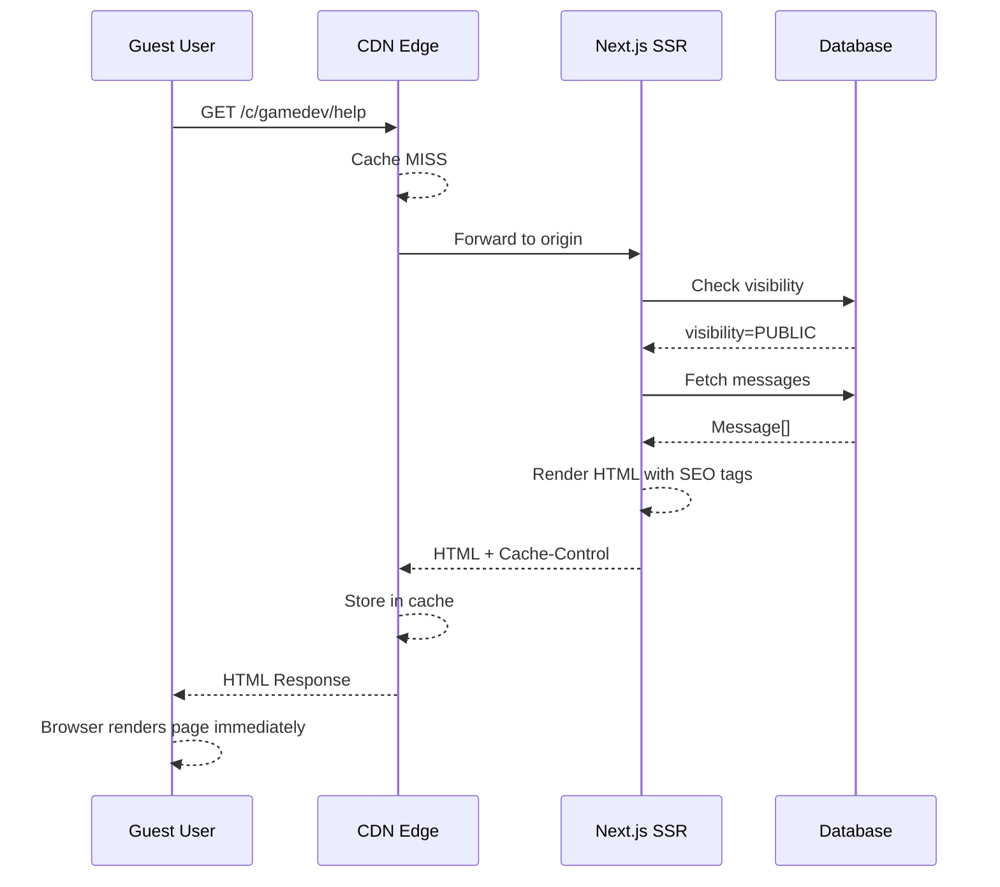
```mermaid
sequenceDiagram
    participant Guest as Guest User
    participant CDN as CDN Edge
    participant NextJS_SSR as Next.js SSR
    participant Database as Database

    Guest->>CDN: GET /c/gamedev/help
    CDN-->>CDN: Cache MISS
    CDN->>NextJS_SSR: Forward to origin
    NextJS_SSR->>Database: Check visibility
    Database-->>NextJS_SSR: visibility=PUBLIC
    NextJS_SSR->>Database: Fetch messages
    Database-->>NextJS_SSR: Message[]
    NextJS_SSR-->>NextJS_SSR: Render HTML with SEO tags
    NextJS_SSR-->>CDN: HTML + Cache-Control
    CDN-->>CDN: Store in cache
    CDN-->>Guest: HTML Response
    Guest-->>Guest: Browser renders page immediately
```

### 2.4 Rationale

The archtecture diagram is justified because client server split abstracts from the guest the authorization logic the server handles and caching requests significantly helps with performance for storing the same content that will be served to many users. Furthermore, the importance of authorization lies in the fact whether a channel is public or not, to make sure guests can't see private channels. 

---

## 3. Class Diagram

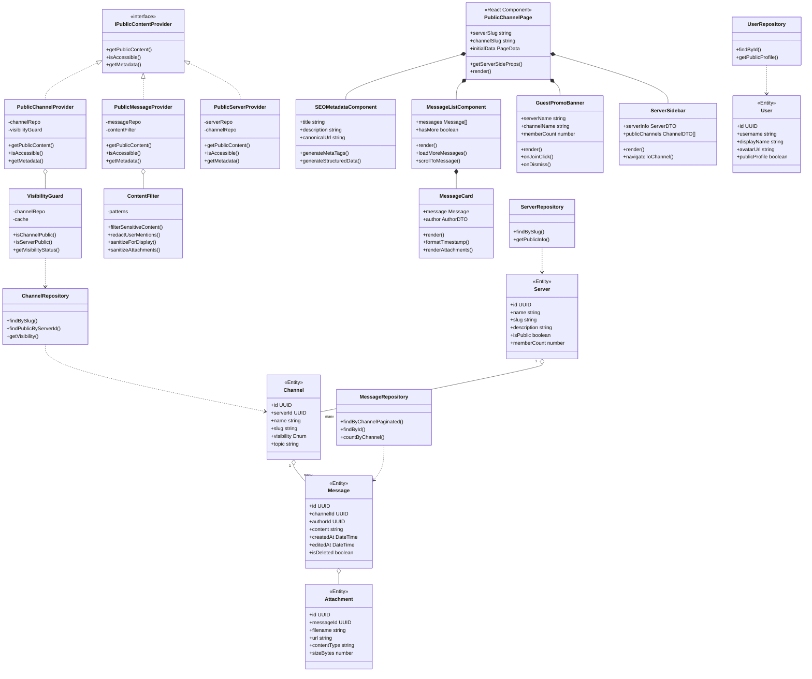
```mermaid
classDiagram
    class IPublicContentProvider {
        <<interface>>
        +getPublicContent()
        +isAccessible()
        +getMetadata()
    }

    class PublicChannelProvider {
        -channelRepo
        -visibilityGuard
        +getPublicContent()
        +isAccessible()
        +getMetadata()
    }

    class PublicMessageProvider {
        -messageRepo
        -contentFilter
        +getPublicContent()
        +isAccessible()
        +getMetadata()
    }

    class PublicServerProvider {
        -serverRepo
        -channelRepo
        +getPublicContent()
        +isAccessible()
        +getMetadata()
    }

    class VisibilityGuard {
        -channelRepo
        -cache
        +isChannelPublic()
        +isServerPublic()
        +getVisibilityStatus()
    }

    class ContentFilter {
        -patterns
        +filterSensitiveContent()
        +redactUserMentions()
        +sanitizeForDisplay()
        +sanitizeAttachments()
    }

    class PublicChannelPage {
        <<React Component>>
        +serverSlug string
        +channelSlug string
        +initialData PageData
        +getServerSideProps()
        +render()
    }

    class SEOMetadataComponent {
        +title string
        +description string
        +canonicalUrl string
        +generateMetaTags()
        +generateStructuredData()
    }

    class MessageListComponent {
        +messages Message[]
        +hasMore boolean
        +render()
        +loadMoreMessages()
        +scrollToMessage()
    }

    class GuestPromoBanner {
        +serverName string
        +channelName string
        +memberCount number
        +render()
        +onJoinClick()
        +onDismiss()
    }

    class MessageCard {
        +message Message
        +author AuthorDTO
        +render()
        +formatTimestamp()
        +renderAttachments()
    }

    class ServerSidebar {
        +serverInfo ServerDTO
        +publicChannels ChannelDTO[]
        +render()
        +navigateToChannel()
    }

    class Channel {
        <<Entity>>
        +id UUID
        +serverId UUID
        +name string
        +slug string
        +visibility Enum
        +topic string
    }

    class Message {
        <<Entity>>
        +id UUID
        +channelId UUID
        +authorId UUID
        +content string
        +createdAt DateTime
        +editedAt DateTime
        +isDeleted boolean
    }

    class Server {
        <<Entity>>
        +id UUID
        +name string
        +slug string
        +description string
        +isPublic boolean
        +memberCount number
    }

    class User {
        <<Entity>>
        +id UUID
        +username string
        +displayName string
        +avatarUrl string
        +publicProfile boolean
    }

    class Attachment {
        <<Entity>>
        +id UUID
        +messageId UUID
        +filename string
        +url string
        +contentType string
        +sizeBytes number
    }

    class ChannelRepository {
        +findBySlug()
        +findPublicByServerId()
        +getVisibility()
    }

    class MessageRepository {
        +findByChannelPaginated()
        +findById()
        +countByChannel()
    }

    class ServerRepository {
        +findBySlug()
        +getPublicInfo()
    }

    class UserRepository {
        +findById()
        +getPublicProfile()
    }

    IPublicContentProvider <|.. PublicChannelProvider
    IPublicContentProvider <|.. PublicMessageProvider
    IPublicContentProvider <|.. PublicServerProvider
    PublicChannelProvider o-- VisibilityGuard
    PublicMessageProvider o-- ContentFilter
    PublicChannelPage *-- SEOMetadataComponent
    PublicChannelPage *-- MessageListComponent
    PublicChannelPage *-- GuestPromoBanner
    PublicChannelPage *-- ServerSidebar
    MessageListComponent *-- MessageCard
    VisibilityGuard ..> ChannelRepository
    Channel "1" o-- "many" Message
    Server "1" o-- "many" Channel
    Message o-- Attachment
    ChannelRepository ..> Channel
    MessageRepository ..> Message
    ServerRepository ..> Server
    UserRepository ..> User
```

### 3.1 Rationale

The class diagram clearly separates the entities that will be needed for displaying the public channel to the guest user, specifically with only grabbing public entities such as the server, messages and owner of the message to avoid exposing private channel information. 

---

## 4. List of Classes

### 4.1 Edge Layer (W1)

| Label | Class Name | Type | Purpose |
|-------|------------|------|---------|
| CL-W1.1 | CacheRouter | Edge Worker | Routes requests through CDN cache, determines cache hit/miss, manages cache keys |
| CL-W1.2 | BotDetector | Edge Worker | Identifies search engine bots vs human users, applies appropriate rate limits and headers |

### 4.2 Public View Module (M1)

| Label | Class Name | Type | Purpose |
|-------|------------|------|---------|
| CL-C1.1 | PublicChannelPage | Page Component | Main Next.js page component for rendering public channel content with SSR |
| CL-C1.2 | SEOMetadataComponent | UI Component | Generates and renders SEO meta tags, Open Graph tags, and structured data |
| CL-C1.3 | MessageListComponent | UI Component | Renders paginated list of messages with infinite scroll support |
| CL-C1.4 | GuestPromoBanner | UI Component | Non-intrusive banner encouraging guests to join the community |
| CL-C1.5 | MessageCard | UI Component | Renders individual message with author info, timestamp, and attachments |
| CL-C1.6 | ServerSidebar | UI Component | Displays server info and list of other public channels for navigation |

### 4.3 Client Interaction Module (M2)

| Label | Class Name | Type | Purpose |
|-------|------------|------|---------|
| CL-C2.1 | InfiniteScrollHandler | Client Component | Manages intersection observer for loading more messages on scroll |
| CL-C2.2 | MessageLinkHandler | Client Component | Handles deep links to specific messages, scrolls and highlights target |
| CL-C2.3 | SearchHighlighter | Client Component | Highlights search terms from referrer URL in message content |
| CL-C2.4 | ShareHandler | Client Component | Provides sharing functionality for messages and channel links |

### 4.4 Public API Module (M3)

| Label | Class Name | Type | Purpose |
|-------|------------|------|---------|
| CL-C3.1 | PublicChannelController | Controller | Handles API requests for public channel data without authentication |
| CL-C3.2 | PublicServerController | Controller | Handles API requests for public server information |

### 4.5 Access Control Module (M4)

| Label | Class Name | Type | Purpose |
|-------|------------|------|---------|
| CL-C4.1 | VisibilityGuard | Service | Checks channel/server visibility before serving content to guests |
| CL-C4.2 | ContentFilter | Service | Filters sensitive content, redacts private mentions from public view |
| CL-C4.3 | RateLimiter | Middleware | Prevents abuse by limiting request rate for anonymous users |
| CL-C4.4 | AnonymousSessionManager | Service | Manages lightweight sessions for guests to store preferences |

### 4.6 Content Delivery Module (M5)

| Label | Class Name | Type | Purpose |
|-------|------------|------|---------|
| CL-C5.1 | MessageService | Service | Retrieves and formats messages for public display |
| CL-C5.2 | AuthorService | Service | Provides public author information, respects privacy settings |
| CL-C5.3 | AttachmentService | Service | Manages public access to message attachments |
| CL-C5.4 | SEOService | Service | Generates SEO metadata, structured data, and canonical URLs |

### 4.7 Data Access Module (M6)

| Label | Class Name | Type | Purpose |
|-------|------------|------|---------|
| CL-C6.1 | ChannelRepository | Repository | Data access for channel entities with visibility filtering |
| CL-C6.2 | MessageRepository | Repository | Data access for messages with pagination support |
| CL-C6.3 | ServerRepository | Repository | Data access for server entities |
| CL-C6.4 | UserRepository | Repository | Data access for user public profile data |

### 4.8 Data Transfer Objects

| Label | Class Name | Type | Purpose |
|-------|------------|------|---------|
| CL-D1 | PublicChannelDTO | DTO | Public-safe channel data for API responses |
| CL-D2 | PublicMessageDTO | DTO | Public-safe message data with permalink |
| CL-D3 | PublicAuthorDTO | DTO | Public author info without user ID |
| CL-D4 | PublicServerDTO | DTO | Public server info for display |
| CL-D5 | PageDataDTO | DTO | Combined data for SSR page rendering |
| CL-D6 | SEODataDTO | DTO | SEO metadata for page head |

#### PublicChannelDTO Fields

```typescript
interface PublicChannelDTO {
  id: string;           // Channel UUID
  name: string;         // Display name
  slug: string;         // URL-safe identifier
  topic: string;        // Channel topic/description
  messageCount: number; // Total messages in channel (computed, not a DB column)
  serverSlug: string;   // Parent server's slug
}
```

#### ChannelVisibility Enum

```typescript
enum ChannelVisibility {
  PUBLIC_INDEXABLE = 'PUBLIC_INDEXABLE',   // Visible to guests and indexed by search engines
  PUBLIC_NO_INDEX = 'PUBLIC_NO_INDEX',     // Visible to guests but not indexed
  PRIVATE = 'PRIVATE'                      // Only visible to authenticated members
}
```

### 4.9 Domain Entities

| Label | Class Name | Type | Purpose |
|-------|------------|------|---------|
| CL-D7 | Channel | Entity | Channel domain entity with visibility state |
| CL-D8 | Message | Entity | Message domain entity |
| CL-D9 | Server | Entity | Server domain entity |
| CL-D10 | User | Entity | User domain entity with privacy settings |
| CL-D11 | Attachment | Entity | Message attachment entity |

### 4.10 Rationale

The list of classes clearly states the moving parts for ensuring guest user can access public channels and their messages, with handling caching. The classes cover all the responsibilities needed for this feature to function from route handling to retrieving the public data to formatting the response to the guest. The inclusion of caching and bot detection justified since retrieval of the same content from multiple guest is unnecessary more work on the server. 

---

## 5. State Diagrams

### 5.1 System State Variables

| Variable | Type | Description |
|----------|------|-------------|
| request.path | string | Current URL path being requested |
| channel.visibility | ChannelVisibility | Visibility state of requested channel |
| cache.status | CacheStatus | Whether response is cached (HIT/MISS/STALE) |
| guest.sessionId | string | Anonymous session identifier |
| page.loadState | LoadState | Current page loading state |
| messages.pagination | PaginationState | Current pagination position |

> **Convention:** `is_public` (boolean) applies to **servers** — whether the server appears in discovery. `visibility` (enum: `PUBLIC_INDEXABLE`, `PUBLIC_NO_INDEX`, `PRIVATE`) applies to **channels** — whether channel content is accessible to guests and/or indexed by search engines.

### 5.2 Page Load State Machine

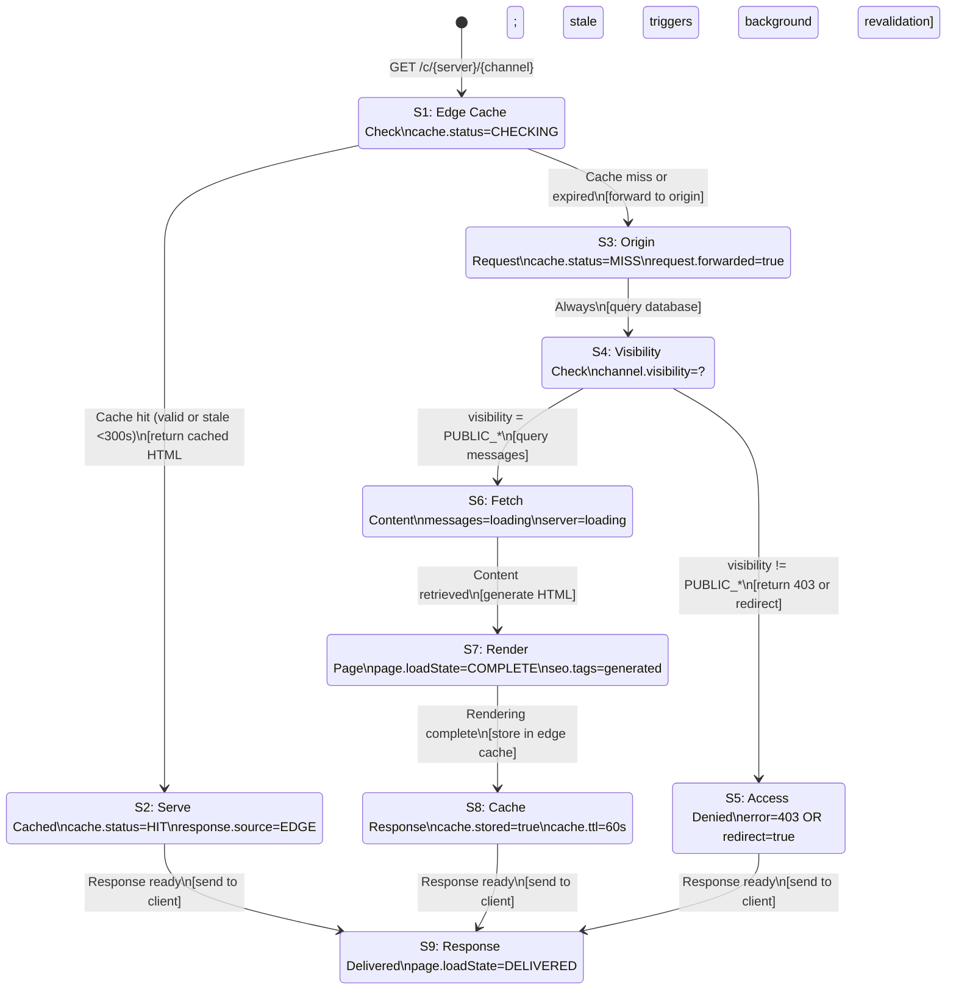
```mermaid
stateDiagram-v2
    [*] --> S1 : GET /c/{server}/{channel}

    S1 : S1: Edge Cache Check\ncache.status=CHECKING
    S2 : S2: Serve Cached\ncache.status=HIT\nresponse.source=EDGE
    S3 : S3: Origin Request\ncache.status=MISS\nrequest.forwarded=true
    S4 : S4: Visibility Check\nchannel.visibility=?
    S5 : S5: Access Denied\nerror=403 OR redirect=true
    S6 : S6: Fetch Content\nmessages=loading\nserver=loading
    S7 : S7: Render Page\npage.loadState=COMPLETE\nseo.tags=generated
    S8 : S8: Cache Response\ncache.stored=true\ncache.ttl=60s
    S9 : S9: Response Delivered\npage.loadState=DELIVERED

    S1 --> S2 : Cache hit (valid or stale <300s)\n[return cached HTML; stale triggers background revalidation]
    S1 --> S3 : Cache miss or expired\n[forward to origin]
    S3 --> S4 : Always\n[query database]
    S4 --> S5 : visibility != PUBLIC_*\n[return 403 or redirect]
    S4 --> S6 : visibility = PUBLIC_*\n[query messages]
    S6 --> S7 : Content retrieved\n[generate HTML]
    S7 --> S8 : Rendering complete\n[store in edge cache]
    S2 --> S9 : Response ready\n[send to client]
    S8 --> S9 : Response ready\n[send to client]
    S5 --> S9 : Response ready\n[send to client]
```

### 5.3 Message Loading State Machine (Client-Side Hydration)

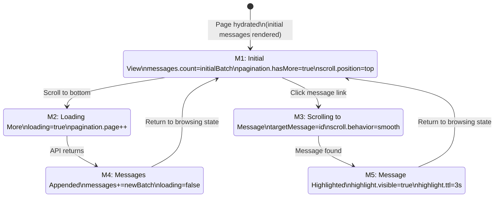
```mermaid
stateDiagram-v2
    [*] --> M1 : Page hydrated\n(initial messages rendered)

    M1 : M1: Initial View\nmessages.count=initialBatch\npagination.hasMore=true\nscroll.position=top
    M2 : M2: Loading More\nloading=true\npagination.page++
    M3 : M3: Scrolling to Message\ntargetMessage=id\nscroll.behavior=smooth
    M4 : M4: Messages Appended\nmessages+=newBatch\nloading=false
    M5 : M5: Message Highlighted\nhighlight.visible=true\nhighlight.ttl=3s

    M1 --> M2 : Scroll to bottom
    M1 --> M3 : Click message link
    M2 --> M4 : API returns
    M3 --> M5 : Message found
    M4 --> M1 : Return to browsing state
    M5 --> M1 : Return to browsing state
```

### 5.4 Access Denial State Machine

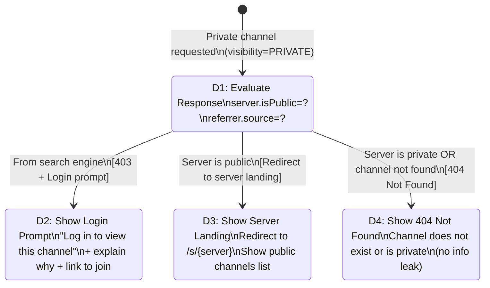
```mermaid
stateDiagram-v2
    [*] --> D1 : Private channel requested\n(visibility=PRIVATE)

    D1 : D1: Evaluate Response\nserver.isPublic=?\nreferrer.source=?
    D2 : D2: Show Login Prompt\n"Log in to view this channel"\n+ explain why + link to join
    D3 : D3: Show Server Landing\nRedirect to /s/{server}\nShow public channels list
    D4 : D4: Show 404 Not Found\nChannel does not exist or is private\n(no info leak)

    D1 --> D2 : From search engine\n[403 + Login prompt]
    D1 --> D3 : Server is public\n[Redirect to server landing]
    D1 --> D4 : Server is private OR channel not found\n[404 Not Found]
```

### 5.5 Rationale

These states were chosen to show the phases a guest can be for viewing a public channel, the states handle critical edge cases a guest can experience since the endpoints are publicily accessible such as trying to visit a private channel or channel that isn't cached. The state also has no login redirect due to the fact that this feature is supposed allow anonymous users to access public channels. Importantly each state has a clear end to each phase so the guest ins't stuck in a loop state that they can't get out off.

---

## 6. Flow Charts

### 6.1 Scenario: Guest Views Public Channel from Search Result

**Scenario Description:** A guest user clicks a search result link that leads to a public channel. The system serves the full content without any login prompts, allowing the user to immediately access the information they were searching for.


```mermaid
flowchart TD
    Start(["START: Guest clicks search result\nURL: /c/gamedev/help-and-questions?m=abc123\nReferrer: google.com search"])
    F11["F1.1 Request reaches CloudFlare edge\nCacheRouter.checkCache()"]
    CacheHit{"F1.2: Cache hit?"}
    F13["F1.3 Serve cached HTML response"]
    F14["F1.4 Forward to origin server"]
    F15["F1.5 Parse URL params\nserverSlug, channelSlug, messageId"]
    F16["F1.6 Look up channel\nChannelRepository.findBySlug(serverSlug, channelSlug)"]
    ChExists{"F1.7: Channel exists?"}
    F18["F1.8 Return 404\nChannel not found"]
    F19["F1.9 Check visibility\nVisibilityGuard.isChannelPublic(channelId)"]
    IsPublic{"F1.10: Is PUBLIC_INDEXABLE\nor PUBLIC_NO_INDEX?"}
    F111["F1.11 Handle private channel\n(See Flow 6.2)"]
    F112["F1.12 Fetch server info\nServerRepository.getPublicInfo(serverId)"]
    F113["F1.13 Fetch public channels for sidebar\nChannelRepository.findPublicByServerId()"]
    F114["F1.14 Fetch messages\nMessageService.getMessagesForPublicView(channelId, page=1, limit=50)"]
    F115["F1.15 Filter content\nContentFilter.filterSensitiveContent()\nContentFilter.redactUserMentions()"]
    F115b["F1.15b Resolve attachments\nAttachmentService.getPublicAttachmentUrl()\nAttachmentService.isAttachmentPublic()"]
    F116["F1.16 Build public author DTOs\nAuthorService.getPublicAuthorInfo()"]
    F117["F1.17 Generate SEO data\nSEOService.generatePageTitle()\ngenerateDescription()\ngenerateStructuredData()"]
    F118["F1.18 Render HTML with Next.js SSR\n- SEO meta tags\n- Server sidebar\n- Message list\n- Guest promo banner\n- Structured data JSON-LD"]
    F119["F1.19 Set cache headers\nCache-Control: public, max-age=60, s-maxage=60\nstale-while-revalidate=300\nX-Robots-Tag: index, follow"]
    F120["F1.20 Response delivered to guest browser"]
    F121["F1.21 Browser renders page\nGuest sees full channel content"]
    MsgInUrl{"F1.22: messageId in URL?"}
    F123["F1.23 Display from top of channel"]
    F124["F1.24 Scroll to message and highlight it\nMessageLinkHandler.scrollToMessage()\nMessageLinkHandler.highlightMessage()"]
    F125["F1.25 Parse search terms from referrer URL\nSearchHighlighter.parseSearchTerms()\nSearchHighlighter.highlightMatches()"]
    End(["END: Guest viewing public channel\n- Full content visible\n- No login prompt shown\n- Search terms highlighted\n- Can navigate to other public channels"])

    Start --> F11 --> CacheHit
    CacheHit -->|Yes| F13 --> F120
    CacheHit -->|No| F14 --> F15 --> F16 --> ChExists
    ChExists -->|No| F18 --> F120
    ChExists -->|Yes| F19 --> IsPublic
    IsPublic -->|No PRIVATE| F111 --> F120
    IsPublic -->|Yes| F112 --> F113 --> F114 --> F115 --> F115b --> F116 --> F117 --> F118 --> F119 --> F120
    F120 --> F121 --> MsgInUrl
    MsgInUrl -->|No| F123 --> F125
    MsgInUrl -->|Yes| F124 --> F125
    F125 --> End
```

### 6.2 Scenario: Guest Requests Private Channel

**Scenario Description:** A guest user requests a channel URL that points to a private channel. The system provides a helpful response without revealing sensitive information about the server's structure.

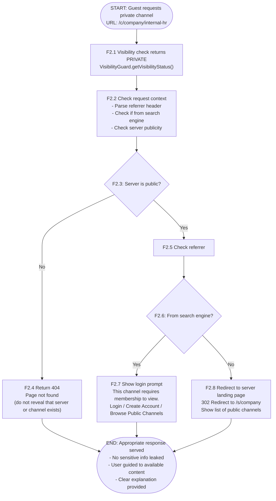
```mermaid
flowchart TD
    Start(["START: Guest requests private channel\nURL: /c/company/internal-hr"])
    F21["F2.1 Visibility check returns PRIVATE\nVisibilityGuard.getVisibilityStatus()"]
    F22["F2.2 Check request context\n- Parse referrer header\n- Check if from search engine\n- Check server publicity"]
    ServerPublic{"F2.3: Server is public?"}
    F24["F2.4 Return 404\nPage not found\n(do not reveal that server or channel exists)"]
    F25["F2.5 Check referrer"]
    FromSearch{"F2.6: From search engine?"}
    F27["F2.7 Show login prompt\nThis channel requires membership to view.\nLogin / Create Account / Browse Public Channels"]
    F28["F2.8 Redirect to server landing page\n302 Redirect to /s/company\nShow list of public channels"]
    End(["END: Appropriate response served\n- No sensitive info leaked\n- User guided to available content\n- Clear explanation provided"])

    Start --> F21 --> F22 --> ServerPublic
    ServerPublic -->|No| F24 --> End
    ServerPublic -->|Yes| F25 --> FromSearch
    FromSearch -->|Yes| F27 --> End
    FromSearch -->|No| F28 --> End
```

### 6.3 Scenario: Guest Loads More Messages (Infinite Scroll)

**Scenario Description:** A guest user scrolls to the bottom of the message list, triggering the infinite scroll mechanism to load older messages without a full page reload.

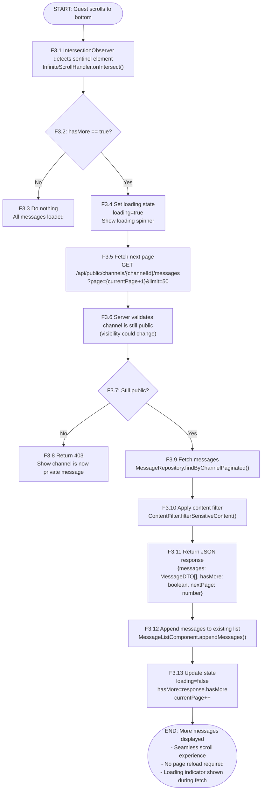
```mermaid
flowchart TD
    Start(["START: Guest scrolls to bottom"])
    F31["F3.1 IntersectionObserver detects sentinel element\nInfiniteScrollHandler.onIntersect()"]
    HasMore{"F3.2: hasMore == true?"}
    F33["F3.3 Do nothing\nAll messages loaded"]
    F34["F3.4 Set loading state\nloading=true\nShow loading spinner"]
    F35["F3.5 Fetch next page\nGET /api/public/channels/{channelId}/messages\n?page={currentPage+1}&limit=50"]
    F36["F3.6 Server validates channel is still public\n(visibility could change)"]
    StillPublic{"F3.7: Still public?"}
    F38["F3.8 Return 403\nShow channel is now private message"]
    F39["F3.9 Fetch messages\nMessageRepository.findByChannelPaginated()"]
    F310["F3.10 Apply content filter\nContentFilter.filterSensitiveContent()"]
    F311["F3.11 Return JSON response\n{messages: MessageDTO[], hasMore: boolean, nextPage: number}"]
    F312["F3.12 Append messages to existing list\nMessageListComponent.appendMessages()"]
    F313["F3.13 Update state\nloading=false\nhasMore=response.hasMore\ncurrentPage++"]
    End(["END: More messages displayed\n- Seamless scroll experience\n- No page reload required\n- Loading indicator shown during fetch"])

    Start --> F31 --> HasMore
    HasMore -->|No| F33
    HasMore -->|Yes| F34 --> F35 --> F36 --> StillPublic
    StillPublic -->|No| F38
    StillPublic -->|Yes| F39 --> F310 --> F311 --> F312 --> F313 --> End
```

### 6.4 Scenario: Search Engine Bot Crawls Public Channel

**Scenario Description:** A search engine bot (Googlebot, Bingbot, etc.) crawls a public channel page. The system serves optimized content with appropriate SEO signals.

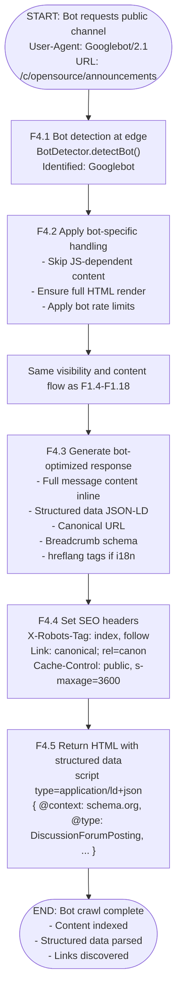
```mermaid
flowchart TD
    Start(["START: Bot requests public channel\nUser-Agent: Googlebot/2.1\nURL: /c/opensource/announcements"])
    F41["F4.1 Bot detection at edge\nBotDetector.detectBot()\nIdentified: Googlebot"]
    F42["F4.2 Apply bot-specific handling\n- Skip JS-dependent content\n- Ensure full HTML render\n- Apply bot rate limits"]
    F43SameFlow["Same visibility and content flow as F1.4-F1.18"]
    F43["F4.3 Generate bot-optimized response\n- Full message content inline\n- Structured data JSON-LD\n- Canonical URL\n- Breadcrumb schema\n- hreflang tags if i18n"]
    F44["F4.4 Set SEO headers\nX-Robots-Tag: index, follow\nLink: canonical; rel=canon\nCache-Control: public, s-maxage=3600"]
    F45["F4.5 Return HTML with structured data\nscript type=application/ld+json\n{ @context: schema.org, @type: DiscussionForumPosting, ... }"]
    End(["END: Bot crawl complete\n- Content indexed\n- Structured data parsed\n- Links discovered"])

    Start --> F41 --> F42 --> F43SameFlow --> F43 --> F44 --> F45 --> End
```

### 6.5 Cross-Spec Integration: VISIBILITY_CHANGED Event Consumption

When the Channel Visibility Toggle spec emits a `VISIBILITY_CHANGED` event (via Redis Pub/Sub EventBus), the Guest Public Channel View system reacts as follows:

| New Visibility | Guest View Action |
|---------------|-------------------|
| `PUBLIC_INDEXABLE` | Warm guest view cache for channel; begin serving public content |
| `PUBLIC_NO_INDEX` | Keep guest view cache (content still public); update `X-Robots-Tag` to `noindex` |
| `PRIVATE` | Invalidate all guest view caches for channel; return 403/404 on subsequent requests |

**Event Payload Consumed:**
```typescript
interface VisibilityChangeEvent {
  channelId: string;        // UUID
  oldVisibility: ChannelVisibility;
  newVisibility: ChannelVisibility;
  actorId: string;          // UUID of admin who made the change
  timestamp: DateTime;
}
```

**Cache Keys Invalidated on PRIVATE:**
- `channel:{channelId}:visibility`
- `channel:{channelId}:msgs:*` (all pages)
- `server:{serverId}:info`

### 6.6 Rationale 

The flow charts depict the major flow cases a guest will experience for Harmony. The first flow covers the primary case that the guest visits the public channel from search engine result, which is the primary aim for Harmony, to be able to provide public channel information to guests without the need of logging in. The second flow covers the edge case a guests tries to visit a private channel, safely redirecting them without revealing any sensitive information about the server. The third flow covers the guest loading more messages of the channel, allowing the guest to infinitely scroll older messages. The fourth flow covers the public channels to be crawlable by search engine bots, so guests searching for information related to public channels can see it. 

---

## 7. Development Risks and Failures

### 7.1 Runtime Failures

| Label | Failure Mode | User-Visible Effect | Internal Effect | Recovery Procedure | Likelihood | Impact |
|-------|--------------|--------------------|-----------------|--------------------|------------|--------|
| RF-1 | SSR render crash | 500 error page | React hydration failure | Error boundary catches; shows fallback UI | Medium | High |
| RF-2 | Database query timeout | Slow page load or timeout | Connection pool exhaustion | Query optimization; read replicas; timeout handling | Medium | Medium |
| RF-3 | Cache corruption | Stale or incorrect content shown | Cache-DB inconsistency | Cache invalidation; serve from DB | Low | Medium |
| RF-4 | Memory leak in SSR | Gradual performance degradation | Node.js process OOM | Process recycling; memory monitoring | Low | High |
| RF-5 | Infinite scroll breaks | Users can't load more messages | Client JS error | Fallback pagination links; error logging | Medium | Low |
| RF-6 | SEO data generation fails | Missing meta tags | Empty title/description | Default fallback values; monitoring | Low | Medium |
| RF-7 | Content filter regex timeout | Slow response on large messages | CPU spike | Regex timeout limits; message size limits | Low | Medium |

### 7.2 Connectivity Failures

| Label | Failure Mode | User-Visible Effect | Internal Effect | Recovery Procedure | Likelihood | Impact |
|-------|--------------|--------------------|-----------------|--------------------|------------|--------|
| CF-1 | CDN edge outage | Regional unavailability | Cache layer bypassed | Multi-CDN failover; origin direct access | Low | High |
| CF-2 | Origin unreachable | 502/503 errors | CDN can't reach server | Health checks; auto-scaling; stale-while-revalidate | Low | High |
| CF-3 | Database connection loss | 500 errors | All queries fail | Connection retry; replica failover | Low | Critical |
| CF-4 | Redis cache unavailable | Slower responses | Cache misses; DB load increase | Degrade gracefully; serve from DB | Medium | Medium |
| CF-5 | Slow network to guest | Long load times | Time to first byte high | CDN edge caching; image optimization | Medium | Medium |

### 7.3 Hardware Failures

| Label | Failure Mode | User-Visible Effect | Internal Effect | Recovery Procedure | Likelihood | Impact |
|-------|--------------|--------------------|-----------------|--------------------|------------|--------|
| HF-1 | Web server crash | Brief unavailability | Container restart | Auto-restart; load balancer rerouting | Low | Medium |
| HF-2 | Database server down | Complete outage | All writes/reads fail | Automatic failover to replica | Very Low | Critical |
| HF-3 | Storage full | New messages not visible | Write failures | Storage alerts; auto-scaling storage | Low | High |

### 7.4 Security/Intruder Failures

| Label | Failure Mode | User-Visible Effect | Internal Effect | Recovery Procedure | Likelihood | Impact |
|-------|--------------|--------------------|-----------------|--------------------|------------|--------|
| IF-1 | DDoS on public pages | Service degradation | Resource exhaustion | CloudFlare DDoS protection; rate limiting | Medium | High |
| IF-2 | Scraping abuse | None (internal cost) | Bandwidth/compute abuse | Bot detection; rate limiting; CAPTCHA | High | Medium |
| IF-3 | Visibility bypass attempt | 403 error (if working) | Security log entry | Input validation; server-side checks | Medium | Critical |
| IF-4 | XSS via message content | Malicious script execution | User session compromise | Content sanitization; CSP headers | Low | Critical |
| IF-5 | Cache poisoning | Wrong content served | Cache serves malicious response | Cache key validation; purge capability | Very Low | Critical |
| IF-6 | Enumeration attack | None (if protected) | Load on database | Rate limiting; no existence disclosure | Medium | Low |

### 7.5 Content/Data Failures

| Label | Failure Mode | User-Visible Effect | Internal Effect | Recovery Procedure | Likelihood | Impact |
|-------|--------------|--------------------|-----------------|--------------------|------------|--------|
| DF-1 | Private content exposed | Privacy breach | Visibility check bypassed | Audit; immediate visibility fix; notification | Very Low | Critical |
| DF-2 | User ID leaked in public DTO | Privacy concern | PII exposure | DTO review; immediate patch | Low | High |
| DF-3 | Deleted message shown | Confusing content | Soft delete not respected | Query filter fix; cache purge | Low | Medium |
| DF-4 | Attachment not loading | Broken images/files | Storage access issue | CDN retry; fallback placeholder | Medium | Low |

### 7.6 Failure Priority Matrix

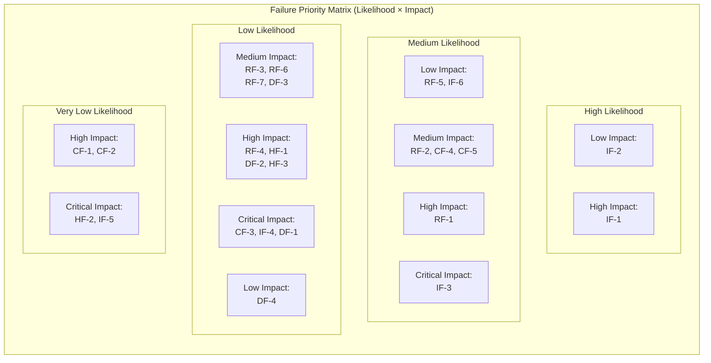
```mermaid
graph LR
    subgraph Matrix["Failure Priority Matrix (Likelihood × Impact)"]
        subgraph High["High Likelihood"]
            H_Low["Low Impact:\nIF-2"]
            H_High["High Impact:\nIF-1"]
        end
        subgraph Medium["Medium Likelihood"]
            M_Low["Low Impact:\nRF-5, IF-6"]
            M_Med["Medium Impact:\nRF-2, CF-4, CF-5"]
            M_High["High Impact:\nRF-1"]
            M_Crit["Critical Impact:\nIF-3"]
        end
        subgraph Low["Low Likelihood"]
            L_Med["Medium Impact:\nRF-3, RF-6\nRF-7, DF-3"]
            L_High["High Impact:\nRF-4, HF-1\nDF-2, HF-3"]
            L_Crit["Critical Impact:\nCF-3, IF-4, DF-1"]
            L_LowImpact["Low Impact:\nDF-4"]
        end
        subgraph VeryLow["Very Low Likelihood"]
            VL_High["High Impact:\nCF-1, CF-2"]
            VL_Crit["Critical Impact:\nHF-2, IF-5"]
        end
    end
```

### 7.7 Rationale 

The development risks and failures categories were chosen to represent the primary threat this feature can face. The runtime and connectivity failures are catagorized due to the feature being a publicly accessible endpoint that any guest can use, leading to unpredictable traffic volumes. Intruder risks face the highest priorty due to the endpoint having no authentication since guests aren't required to log in. 

---

## 8. Technology Stack

| Label | Technology | Version | Purpose | Rationale | Source/Documentation |
|-------|------------|---------|---------|-----------|---------------------|
| T1 | TypeScript | 5.3+ | Primary language | Type safety across stack | https://www.typescriptlang.org/ |
| T2 | React | 18.2+ | UI framework | Component model; hydration support | https://react.dev/ |
| T3 | Next.js | 14.0+ | React framework with SSR | Critical for SEO; server components | https://nextjs.org/ |
| T4 | Node.js | 20 LTS | Server runtime | SSR execution; API routes | https://nodejs.org/ |
| T5 | PostgreSQL | 16+ | Primary database | Robust queries; full-text search | https://www.postgresql.org/ |
| T6 | Redis | 7.2+ | Caching and EventBus (Pub/Sub) | Fast reads; session storage; event messaging | https://redis.io/ |
| T7 | Prisma | 5.8+ | ORM | Type-safe database access | https://www.prisma.io/ |
| T8 | tRPC | 10.45+ | End-to-end typesafe APIs (authenticated internal) | Type-safe client-server communication | https://trpc.io/ |
| T9 | Zod | 3.22+ | Validation | Runtime type checking (integrates with tRPC) | https://zod.dev/ |
| T10 | TailwindCSS | 3.4+ | Styling | Utility-first; consistent design | https://tailwindcss.com/ |
| T11 | CloudFlare | N/A | CDN/Edge | Global caching; DDoS protection; edge workers | https://www.cloudflare.com/ |
| T12 | Docker | 24+ | Containerization | Consistent environments | https://www.docker.com/ |
| T13 | Google Search Console API | v1 | Programmatic indexing | Sitemap ping; URL submission | https://developers.google.com/webmaster-tools |
| T14 | Bing Webmaster API | v1 | Microsoft search integration | URL submission; sitemap ping | https://www.bing.com/webmasters |
| T15 | Jest | 29+ | Unit testing | Component and service tests | https://jestjs.io/ |
| T16 | Playwright | 1.40+ | E2E testing | SEO verification; crawl simulation | https://playwright.dev/ |
| T17 | sanitize-html | 2.12+ | HTML sanitization | XSS prevention (Node.js-native) | https://github.com/apostrophecms/sanitize-html |
| T18 | schema-dts | 1.1+ | Structured data types | Type-safe JSON-LD generation | https://github.com/google/schema-dts |
| T19 | intersection-observer | (polyfill) | Infinite scroll | Cross-browser scroll detection | https://github.com/w3c/IntersectionObserver |
| T20 | sharp | 0.33+ | Image processing | Thumbnail generation; optimization | https://sharp.pixelplumbing.com/ |
| T21 | Lighthouse CI | 11+ | Performance testing | Core Web Vitals monitoring | https://github.com/GoogleChrome/lighthouse-ci |

> **Convention:** tRPC is used for authenticated internal APIs between client and server. Public-facing endpoints (public channel pages, sitemaps, robots.txt) use REST for maximum compatibility with crawlers and third-party consumers.

### 8.1 EventBus

**Technology:** Redis Pub/Sub (T6)

Event types consumed by this spec:

| Event | Source Spec | Description |
|-------|-------------|-------------|
| `VISIBILITY_CHANGED` | Channel Visibility Toggle | Channel visibility state changed; invalidate/warm caches |
| `MESSAGE_CREATED` | SEO Meta Tag Generation | New message in public channel; invalidate message cache |
| `MESSAGE_EDITED` | SEO Meta Tag Generation | Message edited; invalidate affected cache pages |
| `MESSAGE_DELETED` | SEO Meta Tag Generation | Message deleted; invalidate affected cache pages |

### 8.2 Rationale

The technology stack was chosen to align with Harmony's architecture design and meet the needs of this feature. The primary langauge to be used for Harmony is Typescript, the reason is ensuring type safety accross the website, reducing runtime errors. Redis will serve our caching layer, for fast reads and session storage. Next.js was selected for its out of the box tools and capabilities it provide for Harmony such as SSR. 

---

## 9. APIs

### 9.1 Module M3: Public API

#### 9.1.1 CL-C3.1 PublicChannelController

**Public Methods (Unauthenticated):**

```typescript
getPublicChannelPage(
  serverSlug: string,           // URL-safe server identifier
  channelSlug: string,          // URL-safe channel identifier
  query: {
    m?: string,                 // Optional message ID to highlight
    page?: number               // Optional page number
  }
): Promise<SSRPageResponse>     // Full HTML page with hydration data

getPublicMessages(
  channelId: string,            // UUID of the channel
  query: {
    page: number,               // Page number (1-indexed)
    limit: number,              // Messages per page (max 100)
    before?: string,            // Cursor: message ID to fetch before
    after?: string              // Cursor: message ID to fetch after
  }
): Promise<PublicMessagesResponse>

getPublicMessage(
  channelId: string,
  messageId: string
): Promise<PublicMessageResponse>
```

**Private Methods:**

```typescript
private validateChannelAccess(
  channelId: string
): Promise<VisibilityStatus>

private buildPublicMessageDTO(
  message: Message,
  author: User
): PublicMessageDTO

private applyContentFilters(
  messages: Message[]
): Message[]
```

#### 9.1.2 CL-C3.2 PublicServerController

**Public Methods (Unauthenticated):**

```typescript
getPublicServerInfo(
  serverSlug: string
): Promise<PublicServerDTO>

getPublicChannelList(
  serverSlug: string
): Promise<PublicChannelDTO[]>

getServerLandingPage(
  serverSlug: string
): Promise<SSRPageResponse>
```

### 9.2 Module M4: Access Control

#### 9.2.1 CL-C4.1 VisibilityGuard

**Public Methods:**

```typescript
isChannelPublic(
  channelId: string
): Promise<boolean>

isServerPublic(
  serverId: string
): Promise<boolean>

getVisibilityStatus(
  channelId: string
): Promise<VisibilityStatus>
```

#### 9.2.2 CL-C4.2 ContentFilter

**Public Methods:**

```typescript
filterSensitiveContent(
  content: string
): string

redactUserMentions(
  content: string,
  publicUserIds: Set<string>
): string

sanitizeForDisplay(
  content: string
): string

sanitizeAttachments(
  attachments: Attachment[]
): PublicAttachment[]
```

#### 9.2.3 CL-C4.3 RateLimiter

**Public Methods:**

```typescript
checkLimit(
  identifier: string,           // IP or fingerprint
  endpoint: string
): Promise<RateLimitResult>

incrementCounter(
  identifier: string,
  endpoint: string
): Promise<void>

isRateLimited(
  identifier: string
): Promise<boolean>
```

#### 9.2.4 CL-C4.4 AnonymousSessionManager

**Public Methods:**

```typescript
getOrCreateSession(
  request: Request
): Promise<GuestSession>

storePreference(
  sessionId: string,
  key: string,
  value: unknown
): Promise<void>

getPreferences(
  sessionId: string
): Promise<GuestPreferences>
```

### 9.3 Module M5: Content Delivery

#### 9.3.1 CL-C5.1 MessageService

**Public Methods:**

```typescript
getMessagesForPublicView(
  channelId: string,
  options: {
    page: number,
    limit: number,
    before?: string,
    after?: string
  }
): Promise<{
  messages: PublicMessageDTO[],
  hasMore: boolean,
  total: number
}>

getMessageById(
  messageId: string
): Promise<PublicMessageDTO | null>
```

**Private Methods:**

```typescript
private buildMessageDTO(
  message: Message
): PublicMessageDTO

private enrichWithAuthor(
  message: Message
): Promise<MessageWithAuthor>
```

#### 9.3.2 CL-C5.2 AuthorService

**Public Methods:**

```typescript
getPublicAuthorInfo(
  userId: string
): Promise<PublicAuthorDTO>

anonymizeAuthor(
  user: User
): PublicAuthorDTO

getDisplayName(
  user: User
): string
```

#### 9.3.3 CL-C5.3 AttachmentService

**Public Methods:**

```typescript
getPublicAttachmentUrl(
  attachmentId: string
): Promise<string | null>

generateThumbnail(
  attachmentId: string,
  size: ThumbnailSize
): Promise<string>

isAttachmentPublic(
  attachment: Attachment
): boolean
```

#### 9.3.4 CL-C5.4 SEOService

**Public Methods:**

```typescript
generatePageTitle(
  server: Server,
  channel: Channel,
  message?: Message
): string

generateDescription(
  channel: Channel,
  recentMessages: Message[]
): string

generateStructuredData(
  server: Server,
  channel: Channel,
  messages: Message[]
): StructuredData

generateBreadcrumbs(
  server: Server,
  channel: Channel
): BreadcrumbList

getCanonicalUrl(
  serverSlug: string,
  channelSlug: string,
  messageId?: string
): string
```

### 9.4 Module M6: Data Access

#### 9.4.1 CL-C6.1 ChannelRepository

**Public Methods:**

```typescript
findById(
  channelId: string
): Promise<Channel | null>

findBySlug(
  serverSlug: string,
  channelSlug: string
): Promise<Channel | null>

update(
  channelId: string,
  data: Partial<Channel>
): Promise<Channel>

findPublicByServerId(
  serverId: string
): Promise<Channel[]>

getVisibility(
  channelId: string
): Promise<ChannelVisibility>

getMetadata(
  channelId: string
): Promise<ChannelMetadata>

invalidateCache(
  channelId: string
): Promise<void>
```

> **Note:** `ChannelRepository` is shared across specs. The toggle spec is the canonical owner of `findById`, `update`, `getMetadata`, and `invalidateCache`. This spec primarily uses `findBySlug`, `findPublicByServerId`, and `getVisibility`.

#### 9.4.2 CL-C6.2 MessageRepository

**Public Methods:**

```typescript
findByChannelPaginated(
  channelId: string,
  options: PaginationOptions
): Promise<PaginatedResult<Message>>

findById(
  messageId: string
): Promise<Message | null>

countByChannel(
  channelId: string
): Promise<number>
```

### 9.5 Rate Limiting

| Consumer Type | Limit | Window | Enforcement |
|--------------|-------|--------|-------------|
| Human (anonymous) | 100 requests | 1 minute | Token bucket per IP |
| Verified bot (Googlebot, Bingbot, etc.) | 1000 requests | 1 minute | User-Agent verification |
| Suspicious pattern | CAPTCHA challenge | After 500 page views/hour | Behavioral analysis |

### 9.6 Pagination Precedence

When both cursor and page parameters are provided, cursor-based pagination takes precedence:

1. If `before` or `after` (cursor) is provided, use cursor-based pagination (ignore `page`)
2. Otherwise, fall back to offset-based pagination using `page` and `limit`
3. Default: `page=1`, `limit=50`

### Rationale

The APIs for Guest Public Channel View, clearly handle the usage of the feature for being able to publicily access channels that are from the original search message. The first section APIs' purpose is for handling showing the information for the channel in which was derived from the search query and being able to load further messages in the channel. Next section APIs' purpose is for handling the server information once there, such as showing the server information and other public channels inside that server.

---

## 10. Public Interfaces

### 10.1 Cross-Module Interface Usage

#### Used by Public View Module (M1, M2) from Public API (M3):

| Method | Class | Used For |
|--------|-------|----------|
| getPublicChannelPage() | PublicChannelController | SSR page rendering |
| getPublicMessages() | PublicChannelController | Infinite scroll API |
| getPublicMessage() | PublicChannelController | Deep link to single message |
| getPublicServerInfo() | PublicServerController | Server sidebar |
| getPublicChannelList() | PublicServerController | Channel navigation |
| getServerLandingPage() | PublicServerController | Server landing page SSR |

#### Used by Public API (M3) from Access Control (M4):

| Method | Class | Used For |
|--------|-------|----------|
| isChannelPublic() | VisibilityGuard | Access check before serving |
| getVisibilityStatus() | VisibilityGuard | Detailed visibility info |
| filterSensitiveContent() | ContentFilter | Message sanitization |
| redactUserMentions() | ContentFilter | Privacy protection |
| sanitizeForDisplay() | ContentFilter | HTML sanitization for safe display |
| sanitizeAttachments() | ContentFilter | Attachment visibility filtering |
| checkLimit() | RateLimiter | Abuse prevention |
| incrementCounter() | RateLimiter | Recording requests for rate limiting |
| getOrCreateSession() | AnonymousSessionManager | Guest session management |
| storePreference() | AnonymousSessionManager | Storing guest preferences |
| getPreferences() | AnonymousSessionManager | Retrieving guest preferences |

#### Used by Public API (M3) from Content Delivery (M5):

| Method | Class | Used For |
|--------|-------|----------|
| getMessagesForPublicView() | MessageService | Fetching messages |
| getMessageById() | MessageService | Fetching single message for deep links |
| getPublicAuthorInfo() | AuthorService | Author display data |
| anonymizeAuthor() | AuthorService | Anonymizing opted-out authors |
| getDisplayName() | AuthorService | Privacy-respecting display names |
| generatePageTitle() | SEOService | SEO metadata |
| generateDescription() | SEOService | Meta description generation |
| generateStructuredData() | SEOService | JSON-LD |
| generateBreadcrumbs() | SEOService | Breadcrumb schema data |
| getCanonicalUrl() | SEOService | Canonical URL generation |
| getPublicAttachmentUrl() | AttachmentService | Attachment URLs |
| generateThumbnail() | AttachmentService | Image thumbnail generation |
| isAttachmentPublic() | AttachmentService | Attachment visibility check |

#### Used by Content Delivery (M5) from Data Access (M6):

| Method | Class | Used For |
|--------|-------|----------|
| findBySlug() | ChannelRepository | Channel lookup |
| findPublicByServerId() | ChannelRepository | Public channel listing for server |
| getVisibility() | ChannelRepository | Channel visibility check |
| findByChannelPaginated() | MessageRepository | Paginated message fetching |
| findById() | MessageRepository | Single message lookup |
| countByChannel() | MessageRepository | Message count for channel |
| getPublicProfile() | UserRepository | Author info |
| findById() | UserRepository | User lookup by ID |

### 10.2 REST API Interface

```yaml
openapi: 3.0.3
info:
  title: Harmony Public Channel API
  version: 1.0.0
  description: Unauthenticated API for accessing public channel content

paths:
  /api/public/channels/{channelId}/messages:
    get:
      summary: Get public messages from a channel
      description: Returns paginated messages for public viewing. No authentication required.
      parameters:
        - name: channelId
          in: path
          required: true
          schema:
            type: string
            format: uuid
        - name: page
          in: query
          schema:
            type: integer
            minimum: 1
            default: 1
        - name: limit
          in: query
          schema:
            type: integer
            minimum: 1
            maximum: 100
            default: 50
        - name: before
          in: query
          description: Fetch messages before this message ID
          schema:
            type: string
            format: uuid
      responses:
        '200':
          description: Messages retrieved successfully
          content:
            application/json:
              schema:
                $ref: '#/components/schemas/PublicMessagesResponse'
          headers:
            Cache-Control:
              schema:
                type: string
                example: "public, max-age=60, s-maxage=60"
            X-RateLimit-Remaining:
              schema:
                type: integer
        '403':
          description: Channel is not public
          content:
            application/json:
              schema:
                $ref: '#/components/schemas/AccessDeniedResponse'
        '404':
          description: Channel not found
        '429':
          description: Rate limit exceeded

  /api/public/servers/{serverSlug}:
    get:
      summary: Get public server information
      parameters:
        - name: serverSlug
          in: path
          required: true
          schema:
            type: string
      responses:
        '200':
          description: Server info retrieved
          content:
            application/json:
              schema:
                $ref: '#/components/schemas/PublicServerDTO'
        '404':
          description: Server not found or not public

  /api/public/channels/{channelId}/messages/{messageId}:
    get:
      summary: Get single public message (deep link)
      parameters:
        - name: channelId
          in: path
          required: true
          schema:
            type: string
            format: uuid
        - name: messageId
          in: path
          required: true
          schema:
            type: string
            format: uuid
      responses:
        '200':
          description: Message retrieved successfully
          content:
            application/json:
              schema:
                $ref: '#/components/schemas/PublicMessageDTO'
        '403':
          description: Channel is not public
        '404':
          description: Message or channel not found

  /api/public/servers/{serverSlug}/channels:
    get:
      summary: Get list of public channels in server
      parameters:
        - name: serverSlug
          in: path
          required: true
          schema:
            type: string
      responses:
        '200':
          description: Public channels listed
          content:
            application/json:
              schema:
                type: array
                items:
                  $ref: '#/components/schemas/PublicChannelDTO'
        '404':
          description: Server not found or not public

  /s/{serverSlug}:
    get:
      summary: Server landing page (SSR)
      description: Renders server landing page with list of public channels
      parameters:
        - name: serverSlug
          in: path
          required: true
          schema:
            type: string
      responses:
        '200':
          description: Server landing page HTML
          content:
            text/html:
              schema:
                type: string
        '404':
          description: Server not found or not public

components:
  schemas:
    PublicMessagesResponse:
      type: object
      properties:
        messages:
          type: array
          items:
            $ref: '#/components/schemas/PublicMessageDTO'
        pagination:
          type: object
          properties:
            page:
              type: integer
            limit:
              type: integer
            total:
              type: integer
            hasMore:
              type: boolean
            nextCursor:
              type: string

    PublicMessageDTO:
      type: object
      properties:
        id:
          type: string
          format: uuid
        content:
          type: string
          description: Sanitized message content
        author:
          $ref: '#/components/schemas/PublicAuthorDTO'
        timestamp:
          type: string
          format: date-time
        editedAt:
          type: string
          format: date-time
          nullable: true
        attachments:
          type: array
          items:
            $ref: '#/components/schemas/PublicAttachmentDTO'
        permalink:
          type: string
          format: uri
          description: Direct link to this message

    PublicAuthorDTO:
      type: object
      description: Author info without exposing user ID
      properties:
        displayName:
          type: string
        avatarUrl:
          type: string
          format: uri
          nullable: true
        isBot:
          type: boolean

    PublicAttachmentDTO:
      type: object
      properties:
        id:
          type: string
        filename:
          type: string
        url:
          type: string
          format: uri
        contentType:
          type: string
        thumbnailUrl:
          type: string
          format: uri
          nullable: true

    PublicServerDTO:
      type: object
      properties:
        name:
          type: string
        slug:
          type: string
        description:
          type: string
        iconUrl:
          type: string
          format: uri
        memberCount:
          type: integer
        publicChannelCount:
          type: integer

    AccessDeniedResponse:
      type: object
      properties:
        error:
          type: string
          example: "CHANNEL_NOT_PUBLIC"
        message:
          type: string
          example: "This channel requires membership to view"
        serverSlug:
          type: string
          description: Server slug for redirect (if server is public)
```

### 10.3 Cross-Spec Event Integration

When `VISIBILITY_CHANGED` is emitted by the Channel Visibility Toggle spec:

| New Visibility | Downstream Action (Guest View Spec) |
|---------------|--------------------------------------|
| `PUBLIC_INDEXABLE` | Warm guest view cache for channel |
| `PUBLIC_NO_INDEX` | Keep guest view cache (public content, but update X-Robots-Tag) |
| `PRIVATE` | Invalidate guest view cache; return 403/404 |

### 10.4 Rationale 

The public interfaces categories appropriately define the public method this featur needs for other modules to intercat with. For the public api, the public method serve its purpose for providing the necessary entry points other modules need to allow guests to view public channels without logging in. The access controls purpose is to protect private channels from being accessed by guests, verifying that the channel is public. Content delivery and data access purpose is guest receiving the public information the channel has. 

---

## 11. Data Schemas

### 11.1 Database Tables

#### D7.1 ServersTable

**Runtime Class:** CL-D9 Server

| Column | Database Type | Constraints | Description | Storage Est. |
|--------|--------------|-------------|-------------|--------------|
| id | UUID | PRIMARY KEY | Unique server identifier | 16 bytes |
| name | VARCHAR(100) | NOT NULL | Display name | ~40 bytes |
| slug | VARCHAR(100) | NOT NULL, UNIQUE, INDEX | URL-safe identifier | ~30 bytes |
| description | TEXT | NULL | Server description | ~200 bytes |
| icon_url | VARCHAR(500) | NULL | Server icon URL | ~100 bytes |
| is_public | BOOLEAN | NOT NULL, DEFAULT FALSE | Whether server appears in discovery | 1 byte |
| member_count | INTEGER | NOT NULL, DEFAULT 0 | Cached member count | 4 bytes |
| created_at | TIMESTAMP WITH TIME ZONE | NOT NULL | Creation time | 8 bytes |

**Indexes:**
```sql
CREATE INDEX idx_servers_slug ON servers(slug);
CREATE INDEX idx_servers_public ON servers(is_public) WHERE is_public = true;
```

**Storage Estimate:** ~400 bytes per server

#### D7.2 ChannelsTable

**Runtime Class:** CL-D7 Channel

| Column | Database Type | Constraints | Description | Storage Est. |
|--------|--------------|-------------|-------------|--------------|
| id | UUID | PRIMARY KEY | Unique channel identifier | 16 bytes |
| server_id | UUID | FOREIGN KEY, NOT NULL, INDEX | Parent server | 16 bytes |
| name | VARCHAR(100) | NOT NULL | Display name | ~40 bytes |
| slug | VARCHAR(100) | NOT NULL, INDEX | URL-safe identifier (unique per server) | ~30 bytes |
| visibility | visibility_enum | NOT NULL, DEFAULT 'PRIVATE' | Visibility state | 1 byte |
| topic | TEXT | NULL | Channel topic/description | ~100 bytes |
| position | INTEGER | NOT NULL, DEFAULT 0 | Sort order | 4 bytes |
| indexed_at | TIMESTAMP WITH TIME ZONE | NULL | When channel was added to sitemap | 8 bytes |
| created_at | TIMESTAMP WITH TIME ZONE | NOT NULL, DEFAULT NOW() | Creation time | 8 bytes |
| updated_at | TIMESTAMP WITH TIME ZONE | NOT NULL, DEFAULT NOW() | Last modification timestamp | 8 bytes |

> **Note:** `messageCount` (shown in `PublicChannelDTO`) is computed via `COUNT(*)` query on the messages table, not stored as a column. The `visibility` column uses the `visibility_enum` type (not a boolean); see toggle spec for the `is_public` boolean on the `servers` table.

**Indexes (Canonical Set — merged from all specs):**
```sql
-- Composite index for server-scoped visibility queries (from toggle spec)
CREATE INDEX idx_channels_server_visibility ON channels(server_id, visibility);

-- Unique slug per server
CREATE UNIQUE INDEX idx_channels_server_slug ON channels(server_id, slug);

-- Partial index for all public channels (guest view queries)
CREATE INDEX idx_channels_visibility ON channels(visibility)
  WHERE visibility IN ('PUBLIC_INDEXABLE', 'PUBLIC_NO_INDEX');

-- Partial index for indexable channels (sitemap generation, from toggle spec)
CREATE INDEX idx_channels_visibility_indexed ON channels(visibility, indexed_at)
  WHERE visibility = 'PUBLIC_INDEXABLE';
```

**Storage Estimate:** ~239 bytes per channel

#### D7.3 MessagesTable

**Runtime Class:** CL-D8 Message

| Column | Database Type | Constraints | Description | Storage Est. |
|--------|--------------|-------------|-------------|--------------|
| id | UUID | PRIMARY KEY | Unique message identifier | 16 bytes |
| channel_id | UUID | FOREIGN KEY, NOT NULL, INDEX | Parent channel | 16 bytes |
| author_id | UUID | FOREIGN KEY, NOT NULL | Message author | 16 bytes |
| content | TEXT | NOT NULL | Message content | ~500 bytes avg |
| created_at | TIMESTAMP WITH TIME ZONE | NOT NULL, INDEX | Creation time | 8 bytes |
| edited_at | TIMESTAMP WITH TIME ZONE | NULL | Last edit time | 8 bytes |
| is_deleted | BOOLEAN | NOT NULL, DEFAULT FALSE | Soft delete flag | 1 byte |

**Indexes:**
```sql
CREATE INDEX idx_messages_channel_time ON messages(channel_id, created_at DESC);
CREATE INDEX idx_messages_channel_not_deleted ON messages(channel_id, created_at DESC)
  WHERE is_deleted = false;
```

**Storage Estimate:** ~565 bytes per message

#### D7.4 UsersTable

**Runtime Class:** CL-D10 User

| Column | Database Type | Constraints | Description | Storage Est. |
|--------|--------------|-------------|-------------|--------------|
| id | UUID | PRIMARY KEY | Unique user identifier | 16 bytes |
| username | VARCHAR(32) | NOT NULL, UNIQUE | Login username | ~20 bytes |
| display_name | VARCHAR(100) | NOT NULL | Public display name | ~40 bytes |
| avatar_url | VARCHAR(500) | NULL | Avatar image URL | ~100 bytes |
| public_profile | BOOLEAN | NOT NULL, DEFAULT TRUE | Show in public channels | 1 byte |
| created_at | TIMESTAMP WITH TIME ZONE | NOT NULL | Registration time | 8 bytes |

**Storage Estimate:** ~185 bytes per user

#### D7.5 AttachmentsTable

**Runtime Class:** CL-D11 Attachment

| Column | Database Type | Constraints | Description | Storage Est. |
|--------|--------------|-------------|-------------|--------------|
| id | UUID | PRIMARY KEY | Unique attachment identifier | 16 bytes |
| message_id | UUID | FOREIGN KEY, NOT NULL, INDEX | Parent message | 16 bytes |
| filename | VARCHAR(255) | NOT NULL | Original filename | ~50 bytes |
| url | VARCHAR(500) | NOT NULL | Storage URL | ~150 bytes |
| content_type | VARCHAR(100) | NOT NULL | MIME type | ~30 bytes |
| size_bytes | BIGINT | NOT NULL | File size | 8 bytes |

**Storage Estimate:** ~270 bytes per attachment

### 11.2 Cache Schemas

#### D8.1 ChannelVisibilityCache

**Key Pattern:** `channel:{channelId}:visibility`
**Value Type:** String (enum value: `PUBLIC_INDEXABLE`, `PUBLIC_NO_INDEX`, `PRIVATE`)
**TTL:** 3600 seconds (1 hour)
**Invalidation:** On visibility change via admin toggle

#### D8.2 PublicMessagesCache

**Key Pattern:** `channel:msgs:{channelId}:page:{pageNum}`
**Value Type:** JSON array of PublicMessageDTO
**TTL:** 60 seconds
**Invalidation:** On new message in channel

#### D8.3 ServerInfoCache

**Key Pattern:** `server:{serverId}:info`
**Value Type:** JSON PublicServerDTO
**TTL:** 300 seconds (5 minutes)
**Invalidation:** On server info update

#### D8.4 GuestSessionCache

**Key Pattern:** `guest:session:{sessionId}`
**Value Type:** JSON `{ preferences: object, createdAt: timestamp }`
**TTL:** 86400 seconds (24 hours)
**Purpose:** Store guest preferences (dismissed banners, etc.)

### 11.3 Storage Estimates

| Data Type | Records (Est.) | Per Record | Total Est. | Growth Rate |
|-----------|---------------|------------|------------|-------------|
| Servers | 10,000 | 400 bytes | 4 MB | 100/month |
| Channels | 100,000 | 215 bytes | 21.5 MB | 1,000/month |
| Messages | 100,000,000 | 565 bytes | 56.5 GB | 1M/month |
| Users | 1,000,000 | 185 bytes | 185 MB | 10,000/month |
| Attachments | 10,000,000 | 270 bytes | 2.7 GB | 100,000/month |

### 11.4 Rationale 

The data schemas covers the data required for rendering the feature of public channel view. The three important tables needed being server, channels, and messages, all handle the public information that guests will be given, however the schemas clearly denote the information that will be given to guests only, meaning guests that haven't logged in. 

---

## 12. Security and Privacy

### 12.1 Temporarily Stored PII

| PII Type | Justification | Entry Point | Processing Path | Disposal | Protection |
|----------|---------------|-------------|-----------------|----------|------------|
| IP Address | Rate limiting, abuse prevention | HTTP request | RateLimiter -> Redis | TTL expiry (1 hour) | Not logged in plaintext; stored as SHA-256 hash for rate limit bucket keys |
| User Agent | Bot detection | HTTP request | BotDetector | Not stored | Used only for classification |
| Search Terms (from referrer) | Feature: highlight matching terms | HTTP Referer header | SearchHighlighter (client-side only) | Not sent to server | Client-side only; not logged |

### 12.2 Long-Term Stored PII Exposure

| PII Type | Stored Location | Exposure in Public View | Mitigation |
|----------|-----------------|------------------------|------------|
| User ID | D7.3 Messages.author_id | NOT exposed in PublicAuthorDTO | Stripped at AuthorService layer |
| Username | D7.4 Users.username | NOT exposed | Only display_name shown |
| Display Name | D7.4 Users.display_name | Exposed (user's choice) | User can opt out via public_profile |
| Avatar URL | D7.4 Users.avatar_url | Exposed (user's choice) | User can opt out via public_profile |
| Message Content | D7.3 Messages.content | Exposed (in public channels) | Content filter applied |

### 12.3 Privacy Controls

**User Privacy Settings:**
- `public_profile` flag: If false, author shown as "Anonymous" in public views
- Users can delete messages (soft delete, not shown in public view)
- Users can edit messages (edited_at shown in public view)

**Content Filtering:**
- @mentions of users with `public_profile=false` are redacted
- Email addresses detected and redacted
- Phone numbers detected and redacted
- Private channel links filtered out

### 12.4 Data Flow for Public View

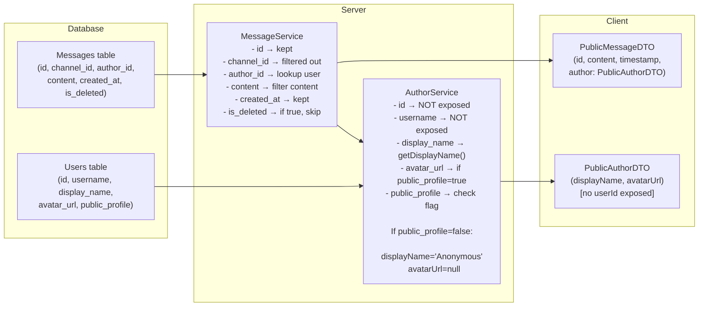
```mermaid
flowchart LR
    subgraph DB["Database"]
        MsgTable["Messages table\n(id, channel_id, author_id,\ncontent, created_at, is_deleted)"]
        UsersTable["Users table\n(id, username, display_name,\navatar_url, public_profile)"]
    end

    subgraph Server["Server"]
        MsgService["MessageService\n- id → kept\n- channel_id → filtered out\n- author_id → lookup user\n- content → filter content\n- created_at → kept\n- is_deleted → if true, skip"]
        AuthService["AuthorService\n- id → NOT exposed\n- username → NOT exposed\n- display_name → getDisplayName()\n- avatar_url → if public_profile=true\n- public_profile → check flag\n\nIf public_profile=false:\n  displayName='Anonymous'\n  avatarUrl=null"]
    end

    subgraph Client["Client"]
        MsgDTO["PublicMessageDTO\n(id, content, timestamp,\nauthor: PublicAuthorDTO)"]
        AuthorDTO["PublicAuthorDTO\n(displayName, avatarUrl)\n[no userId exposed]"]
    end

    MsgTable --> MsgService --> MsgDTO
    UsersTable --> AuthService --> AuthorDTO
    MsgService --> AuthService
```

### 12.5 Security Headers

```
X-Content-Type-Options: nosniff
X-Frame-Options: SAMEORIGIN
X-XSS-Protection: 1; mode=block
Content-Security-Policy: default-src 'self'; script-src 'self' 'unsafe-inline'; style-src 'self' 'unsafe-inline'; img-src 'self' data: https:;
Referrer-Policy: strict-origin-when-cross-origin
Permissions-Policy: geolocation=(), microphone=(), camera=()
```

### 12.6 Bot and Abuse Protection

| Protection | Implementation | Threshold |
|------------|----------------|-----------|
| Rate Limiting | Token bucket per IP | 100 req/min for humans, 1000 req/min for verified bots |
| Bot Detection | User-Agent analysis | Verified bots whitelisted |
| Scraping Prevention | CAPTCHA on suspicious patterns | After 500 page views/hour |
| DDoS Protection | CloudFlare WAF | Automatic |

### 12.7 Customer-Visible Privacy Policy Points

- Messages in public channels are visible to anyone, including search engines
- Your display name and avatar appear with your messages in public channels
- You can opt out of public display by setting your profile to private
- We do not track or store identifying information about anonymous viewers
- Search engines may cache public content; cached content remains after channel is made private

### 12.8 Guest User Restrictions

| Action | Allowed | Notes |
|--------|---------|-------|
| View public channel messages | Yes | Core feature |
| View public channel attachments | Yes | If attachment is in a public channel |
| Navigate between public channels | Yes | Via server sidebar |
| Copy message permalink | Yes | Client-side only |
| Share message/channel link | Yes | Client-side only |
| Send messages | No | Requires authentication |
| React to messages | No | Requires authentication |
| View private channels | No | Returns 403/404 |
| View member list | No | Privacy protection |
| Access user profiles | No | Only public display name and avatar shown inline |
| Download message history | No | Not exposed to guests |
| Use search within channel | No | Not available for guests (future feature) |

### 12.9 Rationale 

The security and privacy answers obvious concerns for handling messages that are publicily accessible to anyone. The restriction on guest users are enforced for security purposes such as not being able to interact with the channel without verifying who you are, meaning public channels are read only. Privacy purposes users who send messages in public channels can opt out of revealing their profile information and instead have it be anonymous. 

---

## 13. Risks to Completion

### 13.1 Technology Risks

| Technology | Learning Curve | Design Difficulty | Implementation | Verification | Maintenance |
|------------|----------------|-------------------|----------------|--------------|-------------|
| T3: Next.js SSR | Medium | Medium | Medium | Medium | Medium |
| T11: CloudFlare Edge | Medium | High | Medium | High | Low |
| T17: sanitize-html | Low | Low | Low | Medium | Low |
| T18: schema-dts | Low | Medium | Low | Medium | Low |
| T20: sharp | Low | Low | Low | Low | Low |
| T21: Lighthouse CI | Medium | Low | Medium | N/A | Low |

### 13.2 Component Risks

| Component | Risk | Mitigation |
|-----------|------|------------|
| SSR Performance | Slow TTFB affects SEO | Edge caching; ISR; streaming |
| Content Filtering | Regex performance on large content | Timeouts; message size limits |
| Infinite Scroll | SEO crawlers can't follow | Pagination fallback links; sitemap |
| Cache Invalidation | Stale content shown | Short TTLs; explicit invalidation |
| Bot Detection | False positives block real users | Verify bot list; appeal process |

### 13.3 SEO-Specific Risks

| Risk | Impact | Mitigation |
|------|--------|------------|
| JavaScript-dependent content | Crawlers may not execute JS | SSR for all content |
| Slow page load | Poor Core Web Vitals | Edge caching; image optimization |
| Duplicate content | Ranking penalty | Canonical URLs; proper pagination |
| Thin content pages | Not indexed | Minimum message threshold for indexing |
| Frequent content changes | Crawl budget waste | Last-modified headers; sitemap priority |

### 13.4 Off-the-Shelf Considerations

| Technology | Customization | Source | Support | Cost |
|------------|---------------|--------|---------|------|
| Next.js | SSR config, caching | Open source | Vercel paid | Free |
| CloudFlare | Edge rules, workers | SaaS | Paid tiers | $20+/mo |
| sanitize-html | None needed | Open source | Community | Free |
| Lighthouse CI | Thresholds | Open source | Community | Free |

### 13.5 Contingency Plans

| Risk | Trigger | Contingency |
|------|---------|-------------|
| SSR overload | > 2s TTFB p95 | Increase ISR; reduce initial messages |
| Cache stampede | Origin overload on cache miss | Stale-while-revalidate; request coalescing |
| Privacy incident | PII leaked in public view | Immediate hotfix; user notification |
| SEO ranking drop | > 20% traffic decrease | Audit with Search Console; fix issues |

### 13.6 Rationale 

The risks to completion covers the fact that an assessment was done on the tech stack chosen for learning curve, maintainability, and long term viability. The technology chosen are well documentated and have ongoing support, reducing any future risk for developing Harmony. 

---

## Appendix A: SEO Optimization Checklist

### Page Structure
- [ ] Unique, descriptive `<title>` per page
- [ ] Meta description under 160 characters
- [ ] Canonical URL on every page
- [ ] Open Graph tags for social sharing
- [ ] Twitter Card tags
- [ ] JSON-LD structured data (DiscussionForumPosting)
- [ ] Breadcrumb schema

### Technical SEO
- [ ] Server-side rendering for all content
- [ ] Mobile-responsive design
- [ ] Fast TTFB (< 500ms)
- [ ] Core Web Vitals passing
- [ ] XML sitemap including all public channels
- [ ] robots.txt allowing crawlers
- [ ] Proper HTTP status codes (404 for missing, 403 for private)

### Content Accessibility
- [ ] All messages readable without JavaScript
- [ ] Pagination with `<link rel="next/prev">`
- [ ] Deep links to specific messages work
- [ ] Images have alt text
- [ ] Semantic HTML structure

---

## Appendix B: Glossary

| Term | Definition |
|------|------------|
| SSR | Server-Side Rendering - generating HTML on the server before sending to client |
| TTFB | Time to First Byte - time until browser receives first byte of response |
| ISR | Incremental Static Regeneration - Next.js feature for updating static pages |
| Hydration | Process of attaching JavaScript event handlers to server-rendered HTML |
| Core Web Vitals | Google's metrics for page experience (LCP, FID, CLS) |
| JSON-LD | JavaScript Object Notation for Linked Data - structured data format |
| Canonical URL | The preferred URL for a page to avoid duplicate content issues |
| Stale-While-Revalidate | Cache strategy serving stale content while fetching fresh |
| Edge Worker | Code running at CDN edge locations |
| Guest User | Anonymous visitor without an account |
| EventBus | Redis Pub/Sub messaging layer for cross-service event communication |
| tRPC | End-to-end typesafe API framework for TypeScript; used for authenticated internal APIs |
| Visibility Enum | `ChannelVisibility` enum with values: `PUBLIC_INDEXABLE`, `PUBLIC_NO_INDEX`, `PRIVATE` |

---

## Appendix C: Document References

- Dev Spec: Channel Visibility Toggle (cross-referenced for cache keys, ChannelRepository, EventBus, and `channels` table schema)
- Dev Spec: SEO Meta Tag Generation (cross-referenced for event integration and MetaTagService)
- Platform Architecture Overview (separate document)
- Harmony Security Policy (separate document)
````

#### Tool: exec_command

```sh
rtk read docs/dev-spec-channel-visibility-toggle.md
```

Output:

````text
# Development Specification: Channel Visibility Toggle

## Feature: Public/Indexable Channel Control

**User Story:** As a Community Administrator, I want to toggle specific channels as "Public/Indexable" or "Private," so that I can control which parts of my community are exposed to the open web while keeping sensitive social conversations private.

> **Unified Backend Reference:** This feature's backend classes are part of the shared Harmony backend defined in [`unified-backend-architecture.md`](./unified-backend-architecture.md). The mapping from this spec's class labels to the unified module labels is in §10 of that document. Key modules contributed by this feature: **M-B3** (Visibility Management), **M-B6** (SEO & Indexing, shared), **M-D1** (Data Access, shared).

---

## 1. Header

### 1.1 Version and Date

| Version | Date       | Description                              |
|---------|------------|------------------------------------------|
| 1.0     | 2026-02-12 | Initial development specification        |
| 2.0     | 2026-02-12 | Cross-spec consolidation and fixes       |

### 1.2 Author and Role

| Author        | Role                    | Version |
|---------------|-------------------------|---------|
| Claude (AI)   | Specification Author    | 2.0     |
| dblanc        | Project Lead            | 1.0     |
| AvanishKulkarni | Project Lead | 2.0 |

### 1.3 Rationale
Header with versioning and authors.

---

## 2. Architecture Diagram

### 2.1 System Overview

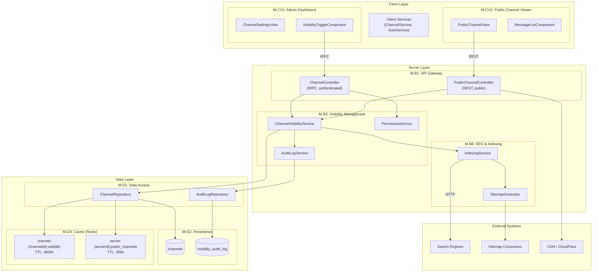
```mermaid
graph TB
    subgraph Client["Client Layer"]
        subgraph MCV1["M-CV1: Admin Dashboard"]
            ChannelSettings["ChannelSettingsView"]
            VisibilityToggle["VisibilityToggleComponent"]
        end
        subgraph MCV2["M-CV2: Public Channel Viewer"]
            PublicChannelView["PublicChannelView"]
            MessageList["MessageListComponent"]
        end
        ClientServices["Client Services\n(ChannelService, AuthService)"]
    end

    subgraph Server["Server Layer"]
        subgraph MB1["M-B1: API Gateway"]
            ChannelCtrl["ChannelController\n(tRPC, authenticated)"]
            PublicChannelCtrl["PublicChannelController\n(REST, public)"]
        end
        subgraph MB3["M-B3: Visibility Management"]
            ChannelVisibilityService["ChannelVisibilityService"]
            PermissionService["PermissionService"]
            AuditLogService["AuditLogService"]
        end
        subgraph MB6["M-B6: SEO & Indexing"]
            IndexingService["IndexingService"]
            SitemapGenerator["SitemapGenerator"]
        end
    end

    subgraph DataLayer["Data Layer"]
        subgraph MD1["M-D1: Data Access"]
            ChannelRepository["ChannelRepository"]
            AuditLogRepository["AuditLogRepository"]
        end
        subgraph MD2["M-D2: Persistence"]
            ChannelsTable[("channels")]
            AuditLogTable[("visibility_audit_log")]
        end
        subgraph MD3["M-D3: Cache (Redis)"]
            VisCache["channel:{channelId}:visibility\nTTL: 3600s"]
            PubChCache["server:{serverId}:public_channels\nTTL: 300s"]
        end
    end

    subgraph External["External Systems"]
        SearchEngines["Search Engines"]
        SitemapConsumers["Sitemap Consumers"]
        CDN["CDN / CloudFlare"]
    end

    VisibilityToggle -->|tRPC| ChannelCtrl
    PublicChannelView -->|REST| PublicChannelCtrl
    ChannelCtrl --> ChannelVisibilityService
    ChannelCtrl --> PermissionService
    PublicChannelCtrl --> ChannelVisibilityService
    ChannelVisibilityService --> AuditLogService
    ChannelVisibilityService --> IndexingService
    ChannelVisibilityService --> ChannelRepository
    AuditLogService --> AuditLogRepository
    IndexingService --> SitemapGenerator
    ChannelRepository --> ChannelsTable
    AuditLogRepository --> AuditLogTable
    ChannelRepository --> VisCache
    ChannelRepository --> PubChCache
    IndexingService -->|HTTP| SearchEngines
    SitemapGenerator --> SitemapConsumers
    PublicChannelCtrl --> CDN
```

> **Note:** All cache keys use UUID-based identifiers (e.g., `channel:{channelId}:visibility`) for consistency across all Harmony specs.

### 2.2 Information Flow Summary

| Flow ID | Source | Destination | Data | Protocol |
|---------|--------|-------------|------|----------|
| F1 | C1.2 VisibilityToggle | C4.1 ChannelController | VisibilityUpdateRequest | HTTPS (tRPC) |
| F2 | C4.1 ChannelController | C5.1 VisibilityService | VisibilityChangeCommand | Internal Call |
| F3 | C5.1 VisibilityService | C6.1 ChannelRepository | Channel Entity | Database Protocol |
| F4 | C5.1 VisibilityService | C5.2 IndexingService | IndexingEvent | EventBus (Redis Pub/Sub) |
| F5 | C5.2 IndexingService | E1 Search Engines | Sitemap XML | HTTPS |
| F6 | C4.2 PublicAccessCtrl | E3 CDN | Cached Public Content | HTTPS |
| F7 | C5.1 VisibilityService | C5.4 AuditLogService | AuditEntry | Internal Call |

### 2.3 Rationale

This follows a clear model-view-controller architecture, where the client can view channels and control their visibility state with the M1 Admin Dashboard controller. The underlying model is represented by the server layer, which handles get/set operations and any necessary side-effects for search engine indexing. 

The underlying data layer uses a short-term caching layer to reduce database accesses and syncs with external systems. 

We had to prompt edits to this to ensure the database columns were not mismatched across each architecture diagram. The Redis cache key pattern was also inconsistent across specs, so we had to prompt fixes for that as well.

---

## 3. Class Diagram

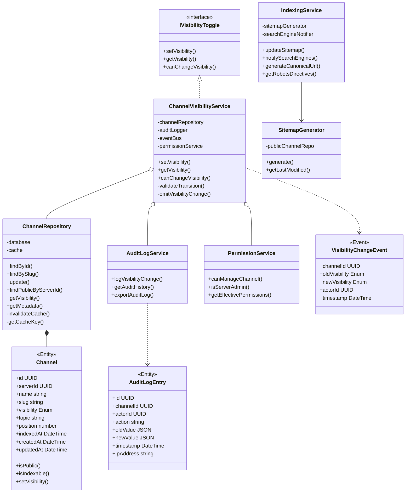
```mermaid
classDiagram
    class IVisibilityToggle {
        <<interface>>
        +setVisibility()
        +getVisibility()
        +canChangeVisibility()
    }

    class ChannelVisibilityService {
        -channelRepository
        -auditLogger
        -eventBus
        -permissionService
        +setVisibility()
        +getVisibility()
        +canChangeVisibility()
        -validateTransition()
        -emitVisibilityChange()
    }

    class ChannelRepository {
        -database
        -cache
        +findById()
        +findBySlug()
        +update()
        +findPublicByServerId()
        +getVisibility()
        +getMetadata()
        -invalidateCache()
        -getCacheKey()
    }

    class AuditLogService {
        +logVisibilityChange()
        +getAuditHistory()
        +exportAuditLog()
    }

    class PermissionService {
        +canManageChannel()
        +isServerAdmin()
        +getEffectivePermissions()
    }

    class Channel {
        <<Entity>>
        +id UUID
        +serverId UUID
        +name string
        +slug string
        +visibility Enum
        +topic string
        +position number
        +indexedAt DateTime
        +createdAt DateTime
        +updatedAt DateTime
        +isPublic()
        +isIndexable()
        +setVisibility()
    }

    class AuditLogEntry {
        <<Entity>>
        +id UUID
        +channelId UUID
        +actorId UUID
        +action string
        +oldValue JSON
        +newValue JSON
        +timestamp DateTime
        +ipAddress string
    }

    class VisibilityChangeEvent {
        <<Event>>
        +channelId UUID
        +oldVisibility Enum
        +newVisibility Enum
        +actorId UUID
        +timestamp DateTime
    }

    class IndexingService {
        -sitemapGenerator
        -searchEngineNotifier
        +updateSitemap()
        +notifySearchEngines()
        +generateCanonicalUrl()
        +getRobotsDirectives()
    }

    class SitemapGenerator {
        -publicChannelRepo
        +generate()
        +getLastModified()
    }

    IVisibilityToggle <|.. ChannelVisibilityService
    ChannelVisibilityService o-- ChannelRepository
    ChannelVisibilityService o-- AuditLogService
    ChannelVisibilityService o-- PermissionService
    ChannelRepository *-- Channel
    AuditLogService ..> AuditLogEntry
    ChannelVisibilityService ..> VisibilityChangeEvent
    IndexingService --> SitemapGenerator
```

> **Sitemap Ownership:** `IndexingService` (CL6.1 / C5.2) is the canonical owner of sitemap generation and search engine notification across all Harmony specs. Other features (e.g., SEO Meta Tag Generation) emit events that this service consumes to trigger sitemap updates.

### 3.1 Rationale

After having an LLM review this spec, the canonical owner of the sitemap generation should be the IndexingService. There was a discrepancy between this spec and the seo-meta-tag-generation spec on what would consume server updates and generate new sitemaps for external services. 

Significant inconsistencies existed between section 2, 3, 9, and 10, so a verification pass was necessary after the document was generated to fix them. 

---

## 4. List of Classes

### 4.1 Client Module (M1, M2, M3)

| Label | Class Name | Type | Purpose |
|-------|------------|------|---------|
| CL-C1.1 | ChannelSettingsView | View Component | Channel settings page with visibility management |
| CL-C1.2 | VisibilityToggleComponent | UI Component | Toggle control for Public/Indexable ↔ Private with confirmation |
| CL-C2.1 | PublicChannelView | View Component | Public channel content for anonymous users and crawlers |
| CL-C2.2 | MessageListComponent | UI Component | Paginated message list with SEO-optimized markup |
| CL-C3.1 | ChannelService | Service | Client-side channel API calls including visibility updates |
| CL-C3.2 | AuthService | Service | Authentication state and permission checking |

### 4.2 API Gateway Module (M4)

| Label | Class Name | Type | Purpose |
|-------|------------|------|---------|
| CL-C4.1 | ChannelController | Controller | Authenticated channel management API (tRPC) |
| CL-C4.2 | PublicAccessController | Controller | Unauthenticated public content and sitemaps (REST) |

### 4.3 Business Logic Module (M5)

| Label | Class Name | Type | Purpose |
|-------|------------|------|---------|
| CL-C5.1 | ChannelVisibilityService | Service | Visibility state changes, validation, and event emission |
| CL-C5.2 | IndexingService | Service | Sitemap generation, crawler notifications (canonical owner) |
| CL-C5.3 | PermissionService | Service | User permission validation for channel management |
| CL-C5.4 | AuditLogService | Service | Audit trail for visibility changes |

### 4.4 Data Access Module (M6)

| Label | Class Name | Type | Purpose |
|-------|------------|------|---------|
| CL-C6.1 | ChannelRepository | Repository | Channel data access with caching |
| CL-C6.2 | AuditLogRepository | Repository | Audit log data access |

### 4.5 Data Structures (Entities/DTOs)

| Label | Class Name | Type | Purpose |
|-------|------------|------|---------|
| CL-D1 | Channel | Entity | Domain entity representing a channel with visibility state |
| CL-D2 | AuditLogEntry | Entity | Single audit log record |
| CL-D3 | VisibilityChangeEvent | Event | Event emitted on visibility changes |
| CL-D4 | ChannelVisibility | Enumeration | Possible visibility states |
| CL-D5 | VisibilityUpdateRequest | DTO | Request payload for visibility update |
| CL-D6 | VisibilityUpdateResponse | DTO | Response payload for visibility update |
| CL-D7 | PublicChannelDTO | DTO | Public-facing channel data (see §4.6) |

### 4.6 PublicChannelDTO Fields

```typescript
interface PublicChannelDTO {
  id: string;           // Channel UUID
  name: string;         // Display name
  slug: string;         // URL-safe identifier
  topic: string;        // Channel topic/description
  messageCount: number; // Total messages in channel
  serverSlug: string;   // Parent server's slug
}
```

### 4.7 Rationale

Like the previous section, I had to reprompt to fix inconsistencies. The LLM also noticed that the ChannelRepository interface/class has discrepancies across each spec, so it consolidated each of them together. The class diagrams correctly display the interactions between each class, so no update was needed there. 

---

## 5. State Diagrams

### 5.1 System State Variables

| Variable | Type | Description |
|----------|------|-------------|
| channel.visibility | ChannelVisibility | Current visibility state |
| channel.indexedAt | DateTime | Last sitemap inclusion timestamp |
| sitemap.lastModified | DateTime | Last sitemap update |
| auditLog.entries | AuditLogEntry[] | Audit records |

### 5.2 Channel Visibility State Machine

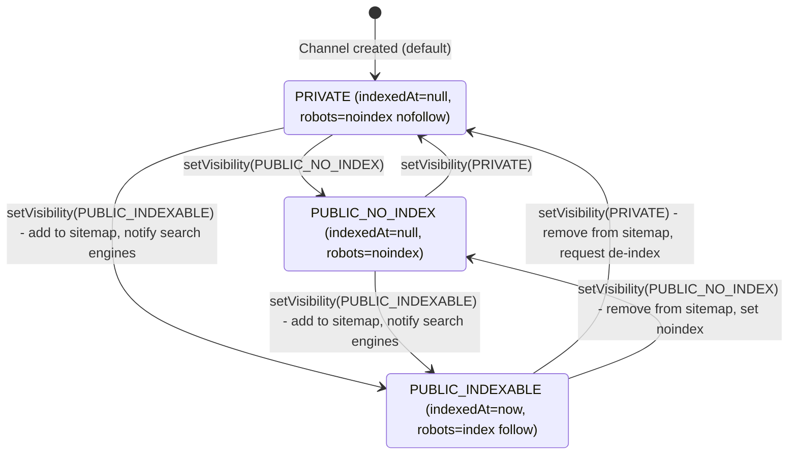
```mermaid
stateDiagram-v2
    [*] --> PRIVATE : Channel created (default)

    state "PRIVATE (indexedAt=null, robots=noindex nofollow)" as PRIVATE
    state "PUBLIC_NO_INDEX (indexedAt=null, robots=noindex)" as PUBLIC_NO_INDEX
    state "PUBLIC_INDEXABLE (indexedAt=now, robots=index follow)" as PUBLIC_INDEXABLE

    PRIVATE --> PUBLIC_NO_INDEX : setVisibility(PUBLIC_NO_INDEX)
    PRIVATE --> PUBLIC_INDEXABLE : setVisibility(PUBLIC_INDEXABLE) - add to sitemap, notify search engines

    PUBLIC_NO_INDEX --> PRIVATE : setVisibility(PRIVATE)
    PUBLIC_NO_INDEX --> PUBLIC_INDEXABLE : setVisibility(PUBLIC_INDEXABLE) - add to sitemap, notify search engines

    PUBLIC_INDEXABLE --> PRIVATE : setVisibility(PRIVATE) - remove from sitemap, request de-index
    PUBLIC_INDEXABLE --> PUBLIC_NO_INDEX : setVisibility(PUBLIC_NO_INDEX) - remove from sitemap, set noindex
```

### 5.3 Admin Action State Diagram

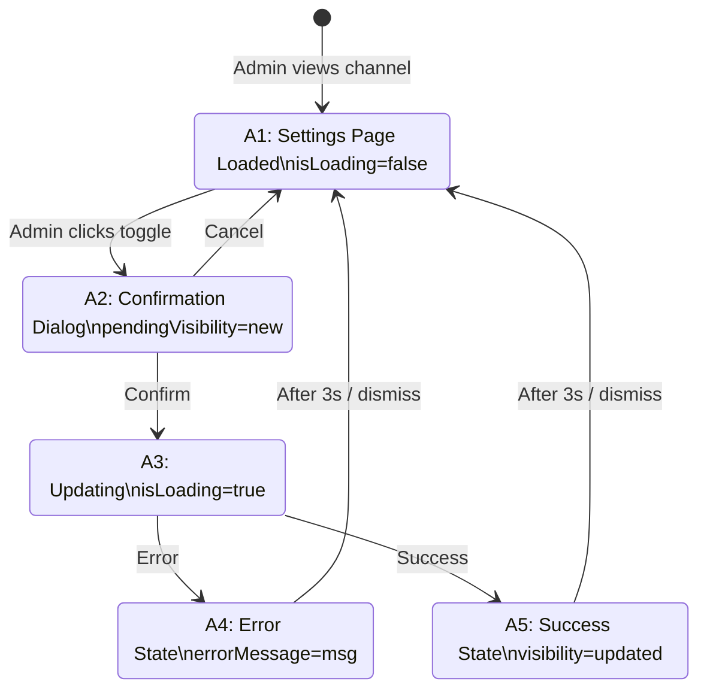
```mermaid
stateDiagram-v2
    [*] --> A1 : Admin views channel

    A1 : A1: Settings Page Loaded\nisLoading=false
    A2 : A2: Confirmation Dialog\npendingVisibility=new
    A3 : A3: Updating\nisLoading=true
    A4 : A4: Error State\nerrorMessage=msg
    A5 : A5: Success State\nvisibility=updated

    A1 --> A2 : Admin clicks toggle
    A2 --> A1 : Cancel
    A2 --> A3 : Confirm
    A3 --> A4 : Error
    A3 --> A5 : Success
    A4 --> A1 : After 3s / dismiss
    A5 --> A1 : After 3s / dismiss
```

### 5.4 Rationale

The first diagram correctly tracks the state changes for all possible channel states. No changes or reprompting the LLM was necessary for this section. The channel will be public, public & indexable, or private. A simplification of the roles-based access control in Discord, but covers the general idea. 

The second diagram correctly tracks the state transitions for the channel visibility permission. It is quite simple so the model did not need to the reprompted for any changes.

---

## 6. Flow Charts

### 6.1 Scenario: Admin Sets Channel to Public/Indexable

Admin navigates to channel settings and toggles a private channel to publicly indexable. System validates permissions, updates DB, regenerates sitemap, and notifies search engines.

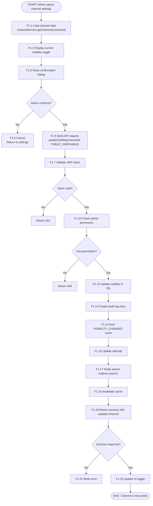
```mermaid
flowchart TD
    Start(["START: Admin opens channel settings"])
    F11["F1.1 Load channel data\nChannelService.getChannel(channelId)"]
    F12["F1.2 Display current visibility toggle"]
    F13["F1.3 Show confirmation dialog"]
    Confirm{Admin confirms?}
    F15["F1.5 Cancel\nReturn to settings"]
    F16["F1.6 Send API request:\nupdateVisibility(channelId, PUBLIC_INDEXABLE)"]
    F17["F1.7 Validate JWT token"]
    TokenValid{Token valid?}
    Return401["Return 401"]
    F110["F1.10 Check admin permission"]
    HasPerm{Has permission?}
    Return403["Return 403"]
    F113["F1.13 Update visibility in DB"]
    F114["F1.14 Create audit log entry"]
    F115["F1.15 Emit VISIBILITY_CHANGED event"]
    F116["F1.16 Update sitemap"]
    F117["F1.17 Notify search engines (async)"]
    F118["F1.18 Invalidate cache"]
    F119["F1.19 Return success with updated channel"]
    SuccessResp{Success response?}
    F122["F1.22 Show error"]
    F123["F1.23 Update UI toggle"]
    End(["END: Channel is now public"])

    Start --> F11 --> F12 --> F13 --> Confirm
    Confirm -->|No| F15
    Confirm -->|Yes| F16 --> F17 --> TokenValid
    TokenValid -->|No| Return401
    TokenValid -->|Yes| F110 --> HasPerm
    HasPerm -->|No| Return403
    HasPerm -->|Yes| F113 --> F114 --> F115 --> F116 --> F117 --> F118 --> F119 --> SuccessResp
    SuccessResp -->|No| F122
    SuccessResp -->|Yes| F123 --> End
```

#### 6.1.1 Cross-Spec Integration: Visibility → PUBLIC_INDEXABLE

When visibility changes to `PUBLIC_INDEXABLE`:
1. Emit `VISIBILITY_CHANGED` event via EventBus (Redis Pub/Sub)
2. **SEO Meta Tag Generation spec** consumes event → generates meta tags for the channel
3. **Guest Public Channel View spec** consumes event → warms guest view cache

### 6.2 Scenario: Anonymous User Views Public Channel

An anonymous user or crawler requests a public channel page. System verifies visibility and serves content with appropriate SEO headers.

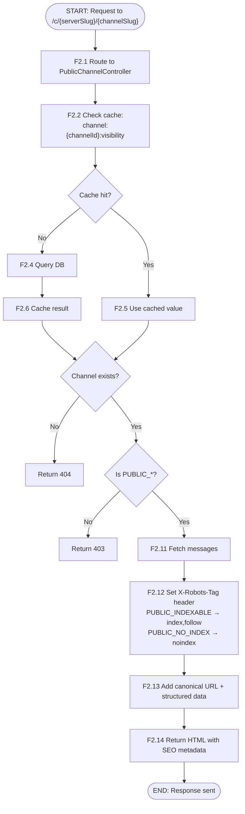
```mermaid
flowchart TD
    Start(["START: Request to /c/{serverSlug}/{channelSlug}"])
    F21["F2.1 Route to PublicChannelController"]
    F22["F2.2 Check cache:\nchannel:{channelId}:visibility"]
    CacheHit{Cache hit?}
    F24["F2.4 Query DB"]
    F26["F2.6 Cache result"]
    F25["F2.5 Use cached value"]
    ChExists{Channel exists?}
    Return404["Return 404"]
    IsPublic{"Is PUBLIC_*?"}
    Return403["Return 403"]
    F211["F2.11 Fetch messages"]
    F212["F2.12 Set X-Robots-Tag header\nPUBLIC_INDEXABLE → index,follow\nPUBLIC_NO_INDEX → noindex"]
    F213["F2.13 Add canonical URL + structured data"]
    F214["F2.14 Return HTML with SEO metadata"]
    End(["END: Response sent"])

    Start --> F21 --> F22 --> CacheHit
    CacheHit -->|No| F24 --> F26 --> ChExists
    CacheHit -->|Yes| F25 --> ChExists
    ChExists -->|No| Return404
    ChExists -->|Yes| IsPublic
    IsPublic -->|No| Return403
    IsPublic -->|Yes| F211 --> F212 --> F213 --> F214 --> End
```

### 6.3 Scenario: Admin Sets Channel to Private (De-indexing)

Administrator changes a public/indexable channel back to private. System removes from sitemap and requests de-indexing.

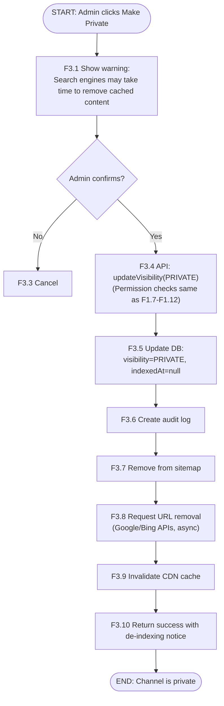
```mermaid
flowchart TD
    Start(["START: Admin clicks Make Private"])
    F31["F3.1 Show warning:\nSearch engines may take time to remove cached content"]
    Confirm{Admin confirms?}
    F33["F3.3 Cancel"]
    F34["F3.4 API: updateVisibility(PRIVATE)\n(Permission checks same as F1.7-F1.12)"]
    F35["F3.5 Update DB:\nvisibility=PRIVATE, indexedAt=null"]
    F36["F3.6 Create audit log"]
    F37["F3.7 Remove from sitemap"]
    F38["F3.8 Request URL removal\n(Google/Bing APIs, async)"]
    F39["F3.9 Invalidate CDN cache"]
    F310["F3.10 Return success with de-indexing notice"]
    End(["END: Channel is private"])

    Start --> F31 --> Confirm
    Confirm -->|No| F33
    Confirm -->|Yes| F34 --> F35 --> F36 --> F37 --> F38 --> F39 --> F310 --> End
```

#### 6.3.1 Cross-Spec Integration: Visibility → PRIVATE

When visibility changes to `PRIVATE`:
1. Emit `VISIBILITY_CHANGED` event via EventBus (Redis Pub/Sub)
2. **SEO Meta Tag Generation spec** consumes event → deletes meta tags for the channel
3. **Guest Public Channel View spec** consumes event → invalidates guest view cache

---

### 6.4 Rationale

The LLM had to be reprompted here to clarify which protocols (RPC vs REST) would be used for communications. This was an issue across the this whole dev spec. It was determined REST protocols would be used for public APIs and RPC for internal communications. 

The LLM also had to be reprompted to finalize what the event bus would be. It chose Redis Pub/Sub to allow for visibility change updates to propagate. The cache keying also needed to be updated to match earlier updates. 

## 7. Development Risks and Failures

### 7.1 Runtime Failures

| Label | Failure Mode | User-Visible Effect | Recovery Procedure | Likelihood | Impact |
|-------|-------------|--------------------|--------------------|------------|--------|
| RF-1 | API Server crash | Toggle action fails | Auto-restart; client retries | Medium | Medium |
| RF-2 | Lost runtime state | Stale visibility displayed | Cache invalidation on recovery | Low | Low |
| RF-3 | Database corruption | Incorrect visibility; privacy breach | Restore from backup; audit reconciliation | Very Low | Critical |
| RF-4 | Invalid state transition | Channel may become public unintentionally | Server-side transition validation | Low | High |
| RF-5 | RPC failure | "Network error" shown | Retry with exponential backoff; circuit breaker | Medium | Medium |
| RF-6 | Server overload | Slow response or timeout | Rate limiting; horizontal scaling | Medium | Medium |
| RF-7 | Out of RAM | Server unresponsive | Memory limits; vertical scaling | Low | High |
| RF-8 | Database out of space | Write operations fail | Storage alerts; archive old audit logs | Low | High |

### 7.2 Connectivity Failures

| Label | Failure Mode | User-Visible Effect | Recovery Procedure | Likelihood | Impact |
|-------|-------------|--------------------|--------------------|------------|--------|
| CF-1 | Lost network | "Connection lost" banner | Auto-reconnect with backoff | Medium | Medium |
| CF-2 | Lost DB connection | API returns 503 | Connection pool health checks; failover | Low | High |
| CF-3 | Traffic spike | Increased latency | CDN caching; auto-scaling | Medium | Medium |
| CF-4 | Search engine API down | Indexing updates delayed | Queue failed notifications; retry | Medium | Low |

### 7.3 Hardware Failures

| Label | Failure Mode | User-Visible Effect | Recovery Procedure | Likelihood | Impact |
|-------|-------------|--------------------|--------------------|------------|--------|
| HF-1 | App server down | Service unavailable | Multi-AZ deployment; LB health checks | Low | High |
| HF-2 | Bad config loaded | Unpredictable behavior | Config validation on startup; rollback | Low | High |
| HF-3 | System relocation | Temporary outage | Blue-green deployment; DNS TTL management | Very Low | Medium |

### 7.4 Security Failures

| Label | Failure Mode | User-Visible Effect | Recovery Procedure | Likelihood | Impact |
|-------|-------------|--------------------|--------------------|------------|--------|
| IF-1 | DDoS attack | Service degradation | CloudFlare DDoS protection; rate limiting | Medium | High |
| IF-2 | OS compromise | Full system breach | Incident response; rebuild from clean images | Very Low | Critical |
| IF-3 | Code tampering | Malicious behavior | Code signing; integrity monitoring | Very Low | Critical |
| IF-4 | Database theft | Privacy breach | Encryption at rest; access logging | Low | Critical |
| IF-5 | Bot spam | Public channels flooded | CAPTCHA; rate limiting; content moderation | Medium | Medium |
| IF-6 | Session hijacking | Unauthorized changes | Secure cookies; session binding; anomaly detection | Low | High |

### 7.5 Failure Priority Matrix

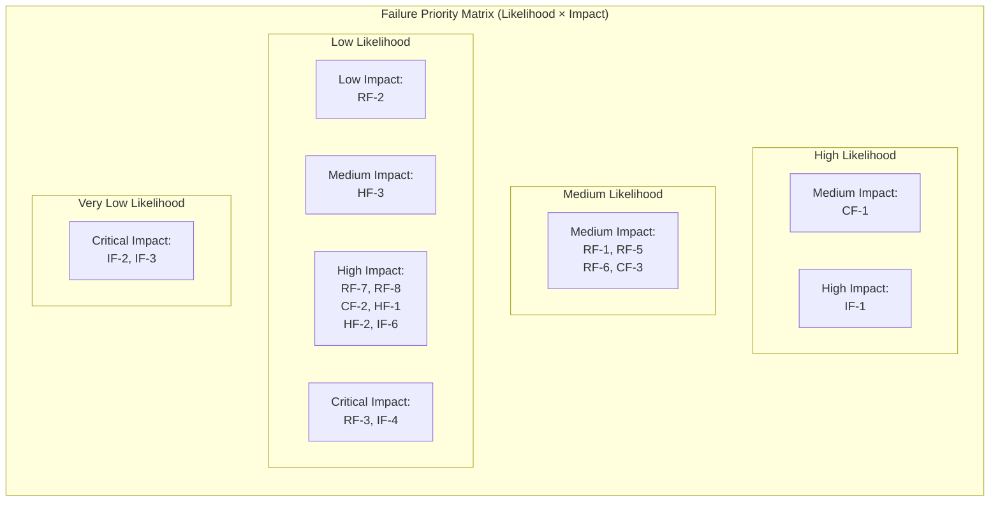
```mermaid
graph LR
    subgraph Matrix["Failure Priority Matrix (Likelihood × Impact)"]
        subgraph High["High Likelihood"]
            H_Med["Medium Impact:\nCF-1"]
            H_High["High Impact:\nIF-1"]
        end
        subgraph Medium["Medium Likelihood"]
            M_Med["Medium Impact:\nRF-1, RF-5\nRF-6, CF-3"]
        end
        subgraph Low["Low Likelihood"]
            L_Low["Low Impact:\nRF-2"]
            L_Med["Medium Impact:\nHF-3"]
            L_High["High Impact:\nRF-7, RF-8\nCF-2, HF-1\nHF-2, IF-6"]
            L_Crit["Critical Impact:\nRF-3, IF-4"]
        end
        subgraph VeryLow["Very Low Likelihood"]
            VL_Crit["Critical Impact:\nIF-2, IF-3"]
        end
    end
```

### 7.6 Rationale

Minor reprompting was needed to standardize the rate-limiting policy. It did not affect this section, but other specs mentioned rate-limiting so it had to be added to this one as a failure. Otherwise the failure modes and resolutions make sense, and there are no obvious gaps in errors.

---

## 8. Technology Stack

| Label | Technology | Version | Purpose | Source |
|-------|------------|---------|---------|-------|
| T1 | TypeScript | 5.3+ | Primary language (client + server) | https://www.typescriptlang.org/ |
| T2 | React | 18.2+ | Frontend UI framework | https://react.dev/ |
| T3 | Next.js | 14.0+ | SSR/SSG framework (SEO-critical for public pages) | https://nextjs.org/ |
| T4 | Node.js | 20 LTS | Server runtime | https://nodejs.org/ |
| T5 | PostgreSQL | 16+ | Primary database (ACID, JSONB, enums) | https://www.postgresql.org/ |
| T6 | Redis | 7.2+ | Caching, session storage, EventBus (Pub/Sub) | https://redis.io/ |
| T7 | Prisma | 5.8+ | Type-safe ORM with migrations | https://www.prisma.io/ |
| T8 | tRPC | 10.45+ | End-to-end typesafe APIs (authenticated internal) | https://trpc.io/ |
| T9 | Zod | 3.22+ | Runtime schema validation (integrates with tRPC) | https://zod.dev/ |
| T10 | TailwindCSS | 3.4+ | Utility-first CSS framework | https://tailwindcss.com/ |
| T11 | CloudFlare | N/A | CDN and DDoS protection | https://www.cloudflare.com/ |
| T12 | Docker | 24+ | Containerization | https://www.docker.com/ |
| T13 | Google Search Console API | v1 | Programmatic indexing/de-indexing | https://developers.google.com/webmaster-tools |
| T14 | Bing Webmaster API | v1 | Microsoft search engine integration | https://www.bing.com/webmasters |
| T15 | Jest | 29+ | Unit/integration testing | https://jestjs.io/ |
| T16 | Playwright | 1.40+ | Cross-browser E2E testing | https://playwright.dev/ |
| T17 | sanitize-html | 2.12+ | XSS prevention / HTML sanitization for public-facing content (Node.js-native) | https://github.com/apostrophecms/sanitize-html |

> **Convention:** tRPC is used for authenticated internal APIs between client and server. Public-facing endpoints (sitemaps, public channel pages, robots.txt) use REST for maximum compatibility with crawlers and third-party consumers.

### 8.1 EventBus

**Technology:** Redis Pub/Sub (T6)

Event types consumed/produced across specs:

| Event | Source Spec | Description |
|-------|-------------|-------------|
| `VISIBILITY_CHANGED` | Channel Visibility Toggle (this spec) | Emitted when channel visibility state changes |
| `MESSAGE_CREATED` | SEO Meta Tag Generation | New message in a public channel |
| `MESSAGE_EDITED` | SEO Meta Tag Generation | Message edited in a public channel |
| `MESSAGE_DELETED` | SEO Meta Tag Generation | Message deleted from a public channel |
| `META_TAGS_UPDATED` | SEO Meta Tag Generation | Meta tags regenerated for a channel |

### 8.2 Rationale

Significant reprompting was necessary here because of conflicting tech stacks across each spec. This spec was missing DOMPurify, which would be needed to sanitize and generate sitemaps with other public content. The communication APIs being a mix of RPC and REST was also detected by the LLM here, requiring prompting to fix it. The LLM then determined to use RPC for authenticated internal APIs, while public endpoints would be REST for compatibility with web indexers.

Finally, the LLM made a shared tech-stack document that would be used across each spec. 

---

## 9. APIs

### 9.1 Module M4: API Gateway

#### 9.1.1 CL-C4.1 ChannelController

**Public Methods (Authenticated, tRPC):**

```typescript
getChannelSettings(
  channelId: string,          // UUID
  context: AuthenticatedContext
): Promise<ChannelSettingsResponse>

updateChannelVisibility(
  channelId: string,
  body: VisibilityUpdateRequest,  // { visibility: ChannelVisibility }
  context: AuthenticatedContext
): Promise<VisibilityUpdateResponse>

getVisibilityAuditLog(
  channelId: string,
  query: AuditLogQuery,       // { limit?, offset?, startDate? }
  context: AuthenticatedContext
): Promise<AuditLogResponse>
```

**Private Methods:**

```typescript
private validateAdminAccess(userId: string, channelId: string): Promise<boolean>
private mapToResponse(channel: Channel): ChannelSettingsResponse
```

#### 9.1.2 CL-C4.2 PublicAccessController

**Public Methods (Unauthenticated, REST):**

```typescript
getPublicChannel(
  serverSlug: string, channelSlug: string, query: PaginationQuery
): Promise<PublicChannelPage>

getServerSitemap(serverSlug: string): Promise<SitemapXML>

getRobotsTxt(): Promise<RobotsTxt>

getPublicMessages(channelId: string, query: PaginationQuery): Promise<PublicMessagesResponse>
```

### 9.2 Module M5: Business Logic

#### 9.2.1 CL-C5.1 ChannelVisibilityService

```typescript
setVisibility(
  channelId: string, newVisibility: ChannelVisibility,
  actorId: string, ipAddress: string
): Promise<VisibilityChangeResult>

getVisibility(channelId: string): Promise<ChannelVisibility>
canChangeVisibility(channelId: string, actorId: string): Promise<boolean>

private validateTransition(
  current: ChannelVisibility, next: ChannelVisibility
): ValidationResult

private emitVisibilityChange(event: VisibilityChangeEvent): Promise<void>
```

#### 9.2.2 CL-C5.2 IndexingService

```typescript
updateSitemap(serverId: string): Promise<void>
notifySearchEngines(url: string, action: 'INDEX' | 'REMOVE'): Promise<NotificationResult>
generateCanonicalUrl(serverId: string, channelId: string): string
getRobotsDirectives(visibility: ChannelVisibility): RobotsDirectives
```

#### 9.2.3 CL-C5.3 PermissionService

```typescript
canManageChannel(userId: string, channelId: string): Promise<boolean>
isServerAdmin(userId: string, serverId: string): Promise<boolean>
getEffectivePermissions(userId: string, channelId: string): Promise<PermissionSet>
```

#### 9.2.4 CL-C5.4 AuditLogService

```typescript
logVisibilityChange(entry: AuditLogEntry): Promise<void>
getAuditHistory(channelId: string, options: AuditQueryOptions): Promise<AuditLogEntry[]>
exportAuditLog(channelId: string, format: 'JSON' | 'CSV'): Promise<Buffer>
```

### 9.3 Module M6: Data Access

#### 9.3.1 CL-C6.1 ChannelRepository (Consolidated)

```typescript
findById(channelId: string): Promise<Channel | null>
findBySlug(serverSlug: string, channelSlug: string): Promise<Channel | null>
update(channelId: string, data: Partial<Channel>): Promise<Channel>
findPublicByServerId(serverId: string): Promise<Channel[]>
getVisibility(channelId: string): Promise<ChannelVisibility>
getMetadata(channelId: string): Promise<ChannelMetadata>

private invalidateCache(channelId: string): Promise<void>
private getCacheKey(channelId: string): string
```

### 9.4 Rate Limiting

| Consumer Type | Limit | Window | Scope |
|---------------|-------|--------|-------|
| Human users (authenticated) | 100 req | 1 min | Per user |
| Verified bots / crawlers | 1000 req | 1 min | Per bot identity |

Rate limits apply to all API endpoints. Exceeding limits returns `429 Too Many Requests` with `Retry-After` header.

### 9.5 Rationale

The LLM had generated mismatched class methods and variables from before and now. It had to be reprompted to recouncile the differences and create missing functions both here and in previous sections. Like mentioned before, it also had to be reprompted to standardize a ratelimiting policy here instead of arbitrary values elsewhere.

The separation of public APIs, business logic, and data access layers is good practice in large systems, so I agree with the LLM's decisions here.

---

## 10. Public Interfaces

### 10.1 Cross-Module Interfaces

#### Client (M1–M3) → API Gateway (M4):

| Method | Class | Used For |
|--------|-------|----------|
| getChannelSettings() | ChannelController | Loading channel settings |
| updateChannelVisibility() | ChannelController | Visibility toggle |
| getVisibilityAuditLog() | ChannelController | Audit history display |
| getPublicChannel() | PublicAccessController | Viewing public channel |
| getPublicMessages() | PublicAccessController | Paginating public messages |

#### API Gateway (M4) → Business Logic (M5):

| Method | Class | Used For |
|--------|-------|----------|
| setVisibility() | ChannelVisibilityService | Processing visibility updates |
| getVisibility() | ChannelVisibilityService | Reading current visibility |
| canChangeVisibility() | ChannelVisibilityService | Permission checking |
| canManageChannel() | PermissionService | Authorization |
| generateCanonicalUrl() | IndexingService | SEO headers |
| getRobotsDirectives() | IndexingService | SEO headers |
| getAuditHistory() | AuditLogService | Audit log endpoint |

#### Business Logic (M5) → Data Access (M6):

| Method | Class | Used For |
|--------|-------|----------|
| findById() | ChannelRepository | Loading channel entity |
| findBySlug() | ChannelRepository | Slug-based channel lookup |
| update() | ChannelRepository | Persisting visibility changes |
| findPublicByServerId() | ChannelRepository | Sitemap generation |
| getVisibility() | ChannelRepository | Fast visibility check |
| getMetadata() | ChannelRepository | Channel metadata retrieval |
| create() | AuditLogRepository | Writing audit entries |
| findByChannelId() | AuditLogRepository | Reading audit history |

### 10.2 REST API Interface

```yaml
openapi: 3.0.3
info:
  title: Harmony Channel Visibility API
  version: 1.0.0

paths:
  /api/channels/{channelId}/visibility:
    patch:
      summary: Update channel visibility
      security:
        - bearerAuth: []
      parameters:
        - name: channelId
          in: path
          required: true
          schema:
            type: string
            format: uuid
      requestBody:
        required: true
        content:
          application/json:
            schema:
              $ref: '#/components/schemas/VisibilityUpdateRequest'
      responses:
        '200':
          description: Visibility updated
          content:
            application/json:
              schema:
                $ref: '#/components/schemas/VisibilityUpdateResponse'
        '401':
          description: Unauthorized
        '403':
          description: Forbidden
        '404':
          description: Channel not found
        '429':
          description: Rate limit exceeded

components:
  schemas:
    ChannelVisibility:
      type: string
      enum: [PUBLIC_INDEXABLE, PUBLIC_NO_INDEX, PRIVATE]

    VisibilityUpdateRequest:
      type: object
      required: [visibility]
      properties:
        visibility:
          $ref: '#/components/schemas/ChannelVisibility'

    VisibilityUpdateResponse:
      type: object
      properties:
        success:
          type: boolean
        channel:
          $ref: '#/components/schemas/ChannelDTO'
        previousVisibility:
          $ref: '#/components/schemas/ChannelVisibility'
        indexingStatus:
          type: string
          enum: [PENDING, INDEXED, NOT_INDEXED, REMOVAL_REQUESTED]
```

### 10.3 Cross-Spec Event Integration

When `VISIBILITY_CHANGED` is emitted:

| New Visibility | Downstream Action (SEO Spec) | Downstream Action (Guest View Spec) |
|---------------|------------------------------|--------------------------------------|
| `PUBLIC_INDEXABLE` | Generate meta tags for channel | Warm guest view cache |
| `PUBLIC_NO_INDEX` | Update meta tags (add noindex) | Keep guest view cache (public content) |
| `PRIVATE` | Delete meta tags for channel | Invalidate guest view cache |

### 10.4 Rationale

The LLM correctly generated the public API specification. It did not need to be reprompted for any fixes here. The generated API specification is correct and exposes the endpoints necessary for this specific user story. 

Significant inconsistencies in classes existed between sections 2, 3, 9, and 10, so a verification pass was necessary after the document was generated to fix them. 

---

## 11. Data Schemas

### 11.1 Database Tables

#### D7.1 channels

**Runtime Class:** CL-D1 Channel

| Column | Database Type | Constraints | Description |
|--------|--------------|-------------|-------------|
| id | UUID | PRIMARY KEY | Unique channel identifier |
| server_id | UUID | FOREIGN KEY → servers(id), NOT NULL, INDEX | Parent server reference |
| name | VARCHAR(100) | NOT NULL | Display name |
| slug | VARCHAR(100) | NOT NULL, UNIQUE per server | URL-safe identifier |
| visibility | visibility_enum | NOT NULL, DEFAULT 'PRIVATE' | Current visibility state |
| topic | TEXT | NULL | Channel topic/description |
| position | INTEGER | NOT NULL, DEFAULT 0 | Display order within server |
| indexed_at | TIMESTAMP WITH TIME ZONE | NULL | When channel was added to sitemap |
| created_at | TIMESTAMP WITH TIME ZONE | NOT NULL, DEFAULT NOW() | Creation timestamp |
| updated_at | TIMESTAMP WITH TIME ZONE | NOT NULL, DEFAULT NOW() | Last modification timestamp |

**Enum Definition:**
```sql
CREATE TYPE visibility_enum AS ENUM ('PUBLIC_INDEXABLE', 'PUBLIC_NO_INDEX', 'PRIVATE');
```

**Indexes (Canonical Set — merged from all specs):**
```sql
-- Composite index for server-scoped visibility queries
CREATE INDEX idx_channels_server_visibility ON channels(server_id, visibility);

-- Unique slug per server
CREATE UNIQUE INDEX idx_channels_server_slug ON channels(server_id, slug);

-- Partial index for indexable channels (sitemap generation)
CREATE INDEX idx_channels_visibility_indexed ON channels(visibility, indexed_at)
  WHERE visibility = 'PUBLIC_INDEXABLE';

-- Partial index for all public channels (guest view queries)
CREATE INDEX idx_channels_visibility ON channels(visibility)
  WHERE visibility IN ('PUBLIC_INDEXABLE', 'PUBLIC_NO_INDEX');
```

#### D7.2 visibility_audit_log

**Runtime Class:** CL-D2 AuditLogEntry

| Column | Database Type | Constraints | Description |
|--------|--------------|-------------|-------------|
| id | UUID | PRIMARY KEY | Unique log entry identifier |
| channel_id | UUID | FOREIGN KEY, NOT NULL, INDEX | Channel reference |
| actor_id | UUID | FOREIGN KEY, NOT NULL | User who made change |
| action | VARCHAR(50) | NOT NULL | e.g., 'VISIBILITY_CHANGED' |
| old_value | JSONB | NULL | Previous state |
| new_value | JSONB | NOT NULL | New state |
| timestamp | TIMESTAMP WITH TIME ZONE | NOT NULL, DEFAULT NOW(), INDEX | When action occurred |
| ip_address | INET | NULL | Actor's IP address |
| user_agent | VARCHAR(500) | NULL | Actor's browser/client |

**Indexes:**
```sql
CREATE INDEX idx_audit_channel_time ON visibility_audit_log(channel_id, timestamp DESC);
CREATE INDEX idx_audit_actor ON visibility_audit_log(actor_id, timestamp DESC);
```

**Retention Policy:** 7 years per compliance requirements.

#### D7.3 servers (Reference — canonical definition in Guest Public Channel View spec)

| Column | Database Type | Constraints |
|--------|--------------|-------------|
| id | UUID | PRIMARY KEY |
| name | VARCHAR(100) | NOT NULL |
| slug | VARCHAR(100) | UNIQUE |
| description | TEXT | NULL |
| icon_url | VARCHAR(500) | NULL |
| is_public | BOOLEAN | DEFAULT FALSE |
| member_count | INTEGER | DEFAULT 0 |
| created_at | TIMESTAMP WITH TIME ZONE | NOT NULL |

> This table is referenced by `channels.server_id`. See the Guest Public Channel View spec for the full canonical definition.

### 11.2 Cache Schemas

#### D8.1 ChannelVisibilityCache

- **Key Pattern:** `channel:{channelId}:visibility` (UUID-based)
- **Value:** String (visibility enum value)
- **TTL:** 3600s (1 hour)

#### D8.2 PublicChannelListCache

- **Key Pattern:** `server:{serverId}:public_channels`
- **Value:** JSON array of channel IDs
- **TTL:** 300s (5 minutes)

### 11.3 Field Type Mappings

| TypeScript Type | PostgreSQL Type | Notes |
|-----------------|-----------------|-------|
| string (UUID) | UUID | Native UUID type |
| ChannelVisibility (enum) | visibility_enum | PostgreSQL enum |
| Date | TIMESTAMP WITH TIME ZONE | Always UTC |
| object (audit values) | JSONB | Flexible schema |
| string (IP) | INET | Supports IPv4/IPv6 |

### 11.4 Rationale

This section needed significant reprompting due to database schema and index mismatches across all specs. Beyond that, the architecture is justified because it provides unique mappings for all (server, channel) pairs, allowing for indexers to access them consistently for updates. 

Cache schemas and keys needed reprompting to fix issues with inconsistent keying. 

---

## 12. Security and Privacy

### 12.1 Temporarily Stored PII

| PII Type | Justification | Usage | Disposal | Protection |
|----------|---------------|-------|----------|------------|
| IP Address | Audit trail | Logged with visibility changes | Retained in audit log | TLS in transit; encrypted at rest |
| User Agent | Identifying suspicious activity | Logged with visibility changes | Retained in audit log | TLS in transit; encrypted at rest |
| Session Token | Authentication | Validate user identity | Not stored (stateless JWT) | TLS only; short expiry |

### 12.2 Long-Term Stored PII

| PII Type | Justification | Storage Location | Access Path |
|----------|---------------|------------------|-------------|
| Actor ID (→ User) | Accountability for admin actions | D7.2 visibility_audit_log.actor_id | AuditLogRepository → AuditLogService → ChannelController |
| IP Address | Security investigation, abuse prevention | D7.2 visibility_audit_log.ip_address | Only via audit log export by authorized personnel |

### 12.3 Data Protection Measures

- **In transit:** TLS 1.3
- **At rest:** AES-256 database encryption; separate backup encryption keys
- **Access:** Audit log restricted to Security Officer role; DB credentials rotated quarterly; least privilege for service accounts

### 12.4 Privacy Policy

**Customer-Visible Points:**
- Public channels are visible to anyone on the internet, including search engines
- Messages in public channels may appear in search results
- Administrators can change channel visibility at any time
- Previously indexed content may remain in search engine caches after being made private

**Policy Presentation:** Warning on channel creation; confirmation dialog on public toggle; de-indexing notice on private toggle.

### 12.5 Access Policies

| Role | Visibility Change | View Audit Log | Export Audit Log |
|------|-------------------|----------------|------------------|
| Server Owner | Yes | Yes | Yes |
| Server Administrator | Yes | Yes | No |
| Channel Moderator | No | No | No |
| Regular Member | No | No | No |
| Anonymous User | No | No | No |

### 12.6 Audit Procedures

**Routine:** All API requests logged (timestamp, actor, action). Audit log queries are themselves logged. Monthly review of access patterns.

**Non-Routine:** Break-glass requires two-person approval. Emergency access reviewed within 24 hours. Incident reports for anomalies.

### 12.7 Minor Protection

Platform requires 13+ (COPPA). No specific minor PII collection beyond standard account data. Public channels may contain minor-posted content; parents/guardians agree to terms.

### 12.8 Security Responsibilities

| Storage/System | Responsible | Backup |
|----------------|-------------|--------|
| PostgreSQL Database | Database Administrator | DevOps Lead |
| Redis Cache | DevOps Lead | Database Administrator |
| Audit Log Storage | Security Officer | Compliance Manager |

### 12.9 XSS Prevention

All public-facing content (public channel pages, sitemap entries, PublicChannelDTO fields) is sanitized using sanitize-html (T17) before rendering to prevent XSS attacks from user-generated content.

### 12.10 Rationale

The LLM did not have issues with generating security and privacy requirements. This architecture is justified because it creates an audit trail for any actions. All actions are tagged by the user doing the action. IP addresses are also stored for audits. 

Visibility rules and search indexing is also handled with the appropriate care needed for making channels publically indexable. 

---

## 13. Risks to Completion

### 13.1 Technology Risks

| Technology | Learning Curve | Implementation Difficulty | Maintenance | Update Strategy |
|------------|----------------|---------------------------|-------------|-----------------|
| T1: TypeScript | Low | Low | Low | Dependabot |
| T2: React | Low | Low | Low | React upgrade guides |
| T3: Next.js | Medium (SSR) | Medium | Medium | Vercel migration guides |
| T5: PostgreSQL | Low | Low | Low | Standard upgrade path |
| T6: Redis | Low | Low | Low | Standard upgrade path |
| T7: Prisma | Medium | Low | Low | Migration tooling |
| T8: tRPC | Medium (new) | Medium | Medium | Breaking changes documented |
| T13/T14: Search APIs | High (external) | High | High | Monitor deprecation notices |

### 13.2 Component Risks

| Component | Risk Factor | Mitigation |
|-----------|-------------|------------|
| M5.2 IndexingService | External API dependencies may change | Abstraction layer; graceful degradation |
| M4.2 PublicAccessCtrl | High crawler traffic | CDN caching; rate limiting; edge computing |
| M6.1 ChannelRepository | Cache invalidation complexity | Explicit invalidation; short TTLs |
| D7.2 AuditLogTable | Storage growth | Date partitioning; archival; retention policy |

### 13.3 Off-the-Shelf Software

| Technology | Customization | Source Available | Bug/Security Fix | Cost |
|------------|--------------|------------------|------------------|------|
| PostgreSQL | None | Yes (OSS) | Community (fast) | Free |
| Redis | None | Yes (OSS) | Community (fast) | Free |
| Next.js | Minor (SSR config) | Yes (OSS) | Community | Free / Paid |
| Prisma | None | Yes (OSS) | Community | Free |
| CloudFlare | CDN rules | No (SaaS) | CloudFlare | Monthly fee |

### 13.4 Risk Prioritization

**High Priority:**
1. Search engine API integration — requires early prototyping
2. SSR performance for public pages — critical for SEO
3. Permission system accuracy — security critical

**Medium Priority:**
1. Audit log storage scaling
2. Cache invalidation correctness
3. CDN configuration

**Low Priority:**
1. UI polish for settings page
2. Audit log export formats

### 13.5 Contingency Plans

| Risk | Trigger | Contingency |
|------|---------|-------------|
| Search API unavailable | 3+ consecutive failures | Queue requests; manual sitemap submission; alert ops |
| DB performance degradation | p99 > 500ms | Read replicas; query plan review; add indexes |
| CDN issues | Cache hit rate < 80% | Increase origin capacity; review cache rules |
| Security breach | Unauthorized access | Incident response; notify users; rotate credentials |

### 13.6 Rationale

This set of risks is justified since the product will be a public facing chat client with many frequently updated libraries. No reprompting was necessary here. 

Component risks make sense, primarily external API changes and growing storage/bandwidth costs. These are common issues which the LLM caught and documented well. 

The LLM is justified in determining the cost of operation as well, figuring out what finanical risks are present in creating this software. 

Contingency plans and thresholds to activate them match industry standards for API, database, and caching failures. Therefore the LLM is justified in making these decisions.

---

## Appendix A: Glossary

| Term | Definition |
|------|------------|
| Indexable | Content that search engines are permitted to include in search results |
| Sitemap | XML file listing URLs for search engines to crawl |
| Canonical URL | Preferred URL for content accessible via multiple URLs |
| robots.txt | File instructing crawlers which URLs to access |
| X-Robots-Tag | HTTP header providing indexing instructions to crawlers |
| De-indexing | Requesting search engines remove content from their index |
| CDN | Content Delivery Network — geographically distributed caching servers |
| SSR | Server-Side Rendering — generating HTML on the server |
| PII | Personally Identifiable Information |
| EventBus | Redis Pub/Sub messaging layer for cross-service event communication |

---

## Appendix B: Document References

- User Story: Channel Visibility Toggle (this document)
- Dev Spec: SEO Meta Tag Generation (cross-referenced for event integration)
- Dev Spec: Guest Public Channel View (cross-referenced for `servers` table and cache warmup)
- Platform Architecture Overview (separate document)
- Harmony Security Policy (separate document)
- SEO Best Practices Guide (separate document)
````

#### 🤖 gpt-5.4 (high)

- Time: 2026-04-05T00:10:43.524Z

I’ve found one likely correctness gap around the rate-limit test setup. I’m pulling the PR branch locally now so I can pin exact line references before I finalize the review.

#### Tool: exec_command

```sh
rtk git fetch origin pull/302/head:refs/heads/codex/pr-302-review
```

Output:

```text
ok fetched (1 new refs)
```

#### Tool: exec_command

```sh
rtk grep -n "_clearBucketsForTesting|tokenBucketRateLimiter|RateLimit-Limit|Retry-After" harmony-backend/tests harmony-backend/src
```

Output:

```text
🔍 31 in 10F:

📄 harmony-backend/.../middleware/rate-limit.middleware.ts (7):
   119: *   - 429 Too Many Requests + Retry-After header when limit is exceeded
   120: *   - RateLimit-Limit / RateLimit-Remaining / RateLimit-Reset on every response
   122: export function tokenBucketRateLimiter(req: Request, res: Response, next: Nex...
   135: res.set('RateLimit-Limit', String(capacity));
   138: res.set('Retry-After', String(resetSeconds));
   147: res.set('RateLimit-Limit', String(capacity));
   158: export function _clearBucketsForTesting(): void {

📄 harmony-backend/src/routes/public.router.ts (2):
     6: import { tokenBucketRateLimiter } from '../middleware/rate-limit.middleware';
    11: publicRouter.use(tokenBucketRateLimiter);

📄 harmony-backend/tests/events.router.member.test.ts (2):
    78: tokenBucketRateLimiter: (_req: unknown, _res: unknown, next: () => void) => n...
    79: _clearBucketsForTesting: jest.fn(),

📄 harmony-backend/tests/events.router.server.test.ts (2):
    72: tokenBucketRateLimiter: (_req: unknown, _res: unknown, next: () => void) => n...
    73: _clearBucketsForTesting: jest.fn(),

📄 harmony-backend/tests/events.router.sse-server-updated.test.ts (2):
    71: tokenBucketRateLimiter: (_req: unknown, _res: unknown, next: () => void) => n...
    72: _clearBucketsForTesting: jest.fn(),

📄 harmony-backend/tests/events.router.status.test.ts (2):
    78: tokenBucketRateLimiter: (_req: unknown, _res: unknown, next: () => void) => n...
    79: _clearBucketsForTesting: jest.fn(),

📄 harmony-backend/tests/events.router.test.ts (2):
    70: tokenBucketRateLimiter: (_req: unknown, _res: unknown, next: () => void) => n...
    71: _clearBucketsForTesting: jest.fn(),

📄 harmony-backend/tests/events.router.visibility.test.ts (2):
    78: tokenBucketRateLimiter: (_req: unknown, _res: unknown, next: () => void) => n...
    79: _clearBucketsForTesting: jest.fn(),

📄 harmony-backend/tests/public.router.test.ts (3):
    16: import { _clearBucketsForTesting } from '../src/middleware/rate-limit.middlew...
   108: _clearBucketsForTesting();
   230: _clearBucketsForTesting();

📄 harmony-backend/tests/rate-limit.middleware.test.ts (7):
     3: import { tokenBucketRateLimiter, isVerifiedBot, _clearBucketsForTesting } fro...
     8: app.use(tokenBucketRateLimiter);
    16: _clearBucketsForTesting();
    48: describe('tokenBucketRateLimiter — human users', () => {
    86: it('includes Retry-After header on 429 response', async () => {
   116: describe('tokenBucketRateLimiter — bot UA requests (no elevated limits withou...
   142: describe('tokenBucketRateLimiter — response headers', () => {
```

#### Tool: exec_command

```sh
rtk read harmony-backend/tests/rate-limit.middleware.test.ts
```

Output:

```text
import express, { Request, Response } from 'express';
import request from 'supertest';
import { tokenBucketRateLimiter, isVerifiedBot, _clearBucketsForTesting } from '../src/middleware/rate-limit.middleware';

function createTestApp() {
  const app = express();
  app.set('trust proxy', true);
  app.use(tokenBucketRateLimiter);
  app.get('/test', (_req: Request, res: Response) => {
    res.status(200).json({ ok: true });
  });
  return app;
}

beforeEach(() => {
  _clearBucketsForTesting();
  jest.useFakeTimers();
  jest.setSystemTime(new Date('2025-01-01T00:00:00Z'));
});

afterEach(() => {
  jest.useRealTimers();
});

describe('isVerifiedBot', () => {
  it('identifies Googlebot as a verified bot', () => {
    expect(isVerifiedBot('Mozilla/5.0 (compatible; Googlebot/2.1; +http://www.google.com/bot.html)')).toBe(true);
  });

  it('identifies Bingbot as a verified bot (case-insensitive)', () => {
    expect(isVerifiedBot('Mozilla/5.0 (compatible; bingbot/2.0; +http://www.bing.com/bingbot.htm)')).toBe(true);
    expect(isVerifiedBot('Mozilla/5.0 (compatible; Bingbot/2.0; +http://www.bing.com/bingbot.htm)')).toBe(true);
  });

  it('returns false for a normal browser User-Agent', () => {
    expect(isVerifiedBot('Mozilla/5.0 (Windows NT 10.0; Win64; x64) AppleWebKit/537.36')).toBe(false);
  });

  it('returns false for undefined User-Agent', () => {
    expect(isVerifiedBot(undefined)).toBe(false);
  });

  it('returns false for empty string User-Agent', () => {
    expect(isVerifiedBot('')).toBe(false);
  });
});

describe('tokenBucketRateLimiter — human users', () => {
  it('allows requests within the 100 req/min limit', async () => {
    const app = createTestApp();
    const res = await request(app).get('/test').set('X-Forwarded-For', '1.2.3.4');
    expect(res.status).toBe(200);
    expect(res.headers['ratelimit-limit']).toBe('100');
  });

  it('includes RateLimit-Remaining header that decrements', async () => {
    const app = createTestApp();

    const first = await request(app).get('/test').set('X-Forwarded-For', '1.2.3.100');
    expect(first.status).toBe(200);
    const remaining1 = Number(first.headers['ratelimit-remaining']);

    const second = await request(app).get('/test').set('X-Forwarded-For', '1.2.3.100');
    expect(second.status).toBe(200);
    const remaining2 = Number(second.headers['ratelimit-remaining']);

    expect(remaining2).toBe(remaining1 - 1);
  });

  it('returns 429 after exhausting the 100-request budget', async () => {
    const app = createTestApp();
    const ip = '5.5.5.5';

    for (let i = 0; i < 100; i++) {
      const res = await request(app).get('/test').set('X-Forwarded-For', ip);
      expect(res.status).toBe(200);
    }

    const res = await request(app).get('/test').set('X-Forwarded-For', ip);
    expect(res.status).toBe(429);
    expect(res.body).toMatchObject({ error: expect.stringContaining('Too many requests') });
  });

  it('includes Retry-After header on 429 response', async () => {
    const app = createTestApp();
    const ip = '6.6.6.6';

    for (let i = 0; i < 100; i++) {
      await request(app).get('/test').set('X-Forwarded-For', ip);
    }

    const res = await request(app).get('/test').set('X-Forwarded-For', ip);
    expect(res.status).toBe(429);
    expect(res.headers['retry-after']).toBeDefined();
    expect(Number(res.headers['retry-after'])).toBeGreaterThan(0);
  });

  it('isolates rate limit buckets per IP', async () => {
    const app = createTestApp();

    for (let i = 0; i < 100; i++) {
      await request(app).get('/test').set('X-Forwarded-For', '10.0.0.1');
    }
    const exhausted = await request(app).get('/test').set('X-Forwarded-For', '10.0.0.1');
    expect(exhausted.status).toBe(429);

    const ipB = await request(app).get('/test').set('X-Forwarded-For', '10.0.0.2');
    expect(ipB.status).toBe(200);
  });
});

describe('tokenBucketRateLimiter — bot UA requests (no elevated limits without reverse DNS)', () => {
  const GOOGLEBOT_UA = 'Mozilla/5.0 (compatible; Googlebot/2.1; +http://www.google.com/bot.html)';

  it('applies human rate limit to bot UAs until reverse-DNS verification is implemented', async () => {
    const app = createTestApp();
    const res = await request(app).get('/test').set('User-Agent', GOOGLEBOT_UA);
    expect(res.status).toBe(200);
    expect(res.headers['ratelimit-limit']).toBe('100');
  });

  it('rate-limits bot UA at 100 req/min same as human users', async () => {
    const app = createTestApp();
    const ip = '9.9.9.9';

    for (let i = 0; i < 100; i++) {
      await request(app).get('/test').set('X-Forwarded-For', ip).set('User-Agent', GOOGLEBOT_UA);
    }

    const res = await request(app).get('/test').set('X-Forwarded-For', ip).set('User-Agent', GOOGLEBOT_UA);
    expect(res.status).toBe(429);
  });
});

describe('tokenBucketRateLimiter — response headers', () => {
  it('includes RateLimit-Reset header on every response', async () => {
    const app = createTestApp();
    const res = await request(app).get('/test').set('X-Forwarded-For', '20.0.0.1');
    expect(res.headers['ratelimit-reset']).toBeDefined();
    expect(Number(res.headers['ratelimit-reset'])).toBe(0);
  });

  it('sets RateLimit-Reset > 0 when last token is consumed', async () => {
    const app = createTestApp();
    const ip = '30.0.0.1';

    for (let i = 0; i < 99; i++) {
      await request(app).get('/test').set('X-Forwarded-For', ip);
    }

    const lastAllowed = await request(app).get('/test').set('X-Forwarded-For', ip);
    expect(lastAllowed.status).toBe(200);
    expect(Number(lastAllowed.headers['ratelimit-remaining'])).toBe(0);
    expect(Number(lastAllowed.headers['ratelimit-reset'])).toBeGreaterThan(0);
  });
});
```

#### Tool: exec_command

```sh
rtk git show codex/pr-302-review:docs/test-specs/public-router-spec.md | nl -ba | sed -n '1,260p'
```

Output:

```text
     1	# Public Router Test Specification
     2	
     3	## 1. Overview
     4	
     5	This document defines the English-language test specification for
     6	`harmony-backend/src/routes/public.router.ts`.
     7	
     8	It covers all six route handlers exported via `publicRouter`:
     9	
    10	- `GET /api/public/channels/:channelId/messages`
    11	- `GET /api/public/channels/:channelId/messages/:messageId`
    12	- `GET /api/public/servers`
    13	- `GET /api/public/servers/:serverSlug`
    14	- `GET /api/public/servers/:serverSlug/channels`
    15	- `GET /api/public/servers/:serverSlug/channels/:channelSlug`
    16	
    17	The goal is to document every branching path in the file, specify the mock
    18	strategy for all external dependencies, and reach at least 80% of the file's
    19	reachable execution paths when the cases below are run.
    20	
    21	### Related Feature Specifications
    22	
    23	- **`docs/dev-spec-guest-public-channel-view.md`** — defines the guest access
    24	  contract (M-B1/M-B2/M-B4) including visibility semantics, cache key
    25	  contracts, and rate-limiting rules.
    26	- **`docs/dev-spec-channel-visibility-toggle.md`** — defines the three
    27	  visibility states (`PUBLIC_INDEXABLE`, `PUBLIC_NO_INDEX`, `PRIVATE`), the
    28	  Redis cache TTLs (`channel:{channelId}:visibility` 3600 s;
    29	  `server:{serverId}:public_channels` 300 s; `server:{serverId}:info` 300 s),
    30	  and the constraint that search-engine exposure requires `PUBLIC_INDEXABLE`.
    31	
    32	---
    33	
    34	## 2. Shared Test Setup and Assumptions
    35	
    36	- Use **supertest** (or equivalent) to drive the Express router directly,
    37	  bypassing HTTP port binding. Mount `publicRouter` under `/api/public` in a
    38	  minimal Express app created per test file.
    39	- **Prisma** — replace `prisma` with a jest mock
    40	  (`jest.mock('../src/db/prisma')` when the test file lives under
    41	  `harmony-backend/tests`). Provide per-test return values for
    42	  `prisma.channel.findUnique`, `prisma.channel.findFirst`,
    43	  `prisma.channel.findMany`, `prisma.message.findMany`,
    44	  `prisma.message.findFirst`, `prisma.server.findMany`, and
    45	  `prisma.server.findUnique`. Prisma is not wired to a real database.
    46	- **cacheService** — mock `cacheService.get`, `cacheService.set`,
    47	  `cacheService.isStale`, and `cacheService.getOrRevalidate` (from
    48	  `../src/services/cache.service` when the test file lives under
    49	  `harmony-backend/tests`). For route-handler tests that are not
    50	  specifically testing cache behavior, configure `cacheService.get` to return
    51	  `null` (cache miss) so the route handler always executes.
    52	- **cacheMiddleware** — because cacheMiddleware wraps routes 1 and 2, tests
    53	  that target route-handler logic must bypass the middleware layer. The
    54	  simplest approach is to mock `cacheMiddleware` to call `next()` immediately
    55	  (pass-through). Dedicated cache-behavior tests (PR-17 through PR-21) should
    56	  use the real `cacheMiddleware` with a mocked `cacheService`.
    57	- **tokenBucketRateLimiter** — mock `tokenBucketRateLimiter` to call `next()`
    58	  immediately for all tests except those explicitly targeting rate-limiting
    59	  behavior (PR-47 and PR-48). This prevents per-IP bucket state from leaking
    60	  between tests.
    61	- All mocks are reset between tests (`jest.resetAllMocks()` in `beforeEach`).
    62	- **Visibility enum values** used throughout:
    63	  - `PUBLIC_INDEXABLE` — channel is visible to guests and indexed by search engines.
    64	  - `PUBLIC_NO_INDEX` — channel is visible to guests but carries `noindex`
    65	    directives; not surfaced in sitemaps.
    66	  - `PRIVATE` — channel is inaccessible to unauthenticated users; access
    67	    returns 403 or 404 depending on the endpoint (see §6 for the mismatch note).
    68	
    69	---
    70	
    71	## 3. Route Purposes and Program Paths
    72	
    73	### 3.1 `GET /channels/:channelId/messages`
    74	
    75	Purpose: return a paginated list of messages for a `PUBLIC_INDEXABLE` channel.
    76	Requests pass through `cacheMiddleware` (stale-while-revalidate) and the global
    77	`tokenBucketRateLimiter` before reaching the handler.
    78	
    79	Program paths:
    80	
    81	- **Cache HIT** — `cacheMiddleware` serves the cached response; the handler
    82	  function body is not entered.
    83	- **Cache STALE** — `cacheMiddleware` serves the stale response to the client,
    84	  then allows the handler to execute for background revalidation.
    85	- **Cache MISS** — handler executes; `cacheMiddleware` has already set
    86	  `X-Cache: MISS` on the response.
    87	- Channel does not exist (`prisma.channel.findUnique` returns `null`) — 404
    88	  `{ error: 'Channel not found' }`.
    89	- Channel exists but `visibility !== PUBLIC_INDEXABLE` (i.e., `PUBLIC_NO_INDEX`
    90	  or `PRIVATE`) — 404 `{ error: 'Channel not found' }`.
    91	- Channel is `PUBLIC_INDEXABLE` — messages are fetched with `isDeleted: false`,
    92	  ordered by `createdAt` desc, paginated by `page` (default 1) and `pageSize`
    93	  (fixed at 50); responds 200 with `{ messages, page, pageSize }` and
    94	  `Cache-Control: public, max-age=<CacheTTL.channelMessages>`.
    95	- `page` query param is absent or non-numeric — defaults to page 1.
    96	- `page` query param is `0` or negative — clamped to 1 via `Math.max(1, ...)`.
    97	- Prisma throws an unexpected error — responds 500
    98	  `{ error: 'Internal server error' }` (guarded by `!res.headersSent`).
    99	
   100	### 3.2 `GET /channels/:channelId/messages/:messageId`
   101	
   102	Purpose: return a single message from a `PUBLIC_INDEXABLE` channel.
   103	Also uses `cacheMiddleware` and `tokenBucketRateLimiter`.
   104	
   105	Program paths:
   106	
   107	- **Cache HIT / STALE** — same cacheMiddleware paths as §3.1.
   108	- Channel not found or not `PUBLIC_INDEXABLE` — 404
   109	  `{ error: 'Channel not found' }`.
   110	- Channel is `PUBLIC_INDEXABLE` but message does not exist in that channel, or
   111	  `isDeleted === true` — 404 `{ error: 'Message not found' }`.
   112	- Channel is `PUBLIC_INDEXABLE` and message exists — responds 200 with the
   113	  message object and `Cache-Control: public, max-age=<CacheTTL.channelMessages>`.
   114	- Prisma throws an unexpected error — responds 500.
   115	
   116	### 3.3 `GET /servers`
   117	
   118	Purpose: return up to 20 public servers ordered by `memberCount` descending.
   119	No `cacheMiddleware` is applied to this route; the handler writes `Cache-Control`
   120	directly.
   121	
   122	Program paths:
   123	
   124	- Servers exist with `isPublic: true` — returns array ordered by `memberCount`
   125	  desc, capped at 20 items; sets
   126	  `Cache-Control: public, max-age=<CacheTTL.serverInfo>`.
   127	- No public servers exist — returns `[]`.
   128	- Prisma throws an unexpected error — responds 500.
   129	
   130	### 3.4 `GET /servers/:serverSlug`
   131	
   132	Purpose: return metadata for a single public server. Uses
   133	`cacheService.getOrRevalidate` for stale-while-revalidate; sets `X-Cache`,
   134	`X-Cache-Key`, and `Cache-Control` response headers.
   135	
   136	Program paths:
   137	
   138	- Server slug does not match any server — 404 `{ error: 'Server not found' }`.
   139	- Server found, cache entry does not exist — `X-Cache: MISS`; fetcher returns
   140	  the already-fetched server object; responds 200 with server data.
   141	- Server found, cache entry exists and is fresh — `X-Cache: HIT`; responds
   142	  200 with server data.
   143	- Server found, cache entry exists but is stale — `X-Cache: STALE`; responds
   144	  200 with data returned by `getOrRevalidate`.
   145	- `cacheService.get` throws (Redis error) — silently caught; falls through
   146	  with `X-Cache: MISS`.
   147	- Prisma or `cacheService.getOrRevalidate` throws — responds 500.
   148	
   149	### 3.5 `GET /servers/:serverSlug/channels`
   150	
   151	Purpose: return all `PUBLIC_INDEXABLE` channels for a server, ordered by
   152	`position` ascending. Uses `cacheService.getOrRevalidate` and sets `X-Cache`,
   153	`X-Cache-Key`, and `Cache-Control` headers.
   154	
   155	Program paths:
   156	
   157	- Server slug does not match any server — 404 `{ error: 'Server not found' }`.
   158	- Server found, fetcher executes — returns `{ channels: [...] }` containing
   159	  only channels where `visibility === PUBLIC_INDEXABLE`, ordered by `position`
   160	  asc.
   161	- Server found, no `PUBLIC_INDEXABLE` channels exist — returns
   162	  `{ channels: [] }`.
   163	- `cacheService.get` throws (Redis error) — silently caught; `X-Cache: MISS`.
   164	- `cacheService.getOrRevalidate` throws — responds 500.
   165	
   166	### 3.6 `GET /servers/:serverSlug/channels/:channelSlug`
   167	
   168	Purpose: return a single channel by server slug and channel slug. Returns 403
   169	for `PRIVATE` channels, 404 if the server or channel does not exist. Both
   170	`PUBLIC_INDEXABLE` and `PUBLIC_NO_INDEX` channels return 200.
   171	
   172	Program paths:
   173	
   174	- Server slug does not match any server — 404 `{ error: 'Server not found' }`.
   175	- Server found but no channel matches `channelSlug` within that server — 404
   176	  `{ error: 'Channel not found' }`.
   177	- Channel found with `visibility === PRIVATE` — 403
   178	  `{ error: 'Channel is private' }`.
   179	- Channel found with `visibility === PUBLIC_INDEXABLE` — responds 200 with
   180	  channel object and `Cache-Control: public, max-age=<CacheTTL.serverInfo>`.
   181	- Channel found with `visibility === PUBLIC_NO_INDEX` — responds 200 with
   182	  channel object.
   183	- Prisma throws an unexpected error — responds 500.
   184	
   185	---
   186	
   187	## 4. Detailed Test Cases
   188	
   189	### 4.1 `GET /channels/:channelId/messages`
   190	
   191	Description: paginated message list for `PUBLIC_INDEXABLE` channels; guarded
   192	by visibility check; pagination defaults and clamping.
   193	
   194	| Test ID | Test Purpose | Inputs | Expected Output / Side Effects |
   195	| ------- | ------------ | ------ | ------------------------------ |
   196	| PR-1 | Return messages for a PUBLIC_INDEXABLE channel (page 1, default) | `channelId` of a `PUBLIC_INDEXABLE` channel; no `page` query param; `prisma.message.findMany` returns 3 messages | HTTP 200; body `{ messages: [<3 items>], page: 1, pageSize: 50 }`; `Cache-Control: public, max-age=60` header set |
   197	| PR-2 | Return correct page when `page` query param is provided | `channelId` of a `PUBLIC_INDEXABLE` channel; `?page=3` | HTTP 200; body contains `page: 3`; `prisma.message.findMany` called with `skip: 100, take: 50` |
   198	| PR-3 | Clamp page to 1 when `page=0` is provided | `?page=0`; `PUBLIC_INDEXABLE` channel | HTTP 200; body contains `page: 1`; `prisma.message.findMany` called with `skip: 0` |
   199	| PR-4 | Clamp page to 1 when `page` is a negative number | `?page=-5`; `PUBLIC_INDEXABLE` channel | HTTP 200; body contains `page: 1` |
   200	| PR-5 | Default page to 1 when `page` query param is non-numeric | `?page=abc`; `PUBLIC_INDEXABLE` channel | HTTP 200; body contains `page: 1` |
   201	| PR-6 | Return 404 when channelId does not exist | Unknown `channelId`; `prisma.channel.findUnique` returns `null` | HTTP 404; body `{ error: 'Channel not found' }` |
   202	| PR-7 | Return 404 when channel is PUBLIC_NO_INDEX | `channelId` of a `PUBLIC_NO_INDEX` channel | HTTP 404; body `{ error: 'Channel not found' }` |
   203	| PR-8 | Return 404 when channel is PRIVATE | `channelId` of a `PRIVATE` channel | HTTP 404; body `{ error: 'Channel not found' }` |
   204	| PR-9 | Only return non-deleted messages | `PUBLIC_INDEXABLE` channel; `prisma.message.findMany` called with `isDeleted: false` filter | `prisma.message.findMany` receives `where: { channelId, isDeleted: false }` |
   205	| PR-10 | Return 500 on unexpected Prisma error | `prisma.channel.findUnique` throws `new Error('DB down')` | HTTP 500; body `{ error: 'Internal server error' }` |
   206	
   207	### 4.2 `GET /channels/:channelId/messages/:messageId`
   208	
   209	Description: single-message retrieval; same visibility gate as §4.1; dedicated
   210	404 for missing or deleted message.
   211	
   212	| Test ID | Test Purpose | Inputs | Expected Output / Side Effects |
   213	| ------- | ------------ | ------ | ------------------------------ |
   214	| PR-11 | Return message for PUBLIC_INDEXABLE channel | Valid `channelId` (`PUBLIC_INDEXABLE`) and valid `messageId`; message exists and is not deleted | HTTP 200; body contains `id`, `content`, `createdAt`, `editedAt`, `author`; `Cache-Control: public, max-age=60` set |
   215	| PR-12 | Return 404 when channel does not exist | Unknown `channelId`; `prisma.channel.findUnique` returns `null` | HTTP 404; body `{ error: 'Channel not found' }` |
   216	| PR-13 | Return 404 when channel is not PUBLIC_INDEXABLE | `PUBLIC_NO_INDEX` channel | HTTP 404; body `{ error: 'Channel not found' }` |
   217	| PR-14 | Return 404 when message does not exist in the channel | `PUBLIC_INDEXABLE` channel; `prisma.message.findFirst` returns `null` | HTTP 404; body `{ error: 'Message not found' }` |
   218	| PR-15 | Return 404 when message is soft-deleted | `PUBLIC_INDEXABLE` channel; message with `isDeleted: true` not returned by `findFirst` (filtered by `isDeleted: false`) | HTTP 404; body `{ error: 'Message not found' }` |
   219	| PR-16 | Return 500 on unexpected Prisma error | `prisma.channel.findUnique` throws | HTTP 500; body `{ error: 'Internal server error' }` |
   220	
   221	### 4.3 Cache middleware behavior (routes 1 and 2)
   222	
   223	Description: stale-while-revalidate behavior exercised via the real
   224	`cacheMiddleware` with a mocked `cacheService`.
   225	
   226	| Test ID | Test Purpose | Inputs | Expected Output / Side Effects |
   227	| ------- | ------------ | ------ | ------------------------------ |
   228	| PR-17 | Serve response from cache on HIT | `cacheService.get` returns a fresh entry (`isStale` returns `false`) | HTTP 200; `X-Cache: HIT`; route handler body not called (Prisma not called) |
   229	| PR-18 | Serve stale data and trigger background revalidation on STALE | `cacheService.get` returns a stale entry (`isStale` returns `true`) | HTTP 200; `X-Cache: STALE`; stale data is the response body; route handler executes in background (Prisma is called) |
   230	| PR-19 | Fall through to handler on cache MISS | `cacheService.get` returns `null` | `X-Cache: MISS` header set; route handler executes; Prisma is called |
   231	| PR-20 | Fall through to handler when Redis throws | `cacheService.get` throws | No crash; route handler executes normally |
   232	| PR-21 | Cache key for message list includes channelId and page | Request to `/channels/ch-abc/messages?page=2` | `cacheService.get` called with key `channel:msgs:ch-abc:page:2` |
   233	| PR-21b | Cache key for single message uses distinct schema (no `s`, no `page`) | Request to `/channels/ch-abc/messages/msg-xyz` | `cacheService.get` called with key `channel:msg:ch-abc:msg-xyz` |
   234	
   235	### 4.4 `GET /servers`
   236	
   237	Description: public server discovery list; no cacheMiddleware; ordered by
   238	member count.
   239	
   240	| Test ID | Test Purpose | Inputs | Expected Output / Side Effects |
   241	| ------- | ------------ | ------ | ------------------------------ |
   242	| PR-24 | Return public servers ordered by memberCount descending | 3 public servers with member counts 10, 50, 25 | HTTP 200; body is array `[50, 25, 10]` order; `Cache-Control: public, max-age=300` set |
   243	| PR-25 | Cap results at 20 servers | 25 public servers seeded | HTTP 200; body length is 20; `prisma.server.findMany` called with `take: 20` |
   244	| PR-26 | Return empty array when no public servers exist | `prisma.server.findMany` returns `[]` | HTTP 200; body `[]` |
   245	| PR-27 | Only include servers where isPublic is true | Mix of public and private servers | `prisma.server.findMany` called with `where: { isPublic: true }` |
   246	| PR-28 | Return 500 on unexpected Prisma error | `prisma.server.findMany` throws | HTTP 500; body `{ error: 'Internal server error' }` |
   247	
   248	### 4.5 `GET /servers/:serverSlug`
   249	
   250	Description: single server metadata with SWR cache headers.
   251	
   252	| Test ID | Test Purpose | Inputs | Expected Output / Side Effects |
   253	| ------- | ------------ | ------ | ------------------------------ |
   254	| PR-29 | Return server data on cache MISS | Valid `serverSlug`; `cacheService.get` returns `null`; `cacheService.getOrRevalidate` resolves with server object | HTTP 200; body contains server fields; `X-Cache: MISS`; `X-Cache-Key: server:{serverId}:info`; `Cache-Control: public, max-age=300` |
   255	| PR-30 | Return server data on cache HIT | `cacheService.get` returns a fresh entry | HTTP 200; `X-Cache: HIT` |
   256	| PR-31 | Return server data on cache STALE | `cacheService.get` returns an entry; `cacheService.isStale` returns `true` | HTTP 200; `X-Cache: STALE` |
   257	| PR-32 | Gracefully handle Redis error in cache-check block | `cacheService.get` throws | HTTP 200; `X-Cache: MISS`; no 500 error; `cacheService.getOrRevalidate` still called |
   258	| PR-33 | Return 404 when server slug does not exist | Unknown `serverSlug`; `prisma.server.findUnique` returns `null` | HTTP 404; body `{ error: 'Server not found' }`; `cacheService.getOrRevalidate` is never called |
   259	| PR-34 | Return 500 when getOrRevalidate throws | Valid slug; `cacheService.getOrRevalidate` throws | HTTP 500; body `{ error: 'Internal server error' }` |
   260
```

#### Tool: exec_command

```sh
rtk git show codex/pr-302-review:docs/test-specs/public-router-spec.md | nl -ba | sed -n '260,420p'
```

Output:

```text
   260	
   261	### 4.6 `GET /servers/:serverSlug/channels`
   262	
   263	Description: list of PUBLIC_INDEXABLE channels for a server; excludes
   264	PUBLIC_NO_INDEX and PRIVATE channels.
   265	
   266	| Test ID | Test Purpose | Inputs | Expected Output / Side Effects |
   267	| ------- | ------------ | ------ | ------------------------------ |
   268	| PR-35 | Return PUBLIC_INDEXABLE channels ordered by position | Valid `serverSlug`; server has 3 PUBLIC_INDEXABLE channels; `cacheService.getOrRevalidate` invokes the fetcher | HTTP 200; body `{ channels: [<3 items>] }`; `prisma.channel.findMany` called with `orderBy: { position: 'asc' }`; `Cache-Control: public, max-age=300`; `X-Cache-Key` header set |
   269	| PR-36 | Exclude PUBLIC_NO_INDEX and PRIVATE channels | Server has one PUBLIC_INDEXABLE, one PUBLIC_NO_INDEX, and one PRIVATE channel | HTTP 200; body `{ channels: [<1 item>] }`; `prisma.channel.findMany` called with `visibility: PUBLIC_INDEXABLE` filter |
   270	| PR-37 | Return empty channels array when no PUBLIC_INDEXABLE channels exist | Server has only PRIVATE channels | HTTP 200; body `{ channels: [] }` |
   271	| PR-38 | Return 404 when server slug does not exist | Unknown `serverSlug` | HTTP 404; body `{ error: 'Server not found' }` |
   272	| PR-39 | Gracefully handle Redis error in cache-check block | `cacheService.get` throws | `X-Cache: MISS`; route continues; HTTP 200 |
   273	| PR-40 | Return 500 when getOrRevalidate throws | Valid slug; `cacheService.getOrRevalidate` throws | HTTP 500; body `{ error: 'Internal server error' }` |
   274	
   275	### 4.7 `GET /servers/:serverSlug/channels/:channelSlug`
   276	
   277	Description: single channel lookup; full visibility semantics applied; 403 for
   278	PRIVATE, 200 for PUBLIC_INDEXABLE and PUBLIC_NO_INDEX.
   279	
   280	| Test ID | Test Purpose | Inputs | Expected Output / Side Effects |
   281	| ------- | ------------ | ------ | ------------------------------ |
   282	| PR-41 | Return channel for PUBLIC_INDEXABLE visibility | Valid `serverSlug` and `channelSlug`; channel has `visibility: PUBLIC_INDEXABLE` | HTTP 200; body contains `id`, `name`, `slug`, `visibility`, `type`, `topic`, `position`, `createdAt`; `Cache-Control: public, max-age=300` |
   283	| PR-42 | Return channel for PUBLIC_NO_INDEX visibility | Same setup with `visibility: PUBLIC_NO_INDEX` | HTTP 200; channel data returned |
   284	| PR-43 | Return 403 for PRIVATE channel | Channel with `visibility: PRIVATE` | HTTP 403; body `{ error: 'Channel is private' }` |
   285	| PR-44 | Return 404 when server slug does not exist | Unknown `serverSlug` | HTTP 404; body `{ error: 'Server not found' }` |
   286	| PR-45 | Return 404 when channel slug does not exist within the server | Valid `serverSlug`; unknown `channelSlug`; `prisma.channel.findFirst` returns `null` | HTTP 404; body `{ error: 'Channel not found' }` |
   287	| PR-46 | Return 500 on unexpected Prisma error | `prisma.server.findUnique` throws | HTTP 500; body `{ error: 'Internal server error' }` |
   288	
   289	### 4.8 Rate limiting
   290	
   291	Description: token bucket rate limiter applied globally to `publicRouter`.
   292	
   293	| Test ID | Test Purpose | Inputs | Expected Output / Side Effects |
   294	| ------- | ------------ | ------ | ------------------------------ |
   295	| PR-47 | Allow requests within rate limit | Real `tokenBucketRateLimiter`; requests from a single IP within the bucket capacity | All requests pass through to the handler; HTTP 200 responses |
   296	| PR-48 | Reject requests that exceed rate limit | Real `tokenBucketRateLimiter`; burst more requests than the bucket capacity allows | Excess requests receive HTTP 429 (Too Many Requests) before reaching the handler |
   297	
   298	---
   299	
   300	## 5. Edge Cases to Explicitly Validate
   301	
   302	- **Visibility gate on message endpoints (PR-7, PR-8):** Routes 1 and 2 return
   303	  404 for `PUBLIC_NO_INDEX` channels, not just `PRIVATE` ones. The check is
   304	  `visibility !== PUBLIC_INDEXABLE`, so both non-indexable states are treated
   305	  identically. Tests PR-7 and PR-8 should be distinct to confirm both branches
   306	  hit the same 404 response.
   307	- **`Math.max(1, ...)` page clamping (PR-3, PR-4):** The expression
   308	  `Math.max(1, Number(req.query.page) || 1)` clamps both `0` and negatives to
   309	  `1`. Tests should verify the resulting `skip` value passed to Prisma (i.e.,
   310	  `skip: 0`) rather than just the response body.
   311	- **`!res.headersSent` guard (PR-10, PR-16):** Routes 1 and 2 guard the 500
   312	  response with `if (!res.headersSent)`. When testing the STALE path combined
   313	  with an error, the catch block must not attempt to write a second response;
   314	  this guard is exercised when the mock for the STALE path also triggers a
   315	  downstream Prisma failure.
   316	- **`cacheService.get` silent catch in routes 4 and 5 (PR-32, PR-39):** The
   317	  `try/catch` around the cache check swallows Redis failures; it does not
   318	  re-throw, and `X-Cache` remains `MISS` because that is the initialized
   319	  default. Confirm `getOrRevalidate` is still called after the Redis failure.
   320	- **Route 4 fetcher identity (PR-29):** `getOrRevalidate` is passed an
   321	  arrow-function fetcher that resolves to the already-fetched `server` variable.
   322	  The mock for `getOrRevalidate` must invoke this fetcher to confirm the server
   323	  object (not `undefined`) is what ultimately gets returned.
   324	- **Channel slug lookup scope (PR-45):** `prisma.channel.findFirst` is called
   325	  with both `serverId` and `slug` in the `where` clause. A channel with the
   326	  same slug that belongs to a *different* server must not be returned; confirm
   327	  the Prisma call includes `where: { serverId: server.id, slug: channelSlug }`.
   328	- **Visibility ordering in route 6 (PR-43 vs PR-41/PR-42):** The PRIVATE check
   329	  occurs *after* the null check. A missing channel returns 404 (PR-45), a found
   330	  PRIVATE channel returns 403 (PR-43). Test both in isolation.
   331	
   332	---
   333	
   334	## 6. Spec / Code Mismatches
   335	
   336	The following divergences were found between the implementation in
   337	`public.router.ts` and the referenced feature specifications.
   338	
   339	### 6.1 PUBLIC_NO_INDEX channels are inaccessible on message endpoints
   340	
   341	**Affected routes:** `GET /channels/:channelId/messages` and
   342	`GET /channels/:channelId/messages/:messageId`
   343	
   344	**Code behavior:** Both handlers gate access with
   345	`channel.visibility !== ChannelVisibility.PUBLIC_INDEXABLE`, which causes
   346	`PUBLIC_NO_INDEX` channels to return 404 — the same as a missing or `PRIVATE`
   347	channel.
   348	
   349	**Spec intent:** `dev-spec-guest-public-channel-view.md` §M-B2 states that
   350	`PUBLIC_NO_INDEX` channels *are* accessible to guest users (they differ from
   351	`PUBLIC_INDEXABLE` only in that they carry a `noindex` directive for search
   352	engines). Route 6 (`GET /servers/:serverSlug/channels/:channelSlug`) correctly
   353	returns 200 for `PUBLIC_NO_INDEX` channels, but the message endpoints do not.
   354	
   355	**Recommended resolution:** Change the guard in routes 1 and 2 to
   356	`channel.visibility === ChannelVisibility.PRIVATE` and return 403, mirroring
   357	the behavior of route 6. Alternatively, if the intent is truly to restrict
   358	message retrieval to indexable channels only, the spec should be updated to
   359	document this restriction explicitly.
   360	
   361	### 6.2 GET /servers has no cacheMiddleware
   362	
   363	**Affected route:** `GET /servers`
   364	
   365	**Code behavior:** This route sets `Cache-Control` manually via `res.set()` but
   366	is not wrapped in `cacheMiddleware`, unlike routes 1 and 2. It also does not
   367	call `cacheService.getOrRevalidate`, unlike routes 4 and 5. The server list
   368	is re-fetched from Postgres on every request.
   369	
   370	**Spec intent:** `dev-spec-guest-public-channel-view.md` §M-D3 lists
   371	`server:{serverId}:info` as a cached key (TTL 300 s). While this key is used
   372	by route 4, a directory endpoint like `GET /servers` is equally cacheable and
   373	likely to be hit frequently by the home page.
   374	
   375	**Recommended resolution:** Wrap the `/servers` handler in `cacheMiddleware`
   376	with `CacheTTL.serverInfo` and a stable key (e.g., `public:servers:list`), or
   377	use `cacheService.getOrRevalidate` as done in routes 4 and 5. If the current
   378	no-cache behavior is intentional, document it in a code comment.
   379	
   380	### 6.3 PRIVATE channel on message endpoints returns 404, not 403
   381	
   382	**Affected routes:** `GET /channels/:channelId/messages` and
   383	`GET /channels/:channelId/messages/:messageId`
   384	
   385	**Code behavior:** Both handlers return 404 for any non-`PUBLIC_INDEXABLE`
   386	channel, including `PRIVATE`. Route 6, in contrast, returns 403 for `PRIVATE`
   387	channels.
   388	
   389	**Spec intent:** Returning 403 for `PRIVATE` resources is semantically more
   390	accurate (the resource exists but the caller is forbidden) and is the pattern
   391	used in route 6. The inconsistency may confuse clients trying to distinguish
   392	"channel does not exist" from "channel is private."
   393	
   394	**Recommended resolution:** Use 403 for `PRIVATE` channels and 404 only for
   395	truly non-existent channels in routes 1 and 2, consistent with route 6.
   396	
   397	---
   398	
   399	## 7. Coverage Expectation
   400	
   401	The cases above are intended to cover:
   402	
   403	- all six public route handlers,
   404	- every explicit visibility branch (`PUBLIC_INDEXABLE`, `PUBLIC_NO_INDEX`,
   405	  `PRIVATE`) for routes that distinguish between them,
   406	- the 404 (not found), 403 (private), and 500 (unexpected error) error paths
   407	  for each handler,
   408	- pagination logic including default, explicit, and out-of-range `page` values,
   409	- stale-while-revalidate middleware paths (HIT, STALE, MISS, Redis error) for
   410	  the two cache-wrapped routes,
   411	- the SWR header contract (`X-Cache`, `X-Cache-Key`, `Cache-Control`) for all
   412	  routes that set it,
   413	- the `cacheService.get` silent-catch path in routes 4 and 5,
   414	- rate-limiter pass-through and rejection behavior, and
   415	- the three spec/code mismatches documented in §6.
   416	
   417	Executing this specification should yield at least 80% coverage of the public
   418	router's reachable execution paths. The remaining uncovered paths are limited to
   419	the `servedStale` background-revalidation path inside `cacheMiddleware` (where
   420	the response object is patched to prevent double-send), which requires a
```

#### Tool: exec_command

```sh
rtk git show codex/pr-302-review:docs/test-specs/public-router-spec.md | nl -ba | sed -n '420,460p'
```

Output:

```text
   420	the response object is patched to prevent double-send), which requires a
   421	carefully timed async integration test to exercise reliably.
```

#### 🤖 gpt-5.4 (high)

- Time: 2026-04-05T00:11:08.032Z

I found a second spec-level problem that is more concrete than the bucket-reset note: the recommended mock-reset strategy would wipe the default Jest implementations the repo’s existing router tests rely on. I’m pulling exact line refs for that and then I’ll consolidate findings.

#### Tool: exec_command

```sh
nl -ba harmony-backend/tests/public.router.test.ts | sed -n '1,120p'
```

Output:

```text
     1	/**
     2	 * Public REST API route tests — Issue #108
     3	 *
     4	 * Coverage for unauthenticated endpoints:
     5	 *   GET /api/public/servers/:serverSlug
     6	 *   GET /api/public/servers/:serverSlug/channels
     7	 *   GET /api/public/channels/:channelId/messages
     8	 *   GET /api/public/channels/:channelId/messages/:messageId
     9	 *
    10	 * Prisma and cacheService are mocked so no running database or Redis is required.
    11	 */
    12	
    13	import request from 'supertest';
    14	import { createApp } from '../src/app';
    15	import { ChannelVisibility, ChannelType } from '@prisma/client';
    16	import { _clearBucketsForTesting } from '../src/middleware/rate-limit.middleware';
    17	
    18	// ─── Mock Prisma ──────────────────────────────────────────────────────────────
    19	
    20	jest.mock('../src/db/prisma', () => ({
    21	  prisma: {
    22	    server: { findUnique: jest.fn() },
    23	    channel: { findUnique: jest.fn(), findMany: jest.fn() },
    24	    message: { findMany: jest.fn(), findFirst: jest.fn() },
    25	  },
    26	}));
    27	
    28	import { prisma } from '../src/db/prisma';
    29	
    30	const mockPrisma = prisma as unknown as {
    31	  server: { findUnique: jest.Mock };
    32	  channel: { findUnique: jest.Mock; findMany: jest.Mock };
    33	  message: { findMany: jest.Mock; findFirst: jest.Mock };
    34	};
    35	
    36	// ─── Mock cacheService (bypass Redis) ────────────────────────────────────────
    37	//
    38	// Always returning null from get() means every request is a cache miss,
    39	// so the route handler runs in full on every test.
    40	
    41	jest.mock('../src/services/cache.service', () => {
    42	  const { ChannelVisibility } = jest.requireActual('@prisma/client');
    43	
    44	  return {
    45	    cacheService: {
    46	      get: jest.fn().mockResolvedValue(null),
    47	      set: jest.fn().mockResolvedValue(undefined),
    48	      isStale: jest.fn().mockReturnValue(false),
    49	      getOrRevalidate: jest
    50	        .fn()
    51	        .mockImplementation(async (_key: string, fetcher: () => Promise<unknown>) => fetcher()),
    52	    },
    53	    // Re-export constants that the router imports
    54	    CacheKeys: {
    55	      channelMessages: (id: string, page: number) => `channel:msgs:${id}:page:${page}`,
    56	      serverInfo: (id: string) => `server:${id}:info`,
    57	    },
    58	    CacheTTL: {
    59	      channelMessages: 60,
    60	      serverInfo: 300,
    61	    },
    62	    sanitizeKeySegment: (s: string) => s.replace(/[*?[\]]/g, ''),
    63	    ChannelVisibility, // keep the real enum available if needed elsewhere
    64	  };
    65	});
    66	
    67	// ─── Fixtures ─────────────────────────────────────────────────────────────────
    68	
    69	const SERVER = {
    70	  id: 'srv-0000-0000-0000-000000000001',
    71	  name: 'Test Server',
    72	  slug: 'test-server',
    73	  iconUrl: null,
    74	  description: 'A test server',
    75	  memberCount: 42,
    76	  createdAt: new Date('2025-01-01T00:00:00Z'),
    77	};
    78	
    79	const CHANNEL = {
    80	  id: 'chn-0000-0000-0000-000000000001',
    81	  serverId: SERVER.id,
    82	  name: 'general',
    83	  slug: 'general',
    84	  type: ChannelType.TEXT,
    85	  topic: 'General discussion',
    86	  visibility: ChannelVisibility.PUBLIC_INDEXABLE,
    87	  position: 0,
    88	};
    89	
    90	const MESSAGE = {
    91	  id: 'msg-0000-0000-0000-000000000001',
    92	  content: 'Hello, world!',
    93	  createdAt: new Date('2025-06-01T12:00:00Z'),
    94	  editedAt: null,
    95	  author: { id: 'usr-0000-0000-0000-000000000001', username: 'alice' },
    96	};
    97	
    98	// ─── Test setup ───────────────────────────────────────────────────────────────
    99	
   100	let app: ReturnType<typeof createApp>;
   101	
   102	beforeAll(() => {
   103	  app = createApp();
   104	});
   105	
   106	beforeEach(() => {
   107	  jest.clearAllMocks();
   108	  _clearBucketsForTesting();
   109	});
   110	
   111	// ─── GET /api/public/servers/:serverSlug ─────────────────────────────────────
   112	
   113	describe('GET /api/public/servers/:serverSlug', () => {
   114	  it('returns 200 with server info when the server exists', async () => {
   115	    mockPrisma.server.findUnique.mockResolvedValue(SERVER);
   116	
   117	    const res = await request(app).get(`/api/public/servers/${SERVER.slug}`);
   118	
   119	    expect(res.status).toBe(200);
   120	    expect(res.body).toMatchObject({
```

#### Tool: exec_command

```sh
nl -ba harmony-backend/tests/rate-limit.middleware.test.ts | sed -n '1,80p'
```

Output:

```text
     1	import express, { Request, Response } from 'express';
     2	import request from 'supertest';
     3	import { tokenBucketRateLimiter, isVerifiedBot, _clearBucketsForTesting } from '../src/middleware/rate-limit.middleware';
     4	
     5	function createTestApp() {
     6	  const app = express();
     7	  app.set('trust proxy', true);
     8	  app.use(tokenBucketRateLimiter);
     9	  app.get('/test', (_req: Request, res: Response) => {
    10	    res.status(200).json({ ok: true });
    11	  });
    12	  return app;
    13	}
    14	
    15	beforeEach(() => {
    16	  _clearBucketsForTesting();
    17	  jest.useFakeTimers();
    18	  jest.setSystemTime(new Date('2025-01-01T00:00:00Z'));
    19	});
    20	
    21	afterEach(() => {
    22	  jest.useRealTimers();
    23	});
    24	
    25	describe('isVerifiedBot', () => {
    26	  it('identifies Googlebot as a verified bot', () => {
    27	    expect(isVerifiedBot('Mozilla/5.0 (compatible; Googlebot/2.1; +http://www.google.com/bot.html)')).toBe(true);
    28	  });
    29	
    30	  it('identifies Bingbot as a verified bot (case-insensitive)', () => {
    31	    expect(isVerifiedBot('Mozilla/5.0 (compatible; bingbot/2.0; +http://www.bing.com/bingbot.htm)')).toBe(true);
    32	    expect(isVerifiedBot('Mozilla/5.0 (compatible; Bingbot/2.0; +http://www.bing.com/bingbot.htm)')).toBe(true);
    33	  });
    34	
    35	  it('returns false for a normal browser User-Agent', () => {
    36	    expect(isVerifiedBot('Mozilla/5.0 (Windows NT 10.0; Win64; x64) AppleWebKit/537.36')).toBe(false);
    37	  });
    38	
    39	  it('returns false for undefined User-Agent', () => {
    40	    expect(isVerifiedBot(undefined)).toBe(false);
    41	  });
    42	
    43	  it('returns false for empty string User-Agent', () => {
    44	    expect(isVerifiedBot('')).toBe(false);
    45	  });
    46	});
    47	
    48	describe('tokenBucketRateLimiter — human users', () => {
    49	  it('allows requests within the 100 req/min limit', async () => {
    50	    const app = createTestApp();
    51	    const res = await request(app).get('/test').set('X-Forwarded-For', '1.2.3.4');
    52	    expect(res.status).toBe(200);
    53	    expect(res.headers['ratelimit-limit']).toBe('100');
    54	  });
    55	
    56	  it('includes RateLimit-Remaining header that decrements', async () => {
    57	    const app = createTestApp();
    58	
    59	    const first = await request(app).get('/test').set('X-Forwarded-For', '1.2.3.100');
    60	    expect(first.status).toBe(200);
    61	    const remaining1 = Number(first.headers['ratelimit-remaining']);
    62	
    63	    const second = await request(app).get('/test').set('X-Forwarded-For', '1.2.3.100');
    64	    expect(second.status).toBe(200);
    65	    const remaining2 = Number(second.headers['ratelimit-remaining']);
    66	
    67	    expect(remaining2).toBe(remaining1 - 1);
    68	  });
    69	
    70	  it('returns 429 after exhausting the 100-request budget', async () => {
    71	    const app = createTestApp();
    72	    const ip = '5.5.5.5';
    73	
    74	    // Exhaust the 100-token budget
    75	    for (let i = 0; i < 100; i++) {
    76	      const res = await request(app).get('/test').set('X-Forwarded-For', ip);
    77	      expect(res.status).toBe(200);
    78	    }
    79	
    80	    // 101st request should be rate-limited
```

#### Tool: exec_command

```sh
rtk grep -n "trust proxy|createApp\(|publicRouter" harmony-backend/src/app.ts harmony-backend/src -g '!**/node_modules/**'
```

Output:

```text
🔍 16 in 4F:

📄 harmony-backend/src/app.ts (6):
     9: import { publicRouter } from './routes/public.router';
    40: export function createApp() {
    63: app.use('/api/public', publicRouter);
     9: import { publicRouter } from './routes/public.router';
    40: export function createApp() {
    63: app.use('/api/public', publicRouter);

📄 harmony-backend/src/index.ts (1):
     7: const app = createApp();

📄 harmony-backend/src/lambda.ts (1):
     6: export const handler = serverless(createApp());

📄 harmony-backend/src/routes/public.router.ts (8):
     8: export const publicRouter = Router();
    11: publicRouter.use(tokenBucketRateLimiter);
    18: publicRouter.get(
    72: publicRouter.get(
   126: publicRouter.get('/servers', async (_req: Request, res: Response) => {
   155: publicRouter.get('/servers/:serverSlug', async (req: Request, res: Response) ...
   210: publicRouter.get('/servers/:serverSlug/channels', async (req: Request, res: R...
   262: publicRouter.get(
```

#### Tool: exec_command

```sh
nl -ba harmony-backend/src/app.ts | sed -n '1,100p'
```

Output:

```text
     1	import express, { NextFunction, Request, Response } from 'express';
     2	import { createExpressMiddleware } from '@trpc/server/adapters/express';
     3	import helmet from 'helmet';
     4	import rateLimit from 'express-rate-limit';
     5	import corsMiddleware, { CorsError } from './middleware/cors';
     6	import { appRouter } from './trpc/router';
     7	import { createContext } from './trpc/init';
     8	import { authRouter } from './routes/auth.router';
     9	import { publicRouter } from './routes/public.router';
    10	import { seoRouter } from './routes/seo.router';
    11	import { eventsRouter } from './routes/events.router';
    12	import { attachmentRouter } from './routes/attachment.router';
    13	
    14	// ─── Auth rate limiters ───────────────────────────────────────────────────────
    15	
    16	const loginLimiter = rateLimit({
    17	  windowMs: 15 * 60 * 1000, // 15 minutes
    18	  max: 10,
    19	  standardHeaders: true,
    20	  legacyHeaders: false,
    21	  message: { error: 'Too many login attempts. Please try again later.' },
    22	});
    23	
    24	const registerLimiter = rateLimit({
    25	  windowMs: 60 * 60 * 1000, // 1 hour
    26	  max: process.env.NODE_ENV === 'production' ? 5 : 1000,
    27	  standardHeaders: true,
    28	  legacyHeaders: false,
    29	  message: { error: 'Too many registration attempts. Please try again later.' },
    30	});
    31	
    32	const refreshLimiter = rateLimit({
    33	  windowMs: 15 * 60 * 1000, // 15 minutes
    34	  max: 30,
    35	  standardHeaders: true,
    36	  legacyHeaders: false,
    37	  message: { error: 'Too many token refresh attempts. Please try again later.' },
    38	});
    39	
    40	export function createApp() {
    41	  const app = express();
    42	
    43	  app.use(helmet());
    44	  // CORS must come before body parsers so error responses include CORS headers
    45	  app.use(corsMiddleware);
    46	  app.use(express.json());
    47	
    48	  // Health check (plain HTTP — no tRPC client required)
    49	  app.get('/health', (_req, res) => {
    50	    res.json({ status: 'ok', timestamp: new Date().toISOString() });
    51	  });
    52	
    53	  // SEO endpoints (robots.txt, sitemaps) — before auth so they're publicly accessible
    54	  app.use(seoRouter);
    55	
    56	  // Auth endpoints
    57	  app.use('/api/auth/login', loginLimiter);
    58	  app.use('/api/auth/register', registerLimiter);
    59	  app.use('/api/auth/refresh', refreshLimiter);
    60	  app.use('/api/auth', authRouter);
    61	
    62	  // Public API endpoints (cached, no auth required)
    63	  app.use('/api/public', publicRouter);
    64	
    65	  // Real-time SSE endpoints
    66	  app.use('/api/events', eventsRouter);
    67	
    68	  // Attachment upload + file serving
    69	  app.use('/api/attachments', attachmentRouter);
    70	
    71	  // tRPC endpoint
    72	  app.use(
    73	    '/trpc',
    74	    createExpressMiddleware({
    75	      router: appRouter,
    76	      createContext,
    77	      onError({ error }) {
    78	        // Only log unexpected server errors; auth/validation errors (4xx) are routine
    79	        if (error.code === 'INTERNAL_SERVER_ERROR') {
    80	          console.error('tRPC error:', error);
    81	        }
    82	      },
    83	    }),
    84	  );
    85	
    86	  // 404 — unknown routes
    87	  app.use((_req: Request, res: Response) => {
    88	    res.status(404).json({ error: 'Not found' });
    89	  });
    90	
    91	  // Global error handler — must have 4 params for Express to treat it as an error handler
    92	  app.use((err: Error, _req: Request, res: Response, _next: NextFunction) => {
    93	    const isCorsError = err instanceof CorsError;
    94	    const status = isCorsError ? 403 : 500;
    95	    const message = isCorsError ? err.message : 'Internal server error';
    96	    if (!isCorsError)
    97	      console.error('Unhandled error:', process.env.NODE_ENV === 'production' ? err.message : err);
    98	    res.status(status).json({ error: message });
    99	  });
   100
```

#### Tool: exec_command

```sh
rtk grep -n "GET /api/public/servers|/api/public/servers|server:\{serverId\}:info|public servers|home page" docs/dev-spec-guest-public-channel-view.md
```

Output:

```text
🔍 7 in 6F:

📄 1386 (1):
     0: 

📄 1433 (1):
     0: 

📄 1737 (1):
     0: ** `server:{serverId}:info`

📄 725 (1):
     0: {serverId}:info`

📄 99 (1):
     0: {serverId}:info\nTTL: 300s (M-B4 owner)"]

📄 docs/dev-spec-guest-public-channel-view.md (2):
   929: // GET /api/public/servers/{serverSlug}
   935: // GET /api/public/servers/{serverSlug}/channels
```

#### Tool: exec_command

```sh
rtk grep -n "resetAllMocks\(|clearAllMocks\(" harmony-backend/tests | head -n 40
```

Output:

```text
🔍 11 in 11F:

📄 harmony-backend/tests/auth.service.test.ts (1):
   131: jest.resetAllMocks();

📄 harmony-backend/tests/auth.test.ts (1):
    81: jest.clearAllMocks();

📄 harmony-backend/tests/channel.service.events.test.ts (1):
    84: jest.clearAllMocks();

📄 harmony-backend/tests/events.router.member.test.ts (1):
   134: jest.clearAllMocks();

📄 harmony-backend/tests/events.router.server.test.ts (1):
   128: jest.clearAllMocks();

📄 harmony-backend/tests/events.router.sse-server-updated.test.ts (1):
   151: jest.clearAllMocks();

📄 harmony-backend/tests/events.router.status.test.ts (1):
   134: jest.clearAllMocks();

📄 harmony-backend/tests/events.router.test.ts (1):
   133: jest.clearAllMocks();

📄 harmony-backend/tests/events.router.visibility.test.ts (1):
   147: jest.clearAllMocks();

📄 harmony-backend/tests/message.service.events.test.ts (1):
   154: jest.clearAllMocks();

📄 harmony-backend/tests/public.router.test.ts (1):
   107: jest.clearAllMocks();
```

#### Tool: update_plan

- Plan:
  - [completed] Fetch PR metadata, diff, and existing review comments
  - [completed] Inspect changed files against local code context and identify bugs/risks
  - [completed] Deliver findings with the required guideline checklist

Output:

```text
Plan updated
```

#### 🤖 gpt-5.4 (high)

- Time: 2026-04-05T00:13:28.516Z

**Checklist**
- [ ] Logic over Style: the spec still has two setup instructions that would make the eventual test implementation flaky or incorrect.
- [x] Security First: doc-only PR; I did not find a new security issue in the code being changed.
- [x] Architectural Alignment: the route coverage and visibility terminology mostly match the current backend structure.
- [ ] Issue Completion: #291 asks for a usable mock strategy; parts of the current setup guidance are not safe to follow literally.
- [x] No Nitpicking: findings are about correctness and test reliability, not style.
- [x] Avoid Repetition: I checked the existing review comments and only kept issues that were not already raised and addressed.
- [x] Iterative Review: prior comments on mock paths, cache keys, and numbering were fixed on the latest head.
- [ ] Prevent CI Failures: the mock-reset guidance can cause hanging requests / broken assertions when the tests are implemented.

**Review**
1. [P1] The spec’s `jest.resetAllMocks()` guidance is incompatible with the mock strategy it defines. In [public-router-spec.md L61](https://github.com/acabrera04/Harmony/blob/1a954ac4968c87db4af653df454fc7c67d2d7954/docs/test-specs/public-router-spec.md#L61), the doc says to reset all mocks before each test, but the same spec relies on default mock implementations for pass-through middleware and cache helpers in [public-router-spec.md L52](https://github.com/acabrera04/Harmony/blob/1a954ac4968c87db4af653df454fc7c67d2d7954/docs/test-specs/public-router-spec.md#L52) and [public-router-spec.md L57](https://github.com/acabrera04/Harmony/blob/1a954ac4968c87db4af653df454fc7c67d2d7954/docs/test-specs/public-router-spec.md#L57). `resetAllMocks()` wipes those implementations, so a mocked `tokenBucketRateLimiter` no longer calls `next()` and `cacheService.getOrRevalidate` no longer invokes the fetcher. That will make requests hang or return `undefined` bodies unless every test rebuilds the mocks from scratch. The repo’s existing router coverage preserves those implementations with [`public.router.test.ts`](/Users/allen/repos/Harmony/harmony-backend/tests/public.router.test.ts#L41) and [`public.router.test.ts`](/Users/allen/repos/Harmony/harmony-backend/tests/public.router.test.ts#L107). The spec should recommend `jest.clearAllMocks()` here, or explicitly require re-establishing every default mock implementation after each reset.

2. [P2] The rate-limit section omits the required bucket reset for deterministic tests. The setup note in [public-router-spec.md L57](https://github.com/acabrera04/Harmony/blob/1a954ac4968c87db4af653df454fc7c67d2d7954/docs/test-specs/public-router-spec.md#L57) says mocking the limiter in non-rate-limit tests prevents leakage, but that does not solve leakage between PR-47 and PR-48 themselves in [public-router-spec.md L295](https://github.com/acabrera04/Harmony/blob/1a954ac4968c87db4af653df454fc7c67d2d7954/docs/test-specs/public-router-spec.md#L295). The limiter stores buckets in module scope and only exposes `_clearBucketsForTesting()` to reset them, as shown in [`rate-limit.middleware.ts`](/Users/allen/repos/Harmony/harmony-backend/src/middleware/rate-limit.middleware.ts#L158). Existing tests already rely on that reset in [`public.router.test.ts`](/Users/allen/repos/Harmony/harmony-backend/tests/public.router.test.ts#L108) and [`rate-limit.middleware.test.ts`](/Users/allen/repos/Harmony/harmony-backend/tests/rate-limit.middleware.test.ts#L15). Without documenting that reset (or an equivalent module re-import strategy), the rate-limit cases are order-dependent.

I checked the latest PR head after the follow-up commits; the earlier review comments were addressed. These two are the remaining material issues I found.

### Turn 2: post it on the pr when you are

#### 👤 User Prompt

- Time: 2026-04-05T00:13:28.659Z

```text
post it on the pr when you are done
```

#### 🤖 gpt-5.4 (high)

- Time: 2026-04-05T00:13:40.890Z

Posting the review to PR #302 now as a single bundled PR review with the remaining two findings.

#### Tool: mcp__codex_apps__github_add_review_to_pr

```json
{
  "action": "COMMENT",
  "commit_id": "1a954ac4968c87db4af653df454fc7c67d2d7954",
  "file_comments": [],
  "pr_number": 302,
  "repo_full_name": "acabrera04/Harmony",
  "review": "## PR Review Guidelines Checklist\n\n- [ ] **Logic over Style** — the spec still has two setup instructions that would make the eventual test implementation flaky or incorrect.\n- [x] **Security First** — doc-only PR; I did not find a new security issue in the code being changed.\n- [x] **Architectural Alignment** — the route coverage and visibility terminology mostly match the current backend structure.\n- [ ] **Issue Completion** — #291 asks for a usable mock strategy; parts of the current setup guidance are not safe to follow literally.\n- [x] **No Nitpicking** — findings are about correctness and test reliability, not style.\n- [x] **Avoid Repetition** — I checked the existing review comments and only kept issues that were not already raised and addressed.\n- [x] **Iterative Review** — prior comments on mock paths, cache keys, and numbering were fixed on the latest head.\n- [ ] **Prevent CI Failures** — the mock-reset guidance can cause hanging requests or broken assertions when the tests are implemented.\n\n## Review\n\nThe earlier review feedback appears addressed on the latest head. Two spec-level issues remain:\n\n1. **[P1] `jest.resetAllMocks()` conflicts with the mock strategy in the same document.** In `docs/test-specs/public-router-spec.md` §2, the spec recommends `jest.resetAllMocks()` in `beforeEach`, but the same setup depends on default implementations for the pass-through `tokenBucketRateLimiter` and the mocked cache helpers. `resetAllMocks()` clears those implementations, so a mocked limiter will stop calling `next()` and `cacheService.getOrRevalidate` will stop invoking its fetcher unless every test redefines them. The repo’s existing router tests use `jest.clearAllMocks()` instead for exactly this reason. The spec should either switch to `clearAllMocks()` or explicitly require re-establishing every default mock implementation after each reset.\n\n2. **[P2] The rate-limit section is missing the bucket reset needed for deterministic tests.** PR-47 and PR-48 use the real `tokenBucketRateLimiter`, but the spec never mentions calling `_clearBucketsForTesting()` (or otherwise reloading the module) between those cases. The limiter stores buckets in module scope, so without a reset those tests become order-dependent. Existing tests already call `_clearBucketsForTesting()` in `beforeEach`. The shared setup should document that reset for any suite exercising the real limiter."
}
```

Output:

```text
{"success":true,"review_id":4058962216}
```

#### 🤖 gpt-5.4 (high)

- Time: 2026-04-05T00:13:56.227Z

Posted on the PR as a bundled review: [PR #302](https://github.com/acabrera04/Harmony/pull/302).

I used a single top-level review comment and called out the two remaining issues:
1. `jest.resetAllMocks()` conflicts with the spec’s own mock strategy.
2. The rate-limit tests need `_clearBucketsForTesting()` documented to avoid order-dependent behavior.

### Turn 3: Review

#### 👤 User Prompt

- Time: 2026-04-05T02:39:55.539Z

```text
Review again
```

#### 🤖 gpt-5.4 (high)

- Time: 2026-04-05T02:40:07.995Z

Re-reviewing PR #302 against the latest head now. I’m checking whether the two setup issues from the previous review were actually fixed before I decide if anything remains.

#### Tool: update_plan

- Explanation: Re-reviewing an updated PR requires checking the new head commit, prior review threads, and the current file contents before deciding whether findings remain.

- Plan:
  - [in_progress] Fetch latest PR metadata and review/comment history
  - [pending] Inspect current spec contents against prior findings and local code context
  - [pending] Post updated review result to the PR and summarize outcome

Output:

```text
Plan updated
```

#### Tool: mcp__codex_apps__github_get_pr_info

```json
{
  "pr_number": 302,
  "repository_full_name": "acabrera04/Harmony"
}
```

Output:

```text
{"url":"https://github.com/acabrera04/Harmony/pull/302","number":302,"state":"open","merged":false,"mergeable":true,"draft":false,"body":"## Summary\n\n- Adds `docs/test-specs/public-router-spec.md` covering all 6 route handlers in `harmony-backend/src/routes/public.router.ts`\n- Documents program paths, mock strategy (Prisma, cacheService, cacheMiddleware, tokenBucketRateLimiter), and 46 test cases across 8 sections\n- Calls out 3 spec/code mismatches found during analysis\n\n## Mismatches flagged\n\n1. **PUBLIC_NO_INDEX blocked on message endpoints** — routes 1 & 2 return 404 for `PUBLIC_NO_INDEX` channels; the guest-view spec says they should be guest-accessible (consistent with route 6 which returns 200)\n2. **GET /servers has no cache layer** — unlike every other route, this one hits Postgres on every request with no `cacheMiddleware` or `getOrRevalidate`\n3. **PRIVATE channels return 404, not 403, on message routes** — inconsistent with route 6 which correctly returns 403\n\n## Test plan\n\n- [ ] Review Section 4 tables for completeness against `public.router.ts`\n- [ ] Confirm mock strategy in Section 2 is compatible with project's Jest setup\n- [ ] Verify mismatch descriptions in Section 6 against dev specs before acting on them\n- [ ] Implement the Jest tests following this spec (separate issue/PR)\n\nCloses #291","title":"test: public router test specification (#291)","base":"main","base_sha":"63ace35e47be4b3c3c47cfbceff7a7ab364b2156","head":"test/issue-291-public-router-spec","head_sha":"4fee3cc1fd2bdbfcbf4b1b44581509e5de0b628d","merge_commit_sha":"81d3be2c2889bcc55baf7ce35612b138e181f35c","user":{"login":"FardeenI","name":"FardeenI","email":null,"avatar_url":"https://avatars.githubusercontent.com/u/144937568?v=4","id":144937568},"requested_reviewers":null,"diff":null,"comments":null,"created_at":"2026-04-04T20:07:38Z","updated_at":"2026-04-05T02:38:54Z","closed_at":null,"merged_at":null,"commits":4,"changed_files":1,"additions":432,"deletions":0,"display_url":"https://github.com/acabrera04/Harmony/pull/302","display_title":"test: public router test specification (#291)"}
```

#### Tool: mcp__codex_apps__github_fetch_pr_comments

```json
{
  "pr_number": 302,
  "repo_full_name": "acabrera04/Harmony"
}
```

Output:

````text
{"comments":[{"url":"https://github.com/acabrera04/Harmony/pull/302#discussion_r3036007979","body":"The Jest mock module paths in the shared setup section don’t match the repository’s existing test layout. In `harmony-backend/tests/*.test.ts` the convention is `jest.mock('../src/db/prisma')` / `jest.mock('../src/services/cache.service')` etc. (see `harmony-backend/tests/public.router.test.ts:20-65`). As written (`jest.mock('../db/prisma')`, `../services/cache.service`), these imports would resolve incorrectly from the tests directory and will fail to mock the modules used by `public.router.ts`.\n\nSuggestion: update the spec to use the same module specifiers used in existing tests (or explicitly state the specifier should be relative to the test file’s location).\n```suggestion\n- **Prisma** — replace `prisma` with a jest mock\n  (`jest.mock('../src/db/prisma')` when the test file lives under\n  `harmony-backend/tests`). Provide per-test return values for\n  `prisma.channel.findUnique`, `prisma.channel.findFirst`,\n  `prisma.message.findMany`, `prisma.message.findFirst`,\n  `prisma.server.findMany`, and `prisma.server.findUnique`. Prisma is not\n  wired to a real database.\n- **cacheService** — mock `cacheService.get`, `cacheService.set`,\n  `cacheService.isStale`, and `cacheService.getOrRevalidate` (from\n  `../src/services/cache.service` when the test file lives under\n  `harmony-backend/tests`). For route-handler tests that are not specifically\n  testing cache behavior, configure `cacheService.get` to return `null`\n  (cache miss) so the route handler always executes.\n```","user":{"login":"Copilot","name":"Copilot","email":null,"avatar_url":"https://avatars.githubusercontent.com/in/946600?v=4","id":175728472},"id":3036007979,"pull_request_review_id":4058820031,"in_reply_to_id":null,"created_at":"2026-04-04T20:23:09Z","review":null,"side":"RIGHT","line":null,"start_line":null,"path":"docs/test-specs/public-router-spec.md","body_html":"<p dir=\"auto\">The Jest mock module paths in the shared setup section don’t match the repository’s existing test layout. In <code class=\"notranslate\">harmony-backend/tests/*.test.ts</code> the convention is <code class=\"notranslate\">jest.mock('../src/db/prisma')</code> / <code class=\"notranslate\">jest.mock('../src/services/cache.service')</code> etc. (see <code class=\"notranslate\">harmony-backend/tests/public.router.test.ts:20-65</code>). As written (<code class=\"notranslate\">jest.mock('../db/prisma')</code>, <code class=\"notranslate\">../services/cache.service</code>), these imports would resolve incorrectly from the tests directory and will fail to mock the modules used by <code class=\"notranslate\">public.router.ts</code>.</p>\n<p dir=\"auto\">Suggestion: update the spec to use the same module specifiers used in existing tests (or explicitly state the specifier should be relative to the test file’s location).</p>\n  <div class=\"my-2 border rounded-2 js-suggested-changes-blob diff-view js-check-hidden-unicode\" id=\"\">\n    <div class=\"f6 p-2 lh-condensed border-bottom d-flex\">\n      <div class=\"flex-auto flex-items-center color-fg-muted\">\n        Suggested change\n      </div>\n    </div>\n    <div itemprop=\"text\" class=\"blob-wrapper data file rounded-0\" style=\"margin: 0; border: none; overflow-y: visible; overflow-x: auto;\">\n      <table class=\"d-table tab-size mb-0 width-full\" data-paste-markdown-skip=\"\">\n          <tbody><tr class=\"border-0\">\n            <td class=\"blob-num blob-num-deletion text-right border-0 px-2 py-1 lh-default\" data-line-number=\"51\"></td>\n            <td class=\"border-0 px-2 py-1 blob-code-inner blob-code-deletion js-blob-code-deletion blob-code-marker-deletion\"><span class=\"pl-v\">-</span> <span class=\"pl-s\">**</span>Prisma<span class=\"pl-s\">**</span> — replace <span class=\"pl-s\">`</span><span class=\"pl-c1\">prisma</span><span class=\"pl-s\">`</span> with a jest mock (<span class=\"pl-s\">`</span><span class=\"pl-c1\">jest.mock('../db/prisma')</span><span class=\"pl-s\">`</span>).</td>\n          </tr>\n          <tr class=\"border-0\">\n            <td class=\"blob-num blob-num-deletion text-right border-0 px-2 py-1 lh-default\" data-line-number=\"52\"></td>\n            <td class=\"border-0 px-2 py-1 blob-code-inner blob-code-deletion js-blob-code-deletion blob-code-marker-deletion\">  Provide per-test return values for <span class=\"pl-s\">`</span><span class=\"pl-c1\">prisma.channel.findUnique</span><span class=\"pl-s\">`</span>,</td>\n          </tr>\n          <tr class=\"border-0\">\n            <td class=\"blob-num blob-num-deletion text-right border-0 px-2 py-1 lh-default\" data-line-number=\"53\"></td>\n            <td class=\"border-0 px-2 py-1 blob-code-inner blob-code-deletion js-blob-code-deletion blob-code-marker-deletion\">  <span class=\"pl-s\">`</span><span class=\"pl-c1\">prisma.channel.findFirst</span><span class=\"pl-s\">`</span>, <span class=\"pl-s\">`</span><span class=\"pl-c1\">prisma.message.findMany</span><span class=\"pl-s\">`</span>,</td>\n          </tr>\n          <tr class=\"border-0\">\n            <td class=\"blob-num blob-num-deletion text-right border-0 px-2 py-1 lh-default\" data-line-number=\"54\"></td>\n            <td class=\"border-0 px-2 py-1 blob-code-inner blob-code-deletion js-blob-code-deletion blob-code-marker-deletion\">  <span class=\"pl-s\">`</span><span class=\"pl-c1\">prisma.message.findFirst</span><span class=\"pl-s\">`</span>, <span class=\"pl-s\">`</span><span class=\"pl-c1\">prisma.server.findMany</span><span class=\"pl-s\">`</span>, and</td>\n          </tr>\n          <tr class=\"border-0\">\n            <td class=\"blob-num blob-num-deletion text-right border-0 px-2 py-1 lh-default\" data-line-number=\"55\"></td>\n            <td class=\"border-0 px-2 py-1 blob-code-inner blob-code-deletion js-blob-code-deletion blob-code-marker-deletion\">  <span class=\"pl-s\">`</span><span class=\"pl-c1\">prisma.server.findUnique</span><span class=\"pl-s\">`</span>. Prisma is not wired to a real database.</td>\n          </tr>\n          <tr class=\"border-0\">\n            <td class=\"blob-num blob-num-deletion text-right border-0 px-2 py-1 lh-default\" data-line-number=\"56\"></td>\n            <td class=\"border-0 px-2 py-1 blob-code-inner blob-code-deletion js-blob-code-deletion blob-code-marker-deletion\"><span class=\"pl-v\">-</span> <span class=\"pl-s\">**</span>cacheService<span class=\"pl-s\">**</span> — mock <span class=\"pl-s\">`</span><span class=\"pl-c1\">cacheService.get</span><span class=\"pl-s\">`</span>, <span class=\"pl-s\">`</span><span class=\"pl-c1\">cacheService.set</span><span class=\"pl-s\">`</span>,</td>\n          </tr>\n          <tr class=\"border-0\">\n            <td class=\"blob-num blob-num-deletion text-right border-0 px-2 py-1 lh-default\" data-line-number=\"57\"></td>\n            <td class=\"border-0 px-2 py-1 blob-code-inner blob-code-deletion js-blob-code-deletion blob-code-marker-deletion\">  <span class=\"pl-s\">`</span><span class=\"pl-c1\">cacheService.isStale</span><span class=\"pl-s\">`</span>, and <span class=\"pl-s\">`</span><span class=\"pl-c1\">cacheService.getOrRevalidate</span><span class=\"pl-s\">`</span> (from</td>\n          </tr>\n          <tr class=\"border-0\">\n            <td class=\"blob-num blob-num-deletion text-right border-0 px-2 py-1 lh-default\" data-line-number=\"58\"></td>\n            <td class=\"border-0 px-2 py-1 blob-code-inner blob-code-deletion js-blob-code-deletion blob-code-marker-deletion\">  <span class=\"pl-s\">`</span><span class=\"pl-c1\">../services/cache.service</span><span class=\"pl-s\">`</span>). For route-handler tests that are not</td>\n          </tr>\n          <tr class=\"border-0\">\n            <td class=\"blob-num blob-num-deletion text-right border-0 px-2 py-1 lh-default\" data-line-number=\"59\"></td>\n            <td class=\"border-0 px-2 py-1 blob-code-inner blob-code-deletion js-blob-code-deletion blob-code-marker-deletion\">  specifically testing cache behavior, configure <span class=\"pl-s\">`</span><span class=\"pl-c1\">cacheService.get</span><span class=\"pl-s\">`</span> to return</td>\n          </tr>\n          <tr class=\"border-0\">\n            <td class=\"blob-num blob-num-deletion text-right border-0 px-2 py-1 lh-default\" data-line-number=\"60\"></td>\n            <td class=\"border-0 px-2 py-1 blob-code-inner blob-code-deletion js-blob-code-deletion blob-code-marker-deletion\">  <span class=\"pl-s\">`</span><span class=\"pl-c1\">null</span><span class=\"pl-s\">`</span> (cache miss) so the route handler always executes.</td>\n          </tr>\n          <tr class=\"border-0\">\n            <td class=\"blob-num blob-num-addition text-right border-0 px-2 py-1 lh-default\" data-line-number=\"51\"></td>\n            <td class=\"border-0 px-2 py-1 blob-code-inner blob-code-addition js-blob-code-addition blob-code-marker-addition\"><span class=\"pl-v\">-</span> <span class=\"pl-s\">**</span>Prisma<span class=\"pl-s\">**</span> — replace <span class=\"pl-s\">`</span><span class=\"pl-c1\">prisma</span><span class=\"pl-s\">`</span> with a jest mock</td>\n          </tr>\n          <tr class=\"border-0\">\n            <td class=\"blob-num blob-num-addition text-right border-0 px-2 py-1 lh-default\" data-line-number=\"52\"></td>\n            <td class=\"border-0 px-2 py-1 blob-code-inner blob-code-addition js-blob-code-addition blob-code-marker-addition\">  (<span class=\"pl-s\">`</span><span class=\"pl-c1\">jest.mock('../src/db/prisma')</span><span class=\"pl-s\">`</span> when the test file lives under</td>\n          </tr>\n          <tr class=\"border-0\">\n            <td class=\"blob-num blob-num-addition text-right border-0 px-2 py-1 lh-default\" data-line-number=\"53\"></td>\n            <td class=\"border-0 px-2 py-1 blob-code-inner blob-code-addition js-blob-code-addition blob-code-marker-addition\">  <span class=\"pl-s\">`</span><span class=\"pl-c1\">harmony-backend/tests</span><span class=\"pl-s\">`</span>). Provide per-test return values for</td>\n          </tr>\n          <tr class=\"border-0\">\n            <td class=\"blob-num blob-num-addition text-right border-0 px-2 py-1 lh-default\" data-line-number=\"54\"></td>\n            <td class=\"border-0 px-2 py-1 blob-code-inner blob-code-addition js-blob-code-addition blob-code-marker-addition\">  <span class=\"pl-s\">`</span><span class=\"pl-c1\">prisma.channel.findUnique</span><span class=\"pl-s\">`</span>, <span class=\"pl-s\">`</span><span class=\"pl-c1\">prisma.channel.findFirst</span><span class=\"pl-s\">`</span>,</td>\n          </tr>\n          <tr class=\"border-0\">\n            <td class=\"blob-num blob-num-addition text-right border-0 px-2 py-1 lh-default\" data-line-number=\"55\"></td>\n            <td class=\"border-0 px-2 py-1 blob-code-inner blob-code-addition js-blob-code-addition blob-code-marker-addition\">  <span class=\"pl-s\">`</span><span class=\"pl-c1\">prisma.message.findMany</span><span class=\"pl-s\">`</span>, <span class=\"pl-s\">`</span><span class=\"pl-c1\">prisma.message.findFirst</span><span class=\"pl-s\">`</span>,</td>\n          </tr>\n          <tr class=\"border-0\">\n            <td class=\"blob-num blob-num-addition text-right border-0 px-2 py-1 lh-default\" data-line-number=\"56\"></td>\n            <td class=\"border-0 px-2 py-1 blob-code-inner blob-code-addition js-blob-code-addition blob-code-marker-addition\">  <span class=\"pl-s\">`</span><span class=\"pl-c1\">prisma.server.findMany</span><span class=\"pl-s\">`</span>, and <span class=\"pl-s\">`</span><span class=\"pl-c1\">prisma.server.findUnique</span><span class=\"pl-s\">`</span>. Prisma is not</td>\n          </tr>\n          <tr class=\"border-0\">\n            <td class=\"blob-num blob-num-addition text-right border-0 px-2 py-1 lh-default\" data-line-number=\"57\"></td>\n            <td class=\"border-0 px-2 py-1 blob-code-inner blob-code-addition js-blob-code-addition blob-code-marker-addition\">  wired to a real database.</td>\n          </tr>\n          <tr class=\"border-0\">\n            <td class=\"blob-num blob-num-addition text-right border-0 px-2 py-1 lh-default\" data-line-number=\"58\"></td>\n            <td class=\"border-0 px-2 py-1 blob-code-inner blob-code-addition js-blob-code-addition blob-code-marker-addition\"><span class=\"pl-v\">-</span> <span class=\"pl-s\">**</span>cacheService<span class=\"pl-s\">**</span> — mock <span class=\"pl-s\">`</span><span class=\"pl-c1\">cacheService.get</span><span class=\"pl-s\">`</span>, <span class=\"pl-s\">`</span><span class=\"pl-c1\">cacheService.set</span><span class=\"pl-s\">`</span>,</td>\n          </tr>\n          <tr class=\"border-0\">\n            <td class=\"blob-num blob-num-addition text-right border-0 px-2 py-1 lh-default\" data-line-number=\"59\"></td>\n            <td class=\"border-0 px-2 py-1 blob-code-inner blob-code-addition js-blob-code-addition blob-code-marker-addition\">  <span class=\"pl-s\">`</span><span class=\"pl-c1\">cacheService.isStale</span><span class=\"pl-s\">`</span>, and <span class=\"pl-s\">`</span><span class=\"pl-c1\">cacheService.getOrRevalidate</span><span class=\"pl-s\">`</span> (from</td>\n          </tr>\n          <tr class=\"border-0\">\n            <td class=\"blob-num blob-num-addition text-right border-0 px-2 py-1 lh-default\" data-line-number=\"60\"></td>\n            <td class=\"border-0 px-2 py-1 blob-code-inner blob-code-addition js-blob-code-addition blob-code-marker-addition\">  <span class=\"pl-s\">`</span><span class=\"pl-c1\">../src/services/cache.service</span><span class=\"pl-s\">`</span> when the test file lives under</td>\n          </tr>\n          <tr class=\"border-0\">\n            <td class=\"blob-num blob-num-addition text-right border-0 px-2 py-1 lh-default\" data-line-number=\"61\"></td>\n            <td class=\"border-0 px-2 py-1 blob-code-inner blob-code-addition js-blob-code-addition blob-code-marker-addition\">  <span class=\"pl-s\">`</span><span class=\"pl-c1\">harmony-backend/tests</span><span class=\"pl-s\">`</span>). For route-handler tests that are not specifically</td>\n          </tr>\n          <tr class=\"border-0\">\n            <td class=\"blob-num blob-num-addition text-right border-0 px-2 py-1 lh-default\" data-line-number=\"62\"></td>\n            <td class=\"border-0 px-2 py-1 blob-code-inner blob-code-addition js-blob-code-addition blob-code-marker-addition\">  testing cache behavior, configure <span class=\"pl-s\">`</span><span class=\"pl-c1\">cacheService.get</span><span class=\"pl-s\">`</span> to return <span class=\"pl-s\">`</span><span class=\"pl-c1\">null</span><span class=\"pl-s\">`</span></td>\n          </tr>\n          <tr class=\"border-0\">\n            <td class=\"blob-num blob-num-addition text-right border-0 px-2 py-1 lh-default\" data-line-number=\"63\"></td>\n            <td class=\"border-0 px-2 py-1 blob-code-inner blob-code-addition js-blob-code-addition blob-code-marker-addition\">  (cache miss) so the route handler always executes.</td>\n          </tr>\n      </tbody></table>\n    </div>\n    <div class=\"js-apply-changes\"></div>\n  </div>\n"},{"url":"https://github.com/acabrera04/Harmony/pull/302#discussion_r3036007984","body":"In the Prisma mock strategy list, `prisma.channel.findMany` is missing, but route 5 (`GET /servers/:serverSlug/channels`) uses `prisma.channel.findMany` (see `harmony-backend/src/routes/public.router.ts:226-230`). As written, following the setup section would leave that call unmocked.\n\nSuggestion: add `prisma.channel.findMany` to the list of mocked Prisma methods in §2.\n```suggestion\n  `prisma.channel.findFirst`, `prisma.channel.findMany`,\n  `prisma.message.findMany`, `prisma.message.findFirst`,\n  `prisma.server.findMany`, and `prisma.server.findUnique`. Prisma is not\n  wired to a real database.\n```","user":{"login":"Copilot","name":"Copilot","email":null,"avatar_url":"https://avatars.githubusercontent.com/in/946600?v=4","id":175728472},"id":3036007984,"pull_request_review_id":4058820031,"in_reply_to_id":null,"created_at":"2026-04-04T20:23:10Z","review":null,"side":"RIGHT","line":null,"start_line":null,"path":"docs/test-specs/public-router-spec.md","body_html":"<p dir=\"auto\">In the Prisma mock strategy list, <code class=\"notranslate\">prisma.channel.findMany</code> is missing, but route 5 (<code class=\"notranslate\">GET /servers/:serverSlug/channels</code>) uses <code class=\"notranslate\">prisma.channel.findMany</code> (see <code class=\"notranslate\">harmony-backend/src/routes/public.router.ts:226-230</code>). As written, following the setup section would leave that call unmocked.</p>\n<p dir=\"auto\">Suggestion: add <code class=\"notranslate\">prisma.channel.findMany</code> to the list of mocked Prisma methods in §2.</p>\n  <div class=\"my-2 border rounded-2 js-suggested-changes-blob diff-view js-check-hidden-unicode\" id=\"\">\n    <div class=\"f6 p-2 lh-condensed border-bottom d-flex\">\n      <div class=\"flex-auto flex-items-center color-fg-muted\">\n        Suggested change\n      </div>\n    </div>\n    <div itemprop=\"text\" class=\"blob-wrapper data file rounded-0\" style=\"margin: 0; border: none; overflow-y: visible; overflow-x: auto;\">\n      <table class=\"d-table tab-size mb-0 width-full\" data-paste-markdown-skip=\"\">\n          <tbody><tr class=\"border-0\">\n            <td class=\"blob-num blob-num-deletion text-right border-0 px-2 py-1 lh-default\" data-line-number=\"45\"></td>\n            <td class=\"border-0 px-2 py-1 blob-code-inner blob-code-deletion js-blob-code-deletion blob-code-marker-deletion\">  <span class=\"pl-s\">`</span><span class=\"pl-c1\">prisma.channel.findFirst</span><span class=\"pl-s\">`</span>, <span class=\"pl-s\">`</span><span class=\"pl-c1\">prisma.message.findMany</span><span class=\"pl-s\">`</span>,</td>\n          </tr>\n          <tr class=\"border-0\">\n            <td class=\"blob-num blob-num-deletion text-right border-0 px-2 py-1 lh-default\" data-line-number=\"46\"></td>\n            <td class=\"border-0 px-2 py-1 blob-code-inner blob-code-deletion js-blob-code-deletion blob-code-marker-deletion\">  <span class=\"pl-s\">`</span><span class=\"pl-c1\">prisma.message.findFirst</span><span class=\"pl-s\">`</span>, <span class=\"pl-s\">`</span><span class=\"pl-c1\">prisma.server.findMany</span><span class=\"pl-s\">`</span>, and</td>\n          </tr>\n          <tr class=\"border-0\">\n            <td class=\"blob-num blob-num-deletion text-right border-0 px-2 py-1 lh-default\" data-line-number=\"47\"></td>\n            <td class=\"border-0 px-2 py-1 blob-code-inner blob-code-deletion js-blob-code-deletion blob-code-marker-deletion\">  <span class=\"pl-s\">`</span><span class=\"pl-c1\">prisma.server.findUnique</span><span class=\"pl-s\">`</span>. Prisma is not wired to a real database.</td>\n          </tr>\n          <tr class=\"border-0\">\n            <td class=\"blob-num blob-num-addition text-right border-0 px-2 py-1 lh-default\" data-line-number=\"45\"></td>\n            <td class=\"border-0 px-2 py-1 blob-code-inner blob-code-addition js-blob-code-addition blob-code-marker-addition\">  <span class=\"pl-s\">`</span><span class=\"pl-c1\">prisma.channel.findFirst</span><span class=\"pl-s\">`</span>, <span class=\"pl-s\">`</span><span class=\"pl-c1\">prisma.channel.findMany</span><span class=\"pl-s\">`</span>,</td>\n          </tr>\n          <tr class=\"border-0\">\n            <td class=\"blob-num blob-num-addition text-right border-0 px-2 py-1 lh-default\" data-line-number=\"46\"></td>\n            <td class=\"border-0 px-2 py-1 blob-code-inner blob-code-addition js-blob-code-addition blob-code-marker-addition\">  <span class=\"pl-s\">`</span><span class=\"pl-c1\">prisma.message.findMany</span><span class=\"pl-s\">`</span>, <span class=\"pl-s\">`</span><span class=\"pl-c1\">prisma.message.findFirst</span><span class=\"pl-s\">`</span>,</td>\n          </tr>\n          <tr class=\"border-0\">\n            <td class=\"blob-num blob-num-addition text-right border-0 px-2 py-1 lh-default\" data-line-number=\"47\"></td>\n            <td class=\"border-0 px-2 py-1 blob-code-inner blob-code-addition js-blob-code-addition blob-code-marker-addition\">  <span class=\"pl-s\">`</span><span class=\"pl-c1\">prisma.server.findMany</span><span class=\"pl-s\">`</span>, and <span class=\"pl-s\">`</span><span class=\"pl-c1\">prisma.server.findUnique</span><span class=\"pl-s\">`</span>. Prisma is not</td>\n          </tr>\n          <tr class=\"border-0\">\n            <td class=\"blob-num blob-num-addition text-right border-0 px-2 py-1 lh-default\" data-line-number=\"48\"></td>\n            <td class=\"border-0 px-2 py-1 blob-code-inner blob-code-addition js-blob-code-addition blob-code-marker-addition\">  wired to a real database.</td>\n          </tr>\n      </tbody></table>\n    </div>\n    <div class=\"js-apply-changes\"></div>\n  </div>\n"},{"url":"https://github.com/acabrera04/Harmony/pull/302#discussion_r3036007990","body":"All of the tables in §4 appear to start rows with `||` (double pipe). In GitHub-flavored Markdown this produces an extra empty first column and renders the tables incorrectly (contrast with other test specs, e.g. `docs/test-specs/auth-service-spec.md:131-133`, which uses a single leading `|`).\n\nSuggestion: change the table rows to use a single leading `|` (and a single trailing `|`) consistently.","user":{"login":"Copilot","name":"Copilot","email":null,"avatar_url":"https://avatars.githubusercontent.com/in/946600?v=4","id":175728472},"id":3036007990,"pull_request_review_id":4058820031,"in_reply_to_id":null,"created_at":"2026-04-04T20:23:10Z","review":null,"side":"RIGHT","line":203,"start_line":199,"path":"docs/test-specs/public-router-spec.md","body_html":"<p dir=\"auto\">All of the tables in §4 appear to start rows with <code class=\"notranslate\">||</code> (double pipe). In GitHub-flavored Markdown this produces an extra empty first column and renders the tables incorrectly (contrast with other test specs, e.g. <code class=\"notranslate\">docs/test-specs/auth-service-spec.md:131-133</code>, which uses a single leading <code class=\"notranslate\">|</code>).</p>\n<p dir=\"auto\">Suggestion: change the table rows to use a single leading <code class=\"notranslate\">|</code> (and a single trailing <code class=\"notranslate\">|</code>) consistently.</p>"},{"url":"https://github.com/acabrera04/Harmony/pull/302#discussion_r3036007993","body":"Test case PR-35’s expected response asserts ordering via `pos=0/1/2` in the response body, but the route’s response objects don’t include `position` (the Prisma `select` is `{ id, name, slug, type, topic }` in `harmony-backend/src/routes/public.router.ts:226-230`). That expectation can’t be validated from the HTTP response.\n\nSuggestion: for ordering, assert that `prisma.channel.findMany` was called with `orderBy: { position: 'asc' }`, or update the expected output to not rely on `position` being present in the response body.\n```suggestion\n| PR-35 | Return PUBLIC_INDEXABLE channels ordered by position | Valid `serverSlug`; server has 3 PUBLIC_INDEXABLE channels at positions 2, 0, 1; `cacheService.getOrRevalidate` invokes the fetcher | HTTP 200; body `{ channels: [<3 items>] }`; `prisma.channel.findMany` called with `orderBy: { position: 'asc' }`; `Cache-Control: public, max-age=300`; `X-Cache-Key` header set |\n```","user":{"login":"Copilot","name":"Copilot","email":null,"avatar_url":"https://avatars.githubusercontent.com/in/946600?v=4","id":175728472},"id":3036007993,"pull_request_review_id":4058820031,"in_reply_to_id":null,"created_at":"2026-04-04T20:23:10Z","review":null,"side":"RIGHT","line":null,"start_line":null,"path":"docs/test-specs/public-router-spec.md","body_html":"<p dir=\"auto\">Test case PR-35’s expected response asserts ordering via <code class=\"notranslate\">pos=0/1/2</code> in the response body, but the route’s response objects don’t include <code class=\"notranslate\">position</code> (the Prisma <code class=\"notranslate\">select</code> is <code class=\"notranslate\">{ id, name, slug, type, topic }</code> in <code class=\"notranslate\">harmony-backend/src/routes/public.router.ts:226-230</code>). That expectation can’t be validated from the HTTP response.</p>\n<p dir=\"auto\">Suggestion: for ordering, assert that <code class=\"notranslate\">prisma.channel.findMany</code> was called with <code class=\"notranslate\">orderBy: { position: 'asc' }</code>, or update the expected output to not rely on <code class=\"notranslate\">position</code> being present in the response body.</p>\n  <div class=\"my-2 border rounded-2 js-suggested-changes-blob diff-view js-check-hidden-unicode\" id=\"\">\n    <div class=\"f6 p-2 lh-condensed border-bottom d-flex\">\n      <div class=\"flex-auto flex-items-center color-fg-muted\">\n        Suggested change\n      </div>\n    </div>\n    <div itemprop=\"text\" class=\"blob-wrapper data file rounded-0\" style=\"margin: 0; border: none; overflow-y: visible; overflow-x: auto;\">\n      <table class=\"d-table tab-size mb-0 width-full\" data-paste-markdown-skip=\"\">\n          <tbody><tr class=\"border-0\">\n            <td class=\"blob-num blob-num-deletion text-right border-0 px-2 py-1 lh-default blob-num-hidden\" data-line-number=\"·\"></td>\n            <td class=\"border-0 px-2 py-1 blob-code-inner blob-code-deletion js-blob-code-deletion blob-code-marker-deletion\"><span class=\"pl-ml\">|</span> PR-35 <span class=\"pl-ml\">|</span> Return PUBLIC_INDEXABLE channels ordered by position <span class=\"pl-ml\">|</span> Valid <span class=\"pl-s\">`</span><span class=\"pl-c1\">serverSlug</span><span class=\"pl-s\">`</span>; server has 3 PUBLIC_INDEXABLE channels at positions 2, 0, 1; <span class=\"pl-s\">`</span><span class=\"pl-c1\">cacheService.getOrRevalidate</span><span class=\"pl-s\">`</span> invokes the fetcher <span class=\"pl-ml\">|</span> HTTP 200; body <span class=\"pl-s\">`</span><span class=\"pl-c1\">{ channels: [<span class=\"x x-first x-last\">pos=0, pos=1, pos=2]</span> }</span><span class=\"pl-s\">`</span>; <span class=\"pl-s\">`</span><span class=\"pl-c1\">Cache-Control: public, max-age=300</span><span class=\"pl-s\">`</span>; <span class=\"pl-s\">`</span><span class=\"pl-c1\">X-Cache-Key</span><span class=\"pl-s\">`</span> header set <span class=\"pl-ml\">|</span></td>\n          </tr>\n          <tr class=\"border-0\">\n            <td class=\"blob-num blob-num-addition text-right border-0 px-2 py-1 lh-default blob-num-hidden\" data-line-number=\"·\"></td>\n            <td class=\"border-0 px-2 py-1 blob-code-inner blob-code-addition js-blob-code-addition blob-code-marker-addition\"><span class=\"pl-ml\">|</span> PR-35 <span class=\"pl-ml\">|</span> Return PUBLIC_INDEXABLE channels ordered by position <span class=\"pl-ml\">|</span> Valid <span class=\"pl-s\">`</span><span class=\"pl-c1\">serverSlug</span><span class=\"pl-s\">`</span>; server has 3 PUBLIC_INDEXABLE channels at positions 2, 0, 1; <span class=\"pl-s\">`</span><span class=\"pl-c1\">cacheService.getOrRevalidate</span><span class=\"pl-s\">`</span> invokes the fetcher <span class=\"pl-ml\">|</span> HTTP 200; body <span class=\"pl-s\">`</span><span class=\"pl-c1\">{ channels: [<span class=\"x x-first\">&lt;3 items&gt;] }</span></span><span class=\"pl-s x\">`</span><span class=\"x\">; </span><span class=\"pl-s x\">`</span><span class=\"pl-c1 x\">prisma.channel.findMany</span><span class=\"pl-s x\">`</span><span class=\"x\"> called with </span><span class=\"pl-s x\">`</span><span class=\"pl-c1\"><span class=\"x x-last\">orderBy: { position: 'asc'</span> }</span><span class=\"pl-s\">`</span>; <span class=\"pl-s\">`</span><span class=\"pl-c1\">Cache-Control: public, max-age=300</span><span class=\"pl-s\">`</span>; <span class=\"pl-s\">`</span><span class=\"pl-c1\">X-Cache-Key</span><span class=\"pl-s\">`</span> header set <span class=\"pl-ml\">|</span></td>\n          </tr>\n      </tbody></table>\n    </div>\n    <div class=\"js-apply-changes\"></div>\n  </div>\n"},{"url":"https://github.com/acabrera04/Harmony/pull/302#discussion_r3036007994","body":"In §5, the bullet about the `cacheService.get` try/catch in routes 4 and 5 says it “does not fall back to `X-Cache: MISS`”. In the implementation, `xCache` is initialized to `'MISS'` and remains `'MISS'` if `cacheService.get` throws, so the response *does* fall back to `X-Cache: MISS` (see `harmony-backend/src/routes/public.router.ts:179-187` and `234-243`).\n\nSuggestion: reword this bullet to reflect the actual behavior (error is swallowed and `X-Cache` stays `MISS`), while keeping the important part: `getOrRevalidate` should still be called.\n```suggestion\n  `try/catch` around the cache check swallows Redis failures; it does not\n  re-throw, and `X-Cache` remains `MISS` because that is the initialized\n  default. Confirm `getOrRevalidate` is still called after the Redis failure.\n```","user":{"login":"Copilot","name":"Copilot","email":null,"avatar_url":"https://avatars.githubusercontent.com/in/946600?v=4","id":175728472},"id":3036007994,"pull_request_review_id":4058820031,"in_reply_to_id":null,"created_at":"2026-04-04T20:23:10Z","review":null,"side":"RIGHT","line":null,"start_line":null,"path":"docs/test-specs/public-router-spec.md","body_html":"<p dir=\"auto\">In §5, the bullet about the <code class=\"notranslate\">cacheService.get</code> try/catch in routes 4 and 5 says it “does not fall back to <code class=\"notranslate\">X-Cache: MISS</code>”. In the implementation, <code class=\"notranslate\">xCache</code> is initialized to <code class=\"notranslate\">'MISS'</code> and remains <code class=\"notranslate\">'MISS'</code> if <code class=\"notranslate\">cacheService.get</code> throws, so the response <em>does</em> fall back to <code class=\"notranslate\">X-Cache: MISS</code> (see <code class=\"notranslate\">harmony-backend/src/routes/public.router.ts:179-187</code> and <code class=\"notranslate\">234-243</code>).</p>\n<p dir=\"auto\">Suggestion: reword this bullet to reflect the actual behavior (error is swallowed and <code class=\"notranslate\">X-Cache</code> stays <code class=\"notranslate\">MISS</code>), while keeping the important part: <code class=\"notranslate\">getOrRevalidate</code> should still be called.</p>\n  <div class=\"my-2 border rounded-2 js-suggested-changes-blob diff-view js-check-hidden-unicode\" id=\"\">\n    <div class=\"f6 p-2 lh-condensed border-bottom d-flex\">\n      <div class=\"flex-auto flex-items-center color-fg-muted\">\n        Suggested change\n      </div>\n    </div>\n    <div itemprop=\"text\" class=\"blob-wrapper data file rounded-0\" style=\"margin: 0; border: none; overflow-y: visible; overflow-x: auto;\">\n      <table class=\"d-table tab-size mb-0 width-full\" data-paste-markdown-skip=\"\">\n          <tbody><tr class=\"border-0\">\n            <td class=\"blob-num blob-num-deletion text-right border-0 px-2 py-1 lh-default blob-num-hidden\" data-line-number=\"·\"></td>\n            <td class=\"border-0 px-2 py-1 blob-code-inner blob-code-deletion js-blob-code-deletion blob-code-marker-deletion\">  <span class=\"pl-s\">`</span><span class=\"pl-c1\">try/catch</span><span class=\"pl-s\">`</span> around the cache check <span class=\"x x-first x-last\">only catches</span>; it does not<span class=\"x x-first x-last\"> re-throw and</span></td>\n          </tr>\n          <tr class=\"border-0\">\n            <td class=\"blob-num blob-num-deletion text-right border-0 px-2 py-1 lh-default blob-num-hidden\" data-line-number=\"·\"></td>\n            <td class=\"border-0 px-2 py-1 blob-code-inner blob-code-deletion js-blob-code-deletion blob-code-marker-deletion\">  <span class=\"x x-first x-last\">does not fall back to </span><span class=\"pl-s\">`</span><span class=\"pl-c1\">X-Cache<span class=\"x x-first\">: MISS</span></span><span class=\"pl-s x\">`</span><span class=\"x\">. Confirm </span><span class=\"pl-s x\">`</span><span class=\"pl-c1 x\">getOrRevalidate</span><span class=\"pl-s x\">`</span><span class=\"x x-last\"> </span>is <span class=\"x x-first x-last\">still</span></td>\n          </tr>\n          <tr class=\"border-0\">\n            <td class=\"blob-num blob-num-deletion text-right border-0 px-2 py-1 lh-default blob-num-hidden\" data-line-number=\"·\"></td>\n            <td class=\"border-0 px-2 py-1 blob-code-inner blob-code-deletion js-blob-code-deletion blob-code-marker-deletion\">  called after the Redis failure.</td>\n          </tr>\n          <tr class=\"border-0\">\n            <td class=\"blob-num blob-num-addition text-right border-0 px-2 py-1 lh-default blob-num-hidden\" data-line-number=\"·\"></td>\n            <td class=\"border-0 px-2 py-1 blob-code-inner blob-code-addition js-blob-code-addition blob-code-marker-addition\">  <span class=\"pl-s\">`</span><span class=\"pl-c1\">try/catch</span><span class=\"pl-s\">`</span> around the cache check <span class=\"x x-first x-last\">swallows Redis failures</span>; it does not</td>\n          </tr>\n          <tr class=\"border-0\">\n            <td class=\"blob-num blob-num-addition text-right border-0 px-2 py-1 lh-default blob-num-hidden\" data-line-number=\"·\"></td>\n            <td class=\"border-0 px-2 py-1 blob-code-inner blob-code-addition js-blob-code-addition blob-code-marker-addition\">  <span class=\"x x-first x-last\">re-throw, and </span><span class=\"pl-s\">`</span><span class=\"pl-c1\">X-Cache</span><span class=\"pl-s x x-first\">`</span><span class=\"x\"> remains </span><span class=\"pl-s x\">`</span><span class=\"pl-c1 x\">MISS</span><span class=\"pl-s x\">`</span><span class=\"x x-last\"> because that </span>is <span class=\"x x-first x-last\">the initialized</span></td>\n          </tr>\n          <tr class=\"border-0\">\n            <td class=\"blob-num blob-num-addition text-right border-0 px-2 py-1 lh-default blob-num-hidden\" data-line-number=\"·\"></td>\n            <td class=\"border-0 px-2 py-1 blob-code-inner blob-code-addition js-blob-code-addition blob-code-marker-addition\">  <span class=\"x x-first\">default. Confirm </span><span class=\"pl-s x\">`</span><span class=\"pl-c1 x\">getOrRevalidate</span><span class=\"pl-s x\">`</span><span class=\"x x-last\"> is still </span>called after the Redis failure.</td>\n          </tr>\n      </tbody></table>\n    </div>\n    <div class=\"js-apply-changes\"></div>\n  </div>\n"},{"url":"https://github.com/acabrera04/Harmony/pull/302#pullrequestreview-4058820031","body":"## Pull request overview\n\nAdds a new English-language test specification document for `harmony-backend/src/routes/public.router.ts`, intended to guide future Jest/supertest coverage of the public REST endpoints and document known spec/code mismatches.\n\n**Changes:**\n- Introduces `docs/test-specs/public-router-spec.md` describing program paths for all 6 public router handlers.\n- Defines a proposed mocking strategy for Prisma, cache service/middleware, and rate-limiting dependencies.\n- Enumerates 46 test cases and highlights 3 implementation/spec divergences for follow-up.\n\n\n\n\n\n---\n\n💡 <a href=\"/acabrera04/Harmony/new/main?filename=.github/instructions/*.instructions.md\" class=\"Link--inTextBlock\" target=\"_blank\" rel=\"noopener noreferrer\">Add Copilot custom instructions</a> for smarter, more guided reviews. <a href=\"https://docs.github.com/en/copilot/customizing-copilot/adding-repository-custom-instructions-for-github-copilot\" class=\"Link--inTextBlock\" target=\"_blank\" rel=\"noopener noreferrer\">Learn how to get started</a>.","user":{"login":"copilot-pull-request-reviewer[bot]","name":"copilot-pull-request-reviewer[bot]","email":null,"avatar_url":"https://avatars.githubusercontent.com/in/946600?v=4","id":175728472},"id":4058820031,"pull_request_review_id":null,"in_reply_to_id":null,"created_at":"2026-04-04T20:23:10Z","review":"COMMENTED","side":null,"line":null,"start_line":null,"path":null,"body_html":"<h2 dir=\"auto\">Pull request overview</h2>\n<p dir=\"auto\">Adds a new English-language test specification document for <code class=\"notranslate\">harmony-backend/src/routes/public.router.ts</code>, intended to guide future Jest/supertest coverage of the public REST endpoints and document known spec/code mismatches.</p>\n<p dir=\"auto\"><strong>Changes:</strong></p>\n<ul dir=\"auto\">\n<li>Introduces <code class=\"notranslate\">docs/test-specs/public-router-spec.md</code> describing program paths for all 6 public router handlers.</li>\n<li>Defines a proposed mocking strategy for Prisma, cache service/middleware, and rate-limiting dependencies.</li>\n<li>Enumerates 46 test cases and highlights 3 implementation/spec divergences for follow-up.</li>\n</ul>\n<hr>\n<p dir=\"auto\">💡 <a href=\"/acabrera04/Harmony/new/main?filename=.github/instructions/*.instructions.md\">Add Copilot custom instructions</a> for smarter, more guided reviews. <a href=\"https://docs.github.com/en/copilot/customizing-copilot/adding-repository-custom-instructions-for-github-copilot\">Learn how to get started</a>.</p>"},{"url":"https://github.com/acabrera04/Harmony/pull/302#discussion_r3036024036","body":"Fixed in 9145b7c. Added `prisma.channel.findMany` to the §2 Prisma mock list alongside the existing methods.","user":{"login":"FardeenI","name":"FardeenI","email":null,"avatar_url":"https://avatars.githubusercontent.com/u/144937568?v=4","id":144937568},"id":3036024036,"pull_request_review_id":4058830507,"in_reply_to_id":3036007984,"created_at":"2026-04-04T20:39:41Z","review":null,"side":"RIGHT","line":null,"start_line":null,"path":"docs/test-specs/public-router-spec.md","body_html":"<p dir=\"auto\">Fixed in <a class=\"commit-link\" data-hovercard-type=\"commit\" data-hovercard-url=\"https://github.com/acabrera04/Harmony/commit/9145b7cb63c70256ba3f7b02368c4c79369d788e/hovercard\" href=\"https://github.com/acabrera04/Harmony/commit/9145b7cb63c70256ba3f7b02368c4c79369d788e\"><tt>9145b7c</tt></a>. Added <code class=\"notranslate\">prisma.channel.findMany</code> to the §2 Prisma mock list alongside the existing methods.</p>"},{"url":"https://github.com/acabrera04/Harmony/pull/302#pullrequestreview-4058830507","body":"","user":{"login":"FardeenI","name":"FardeenI","email":null,"avatar_url":"https://avatars.githubusercontent.com/u/144937568?v=4","id":144937568},"id":4058830507,"pull_request_review_id":null,"in_reply_to_id":null,"created_at":"2026-04-04T20:39:41Z","review":"COMMENTED","side":null,"line":null,"start_line":null,"path":null,"body_html":""},{"url":"https://github.com/acabrera04/Harmony/pull/302#discussion_r3036024192","body":"Won't fix: the actual file content uses a single leading `|` on every table row (verified via `grep -n '^| PR-'`). The double-pipe appearance is an artifact of the diff format — each new line in the diff is prefixed with `+`, making `+| PR-1 |` look like `||...` in the diff context. GitHub renders the committed Markdown correctly.","user":{"login":"FardeenI","name":"FardeenI","email":null,"avatar_url":"https://avatars.githubusercontent.com/u/144937568?v=4","id":144937568},"id":3036024192,"pull_request_review_id":4058830620,"in_reply_to_id":3036007990,"created_at":"2026-04-04T20:39:50Z","review":null,"side":"RIGHT","line":203,"start_line":199,"path":"docs/test-specs/public-router-spec.md","body_html":"<p dir=\"auto\">Won't fix: the actual file content uses a single leading <code class=\"notranslate\">|</code> on every table row (verified via <code class=\"notranslate\">grep -n '^| PR-'</code>). The double-pipe appearance is an artifact of the diff format — each new line in the diff is prefixed with <code class=\"notranslate\">+</code>, making <code class=\"notranslate\">+| PR-1 |</code> look like <code class=\"notranslate\">||...</code> in the diff context. GitHub renders the committed Markdown correctly.</p>"},{"url":"https://github.com/acabrera04/Harmony/pull/302#pullrequestreview-4058830620","body":"","user":{"login":"FardeenI","name":"FardeenI","email":null,"avatar_url":"https://avatars.githubusercontent.com/u/144937568?v=4","id":144937568},"id":4058830620,"pull_request_review_id":null,"in_reply_to_id":null,"created_at":"2026-04-04T20:39:50Z","review":"COMMENTED","side":null,"line":null,"start_line":null,"path":null,"body_html":""},{"url":"https://github.com/acabrera04/Harmony/pull/302#discussion_r3036024362","body":"Fixed in 9145b7c. PR-35 now asserts `prisma.channel.findMany` is called with `orderBy: { position: 'asc' }` rather than relying on position values in the response body (which are not included in the Prisma select).","user":{"login":"FardeenI","name":"FardeenI","email":null,"avatar_url":"https://avatars.githubusercontent.com/u/144937568?v=4","id":144937568},"id":3036024362,"pull_request_review_id":4058830735,"in_reply_to_id":3036007993,"created_at":"2026-04-04T20:39:59Z","review":null,"side":"RIGHT","line":null,"start_line":null,"path":"docs/test-specs/public-router-spec.md","body_html":"<p dir=\"auto\">Fixed in <a class=\"commit-link\" data-hovercard-type=\"commit\" data-hovercard-url=\"https://github.com/acabrera04/Harmony/commit/9145b7cb63c70256ba3f7b02368c4c79369d788e/hovercard\" href=\"https://github.com/acabrera04/Harmony/commit/9145b7cb63c70256ba3f7b02368c4c79369d788e\"><tt>9145b7c</tt></a>. PR-35 now asserts <code class=\"notranslate\">prisma.channel.findMany</code> is called with <code class=\"notranslate\">orderBy: { position: 'asc' }</code> rather than relying on position values in the response body (which are not included in the Prisma select).</p>"},{"url":"https://github.com/acabrera04/Harmony/pull/302#pullrequestreview-4058830735","body":"","user":{"login":"FardeenI","name":"FardeenI","email":null,"avatar_url":"https://avatars.githubusercontent.com/u/144937568?v=4","id":144937568},"id":4058830735,"pull_request_review_id":null,"in_reply_to_id":null,"created_at":"2026-04-04T20:40:00Z","review":"COMMENTED","side":null,"line":null,"start_line":null,"path":null,"body_html":""},{"url":"https://github.com/acabrera04/Harmony/pull/302#discussion_r3036024469","body":"Fixed in 9145b7c. Reworded the bullet: the try/catch swallows Redis failures and X-Cache remains MISS because that is the initialized default — not because the code explicitly sets it on error.","user":{"login":"FardeenI","name":"FardeenI","email":null,"avatar_url":"https://avatars.githubusercontent.com/u/144937568?v=4","id":144937568},"id":3036024469,"pull_request_review_id":4058830809,"in_reply_to_id":3036007994,"created_at":"2026-04-04T20:40:07Z","review":null,"side":"RIGHT","line":null,"start_line":null,"path":"docs/test-specs/public-router-spec.md","body_html":"<p dir=\"auto\">Fixed in <a class=\"commit-link\" data-hovercard-type=\"commit\" data-hovercard-url=\"https://github.com/acabrera04/Harmony/commit/9145b7cb63c70256ba3f7b02368c4c79369d788e/hovercard\" href=\"https://github.com/acabrera04/Harmony/commit/9145b7cb63c70256ba3f7b02368c4c79369d788e\"><tt>9145b7c</tt></a>. Reworded the bullet: the try/catch swallows Redis failures and X-Cache remains MISS because that is the initialized default — not because the code explicitly sets it on error.</p>"},{"url":"https://github.com/acabrera04/Harmony/pull/302#pullrequestreview-4058830809","body":"","user":{"login":"FardeenI","name":"FardeenI","email":null,"avatar_url":"https://avatars.githubusercontent.com/u/144937568?v=4","id":144937568},"id":4058830809,"pull_request_review_id":null,"in_reply_to_id":null,"created_at":"2026-04-04T20:40:07Z","review":"COMMENTED","side":null,"line":null,"start_line":null,"path":null,"body_html":""},{"url":"https://github.com/acabrera04/Harmony/pull/302#discussion_r3036024588","body":"Fixed in 9145b7c. Updated both mock paths to use the `../src/` prefix (e.g. `jest.mock('../src/db/prisma')`) matching the convention in `harmony-backend/tests/public.router.test.ts`. Also added a note clarifying the path is relative to the test file location.","user":{"login":"FardeenI","name":"FardeenI","email":null,"avatar_url":"https://avatars.githubusercontent.com/u/144937568?v=4","id":144937568},"id":3036024588,"pull_request_review_id":4058830932,"in_reply_to_id":3036007979,"created_at":"2026-04-04T20:40:15Z","review":null,"side":"RIGHT","line":null,"start_line":null,"path":"docs/test-specs/public-router-spec.md","body_html":"<p dir=\"auto\">Fixed in <a class=\"commit-link\" data-hovercard-type=\"commit\" data-hovercard-url=\"https://github.com/acabrera04/Harmony/commit/9145b7cb63c70256ba3f7b02368c4c79369d788e/hovercard\" href=\"https://github.com/acabrera04/Harmony/commit/9145b7cb63c70256ba3f7b02368c4c79369d788e\"><tt>9145b7c</tt></a>. Updated both mock paths to use the <code class=\"notranslate\">../src/</code> prefix (e.g. <code class=\"notranslate\">jest.mock('../src/db/prisma')</code>) matching the convention in <code class=\"notranslate\">harmony-backend/tests/public.router.test.ts</code>. Also added a note clarifying the path is relative to the test file location.</p>"},{"url":"https://github.com/acabrera04/Harmony/pull/302#pullrequestreview-4058830932","body":"","user":{"login":"FardeenI","name":"FardeenI","email":null,"avatar_url":"https://avatars.githubusercontent.com/u/144937568?v=4","id":144937568},"id":4058830932,"pull_request_review_id":null,"in_reply_to_id":null,"created_at":"2026-04-04T20:40:15Z","review":"COMMENTED","side":null,"line":null,"start_line":null,"path":null,"body_html":""},{"url":"https://github.com/acabrera04/Harmony/pull/302#pullrequestreview-4058854940","body":"## PR Review Guidelines Checklist\n\n- [x] **Logic over Style** — spec logic is sound; program paths and test cases accurately reflect the implementation\n- [x] **Security First** — doc-only PR; no security concerns\n- [x] **Architectural Alignment** — spec correctly references canonical visibility enum values (`PUBLIC_INDEXABLE`, `PUBLIC_NO_INDEX`, `PRIVATE`) and aligns with both dev-specs cited in §1\n- [ ] **Issue Completion** — all 6 acceptance criteria from #291 are satisfied; however, two spec-level gaps are noted below\n- [x] **No Nitpicking** — feedback focuses on correctness and completeness only\n- [x] **Avoid Repetition** — Copilot's comments have been addressed; this review does not re-raise them\n- [x] **Iterative Review** — first review; N/A\n- [x] **Prevent CI Failures** — doc-only change; no CI impact\n\n---\n\n## Review\n\nThe spec is thorough and well-structured. All six handlers are documented with complete program paths, the mock strategy is accurate against the implementation, and the three spec/code mismatches in §6 are clearly reasoned and useful for follow-up. Two gaps need to be addressed before merging.\n\n### 1. Missing cache key assertion for route 2\n\nPR-21 asserts the cache key format for route 1 (`channel:msgs:{channelId}:page:{page}`). Route 2 uses a different key — `channel:msg:{channelId}:{messageId}` (see `harmony-backend/src/routes/public.router.ts:78`) — but no equivalent test case verifies it. Because the two routes use distinct key schemas (list key vs. individual message key), a bug in route 2's key construction would go undetected by the current spec. A test case parallel to PR-21 should be added to §4.3 asserting `cacheService.get` is called with `channel:msg:{channelId}:{messageId}` for a request to `/channels/{channelId}/messages/{messageId}`.\n\n### 2. Non-sequential test ID numbering\n\nPR-22 and PR-23 (rate limiting) are defined in §4.8, which appears at the end of the document after PR-46. Their IDs, however, fall between §4.3 (PR-21) and §4.4 (PR-24). Section §2 already refers to \"PR-22 and PR-23\" by number, which sends a reader to the end of the document when they encounter the reference mid-spec. The section should either be moved before §4.4 (to restore sequential order) or the IDs should be renumbered to PR-47/PR-48 to match their document position. The current layout will cause confusion for implementors reading the spec top-to-bottom.","user":{"login":"declanblanc","name":"declanblanc","email":null,"avatar_url":"https://avatars.githubusercontent.com/u/49934576?u=9c678b968e7ec28f7ab260a227783a7416590c4f&v=4","id":49934576},"id":4058854940,"pull_request_review_id":null,"in_reply_to_id":null,"created_at":"2026-04-04T21:16:47Z","review":"CHANGES_REQUESTED","side":null,"line":null,"start_line":null,"path":null,"body_html":"<h2 dir=\"auto\">PR Review Guidelines Checklist</h2>\n<ul class=\"contains-task-list\">\n<li class=\"task-list-item\"><input type=\"checkbox\" id=\"\" disabled=\"\" class=\"task-list-item-checkbox\" aria-label=\"Completed task\" checked=\"\"> <strong>Logic over Style</strong> — spec logic is sound; program paths and test cases accurately reflect the implementation</li>\n<li class=\"task-list-item\"><input type=\"checkbox\" id=\"\" disabled=\"\" class=\"task-list-item-checkbox\" aria-label=\"Completed task\" checked=\"\"> <strong>Security First</strong> — doc-only PR; no security concerns</li>\n<li class=\"task-list-item\"><input type=\"checkbox\" id=\"\" disabled=\"\" class=\"task-list-item-checkbox\" aria-label=\"Completed task\" checked=\"\"> <strong>Architectural Alignment</strong> — spec correctly references canonical visibility enum values (<code class=\"notranslate\">PUBLIC_INDEXABLE</code>, <code class=\"notranslate\">PUBLIC_NO_INDEX</code>, <code class=\"notranslate\">PRIVATE</code>) and aligns with both dev-specs cited in §1</li>\n<li class=\"task-list-item\"><input type=\"checkbox\" id=\"\" disabled=\"\" class=\"task-list-item-checkbox\" aria-label=\"Incomplete task\"> <strong>Issue Completion</strong> — all 6 acceptance criteria from <a class=\"issue-link js-issue-link\" data-error-text=\"Failed to load title\" data-id=\"4201902304\" data-permission-text=\"Title is private\" data-url=\"https://github.com/acabrera04/Harmony/issues/291\" data-hovercard-type=\"issue\" data-hovercard-url=\"/acabrera04/Harmony/issues/291/hovercard\" href=\"https://github.com/acabrera04/Harmony/issues/291\">#291</a> are satisfied; however, two spec-level gaps are noted below</li>\n<li class=\"task-list-item\"><input type=\"checkbox\" id=\"\" disabled=\"\" class=\"task-list-item-checkbox\" aria-label=\"Completed task\" checked=\"\"> <strong>No Nitpicking</strong> — feedback focuses on correctness and completeness only</li>\n<li class=\"task-list-item\"><input type=\"checkbox\" id=\"\" disabled=\"\" class=\"task-list-item-checkbox\" aria-label=\"Completed task\" checked=\"\"> <strong>Avoid Repetition</strong> — Copilot's comments have been addressed; this review does not re-raise them</li>\n<li class=\"task-list-item\"><input type=\"checkbox\" id=\"\" disabled=\"\" class=\"task-list-item-checkbox\" aria-label=\"Completed task\" checked=\"\"> <strong>Iterative Review</strong> — first review; N/A</li>\n<li class=\"task-list-item\"><input type=\"checkbox\" id=\"\" disabled=\"\" class=\"task-list-item-checkbox\" aria-label=\"Completed task\" checked=\"\"> <strong>Prevent CI Failures</strong> — doc-only change; no CI impact</li>\n</ul>\n<hr>\n<h2 dir=\"auto\">Review</h2>\n<p dir=\"auto\">The spec is thorough and well-structured. All six handlers are documented with complete program paths, the mock strategy is accurate against the implementation, and the three spec/code mismatches in §6 are clearly reasoned and useful for follow-up. Two gaps need to be addressed before merging.</p>\n<h3 dir=\"auto\">1. Missing cache key assertion for route 2</h3>\n<p dir=\"auto\">PR-21 asserts the cache key format for route 1 (<code class=\"notranslate\">channel:msgs:{channelId}:page:{page}</code>). Route 2 uses a different key — <code class=\"notranslate\">channel:msg:{channelId}:{messageId}</code> (see <code class=\"notranslate\">harmony-backend/src/routes/public.router.ts:78</code>) — but no equivalent test case verifies it. Because the two routes use distinct key schemas (list key vs. individual message key), a bug in route 2's key construction would go undetected by the current spec. A test case parallel to PR-21 should be added to §4.3 asserting <code class=\"notranslate\">cacheService.get</code> is called with <code class=\"notranslate\">channel:msg:{channelId}:{messageId}</code> for a request to <code class=\"notranslate\">/channels/{channelId}/messages/{messageId}</code>.</p>\n<h3 dir=\"auto\">2. Non-sequential test ID numbering</h3>\n<p dir=\"auto\">PR-22 and PR-23 (rate limiting) are defined in §4.8, which appears at the end of the document after PR-46. Their IDs, however, fall between §4.3 (PR-21) and §4.4 (PR-24). Section §2 already refers to \"PR-22 and PR-23\" by number, which sends a reader to the end of the document when they encounter the reference mid-spec. The section should either be moved before §4.4 (to restore sequential order) or the IDs should be renumbered to PR-47/PR-48 to match their document position. The current layout will cause confusion for implementors reading the spec top-to-bottom.</p>"},{"url":"https://github.com/acabrera04/Harmony/pull/302#issuecomment-4187784735","body":"> Re: comment 4058854940\n\nFixed in 1a954ac.\n\n1. **PR-21b added (§4.3):** New test case asserting `cacheService.get` is called with `channel:msg:{channelId}:{messageId}` for route 2, parallel to PR-21 for route 1. The description calls out the key schema difference explicitly (no `s`, no `page` segment).\n\n2. **Rate-limiting IDs renumbered PR-22/23 → PR-47/48:** IDs now match their document position (after PR-46 in §4.8). The §2 back-reference updated from `(PR-22 and PR-23)` to `(PR-47 and PR-48)`.","user":{"login":"FardeenI","name":"FardeenI","email":null,"avatar_url":"https://avatars.githubusercontent.com/u/144937568?v=4","id":144937568},"id":4187784735,"pull_request_review_id":null,"in_reply_to_id":null,"created_at":"2026-04-04T21:35:32Z","review":null,"side":null,"line":null,"start_line":null,"path":null,"body_html":"<blockquote>\n<p dir=\"auto\">Re: comment 4058854940</p>\n</blockquote>\n<p dir=\"auto\">Fixed in <a class=\"commit-link\" data-hovercard-type=\"commit\" data-hovercard-url=\"https://github.com/acabrera04/Harmony/commit/1a954ac4968c87db4af653df454fc7c67d2d7954/hovercard\" href=\"https://github.com/acabrera04/Harmony/commit/1a954ac4968c87db4af653df454fc7c67d2d7954\"><tt>1a954ac</tt></a>.</p>\n<ol dir=\"auto\">\n<li>\n<p dir=\"auto\"><strong>PR-21b added (§4.3):</strong> New test case asserting <code class=\"notranslate\">cacheService.get</code> is called with <code class=\"notranslate\">channel:msg:{channelId}:{messageId}</code> for route 2, parallel to PR-21 for route 1. The description calls out the key schema difference explicitly (no <code class=\"notranslate\">s</code>, no <code class=\"notranslate\">page</code> segment).</p>\n</li>\n<li>\n<p dir=\"auto\"><strong>Rate-limiting IDs renumbered PR-22/23 → PR-47/48:</strong> IDs now match their document position (after PR-46 in §4.8). The §2 back-reference updated from <code class=\"notranslate\">(PR-22 and PR-23)</code> to <code class=\"notranslate\">(PR-47 and PR-48)</code>.</p>\n</li>\n</ol>"},{"url":"https://github.com/acabrera04/Harmony/pull/302#pullrequestreview-4058962216","body":"## PR Review Guidelines Checklist\n\n- [ ] **Logic over Style** — the spec still has two setup instructions that would make the eventual test implementation flaky or incorrect.\n- [x] **Security First** — doc-only PR; I did not find a new security issue in the code being changed.\n- [x] **Architectural Alignment** — the route coverage and visibility terminology mostly match the current backend structure.\n- [ ] **Issue Completion** — #291 asks for a usable mock strategy; parts of the current setup guidance are not safe to follow literally.\n- [x] **No Nitpicking** — findings are about correctness and test reliability, not style.\n- [x] **Avoid Repetition** — I checked the existing review comments and only kept issues that were not already raised and addressed.\n- [x] **Iterative Review** — prior comments on mock paths, cache keys, and numbering were fixed on the latest head.\n- [ ] **Prevent CI Failures** — the mock-reset guidance can cause hanging requests or broken assertions when the tests are implemented.\n\n## Review\n\nThe earlier review feedback appears addressed on the latest head. Two spec-level issues remain:\n\n1. **[P1] `jest.resetAllMocks()` conflicts with the mock strategy in the same document.** In `docs/test-specs/public-router-spec.md` §2, the spec recommends `jest.resetAllMocks()` in `beforeEach`, but the same setup depends on default implementations for the pass-through `tokenBucketRateLimiter` and the mocked cache helpers. `resetAllMocks()` clears those implementations, so a mocked limiter will stop calling `next()` and `cacheService.getOrRevalidate` will stop invoking its fetcher unless every test redefines them. The repo’s existing router tests use `jest.clearAllMocks()` instead for exactly this reason. The spec should either switch to `clearAllMocks()` or explicitly require re-establishing every default mock implementation after each reset.\n\n2. **[P2] The rate-limit section is missing the bucket reset needed for deterministic tests.** PR-47 and PR-48 use the real `tokenBucketRateLimiter`, but the spec never mentions calling `_clearBucketsForTesting()` (or otherwise reloading the module) between those cases. The limiter stores buckets in module scope, so without a reset those tests become order-dependent. Existing tests already call `_clearBucketsForTesting()` in `beforeEach`. The shared setup should document that reset for any suite exercising the real limiter.","user":{"login":"acabrera04","name":"acabrera04","email":null,"avatar_url":"https://avatars.githubusercontent.com/u/145043651?v=4","id":145043651},"id":4058962216,"pull_request_review_id":null,"in_reply_to_id":null,"created_at":"2026-04-05T00:13:52Z","review":"COMMENTED","side":null,"line":null,"start_line":null,"path":null,"body_html":"<h2 dir=\"auto\">PR Review Guidelines Checklist</h2>\n<ul class=\"contains-task-list\">\n<li class=\"task-list-item\"><input type=\"checkbox\" id=\"\" disabled=\"\" class=\"task-list-item-checkbox\" aria-label=\"Incomplete task\"> <strong>Logic over Style</strong> — the spec still has two setup instructions that would make the eventual test implementation flaky or incorrect.</li>\n<li class=\"task-list-item\"><input type=\"checkbox\" id=\"\" disabled=\"\" class=\"task-list-item-checkbox\" aria-label=\"Completed task\" checked=\"\"> <strong>Security First</strong> — doc-only PR; I did not find a new security issue in the code being changed.</li>\n<li class=\"task-list-item\"><input type=\"checkbox\" id=\"\" disabled=\"\" class=\"task-list-item-checkbox\" aria-label=\"Completed task\" checked=\"\"> <strong>Architectural Alignment</strong> — the route coverage and visibility terminology mostly match the current backend structure.</li>\n<li class=\"task-list-item\"><input type=\"checkbox\" id=\"\" disabled=\"\" class=\"task-list-item-checkbox\" aria-label=\"Incomplete task\"> <strong>Issue Completion</strong> — <a class=\"issue-link js-issue-link\" data-error-text=\"Failed to load title\" data-id=\"4201902304\" data-permission-text=\"Title is private\" data-url=\"https://github.com/acabrera04/Harmony/issues/291\" data-hovercard-type=\"issue\" data-hovercard-url=\"/acabrera04/Harmony/issues/291/hovercard\" href=\"https://github.com/acabrera04/Harmony/issues/291\">#291</a> asks for a usable mock strategy; parts of the current setup guidance are not safe to follow literally.</li>\n<li class=\"task-list-item\"><input type=\"checkbox\" id=\"\" disabled=\"\" class=\"task-list-item-checkbox\" aria-label=\"Completed task\" checked=\"\"> <strong>No Nitpicking</strong> — findings are about correctness and test reliability, not style.</li>\n<li class=\"task-list-item\"><input type=\"checkbox\" id=\"\" disabled=\"\" class=\"task-list-item-checkbox\" aria-label=\"Completed task\" checked=\"\"> <strong>Avoid Repetition</strong> — I checked the existing review comments and only kept issues that were not already raised and addressed.</li>\n<li class=\"task-list-item\"><input type=\"checkbox\" id=\"\" disabled=\"\" class=\"task-list-item-checkbox\" aria-label=\"Completed task\" checked=\"\"> <strong>Iterative Review</strong> — prior comments on mock paths, cache keys, and numbering were fixed on the latest head.</li>\n<li class=\"task-list-item\"><input type=\"checkbox\" id=\"\" disabled=\"\" class=\"task-list-item-checkbox\" aria-label=\"Incomplete task\"> <strong>Prevent CI Failures</strong> — the mock-reset guidance can cause hanging requests or broken assertions when the tests are implemented.</li>\n</ul>\n<h2 dir=\"auto\">Review</h2>\n<p dir=\"auto\">The earlier review feedback appears addressed on the latest head. Two spec-level issues remain:</p>\n<ol dir=\"auto\">\n<li>\n<p dir=\"auto\"><strong>[P1] <code class=\"notranslate\">jest.resetAllMocks()</code> conflicts with the mock strategy in the same document.</strong> In <code class=\"notranslate\">docs/test-specs/public-router-spec.md</code> §2, the spec recommends <code class=\"notranslate\">jest.resetAllMocks()</code> in <code class=\"notranslate\">beforeEach</code>, but the same setup depends on default implementations for the pass-through <code class=\"notranslate\">tokenBucketRateLimiter</code> and the mocked cache helpers. <code class=\"notranslate\">resetAllMocks()</code> clears those implementations, so a mocked limiter will stop calling <code class=\"notranslate\">next()</code> and <code class=\"notranslate\">cacheService.getOrRevalidate</code> will stop invoking its fetcher unless every test redefines them. The repo’s existing router tests use <code class=\"notranslate\">jest.clearAllMocks()</code> instead for exactly this reason. The spec should either switch to <code class=\"notranslate\">clearAllMocks()</code> or explicitly require re-establishing every default mock implementation after each reset.</p>\n</li>\n<li>\n<p dir=\"auto\"><strong>[P2] The rate-limit section is missing the bucket reset needed for deterministic tests.</strong> PR-47 and PR-48 use the real <code class=\"notranslate\">tokenBucketRateLimiter</code>, but the spec never mentions calling <code class=\"notranslate\">_clearBucketsForTesting()</code> (or otherwise reloading the module) between those cases. The limiter stores buckets in module scope, so without a reset those tests become order-dependent. Existing tests already call <code class=\"notranslate\">_clearBucketsForTesting()</code> in <code class=\"notranslate\">beforeEach</code>. The shared setup should document that reset for any suite exercising the real limiter.</p>\n</li>\n</ol>"},{"url":"https://github.com/acabrera04/Harmony/pull/302#issuecomment-4188138802","body":"> Re: comment 4058962216\n\nBoth issues addressed in 4fee3cc:\n\n- **[P1]** Switched `jest.resetAllMocks()` to `jest.clearAllMocks()` in §2 with an explanation of why — `clearAllMocks` preserves mock implementations so default pass-throughs for `tokenBucketRateLimiter` and `cacheService` stay active between tests.\n- **[P2]** Added a setup note to §4.8 documenting that any suite using the real limiter must call `_clearBucketsForTesting()` in `beforeEach`, with the exact reasoning (module-scoped bucket state makes tests order-dependent).","user":{"login":"FardeenI","name":"FardeenI","email":null,"avatar_url":"https://avatars.githubusercontent.com/u/144937568?v=4","id":144937568},"id":4188138802,"pull_request_review_id":null,"in_reply_to_id":null,"created_at":"2026-04-05T02:38:46Z","review":null,"side":null,"line":null,"start_line":null,"path":null,"body_html":"<blockquote>\n<p dir=\"auto\">Re: comment 4058962216</p>\n</blockquote>\n<p dir=\"auto\">Both issues addressed in <a class=\"commit-link\" data-hovercard-type=\"commit\" data-hovercard-url=\"https://github.com/acabrera04/Harmony/commit/4fee3cc1fd2bdbfcbf4b1b44581509e5de0b628d/hovercard\" href=\"https://github.com/acabrera04/Harmony/commit/4fee3cc1fd2bdbfcbf4b1b44581509e5de0b628d\"><tt>4fee3cc</tt></a>:</p>\n<ul dir=\"auto\">\n<li><strong>[P1]</strong> Switched <code class=\"notranslate\">jest.resetAllMocks()</code> to <code class=\"notranslate\">jest.clearAllMocks()</code> in §2 with an explanation of why — <code class=\"notranslate\">clearAllMocks</code> preserves mock implementations so default pass-throughs for <code class=\"notranslate\">tokenBucketRateLimiter</code> and <code class=\"notranslate\">cacheService</code> stay active between tests.</li>\n<li><strong>[P2]</strong> Added a setup note to §4.8 documenting that any suite using the real limiter must call <code class=\"notranslate\">_clearBucketsForTesting()</code> in <code class=\"notranslate\">beforeEach</code>, with the exact reasoning (module-scoped bucket state makes tests order-dependent).</li>\n</ul>"},{"url":"https://github.com/acabrera04/Harmony/pull/302#issuecomment-4188138928","body":"> Re: comment 4058854940\n\nBoth items were addressed in commit 1a954ac (pushed earlier):\n\n- **Missing cache key assertion for route 2** — added PR-21b to §4.3 asserting `cacheService.get` is called with `channel:msg:{channelId}:{messageId}`.\n- **Non-sequential test IDs** — renumbered PR-22/PR-23 → PR-47/PR-48 to match their document position in §4.8, and updated the §2 back-reference accordingly.","user":{"login":"FardeenI","name":"FardeenI","email":null,"avatar_url":"https://avatars.githubusercontent.com/u/144937568?v=4","id":144937568},"id":4188138928,"pull_request_review_id":null,"in_reply_to_id":null,"created_at":"2026-04-05T02:38:54Z","review":null,"side":null,"line":null,"start_line":null,"path":null,"body_html":"<blockquote>\n<p dir=\"auto\">Re: comment 4058854940</p>\n</blockquote>\n<p dir=\"auto\">Both items were addressed in commit <a class=\"commit-link\" data-hovercard-type=\"commit\" data-hovercard-url=\"https://github.com/acabrera04/Harmony/commit/1a954ac4968c87db4af653df454fc7c67d2d7954/hovercard\" href=\"https://github.com/acabrera04/Harmony/commit/1a954ac4968c87db4af653df454fc7c67d2d7954\"><tt>1a954ac</tt></a> (pushed earlier):</p>\n<ul dir=\"auto\">\n<li><strong>Missing cache key assertion for route 2</strong> — added PR-21b to §4.3 asserting <code class=\"notranslate\">cacheService.get</code> is called with <code class=\"notranslate\">channel:msg:{channelId}:{messageId}</code>.</li>\n<li><strong>Non-sequential test IDs</strong> — renumbered PR-22/PR-23 → PR-47/PR-48 to match their document position in §4.8, and updated the §2 back-reference accordingly.</li>\n</ul>"}],"url":"https://github.com/acabrera04/Harmony/pull/302","title":"acabrera04/Harmony PR #302 comments","display_url":"https://github.com/acabrera04/Harmony/pull/302","display_title":"acabrera04/Harmony PR #302 comments"}
````

#### Tool: exec_command

```sh
rtk read .github/PR_REVIEW.md
```

Output:

```text
# PR Review Guidelines

When conducting PR Reviews, follow these guidelines:
1. **Prioritize Logic over Style:** Ensure the code is efficient, DRY (Don't Repeat Yourself), and logically sound.
2. **Security First:** Verify that the changes do not introduce vulnerabilities (e.g., lack of input validation, exposed secrets).
3. **Architectural Alignment:** If applicable, ensure the changes adhere strictly to the patterns defined in `@../docs/unified-backend-architecture.md`.
4. **Issue Completion:** If the PR is attached to an issue, verify that the code successfully satisfies every acceptance criteria of that issue.
5. **No Nitpicking:** Do not leave comments regarding stylistic choices, formatting, or subjective naming conventions unless they violate core project readability. Focus only on critical logic, performance, or architectural flaws.
6. **Avoid Repetition:** Do not repeat feedback that has already been stated in previous reviews on this PR.
7. **Iterative Reviews:** If this is not your first review on the PR:
    - First, check if the new commits have correctly addressed your previous review comments.
    - If a previous concern has been addressed, explicitly resolve the associated comment.
8. **Prevent CI Failures:** Analyze the code for obvious issues that would break the pipeline. Specifically check for syntax errors, missing imports/dependencies, unhandled exceptions, and logic that would clearly break existing tests.

**Execution Instruction**: Before providing your code feedback, output a markdown checklist of the 8 guidelines above. Mark each one as [x] if it passes or [ ] if it fails, and briefly explain why. Then, provide your single bundled review. Use inline subcomments within that single review for specific lines of codes. Do not post multiple standalone comments.
```

#### 🤖 gpt-5.4 (high)

- Time: 2026-04-05T02:40:33.519Z

The new head includes a follow-up commit for the two points I raised. I’m reading the current spec content directly to confirm the fixes and check for any new regressions before I close out the review.

#### Tool: mcp__codex_apps__github_fetch_file

```json
{
  "path": "docs/test-specs/public-router-spec.md",
  "ref": "4fee3cc1fd2bdbfcbf4b1b44581509e5de0b628d",
  "repository_full_name": "acabrera04/Harmony",
  "encoding": "utf-8"
}
```

Output:

```text
[{"type":"text","text":"{\"content\": \"# Public Router Test Specification\\n\\n## 1. Overview\\n\\nThis document defines the English-language test specification for\\n`harmony-backend/src/routes/public.router.ts`.\\n\\nIt covers all six route handlers exported via `publicRouter`:\\n\\n- `GET /api/public/channels/:channelId/messages`\\n- `GET /api/public/channels/:channelId/messages/:messageId`\\n- `GET /api/public/servers`\\n- `GET /api/public/servers/:serverSlug`\\n- `GET /api/public/servers/:serverSlug/channels`\\n- `GET /api/public/servers/:serverSlug/channels/:channelSlug`\\n\\nThe goal is to document every branching path in the file, specify the mock\\nstrategy for all external dependencies, and reach at least 80% of the file's\\nreachable execution paths when the cases below are run.\\n\\n### Related Feature Specifications\\n\\n- **`docs/dev-spec-guest-public-channel-view.md`** \\u2014 defines the guest access\\n  contract (M-B1/M-B2/M-B4) including visibility semantics, cache key\\n  contracts, and rate-limiting rules.\\n- **`docs/dev-spec-channel-visibility-toggle.md`** \\u2014 defines the three\\n  visibility states (`PUBLIC_INDEXABLE`, `PUBLIC_NO_INDEX`, `PRIVATE`), the\\n  Redis cache TTLs (`channel:{channelId}:visibility` 3600 s;\\n  `server:{serverId}:public_channels` 300 s; `server:{serverId}:info` 300 s),\\n  and the constraint that search-engine exposure requires `PUBLIC_INDEXABLE`.\\n\\n---\\n\\n## 2. Shared Test Setup and Assumptions\\n\\n- Use **supertest** (or equivalent) to drive the Express router directly,\\n  bypassing HTTP port binding. Mount `publicRouter` under `/api/public` in a\\n  minimal Express app created per test file.\\n- **Prisma** \\u2014 replace `prisma` with a jest mock\\n  (`jest.mock('../src/db/prisma')` when the test file lives under\\n  `harmony-backend/tests`). Provide per-test return values for\\n  `prisma.channel.findUnique`, `prisma.channel.findFirst`,\\n  `prisma.channel.findMany`, `prisma.message.findMany`,\\n  `prisma.message.findFirst`, `prisma.server.findMany`, and\\n  `prisma.server.findUnique`. Prisma is not wired to a real database.\\n- **cacheService** \\u2014 mock `cacheService.get`, `cacheService.set`,\\n  `cacheService.isStale`, and `cacheService.getOrRevalidate` (from\\n  `../src/services/cache.service` when the test file lives under\\n  `harmony-backend/tests`). For route-handler tests that are not\\n  specifically testing cache behavior, configure `cacheService.get` to return\\n  `null` (cache miss) so the route handler always executes.\\n- **cacheMiddleware** \\u2014 because cacheMiddleware wraps routes 1 and 2, tests\\n  that target route-handler logic must bypass the middleware layer. The\\n  simplest approach is to mock `cacheMiddleware` to call `next()` immediately\\n  (pass-through). Dedicated cache-behavior tests (PR-17 through PR-21) should\\n  use the real `cacheMiddleware` with a mocked `cacheService`.\\n- **tokenBucketRateLimiter** \\u2014 mock `tokenBucketRateLimiter` to call `next()`\\n  immediately for all tests except those explicitly targeting rate-limiting\\n  behavior (PR-47 and PR-48). This prevents per-IP bucket state from leaking\\n  between tests.\\n- All mocks are cleared between tests (`jest.clearAllMocks()` in `beforeEach`).\\n  Use `clearAllMocks` rather than `resetAllMocks`: `clearAllMocks` wipes call\\n  history and return-value queues but preserves mock implementations, so the\\n  default pass-through implementations for `tokenBucketRateLimiter` and\\n  `cacheService` remain active across tests without needing to be re-declared\\n  after every reset.\\n- **Visibility enum values** used throughout:\\n  - `PUBLIC_INDEXABLE` \\u2014 channel is visible to guests and indexed by search engines.\\n  - `PUBLIC_NO_INDEX` \\u2014 channel is visible to guests but carries `noindex`\\n    directives; not surfaced in sitemaps.\\n  - `PRIVATE` \\u2014 channel is inaccessible to unauthenticated users; access\\n    returns 403 or 404 depending on the endpoint (see \\u00a76 for the mismatch note).\\n\\n---\\n\\n## 3. Route Purposes and Program Paths\\n\\n### 3.1 `GET /channels/:channelId/messages`\\n\\nPurpose: return a paginated list of messages for a `PUBLIC_INDEXABLE` channel.\\nRequests pass through `cacheMiddleware` (stale-while-revalidate) and the global\\n`tokenBucketRateLimiter` before reaching the handler.\\n\\nProgram paths:\\n\\n- **Cache HIT** \\u2014 `cacheMiddleware` serves the cached response; the handler\\n  function body is not entered.\\n- **Cache STALE** \\u2014 `cacheMiddleware` serves the stale response to the client,\\n  then allows the handler to execute for background revalidation.\\n- **Cache MISS** \\u2014 handler executes; `cacheMiddleware` has already set\\n  `X-Cache: MISS` on the response.\\n- Channel does not exist (`prisma.channel.findUnique` returns `null`) \\u2014 404\\n  `{ error: 'Channel not found' }`.\\n- Channel exists but `visibility !== PUBLIC_INDEXABLE` (i.e., `PUBLIC_NO_INDEX`\\n  or `PRIVATE`) \\u2014 404 `{ error: 'Channel not found' }`.\\n- Channel is `PUBLIC_INDEXABLE` \\u2014 messages are fetched with `isDeleted: false`,\\n  ordered by `createdAt` desc, paginated by `page` (default 1) and `pageSize`\\n  (fixed at 50); responds 200 with `{ messages, page, pageSize }` and\\n  `Cache-Control: public, max-age=<CacheTTL.channelMessages>`.\\n- `page` query param is absent or non-numeric \\u2014 defaults to page 1.\\n- `page` query param is `0` or negative \\u2014 clamped to 1 via `Math.max(1, ...)`.\\n- Prisma throws an unexpected error \\u2014 responds 500\\n  `{ error: 'Internal server error' }` (guarded by `!res.headersSent`).\\n\\n### 3.2 `GET /channels/:channelId/messages/:messageId`\\n\\nPurpose: return a single message from a `PUBLIC_INDEXABLE` channel.\\nAlso uses `cacheMiddleware` and `tokenBucketRateLimiter`.\\n\\nProgram paths:\\n\\n- **Cache HIT / STALE** \\u2014 same cacheMiddleware paths as \\u00a73.1.\\n- Channel not found or not `PUBLIC_INDEXABLE` \\u2014 404\\n  `{ error: 'Channel not found' }`.\\n- Channel is `PUBLIC_INDEXABLE` but message does not exist in that channel, or\\n  `isDeleted === true` \\u2014 404 `{ error: 'Message not found' }`.\\n- Channel is `PUBLIC_INDEXABLE` and message exists \\u2014 responds 200 with the\\n  message object and `Cache-Control: public, max-age=<CacheTTL.channelMessages>`.\\n- Prisma throws an unexpected error \\u2014 responds 500.\\n\\n### 3.3 `GET /servers`\\n\\nPurpose: return up to 20 public servers ordered by `memberCount` descending.\\nNo `cacheMiddleware` is applied to this route; the handler writes `Cache-Control`\\ndirectly.\\n\\nProgram paths:\\n\\n- Servers exist with `isPublic: true` \\u2014 returns array ordered by `memberCount`\\n  desc, capped at 20 items; sets\\n  `Cache-Control: public, max-age=<CacheTTL.serverInfo>`.\\n- No public servers exist \\u2014 returns `[]`.\\n- Prisma throws an unexpected error \\u2014 responds 500.\\n\\n### 3.4 `GET /servers/:serverSlug`\\n\\nPurpose: return metadata for a single public server. Uses\\n`cacheService.getOrRevalidate` for stale-while-revalidate; sets `X-Cache`,\\n`X-Cache-Key`, and `Cache-Control` response headers.\\n\\nProgram paths:\\n\\n- Server slug does not match any server \\u2014 404 `{ error: 'Server not found' }`.\\n- Server found, cache entry does not exist \\u2014 `X-Cache: MISS`; fetcher returns\\n  the already-fetched server object; responds 200 with server data.\\n- Server found, cache entry exists and is fresh \\u2014 `X-Cache: HIT`; responds\\n  200 with server data.\\n- Server found, cache entry exists but is stale \\u2014 `X-Cache: STALE`; responds\\n  200 with data returned by `getOrRevalidate`.\\n- `cacheService.get` throws (Redis error) \\u2014 silently caught; falls through\\n  with `X-Cache: MISS`.\\n- Prisma or `cacheService.getOrRevalidate` throws \\u2014 responds 500.\\n\\n### 3.5 `GET /servers/:serverSlug/channels`\\n\\nPurpose: return all `PUBLIC_INDEXABLE` channels for a server, ordered by\\n`position` ascending. Uses `cacheService.getOrRevalidate` and sets `X-Cache`,\\n`X-Cache-Key`, and `Cache-Control` headers.\\n\\nProgram paths:\\n\\n- Server slug does not match any server \\u2014 404 `{ error: 'Server not found' }`.\\n- Server found, fetcher executes \\u2014 returns `{ channels: [...] }` containing\\n  only channels where `visibility === PUBLIC_INDEXABLE`, ordered by `position`\\n  asc.\\n- Server found, no `PUBLIC_INDEXABLE` channels exist \\u2014 returns\\n  `{ channels: [] }`.\\n- `cacheService.get` throws (Redis error) \\u2014 silently caught; `X-Cache: MISS`.\\n- `cacheService.getOrRevalidate` throws \\u2014 responds 500.\\n\\n### 3.6 `GET /servers/:serverSlug/channels/:channelSlug`\\n\\nPurpose: return a single channel by server slug and channel slug. Returns 403\\nfor `PRIVATE` channels, 404 if the server or channel does not exist. Both\\n`PUBLIC_INDEXABLE` and `PUBLIC_NO_INDEX` channels return 200.\\n\\nProgram paths:\\n\\n- Server slug does not match any server \\u2014 404 `{ error: 'Server not found' }`.\\n- Server found but no channel matches `channelSlug` within that server \\u2014 404\\n  `{ error: 'Channel not found' }`.\\n- Channel found with `visibility === PRIVATE` \\u2014 403\\n  `{ error: 'Channel is private' }`.\\n- Channel found with `visibility === PUBLIC_INDEXABLE` \\u2014 responds 200 with\\n  channel object and `Cache-Control: public, max-age=<CacheTTL.serverInfo>`.\\n- Channel found with `visibility === PUBLIC_NO_INDEX` \\u2014 responds 200 with\\n  channel object.\\n- Prisma throws an unexpected error \\u2014 responds 500.\\n\\n---\\n\\n## 4. Detailed Test Cases\\n\\n### 4.1 `GET /channels/:channelId/messages`\\n\\nDescription: paginated message list for `PUBLIC_INDEXABLE` channels; guarded\\nby visibility check; pagination defaults and clamping.\\n\\n| Test ID | Test Purpose | Inputs | Expected Output / Side Effects |\\n| ------- | ------------ | ------ | ------------------------------ |\\n| PR-1 | Return messages for a PUBLIC_INDEXABLE channel (page 1, default) | `channelId` of a `PUBLIC_INDEXABLE` channel; no `page` query param; `prisma.message.findMany` returns 3 messages | HTTP 200; body `{ messages: [<3 items>], page: 1, pageSize: 50 }`; `Cache-Control: public, max-age=60` header set |\\n| PR-2 | Return correct page when `page` query param is provided | `channelId` of a `PUBLIC_INDEXABLE` channel; `?page=3` | HTTP 200; body contains `page: 3`; `prisma.message.findMany` called with `skip: 100, take: 50` |\\n| PR-3 | Clamp page to 1 when `page=0` is provided | `?page=0`; `PUBLIC_INDEXABLE` channel | HTTP 200; body contains `page: 1`; `prisma.message.findMany` called with `skip: 0` |\\n| PR-4 | Clamp page to 1 when `page` is a negative number | `?page=-5`; `PUBLIC_INDEXABLE` channel | HTTP 200; body contains `page: 1` |\\n| PR-5 | Default page to 1 when `page` query param is non-numeric | `?page=abc`; `PUBLIC_INDEXABLE` channel | HTTP 200; body contains `page: 1` |\\n| PR-6 | Return 404 when channelId does not exist | Unknown `channelId`; `prisma.channel.findUnique` returns `null` | HTTP 404; body `{ error: 'Channel not found' }` |\\n| PR-7 | Return 404 when channel is PUBLIC_NO_INDEX | `channelId` of a `PUBLIC_NO_INDEX` channel | HTTP 404; body `{ error: 'Channel not found' }` |\\n| PR-8 | Return 404 when channel is PRIVATE | `channelId` of a `PRIVATE` channel | HTTP 404; body `{ error: 'Channel not found' }` |\\n| PR-9 | Only return non-deleted messages | `PUBLIC_INDEXABLE` channel; `prisma.message.findMany` called with `isDeleted: false` filter | `prisma.message.findMany` receives `where: { channelId, isDeleted: false }` |\\n| PR-10 | Return 500 on unexpected Prisma error | `prisma.channel.findUnique` throws `new Error('DB down')` | HTTP 500; body `{ error: 'Internal server error' }` |\\n\\n### 4.2 `GET /channels/:channelId/messages/:messageId`\\n\\nDescription: single-message retrieval; same visibility gate as \\u00a74.1; dedicated\\n404 for missing or deleted message.\\n\\n| Test ID | Test Purpose | Inputs | Expected Output / Side Effects |\\n| ------- | ------------ | ------ | ------------------------------ |\\n| PR-11 | Return message for PUBLIC_INDEXABLE channel | Valid `channelId` (`PUBLIC_INDEXABLE`) and valid `messageId`; message exists and is not deleted | HTTP 200; body contains `id`, `content`, `createdAt`, `editedAt`, `author`; `Cache-Control: public, max-age=60` set |\\n| PR-12 | Return 404 when channel does not exist | Unknown `channelId`; `prisma.channel.findUnique` returns `null` | HTTP 404; body `{ error: 'Channel not found' }` |\\n| PR-13 | Return 404 when channel is not PUBLIC_INDEXABLE | `PUBLIC_NO_INDEX` channel | HTTP 404; body `{ error: 'Channel not found' }` |\\n| PR-14 | Return 404 when message does not exist in the channel | `PUBLIC_INDEXABLE` channel; `prisma.message.findFirst` returns `null` | HTTP 404; body `{ error: 'Message not found' }` |\\n| PR-15 | Return 404 when message is soft-deleted | `PUBLIC_INDEXABLE` channel; message with `isDeleted: true` not returned by `findFirst` (filtered by `isDeleted: false`) | HTTP 404; body `{ error: 'Message not found' }` |\\n| PR-16 | Return 500 on unexpected Prisma error | `prisma.channel.findUnique` throws | HTTP 500; body `{ error: 'Internal server error' }` |\\n\\n### 4.3 Cache middleware behavior (routes 1 and 2)\\n\\nDescription: stale-while-revalidate behavior exercised via the real\\n`cacheMiddleware` with a mocked `cacheService`.\\n\\n| Test ID | Test Purpose | Inputs | Expected Output / Side Effects |\\n| ------- | ------------ | ------ | ------------------------------ |\\n| PR-17 | Serve response from cache on HIT | `cacheService.get` returns a fresh entry (`isStale` returns `false`) | HTTP 200; `X-Cache: HIT`; route handler body not called (Prisma not called) |\\n| PR-18 | Serve stale data and trigger background revalidation on STALE | `cacheService.get` returns a stale entry (`isStale` returns `true`) | HTTP 200; `X-Cache: STALE`; stale data is the response body; route handler executes in background (Prisma is called) |\\n| PR-19 | Fall through to handler on cache MISS | `cacheService.get` returns `null` | `X-Cache: MISS` header set; route handler executes; Prisma is called |\\n| PR-20 | Fall through to handler when Redis throws | `cacheService.get` throws | No crash; route handler executes normally |\\n| PR-21 | Cache key for message list includes channelId and page | Request to `/channels/ch-abc/messages?page=2` | `cacheService.get` called with key `channel:msgs:ch-abc:page:2` |\\n| PR-21b | Cache key for single message uses distinct schema (no `s`, no `page`) | Request to `/channels/ch-abc/messages/msg-xyz` | `cacheService.get` called with key `channel:msg:ch-abc:msg-xyz` |\\n\\n### 4.4 `GET /servers`\\n\\nDescription: public server discovery list; no cacheMiddleware; ordered by\\nmember count.\\n\\n| Test ID | Test Purpose | Inputs | Expected Output / Side Effects |\\n| ------- | ------------ | ------ | ------------------------------ |\\n| PR-24 | Return public servers ordered by memberCount descending | 3 public servers with member counts 10, 50, 25 | HTTP 200; body is array `[50, 25, 10]` order; `Cache-Control: public, max-age=300` set |\\n| PR-25 | Cap results at 20 servers | 25 public servers seeded | HTTP 200; body length is 20; `prisma.server.findMany` called with `take: 20` |\\n| PR-26 | Return empty array when no public servers exist | `prisma.server.findMany` returns `[]` | HTTP 200; body `[]` |\\n| PR-27 | Only include servers where isPublic is true | Mix of public and private servers | `prisma.server.findMany` called with `where: { isPublic: true }` |\\n| PR-28 | Return 500 on unexpected Prisma error | `prisma.server.findMany` throws | HTTP 500; body `{ error: 'Internal server error' }` |\\n\\n### 4.5 `GET /servers/:serverSlug`\\n\\nDescription: single server metadata with SWR cache headers.\\n\\n| Test ID | Test Purpose | Inputs | Expected Output / Side Effects |\\n| ------- | ------------ | ------ | ------------------------------ |\\n| PR-29 | Return server data on cache MISS | Valid `serverSlug`; `cacheService.get` returns `null`; `cacheService.getOrRevalidate` resolves with server object | HTTP 200; body contains server fields; `X-Cache: MISS`; `X-Cache-Key: server:{serverId}:info`; `Cache-Control: public, max-age=300` |\\n| PR-30 | Return server data on cache HIT | `cacheService.get` returns a fresh entry | HTTP 200; `X-Cache: HIT` |\\n| PR-31 | Return server data on cache STALE | `cacheService.get` returns an entry; `cacheService.isStale` returns `true` | HTTP 200; `X-Cache: STALE` |\\n| PR-32 | Gracefully handle Redis error in cache-check block | `cacheService.get` throws | HTTP 200; `X-Cache: MISS`; no 500 error; `cacheService.getOrRevalidate` still called |\\n| PR-33 | Return 404 when server slug does not exist | Unknown `serverSlug`; `prisma.server.findUnique` returns `null` | HTTP 404; body `{ error: 'Server not found' }`; `cacheService.getOrRevalidate` is never called |\\n| PR-34 | Return 500 when getOrRevalidate throws | Valid slug; `cacheService.getOrRevalidate` throws | HTTP 500; body `{ error: 'Internal server error' }` |\\n\\n### 4.6 `GET /servers/:serverSlug/channels`\\n\\nDescription: list of PUBLIC_INDEXABLE channels for a server; excludes\\nPUBLIC_NO_INDEX and PRIVATE channels.\\n\\n| Test ID | Test Purpose | Inputs | Expected Output / Side Effects |\\n| ------- | ------------ | ------ | ------------------------------ |\\n| PR-35 | Return PUBLIC_INDEXABLE channels ordered by position | Valid `serverSlug`; server has 3 PUBLIC_INDEXABLE channels; `cacheService.getOrRevalidate` invokes the fetcher | HTTP 200; body `{ channels: [<3 items>] }`; `prisma.channel.findMany` called with `orderBy: { position: 'asc' }`; `Cache-Control: public, max-age=300`; `X-Cache-Key` header set |\\n| PR-36 | Exclude PUBLIC_NO_INDEX and PRIVATE channels | Server has one PUBLIC_INDEXABLE, one PUBLIC_NO_INDEX, and one PRIVATE channel | HTTP 200; body `{ channels: [<1 item>] }`; `prisma.channel.findMany` called with `visibility: PUBLIC_INDEXABLE` filter |\\n| PR-37 | Return empty channels array when no PUBLIC_INDEXABLE channels exist | Server has only PRIVATE channels | HTTP 200; body `{ channels: [] }` |\\n| PR-38 | Return 404 when server slug does not exist | Unknown `serverSlug` | HTTP 404; body `{ error: 'Server not found' }` |\\n| PR-39 | Gracefully handle Redis error in cache-check block | `cacheService.get` throws | `X-Cache: MISS`; route continues; HTTP 200 |\\n| PR-40 | Return 500 when getOrRevalidate throws | Valid slug; `cacheService.getOrRevalidate` throws | HTTP 500; body `{ error: 'Internal server error' }` |\\n\\n### 4.7 `GET /servers/:serverSlug/channels/:channelSlug`\\n\\nDescription: single channel lookup; full visibility semantics applied; 403 for\\nPRIVATE, 200 for PUBLIC_INDEXABLE and PUBLIC_NO_INDEX.\\n\\n| Test ID | Test Purpose | Inputs | Expected Output / Side Effects |\\n| ------- | ------------ | ------ | ------------------------------ |\\n| PR-41 | Return channel for PUBLIC_INDEXABLE visibility | Valid `serverSlug` and `channelSlug`; channel has `visibility: PUBLIC_INDEXABLE` | HTTP 200; body contains `id`, `name`, `slug`, `visibility`, `type`, `topic`, `position`, `createdAt`; `Cache-Control: public, max-age=300` |\\n| PR-42 | Return channel for PUBLIC_NO_INDEX visibility | Same setup with `visibility: PUBLIC_NO_INDEX` | HTTP 200; channel data returned |\\n| PR-43 | Return 403 for PRIVATE channel | Channel with `visibility: PRIVATE` | HTTP 403; body `{ error: 'Channel is private' }` |\\n| PR-44 | Return 404 when server slug does not exist | Unknown `serverSlug` | HTTP 404; body `{ error: 'Server not found' }` |\\n| PR-45 | Return 404 when channel slug does not exist within the server | Valid `serverSlug`; unknown `channelSlug`; `prisma.channel.findFirst` returns `null` | HTTP 404; body `{ error: 'Channel not found' }` |\\n| PR-46 | Return 500 on unexpected Prisma error | `prisma.server.findUnique` throws | HTTP 500; body `{ error: 'Internal server error' }` |\\n\\n### 4.8 Rate limiting\\n\\nDescription: token bucket rate limiter applied globally to `publicRouter`.\\n\\n**Setup note:** The limiter stores per-IP buckets in module scope. Any suite that\\nexercises the real `tokenBucketRateLimiter` (i.e., PR-47 and PR-48) must call\\n`_clearBucketsForTesting()` in `beforeEach` to drain leftover tokens from prior\\ntests. Without this reset the tests become order-dependent and PR-48's 429\\nassertion may trigger unexpectedly early or never fire at all.\\n\\n| Test ID | Test Purpose | Inputs | Expected Output / Side Effects |\\n| ------- | ------------ | ------ | ------------------------------ |\\n| PR-47 | Allow requests within rate limit | Real `tokenBucketRateLimiter`; `_clearBucketsForTesting()` called in `beforeEach`; requests from a single IP within the bucket capacity | All requests pass through to the handler; HTTP 200 responses |\\n| PR-48 | Reject requests that exceed rate limit | Real `tokenBucketRateLimiter`; `_clearBucketsForTesting()` called in `beforeEach`; burst more requests than the bucket capacity allows | Excess requests receive HTTP 429 (Too Many Requests) before reaching the handler |\\n\\n---\\n\\n## 5. Edge Cases to Explicitly Validate\\n\\n- **Visibility gate on message endpoints (PR-7, PR-8):** Routes 1 and 2 return\\n  404 for `PUBLIC_NO_INDEX` channels, not just `PRIVATE` ones. The check is\\n  `visibility !== PUBLIC_INDEXABLE`, so both non-indexable states are treated\\n  identically. Tests PR-7 and PR-8 should be distinct to confirm both branches\\n  hit the same 404 response.\\n- **`Math.max(1, ...)` page clamping (PR-3, PR-4):** The expression\\n  `Math.max(1, Number(req.query.page) || 1)` clamps both `0` and negatives to\\n  `1`. Tests should verify the resulting `skip` value passed to Prisma (i.e.,\\n  `skip: 0`) rather than just the response body.\\n- **`!res.headersSent` guard (PR-10, PR-16):** Routes 1 and 2 guard the 500\\n  response with `if (!res.headersSent)`. When testing the STALE path combined\\n  with an error, the catch block must not attempt to write a second response;\\n  this guard is exercised when the mock for the STALE path also triggers a\\n  downstream Prisma failure.\\n- **`cacheService.get` silent catch in routes 4 and 5 (PR-32, PR-39):** The\\n  `try/catch` around the cache check swallows Redis failures; it does not\\n  re-throw, and `X-Cache` remains `MISS` because that is the initialized\\n  default. Confirm `getOrRevalidate` is still called after the Redis failure.\\n- **Route 4 fetcher identity (PR-29):** `getOrRevalidate` is passed an\\n  arrow-function fetcher that resolves to the already-fetched `server` variable.\\n  The mock for `getOrRevalidate` must invoke this fetcher to confirm the server\\n  object (not `undefined`) is what ultimately gets returned.\\n- **Channel slug lookup scope (PR-45):** `prisma.channel.findFirst` is called\\n  with both `serverId` and `slug` in the `where` clause. A channel with the\\n  same slug that belongs to a *different* server must not be returned; confirm\\n  the Prisma call includes `where: { serverId: server.id, slug: channelSlug }`.\\n- **Visibility ordering in route 6 (PR-43 vs PR-41/PR-42):** The PRIVATE check\\n  occurs *after* the null check. A missing channel returns 404 (PR-45), a found\\n  PRIVATE channel returns 403 (PR-43). Test both in isolation.\\n\\n---\\n\\n## 6. Spec / Code Mismatches\\n\\nThe following divergences were found between the implementation in\\n`public.router.ts` and the referenced feature specifications.\\n\\n### 6.1 PUBLIC_NO_INDEX channels are inaccessible on message endpoints\\n\\n**Affected routes:** `GET /channels/:channelId/messages` and\\n`GET /channels/:channelId/messages/:messageId`\\n\\n**Code behavior:** Both handlers gate access with\\n`channel.visibility !== ChannelVisibility.PUBLIC_INDEXABLE`, which causes\\n`PUBLIC_NO_INDEX` channels to return 404 \\u2014 the same as a missing or `PRIVATE`\\nchannel.\\n\\n**Spec intent:** `dev-spec-guest-public-channel-view.md` \\u00a7M-B2 states that\\n`PUBLIC_NO_INDEX` channels *are* accessible to guest users (they differ from\\n`PUBLIC_INDEXABLE` only in that they carry a `noindex` directive for search\\nengines). Route 6 (`GET /servers/:serverSlug/channels/:channelSlug`) correctly\\nreturns 200 for `PUBLIC_NO_INDEX` channels, but the message endpoints do not.\\n\\n**Recommended resolution:** Change the guard in routes 1 and 2 to\\n`channel.visibility === ChannelVisibility.PRIVATE` and return 403, mirroring\\nthe behavior of route 6. Alternatively, if the intent is truly to restrict\\nmessage retrieval to indexable channels only, the spec should be updated to\\ndocument this restriction explicitly.\\n\\n### 6.2 GET /servers has no cacheMiddleware\\n\\n**Affected route:** `GET /servers`\\n\\n**Code behavior:** This route sets `Cache-Control` manually via `res.set()` but\\nis not wrapped in `cacheMiddleware`, unlike routes 1 and 2. It also does not\\ncall `cacheService.getOrRevalidate`, unlike routes 4 and 5. The server list\\nis re-fetched from Postgres on every request.\\n\\n**Spec intent:** `dev-spec-guest-public-channel-view.md` \\u00a7M-D3 lists\\n`server:{serverId}:info` as a cached key (TTL 300 s). While this key is used\\nby route 4, a directory endpoint like `GET /servers` is equally cacheable and\\nlikely to be hit frequently by the home page.\\n\\n**Recommended resolution:** Wrap the `/servers` handler in `cacheMiddleware`\\nwith `CacheTTL.serverInfo` and a stable key (e.g., `public:servers:list`), or\\nuse `cacheService.getOrRevalidate` as done in routes 4 and 5. If the current\\nno-cache behavior is intentional, document it in a code comment.\\n\\n### 6.3 PRIVATE channel on message endpoints returns 404, not 403\\n\\n**Affected routes:** `GET /channels/:channelId/messages` and\\n`GET /channels/:channelId/messages/:messageId`\\n\\n**Code behavior:** Both handlers return 404 for any non-`PUBLIC_INDEXABLE`\\nchannel, including `PRIVATE`. Route 6, in contrast, returns 403 for `PRIVATE`\\nchannels.\\n\\n**Spec intent:** Returning 403 for `PRIVATE` resources is semantically more\\naccurate (the resource exists but the caller is forbidden) and is the pattern\\nused in route 6. The inconsistency may confuse clients trying to distinguish\\n\\\"channel does not exist\\\" from \\\"channel is private.\\\"\\n\\n**Recommended resolution:** Use 403 for `PRIVATE` channels and 404 only for\\ntruly non-existent channels in routes 1 and 2, consistent with route 6.\\n\\n---\\n\\n## 7. Coverage Expectation\\n\\nThe cases above are intended to cover:\\n\\n- all six public route handlers,\\n- every explicit visibility branch (`PUBLIC_INDEXABLE`, `PUBLIC_NO_INDEX`,\\n  `PRIVATE`) for routes that distinguish between them,\\n- the 404 (not found), 403 (private), and 500 (unexpected error) error paths\\n  for each handler,\\n- pagination logic including default, explicit, and out-of-range `page` values,\\n- stale-while-revalidate middleware paths (HIT, STALE, MISS, Redis error) for\\n  the two cache-wrapped routes,\\n- the SWR header contract (`X-Cache`, `X-Cache-Key`, `Cache-Control`) for all\\n  routes that set it,\\n- the `cacheService.get` silent-catch path in routes 4 and 5,\\n- rate-limiter pass-through and rejection behavior, and\\n- the three spec/code mismatches documented in \\u00a76.\\n\\nExecuting this specification should yield at least 80% coverage of the public\\nrouter's reachable execution paths. The remaining uncovered paths are limited to\\nthe `servedStale` background-revalidation path inside `cacheMiddleware` (where\\nthe response object is patched to prevent double-send), which requires a\\ncarefully timed async integration test to exercise reliably.\\n\", \"encoding\": \"utf-8\", \"sha\": \"8280d7a36149ba59cd14514bfdcfd4f3a44a5947\", \"display_url\": \"https://github.com/acabrera04/Harmony/blob/4fee3cc1fd2bdbfcbf4b1b44581509e5de0b628d/docs/test-specs/public-router-spec.md\", \"display_title\": \"public-router-spec.md\"}"}]
```

#### Tool: exec_command

```sh
rtk git show 4fee3cc1fd2bdbfcbf4b1b44581509e5de0b628d:docs/test-specs/public-router-spec.md | nl -ba | sed -n '34,320p'
```

Output:

```text
fatal: path 'docs/test-specs/public-router-spec.md' does not exist in '4fee3cc1fd2bdbfcbf4b1b44581509e5de0b628d'
```

#### Tool: mcp__codex_apps__github_fetch_issue

```json
{
  "issue_number": 291,
  "repo": "acabrera04/Harmony"
}
```

Output:

```text
{"issue":{"url":"https://github.com/acabrera04/Harmony/issues/291","title":"Test Specification — public.router.ts","issue_number":291,"body":"## Description\nWrite an English-language test specification for `harmony-backend/src/routes/public.router.ts`, the public REST surface that serves guest-accessible channel content.\n\n## Endpoints / Behaviors to Specify\n- `GET /api/public/channels/:channelId/messages`\n- `GET /api/public/channels/:channelId/messages/:messageId`\n- `GET /api/public/servers`\n- `GET /api/public/servers/:serverSlug`\n- `GET /api/public/servers/:serverSlug/channels`\n- `GET /api/public/servers/:serverSlug/channels/:channelSlug`\n\n## Requirements\n- Treat each route handler as a function under test and document its program paths\n- Create a table with columns: **Test Purpose**, **Inputs**, **Expected Output**\n- Cover happy paths, 403/404/500 paths, and pagination behavior\n- Explicitly document guest visibility semantics for `PUBLIC_INDEXABLE`, `PUBLIC_NO_INDEX`, and `PRIVATE`\n- Call out any spec/code mismatches against `docs/dev-spec-guest-public-channel-view.md` and `docs/dev-spec-channel-visibility-toggle.md`\n- Document mock strategy for Prisma, cache, and rate-limiting dependencies\n- Target 80%+ code coverage of the route file's reachable execution paths\n- Output: `docs/test-specs/public-router-spec.md`\n\n## Acceptance Criteria\n- [ ] All 6 route handlers described with program paths\n- [ ] Table covers happy paths for each handler\n- [ ] Table covers 403/404/500 handling and pagination paths\n- [ ] `PUBLIC_INDEXABLE` / `PUBLIC_NO_INDEX` / `PRIVATE` semantics are documented\n- [ ] Mock strategy documented\n- [ ] At least one test per route handler\n\n**Sprint:** 3 (P5 Testing)\n**Context:** Needed to cover the implemented Guest Public Channel View user story.\n","user":{"login":"acabrera04","name":"acabrera04","email":null,"avatar_url":"https://avatars.githubusercontent.com/u/145043651?v=4","id":145043651},"display_url":"https://github.com/acabrera04/Harmony/issues/291","display_title":"Test Specification — public.router.ts"},"url":"https://github.com/acabrera04/Harmony/issues/291","title":"Test Specification — public.router.ts","display_url":"https://github.com/acabrera04/Harmony/issues/291","display_title":"Test Specification — public.router.ts"}
```

#### 🤖 gpt-5.4 (high)

- Time: 2026-04-05T02:40:46.026Z

The latest head addresses the two issues I raised. I’m posting an updated review now; unless something else turns up in transit, this pass should be clean.

#### Tool: mcp__codex_apps__github_add_review_to_pr

```json
{
  "action": "APPROVE",
  "commit_id": "4fee3cc1fd2bdbfcbf4b1b44581509e5de0b628d",
  "file_comments": [],
  "pr_number": 302,
  "repo_full_name": "acabrera04/Harmony",
  "review": "## PR Review Guidelines Checklist\n\n- [x] **Logic over Style** — the remaining setup guidance now matches the intended Jest behavior and no logic issues remain in the spec.\n- [x] **Security First** — doc-only PR; no security concerns found.\n- [x] **Architectural Alignment** — the spec still aligns with the current public router structure and the referenced visibility semantics.\n- [x] **Issue Completion** — the document covers all 6 handlers, includes the required mock strategy, and satisfies #291’s acceptance criteria.\n- [x] **No Nitpicking** — this pass found no correctness issues worth raising.\n- [x] **Avoid Repetition** — I verified the latest commit addressed the earlier review items rather than repeating them.\n- [x] **Iterative Review** — the prior concerns about `clearAllMocks()` vs `resetAllMocks()` and `_clearBucketsForTesting()` were fixed on the latest head.\n- [x] **Prevent CI Failures** — I do not see an obvious remaining spec issue that would cause the eventual tests to hang or become order-dependent.\n\n## Review\n\nI re-checked the latest head and the two issues from my previous review are fixed:\n\n1. Section 2 now correctly recommends `jest.clearAllMocks()` and explains why preserving default mock implementations matters for the pass-through limiter and cache helpers.\n2. Section 4.8 now documents the required `_clearBucketsForTesting()` reset for suites that use the real `tokenBucketRateLimiter`.\n\nNo new findings on this pass."
}
```

Output:

```text
{"success":true,"review_id":4059038041}
```

#### Tool: update_plan

- Plan:
  - [completed] Fetch latest PR metadata and review/comment history
  - [completed] Inspect current spec contents against prior findings and local code context
  - [completed] Post updated review result to the PR and summarize outcome

Output:

```text
Plan updated
```

#### 🤖 gpt-5.4 (high)

- Time: 2026-04-05T02:40:59.778Z

Reviewed again and posted an approval on the PR: [PR #302](https://github.com/acabrera04/Harmony/pull/302).

The latest commit addressed both prior findings:
1. `jest.resetAllMocks()` was replaced with `jest.clearAllMocks()` and documented correctly.
2. The rate-limit section now requires `_clearBucketsForTesting()` for deterministic tests.

No new findings on this pass.
